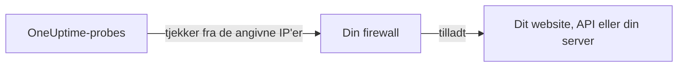

# IP-adresser

OneUptime Clouds probes tjekker dine websites, API'er og servere fra et fast sæt IP-adresser. Står der en firewall eller en tilladelsesliste foran det, du overvåger, så tillad disse adresser, så tjekkene kommer igennem.



## IP-adresser, der skal tillades

Tillad trafik fra disse adresser i din firewall:

{{IP_WHITELIST}}

> [!NOTE]
> Adresserne kan ændre sig. OneUptime giver dig besked på forhånd, når det sker. For at holde dig opdateret uden at holde øje med meddelelser kan du [hente listen](#hent-listen-programmatisk), hver gang du opdaterer din firewall.

## Hent listen programmatisk

Den samme liste leveres som JSON, uden API-nøgle, så et script kan holde dine firewallregler ajour:

```bash
curl -s https://oneuptime.com/ip-whitelist
```

```json
{
  "ipWhitelist": ["<list of IPs>"]
}
```

`ipWhitelist` er et array med én adresse pr. element. Sådan udskriver du én adresse pr. linje, for eksempel til et firewallscript:

```bash
curl -s https://oneuptime.com/ip-whitelist | jq -r '.ipWhitelist[]'
```

## Selvhostet OneUptime

På din egen instans viser denne side og endepunktet `/ip-whitelist` adresserne fra instansens indstilling `IP_WHITELIST`, en kommasepareret liste. Angiv de adresser, dine egne probes sender deres tjek fra.

:::tabs
@tab Kubernetes
Angiv Helm-chartets værdi `ipWhitelist`:

```yaml title="values.yaml"
ipWhitelist: "203.0.113.1,203.0.113.2"
```
@tab Docker Compose
`config.env` sender ikke indstillingen videre til appen. Tilføj den til miljøet for tjenesten `app` i en `docker-compose.override.yml` ved siden af `docker-compose.yml`, og start derefter OneUptime igen:

```yaml title="docker-compose.override.yml"
services:
  app:
    environment:
      IP_WHITELIST: "203.0.113.1,203.0.113.2"
```
:::

Når intet er angivet, viser denne side **No IP addresses configured.**, og endepunktet returnerer et tomt `ipWhitelist`-array.

## Næste trin

:::cards
- [Brugerdefinerede probes](/docs/probe/custom-probe): Kør en probe i dit eget netværk i stedet for at åbne firewallen.
- [Opret en monitor](/docs/monitor/create-monitor): Begynd at tjekke et website, et API eller en server.
:::
