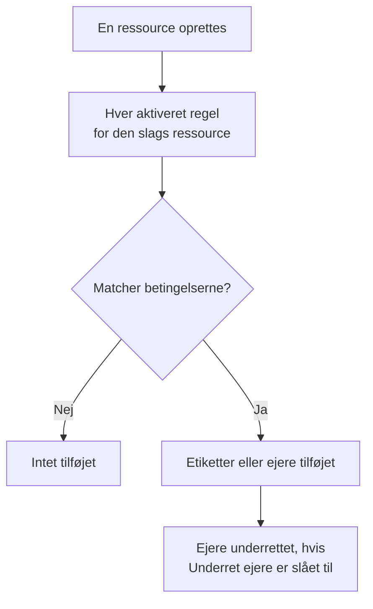

# Etiket- og ejerregler

Etiketregler og ejerregler holder orden på dine ressourcer for dig. En **etiketregel** sætter etiketter på hver ny ressource, den matcher, og en **ejerregel** tilføjer brugere og teams som ejere: så får en ny databasehændelse etiketten _Database_ og ejes af databaseteamet, uden at nogen skal huske det.

:::cards
- [Opret en regel](#opret-en-regel): To trin: hvad reglen matcher, og derefter hvad den tilføjer.
- [Nedarv etiketter og ejere](#nedarv-etiketter-og-ejere): Giv videre, hvad en begivenheds monitorer, værter og tjenester bærer.
- [Hvornår regler kører](#hvornår-regler-kører): Nye ressourcer, og **Run Now** til dem, du allerede har.
:::

## Sådan fungerer det

Regler kører, når en ressource oprettes. Hver aktiveret regel tjekker sine betingelser mod den nye ressource, og hver regel, der matcher, tilføjer det, den tilføjer.

Etiketter og ejere er det, du filtrerer og grupperer ressourcer efter, de afgør, hvem OneUptime underretter om dem, og hvad [tilladelser begrænset til etiketter eller egne ressourcer](/docs/permissions/index) når. Regler holder dem ensartede, uden at nogen skal huske det.

## Hvor du finder reglerne

Hvert produkt med etiketter og ejere har begge slags under sine **Indstillinger** (for hændelser, alarmer og planlagt vedligeholdelse under **Regler**): monitorer, hændelser og hændelsesepisoder, alarmer og alarmepisoder, planlagte vedligeholdelsesbegivenheder, statussider, tjenester, værter, Kubernetes-klynger, Docker-værter, Docker Swarm-klynger, Podman-værter, Proxmox-klynger, VMware vCentre, Ceph-klynger, storage-arrays, databaser, køer, IoT-flåder, serverless-funktioner, cloud-ressourcer, RUM-applikationer, dashboards, vagtpolitikker, vagtplaner, politikker for indgående opkald, workflows, runbooks, netværksenheder og SLO'er.

Etiketregler for monitorer ligger for eksempel under **Monitorer → Indstillinger → Etiketregler**, og etiketregler for hændelser under **Hændelser → Regler → Etiketregler**. **Indstillinger** og **Regler** er foldet sammen i sidemenuen fra start: klik på sektionens titel for at åbne den. Siderne for hændelser og alarmer har en fane **Incident Rules** (eller **Alert Rules**) og en fane **Episode Rules**.

## Opret en regel

Alle etiket- og ejerregler oprettes på samme måde, i to trin.

:::steps
### Åbn listen over regler

Åbn produktets side **Etiketregler** eller **Ejerregler**, og klik på knappen til at oprette, som er opkaldt efter reglen, for eksempel **Opret Monitor Label Rule**.

### Vælg, hvad reglen matcher

I trinnet **Match** skal du klikke på **Tilføj betingelse** for hver betingelse, ressourcen skal opfylde. Med to eller flere vælger du **Alle skal matche** eller **Én skal matche**. En regel uden betingelser matcher alle nye ressourcer.

### Vælg, hvad reglen tilføjer

I trinnet **Etiketter** vælger du **Etiketter at tilføje**. I en ejerregel hedder trinnet **Ejere**: **Tilføj ejer** åbner én liste med personer og teams.

**Navn** udfyldes ud fra det, du vælger (_Tilføj Production_, _Tilføj Platform som ejere_), og følger dine valg, indtil du skriver et navn selv. En regel, der kun nedarver, får i stedet navn efter det, den nedarver fra (se nedenfor).

### Tjek de sammenfoldede felter

**Flere felter** indeholder den valgfri **Beskrivelse** og, i en ejerregel, **Underret ejere**, som er slået til som standard: de ejere, en regel tilføjer, får samme underretning "du er blevet tilføjet som ejer" som en ejer, der tilføjes manuelt. Slå den fra for at tilføje ejere uden at underrette dem.

### Gem reglen

I det sidste trin klikker du igen på knappen, der er opkaldt efter reglen, for eksempel **Opret Monitor Label Rule**. Reglen starter som aktiveret, og listen viser den med et grønt mærke **Aktiveret**.
:::

En ny regel skal tilføje noget: mindst én etiket (eller ejer) eller, i en regel for hændelser, alarmer eller planlagt vedligeholdelse, noget den nedarver (se nedenfor). For at sætte en regel på pause uden at slette den slår du **Aktiveret** fra i dens redigeringsformular; listen viser så et rødt mærke **Deaktiveret**.

### Uanset hvordan reglen oprettes

Det samme gælder for en regel, der oprettes via API'et, Terraform, et workflow eller en [import af etiketregler](/docs/configuration/label-rule-import-export): OneUptime afviser en ny regel, der ikke tilføjer noget, med én besked, der nævner de felter, der skal udfyldes. Beskederne er på engelsk på alle sprog.

| Regel | Besked |
| --- | --- |
| Etiketregel | This label rule adds nothing. Choose at least one label in Labels to Add. |
| Etiketregel for hændelser, alarmer eller planlagt vedligeholdelse | This label rule adds nothing. Choose at least one label in Labels to Add, or turn on an Inherit Labels switch. |
| Ejerregel | This owner rule adds nothing. Choose at least one user or team in Owner Users or Owner Teams. |
| Ejerregel for hændelser, alarmer eller planlagt vedligeholdelse | This owner rule adds nothing. Choose at least one user or team in Owner Users or Owner Teams, or turn on an Inherit Owners switch. |

- **API**: sæt `labelsToAdd` (eller `ownerUsers` / `ownerTeams`) til mindst én post i projektet, eller en af reglens kontakter `inheritLabelsFrom…` (`inheritOwnersFrom…`) til `true`, en JSON-boolean.
- **Terraform**: en ressource for en etiket- eller ejerregel, der ikke tilføjer noget, fejler ved `terraform apply` med beskeden ovenfor. Giv den `labels_to_add` (eller `owner_users` / `owner_teams`), eller slå en af dens nedarvningskontakter til.

Regler, du allerede har, røres ikke: se [Rediger en regel](#rediger-en-regel).

## Nedarv etiketter og ejere

Regler for hændelser, alarmer og planlagt vedligeholdelse kan også give videre, hvad de ressourcer, en begivenhed berører, bærer. Under **Etiketter at tilføje** (eller **Ejere**) indeholder den sammenfoldede sektion **Nedarv etiketter** (eller **Nedarv ejere**) seks kontakter:

- **Nedarv etiketter fra overvågninger**: hver etiket på hændelsens monitorer sættes også på hændelsen. En alarm har én monitor, så i en alarmregel hedder kontakten **Nedarv etiketter fra overvågning** (og i en ejerregel for alarmer **Nedarv ejere fra overvågning**).
- **Nedarv etiketter fra værter**, **Nedarv etiketter fra Kubernetes-klynger**, **Nedarv etiketter fra Docker-værter**, **Inherit Labels From Podman Hosts** og **Nedarv etiketter fra tjenester** gør det samme for de ressourcer.

Ejerregler har de samme seks kontakter for ejere (**Nedarv ejere fra overvågninger** og så videre). Så længe ingen kontakt er slået til, fortæller den sammenfoldede sektion, hvad den bruges til; i en regel, der nedarver, åbner den af sig selv. Episoderegler har ingen nedarvningskontakter.

En regel, der nedarver, kan lade **Etiketter at tilføje** (eller **Ejere**) være tom: den tilføjer det, den nedarver. Sådan en regel får navn efter det, den nedarver fra:

| Kontakter slået til | Navn |
| --- | --- |
| **Nedarv etiketter fra overvågninger** | _Nedarv etiketter fra: monitorer_ |
| **Nedarv etiketter fra overvågninger** og **Nedarv etiketter fra værter** | _Nedarv etiketter fra: monitorer, værter_ |
| **Nedarv etiketter fra overvågning**, i en alarmregel | _Nedarv etiketter fra: overvågning_ |

Navnet følger kontakterne, indtil du vælger en etiket (så får reglen navn efter sine etiketter) eller skriver et navn selv.

## Rediger en regel

En regels redigeringsformular har de samme to trin og tilføjer kontakten **Aktiveret**. Den insisterer ikke på, hvad reglen tilføjer: en regel, der blev gemt, før OneUptime spurgte (via API'et, Terraform, en import eller den gamle formular), tilføjer måske slet ingenting, og en redigering kan fjerne alt, hvad en regel tilføjer.

Sådan en regel kan stadig omdøbes, slås fra eller slettes, også via API'et og Terraform. Listen markerer en regel, der ikke tilføjer noget, med **Tilføjer intet** ved siden af dens status, og det samme gør reglens egen side. Rediger den for at vælge, hvad den tilføjer, eller slet den.

## Hvornår regler kører

Hver aktiveret regel kører, når en ressource oprettes, fra dashboardet eller via API'et, og hver regel, der matcher, tilføjer det, den tilføjer:

- Matcher flere regler, tilføjer de alle deres etiketter og ejere.
- En regel fjerner aldrig noget: hverken etiketter eller ejere, som nogen har tilføjet manuelt, eller dem, den selv har tilføjet.
- En deaktiveret regel gør ingenting.

En regel, du skriver i dag, gælder for de ressourcer, der oprettes bagefter. For at anvende den på dem, du allerede har, bruger du **Run Now**: se [Kør regler på eksisterende ressourcer](/docs/configuration/run-rules-now). Etiketregler kan også kopieres mellem projekter: se [Import og eksport af etiketregler](/docs/configuration/label-rule-import-export).

## Næste trin

:::cards
- [Kør regler på eksisterende ressourcer](/docs/configuration/run-rules-now): Anvend en regel på de ressourcer, du allerede har.
- [Import og eksport af etiketregler](/docs/configuration/label-rule-import-export): Kopiér etiketregler mellem projekter som JSON.
- [Hændelsesindstillinger og automatisering](/docs/incidents/settings): De andre regler, en hændelse kan køre.
- [Etiket- og ejerregler for SLO'er](/docs/slo/label-and-owner-rules): Hvad SLO-regler matcher på.
:::
