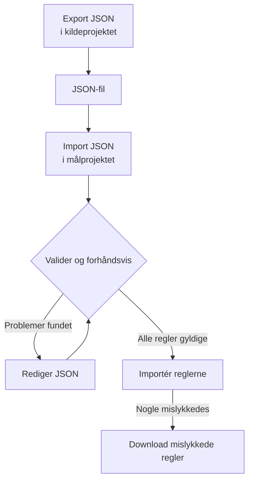

# Import og eksport af etiketregler

Kopiér etiketregler mellem projekter, eller opret mange på én gang, som en JSON-fil. Hver side **Etiketregler** har handlingerne **Export JSON** og **Import JSON** i sin menu **Flere indstillinger** (**⋯**), også for hændelser, alarmer, monitorer og netværksenheder. Den eneste undtagelse er VMware: dets etiketregler for vCentre har ingen af dem.



## Eksportér regler

Åbn **Flere indstillinger**, og vælg **Export JSON** for at downloade alle regler af den type i det aktuelle projekt. Eksporten omfatter regler på andre sider af tabellen og ignorerer tabelfiltre.

Filen bevarer hver regels status (aktiveret eller ej), betingelser, etiketter at tilføje og indstillinger for nedarvning af etiketter. Projekt-id'er, regel-id'er og revisionsfelter udelades.

Tilknyttede etiketter, monitorer og alvorsgrader skrives med deres præcise navn. En import opretter dem ikke: de skal allerede findes i målprojektet.

## Importér regler

:::steps
### Åbn Import JSON

Åbn målprojektets side **Etiketregler**, og vælg **Flere indstillinger → Import JSON**.

### Tilføj filen

Upload en JSON-eksportfil, eller indsæt dens indhold.

### Valider og forhåndsvis

Vælg **Validate and preview**. Hver regel kontrolleres, før nogen oprettes, og de ressourcer, der henvises til, skal findes i målprojektet med entydige, matchende navne.

### Gennemgå forhåndsvisningen

Kontrollér reglernes navne, status, etiketter og betingelser. En stor batch vises én side ad gangen. For at rette noget vælger du **Edit JSON** og validerer igen.

### Importér

Vælg importknappen, som tæller reglerne (for eksempel **Import 2 rules**), og hold vinduet åbent, indtil resultaterne vises.
:::

Importer tilføjer nye regler og beholder de eksisterende, så hvis du importerer den samme fil igen, oprettes endnu en kopi. De sædvanlige tilladelser til oprettelse og serverens validering gælder for hver regel.

Hvis nogle regler mislykkes, vælger du **Download failed rules** for kun at gemme de rækker, retter dem og importerer den fil igen. Hvis en anmodning får timeout, så tjek listen over regler, før du prøver igen: serveren kan have gemt reglen, før svaret gik tabt.

## Opret en batch i JSON

Eksportér en eksisterende regel for at få et eksempel til din ressourcetype, og rediger eller tilføj derefter poster i arrayet `items`. Dette eksempel opretter to etiketregler for monitorer. Etiketterne `Production` og `Infrastructure` skal allerede findes i målprojektet.

```json title="monitor-label-rules.json"
{
  "fileType": "oneuptime-label-rules",
  "schemaVersion": 1,
  "resourceType": "MonitorLabelRule",
  "items": [
    {
      "name": "Production API monitors",
      "description": "Label production API monitors automatically",
      "isEnabled": true,
      "monitorNamePattern": "^api-prod-",
      "monitorLabels": [],
      "labelsToAdd": ["Production"]
    },
    {
      "name": "Database monitors",
      "isEnabled": false,
      "monitorNamePattern": "^database-",
      "labelsToAdd": ["Infrastructure"]
    }
  ]
}
```

| Felt | Hvad det indeholder |
| --- | --- |
| `fileType` | Altid `oneuptime-label-rules`. |
| `schemaVersion` | Altid `1`. |
| `resourceType` | Den slags regel, filen indeholder, som `MonitorLabelRule`. |
| `items` | Reglerne, ét objekt pr. regel. En fil skal have mindst én. |

Brug JSON-booleans til `isEnabled`, tekst til mønstre og arrays af navne til tilknyttede ressourcer.

Følgende stopper hele batchen før importtrinnet: ugyldige mønstre, ukendte felter, manglende navne og tvetydige henvisninger. Det gør en regel, der ikke tilføjer noget, også (et tomt `labelsToAdd` og, i en regel for hændelser, alarmer eller planlagt vedligeholdelse, ingen kontakt `inheritLabelsFrom…` sat til `true`), fordi OneUptime nægter at oprette sådan en (se [Etiket- og ejerregler](/docs/configuration/label-and-owner-rules#uanset-hvordan-reglen-oprettes)). En eksport kan indeholde sådan en regel, hvis den blev gemt før denne kontrol; giv den en etiket, eller fjern den fra filen, før du importerer.

> [!NOTE]
> Filer og indsat JSON er begrænset til 10 MB.

## Kopiér mellem ressourcetyper

Behold den oprindelige `resourceType` i filen, og åbn **Import JSON** på målsiden. Kompatible mønstre for primært navn eller titel, beskrivelsesmønstre og forudsatte etiketter knyttes til målets felter, og forhåndsvisningen viser disse tilknytninger, så du kan gennemgå dem. Henvisninger til alvorsgrader for hændelser og alarmer sammenholdes med målets navne på alvorsgrader.

Betingelser eller handlinger, som målet ikke understøtter, blokerer importen. For eksempel kan en hændelsesregel, der er begrænset til bestemte monitorer, ikke kopieres til regler for netværksenheder uden at redigere de betingelser.

> [!WARNING]
> Etiketregler for netværksenheder og SLO'er understøtter jokertegn ud over regulære udtryk. En overførsel mellem de regler og andre regeltyper afviser mønstre, der indeholder `*` eller omgivende mellemrum, fordi de matcher anderledes der. Rediger mønstrene til målet, eller hold reglen inden for samme ressourcetype. Etiketregler for netværksenheder og SLO'er kan udveksle ethvert mønster med hinanden, fordi de matcher på samme måde.

## Næste trin

:::cards
- [Etiket- og ejerregler](/docs/configuration/label-and-owner-rules): Hvad en etiketregel matcher, og hvad den tilføjer.
- [Kør regler på eksisterende ressourcer](/docs/configuration/run-rules-now): Anvend importerede regler på de ressourcer, du allerede har.
:::
