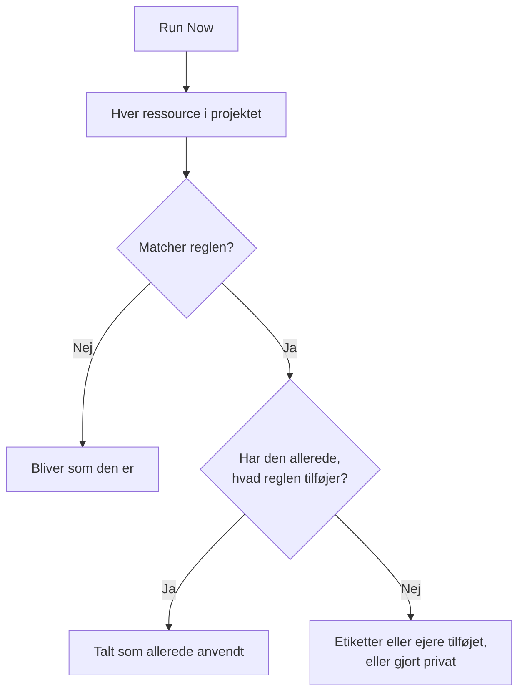

# Kør regler på eksisterende ressourcer

Etiketregler, ejerregler og privatlivsregler kører automatisk, når en ressource **oprettes**. En regel, du skriver i dag, gør derfor intet ved de monitorer, hændelser eller værter, du allerede har. **Run Now** lukker det hul: den anvender én regel på hver ressource, der allerede findes i projektet.

## Hvilke regler kan køres

- **Etiketregler** og **Ejerregler**, for hver ressource, der har dem: monitorer, hændelser, hændelsesepisoder, alarmer, alarmepisoder, planlagte vedligeholdelsesbegivenheder, statussider, tjenester, værter, Kubernetes-klynger, Docker-værter, Docker Swarm-klynger, Podman-værter, Proxmox-klynger, VMware vCentre, Ceph-klynger, storage-arrays, databaser, køer, IoT-flåder, serverless-funktioner, cloud-ressourcer, RUM-applikationer, dashboards, vagtpolitikker, vagtplaner, politikker for indgående opkald, workflows, runbooks, netværksenheder og SLO'er.
- **Privatlivsregler**, for hændelser, alarmer, hændelsesepisoder og alarmepisoder.
- **Monitor Rules** på en statusside. De synkroniserer allerede siden igen, hver gang en regel gemmes; at køre en synkroniserer den med det samme.
- **Monitor Rules** på et SLO. De synkroniserer allerede SLO'et igen, hver gang en regel gemmes; at køre en synkroniserer SLO'ets monitorer med det samme. Se [Monitorer og monitorregler](/docs/slo/monitor-rules).

Regler, der udfører en handling i stedet for at beskrive en ressource (**Vagtregler**, **Runbook-regler**, **Regler for automatisk afhjælpning** og **Grupperingsregler**), kan ikke køres på eksisterende poster. At køre dem ville tilkalde folk, køre runbooks, starte rettelser eller omorganisere episoder for hændelser, der allerede er overstået.

## Før du begynder

For at køre en regel skal du have tilladelse til at redigere reglen **og** til at redigere de ressourcer, den ændrer: en etiketregel for monitorer kræver for eksempel både redigeringstilladelsen for etiketregler for monitorer og den for monitorer. Ejerregler kræver også tilladelse til at tilføje ejere. Monitorregler på en statusside eller et SLO kræver kun tilladelse til at redigere reglen.

> [!IMPORTANT]
> En tilladelse, der er begrænset til bestemte etiketter eller til ressourcer, du ejer, er ikke nok: en kørsel kan ændre alle ressourcer i projektet. Teams' bloklister gælder som alle andre steder, og en blokering begrænset til nogle etiketter tæller også: en kørsel ville ændre de ressourcer, der har de etiketter, så en blokering med etiketter på redigering af de ressourcer, en regel ændrer, afviser kørslen.

Et netværks regler kræver det samme, når du kører dem på de enheder, du allerede har. **Run Now** for en regel for webstedstildeling eller enhedsetiketter kræver tilladelse til at redigere reglen og **Edit Network Device**. **Dry Run** og **Run Rule** for en regel for automatisk import kræver tilladelse til at redigere reglen, **Create Network Device** og, når reglen har en monitorskabelon, **Create Monitor**. Hver af dem skal omfatte hele projektet. Se [Automatisk import med regler for automatisk import](/docs/monitor/network-device-monitor#importing-automatically-with-auto-import-rules).

## Kør én regel

:::steps
### Åbn listen over regler

Åbn siden med regler, for eksempel **Monitorer → Indstillinger → Etiketregler**.

### Vælg Run Now

Åbn menuen **⋯** for enden af reglens række, og vælg **Run Now**, eller vælg **Vis** og derefter **Run Now** på reglens egen side. En dialogboks fortæller, hvad kørslen vil gøre.

### Vælg, om nye ejere skal underrettes

For en ejerregel vælger du, om du vil **Notify the owners this run adds**. Det er slået fra som standard og virker kun, når reglen selv har **Underret ejere** slået til. En ejer underrettes én gang for hver ressource, vedkommende tilføjes til.

### Start reglen

Vælg **Run Rule**, og hold dialogboksen åben. I et stort projekt viser dialogboksen, hvor langt kørslen er nået.

### Læs rapporten

Når kørslen er færdig, fortæller dialogboksen, hvor mange ressourcer reglen matchede, hvor mange den ændrede, og hvor mange der allerede havde det, reglen tilføjer.
:::

## Kør flere regler

Vælg regler i tabellen, åbn menuen med massehandlinger, og vælg **Run Now**. De valgte regler kører efter hinanden.

- Ejere, der tilføjes af en massekørsel, underrettes aldrig. Kør i stedet en enkelt regel for at underrette dem.
- En regel, der ikke kan køre (for eksempel fordi den er deaktiveret), vises med årsagen, og de andre regler kører alligevel.

## Hvad en kørsel gør

- **Den tilføjer kun.** Etiketter sættes på, ejere tilføjes, ressourcer gøres private. Intet fjernes, og intet gøres offentligt, så det er sikkert at køre en regel igen: den anden kørsel melder, at alt allerede var anvendt.
- **Hver ressource i projektet vurderes**, også løste hændelser og alarmer.
- **Eksisterende ejere springes over**, de tilføjes aldrig to gange.
- **Kun dit projekts egne etiketter tilføjes.** En etiket, som reglen nævner, og som ikke længere er en af dit projekts etiketter, springes over, og reglens andre etiketter tilføjes alligevel. Det samme gælder, når en regel kører på en ny ressource.
- **Reglen anvendes på samme måde som ved oprettelse**, inklusive etiketter og ejere, der nedarves fra en hændelses monitorer, værter og tjenester. Hvor ressourcen har et aktivitetsfeed, registrerer feedet, hvilken regel der ændrede den.
- **Deaktiverede regler kører ikke.** Aktivér reglen først.
- **Monitorregler for statussider** tilføjer de monitorer, de matcher, og fjerner de monitorer, de tidligere har tilføjet, men ikke længere matcher. Monitorer, der er tilføjet siden manuelt, røres aldrig.
- **En enkelt kørsel omfatter op til 100.000 ressourcer.** I et større projekt stopper kørslen og siger det; kør reglen igen for at fortsætte.

## Næste trin

:::cards
- [Etiket- og ejerregler](/docs/configuration/label-and-owner-rules): Skriv de regler, en kørsel anvender.
- [Import og eksport af etiketregler](/docs/configuration/label-rule-import-export): Hent først etiketregler ind fra et andet projekt.
- [Hændelsesindstillinger og automatisering](/docs/incidents/settings): Regler for hændelser, inklusive privatlivsregler.
:::
