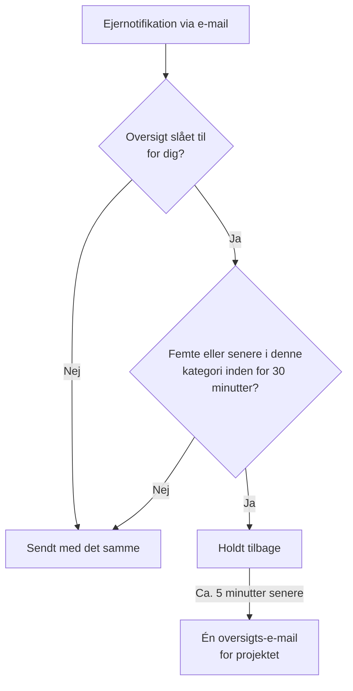

# Notifikationsoversigt

Når noget går rigtig galt, går det sjældent galt kun én gang. En ustabil upstream-forbindelse vælter fyrre monitorer, fyrre hændelser bliver erklæret, kvitteret og løst, og hver ejer får en e-mail for hvert trin: to hundrede beskeder i én indbakke, og ingen læser dem længere.

OneUptime samler automatisk sådanne bølger i én e-mail. Det er slået til for alle, og der er intet at konfigurere — men hvis du hellere vil have hver notifikation som sin egen e-mail, kan du [slå oversigten fra for dig selv](#slå-oversigten-fra-for-dig-selv), ét projekt ad gangen.

:::cards
- [Sådan virker det](#sådan-virker-det): Fire e-mails sendes med det samme; resten kommer samlet.
- [Det, der aldrig samles](#det-der-aldrig-samles): Vagtkald, sikkerheds-, fakturerings- og abonnent-e-mails.
- [Slå oversigten fra](#slå-oversigten-fra-for-dig-selv): Få igen hver notifikation som sin egen e-mail.
- [Færre rutine-e-mails](#skru-yderligere-ned): Slå de informative e-mails fra på én gang.
:::

## Sådan virker det

Hver ejernotifikation via e-mail, du modtager, tælles mod et lille budget, der holdes pr. projekt, pr. modtager, pr. e-mailadresse og pr. **kategori** af ressource — hændelser, alarmer, monitorer, planlagt vedligeholdelse, statussider, prober, SLO'er og så videre.



- De **første fire** e-mails i en kategori inden for et vilkårligt tredive minutters vindue sendes med det samme, præcis som altid. Samme emne, samme skabelon, samme links.
- Den **femte og hver senere** e-mail i det vindue holdes tilbage.
- Cirka fem minutter senere kommer alt, hvad der er holdt tilbage til dig i det projekt — på tværs af alle kategorier — som **én** e-mail, der oplister, hvad der skete, med et link til hver ressource.

Oversigten indeholder de notifikationer, du stadig abonnerer på, når den sendes. Slår du e-mailen for en hændelsestype fra, mens dens notifikationer står i kø, udelades de notifikationer fra oversigten. Slår du e-mailen til igen senere, sendes de oversprungne opdateringer ikke igen.

Under tærsklen gør funktionen slet ingenting. Et projekt, der laver tre ejer-e-mails om dagen, sender stadig de tre e-mails hver for sig.

## Sådan ser oversigts-e-mailen ud

Emnelinjen fortæller dig omfanget _og typen_ af stormen, før du åbner den:

```text
[Acme Production] 112 notifications: 63 Monitors, 41 Incidents, 6 Alerts +2 more
```

Indeni giver et oversigtskort det samlede antal, det tidsrum oversigten dækker, og fordelingen pr. kategori. Derunder er notifikationerne grupperet i én sektion pr. kategori, den mest presserende først — hændelser, så alarmer, så de monitorer og prober, der opdagede dem — så det første under oversigten også er det første, der er et klik værd.

Hver sektion har én række pr. ressource i stedet for én række pr. hændelse:

- **Rækkerne viser, hvor en ressource endte.** Blev en hændelse oprettet, så kvitteret og så løst, er det én enkelt række i den seneste tilstand, hvilket gør oversigten _mere_ aktuel, end tre separate e-mails ville have været.
- **Tallene stemmer.** Hver række har tidspunktet for den seneste opdatering, og en række, der har opsuget flere, siger hvor mange, så sektionerne og oversigtskortet altid giver samme total.
- **Alvorlighed og tilstand vises.** Kort for alarmer og hændelser viser alvorlighed og tilstand fra den seneste notifikation, inklusive egne navne. Ældre notifikationer i kø uden disse oplysninger vises stadig, blot uden de manglende etiketter.

Tidspunkter vises i UTC, også med dato, når en oversigt spænder over mere end én dag.


## Det, der aldrig samles

Oversigten berører kun notifikationer til ejere og medlemmer — familien "noget, du er ansvarlig for, har ændret sig". Den kan ikke nå andet, fordi den ligger i den ene kodesti, som disse notifikationer tager, og ingen andre.

Aldrig forsinket og aldrig talt med:

| Kategori | Eksempler |
| ----------------------------------------- | ---------------------------------------------------------------------------------------------------- |
| Vagtkald | Hvert kald fra en eskaleringspolitik og hver anmodning om kvittering |
| Vagttider | "Du har vagt nu", "du har vagt som den næste", "din vagt begynder snart", "din vagt blev omfordelt" |
| Kontosikkerhed | Nulstilling af adgangskode, bekræftelse af e-mail, adgangskode ændret, backupkode til totrinsbekræftelse brugt eller genereret igen |
| Administrative meddelelser om din konto | En administrator har ændret dine notifikationsmetoder eller dine vagtregler |
| Fakturering og saldo | Fakturaer, forfaldent abonnement, "vi kunne ikke kalde nogen, fordi kortet blev afvist" |
| Instansens tilstand | Advarsler om Postgres, Valkey og ClickHouse til instansens administratorer |
| Abonnenter på statussider | Hver e-mail, din statusside sender til dine egne abonnenter |
| SLA-brud | Sendes med det samme, selv om de genbruger notifikationstypen for oprettede hændelser |

Kun e-mail er berørt. SMS, opkald, pushnotifikationer, WhatsApp, Telegram, Slack, Microsoft Teams og webhooks leveres med det samme, præcis som før — også for de notifikationer, hvis e-mail blev holdt tilbage.

## Grænser

| Grænse | Værdi |
| --- | --- |
| Notifikationer i én oversigts-e-mail | Højst **500**. Resten bliver i køen og sendes med næste oversigt, højst fem minutter senere. |
| Viste rækker i én oversigts-e-mail | Højst **100**. Rækker lægges sammen pr. ressource, så det er 100 forskellige ressourcer; derudover angiver e-mailen de fulde totaler og linker til projektet. |
| Oversigts-e-mails til én modtager fra ét projekt | Højst **12** i timen. |
| Ekstra forsinkelse for en tilbageholdt notifikation | Cirka seks minutter i værste fald. |

Loftet pr. time håndhæves af databasen, ikke af en timer, så det holder også under en storm, der varer i timevis.

## Slå oversigten fra for dig selv

Nogle vil gerne have samlingen. Andre arkiverer hver notifikation, når den lander, eller lader noget andet gøre det med indbakken, og en oversigts-e-mail ødelægger det. Derfor kan oversigten slås fra, pr. person og pr. projekt.

:::steps
### Åbn E-mailindstillinger

Gå i projektet til **Brugerindstillinger → E-mailindstillinger** — den samme side, som hver oversigts-e-mail linker til nederst.

### Slå Email Rollup fra

Slå kontakten fra i kortet **Email Rollup**. Det gemmes af sig selv, og kortet viser derefter "Off: every notification arrives as its own email, immediately."
:::

Når den er slået fra, sendes hver ejer- og medlemsnotifikation via e-mail i det projekt igen til dig enkeltvis og med det samme: samme emne, samme skabelon, samme links, ingen tærskel og ingen ventetid på fem minutter. Det, der allerede står i kø til dig, når du slår den fra, kommer stadig som en sidste oversigt et par minutter senere; alt derefter kommer ét ad gangen.

Kontakten er **kun din og gælder ét projekt**. Slår du den fra, ændrer det ikke, hvad dine kolleger modtager, og den gælder ikke på tværs af projekter — så det larmende produktionsprojekt kan blive ved med at samle, mens det stille interne projekt sender alt enkeltvis, eller omvendt. Den er slået til for alle, indtil de slår den fra.

Hvad den **ikke** berører:

- **Hvilke notifikationer du får.** Det er indstillingen pr. hændelsestype og pr. kanal under **Brugerindstillinger → Notifikationsindstillinger**, en side længere henne. Oversigten og denne kontakt ændrer kun, hvor mange e-mails notifikationerne pakkes i.
- **Vagtkald og vagt-e-mails**, **e-mails om kontosikkerhed**, **fakturerings-e-mails**, advarsler om instansens tilstand og e-mails til statusside-abonnenter. Intet af det samles nogensinde, så det ændrer intet for dem at slå oversigten fra — se [Det, der aldrig samles](#det-der-aldrig-samles).
- **Alle andre kanaler.** SMS, opkald, push, WhatsApp, Telegram, Slack, Microsoft Teams og webhooks er allerede øjeblikkelige.

## Skru yderligere ned

Oversigten pakker rutineopdateringer sammen; du kan også helt holde op med at få de fleste af dem.

:::steps
### Åbn indstillingerne fra en oversigts-e-mail

Åbn linket til indstillingerne nederst i en oversigts-e-mail, eller gå til **Brugerindstillinger → E-mailindstillinger**.

### Vælg Reduce routine emails

Vælg **Reduce routine emails** i kortet **Fewer routine emails**. Når ændringen er gemt, viser kortet **Rutine-e-mails slået fra.**
:::

Det slår disse informative e-mails fra for dig i det aktuelle projekt:

- Noter på hændelser, alarmer, episoder og planlagt vedligeholdelse.
- Meddelelser om, at du er tilføjet som ejer af en ressource.
- Nye monitorer og statussider.
- Hændelser eller alarmer, der er føjet til eksisterende episoder.
- At blive føjet til eller fjernet fra en vagtpolitik.

Dine nuværende valg for oprettelse af hændelser og alarmer, tilstandsændringer, påmindelser, tildeling af hændelser, monitorers tilstand og vagter bevares, og ingen e-mail, du havde slået fra, slås til. Vagtkald, andre leveringskanaler, konto-e-mails, fakturerings-e-mails og e-mails til statusside-abonnenter berøres ikke.

Ændringerne gemmes samlet. Gennemgå kontakterne pr. hændelse under **Brugerindstillinger → Notifikationsindstillinger** for at slå en enkelt e-mail til igen. Disse indstillinger gælder også for notifikationer, der venter på en oversigt; en e-mail, der allerede er sendt, kan ikke kaldes tilbage. E-mailoversigten er stadig en særskilt indstilling, der styrer samlingen af de hændelser, du beholder.

## Fejlfinding

:::details En notifikations-e-mail kom et par minutter for sent
Den var den femte eller en senere e-mail i sin kategori inden for tredive minutter, så den blev holdt tilbage og sendt i en oversigt cirka fem minutter senere. Se efter en oversigts-e-mail fra samme projekt: Notifikationen er en række i den. Vagtkald og de andre kanaler blev ikke forsinket.
:::

:::details Jeg slog oversigten fra og fik alligevel en oversigts-e-mail
Notifikationer, der allerede stod i kø til dig, da du slog den fra, kommer som en sidste oversigt et par minutter senere. Alt derefter kommer som én e-mail ad gangen.
:::

:::details En forventet opdatering mangler i en oversigts-e-mail
Hver række viser en ressource i dens seneste tilstand, så en hændelse, der blev oprettet, kvitteret og løst, er én række med antallet af opdateringer, den har opsuget. En notifikation udelades også, hvis du slog e-mailen for den hændelsestype fra under **Brugerindstillinger → Notifikationsindstillinger**, mens den stod i kø.
:::

## Næste trin

:::cards
- [SMTP-konfiguration](/docs/emails/smtp): Send OneUptimes e-mails gennem din egen mailserver.
- [Eskaleringsregler](/docs/on-call/escalation-rules): Sådan når vagtkald frem til folk, aldrig samlet.
:::
