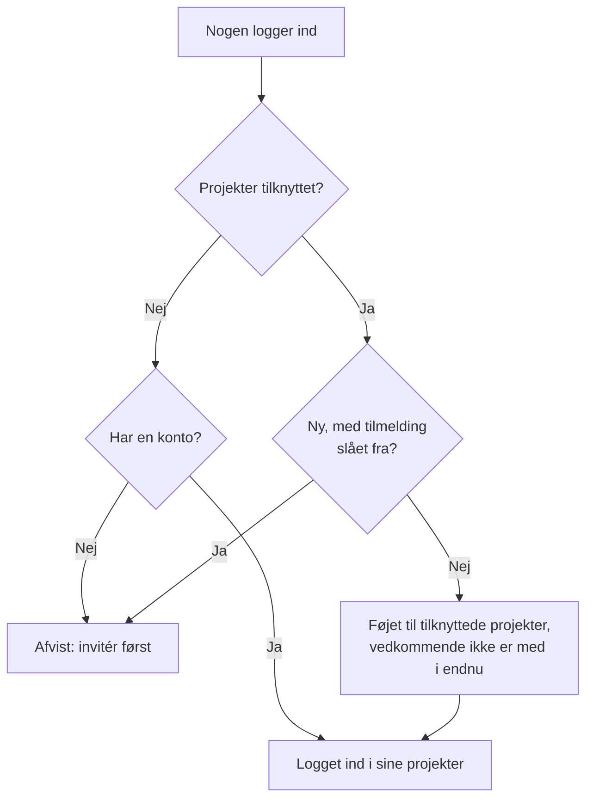

# Global SSO

Med global SSO opsætter en OneUptime-**instansadministrator** (master-admin) **én gang**, på instansniveau, en SAML 2.0- eller OpenID Connect-identitetsudbyder (OIDC) og forbinder den med ethvert projekt på serveren. I stedet for at hver projektejer opsætter sin egen identitetsudbyder, opsætter en master-admin én, der betjener hele instansen.

> [!NOTE]
> Global SSO, herunder den instansdækkende kontakt "Require SSO for Login", er en del af alle OneUptime-udgaver: alle selvhostede instanser har det, også Community Edition, og det kræver ingen licens. Det hører til instansadministrationen og gælder derfor ikke for OneUptime Cloud. Se [Enterprise Edition](/docs/self-hosted/enterprise) for, hvad hver udgave indeholder.

:::cards
- [Opsæt en udbyder](#opsætning-af-global-sso): Opret den, giv din identitetsudbyder OneUptimes URL'er, og test den.
- [Sådan logger brugere ind](#sådan-logger-brugere-ind): Kun eksisterende medlemmer, eller nye personer føjet til de projekter, du tilknytter.
- [Gennemtving SSO](#gennemtving-sso): Kræv SSO for ét projekt eller for hele instansen.
- [Slå en udbyder fra](#slå-en-udbyder-fra-eller-slet-den): Hvad der ophører, og hvilke ændringer OneUptime afviser.
:::

## Global SSO og projekt-SSO

|                    | Projekt-SSO                                       | Global SSO                                          |
| ------------------ | ------------------------------------------------- | --------------------------------------------------- |
| Opsættes af        | Projektejer/-administrator (Projektindstillinger) | Instansens master-admin (Admin Dashboard)           |
| Omfang             | Ét enkelt projekt                                 | Hele instansen, kan forbindes med ethvert projekt   |
| Resultat af login  | Adgang til det ene projekt                        | Adgang til alle projekter, brugeren kan nå          |

Se [SSO](/docs/identity/sso) for et enkelt projekts egen udbyder.

## Opsætning af global SSO

:::steps
### Åbn listen over udbydere

:::tabs
@tab SAML
Log ind som master-admin, og åbn Admin Dashboard med **Admin-indstillinger** i din brugermenu. Gå derefter til **Indstillinger** > **Godkendelse** > **Global SSO**.
@tab OpenID Connect
Log ind som master-admin, og åbn Admin Dashboard med **Admin-indstillinger** i din brugermenu. Gå derefter til **Indstillinger** > **Godkendelse** > **Global OIDC**.
:::

### Opret udbyderen

:::tabs
@tab SAML
- Klik på **Create Global SSO**.
- Indtast et **Navn**, **Sign On URL** og **Issuer** fra din identitetsudbyder, og indsæt **Public Certificate**. Resten er allerede udfyldt under **Flere felter**: **Signature Method** (`RSA-SHA256`), **Digest Method** (`SHA256`) og en beskrivelse (`Sign in with` og navnet). Ændr dem kun, hvis din IdP kræver det. Når du gemmer, åbnes udbyderens side.
@tab OpenID Connect
- Klik på **Create Global OIDC**.
- Indtast et **Navn**, **Issuer URL** samt **Client ID** og **Client Secret** for den app, du har registreret i din IdP. Det virker også at indsætte IdP'ens discovery-URL i **Issuer URL**. Resten er allerede udfyldt under **Flere felter**: **Discovery URL** (udstederen efterfulgt af `/.well-known/openid-configuration`), **Scopes** (`openid email profile`), claim-navnene `email` og `name` og en beskrivelse (`Sign in with` og navnet). Ændr dem kun, hvis din IdP kræver det. Når du gemmer, åbnes udbyderens side.
:::

### Kopiér OneUptimes URL'er til din identitetsudbyder

:::tabs
@tab SAML
På udbyderens side viser kortet **Identity Provider URLs** **ACS URL (Assertion Consumer Service / Reply URL)** og **Issuer (Entity ID)**. Indsæt begge i din identitetsudbyder (Okta, Microsoft Entra ID, OneLogin, JumpCloud og andre).
@tab OpenID Connect
På udbyderens side viser kortet **Identity Provider URL** **Redirect URI (Callback URL)**. Tilføj den til din identitetsudbyders tilladte redirect-URI'er.
:::

### Slå udbyderen til

En ny udbyder starter slået fra. Klik på **Edit Configuration** på udbyderens side, og slå **Aktiveret** til.

At slå en global udbyder til tilføjer kun en mulighed "Sign in with SSO" på loginsiden — den gennemtvinger aldrig SSO og udelukker ingen, så den er sikker at slå til, teste og slå fra igen, hvis det er nødvendigt.

### Test udbyderen

Brug linket i kortet **Test this SSO provider** (**Test this OIDC provider** for OpenID Connect) til at gennemføre et komplet login via din identitetsudbyder. Du behøver ikke tilknytte projekter først: testen logger dig ind i de projekter, du allerede er med i. Udbyderen skal være slået til, for at linket virker.
:::

## Sådan logger brugere ind

Hvordan en global udbyder opfører sig, afhænger af, om du tilknytter projekter til den:

- **Ingen projekter tilknyttet (alle projekter / invitation først):** Brugere kan logge ind med udbyderen og nå **ethvert projekt, de allerede er medlem af**. Nye brugere oprettes **ikke** automatisk — en bruger skal først inviteres til et projekt. Brug det til virksomhedsdækkende SSO, hvor medlemskaber styres andetsteds.

- **Projekter tilknyttet (automatisk klargøring):** Åbn udbyderen og brug tabellen **Attached Projects** til at tilknytte et eller flere projekter, hver med et sæt standardteams. Brugere, der logger ind, **klargøres automatisk** i disse projekter og tilføjes til standardteamene ved første login. Et projekt, du tilknytter, starter med sit medlemsteam; vælg andre teams, hvis nye brugere skal starte med en anden adgang. Tilføj ét projekt + teams ad gangen for at opbygge listen; for at ændre en tilknytning skal du slette den og tilføje den igen.

En person, der allerede er medlem af et tilknyttet projekt, beholder sine teams der.

To kontakter på udbyderen ændrer dette. Begge starter slået fra, foldet sammen under **Flere felter**:

| Kontakt | Hvad den gør, når den er slået til |
| --- | --- |
| **Disable Sign Up with SSO** | Personer skal være inviteret til et projekt, før de kan logge ind med denne udbyder, også når der er tilknyttede projekter. Ingen nye oprettes ved deres første login. |
| **Restrict to Attached Projects** | Login med denne udbyder opfylder kun SSO-kravet i de projekter, der er tilknyttet den, så personer, der allerede er logget ind, kan miste adgangen til andre projekter. Når den er slået fra, opfylder den kravet i alle projekter, personen hører til, og tilknyttede projekter afgør kun, hvor nye personer tilføjes. |

## Gennemtving SSO

At opsætte en global udbyder tvinger ingen til at bruge den; login med adgangskode virker stadig. For at kræve SSO skal du slå kravet til for et projekt eller for hele instansen:

- **Pr. projekt:** et projekt kan kræve SSO og eventuelt en *bestemt* udbyder (projekt eller global). Se [Kræv SSO for dit projekt](/docs/identity/sso#kræv-sso-for-dit-projekt).
- **Hele instansen:** **Admin** > **Indstillinger** > **Godkendelse** har en kontakt **Kræv SSO til login**, der gennemtvinger SSO for alle brugere på instansen. Den beder om bekræftelse, før den slås til, og gemmer, så snart du bekræfter. Master-admins forbliver undtaget, så de ikke kan blive udelukket.

At slå **Kræv SSO til login** til kræver en SSO-udbyder, der logger personer ind, så ingen bliver udelukket af det:

- For hele instansen skal hvert projekt, der ikke selv kræver SSO, have én: en af projektets egne SAML- eller OIDC-udbydere, der er slået til, eller en global udbyder, der er slået til og logger personer ind i det. Så længe et projekt ikke har nogen, afvises det at slå kontakten til, og meddelelsen nævner projekterne (eller, når der er mange, de første og hvor mange). Slå først en global udbyder til, eller en udbyder i disse projekter. Et projekt, der kræver en bestemt udbyder, skal have netop den: så længe den er slået fra, slettet eller ikke logger personer ind i projektet, nævner meddelelsen projektet for sig — slå først den udbyder til, eller kræv en anden der.
- For et projekt stilles det samme krav til projektet og til den udbyder, det kræver, hvis det kræver en.
- En gemning, der sender **Kræv SSO til login** som slået til, mens det allerede er slået til — sammen med andre indstillinger eller fra API'et — kontrolleres på samme måde, for instansen eller for et projekt, og det samme gælder en gemning, der nævner den udbyder, et projekt allerede kræver.
- For et nyt projekt, der endnu ikke har sin egen udbyder: så længe instansen kræver SSO, kræver oprettelse af et projekt en global udbyder, der er slået til og logger personer ind i alle projekter, ellers kunne ingen, heller ikke den, der opretter det, åbne det. Uden en sådan afvises oprettelsen af et projekt, og meddelelsen beder en serveradministrator slå en til. Master-admins kan stadig oprette projekter. Et projekt, der oprettes med **Kræv SSO til login** allerede slået til, kræver det samme, uanset hvem der opretter det.

At slå det fra afvises aldrig.

## Slå en udbyder fra eller slet den

At slå en global udbyder fra, slette den eller begrænse den til dens tilknyttede projekter afslutter de logins, den har givet, der hvor den ikke længere logger personer ind. Hvor SSO er påkrævet, skal personer, der loggede ind med den, logge ind med SSO igen ved deres næste anmodning, de sider, de har åbne, holder straks op med at modtage liveopdateringer, og en MCP-klient, som nogen forbandt efter at have logget ind med den, holder op med at virke i projektet.

At slå udbyderen til igen bringer ikke disse logins tilbage: personerne logger ind med den igen. En udbyder, der allerede var slået fra, da du opgraderede, regnes som slået fra ved opgraderingen.

Et nyt certifikat eller klienthemmelighed, andre URL'er eller et nyt navn holder alle logget ind.

### Alle projekter, der kræver SSO, beholder en vej ind

Et projekt, der kræver SSO, selv eller fordi hele instansen gør det, beholder altid en udbyder, som personer kan logge ind i det med. Derfor afvises disse ændringer, så længe de ville efterlade et sådant projekt helt uden udbyder eller tage den udbyder, det kræver, fra det:

- at slå en global udbyder fra, slette den eller begrænse den til dens tilknyttede projekter;
- for en udbyder, der er begrænset til dens tilknyttede projekter: at tilknytte dens første projekt (indtil da logger den personer ind i alle projekter), at slå en tilknytning fra, at flytte den til et andet projekt eller en anden udbyder eller at fjerne den.

Meddelelsen nævner projekterne, eller de første og hvor mange der er. Slå først en anden udbyder til for dem, en af deres egne eller en global, eller slå **Kræv SSO til login** fra der. Et projekt, der kræver netop denne udbyder, nævnes for sig: kræv først en anden udbyder der, eller slå **Kræv SSO til login** fra.

Ændringer, der lader en udbyder logge flere personer ind — at slå den eller en tilknytning til, at ophæve begrænsningen — afvises aldrig. De når alle appservere med det samme, ligesom at slå **Kræv SSO til login** fra: personer kan logge ind med udbyderen med det samme. Kun når en anden ændring af samme udbyder gemmes i præcis det øjeblik, kan en appserver være op til et minut om at følge med.

To ændringer af, hvem der kan logge ind, kontrolleres efter hinanden. Gemmes der en anden i samme øjeblik, og tager den længere tid end normalt — at slå **Kræv SSO til login** til for hele instansen læser alle projekter —, afvises en ændring med "Another change to who can sign in with SSO is being saved. Try again in a moment.": gem den igen. Et projekt, der oprettes i det øjeblik, venter også på ændringen, og venter det for længe, afvises det med "The server's SSO settings are being changed. Create the project again in a moment."

## Fejlfinding

:::details "You must be invited to a project on this OneUptime instance before you can sign in with SSO"
Personen har endnu ingen OneUptime-konto, og udbyderen opretter ingen: enten er der ingen projekter tilknyttet den, eller **Disable Sign Up with SSO** er slået til. Invitér personen til et projekt, eller tilknyt et projekt til udbyderen.
:::

:::details "This SSO provider does not grant access to any project you are a member of"
**Restrict to Attached Projects** er slået til, og personen er ikke medlem af noget projekt, der er tilknyttet udbyderen. Tilknyt et af personens projekter, eller føj personen til et tilknyttet projekt.
:::

:::details "You are not a member of any project on this OneUptime instance"
Personen har en konto, men hører ikke til noget projekt, og udbyderen har intet at føje vedkommende til. Invitér personen til et projekt, eller tilknyt et projekt med standardteams til udbyderen.
:::

:::details "Issuer URL does not match"
For en SAML-udbyder er issuer i din identitetsudbyders svar ikke den **Issuer**, der er gemt på udbyderen. Kopiér den igen fra din identitetsudbyder; de to skal stemme præcist overens.
:::

## Næste trin

:::cards
- [SSO](/docs/identity/sso): Opsæt et projekts egen SAML- eller OIDC-udbyder.
- [SCIM](/docs/identity/scim): Lad din identitetsudbyder tilføje og fjerne personer automatisk.
- [Brugere, teams og tilladelser](/docs/permissions/index): Hvad de teams, nye personer kommer med i, giver dem lov til.
:::
