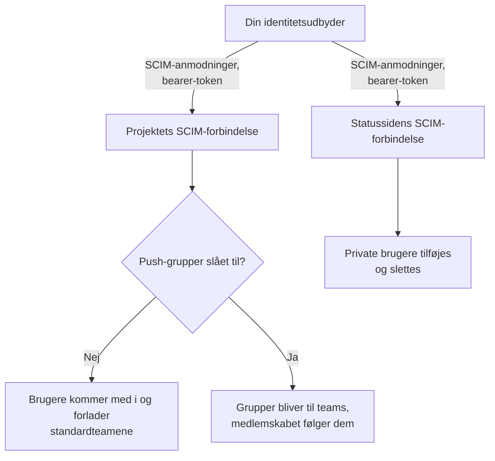
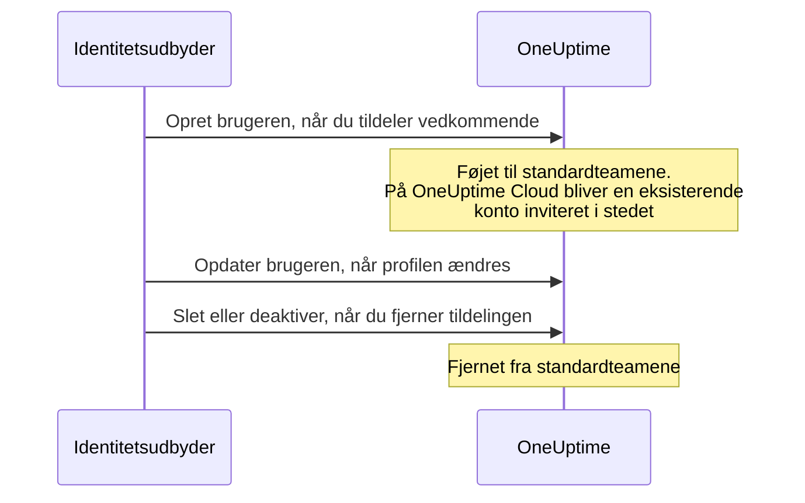
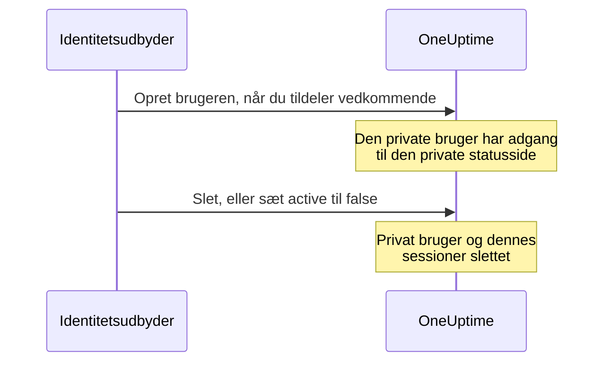

# SCIM

SCIM (System for Cross-domain Identity Management) klargør personer og fjerner deres adgang automatisk. Din identitetsudbyder (IdP) — Microsoft Entra ID, Okta eller ethvert andet SCIM 2.0-system — føjer personer til dine OneUptime-projekter og private statussider, når du tildeler dem, og fjerner dem, når du fjerner tildelingen.

> [!NOTE]
> **Udgave:** SCIM er en del af OneUptime Enterprise Edition. På OneUptime Cloud er det tilgængeligt fra planen **Scale** og opefter. Selvhostede installationer skal bruge Enterprise Edition-imaget og en licens. Se [Enterprise Edition](/docs/self-hosted/enterprise). Uden en gyldig licens (efter den 14 dage lange prøveperiode, eller 30 dage efter at en licens udløber) afvises SCIM-anmodninger, indtil en licens aktiveres.

:::cards
- [Opsæt projekt-SCIM](#opsætning-af-projekt-scim): Opret en forbindelse, og giv din IdP dens URL og token.
- [Opsæt SCIM til statussider](#opsætning-af-scim-til-statussider): Klargør en statussides private brugere.
- [Forbind din identitetsudbyder](#opsæt-din-identitetsudbyder): Trin for trin for Microsoft Entra ID og Okta.
- [Ofte stillede spørgsmål](#ofte-stillede-spørgsmål): Eksisterende brugere, fjernelse af adgang, ændrede e-mailadresser.
:::

## Sådan fungerer det

Din identitetsudbyder kalder OneUptimes SCIM-endepunkt, godkendt med et bearer-token, hver gang du tildeler, ændrer eller fjerner tildelingen af en person. Hvad anmodningen ændrer, afhænger af, hvor forbindelsen er:



SCIM-integrationen giver disse fordele:

- **Automatisk klargøring af brugere**: brugere oprettes i OneUptime, når de tildeles i din IdP.
- **Automatisk fjernelse af brugere**: brugere fjernes fra OneUptime, når deres tildeling fjernes i din IdP.
- **Synkronisering af brugerattributter**: brugeroplysningerne holdes ens i din IdP og OneUptime.
- **Central adgangsstyring**: adgangen til OneUptime styres fra dit eksisterende system til identitetsstyring.

SCIM og [SSO](/docs/identity/sso) er uafhængige: SCIM afgør, hvem der er med i et projekt, SSO, hvordan de logger ind. De fleste organisationer bruger begge.

## SCIM til projekter

Med projekt-SCIM styrer identitetsudbydere teammedlemmerne i OneUptime-projekter.

### Opsætning af projekt-SCIM

Kun en projektejer kan tilføje eller ændre et projekts SCIM-forbindelse eller se eller nulstille dens bearer-token: via SCIM kan din identitetsudbyder føje personer til ethvert team i projektet.
:::steps
1. **Gå til projektindstillinger**

   - Åbn dit OneUptime-projekt
   - Gå til **Projektindstillinger** > **Sikkerhed** > **SCIM**

2. **Konfigurer SCIM-indstillingerne**

   - Indtast et **Navn**. **Standardteams** starter med dit projekts medlemsteam: nye brugere føjes til disse teams
   - Under **Flere felter** er **Klargør brugere automatisk** (tilføj brugere, når de tildeles i din IdP) og **Fjern automatisk klargøring af brugere** (fjern brugere, når deres tildeling fjernes i din IdP) slået til, og **Aktivér push-grupper** er slået fra. Ændr dem der, hvis du har brug for det
   - Gem. Dialogen med **SCIM Base URL** og **Bearer Token** til konfigurationen af din IdP åbnes med det samme

3. **Konfigurer din identitetsudbyder**

   - Brug **SCIM Base URL** fra dialogen. På OneUptime Cloud er den `https://oneuptime.com/identity/scim/v2/<scim-id>`; en selvhostet installation viser sin egen vært
   - Opsæt godkendelse med bearer-token med **Bearer Token** fra dialogen
   - Tilknyt brugerattributterne (e-mail er påkrævet). [Opsæt din identitetsudbyder](#opsæt-din-identitetsudbyder) har detaljerne for Microsoft Entra ID og Okta
:::

For at se URL'erne igen skal du vælge **Vis SCIM-URL'er** i forbindelsens række. **Nulstil bearer-token** erstatter tokenet; opdater din identitetsudbyder med det nye.

### Sådan klargøres en projektbruger



En person, der allerede havde en OneUptime-konto, bliver medlem, når vedkommende accepterer invitationen på OneUptime Cloud (se de [ofte stillede spørgsmål](#ofte-stillede-spørgsmål)). Adgang via andre teams end forbindelsens standardteams berøres ikke.

## SCIM til statussider

Med SCIM til statussider klargør identitetsudbydere private brugere af statussider og fjerner dem igen; disse brugere har adgang til private statussider.

### Opsætning af SCIM til statussider

:::steps
1. **Gå til statussidens indstillinger**

   - Åbn **Statussider**, og vælg din statusside
   - Gå til **Sikkerhed** > **SCIM**

2. **Konfigurer SCIM-indstillingerne**

   - Indtast et **Navn**. Under **Flere felter** er **Klargør brugere automatisk** (tilføj private brugere, når de tildeles i din IdP) og **Fjern automatisk klargøring af brugere** (slet private brugere, når deres tildeling fjernes i din IdP) slået til. Ændr dem der, hvis du har brug for det
   - Gem. Dialogen med **SCIM Base URL** og **Bearer Token** til konfigurationen af din IdP åbnes med det samme

3. **Konfigurer din identitetsudbyder**

   - Brug **SCIM Base URL** fra dialogen. På OneUptime Cloud er den `https://oneuptime.com/identity/status-page-scim/v2/<scim-id>`
   - Opsæt godkendelse med bearer-token med det viste token
   - Tilknyt brugerattributterne (e-mail er påkrævet)
:::

For at se URL'erne igen skal du vælge **Vis SCIM-endepunkts-URL'er** i forbindelsens række.

SCIM til statussider understøtter kun brugere. Grupper og klargøring af grupper understøttes ikke.

### Sådan klargøres en privat bruger



> [!WARNING]
> Fjernelse sletter statussidens private bruger og alle dennes sessioner for statussiden permanent. Tildeles brugeren igen senere, klargøres vedkommende som en ny privat bruger. Når **Fjern automatisk klargøring af brugere** er slået fra, ignoreres opdateringer, der sætter `active` til `false`, og DELETE-anmodninger afvises.

## Opsæt din identitetsudbyder

Hver udbyder nedenfor starter med at oprette en SCIM-forbindelse til projektet i OneUptime og forbinder derefter din identitetsudbyder med den.

### Microsoft Entra ID (tidligere Azure AD)

Microsoft Entra ID giver identitetsstyring på virksomhedsniveau med SCIM-klargøring. Du skal bruge:

- En Microsoft Entra ID-lejer med en Premium P1- eller P2-licens (påkrævet til automatisk klargøring).
- Et OneUptime-projekt på planen **Scale** eller højere på OneUptime Cloud.
- Administratoradgang til både Microsoft Entra ID og OneUptime.

:::steps
#### Opret SCIM-forbindelsen til Entra ID

1. Log ind på dit OneUptime-dashboard
2. Gå til **Projektindstillinger** > **Sikkerhed** > **SCIM**
3. Klik på **Opret SCIM**
4. Indtast et genkendeligt navn (f.eks. "Microsoft Entra ID Provisioning")
5. Kontrollér indstillingerne:
   - **Standardteams**: starter med dit projekts medlemsteam; nye brugere føjes til disse teams
   - **Klargør brugere automatisk** og **Fjern automatisk klargøring af brugere**: slået til under **Flere felter**
   - **Aktivér push-grupper**: under **Flere felter**; slå det til, hvis du vil styre teammedlemskab via grupper i Entra ID
6. Gem konfigurationen
7. Kopiér **SCIM Base URL** og **Bearer Token** fra dialogen, der åbnes — du skal bruge dem i Entra ID

#### Opret en virksomhedsapplikation i Entra ID

1. Log ind i [Microsoft Entra admin center](https://entra.microsoft.com)
2. Gå til **Identity** > **Applications** > **Enterprise applications**
3. Klik på **+ New application** og derefter på **+ Create your own application**
4. Indtast et navn (f.eks. "OneUptime")
5. Vælg **Integrate any other application you don't find in the gallery (Non-gallery)**, og klik på **Create**

#### Forbind Entra ID med OneUptime

1. Gå til **Provisioning** i din OneUptime-virksomhedsapplikation, og klik på **Get started**
2. Sæt **Provisioning Mode** til **Automatic**
3. Under **Admin Credentials** skal du sætte **Tenant URL** til **SCIM Base URL** fra OneUptime (f.eks. `https://oneuptime.com/identity/scim/v2/<scim-id>`) og **Secret Token** til **Bearer Token**
4. Klik på **Test Connection** for at kontrollere konfigurationen, og klik derefter på **Save**

#### Tilknyt brugerattributter i Entra ID

1. Klik på **Mappings** i sektionen Provisioning og derefter på **Provision Azure Active Directory Users**
2. Opsæt følgende attributtilknytninger, fjern dem, du ikke har brug for, og klik på **Save**:

| Azure AD-attribut                                             | OneUptime SCIM-attribut        | Påkrævet   |
| ------------------------------------------------------------- | ------------------------------ | ---------- |
| `userPrincipalName`                                           | `userName`                     | Ja         |
| `mail`                                                        | `emails[type eq "work"].value` | Anbefalet  |
| `displayName`                                                 | `displayName`                  | Anbefalet  |
| `givenName`                                                   | `name.givenName`               | Valgfri    |
| `surname`                                                     | `name.familyName`              | Valgfri    |
| `Switch([IsSoftDeleted], , "False", "True", "True", "False")` | `active`                       | Anbefalet  |

#### Tilknyt grupper i Entra ID (valgfrit)

Hvis du har slået **Aktivér push-grupper** til i OneUptime:

1. Gå tilbage til **Mappings**, og klik på **Provision Azure Active Directory Groups**
2. Sæt **Enabled** til **Yes**
3. Opsæt følgende attributtilknytninger, og klik på **Save**:

| Azure AD-attribut | OneUptime SCIM-attribut |
| ----------------- | ----------------------- |
| `displayName`     | `displayName`           |
| `members`         | `members`               |

#### Tildel brugere og grupper i Entra ID

1. Gå til **Users and groups** i din OneUptime-virksomhedsapplikation
2. Klik på **+ Add user/group**, vælg de brugere og grupper, der skal klargøres i OneUptime, og klik på **Assign**

#### Start klargøringen i Entra ID

1. Gå til **Provisioning** > **Overview**, og klik på **Start provisioning**
2. Den første klargøringscyklus starter; den første synkronisering kan tage op til 40 minutter
3. Hold øje med fejl i **Provisioning logs**. De personer, du har tildelt, vises i projektets teams i OneUptime
:::

### Okta

Okta giver fleksibel identitetsstyring med SCIM-understøttelse. Du skal bruge:

- En Okta-lejer med klargøring (funktionen Lifecycle Management).
- Et OneUptime-projekt på planen **Scale** eller højere på OneUptime Cloud.
- Administratoradgang til både Okta og OneUptime.

:::steps
#### Opret SCIM-forbindelsen til Okta

1. Log ind på dit OneUptime-dashboard
2. Gå til **Projektindstillinger** > **Sikkerhed** > **SCIM**
3. Klik på **Opret SCIM**
4. Indtast et genkendeligt navn (f.eks. "Okta Provisioning")
5. Kontrollér indstillingerne:
   - **Standardteams**: starter med dit projekts medlemsteam; nye brugere føjes til disse teams
   - **Klargør brugere automatisk** og **Fjern automatisk klargøring af brugere**: slået til under **Flere felter**
   - **Aktivér push-grupper**: under **Flere felter**; slå det til, hvis du vil styre teammedlemskab via grupper i Okta
6. Gem konfigurationen
7. Kopiér **SCIM Base URL** og **Bearer Token** fra dialogen, der åbnes — du skal bruge dem i Okta

#### Opret eller åbn Okta-applikationen

Gå til **Applications** > **Applications** i Okta Admin Console:

- Bruger du allerede Okta til OneUptimes SSO, så åbn den applikation.
- Ellers skal du klikke på **Create App Integration**, vælge **SAML 2.0**, kalde den "OneUptime" og gøre SAML-opsætningen færdig (se [SSO](/docs/identity/sso)).

#### Slå SCIM-klargøring til i Okta

1. Gå til fanen **General** i din OneUptime-applikation
2. Klik på **Edit** i sektionen **App Settings**, vælg **SCIM** under **Provisioning**, og klik på **Save**
3. En ny fane **Provisioning** vises

#### Forbind Okta med OneUptime

1. Klik på **Integration** på fanen **Provisioning**, derefter på **Configure API Integration**, og markér **Enable API integration**
2. Opsæt følgende:
   - **SCIM connector base URL**: **SCIM Base URL** fra OneUptime (f.eks. `https://oneuptime.com/identity/scim/v2/<scim-id>`)
   - **Unique identifier field for users**: `userName`
   - **Supported provisioning actions**: Import New Users and Profile Updates, Push New Users, Push Profile Updates samt Push Groups, hvis du bruger gruppebaseret klargøring
   - **Authentication Mode**: **HTTP Header**
   - **Authorization**: **Bearer Token** fra OneUptime. OneUptime forventer headeren `Authorization: Bearer <token>`; viser Okta allerede ordet Bearer foran feltet, skal du kun indtaste tokenet
3. Klik på **Test API Credentials** for at kontrollere forbindelsen, og klik derefter på **Save**

#### Vælg, hvad Okta klargør

1. Klik på **To App** på fanen **Provisioning** og derefter på **Edit**
2. Slå **Create Users**, **Update User Attributes** og **Deactivate Users** til, og klik på **Save**

#### Tilknyt brugerattributter i Okta

Rul ned til **Attribute Mappings**, og kontrollér disse tilknytninger. Fjern dem, du ikke har brug for:

| Okta-attribut      | OneUptime SCIM-attribut         | Retning       |
| ------------------ | ------------------------------- | ------------- |
| `userName`         | `userName`                      | Okta til app  |
| `user.email`       | `emails[primary eq true].value` | Okta til app  |
| `user.firstName`   | `name.givenName`                | Okta til app  |
| `user.lastName`    | `name.familyName`               | Okta til app  |
| `user.displayName` | `displayName`                   | Okta til app  |

#### Push grupper fra Okta (valgfrit)

Hvis du har slået **Aktivér push-grupper** til i OneUptime:

1. Gå til fanen **Push Groups**, og klik på **+ Push Groups**
2. Vælg **Find groups by name** eller **Find groups by rule**
3. Søg efter og vælg de grupper, der skal pushes, og klik på **Save**

#### Tildel personer i Okta

1. Gå til fanen **Assignments**
2. Klik på **Assign** > **Assign to People** eller **Assign to Groups**, vælg, hvem der skal klargøres, klik på **Assign** for hver, og derefter på **Done**

#### Kontrollér klargøringen i Okta

1. Gå til **Reports** > **System Log** i Okta Admin Console, og filtrer på din OneUptime-applikation
2. Kontrollér, at klargøringshændelserne lykkedes, og at personerne vises i projektets teams i OneUptime
:::

### Andre identitetsudbydere

OneUptimes SCIM-implementering følger SCIM v2.0-specifikationen og fungerer med enhver kompatibel identitetsudbyder:

| Indstilling | Værdi |
| --- | --- |
| SCIM Base URL | **SCIM Base URL** fra OneUptime: `https://oneuptime.com/identity/scim/v2/<scim-id>` for et projekt eller `https://oneuptime.com/identity/status-page-scim/v2/<scim-id>` for en statusside |
| Godkendelse | HTTP-bearer-token |
| Unik brugeridentifikator | `userName`, som skal være en gyldig e-mailadresse |
| Operationer | GET, POST, PUT, PATCH og DELETE for Users, i projekt-SCIM og SCIM til statussider. Groups understøttes kun i projekt-SCIM. |

## SCIM API-reference

Stierne er relative til forbindelsens **SCIM Base URL**.

| Endepunkt                | Metoder                 | Beskrivelse                                              |
| ------------------------ | ----------------------- | -------------------------------------------------------- |
| `/ServiceProviderConfig` | GET                     | SCIM-serverens muligheder                                |
| `/Schemas`               | GET                     | Tilgængelige ressourceskemaer                            |
| `/ResourceTypes`         | GET                     | Tilgængelige ressourcetyper                              |
| `/Users`                 | GET, POST               | Vis og opret brugere                                     |
| `/Users/{id}`            | GET, PUT, PATCH, DELETE | Administrer enkelte brugere                              |
| `/Groups`                | GET, POST               | Vis og opret grupper/teams (kun projekt-SCIM)            |
| `/Groups/{id}`           | GET, PUT, PATCH, DELETE | Administrer enkelte grupper (kun projekt-SCIM)           |
| `/Bulk`                  | POST                    | Flere operationer i én anmodning                         |

Hvad `/ServiceProviderConfig` melder:

| Mulighed | Understøttet |
| --- | --- |
| PATCH | Ja |
| Bulk | Ja, op til 1.000 operationer og 1 MB pr. anmodning |
| Filter | Ja, op til 200 resultater |
| Sortering | Ja |
| Skift adgangskode | Nej |
| ETag | Nej |
| Godkendelse | HTTP-bearer-token |

En gruppe, som din identitetsudbyder opretter, bliver til et team med samme navn i projektet; et team, der allerede har det navn, bruges i stedet for et nyt.

:::details SCIM-brugerskema
```json
{
  "schemas": ["urn:ietf:params:scim:schemas:core:2.0:User"],
  "userName": "user@example.com",
  "name": {
    "givenName": "John",
    "familyName": "Doe",
    "formatted": "John Doe"
  },
  "displayName": "John Doe",
  "emails": [
    {
      "value": "user@example.com",
      "type": "work",
      "primary": true
    }
  ],
  "active": true
}
```
:::

:::details SCIM-gruppeskema
```json
{
  "schemas": ["urn:ietf:params:scim:schemas:core:2.0:Group"],
  "displayName": "Engineering Team",
  "members": [
    {
      "value": "user-id-here",
      "display": "user@example.com"
    }
  ]
}
```
:::

## Planer og licenser

På OneUptime Cloud kræver SCIM planen **Scale**. En selvhostet installation kræver Enterprise Edition og en licens, som bemærkningen øverst på siden siger.

### Under planen Scale

På OneUptime Cloud virker SCIM-klargøring kun fuldt ud, så længe projektet er på **Scale** eller derover. Under den — efter at en Scale-prøveperiode slutter, eller planen nedgraderes — fjerner projektets SCIM-forbindelser, og dets statussiders, kun personer, så alle, der forlader organisationen, stadig mister deres adgang:

- **Virker stadig:** at deaktivere en bruger (`active` sat til `false` på en forbindelse, der er sat til at fjerne de personer, den deaktiverer), at slette en bruger, at fjerne medlemmer fra en gruppe (Entra ID's `Remove` på `members` med medlemmerne som værdi, Oktas `remove` på `members[value eq "..."]`, eller at erstatte medlemmerne med nogle af dem, gruppen allerede har), at slette en gruppe og en `Bulk`-anmodning, der kun består af `DELETE`'er. Opslag besvares også — at vise og filtrere brugere og grupper, hvilket identitetsudbydere gør, før de fjerner nogen —, men under planen opretter et opslag aldrig nogen.
- **Afvist:** at oprette en bruger eller en gruppe, at genaktivere en bruger (`active` sat til `true` for en person, som forbindelsen ville føje tilbage til et af sine teams), at føje nogen til en gruppe, de ikke er med i, og kun at ændre en brugers e-mail eller navn eller en gruppes navn. En anmodning, der tilføjer nogen, afvises helt, også hvis den samtidig fjerner personer, fordi en SCIM-`PATCH` er alt eller intet. Afvisningen er en `402` med en fejl i SCIM-formatet, som din identitetsudbyder viser: `SCIM provisioning needs the Scale plan. This project's plan does not include it, so its SCIM connections can only remove people: requests that add or change people or groups are refused. The connections are kept: upgrade the project to Scale in Project Settings > Billing and they work fully again.` Hver afvisning står også i forbindelsens SCIM-logge.
- **En fjernelse, der også ændrer en profil** — en deaktivering, der sender en ny e-mail eller et nyt navn, eller en gruppeopdatering, der fjerner medlemmer og omdøber gruppen — går igennem og lader e-mailen, navnet eller gruppenavnet være uændret. Identitetsudbydere sender igen, hvad de ser er anderledes, så en ændring, der er afvist én gang, kommer igen med deres senere anmodninger, og en fjernelse venter aldrig på planen. En deaktivering på en forbindelse, der ikke fjerner de personer, den deaktiverer (automatisk fjernelse slået fra, eller grupper pushet i stedet), fjerner ingen, så en ny e-mail eller et nyt navn, der sendes med den, afvises som en selvstændig ændring.
- **En anmodning, der ikke ændrer noget, besvares som normalt** — Oktas `PUT` af en bruger, som vedkommende er, med `active` sat til `true`, for en person, der allerede er med i alle forbindelsens teams; at føje nogen til en gruppe, de allerede er med i; en e-mail, der sendes igen med andre store og små bogstaver; attributter, OneUptime ikke gemmer, som en titel eller en afdeling. En statussides private bruger er på siden eller slet ikke, så `active` sat til `true` ændrer aldrig en sådan.

Intet slettes. Opgrader til **Scale**, og forbindelserne virker fuldt ud igen, som de er, med det samme bearer-token og intet at opsætte igen i din identitetsudbyder; en planændring træder i kraft inden for et minut. Identitetsudbydere bliver ved med at kalde efter deres egen tidsplan: Okta viser afvisningerne blandt sine klargøringsfejl, og Entra ID viser dem i sine klargøringslogge og kan sætte et job, der bliver ved med at fejle, i karantæne, hvilket sænker dets synkroniseringer — også fjernelser — til omkring én om dagen. Genstart klargøringen der efter opgraderingen, så de personer, der er tilføjet i mellemtiden, bliver klargjort.

Under **Scale** viser **Projektindstillinger** > **Sikkerhed** > **SCIM** og en statussides side **SCIM** forbindelserne under planens opgraderingstilbud (**SCIM-forbindelser, der stadig er sat op**) og fortæller, at de kun fjerner personer. Slet en forbindelse for at fjerne den. At tilføje en forbindelse, ændre en eller erstatte dens bearer-token kræver **Scale**. Listen viser ikke bearer-tokens, og kun projektejere kan læse et token, på alle planer.

## Fejlfinding

Start med fanen **Protokoller** under **Projektindstillinger** > **Sikkerhed** > **SCIM** (eller på statussidens side **SCIM**). Den viser de SCIM-anmodninger, din identitetsudbyder har sendt, med deres status, og **Vis detaljer** viser anmodningen og det, OneUptime svarede.

:::details Entra ID: Test Connection mislykkes
Kontrollér, at **Tenant URL** er præcis den **SCIM Base URL**, som OneUptime viser, og at **Secret Token** er det aktuelle **Bearer Token**. Efter **Nulstil bearer-token** virker det gamle token ikke længere.
:::

:::details Okta: testen af API-oplysningerne mislykkes, eller anmodninger får 401 Unauthorized
Kontrollér **SCIM connector base URL** og tokenet. OneUptime læser headeren `Authorization: Bearer <token>`, så sørg for, at ordet Bearer sendes præcis én gang. Er tokenet gået tabt eller lækket, så vælg **Nulstil bearer-token** i OneUptime, og opdater Okta.
:::

:::details Brugere bliver ikke klargjort
Kontrollér, at brugerne er tildelt applikationen i din identitetsudbyder, at klargøringen er slået til der, og at attributtilknytningerne er rigtige. I Entra ID viser **Provisioning logs** hver fejl; i Okta gør **System Log** det.
:::

:::details Dublerede brugere i Okta
Sørg for, at `userName` er unik og svarer til brugerens e-mailadresse.
:::

:::details Fejl ved push af grupper
Kontrollér, at grupperne findes i din identitetsudbyder og har de rigtige medlemmer, og at **Aktivér push-grupper** er slået til i OneUptime.
:::

:::details Ændringer fra Entra ID er længe om at komme
Entra ID klargør efter sin egen tidsplan: den første synkronisering kan tage op til 40 minutter, og senere synkroniseringer kører cirka hvert 40. minut. Et job, som Entra ID har sat i karantæne, synkroniserer sjældnere; ret fejlene i dets **Provisioning logs**, og genstart det.
:::

## Ofte stillede spørgsmål

:::details Hvad sker der, når en brugers adgang fjernes?
Fjernelse kan anmodes om med en DELETE-anmodning eller ved at sætte `active` til `false` i en PUT/PATCH-opdatering:

- **Projekt-SCIM**: Med **Fjern automatisk klargøring af brugere** slået til fjernes brugeren fra de standardteams, der er sat op i SCIM-indstillingerne, mens OneUptime-kontoen bevares. Adgang via andre teams påvirkes ikke. Når push-grupper er slået til, styres teammedlemskabet via klargøring af grupper.
- **SCIM til statussider**: Med **Fjern automatisk klargøring af brugere** slået til slettes statussidens private bruger og alle dennes sessioner for statussiden permanent. Det sletter ikke en separat OneUptime-brugerkonto til et projekt.
:::

:::details Kan jeg bruge SCIM uden SSO?
Ja, SCIM og SSO er uafhængige funktioner. Du kan bruge SCIM til at klargøre brugere og lade dem logge ind med deres OneUptime-adgangskode eller en anden godkendelsesmetode.
:::

:::details Hvordan håndterer jeg brugere, der allerede findes i OneUptime?
Når SCIM forsøger at oprette en bruger, der allerede eksisterer (matchet efter e-mail), opretter OneUptime ikke en duplikatbruger. Hvad der derefter sker, afhænger af, hvor OneUptime kører:

- **Selvhostet**: Den eksisterende bruger tilføjes med det samme til de konfigurerede standardteams (eller til gruppens team, med push-grupper).
- **OneUptime Cloud**: En OneUptime-konto tilhører personen, ikke et bestemt projekt, så SCIM kan ikke på egen hånd gøre nogen til medlem af dit projekt. Den eksisterende bruger bliver i stedet **inviteret** til teamene og modtager den sædvanlige invitationsmail. Vedkommende bliver medlem, når invitationerne accepteres under **Projektinvitationer** i OneUptime, eller når dit projekts single sign-on (SSO) bekræftes fra den e-mail, OneUptime sender ved det første SSO-login. Indtil da vises brugeren som afventende. Det samme gælder, når en gruppe tilføjer en eksisterende bruger, der endnu ikke er medlem af dit projekt.

Brugere, som SCIM selv opretter, og brugere, der er medlemmer af dit projekt, tilføjes med det samme i begge tilfælde. At bekræfte dit projekts SSO gør en person til medlem, så vedkommende tilføjes også med det samme; en, der siden har forladt dit projekt, inviteres igen.
:::

:::details Kan SCIM ændre en brugers e-mailadresse eller navn?
En OneUptime-kontos e-mailadresse er den, personen logger ind med i alle de projekter, vedkommende er medlem af, og den, links til nulstilling af adgangskoden sendes til. Derfor:

- **OneUptime Cloud**: SCIM ændrer aldrig en e-mailadresse. En anmodning, der ville ændre en, afvises med en `400` SCIM-fejl af typen `mutability`, og intet i anmodningen udføres; din identitetsudbyder viser årsagen. Bed brugeren om selv at ændre adressen fra sin egen OneUptime-profil. En anmodning, der gentager den adresse, kontoen allerede har, er ikke en ændring og lykkes.
- **Selvhostet**: SCIM ændrer kun e-mailadressen for en bruger, der er blevet medlem af dette projekt, ikke tilhører noget andet projekt og ikke er OneUptime-administrator. Enhver anden ændring afvises på samme måde.

Navne følger den samme regel overalt: SCIM opdaterer kun navnet for en bruger, der er blevet medlem af dette projekt, ikke tilhører noget andet projekt og ikke er OneUptime-administrator. For alle andre forbliver navnet uændret, og resten af anmodningen lykkes stadig.
:::

:::details Hvad er forskellen på standardteams og push-grupper?
- **Standardteams**: alle brugere, der klargøres via SCIM, føjes til de samme foruddefinerede teams
- **Push-grupper**: teammedlemskabet styres af din identitetsudbyder, så forskellige brugere kan være i forskellige teams ud fra deres grupper i IdP'en
:::

:::details Hvor ofte synkroniseres der?
Det afhænger af din identitetsudbyder:

- **Microsoft Entra ID**: den første synkronisering kan tage op til 40 minutter; senere synkroniseringer sker hvert 40. minut
- **Okta**: næsten i realtid for de fleste operationer, med periodiske fulde synkroniseringer
:::

## Næste trin

:::cards
- [SSO](/docs/identity/sso): Lad de personer, SCIM klargør, logge ind med din identitetsudbyder.
- [Brugere, teams og tilladelser](/docs/permissions/index): Hvad standardteamene giver nye brugere lov til.
- [Global SSO](/docs/identity/global-sso): Én identitetsudbyder til alle projekter på en selvhostet instans.
:::
