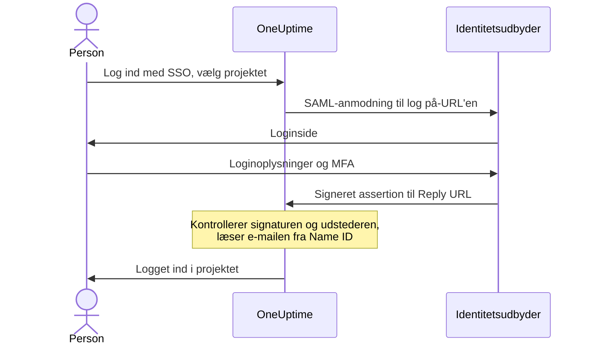

# SSO

Med single sign-on (SSO) logger personerne i dit projekt ind i OneUptime gennem din organisations identitetsudbyder (IdP) via SAML 2.0 eller OpenID Connect. Du styrer adgang, adgangskoder og multifaktorgodkendelse ét sted, og du kan kræve SSO for alle i projektet.

> [!NOTE]
> **Udgave:** SSO, herunder "Require SSO for login", er en del af alle OneUptime-udgaver: selvhostede installationer får det i Community Edition uden at skulle bruge en licens. På OneUptime Cloud er det tilgængeligt fra planen **Scale** og opefter. Se [Enterprise Edition](/docs/self-hosted/enterprise) for, hvad hver udgave indeholder.

:::cards
- [Opsæt en SAML-udbyder](#opsætning-af-sso): Opret den i OneUptime, og giv din IdP to URL'er.
- [Vejledninger til identitetsudbydere](#vejledninger-til-identitetsudbydere): Keycloak, Microsoft Entra ID og Okta, trin for trin.
- [OpenID Connect](#openid-connect-oidc): Log ind via en OIDC-app i stedet.
- [Kræv SSO](#kræv-sso-for-dit-projekt): Gør SSO til den eneste vej ind i projektet.
:::

## Sådan fungerer SAML-login

En SAML-udbyder forbinder ét projekt med én applikation i din identitetsudbyder. Den, der logger ind, vælger projektet på OneUptimes side **Log ind med SSO**, logger ind hos din IdP og kommer tilbage logget ind.



OneUptime læser kun få ting fra den assertion, din IdP sender:

| Fra assertionen | Hvad OneUptime gør med det |
| --- | --- |
| Signatur | Kontrollerer den med udbyderens **Offentligt certifikat**. Svaret skal være signeret og må ikke være krypteret. |
| Issuer | Skal svare præcist til udbyderens **Udsteder**. |
| Name ID | Personens e-mailadresse. Den skal være en gyldig e-mailadresse. |
| `http://schemas.microsoft.com/identity/claims/displayname` | Personens navn, som bruges, når OneUptime opretter kontoen. Valgfri. |

Personer, der logger ind for første gang, kommer med i udbyderens **Teams**, og de afgør, hvad personen kan gøre: se [Roller og teams for SSO-brugere](#roller-og-teams-for-sso-brugere).

> [!NOTE]
> På OneUptime Cloud logger OneUptime ikke en person ind, første gang vedkommende logger ind i projektet med en af projektets SAML- eller OIDC-udbydere; i stedet sender OneUptime et link pr. e-mail. Personen åbner linket, bekræfter, at projektets single sign-on må logge vedkommende ind, og fortsætter med at logge ind. Linket gælder i 24 timer. Det sker én gang pr. projekt og igen, hvis personen forlader projektet og vender tilbage. Selvhostede installationer logger personer ind med det samme.

## Opsætning af SSO

Du skal have tilladelse til at tilføje SSO-udbydere — **Project Owner**, **Project Admin** eller **Create Project SSO** — og på OneUptime Cloud planen **Scale**. Se [vejledningerne til identitetsudbydere](#vejledninger-til-identitetsudbydere) for din identitetsudbyders side.

:::steps
1. **Gå til projektindstillinger**

   - Åbn dit OneUptime-projekt
   - Gå til **Projektindstillinger** > **Sikkerhed** > **SSO**

2. **Opret SSO-konfigurationen**

   - Klik på **Opret SSO**
   - Indtast et **Navn** til SSO-konfigurationen (f.eks. "Keycloak SAML" eller "Okta SAML")
   - Indtast **Log på-URL** fra din identitetsudbyder
   - Indtast **Udsteder** (Entity ID) fra din identitetsudbyder
   - Indsæt **Offentligt certifikat** fra din identitetsudbyder
   - I trinnet **Login** starter **Teams** med dit projekts medlemsteam: personer, der logger ind for første gang, kommer med i disse teams. Kun teams, du selv kunne invitere nogen til, accepteres: et team, der giver mere adgang, end du har, nævnes under **Teams**
   - Resten er allerede udfyldt under **Flere felter**: **Signaturmetode** (`RSA-SHA256`), **Digest-metode** (`SHA256`) og en beskrivelse ("Sign in with" og navnet). Ændr dem kun, hvis din identitetsudbyder kræver det

3. **Hent OneUptimes SSO-metadata**
   - Når du gemmer, åbnes dialogen **SSO Configuration**. Du kan åbne den igen med knappen **Vis SSO-konfiguration**
   - Kopiér **Identifier (Entity ID)**, f.eks. `https://oneuptime.com/<project-id>/<provider-id>` — den skal bruges i din IdP-konfiguration
   - Kopiér **Reply URL (Assertion Consumer Service URL)**, f.eks. `https://oneuptime.com/identity/idp-login/<project-id>/<provider-id>` — den skal bruges i din IdP-konfiguration
   - En ny udbyder starter slået fra. Når din IdP har disse to værdier, skal du redigere udbyderen og slå **Aktiveret** til

4. **Test udbyderen**
   - Åbn linket i kortet **Test Single Sign On (SSO)**, og vælg udbyderen på den side, der åbnes. Du sendes til din identitetsudbyders loginside og tilbage til OneUptime, logget ind
   - Når det virker, kan du [kræve SSO](#kræv-sso-for-dit-projekt) for projektet
:::

## Vejledninger til identitetsudbydere

Vælg din identitetsudbyder. Hver vejledning henter IdP'ens værdier, opretter udbyderen i OneUptime og giver derefter IdP'en OneUptimes **Identifier (Entity ID)** og **Reply URL**.

:::tabs
@tab Keycloak
Keycloak er en populær open source-løsning til identitets- og adgangsstyring. Du skal bruge en kørende Keycloak-instans med et realm og administratoradgang til både Keycloak og OneUptime.

:::steps
1. **Saml dit realms værdier**

   - **Log på-URL**: `https://<your-keycloak-domain>/auth/realms/<your-realm>/protocol/saml`
   - **Udsteder**: `https://<your-keycloak-domain>/auth/realms/<your-realm>`
   - **Certifikat**: realmets signeringscertifikat. Åbn `https://<your-keycloak-domain>/auth/realms/<your-realm>/protocol/saml/descriptor` og kopiér værdien `X509Certificate`, eller åbn **Realm settings** > **Keys** og klik på **Certificate** ved RS256-nøglen

   Keycloak 17 og nyere leverer disse URL'er uden præfikset `/auth`. Sæt certifikatet mellem sine egne linjer, sådan her:

   ```text
   -----BEGIN CERTIFICATE-----
   MIICnzCCAYcCBgFyPZ8QFzANBgkqhkiG.......
   -----END CERTIFICATE-----
   ```

2. **Opret udbyderen i OneUptime**

   Gå til **Projektindstillinger** > **Sikkerhed** > **SSO**, klik på **Opret SSO**, og udfyld:
   - **Navn**: et beskrivende navn (f.eks. `my-project-oneuptime`)
   - **Log på-URL** og **Udsteder**: værdierne ovenfor
   - **Offentligt certifikat**: certifikatet mellem sine egne linjer `BEGIN CERTIFICATE` og `END CERTIFICATE`
   - **Signaturmetode** og **Digest-metode**: allerede angivet under **Flere felter** (`RSA-SHA256` og `SHA256`)

   Gem, og kopiér **Identifier (Entity ID)** og **Reply URL (Assertion Consumer Service URL)** fra dialogen, der åbnes.

3. **Opret Keycloak-klienten**

   Åbn **Clients** i dit realm i Keycloak, og opret en klient, eller rediger en eksisterende:
   - **Client Protocol** (klienttype): `saml`
   - **Client ID**: **Identifier (Entity ID)** fra OneUptime
   - **Root URL** og **Valid Redirect URIs**: din OneUptime-URL
   - **Assertion Consumer Service POST Binding URL**: **Reply URL (Assertion Consumer Service URL)** fra OneUptime

4. **Juster klientindstillingerne**

   - Sæt **Name ID Format** til `email`, og slå **Force Name ID Format** til, så Keycloak altid sender e-mailen som Name ID
   - Slå **Client signature required** (under **Signing keys config**) fra på klientens fane **Keys**: OneUptime signerer ikke sine anmodninger

5. **Slå udbyderen til, og test den**

   Rediger udbyderen i OneUptime, og slå **Aktiveret** til; åbn derefter linket i kortet **Test Single Sign On (SSO)**, og vælg udbyderen. Du bør blive sendt til Keycloaks loginside og tilbage til OneUptime.
:::
@tab Microsoft Entra ID
Microsoft Entra ID (tidligere Azure AD / Active Directory) er Microsofts cloudbaserede identitetstjeneste. Du skal bruge en lejer, der understøtter virksomhedsapplikationer med SAML-SSO, og administratoradgang til både Entra ID og OneUptime.

:::steps
1. **Opret en virksomhedsapplikation i Entra ID**

   - Log ind i [Microsoft Entra admin center](https://entra.microsoft.com)
   - Gå til **Identity** > **Applications** > **Enterprise applications**, klik på **+ New application** og derefter på **+ Create your own application**
   - Indtast et navn (f.eks. "OneUptime"), vælg **Integrate any other application you don't find in the gallery (Non-gallery)**, og klik på **Create**

2. **Kopiér Entra ID's SAML-værdier**

   - Gå til **Single sign-on** i applikationen, og vælg **SAML**
   - Download **Certificate (Base64)** under **SAML Certificates**, åbn filen i en teksteditor, og kopiér indholdet
   - Kopiér **Login URL** og **Microsoft Entra Identifier** (**Azure AD Identifier** i ældre lejere) under **Set up OneUptime**

3. **Opret udbyderen i OneUptime**

   Gå til **Projektindstillinger** > **Sikkerhed** > **SSO**, klik på **Opret SSO**, og udfyld:
   - **Navn**: et beskrivende navn (f.eks. `Azure AD SAML`)
   - **Log på-URL**: **Login URL**
   - **Udsteder**: **Microsoft Entra Identifier**
   - **Offentligt certifikat**: Base64-certifikatet, inklusive linjerne `BEGIN CERTIFICATE` og `END CERTIFICATE`
   - **Signaturmetode** og **Digest-metode**: allerede angivet under **Flere felter** (`RSA-SHA256` og `SHA256`)

   Gem, og kopiér **Identifier (Entity ID)** og **Reply URL (Assertion Consumer Service URL)** fra dialogen, der åbnes.

4. **Giv Entra ID OneUptimes URL'er**

   Klik på **Edit** under **Basic SAML Configuration**, og angiv:
   - **Identifier (Entity ID)**: **Identifier (Entity ID)** fra OneUptime
   - **Reply URL (Assertion Consumer Service URL)**: **Reply URL** fra OneUptime

   Klik på **Save**.

5. **Send e-mailen som Name ID**

   Klik på **Edit** under **Attributes & Claims**:
   - Sæt **Unique User Identifier (Name ID)** til brugerens e-mailadresse: `user.mail`, eller `user.userprincipalname`, hvor det er e-mailadressen
   - Sæt **Name identifier format** til `Email address`
   - Tilføj eventuelt et claim med navnet `http://schemas.microsoft.com/identity/claims/displayname` og kildeattributten `user.displayname`, så nye konti får personens navn. OneUptime ignorerer de øvrige claims

6. **Tildel brugere og grupper**

   Klik på **+ Add user/group** under applikationens **Users and groups**, vælg de brugere og grupper, der skal have SSO-adgang, og klik på **Assign**.

7. **Slå udbyderen til, og test den**

   Rediger udbyderen i OneUptime, og slå **Aktiveret** til; åbn derefter linket i kortet **Test Single Sign On (SSO)**, og vælg udbyderen. Du bør blive sendt til Microsofts loginside og tilbage til OneUptime.
:::
@tab Okta
Okta er en udbredt identitetsplatform med SAML-SSO. Du skal bruge en Okta-organisation med administratoradgang og administratoradgang til OneUptime.

:::steps
1. **Opret en SAML-applikation i Okta**

   - Gå til **Applications** > **Applications** i Okta Admin Console, og klik på **Create App Integration**
   - Vælg **SAML 2.0**, og klik på **Next**, indtast "OneUptime" som **App name**, og klik på **Next**
   - Okta beder om OneUptimes URL'er, før den viser sine egne. Indtast indtil videre din OneUptime-adresse (for eksempel `https://oneuptime.com`) som **Single sign-on URL** og som **Audience URI (SP Entity ID)**: du erstatter begge i trin 4
   - Sæt **Name ID format** til `EmailAddress` og **Application username** til `Email`
   - Klik på **Next**, vælg **I'm an Okta customer adding an internal app**, og klik på **Finish**

2. **Kopiér Oktas SAML-værdier**

   Find det aktive certifikat under **SAML Signing Certificates** på applikationens fane **Sign On**:
   - Klik på **Actions** > **View IdP metadata**, og kopiér **Log på-URL** (Identity Provider Single Sign-On URL) og **Udsteder** (Identity Provider Issuer)
   - Klik på **Actions** > **Download certificate**, åbn filen `.cert` i en teksteditor, og kopiér indholdet

3. **Opret udbyderen i OneUptime**

   Gå til **Projektindstillinger** > **Sikkerhed** > **SSO**, klik på **Opret SSO**, og udfyld:
   - **Navn**: et beskrivende navn (f.eks. `Okta SAML`)
   - **Log på-URL** og **Udsteder**: Oktas værdier
   - **Offentligt certifikat**: certifikatet, inklusive linjerne `BEGIN CERTIFICATE` og `END CERTIFICATE`
   - **Signaturmetode** og **Digest-metode**: allerede angivet under **Flere felter** (`RSA-SHA256` og `SHA256`)

   Gem, og kopiér **Identifier (Entity ID)** og **Reply URL (Assertion Consumer Service URL)** fra dialogen, der åbnes.

4. **Giv Okta OneUptimes URL'er**

   Klik på **Edit** under **SAML Settings** på applikationens fane **General** og derefter på **Next**, og angiv:
   - **Single sign-on URL**: **Reply URL (Assertion Consumer Service URL)** fra OneUptime
   - **Audience URI (SP Entity ID)**: **Identifier (Entity ID)** fra OneUptime

   Tilføj eventuelt en attribute statement med navnet `http://schemas.microsoft.com/identity/claims/displayname` og værdien `user.firstName + " " + user.lastName`, så nye konti får personens navn. Klik på **Next** og derefter på **Finish**.

5. **Tildel personer**

   Klik på **Assign** > **Assign to People** eller **Assign to Groups** på fanen **Assignments**, vælg, hvem der får SSO-adgang, klik på **Assign** for hver, og derefter på **Done**.

6. **Slå udbyderen til, og test den**

   Rediger udbyderen i OneUptime, og slå **Aktiveret** til; åbn derefter linket i kortet **Test Single Sign On (SSO)**, og vælg udbyderen. Du bør blive sendt til Oktas loginside og tilbage til OneUptime.
:::
@tab Andre
OneUptimes SSO bruger SAML 2.0 og fungerer med enhver kompatibel identitetsudbyder:

:::steps
1. Hent din identitetsudbyders **Log på-URL** (dens SSO-endepunkt), **Udsteder** (dens Entity ID) og **Offentligt certifikat** (dens X.509-signeringscertifikat). Hvis din IdP først viser dem, når der findes en applikation, så opret applikationen med din OneUptime-adresse som midlertidige URL'er.
2. Opret udbyderen i OneUptime med disse værdier, og kopiér **Identifier (Entity ID)** og **Reply URL (Assertion Consumer Service URL)** fra dialogen **SSO Configuration** (eller via **Vis SSO-konfiguration**).
3. Sæt **Assertion Consumer Service URL / Reply URL** og **Entity ID / Audience URI** til OneUptimes værdier i din identitetsudbyders SAML-applikation, og sæt **Name ID Format** til e-mailadresse.
4. **Signaturmetode** (`RSA-SHA256`) og **Digest-metode** (`SHA256`) er allerede angivet under **Flere felter**; ændr dem kun, hvis din identitetsudbyder signerer anderledes
5. Slå **Aktiveret** til for udbyderen, og test den med linket i kortet **Test Single Sign On (SSO)**.
:::
:::

## OpenID Connect (OIDC)

Et projekt kan også logge ind via en OpenID Connect-udbyder som Google Workspace, Okta, Microsoft Entra ID, Auth0 eller Keycloak. Du skal have tilladelse til at tilføje OIDC-udbydere (**Project Owner**, **Project Admin** eller **Create Project OIDC**) og på OneUptime Cloud planen **Scale**.

:::steps
1. Registrer en app (en OIDC-klient) hos din identitetsudbyder, der må bruge authorization code-flowet med PKCE, og kopiér dens **Udsteder-URL**, **Klient-ID** og **Klienthemmelighed**.
2. Gå til **Projektindstillinger** > **Sikkerhed** > **OIDC** i OneUptime, og klik på **Opret OIDC**.
3. Indtast et **Navn** (det, personer ser på loginsiden), **Udsteder-URL**, **Klient-ID** og **Klienthemmelighed**. Du kan også indsætte udbyderens discovery-URL i **Udsteder-URL** i stedet.
4. I trinnet **Login** starter **Teams** med dit projekts medlemsteam: personer, der logger ind for første gang, kommer med i disse teams. Resten er allerede udfyldt under **Flere felter**: **Discovery-URL** (udstederen efterfulgt af `/.well-known/openid-configuration`), **Omfang** (`openid email profile`), claim-navnene `email` og `name` og en beskrivelse ("Sign in with" og navnet). Ændr dem kun, hvis din udbyder kræver det. Kun teams, du selv kunne invitere nogen til, accepteres: et team, der giver mere adgang, end du har, nævnes under **Teams**.
5. Gem. Dialogen **OIDC Configuration** åbnes med **Redirect URI**: tilføj den til din apps tilladte redirect-URI'er. En ny udbyder starter slået fra, så rediger den bagefter, og slå **Aktiveret** til.
6. Brug linket i kortet **Test OpenID Connect (OIDC)** til at logge ind via udbyderen, før du kræver SSO for projektet.
:::

## Roller og teams for SSO-brugere

OneUptime overtager ikke roller eller grupper fra din identitetsudbyder. Hvad en person kan gøre, afhænger af de teams, vedkommende er med i: en udbyder tilføjer nye personer til sine **Teams**, og du administrerer teams og deres tilladelser i OneUptime, som beskrevet i [Brugere, teams og tilladelser](/docs/permissions/index). Brug [SCIM](/docs/identity/scim) til at holde teammedlemskaber i takt med din identitetsudbyder.

En udbyders teams afgør, hvad de personer, der logger ind med den, kan gøre, så en udbyder gemmes kun med teams, som den, der gemmer den, kunne invitere nogen til. Hver gemning kontrollerer dem igen: en udbyder, hvis teams giver mere adgang, end du har, kan kun ændres af en person, hvis adgang dækker dem, for eksempel en projektejer. Udbydere, der blev gemt før denne kontrol, bliver ved med at logge personer ind i deres teams. Alle, der må redigere en udbyder, kan stadig slå den fra, så den kan stoppes med det samme.

## Kræv SSO for dit projekt

En opsat udbyder forhindrer ikke nogen i at logge ind med en adgangskode. For at gøre SSO til den eneste vej ind i projektet skal du bruge kontakten **Kræv SSO til login** under **Projektindstillinger** > **Sikkerhed** > **SSO**, under dine udbydere:

:::steps
1. Test først din udbyder med linket i kortet **Test Single Sign On (SSO)**.
2. Slå **Kræv SSO til login** til. OneUptime spørger, før noget gemmes: fra da af skal alle i projektet, også dig, logge ind med SSO for at åbne det, og alle, der er logget ind med en adgangskode, er udelukket fra projektet, indtil de logger ind med SSO.
3. Klik på **Kræv SSO** for at bekræfte. Kontakten gemmer med det samme; der er ingen separat knap til at gemme.
:::

For at slå **Kræv SSO til login** til skal der være en udbyder, der logger personer ind i projektet: en af projektets egne SAML- eller OIDC-udbydere, der er slået til, eller en global udbyder, der er slået til og logger personer ind i projektet. Uden en sådan afviser OneUptime og beder dig først slå en udbyder til for projektet og teste den. Vælger du en udbyder, som projektet kræver, skal det være en af disse, og det samme spørges om, når du senere kræver en anden udbyder.

En gemning, der sender **Kræv SSO til login** som slået til, mens det allerede er slået til, eller som nævner den udbyder, projektet allerede kræver, kontrolleres på samme måde — API'et, Terraform og andre værktøjer sender ofte alle indstillinger ved hver gemning. Så længe projektet ikke har en udbyder, der logger personer ind, eller den krævede udbyder er blevet slået fra siden, afvises en sådan gemning derfor med de samme ord, uanset hvad den ellers ændrer: slå først en udbyder til, kræv en anden, eller slå **Kræv SSO til login** fra.

Et nyt projekt følger samme regel. Det har endnu ingen egen udbyder, så at oprette det med **Kræv SSO til login** allerede slået til — det kan kun en master-admin — kræver en global udbyder, der er slået til og logger personer ind i alle projekter, og uden en sådan afvises det med de samme ord. Opret projektet, opsæt og test dets udbyder, og slå derefter kontakten til.

Så længe hele serveren kræver SSO (**Admin** > **Indstillinger** > **Godkendelse** > **Kræv SSO til login**), kræver oprettelse af ethvert projekt også en sådan global udbyder, ellers kunne ingen, heller ikke den, der opretter projektet, åbne det. Uden en sådan afvises oprettelsen af et projekt, og meddelelsen beder en serveradministrator slå en til. Master-admins kan stadig oprette projekter.

At slå **Kræv SSO til login** fra gemmes, så snart du slår kontakten om, og lukker medlemmer ind med deres adgangskode med det samme — medmindre nogen slår den til igen i præcis det øjeblik; så kan en appserver være op til et minut om at følge med. Projektejere, projektadministratorer og medlemmer med tilladelsen **Edit Project** kan ændre den; alle andre ser kontakten låst sammen med den tilladelse, de ville have brug for.

> [!NOTE]
> På OneUptime Cloud kræver det planen **Scale** at kræve SSO, mens det virker på alle planer at slå det fra. Under Scale viser **Projektindstillinger** > **Sikkerhed** > **SSO** planens opgraderingstilbud; et projekt, som en Scale-prøveperiode efterlod med krav om SSO, finder også **Kræv SSO til login** der, under tilbuddet, så det kan slås fra. At slå det til igen kræver **Scale**.

## Slå en udbyder fra eller slet den

| Hvad du ændrer | Personer, der loggede ind med udbyderen |
| --- | --- |
| Slå den fra eller slet den | Logger ind med SSO igen ved deres næste anmodning, hvor SSO er påkrævet |
| Et nyt certifikat eller klienthemmelighed, andre URL'er, et nyt navn eller andre teams | Forbliver logget ind |
| Slå den til | Kan logge ind med den med det samme |

At slå en SAML- eller OIDC-udbyder fra eller slette den afslutter de logins, den har givet. I et projekt, der kræver SSO, selv eller fordi hele serveren gør det:

- Alle, der loggede ind med den, skal logge ind med SSO igen ved deres næste anmodning, og de sider, de har åbne, holder straks op med at modtage liveopdateringer.
- En MCP-klient, som nogen forbandt efter at have logget ind med den, holder op med at virke i projektet. Forbind den igen efter at have logget ind med SSO.
- At slå udbyderen til igen bringer ikke disse logins tilbage: personerne logger ind med den igen.

At ændre alt andet ved en udbyder holder alle logget ind: et nyt certifikat eller klienthemmelighed, andre URL'er, et nyt navn eller andre teams. Deres logins blev kontrolleret, da de blev givet, og næste login bruger de nye indstillinger.

Så længe projektet kræver SSO, holder OneUptime en vej ind åben: du kan ikke slå den sidste udbyder, som personer kan logge ind i projektet med — globale udbydere, der logger personer ind i det, medregnet — eller den udbyder, projektet kræver, fra eller slette den. Slå først **Kræv SSO til login** fra.

At slå en udbyder til lader personer logge ind med den med det samme.

Når hele serveren kræver SSO (**Admin** > **Indstillinger** > **Godkendelse** > **Kræv SSO til login**), beholder hvert projekt en vej ind på samme måde, også et projekt, der ikke selv kræver SSO: slå først en anden udbyder til for det.

Globale udbydere følger samme regel: en ændring af en global udbyder eller dens tilknyttede projekter, der ville efterlade et projekt, der kræver SSO, uden udbyder, afvises og nævner projektet. Se [Global SSO](/docs/identity/global-sso#slå-en-udbyder-fra-eller-slet-den).

Hvor hverken projektet eller serveren kræver SSO, stopper det nye logins med udbyderen at slå den fra. Personer, der allerede er logget ind, forbliver logget ind, ligesom personer, der loggede ind med en adgangskode.

## Udbydere under planen Scale

En SAML- eller OIDC-udbyder, som et projekt stadig har, bliver ved med at logge personer ind, efter at en Scale-prøveperiode slutter, eller planen nedgraderes. Derfor viser siderne **SSO** og **OIDC** under Scale projektets udbydere under opgraderingstilbuddet (**SAML-udbydere, der stadig er sat op**, **OIDC-udbydere, der stadig er sat op**):

- **Slå fra** stopper en udbyder med det samme. OneUptime spørger først.
- **Slet** fjerner den.

At tilføje en udbyder, ændre en eller slå den til igen kræver **Scale**. Hvem der må hvad, er det samme som med Scale: at slå en udbyder fra kræver tilladelse til at redigere den, at slette den tilladelse til at slette den.

Så længe projektet stadig kræver SSO, viser siderne **SSO** og **OIDC** også **Kræv SSO til login**: slå det fra, før du slår den sidste udbyder fra. Indtil da kan den sidste udbyder, som personer kan logge ind med, hverken slås fra eller slettes, så ingen bliver udelukket fra projektet.

En statussides sider **SSO** og **OIDC** viser dens egne udbydere på samme måde. Så længe statussiden stadig kræver SSO, viser begge sider også **Kræv SSO til login**: slå det fra, før du slår dens udbydere fra, ellers kan dens private brugere slet ikke logge ind.

## Fejlfinding

:::details "SSO Config not found"
Udbyderen er slået fra, eller linket gælder en udbyder, der ikke længere findes. En ny udbyder starter slået fra: rediger den, og slå **Aktiveret** til.
:::

:::details "No teams added."
Personen er endnu ikke med i projektet, og udbyderen har ingen **Teams** at føje vedkommende til. Rediger udbyderen, og vælg mindst ét team, for eksempel dit projekts medlemsteam.
:::

:::details "Issuer URL does not match"
Issuer i din IdP's assertion er ikke udbyderens **Udsteder**. Kopiér den igen fra din IdP — Keycloak-realmets URL, **Microsoft Entra Identifier** eller Oktas Identity Provider Issuer — så de to stemmer præcist overens.
:::

:::details Login mislykkes med en signatur- eller certifikatfejl
Indsæt IdP'ens aktuelle signeringscertifikat i **Offentligt certifikat**, inklusive linjerne `BEGIN CERTIFICATE` og `END CERTIFICATE`. For Entra ID skal du downloade certifikatet i formatet **Base64**, ikke det rå; for Okta det aktive signeringscertifikat; for Keycloak certifikatet fra det rigtige realm.
:::

:::details "Encrypted SAML Responses are not supported"
OneUptime dekrypterer ikke assertions. Slå kryptering af assertions fra for applikationen i din IdP, så den sender en ukrypteret, signeret assertion.
:::

:::details "SAML response did not include a valid email address"
OneUptime læser e-mailadressen fra Name ID. Sæt Name ID til brugerens e-mail: **Name ID Format** `email` med **Force Name ID Format** i Keycloak, **Unique User Identifier (Name ID)** i Entra ID, eller **Name ID format** `EmailAddress` og **Application username** `Email` i Okta. Adressen skal svare til personens OneUptime-konto.
:::

:::details Entra ID: AADSTS700016
**Identifier (Entity ID)** i Entra ID svarer ikke til OneUptimes. Kopiér den igen fra **Vis SSO-konfiguration**; de to værdier skal være identiske.
:::

:::details Okta: 404 eller en audience, der ikke passer
**Single sign-on URL** i Okta skal være præcis OneUptimes **Reply URL**, og **Audience URI** præcis OneUptimes **Identifier (Entity ID)**. Kontrollér, at begge har erstattet de midlertidige værdier.
:::

:::details Brugeren er ikke tildelt applikationen
Entra ID og Okta logger kun personer ind, der er tildelt applikationen. Tildel brugeren eller en gruppe, vedkommende er med i.
:::

:::details Keycloak: omdirigeringsløkke
Kontrollér, at **Valid Redirect URIs** og **Assertion Consumer Service POST Binding URL** er angivet som ovenfor, på klienten i det rigtige realm.
:::

## Næste trin

:::cards
- [Global SSO](/docs/identity/global-sso): Én identitetsudbyder til alle projekter på en selvhostet instans.
- [SCIM](/docs/identity/scim): Lad din identitetsudbyder tilføje og fjerne personer automatisk.
- [Brugere, teams og tilladelser](/docs/permissions/index): Hvad de teams, nye personer kommer med i, giver dem lov til.
:::
