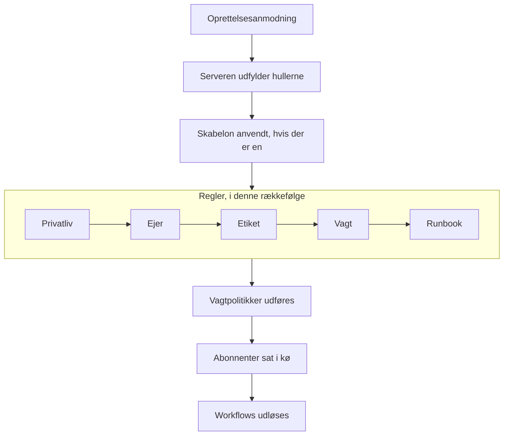

# Opret en hændelse

At erklære en hændelse opretter den optegnelse, dit team arbejder ud fra: den får et nummer, en alvorsgrad og en starttilstand, dens vagtpolitikker tilkalder folk, og — medmindre du siger andet — statussidens abonnenter hører om den. Denne side gennemgår de fem måder at erklære en på, felt for felt, og hvad der sker i det øjeblik, den findes.

:::cards
- [Erklær en i hånden](#erklær-en-i-hånden): Formularen i tre trin, felt for felt.
- [Erklær fra en skabelon](#erklær-fra-en-skabelon): Den samme slags hændelse, udfyldt på forhånd hver gang.
- [Erklær fra monitorkriterier](#erklær-automatisk-fra-monitorkriterier): Lad en fejlende kontrol åbne den for dig.
- [Erklær via API'et](#erklær-via-apiet): Fra din egen kode, et script eller et andet værktøj.
:::

## Fem måder, en hændelse bliver erklæret på

Der er fem måder, en hændelse kommer ind i OneUptime på, og de ender alle samme sted: en række i tabellen `Incident` med en alvorsgrad, en aktuel tilstand og en liste over berørte ressourcer. Forskellen er kun, hvem der udfylder felterne — dig klokken tre om natten, en gemt skabelon, en monitors kriterier, din egen kode, der kalder API'et, eller en uden for dit team, der udfylder en formular.

| Hvis du vil…                                                 | Vælg                                                                        |
| ------------------------------------------------------------ | --------------------------------------------------------------------------- |
| Åbne en hændelse i hånden og udfylde det hele                | Guiden **Erklær hændelse**                                                  |
| Åbne en tilbagevendende slags hændelse med felterne udfyldt på forhånd | **Opret fra skabelon**                                            |
| Åbne en automatisk, når en monitors kontroller fejler         | Et kriteriefilter på en monitor med **Når filtre matcher, erklæres en hændelse.** |
| Åbne en fra din egen kode, et script eller et andet værktøj   | `POST /api/incident`                                                        |
| Lade folk uden for dit team melde et problem via et link     | En [formular](/docs/forms/index)                                            |

Alle fem skriver den samme model, så en hændelse, som en probe åbnede, ser præcis ud som en, en vagthavende åbnede i hånden — bortset fra nogle få administrative kolonner, serveren sætter på de automatiske. Integrationer skriver den også: [Huntress](/docs/integrations/huntress) åbner én hændelse for hver hændelsesrapport, dens SOC sender.

> [!TIP]
> Du kan også erklære en hændelse fra advarsler: **Erklær hændelse** på en advarselsliste, i en advarsels hoved eller på en advarsels side **Tilknyttede hændelser** åbner den samme guide, udfyldt på forhånd fra advarslerne, og knytter dem til den nye hændelse. Et afkrydsningsfelt på formularen, markeret som standard, bekræfter også advarslerne, så de holder op med at eskalere. Se [Tilknyttede advarsler](/docs/incidents/linked-alerts).

## Erklær en i hånden

Formularen **Erklær ny hændelse** spørger om en hændelse i tre trin — **Hændelsesdetaljer**, **Berørte ressourcer** og **Vagt og roller** — og viser derefter en opsummering, du kan gennemgå. Når dit projekt spørger om nogle af sine brugerdefinerede hændelsesfelter ved oprettelsen, kommer et fjerde trin, **Detaljer**, lige efter **Berørte ressourcer**.

:::steps
1. Åbn **Hændelser → Alle hændelser**, og klik på **Erklær hændelse** øverst til højre i listen **Hændelser**. Formularen åbner på **Hændelsesdetaljer**.
2. Indtast en **Titel**, og vælg en **Hændelsesalvor**. Resten af formularen er valgfri.
3. Klik dig gennem de resterende trin med **Næste**, og udfyld det, du ved nu: monitorer og andre ressourcer, vagtpolitikker, roller.
4. Læs opsummeringen, og klik på **Erklær hændelse**. Du lander på den nye hændelse, og dens **Hændelse Feed** begynder at registrere.
:::

Kun det første trin har påkrævede felter, plus ethvert brugerdefineret felt, dine administratorer har markeret som **Påkrævet ved oprettelse**, og som trinnet **Detaljer** spørger om. Hvert trin før opsummeringen har en almindelig **Næste**, og **Erklær hændelse** står på opsummeringen, det sidste trin. Har du travlt, så udfyld **Hændelsesdetaljer** og tryk **Næste** gennem de andre trin uden at udfylde dem: at tilføje ressourcer, tilføje vagtpolitikker og tildele roller kan også vente til hændelsens egne sider. Trykker du på **Enter** i et felt, går det også videre; det erklærer aldrig før opsummeringen.

> [!TIP]
> De muligheder, de fleste hændelser aldrig har brug for, venter foldet sammen under en overskrift **Flere felter** i slutningen af deres trin; klik på den for at åbne dem. Mens den er foldet sammen, nævner overskriften, hvad der er indeni, og viser hver mulighed, der er sat, med dens værdi — sat af en skabelon for eksempel, eller af en privat advarsel, du erklærer fra — og den åbner af sig selv, når noget i den skal rettes. Opsummeringen nævner kun sådan en mulighed, når den er sat — undtagen **Underret statussideabonnenter**, som den altid nævner, med hvem der får besked.

**Fra en ressources egen side.** **Erklær hændelse** på fanen **Hændelser** for en monitor, en vært, en tjeneste, en klynge eller de fleste andre ressourcer åbner den samme formular med den ressource allerede valgt på **Berørte ressourcer**, så en titel og en alvorsgrad er alt, der skal til, og hændelsen vises på den fane, du startede fra.

:::details Hvilke ressourcesider tilbyder det, og hvad de vælger
**Erklær hændelse** på fanen **Hændelser** for en monitor, en vært, en Kubernetes-, Proxmox-, Ceph- eller Docker Swarm-klynge, en Docker- eller Podman-vært, en vCenter, et lagerarray, en IoT-flåde, en database eller en tjeneste åbner den samme guide med den ressource allerede valgt på **Berørte ressourcer** (en monitor under **Monitorer**, alt andet under **Andre berørte ressourcer**), foran alt, hvad en skabelon tilføjer. **Opret fra skabelon** på den fane beholder også ressourcen. Brødkrummestien fører tilbage via ressourcens fane, og når hændelsen er erklæret, lander du på den nye hændelse, som fra listen over hændelser.

Fanen **Hændelser** for et lagerelement vælger den vært, den tjeneste eller den Kubernetes-klynge, elementet peger på, og brødkrummestien fører tilbage via den ressources fane. **Opret advarsel** på en ressources fane **Advarsler** virker på samme måde: fra en monitor udfylder den advarslens **Overvågning**, fra alt andet **Andre berørte ressourcer**.

Ressourcen slås op med dine egne tilladelser: kan du ikke læse den, eller er den slettet, åbner formularen simpelthen uden noget valgt.
:::

### Trin 1 — Hændelsesdetaljer

- **Titel** — påkrævet. Resuméet på én linje, som alle ser i listen, i Slack og (hvis hændelsen er synlig) på din statusside. Pladsholder: `Incident Title`.
- **Hændelsesalvor** — påkrævet. En af de alvorsgrader, der er sat op for dit projekt; nye projekter får **Critical Incident**, **Major Incident** og **Minor Incident** på forhånd.
- **Beskrivelse** — valgfri, skrevet i Markdown. Det er dette felt, der vises på statussiden, så skriv det til kunderne og ikke til dit team. Et billede, du sætter ind i det, vises for alle, mens hændelsen er synlig på statussider, og kun for medlemmerne af dit projekt, mens den er skjult. Du kan redigere det senere fra **Beskrivelse** i hændelsens sidemenu.

Under **Flere felter**:

- **Erklæret den** — starter på det tidspunkt, du åbnede siden. Det er det tidspunkt, hver varighed på hændelsen måles fra, så sæt det tilbage, hvis du registrerer noget, der begyndte tidligere.
- **Indledende tilstand** — valgfri og tom fra start. Lader du den være tom, starter hændelsen i tilstanden med flaget `isCreatedState`, som nye projekter opretter som **Identified** — eller i skabelonens starttilstand, når du erklærer fra en skabelon. Vælg kun en senere tilstand, når du registrerer en hændelse, der allerede var forbi det punkt, bekræftet eller løst. Sådan en hændelse tilkalder ingen — se [Erklæret allerede bekræftet eller løst](#erklæret-allerede-bekræftet-eller-løst).
- **Etiketter** — valgfri. Etiketter samler beslægtede hændelser, så du kan filtrere på dem, og et team, hvis tilladelser er begrænset til etiketter, ser kun de hændelser, der har en af dets etiketter.
- **Privat hændelse** — afkrydsningsfelt, slået fra som standard (`isPrivate`). En privat hændelse er kun synlig for de brugere, der ejer den, medlemmerne af de teams, der ejer den, projektadministratorer og projektejere — og den er skjult for alle statussider, uanset enhver anden indstilling, også de statussider, den er begrænset til. Listen over hændelser markerer dem med et rødt mærke **Private**.

> [!NOTE]
> **Advarsler og episoder starter også i den tilstand, du vælger.** **Opret advarsel**, og **Opret episode** på listerne over hændelses- og advarselsepisoder, har den samme **Indledende tilstand** under **Flere felter**. Lader du den være tom, starter advarslen eller episoden i projektets oprettelsestilstand. Vælg en senere tilstand for at registrere en, der allerede var bekræftet eller løst: den starter i den tilstand, dens tilstandstidslinje begynder med den, og en episode, der registreres som løst, tæller straks som løst. Dens ejere får ikke besked om den første tilstand for sig, og en hændelsesepisodes statussideabonnenter hører om den én gang, når episoden oprettes. En advarsel eller episode, der registreres på denne måde, tilkalder ingen, ligesom en hændelse: se [Erklæret allerede bekræftet eller løst](#erklæret-allerede-bekræftet-eller-løst). Via API'et er det samme valg `currentAlertStateId` eller `currentIncidentStateId` — se [OneUptime API-reference](/docs/api-reference/api-reference).

:::details Skriv i Markdown-editoren
Beskrivelsen — ligesom noter, grundårsag, afhjælpning og brugerdefinerede felter med formateret tekst — skrives i Markdown-editoren. Den åbner i visuel tilstand, som viser teksten formateret; **Markdown** på værktøjslinjen skifter til Markdown-tilstand, som viser Markdown-kilden, og **Visual** skifter tilbage. I en liste rykker **Forøg indrykning** og **Formindsk indrykning** på værktøjslinjen, eller Tab og Shift+Tab, et punkt ind under punktet ovenover og ud igen; hvor der ikke er noget at rykke ind under, og uden for en liste, går Tab som sædvanlig videre til næste felt. I visuel tilstand deler **Kodeblok**, **Tabel** og **Opgaveliste** midt i eller i slutningen af en linje linjen ved markøren og sætter den nye blok på sine egne linjer — også i kanten af et fedt ord, et link eller inline-kode, uden at efterlade tom formatering — og **Opgaveliste** i et listepunkt tilføjer opgaven til det punkts liste i stedet for som en underopgave. I Markdown-tilstand indsættes **Kodeblok** og **Tabel** ved markøren, så start en ny linje til dem først, **Opgaveliste** gør markørens linje til en opgave, og **Nummereret liste** nummererer hvert niveau i en indlejret liste fra 1. Værktøjslinjen holder sig på én linje: formularer med editoren åbner i en bred dialog, så på de fleste skærme passer alle knapper, og hvor de ikke gør — på en telefon eller i et smalt vindue — ligger de knapper, der ikke passer, under **Mere formatering** (**⋯**) i slutningen af værktøjslinjen, i samme rækkefølge, og hver, du vælger dér, indsættes, hvor markøren stod. På de smalleste skærme flytter kontakten **Markdown** også derind.

**Fortryd.** I visuel tilstand fortryder Ctrl+Z (Cmd+Z på en Mac) dine ændringer én ad gangen, den nyeste først — det, du skrev, og editorens egne redigeringer: en forøget eller formindsket indrykning, en blok, den satte ind i en linje, en formateret eller blokvis indsættelse — og Ctrl+Shift+Z (Cmd+Shift+Z) eller Ctrl+Y sætter dem tilbage i samme rækkefølge. I Markdown-tilstand fortryder Ctrl+Z en indrykning, en listeknaps ændring og en formateret indsættelse, men ikke det, knapperne **Kodeblok**, **Tabel** og **Vandret linje** sætter ind.

**Indsæt i den.** Indsættelse fra Word, Google Docs eller en OneUptime-side — en anden hændelses beskrivelse for eksempel — bevarer listerne og deres indlejring, linkene og formateringen, og indsatte `•`-punkttegn bliver til en rigtig liste. Links, der kun er et ikon, som ankeret ved siden af en overskrift på GitHub, udelades. I visuel tilstand bliver kode eller et citat, der indsættes i en linje, til sin egen blok og deler linjen, og en liste, der indsættes i et listepunkt, slutter sig til det punkts liste i stedet for at blive indlejret i det — indsat i det tomme punkt, Enter efterlader, tager den det punkts plads — mens en kodeblok, et citat eller en tabel, der indsættes i et punkt, bliver i det. I Markdown-tilstand kommer det, indsættelsen gør til blokke — kode, et citat, en liste, en overskrift, flere afsnit — på sine egne linjer, med en tom linje på hver side, når det lander midt i en linje, og en liste, der indsættes i slutningen af et listepunkts linje, eller efter et bart `- `, slutter sig til den liste ved punktets indrykning; Markdown, du kopierede som ren tekst, indsættes ved markøren præcis, som den er. Det, du indsætter i en kodeblok, forbliver præcis, som du kopierede det. Indsættelse over en markering, der spænder over flere punkter, afsnit eller tabelceller, erstatter den, som skrivning ville. I visuel tilstand bevarer en indsættelse eller knappen **Kode** over tabelceller hver celle og kolonne, en indsættelse efterlader intet som et tomt punkttegn, citat eller kodeblok, og når markeringen slutter inde i en kodeblok, er det kun resten af den kodelinje, der slutter sig til teksten.

**Kopiér ud af en note.** En kodeblok, der kopieres fra en note eller en beskrivelse, indsættes igen som en kodeblok i sit sprog, og det gør en linje af den også, når den kopieres med sit linjeskift, som et tredobbelt klik kopierer den i Chrome, Edge og Safari. Et ord eller en del af en linje, der kopieres ud af en kodeblok, indsættes som inline-kode. I Chrome, Edge og Safari indsættes linjer, der kopieres fra en kodevisning, der er tegnet som en tabel — YAML-fanen for en Kubernetes-ressource, rammerne i en undtagelses stakspor — som deres rene tekst, med indrykningen bevaret.
:::

### Trin 2 — Berørte ressourcer

Monitorerne kommer først, for sig selv, fordi statussider ser en hændelse gennem dens monitorer, og den status, monitorerne skifter til, står lige under dem.

- **Monitorer** — et søgefelt, der tilføjer de monitorer, hændelsen berører; fanen **Etiketter** tilføjer hver monitor med en etiket på én gang. En statusside viser en hændelse, og giver sine abonnenter besked om den, når den viser en af hændelsens monitorer, så det er dem, der afgør, hvilke statussider der hører om den (`monitors` på hændelsen).
- **Skift overvågningsstatus til** — valgfri og kun vist, når mindst én monitor er valgt. Vælger en monitorstatus, der anvendes på hver monitor, der er knyttet til denne hændelse, så det at erklære hændelsen og markere monitorerne som forringede er én handling i stedet for to. Erklærer du fra en skabelon, der sætter en, starter feltet med skabelonens status, vist så snart du vælger en monitor. Uden valgt monitor gemmes der ingen status, heller ikke skabelonens; fjerner du den sidste monitor, forsvinder feltet, indtil du vælger en anden, hvilket bringer dit valg tilbage. En monitors status deles af hver statusside, der viser den, så med statussider valgt under **Flere felter** minder formularen dig om, at ændringen også vises på de sider, du ikke valgte.
- **Andre berørte ressourcer** — et andet søgefelt til alt andet, hændelsen berører: værter, Kubernetes-klynger, Docker- og Podman-værter, Proxmox-, Ceph- og Docker Swarm-klynger, vCentere, lagerarrays, IoT-flåder, databaser og tjenester — alt ud over monitorer, som hændelsens eget kort **Berørte ressourcer** tilbyder. Under motorhjelmen er det separate relationer på hændelsen (`hosts`, `kubernetesClusters`, `dockerHosts`, `podmanHosts`, `services` og flere), men formularen samler dem i én vælger.

En monitor kan sige, hvad den overvåger — **Overvågning → Oversigt → Tilknyttede ressourcer**, de samme slags ressourcer som **Andre berørte ressourcer**. Vælg sådan en monitor, og det, den er knyttet til, føjes straks til **Andre berørte ressourcer**, og en linje under feltet nævner, hvad der blev tilføjet. Fjern det, du ikke vil have, før du erklærer: intet tilføjes igen for den monitor, mens du bliver på formularen, og fjerner du monitoren, bliver det, den tilføjede, stående. Det samme sker, når en monitor kommer fra en skabelon eller fra den side, du erklærede fra, og på **Opret advarsel** og **Schedule Maintenance**.

Hændelsens kort **Berørte ressourcer** spørger på samme måde, når du redigerer det senere: **Monitorer**, **Skift overvågningsstatus til**, så snart der er en monitor, og derefter **Andre berørte ressourcer**. Gemmes en hændelse uden monitor, beholder den den status, den havde.

Under **Flere felter**:

- **Begræns til disse statussider** — valgfri. Lader du det være tomt, vises hændelsen på, og giver den besked til abonnenterne på, hver statusside, der viser dens monitorer. Vælg sider her, og kun de valgte sider blandt dem bruges; fanen **Etiketter** tilføjer hver side med en etiket på én gang. Formularen advarer dig, når en valgt side ikke viser nogen af hændelsens monitorer, og når hændelsen er privat, hvilket skjuler den for alle statussider. Se [Én statusside pr. målgruppe](/docs/status-pages/one-status-page-per-audience).
- **Underret statussideabonnenter** — afkrydsningsfelt, slået til som standard. Styrer, om abonnenterne får besked om, at hændelsen er oprettet (`shouldStatusPageSubscribersBeNotifiedOnIncidentCreated`). At folde det sammen under **Flere felter** ændrer intet ved, hvad det gør: det starter stadig markeret, og opsummeringen nævner det altid. Under det, og igen på opsummeringen, før du sender, viser **Will notify** de statussider, der får besked, med et "op til"-antal abonnenter pr. kanal, og de sider, der ikke får besked, og hvorfor. Får ingen besked (ingen monitor er knyttet til, ingen statusside viser monitorerne, eller siderne har endnu ingen abonnenter), viser det intet, og det advarer kun, når hændelsens statussideomfang er årsagen. På opsummeringen viser **Forhåndsvisning**, ved siden af **Ja**, den e-mail, abonnenterne på hver af de statussider får, og **Send test til mig** sender den til din egen kontos e-mail; se [Abonnenter og meddelelser](/docs/status-pages/subscribers#hændelser). Slå det fra for intern støj, du stadig vil have registreret. Hændelsen forbliver så stille som standard: nye offentlige noter på den, og dialogen til tilstandsændringer på dens oversigtsside (**Bekræft**, **Løs** eller valg af en anden tilstand), starter med deres eget afkrydsningsfelt **Underret statussideabonnenter** slået fra. Den manuelle formular på siden **Tilstandstidslinje** og massehandlingen **Skift tilstand** i listen over hændelser starter stadig med det slået til.

> [!IMPORTANT]
> **Tilknyt monitorer, også når det føles overflødigt.** Forbindelsen mellem en hændelse og en statusside går gennem hændelsens monitorer: en statusside viser en hændelse, og giver sine abonnenter besked om den, når en af dens ressourcer er en af hændelsens monitorer. **Begræns til disse statussider** kan kun indsnævre den liste, aldrig udvide den, og en statusside med **Vis kun hændelser, der er begrænset til denne side** slået til viser kun de hændelser, der er begrænset til den. En hændelse uden monitorer giver slet ingen statussideabonnent besked. Se [Statusside – ressourcer og grupper](/docs/status-pages/resources-and-groups).

Flaget **Should be visible on status page?** (`isVisibleOnStatusPage`) er ikke med i guiden; det er sandt som standard. Ændr det bagefter fra **Indstillinger** i hændelsens sidemenu, hvor det hedder **Synlig på statussiden**.

**Erklær skjult, og offentliggør senere.** En hændelse, der er skjult for statussider, når den oprettes, giver ingen abonnent besked, og dens notifikationsstatus lyder **Sprunget over: skjult på statussider**. Når du senere slår **Synlig på statussiden** til, tilbyder redigeringsformularen **Underret abonnenter om, at denne hændelse er oprettet**, så rutinen med at erklære skjult, finde ud af, hvem der er berørt, og så offentliggøre, stadig giver dem besked. Det starter markeret, mens hændelsen ikke er løst, og umarkeret, når den er løst, så det at offentliggøre en gammel hændelse for en ordens skyld ikke annoncerer den som ny. Det tilbydes kun, når hændelsen blev erklæret med **Underret statussideabonnenter** slået til og ikke er privat — altså ikke for en hændelse, der er meldt via en [formular](/docs/forms/on-submit), som erklæres skjult og med det slået fra. Via API'et sender du `"miscDataProps": {"notifySubscribersOfIncidentCreatedOnPublish": true}` med den opdatering, der sætter `isVisibleOnStatusPage` til `true`, eller sætter selv `subscriberNotificationStatusOnIncidentCreated` tilbage til `Pending`. En postmortem, der blev offentliggjort, mens hændelsen var skjult, behøver intet afkrydsningsfelt: at slå **Synlig på statussiden** til sender den én gang, som beskrevet i [Abonnenter og meddelelser](/docs/status-pages/subscribers#hændelser).

### Detaljer — dine brugerdefinerede hændelsesfelter

Dette trin vises kun, når mindst ét brugerdefineret hændelsesfelt har **Vis ved oprettelse** slået til under **Hændelser → Indstillinger → Brugerdefinerede felter** — eller, når du erklærer fra en skabelon, når skabelonens **Brugerdefinerede felter ved oprettelse** spørger om et. Det spørger om de felter, i deres **Rækkefølge** — den rækkefølge, de er trukket i på den indstillingsside — med den indtastning, deres type kræver: en rullemenu, et tal, en dato, en ja/nej-kontakt, lang tekst eller formateret tekst i Markdown-editoren. Det udelades også for en, der ikke kan læse projektets brugerdefinerede hændelsesfelter: på OneUptime Cloud kræver det abonnementet **Growth** eller derover og en rolle, der kan se brugerdefinerede hændelsesfelter.

- Et felt, der er markeret som **Påkrævet ved oprettelse**, skal udfyldes, før du kan erklære. Et påkrævet ja/nej-felt — en bekræftelse for eksempel — skal være slået til.
- Et 0 eller en kontakt, der er slået fra, er et svar og gemmes som et.
- Et felt, hvis værdi kopieres fra et brugerdefineret monitorfelt, spørges der ikke om, når hændelsen har en monitor, fordi værdien kopieres fra monitoren, når hændelsen oprettes.
- At erklære fra en skabelon starter trinnet med skabelonens værdier, og skabelonens værdier for felter, trinnet ikke spørger om, bevares, som de er. En værdi, du rydder i trinnet, forbliver ryddet. En skabelonværdi, der ikke længere passer til sit felt — en mulighed i en rullemenu, der er fjernet siden — udelades i stedet for at afvise hændelsen.
- At erklære fra en skabelon følger også skabelonens **Brugerdefinerede felter ved oprettelse**. Et felt, den markerer som **Påkrævet** eller **Valgfrit**, spørges der om, også når projektet ikke viser det ved oprettelse; et felt, den markerer som **Skjult**, spørges der ikke om — skabelonens værdi for det gælder stadig — og et felt, der står på **Standard**, følger sine egne **Vis ved oprettelse** og **Påkrævet ved oprettelse**. Se [Brugerdefinerede felter ved oprettelse](/docs/incidents/settings#brugerdefinerede-felter-ved-oprettelse).

**Påkrævet ved oprettelse** kontrolleres kun af dashboardet, og det samme gælder en skabelons **Brugerdefinerede felter ved oprettelse**. Hændelser, der oprettes af monitorer, API'et, Slack, Microsoft Teams eller AI, kan lade et felt stå tomt, og hvert felt forbliver valgfrit på hændelsens side **Brugerdefinerede felter** bagefter, så det at rette én værdi midt under et udfald aldrig kræver alle de andre. Se [Brugerdefinerede felter](/docs/incidents/settings#brugerdefinerede-felter) for felttyperne og indstillingerne.

### Trin 3 — Vagt og roller

- **Vagtpolitik** — et flervalg af de vagtpolitikker, der skal udføres, når denne hændelse oprettes. Det svarer til `onCallDutyPolicies` på hændelsen.
- **Tildel hændelsesroller** — hvem der tager hver rolle, dit projekt definerer, ét kort pr. rolle. En rolle med mærket **Primær**, som du lader stå tom, er din: du tager den, når hændelsen erklæres, og opsummeringen siger det. En rolle til én person siger det, når den har en; en rolle til flere beholder sin vælger.

Dette er det eneste sted, hvor en vagtpolitik knyttes direkte til en hændelse. Alvorsgrader bærer ingen vagtpolitik — alvorsgraden er en etiket, og den påvirker kun tilkaldelse som *matchkriterium* i en vagtregel. Regler, der er sat op under **Hændelser → Regler → Vagtregler**, lægger deres politikker oven i det, du vælger her; det endelige sæt, der kører, er foreningen af begge uden dubletter. En hændelse, der erklæres i en senere tilstand, kører ingen af dem — se [Erklæret allerede bekræftet eller løst](#erklæret-allerede-bekræftet-eller-løst).

Selve rollerne sættes op under **Hændelser → Indstillinger → Hændelsesroller**. Et nyt projekt har én, Hændelsesleder; tilføj dér Responder, Communications Lead eller hvad din proces ellers har brug for. Vælger du ingen som Hændelsesleder, bliver du det, når hændelsen erklæres.

## Erklær fra en skabelon

Bliver du ved med at erklære den samme slags hændelse — det samme titelmønster, den samme alvorsgrad, den samme vagtpolitik — så gem den én gang som en skabelon, og erklær derefter fra den:

:::steps
1. Klik på **Opret fra skabelon** i listen **Hændelser** (den omridsede knap ved siden af **Erklær hændelse**). En dialog **Opret hændelse ud fra skabelon** åbner, med en rullemenu **Vælg hændelsesskabelon**.
2. Vælg en skabelon. Oprettelsesformularen åbner udfyldt på forhånd.
3. Ændr det, der er anderledes denne gang, gå derefter trinene igennem, og erklær som sædvanlig.
:::

Har dit projekt endnu ingen skabeloner, får du i stedet en dialog **No Incident Templates** med en knap **Create Template**, der fører dig til **Hændelser → Indstillinger → Hændelsesskabeloner**.

Skabeloner bygges med deres egen guide i fire trin — **Skabeloninformation**, **Hændelsesdetaljer**, **Berørte ressourcer**, **Vagt** — plus trinene **Brugerdefinerede felter** og **Brugerdefinerede felter ved oprettelse** efter **Berørte ressourcer**, når dit projekt har brugerdefinerede hændelsesfelter. Skabelonens **Indledende hændelsestilstand**, **Ejere** og **Etiketter** ligger under **Flere felter** i slutningen af **Hændelsesdetaljer**. **Berørte ressourcer** spørger, som erklæringsformularen gør — **Monitorer**, derefter **Skift overvågningsstatus til**, derefter **Andre berørte ressourcer**, med **Begræns til disse statussider** under **Flere felter** — bortset fra at en skabelon altid spørger om monitorstatussen: den gælder også de monitorer, der vælges, når en hændelse erklæres fra skabelonen. Det er felterne:

| Felt                            | Formål                                                 |
| ------------------------------- | ------------------------------------------------------ |
| **Skabelonnavn**                | Hvordan skabelonen genkendes i vælgeren.               |
| **Skabelonbeskrivelse**         | En note til dit fremtidige jeg om, hvornår den skal bruges. |
| **Titel**                       | Den titel, der udfyldes på hændelsen.                  |
| **Beskrivelse**                 | Markdown-beskrivelsen, der udfyldes på hændelsen.      |
| **Hændelsesalvor**              | Den alvorsgrad, der udfyldes på hændelsen.             |
| **Indledende hændelsestilstand** | Den tilstand, hændelser fra denne skabelon starter i. Tom betyder den sædvanlige starttilstand. En hændelse, der starter bekræftet eller løst, tilkalder ingen. |
| **Monitorer**                   | De monitorer, der skal tilknyttes.                     |
| **Skift overvågningsstatus til** | Den monitorstatus, der anvendes på hændelsens monitorer, også dem, der vælges, når den erklæres. |
| **Andre berørte ressourcer**    | De værter, klynger og tjenester, der skal tilknyttes.  |
| **Begræns til disse statussider** | De statussider, hændelsen begrænses til.             |
| **Vagtpolitik**                 | De politikker, der udføres, når hændelsen oprettes.    |
| **Ejere**                       | Personer og teams, der ejer hændelser oprettet fra denne skabelon, valgt fra én liste. |
| **Etiketter**                   | De etiketter, der sættes på hændelsen.                 |
| **Brugerdefinerede felter**     | Værdier til hændelsens brugerdefinerede felter.        |
| **Brugerdefinerede felter ved oprettelse** | Hvilke brugerdefinerede felter trinnet **Detaljer** spørger om, og hvilke der skal udfyldes. |

Et par hurtige regler:

- Skabeloner kan ikke redigeres fra listen over skabeloner — du opretter en og åbner den derefter for at ændre den.
- En skabelon udfylder kun et felt, du lod stå tomt. På oprettelsessiden anvendes skabelonen som en forudfyldning, du kan overskrive; på serveren — for en formular, der erklærer fra en skabelon — udfyldes et felt kun fra skabelonen, når anmodningen lod feltet være `undefined`. Det, kalderen angav, vinder altid.
- Trinnet **Detaljer** følger skabelonens **Brugerdefinerede felter ved oprettelse**, som [beskrevet ovenfor](#detaljer-dine-brugerdefinerede-hændelsesfelter).
- Værdier i brugerdefinerede felter flettes ét felt ad gangen. En skabelons værdier udfylder de brugerdefinerede felter, hændelsen erklæres uden; en værdi, der er sat i trinnet **Detaljer** eller sendt i anmodningens `customFields`, vinder altid — `0`, `false` og `null` inklusive. Et felt, der kopieres fra et brugerdefineret monitorfelt, får stadig monitorens værdi.
- En eksisterende skabelons værdier i brugerdefinerede felter står på dens kort **Brugerdefinerede felter**, ved siden af dens andre kort.
- Skabelonens **Ejere** tilføjes, når hændelsens Slack- og Microsoft Teams-kanaler findes, så en notifikationsregel, der inviterer hændelsens ejere til en ny kanal, også inviterer dem. At erklære fra en skabelon i dashboardet tilføjer dem uden beskeden "du er blevet tilføjet"; en [formular](/docs/forms/on-submit) med en skabelon giver dem besked og holder hændelsens notifikation **Hændelse oprettet** tilbage, indtil de er tilføjet, så den går til dem og ikke til projektets ejere.

## Erklær automatisk fra monitorkriterier

De fleste hændelser burde ikke kræve, at et menneske skriver dem ind. En monitors kriterier kan erklære en i det øjeblik, et filter matcher:

:::steps
1. Åbn monitoren, vælg **Kriterier** i dens sidemenu, og klik på **Edit Monitoring Criteria**. (En ny monitor spørger om de samme kriterier, mens du opretter den.)
2. Slå **Når filtre matcher, erklæres en hændelse.** til i det kriteriefilter, der skal erklære. Et afsnit **Opret hændelse** vises med en knap **Tilføj hændelse** — ét kriteriefilter kan erklære mere end én hændelse.
3. Udfyld hændelsens felter (se nedenfor), og gem. Næste gang filteret matcher, erklæres hændelsen og tilkalder sine vagtpolitikker.
:::

Hver hændelsespost har:

- **Hændelsestitel** — understøtter skabeloner; pladsholderen foreslår noget i stil med `{{monitorName}} is down`.
- **Alvorlighed** — påkrævet.
- **Hændelsesbeskrivelse** — også med skabeloner.
- **Vagt → Vagtpolitikker** — de politikker, der udføres, når denne hændelse oprettes.
- **Hændelsesroller** — hvem der tager hver rolle på hændelsen, valgt på de samme kort som **Tildel hændelsesroller** på erklæringsformularen, ét pr. rolle. Vises, når dit projekt har hændelsesroller.
- **Ejerskab og etiketter → Ejere** (personer og teams, valgt fra én liste), **Etiketter**.
- **Flere felter → Løs hændelse automatisk** (løser hændelsen automatisk, når kriterierne holder op med at matche), **Vis hændelse på statusside**, **Privat hændelse** og **Afhjælpningsnoter**.

For den fulde liste over `{{variable}}`-pladsholdere, du kan bruge i titlen, beskrivelsen og afhjælpningsnoterne, se [Hændelse- og advarselsskabeloner](/docs/monitor/incident-alert-templating).

Hændelser, der oprettes på denne måde, mærkes af serveren: `isCreatedAutomatically` sættes, `createdCriteriaId` registrerer, hvilket kriteriefilter der udløste, og `createdByProbe` registrerer, hvilken probe der så det. Alt andet ved dem opfører sig præcis som en hændelse, der er erklæret i hånden.

En hændelse, som en monitor erklærer, knyttes til det, monitoren overvåger: alt, hvad dens konfiguration nævner (værten for en værtsmonitor, klyngen for en Kubernetes-monitor, tjenesterne for en logmonitor) og alt under dens **Tilknyttede ressourcer**. En website- eller API-monitors konfiguration nævner ingen infrastruktur, så knyt den til klyngen, værterne eller databasen bag sitet: dens hændelser står så på de ressourcers sider, OneUptime AI kan undersøge dem dér, og klyngens eller ressourcens AI-rettelse kan handle på dem (se [AI SRE](/docs/ai/ai-sre#which-incidents-a-clusters-fixes-act-on)). Advarsler, en monitor opretter, knyttes på samme måde.

## Erklær via API'et

Hændelsesmodellen udstiller et standard-CRUD-endpoint, så `POST /api/incident` opretter en. Godkend med en API-nøgle, der er oprettet under **Projektindstillinger → Avanceret → API-nøgler**, sendt i headeren `apikey` — nøglen identificerer projektet, så du behøver ikke at angive et projekt-id separat.

```bash
curl -X POST https://oneuptime.com/api/incident \
  -H "apikey: $ONEUPTIME_API_KEY" \
  -H "Content-Type: application/json" \
  -d '{
    "data": {
      "title": "Checkout latency above SLO",
      "description": "Investigating elevated p99 latency on the checkout service.",
      "incidentSeverityId": "<incident-severity-id>"
    }
  }'
```

Nyttige felter i anmodningens body:

| Felt                     | Påkrævet | Noter                                                                                                                                                                                                                                       |
| ------------------------ | -------- | ------------------------------------------------------------------------------------------------------------------------------------------------------------------------------------------------------------------------------------------- |
| `title`                  | Ja       | Hændelsens titel.                                                                                                                                                                                                                           |
| `incidentSeverityId`     | Ja       | En af dit projekts alvorsgrader. Serveren kontrollerer, at den hører til samme projekt som API-nøglen, og afviser anmodningen, hvis den ikke gør.                                                                                          |
| `declaredAt`             | Nej      | Valgfri her, selv om formularen kræver den. Udelader du den, bruger serveren det aktuelle tidspunkt.                                                                                                                                        |
| `currentIncidentStateId` | Nej      | Den tilstand, der skal startes i; udeladt oprettelsestilstanden. Kontrolleres mod API-nøglens projekt, ligesom alvorsgraden. Den samme kontrol gælder monitorstatussen bag **Skift overvågningsstatus til**.                              |
| `statusPages`            | Nej      | Id'erne på de statussider, hændelsen begrænses til, alle fra samme projekt. Udelad det for at nå hver statusside, der viser hændelsens monitorer. `isScopedToStatusPages` udledes af det, og en værdi, du sender til det, ignoreres. Se [Én statusside pr. målgruppe](/docs/status-pages/one-status-page-per-audience). |
| `customFields`           | Nej      | Hændelsens værdier i brugerdefinerede felter med hvert felts navn som nøgle. Hver værdi, du sender, skal passe til sit felt — et tal til et felt **Tal**, en af mulighederne til en **Rullemenu (enkeltvalg)** — ellers afvises anmodningen med en fejl `400`, der nævner feltet. **Påkrævet ved oprettelse** kontrolleres ikke her. Se [Værdier i brugerdefinerede felter via API'et](/docs/incidents/settings#værdier-i-brugerdefinerede-felter-via-apiet). |

En API-nøgle kan ikke erklære fra en skabelon: en anmodning, der sender `createdIncidentTemplateId`, afvises. OneUptime sætter selv den kolonne, for hændelser, der meldes via en [formular](/docs/forms/on-submit), og for et workflows trin **Create One Incident**, som erklærer fra den skabelon, der er valgt under dets indstilling **Incident Template** (se [Workflow-komponenter](/docs/workflows/components)). For at erklære fra en skabelon via API'et læser du skabelonen fra `/api/incident-templates` og sender dens værdier i anmodningen.

Relaterede endpoints er `/api/incident-state`, `/api/incident-severity` og `/api/incident-state-timeline`. Den genererede [API-reference](/reference) har den præcise form på anmodning og svar for hver af dem, også hvordan relationsfelter som monitorer udtrykkes.

## Meld via en formular

Den femte vej ind er for folk uden for dit team. En formular er en side, du deler som et link: alle, der har det, kan melde et problem uden en OneUptime-konto, og hver indsendelse erklærer en hændelse. Du bestemmer, hvad formularen spørger om — en titel, en beskrivelse, en alvorsgrad, monitorer, brugerdefinerede felter, egne spørgsmål — og hvordan svarene bliver til hændelsen: en standardalvorsgrad, en hændelsesskabelon at erklære fra, og monitorer, etiketter, vagtpolitikker og ejere, der altid tilføjes.

Hændelser, der meldes på denne måde, erklæres skjult for statussider, med **Underret statussideabonnenter** slået fra, så en vagthavende vurderer dem, før noget bliver offentligt, og en privat note registrerer, hvem der meldte dem. Formularer er et produkt for sig, under **Formularer** i menuen **Produkter**, og kan også planlægge vedligeholdelseshændelser; se [Formularer](/docs/forms/index).

## Hændelsesnumre og præfikser

Hver hændelse får et fortløbende nummer fra en tæller pr. projekt, som serveren tildeler ved oprettelsen. To kolonner rummer det: `incidentNumber` (det rå heltal) og `incidentNumberWithPrefix` (det, du faktisk ser). Uden præfiks er den viste værdi `#42`.

:::steps
1. Gå til **Hændelser → Indstillinger → Nummerpræfiks**, og klik på **Opdater**.
2. Skriv præfikset i **Nummerpræfiks for hændelse**. Feltet viser nummeret, mens du skriver: `INC-` gør det til `INC-42`. Lad det stå tomt for at beholde standarden `#`.
3. Klik på **Gem ændringer**. Hændelser, der erklæres fra nu af, får det nye præfiks; eksisterende hændelser beholder deres numre.
:::

Den samme dialog har **Nummerpræfiks for hændelsesepisode** til nummerering af episoder. [Nummerpræfikser](/docs/incidents/settings#nummerpræfikser) nævner de regler, et præfiks følger.

Nummeret vises som den første kolonne i listen over hændelser, linker til hændelsen og vises som **Hændelsesnummer** på hændelsens **Oversigt**.

## Hvad der sker i det øjeblik, en hændelse erklæres

Oprettelseskaldet gør mere end at skrive en række:



I rækkefølge:

1. **Serveren udfylder hullerne.** `declaredAt` er som standard nu, den aktuelle tilstand er som standard projektets tilstand med `isCreatedState`, og hændelsesnummeret og nummeret med præfiks tildeles fra projektets tæller.
2. **En skabelon anvendes**, når en formular eller et workflows trin **Create One Incident** erklærer hændelsen fra en (`createdIncidentTemplateId`) — og udfylder kun felter, kalderen lod være undefined; en tilstand, kalderen nævner, vinder over skabelonens. Dashboardet anvender i stedet en skabelon i formularen, før anmodningen sendes.
3. **Privatlivsregler kører** og markerer hændelsen som privat, når en matchende regel siger det. Det er den første regelmotor, der kører, så alt efter den ser den rigtige privatlivsindstilling.
4. **Ejerregler kører** og tilføjer de brugere og teams som ejere, som matchende regler nævner.
5. **Etiketregler kører** og tilføjer de etiketter, der passer til hændelsen.
6. **Vagtregler kører.** Hver aktiveret regel under **Hændelser → Regler → Vagtregler**, hvis kriterier matcher, tilføjer sine politikker til hændelsen. Der er ingen prioritetsrækkefølge og ingen kortslutning — alle matchende regler udløses, og politikkerne fjernes for dubletter.
7. **Runbook-regler kører** og knytter matchende runbooks til og starter dem. Se [Runbooks](/docs/runbooks/index).
8. **Vagtpolitikker udføres.** Hver politik på hændelsen — valgt i guiden, arvet fra en skabelon eller tilføjet af en regel — udføres parallelt med hændelsestypen `IncidentCreated`. Fejler én politik, stopper det ikke de andre. En arkiveret politik tilkalder ingen: dens udførelseslog på hændelsen siger, at den ikke blev udført, fordi politikken er arkiveret. En hændelse, der erklæres allerede bekræftet eller løst, kører ingen af dem; se [Erklæret allerede bekræftet eller løst](#erklæret-allerede-bekræftet-eller-løst) nedenfor.
9. **Abonnenter sættes i kø**, hvis **Underret statussideabonnenter** blev stående slået til, og hændelsen er synlig på statussiden. Leveringen klares af et baggrundsjob, ikke inde i din anmodning, og går til de statussider, hændelsen når: dem, der viser dens monitorer, indsnævret af **Begræns til disse statussider**, og uden de sider, der kun viser hændelser, der er begrænset til dem, når den ikke er begrænset. En arkiveret statusside sender intet. Fremskridtet vises som **Abonnentnotifikationsstatus** på hændelsens **Oversigt**: hvad der blev sendt, og hvad der fejlede på hver statusside, og **Prøv igen** eller **Send igen**, når det er afsluttet. Se [Abonnenter og meddelelser](/docs/status-pages/subscribers).
10. **Workflows udløses.** Udløseren **On Create Incident** starter ethvert workflow, der er bygget på den. Se [Workflows – Oversigt](/docs/workflows/index).

Derfra er hændelsen live: den tæller med i mærket **Aktive hændelser** i Hændelsers sidemenu (enhver tilstand over din løste tilstand tæller som aktiv), den vises på de statussider, der viser en af dens monitorer (kun de valgte, hvis du begrænsede den), og dens **Tilstandstidslinje** begynder at registrere.

### Erklæret allerede bekræftet eller løst

At vælge en senere **Indledende tilstand** — på formularen, via en skabelons **Indledende hændelsestilstand** eller med `currentIncidentStateId` fra API'et, Terraform eller et workflow — registrerer en hændelse, som nogen allerede håndterer, eller som allerede er overstået. Den behandles ikke som en ny nødsituation:

```mermaid title="Hvad en ny hændelse sætter i gang, efter den tilstand den starter i"
flowchart TB
    start{"Starttilstand"} -->|"Oprettelsestilstanden, standarden"| live["Behandlet som ny: tilkalder vagten"]
    start -->|"Ved eller efter bekræftet"| acked["Registreret: tilkalder ingen"]
    start -->|"Ved eller efter løst"| over["Registreret som overstået"]
    over --> quiet["Ingen gruppering, runbooks, AI, kanal eller SLA"]
```

- **Ved eller efter din bekræftede tilstand** — **Bekræftet**, eller enhver tilstand, der står under den i **Hændelser → Indstillinger → Hændelsesstatus** — kører ingen vagtpolitik, så ingen tilkaldes. Hændelsen nævner stadig sine politikker, dem du valgte, og dem vagtregler tilføjer, og dens feed siger hvorfor på én linje: _No one was paged. This incident was created already acknowledged, so its on-call policy **Primary** was not run._ Dens SLA, hvis en regel giver den en, starter allerede som besvaret. Alt andet nedenfor kører som for enhver ny hændelse.
- **Ved eller efter din løste tilstand** — **Løst**, eller enhver tilstand, der står under den — er hændelsen overstået, så oven i det kører intet, der reagerer på en live hændelse:
  - den grupperes ikke i en episode, som kunne tilkalde igen;
  - ingen runbook-regel og ingen regel for automatisk afhjælpning handler på den;
  - OneUptime AI undersøger den ikke — dens kort **AI Investigation** siger, at den blev oprettet allerede løst, og **Ask OneUptime AI** under det besvarer stadig spørgsmål om den;
  - der oprettes ingen Slack- eller Microsoft Teams-kanal til den;
  - dens monitorer beholder deres status og bliver ved med at blive overvåget, uanset hvad **Skift overvågningsstatus til** siger;
  - der startes ingen SLA for den.
- **Hvad der stadig sker:** privatlivs-, ejer-, etiket- og vagtregler kører, dens ejere tilføjes og får besked om, at den er oprettet, posten **Hændelse oprettet** skrives i dens feed og slås op i de Slack- og Microsoft Teams-kanaler, dine regler nævner, og statussidens abonnenter får besked, når **Underret statussideabonnenter** er slået til, og hændelsen vises på deres statusside. En hændelse, der allerede er overstået, er stadig nyt for dem.

Advarsler, advarselsepisoder og hændelsesepisoder følger samme regel: en, der oprettes allerede bekræftet, tilkalder ingen, og en, der oprettes løst, bliver heller ikke grupperet, afhjulpet eller undersøgt af AI og får ingen egen kanal. En hændelse eller advarsel i oprettelsestilstanden — standarden, og hver en, en monitor åbner — sætter alt i gang som før.

## Fejlfinding

:::details Erklæringen fejler og beder om en oprettelsestilstand for hændelser
Har dit projekt ingen tilstand med flaget `isCreatedState`, fejler oprettelseskaldet og beder dig tilføje en oprettelsestilstand for hændelser fra indstillingerne. Det sker normalt kun i et projekt, hvis tilstande er blevet kraftigt redigeret — se [Hændelsestilstande og alvorsgrader](/docs/incidents/states-and-severities).
:::

:::details Hændelsen blev erklæret, men ingen statussideabonnent hørte om den
Kontrollér i denne rækkefølge: **Underret statussideabonnenter** var slået til; hændelsen har mindst én monitor knyttet til sig, og en statusside viser den monitor; hændelsen er synlig på statussider og ikke privat; og siden er ikke udeladt af **Begræns til disse statussider**. **Abonnentnotifikationsstatus** på hændelsens **Oversigt** siger, hvilken af dem der stoppede den.
:::

:::details Trinnet Detaljer med vores brugerdefinerede felter vises ikke
Trinnet vises kun, når et felt har **Vis ved oprettelse** slået til, eller en skabelons **Brugerdefinerede felter ved oprettelse** spørger om et, og kun for en, der kan læse projektets brugerdefinerede hændelsesfelter — på OneUptime Cloud kræver det abonnementet **Growth** eller derover.
:::

## Hvad du kan læse bagefter

:::cards
- [Hændelsestilstande og alvorsgrader](/docs/incidents/states-and-severities): Hvad tilstandsflagene gør, og hvordan du tilføjer dine egne.
- [Hændelsesnoter, ejere og feed](/docs/incidents/notes-owners-and-feed): Offentlige noter, private noter, ejere og aktivitetsfeedet.
- [Hændelsesindstillinger og automatisering](/docs/incidents/settings): Skabeloner, brugerdefinerede felter, roller, regler og workflow-udløsere.
- [Abonnenter og meddelelser](/docs/status-pages/subscribers): Hvem der hører om den hændelse, du lige har erklæret.
:::
