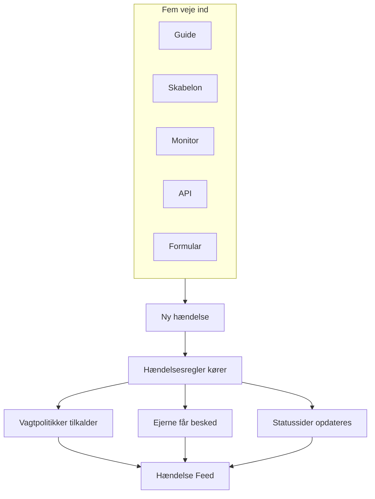
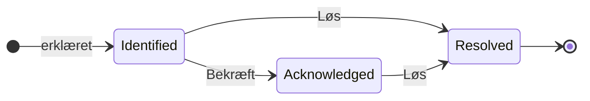

# Hændelser – Oversigt

En hændelse er den optegnelse, dit team arbejder ud fra, når noget går i stykker: hvad der er ramt, hvor slemt det er, hvor langt indsatsen er nået, hvem der ejer den, og alt det, der bliver skrevet ned undervejs. At erklære en tilkalder den rigtige vagtrotation, giver ejerne besked og — hvis du vil — sætter udfaldet på din statusside, så kunderne ved, at du er på sagen.

:::cards
- [Opret en hændelse](/docs/incidents/declaring-incidents): I hånden, fra en skabelon, fra en monitor, via API'et eller via en formular.
- [Hændelsestilstande og alvorsgrader](/docs/incidents/states-and-severities): Livscyklussen, og hvad bekræftelse og løsning gør.
- [Hændelsesnoter, ejere og feed](/docs/incidents/notes-owners-and-feed): Opdateringer til kunder og til dit team, og hvem der hører om dem.
- [Tilknyttede advarsler](/docs/incidents/linked-alerts): Knyt de advarsler, et udfald udløste, til den hændelse, der forklarer dem.
- [Hændelsesindstillinger og automatisering](/docs/incidents/settings): Skabeloner, brugerdefinerede felter, roller, målinger og regler.
:::

## Kort fortalt

- **Sit eget produkt** — åbn **Hændelser** fra menuen **Produkter** i topbjælken; listen ligger på `/dashboard/{projectId}/incidents`.
- **Tre forudoprettede tilstande** — **Identified**, **Bekræftet** og **Løst** oprettes for hvert nyt projekt. Du kan tilføje dine egne; de tre forudoprettede kan omdøbes og få nye farver, men aldrig slettes.
- **Tre forudoprettede alvorsgrader** — **Critical Incident**, **Major Incident** og **Minor Incident**. En alvorsgrad er en etiket med en farve og en rækkefølge — den har ingen adfærd i sig selv.
- **Fem veje ind** — guiden **Erklær hændelse**, **Opret fra skabelon**, en kriterieregel på en monitor, `POST /api/incident` eller en [formular](/docs/forms/index), som alle med linket kan udfylde.
- **Nummereret pr. projekt** — hver hændelse får et hændelsesnummer fra en tæller pr. projekt, vist med projektets præfiks: `INC-42` i et nyt projekt, eller `#42` uden præfiks.
- **To slags noter** — private noter (interne noter) til dit team, offentlige noter til statussidens abonnenter.
- **Advarsler knyttes til hændelser** — knyt de advarsler, der hører til en hændelse, eller erklær en hændelse direkte fra advarsler — fra en advarselsliste eller fra en advarsels egen side — og bekræft dem samtidig. Se [Tilknyttede advarsler](/docs/incidents/linked-alerts).
- **Indstillingerne ligger under Hændelser, ikke under Projektindstillinger** — tilstande, alvorsgrader, skabeloner, brugerdefinerede felter og regelmotorerne ligger alle under **Hændelser → Indstillinger** og **Hændelser → Regler**.

## Sådan fungerer det

Du kan erklære en hændelse i hånden klokken tre om natten, eller lade en monitor erklære den i det øjeblik, dens kriterier matcher. Uanset hvad er hændelsen det samme objekt, med den samme livscyklus og det samme papirspor til sidst.

### 1. Den bliver erklæret

Fem veje fører til det samme objekt:

- **I hånden** — klik på **Erklær hændelse** i listen over hændelser. Det åbner guiden **Erklær ny hændelse**, der har tre trin: **Hændelsesdetaljer**, **Berørte ressourcer**, **Vagt og roller**. Det første trin spørger om en titel, en alvorsgrad og en beskrivelse, og det, de fleste hændelser aldrig har brug for, er foldet sammen under **Flere felter**. Kun det første trin spørger om noget, du skal svare på: **Næste** går gennem resten, og **Erklær hændelse** står på opsummeringen til sidst.
  - **Fra advarsler** — **Erklær hændelse** på et udvalg af advarsler, eller i én advarsels hoved, åbner den samme guide, udfyldt på forhånd fra advarslerne, knytter dem til den nye hændelse og bekræfter dem, medmindre du fjerner fluebenet, så de holder op med at eskalere — se [Tilknyttede advarsler](/docs/incidents/linked-alerts).
- **Fra en skabelon** — klik på **Opret fra skabelon** og vælg en gemt **Hændelse Skabelon**. Skabeloner udfylder titel, beskrivelse, alvorsgrad, starttilstand, ressourcer, vagtpolitikker, ejere og etiketter på forhånd.
- **Fra en monitor** — en kriterieregel på en monitor med kontakten "erklær en hændelse" slået til opretter hændelsen automatisk i det øjeblik, filtrene matcher. Titler og beskrivelser understøtter dér `{{variable}}`-skabeloner.
- **Via API'et** — `POST /api/incident` med en API-nøgle. Serveren udfylder `declaredAt`, oprettelsestilstanden og hændelsesnummeret for dig.
- **Via en formular** — en uden for dit team udfylder en formular, du har delt som et link, uden en OneUptime-konto. Hændelsen erklæres skjult for statussider, ud fra formularens hændelsesskabelon, hvis den har en. Se [Formularer](/docs/forms/index).

Integrationer åbner også hændelser: [Huntress](/docs/integrations/huntress) gør hver hændelsesrapport, dens SOC sender, til én hændelse, der tilkalder de vagtpolitikker, du vælger. Se [Opret en hændelse](/docs/incidents/declaring-incidents) for gennemgangen felt for felt.

### 2. De rigtige personer får det at vide

Ved oprettelsen kører OneUptime den automatisering, du har sat op: privatlivsregler, ejerregler, etiketregler, vagtregler og runbook-regler. Alle vagtpolitikker, der er knyttet til hændelsen — i hånden, fra en skabelon eller lagt til af en vagtregel, der matcher — udføres parallelt.

Ejerne får besked via de kanaler, hver af dem har slået til under **Brugerindstillinger → Notifikationsindstillinger**: e-mail, SMS, taleopkald, push, WhatsApp, Telegram, Slack, Microsoft Teams eller webhook. Har en hændelse slet ingen ejere, går beskeden til projektets ejere i stedet for at gå tabt.

Er hændelsen synlig på en statusside, og er notifikationer til abonnenter slået til, får abonnenterne også besked: abonnenterne på hver statusside, der viser en af dens monitorer, eller kun dem på de sider, du har begrænset den til. Se [Én statusside pr. målgruppe](/docs/status-pages/one-status-page-per-audience) for at give hver målgruppe sin egen statusside.

> [!NOTE]
> Notifikationer sendes af et planlagt job, der kører hvert minut, så regn med op til omkring et minuts forsinkelse frem for en øjeblikkelig afsendelse.

### 3. Dit team arbejder på den

Dem, der reagerer, bekræfter hændelsen, tilføjer berørte ressourcer, knytter de advarsler, der hører til den, kører runbooks, tildeler hændelsesroller og skriver ned, hvad de finder ud af — private noter til teamet, offentlige noter til kunderne, plus siderne **Grundårsag** og **Afhjælpning**, når billedet bliver klarere. Alt, hvad de gør, havner i **Hændelse Feed** på siden **Oversigt**.

### 4. Den bliver løst

Et klik på **Løs** flytter hændelsen til den løste tilstand, registrerer det i tilstandstidslinjen, stopper varighedsuret, giver de monitorer fri, den holder, og fjerner hændelsen fra den aktive del af enhver statusside, den blev vist på. Intet andet behøver at ændre sig — en statusside viser kun hændelser i en tilstand over den løste tilstand. Se [Hvad løsning gør](/docs/incidents/states-and-severities#hvad-løsning-gør).

Derefter kan du skrive en postmortem og eventuelt offentliggøre den på statussiden.

## Nøglebegreber

En håndfuld ord går igen på hver anden side i dette afsnit. Få dem på plads først.

| Begreb                 | Hvad det betyder                                                                                                                                    |
| ---------------------- | --------------------------------------------------------------------------------------------------------------------------------------------------- |
| **Hændelse**           | Selve optegnelsen — titel, beskrivelse, alvorsgrad, aktuel tilstand, berørte ressourcer og alt, hvad der skrives på den under indsatsen.             |
| **Hændelsestilstand**  | Hvor hændelsen er i sin livscyklus. En række i projektet med navn, farve og `order`, plus de flag, der giver den betydning.                          |
| **Hændelsens alvorsgrad** | Hvor slemt det er. En række i projektet med navn, farve og `order`. Ren klassificering — intet i produktet behandler én alvorsgrad særligt.      |
| **Hændelsesnummer**    | En tæller pr. projekt, vist som `#42`, eller med et præfiks, du sætter op, som `INC-42`.                                                            |
| **Berørte ressourcer** | De monitorer, værter, Kubernetes-klynger, Docker-værter, tjenester og anden infrastruktur, du knytter til hændelsen.                               |
| **Offentlig note**     | En opdatering skrevet til statussidens læsere og abonnenter. Den vises på statussidens tidslinje.                                                   |
| **Privat note**        | En intern note (modellen `IncidentInternalNote`) til det team, der reagerer. Den når aldrig en statusside.                                          |
| **Ejer**               | En bruger eller et team med ansvar for hændelsen. Ejerne får besked, når den oprettes, når der skrives noter, og når tilstanden ændres.              |
| **Hændelse Feed**      | Aktivitetstidslinjen, der kun kan tilføjes til, på hændelsens **Oversigt**, med tilstandsændringer, noter, ejerændringer, regelkørsler og notifikationer. |
| **Tilstandstidslinje** | Optegnelsen over, hvilken tilstand hændelsen var i, hvornår og hvor længe — med abonnenternes notifikationsstatus for hver overgang.                 |
| **Tilknyttet advarsel** | En advarsel, der er knyttet til hændelsen som en del af indsatsen. En advarsel kan være knyttet til mere end én hændelse og beholder sin egen tilstand. |

## De tre tilstande, OneUptime opretter for hvert projekt

Når et projekt oprettes, opretter OneUptime præcis tre hændelsestilstande, i denne rækkefølge:

| Tilstand         | Rækkefølge | Farve              | Hvad den betyder                                                          |
| ---------------- | ---------- | ------------------ | ------------------------------------------------------------------------- |
| **Identified**   | 1          | Rød (`#fd625e`)    | Den tilstand, en helt ny hændelse havner i. Det er oprettelsestilstanden. |
| **Bekræftet**    | 2          | Gul (`#ffbf53`)    | Nogen har taget hændelsen og arbejder på den.                             |
| **Løst**         | 3          | Grøn (`#2ab57d`)   | Hændelsen er overstået. Det er løsningen, der fjerner den fra din statusside. |

Navnene er bare etiketter — det, der faktisk styrer adfærden, er tre booleans på tilstandens række: `isCreatedState`, `isAcknowledgedState` og `isResolvedState`. Der forventes kun én tilstand pr. projekt med hvert flag.

Den skelnen betyder mere, end det lyder:

- `isCreatedState` afgør, hvor en ny hændelse starter. Vælges der ingen tilstand udtrykkeligt ved oprettelsen, finder OneUptime projektets oprettelsestilstand og bruger den.
- `isAcknowledgedState` og `isResolvedState` markerer den bekræftede og den løste tilstand. Hvor en hændelses tilstand står i forhold til dem, styrer knapperne **Bekræft** og **Løs** i hændelsens hoved, de to nøgletalsfelter på hændelsens **Oversigt** og tælleren **Aktive hændelser** i sidemenuen: en hændelse i den bekræftede tilstand eller en senere tilstand er bekræftet, og en hændelse i den løste tilstand eller en senere tilstand er løst.
- **Aktive hændelser** er udelukkende defineret som "den aktuelle tilstand står over den løste tilstand". En egen tilstand, du tilføjer over den løste tilstand, er derfor aktiv; en, du placerer efter den, tæller som løst, ligesom den løste tilstand selv.

> [!NOTE]
> Den første forudoprettede tilstand hedder **Identified**, selv om flere beskrivelser i produktet stadig kalder den oprettelsestilstanden ("created"). Leder du efter "Created" i projektets liste over tilstande, er det rækken med navnet **Identified**.

Du kan tilføje dine egne tilstande under **Hændelser → Indstillinger → Hændelsesstatus**. En ny tilstand tilføjes lige over den løste tilstand, og du trækker rækkerne for at ændre rækkefølgen; kolonnen **Tæller som** viser, hvad en hændelse i hver tilstand tæller som — ikke bekræftet, bekræftet eller løst. De tre tilstande med flag har mærket **Indbygget**: de beholder deres rækkefølge og kan ikke slettes, men du kan omdøbe dem, give dem nye farver og flytte dem, og derfor læser brugerfladen tilstandsnavne dynamisk.

Rækkefølgen håndhæves og er ikke kosmetisk: en hændelse kan ikke gå til en tilstand, der står tidligere i rækkefølgen end dens nuværende. Alle detaljer står i [Hændelsestilstande og alvorsgrader](/docs/incidents/states-and-severities).

## De tre alvorsgrader, OneUptime opretter for hvert projekt

Hvert nyt projekt får også tre alvorsgrader:

| Alvorsgrad            | Rækkefølge | Farve                    | Hvad den betyder                                            |
| --------------------- | ---------- | ------------------------ | ----------------------------------------------------------- |
| **Critical Incident** | 1          | Mørkerød (`#b70400`)     | Meget stor påvirkning af kunderne, som kræver øjeblikkelig indsats. |
| **Major Incident**    | 2          | Rød (`#fd625e`)          | Betydelig påvirkning, som som regel kræver øjeblikkelig indsats. |
| **Minor Incident**    | 3          | Gul (`#ffbf53`)          | Lille påvirkning, som regel håndteret inden for arbejdstiden. |

Alvorsgrader har `name`, `description`, `color` og `order` og intet andet. Der er ingen flag, og ingen kodesti behandler "Critical Incident" anderledes end nogen anden række. Alvorsgraden er, hvordan mennesker prioriterer, og den kan bruges som matchkriterium, når du skriver vagtregler — men at vælge en alvorsgrad tilkalder ikke i sig selv nogen.

Rediger eller tilføj alvorsgrader under **Hændelser → Indstillinger → Hændelsesalvor**. De fulde forudoprettede beskrivelser står i [Hændelsestilstande og alvorsgrader](/docs/incidents/states-and-severities).

## Hvor hændelserne ligger i dashboardet

Åbn **Hændelser** fra menuen **Produkter** i topbjælken. Sidemenuen er inddelt i afsnit:

| Afsnit        | Hvad du gør der                                                                                                                                                            |
| ------------- | -------------------------------------------------------------------------------------------------------------------------------------------------------------------------- |
| **Oversigt**  | **Alle hændelser** og **Aktive hændelser** — sidstnævnte har et rødt mærke med antallet af hændelser i en tilstand over den løste tilstand.                                  |
| **Episoder**  | Hændelsesepisoder, en separat grupperingsfunktion med sine egne sider.                                                                                                    |
| **AI**        | **Indsigter**, **Protokoller**, **Indstillinger**: hvad OneUptime AI har lært af dine hændelser, og alt, hvad den har gjort for dem, og hvad den må gøre på egen hånd — med reglerne for, hvilke hændelser den undersøger og retter. Se [AI SRE](/docs/ai/ai-sre). |
| **Arbejdsområde** | De chatarbejdsområder, projektet har forbundet: **Slack**, **Microsoft Teams** eller begge, hver med sine notifikationsregler for hændelser. Er ingen af dem forbundet, indeholder det **Forbind Slack eller Teams**, en side, der viser begge, og hvordan de forbindes. |
| **Integrationer** | Værktøjer, der selv åbner hændelser: **Huntress**, hvis hændelsesrapporter bliver til hændelser, der tilkalder vagten. Se [Huntress](/docs/integrations/huntress). |
| **Regler**    | Regelmotorerne: **Grupperingsregler**, **Vagtregler**, **Ejerregler**, **Runbook-regler**, **Privatlivsregler**, **Etiketregler**, **SLA-regler**, **Reminder Rules**. |
| **Indstillinger** | **Hændelsesstatus**, **Hændelsesalvor**, **Hændelsesskabeloner**, **Noteskabeloner**, **Postmortem-skabeloner**, **Brugerdefinerede felter**, **Hændelsesroller**, **Målinger**, **Tilknyttede advarsler**, **Nummerpræfiks**. |

**Oversigt** og **Episoder** er åbne; **AI**, **Arbejdsområde**, **Integrationer**, **Regler**, **Indstillinger** og **Udvikler** er foldet sammen som standard, så menuen åbner på de lister, du bruger hver dag. Klik på et afsnits titel for at folde det ud og finde de sider, resten af denne dokumentation henviser til; et afsnit åbner også af sig selv, når du er på en af dets sider. Konfigurationen af hændelser ligger ikke under projektindstillingerne; den ligger helt her.

Selve listen over hændelser viser **Hændelsesnummer**, **Titel**, **Tilstand**, **Alvorlighed**, **Berørte ressourcer**, **Erklæret**, **Varighed**, **Etiketter** og **Ejere**, med en massehandling **Skift tilstand** til at lukke flere på én gang.

## Hvad hver side på en hændelse viser

Åbn en hændelse, og dens egen sidemenu grupperer siderne sådan:

| Afsnit i sidemenuen | Sider                                                                                     |
| ------------------- | ----------------------------------------------------------------------------------------- |
| **Oversigt**        | **Oversigt**, **Tilstandstidslinje**, **SLA**                                             |
| **Undersøgelse**    | **Beskrivelse**, **Grundårsag**, **Afhjælpning**, **Runbooks**, **Postmortem**, **Tilknyttede advarsler** |
| **Team**            | **Roller**, **Vagtudførelser**, **Ejere**                                                 |
| **Notifikationer**  | **Notifikationslogs**, **AI-logs** — foldet sammen, indtil du klikker på **Notifikationer** |
| **Noter**           | **Private noter**, **Offentlige noter**                                                   |
| **Udvikler**        | **Terraform**, **API**, **AI-assistenter** — foldet sammen, indtil du klikker på **Udvikler** |
| **Avanceret**       | **Brugerdefinerede felter**, **Indstillinger**, **Auditlogs**, **Slet hændelse** — foldet sammen, indtil du klikker på **Avanceret** |

Hvad hver side indeholder:

- **Oversigt** — indsatsen med ét blik. Under hovedet viser nøgletalsfelter tiden til bekræftelse, tiden til løsning og den samlede **Varighed**. Kortet **AI Investigation** står øverst på siden — hvad OneUptime AI fandt, eller hvorfor den ikke gik i gang — med **Hændelse Feed** under sig. Ved siden af står kortet **Video Call**, kortet **Hændelsesdetaljer** (titel, alvorsgrad, etiketter, hændelsesnummer, erklæret den, erklæret af, vagtpolitikker og hændelsens ID på en lille linje **ID** nederst, ét klik fra din udklipsholder), **Hændelsesroller**, et kort **Berørte ressourcer** og hændelsens brugerdefinerede felter. Har dit projekt [målinger](/docs/incidents/settings#målinger), siger et kort **Målinger** under **Hændelsesdetaljer**, hvad hver måling viser for denne hændelse: **12 minutter**, **Har kørt i 5 minutter**, **Ikke nået**.
- **Tilstandstidslinje** — hver tilstand, hændelsen har været i, med **Begynder den**, **Slutter den**, **Varighed** og abonnenternes notifikationsstatus for hver overgang. **Vis årsag** og **Vis logge** forklarer, hvorfor hver ændring skete.
- **SLA** — opfølgning på SLA for denne hændelse.
- **Beskrivelse**, **Grundårsag**, **Afhjælpning** — tre Markdown-sider. Beskrivelsen er den, der vises på din statusside.
- **Runbooks** — de runbook-kørsler, der er knyttet til denne hændelse.
- **Postmortem** — rapporten og dens vedhæftninger, som du eventuelt kan offentliggøre på statussiden. **Rediger obduktionsnote** spørger om noten og vedhæftningerne og derefter om **Offentliggør på statussiden**; kun mens det er slået til, spørger den om **Underret abonnenter** og **Postmortem offentliggjort den**, som sættes til nu, når du slår offentliggørelse til. **Generate with AI** skriver et udkast til noten for dig, og **Anvend skabelon** — vist, når projektet har en postmortem-skabelon — starter den ud fra en skabelon. Abonnenterne får besked én gang, når postmortemmen offentliggøres: første gang statussiden viser den, hvilket kræver **Offentliggør på statussiden** slået til og en skrevet note. Gemmes den igen, eller redigeres den, mens den er offentliggjort, opdateres statussiden, og ingen får besked; offentliggøres den igen efter at være taget af statussiden, får de besked igen. En postmortem, der offentliggøres, mens hændelsen er skjult, sendes, når hændelsen gøres synlig. Se [Postmortemmen](/docs/status-pages/subscribers#hændelser).
- **Tilknyttede advarsler** — de advarsler, der er knyttet til denne hændelse, med hver advarsels aktuelle tilstand, og hvem der knyttede den og hvornår. Advarsler har en tilsvarende side **Tilknyttede hændelser**. Se [Tilknyttede advarsler](/docs/incidents/linked-alerts).
- **Roller**, **Vagtudførelser**, **Ejere** — hvem der er på den, hvilke politikker der blev udført, og hvem der får besked.
- **Notifikationslogs**, **AI-logs**, **Auditlogs** — hvad der blev sendt, og hvad der blev ændret.
- **Private noter** og **Offentlige noter** — hvad dit team og dine kunder fik at vide. Se [Hændelsesnoter, ejere og feed](/docs/incidents/notes-owners-and-feed).
- **Brugerdefinerede felter**, **Indstillinger**, **Slet hændelse** — siden **Indstillinger** indeholder **Synlig på statussiden** og **Privat hændelse**, kortet **Statussideomfang**, der begrænser hændelsen til nogle statussider, og kortet **Reminders**, hvis kontakt **Send påmindelser** gemmes, så snart du slår den om, og viser, hvornår den næste påmindelse sendes.

## Sådan passer hændelser ind i resten af OneUptime

- **Monitorer opdager problemet; hændelser registrerer det.** En kriterieregel på en monitor kan erklære en hændelse automatisk og udfylde titel, alvorsgrad, vagtpolitikker, ejere, etiketter og afhjælpningsnoter på forhånd. Se [Hændelse- og advarselsskabeloner](/docs/monitor/incident-alert-templating) for de variabler, der er tilgængelige dér.
- **Advarsler er signalerne; hændelser er indsatsen.** Knyt de advarsler, en hændelse forklarer, til den, fra begge sider, og to projektkontakter, der er slået til i nye projekter, bekræfter og løser de advarsler sammen med hændelsen. Se [Tilknyttede advarsler](/docs/incidents/linked-alerts).
- **Vagtpolitikker står for tilkaldelsen.** Knyt politikker på trinnet **Vagt og roller** i guiden til at erklære, på en skabelon, eller via **Hændelser → Regler → Vagtregler**. Hver regel, der matcher, udløses — det, der udføres, er foreningen af alle match plus alt, hvad der er knyttet direkte, uden dubletter.
- **Runbooks fortæller folk, hvad de skal gøre.** Runbook-regler knytter automatisk en procedure til, når en matchende hændelse oprettes, og dem, der reagerer, kan starte en i hånden fra hændelsen. Se [Runbooks – Oversigt](/docs/runbooks/index).
- **Statussider informerer kunderne.** En hændelse vises i en statussides aktive liste, når siden viser en af dens monitorer, siden har hændelser slået til, hændelsen er markeret som synlig på statussiden, og dens aktuelle tilstand står over den løste tilstand. En hændelse, der er begrænset til nogle statussider, vises kun på dem. Private hændelser er altid skjult for alle statussider. Se [Statussider – Oversigt](/docs/status-pages/index) og [Én statusside pr. målgruppe](/docs/status-pages/one-status-page-per-audience).
- **Workflows automatiserer omkring den.** Med udløserne **On Create Incident**, **On Update Incident** og **On Delete Incident** bygger du automatisering uden kode oven på hændelsens livscyklus. Se [Workflows – Oversigt](/docs/workflows/index).

## Næste skridt

:::cards
- [Opret en hændelse](/docs/incidents/declaring-incidents): Gå guiden igennem felt for felt, eller erklær fra en skabelon, en monitor eller API'et.
- [Hændelsestilstande og alvorsgrader](/docs/incidents/states-and-severities): Tilføj dine egne tilstande, og se præcis, hvad hver enkelt gør.
- [Statussider – Oversigt](/docs/status-pages/index): Hvordan hændelser når dine kunder.
- [Abonnenter og meddelelser](/docs/status-pages/subscribers): Hvem der får besked, når en hændelse bevæger sig.
:::
