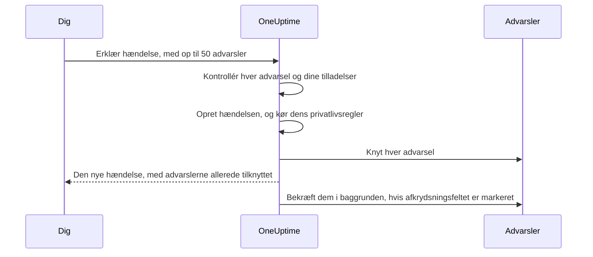

# Tilknyttede advarsler

Et udfald udløser sjældent kun én advarsel. Når den primære database går ned, slår monitoren for replikeringsforsinkelse ud, monitoren for API'ets fejlrate slår ud, og SLO'en for checkoutens latens begynder at brænde — tre advarsler, ét problem. At knytte de advarsler til hændelsen siger netop det: hændelsen er dér, hvor indsatsen foregår, og hver advarsel viser, hvilken hændelse der forklarer den.

En tilknytning er kun en tilknytning. Advarslen beholder sin egen tilstand, sine ejere, vagtpolitikker, noter og sit feed; hændelsen beholder sine. Tilknytning fletter og kopierer intet, og bekræfter, løser eller dæmper aldrig i sig selv en advarsel. (At erklære en ny hændelse fra advarsler er anderledes: den nye hændelse udfyldes på forhånd fra dem, som [beskrevet nedenfor](#erklær-en-hændelse-fra-advarsler), og medmindre du fjerner fluebenet på formularen, bekræftes advarslerne, mens du erklærer den, hvilket stopper deres eskalering — se [Bekræft advarslerne, mens du erklærer](#bekræft-advarslerne-mens-du-erklærer).) To projektkontakter, der er slået til i nye projekter, tager de tilknyttede advarsler med, efterhånden som hændelsen bekræftes og løses — se [længere nede](#hold-advarslernes-tilstande-i-takt-med-hændelsen).

:::cards
- [Knyt advarsler til en hændelse](#knyt-advarsler-fra-en-hændelse): Fra hændelsen, fra en advarsel eller mange på én gang.
- [Erklær en hændelse fra advarsler](#erklær-en-hændelse-fra-advarsler): En ny hændelse, udfyldt på forhånd og tilknyttet i ét hug.
- [Hold advarslernes tilstande i takt](#hold-advarslernes-tilstande-i-takt-med-hændelsen): Bekræft og løs advarslerne sammen med hændelsen.
- [Tilladelser](#tilladelser): Hvem der kan knytte, og hvad tilknytning lader dem gøre.
:::

> [!TIP]
> Kommer du fra Opsgenie, er dette OneUptimes udgave af at knytte advarsler til en hændelse.

## Kort fortalt

- **Mange-til-mange** — en hændelse kan have et vilkårligt antal tilknyttede advarsler, og én advarsel kan være knyttet til flere hændelser.
- **Tre steder at knytte** — hændelsens side **Tilknyttede advarsler**, advarslens side **Tilknyttede hændelser** og massehandlingen **Tilknyt til hændelse** på hovedlisterne over advarsler, for op til **50** advarsler ad gangen.
- **Erklær en hændelse fra advarsler** — **Erklær hændelse** på en advarselsliste, i en advarsels hoved eller på dens side **Tilknyttede hændelser** udfylder en ny hændelse på forhånd fra advarslerne og knytter dem, mens den oprettes. Et afkrydsningsfelt på formularen, markeret som standard, bekræfter dem også, hvilket stopper deres egen eskalering fra vagten.
- **Registreret på begge sider** — hver tilknytning og frakobling skriver en feedpost på hændelsen og på advarslen, bortset fra at en hændelse, der erklæres fra advarsler, får én post, der nævner dem alle. Kun hændelsens poster slås op i Slack og Microsoft Teams, og titlen på en privat advarsel eller hændelse skrives aldrig på den anden side.
- **Advarslernes tilstande følger hændelsen** — to projektkontakter, begge slået til i nye projekter, bekræfter og løser tilknyttede advarsler, når hændelsen bekræftes og løses. Slå en af dem fra under **Hændelser → Indstillinger → Tilknyttede advarsler**.
- **Kan automatiseres** — tilknytninger er en almindelig API-ressource, `/api/incident-alert`.

## Sådan fungerer det

Advarsler er signaler: en monitors kriterier matchede, en SLO begyndte at brænde sit budget, en sikkerhedsregel slog ud. En hændelse er den koordinerede indsats mod et problem (se [Hændelser – Oversigt](/docs/incidents/index)). De fleste problemer giver flere signaler, og uden tilknytninger er det eneste, der binder dem til indsatsen, en persons hukommelse.

```mermaid title="Tre advarsler, én hændelse og de kontakter, der flytter dem"
flowchart TB
    subgraph signals["Advarsler"]
        direction LR
        lag["Replikeringsforsinkelse"]
        errors["API'ets fejlrate"]
        latency["Checkoutens latens"]
    end
    signals -->|"knyttet til"| incident["Hændelse"]
    incident -->|"bekræftet"| ack["Tilknyttede advarsler bekræftet"]
    incident -->|"løst"| res["Tilknyttede advarsler løst"]
```

Med advarslerne tilknyttet:

- Ser de, der reagerer på hændelsen, i én liste, hvilke advarsler der hører til den, og hvilken tilstand hver er i.
- Ser en, der åbner en af de advarsler, at den allerede bliver håndteret, under hvilken hændelse, i stedet for at erklære en anden hændelse for det samme udfald.
- Registrerer hændelsens feed, hvornår hver advarsel blev knyttet og af hvem, så tidslinjen viser, hvordan billedet tog form.
- Stopper bekræftelsen af hændelsen, med kontakterne slået til, vagtens eskaleringer for advarslerne, så de, der arbejder på hændelsen, ikke tilkaldes igen af dens symptomer.

## Sådan virker tilknytninger

En tilknytning forbinder én advarsel med én hændelse. Tilknytninger går begge veje — den samme tilknytning vises på hændelsens side **Tilknyttede advarsler** og på advarslens side **Tilknyttede hændelser**.

- **En advarsel kan være knyttet til flere hændelser.** En delt afhængighed, der fejler, kan være et symptom på to separate hændelser. Hver hændelse viser advarslen, og advarslen viser begge hændelser.
- **Hvert par knyttes én gang.** At knytte en advarsel til en hændelse, den allerede er knyttet til, afvises med "This alert is already linked to this incident." — også når to personer knytter det samme par i samme øjeblik.
- **Tilknytninger oprettes eller fjernes, de redigeres aldrig.** En tilknytning har ingen egne felter ud over sin hændelse, sin advarsel, hvornår den blev lavet, og af hvem. For at flytte en advarsel til en anden hændelse knytter du den til den nye og frakobler den fra den gamle.
- **Tilknytninger bliver inden for et projekt.** Advarslen og hændelsen skal høre til samme projekt.

## Knyt advarsler fra en hændelse

:::steps
### Åbn hændelsens side Tilknyttede advarsler

Åbn hændelsen, og vælg **Tilknyttede advarsler** i afsnittet **Undersøgelse** i dens sidemenu. Tabellen viser hver advarsel, der allerede er knyttet til den.

### Vælg advarslen

Klik på **Tilknyt advarsel**, og vælg den i rullemenuen **Advarsel**. Rullemenuen viser de seneste advarsler først, hver med sit nummer — som `ALT-63: Checkout API is offline` — så advarsler med samme titel, som en monitors gentagne advarsler, kan skelnes fra hinanden. For at finde en ældre advarsel skriver du: rullemenuen søger i alle advarsler på titel.

### Gem tilknytningen

Klik på **Tilknyt advarsel** i dialogen. Advarslen vises i tabellen, og begge feeds registrerer tilknytningen. Afvises tilknytningen, for eksempel fordi advarslen allerede er tilknyttet, bliver dialogen åben og siger hvorfor.
:::

| Kolonne           | Hvad den viser                                   |
| ----------------- | ------------------------------------------------ |
| **Advarsel #**    | Advarslens nummer, som `#17` eller `ALT-17`.     |
| **Titel**         | Advarslens titel med et link til advarslen.      |
| **Aktuel tilstand** | Advarslens egen tilstand, som **Bekræftet**.   |
| **Tilknyttet den** | Hvornår advarslen blev knyttet.                 |
| **Tilknyttet af** | Hvem der knyttede den.                           |

Hver række har **Vis advarsel** til at åbne advarslen og **Fjern kæde** til at fjerne tilknytningen.

## Knyt hændelser fra en advarsel

Advarslens side spejler hændelsens. Åbn en advarsel, og vælg **Tilknyttede hændelser** i afsnittet **Grundlæggende** i dens sidemenu. Tabellen viser hver hændelse, advarslen er knyttet til, med hændelsesnummer, titel og aktuel tilstand, og hvornår og af hvem den blev knyttet.

- **Tilknyt hændelse** knytter denne advarsel til en eksisterende hændelse. Rullemenuen virker som den på hændelsens side: de seneste hændelser først, hver med sit nummer — som `INC-42: Checkout is down` — og når du skriver, søges der i alle hændelser på titel.
- **Vis hændelse** åbner en tilknyttet hændelse.
- **Fjern kæde** fjerner en tilknytning.
- **Erklær hændelse** starter en ny hændelse fra denne advarsel. Den samme knap står i advarslens hoved, ved siden af **Bekræft** og **Løs**. Se [Erklær en hændelse fra advarsler](#erklær-en-hændelse-fra-advarsler).

## Knyt mange advarsler på én gang

Hovedlisterne over advarsler har to massehandlinger til det: **Alle advarsler** og **Aktive advarsler**, de aktive advarsler på startsiden og siden **Advarsler** for en monitor, en tjeneste, en vært, en Kubernetes-klynge, en SLO eller enhver anden ressource, der har en. Listen **Medlemsadvarsler** for en advarselsepisode har dem ikke — vælg i stedet advarslerne på en af hovedlisterne. Vælg advarslerne, og vælg derefter:

- **Tilknyt til hændelse** — vælg hændelsen i rullemenuen **Hændelse**, og klik på **Tilknyt advarsler**. De seneste hændelser står først med deres numre, og når du skriver, søges der i alle hændelser på titel. OneUptime knytter hver valgt advarsel og viser fremskridtet undervejs. En advarsel, der allerede er knyttet til den hændelse, tæller som klaret og ikke som fejlet, så det er ufarligt at køre handlingen to gange.
- **Erklær hændelse** — åbner erklæringsformularen for en ny hændelse, der er udfyldt på forhånd fra de valgte advarsler. Se næste afsnit.

Begge handlinger tager op til **50** advarsler ad gangen. Vælger du flere, deaktiveres de, med et værktøjstip, der siger hvorfor. Grænsen findes, fordi hver tilknytning skriver til begge feeds, og hver tilknytning, der laves med **Tilknyt til hændelse**, også slås op i hændelsens Slack- og Microsoft Teams-kanaler — et udvalg på tusind advarsler ville oversvømme dem.

## Erklær en hændelse fra advarsler

Viser en byge af advarsler sig at være en hændelse, som ingen har erklæret endnu, så erklær den fra advarslerne. Der er tre veje ind:

- Vælg advarslerne på en af hovedlisterne over advarsler, og vælg **Erklær hændelse**.
- Åbn en advarsel, og klik på **Erklær hændelse** i dens hoved, ved siden af **Bekræft** og **Løs**. Den bliver stående, når advarslen er bekræftet eller løst, så du stadig kan erklære en hændelse for en advarsel bagefter — for at lave en postmortem på den for eksempel.
- Åbn én advarsels side **Tilknyttede hændelser**, og klik på **Erklær hændelse**.

Alle tre kræver tilladelse til at oprette hændelser og til at knytte advarsler til dem. Uden den er knappen låst, og dens værktøjstip nævner den manglende tilladelse.

Uanset hvilken du bruger, lander du på den sædvanlige formular **Erklær ny hændelse**, med advarslerne nævnt som dem, der vil blive knyttet, og disse felter udfyldt på forhånd:

| Felt                   | Udfyldt med                                                                                                                                                                                                                                                                            |
| ---------------------- | -------------------------------------------------------------------------------------------------------------------------------------------------------------------------------------------------------------------------------------------------------------------------------------- |
| **Titel**              | Én advarsel: dens titel. Flere: titlen på den mest alvorlige advarsel.                                                                                                                                                                                                                 |
| **Beskrivelse**        | Én advarsel: dens beskrivelse. Flere: en liste med én linje pr. advarsel med dens nummer og titel.                                                                                                                                                                                     |
| **Hændelsesalvor**     | Den mest alvorlige advarsels alvorsgrad, oversat til en hændelsesalvorsgrad. En hændelsesalvorsgrad med samme navn, uden hensyn til store og små bogstaver, vinder. Ellers tager OneUptime den hændelsesalvorsgrad, der står på samme plads i rækkefølgen af alvorsgrader, eller den sidste, hvis du har færre hændelsesalvorsgrader. |
| **Berørte ressourcer** | Hver monitor, vært, Kubernetes-klynge, Docker-vært, Podman-vært og tjeneste fra de valgte advarsler, samlet. Monitorerne kommer under **Monitorer**, resten under **Andre berørte ressourcer**. Andre ressourcer, som SLO'er eller VMware-, Proxmox- og Ceph-klynger, kopieres ikke — tilføj dem selv, hvis hændelsen berører dem. |
| **Etiketter**          | Hver etiket fra hver valgt advarsel.                                                                                                                                                                                                                                                   |
| **Privat hændelse**    | Slået til, hvis nogen af advarslerne er private. Formularen siger det, og advarslernes ejere bliver ejere af hændelsen — se nedenfor.                                                                                                                                                   |

"Mest alvorlig" følger rækkefølgen af dine advarselsalvorsgrader: den første advarselsalvorsgrad i listen er den mest alvorlige. Med de alvorsgrader, hvert projekt starter med, bliver en advarsel **High** til en **Critical Incident** og en advarsel **Low** til en **Major Incident**.

Alt kan redigeres, før du sender. **Etiketter** og **Privat hændelse** ligger under **Flere felter** på formularens første trin, hvis sammenfoldede overskrift viser hver af dem, mens den er sat.

**En advarsel, der allerede har en hændelse, markeres.** Med **Erklær hændelse** på hver advarsels side kan to vagthavende, der tilkaldes af det samme udfald, hver erklære det. Derfor markerer banneret, der viser advarslerne, hver advarsel, der allerede er knyttet til en hændelse — "(already linked to Incident INC-42)", med et link til den hændelse — og tilføjer en bemærkning, formuleret efter hvor mange af advarslerne der er tilknyttet:

- Alle advarslerne, og der er én: "This alert is already linked to an incident. If it is the same problem, update that incident instead of declaring another one."
- Alle advarslerne, og der er flere: "These alerts are already linked to incidents. If it is the same problem, update that incident instead of declaring another one."
- Kun nogle af dem: "Some of these alerts are already linked to an incident. If it is the same problem, link the other alerts to that incident from the alerts list instead of declaring another one."

Hændelseslinkene åbner i en ny fane, så du kan tjekke den eksisterende hændelse uden at miste det, du har udfyldt på formularen. Bemærkningen er en påmindelse, ikke en blokering, og kun hændelser, du må se, nævnes.

**Vagtpolitikker kopieres ikke.** Advarslerne kørte deres egne vagtpolitikker, da de blev oprettet, så at kopiere dem over på hændelsen ville tilkalde de samme personer en gang til. Hændelsens vagtpolitikker er det, du vælger på trinnet **Vagt og roller**, plus det, dine vagtregler for hændelser tilføjer — præcis som for enhver anden hændelse.

**Advarslernes monitorer udfyldes på forhånd som berørte monitorer.** Som ved enhver hændelse, der erklæres i hånden, sættes den aktive overvågning af hændelsens monitorer på pause, indtil hændelsen er løst. Fjern en monitor fra **Monitorer** på trinnet **Berørte ressourcer**, før du sender, hvis den skal blive ved med at blive kontrolleret.

**En privat advarsel giver en privat hændelse.** Er nogen af advarslerne private, starter **Privat hændelse** slået til, og banneret, der viser advarslerne, siger det. En privat hændelse er kun synlig for sine ejere, Project Owners og Project Admins, så OneUptime sørger for, at de personer, der kunne se advarslerne, kan se hændelsen: når den er erklæret, tilføjes ejerne af hver advarsel, der blev erklæret fra — brugere og teams — som ejere af hændelsen, uden at få besked. De tilføjes lige efter, at hændelsens Slack- og Microsoft Teams-kanaler er oprettet, så de inviteres til de kanaler som enhver anden ejer. Du er også ejer, som ved enhver hændelse, du erklærer. Det samme sker, når en privatlivsregel for hændelser gør den nye hændelse privat. Slår du **Privat hændelse** fra, før du sender, og gælder der ingen privatlivsregel, er hændelsen ikke privat, og ingen ejere kopieres.



Når du sender, kontrollerer serveren advarslerne, før den opretter noget: højst 50 af dem, hver en advarsel i dette projekt, som du må se, og du skal have lov til at knytte advarsler til hændelser. Fejler en kontrol, afvises anmodningen, og ingen hændelse oprettes — så et forkert advarsels-id bruger aldrig et hændelsesnummer. Når hændelsen findes — og når dens privatlivsregler har kørt, så tilknytningerne ved, om den er privat — knyttes hver advarsel, før anmodningen vender tilbage, så hændelsens side **Tilknyttede advarsler** allerede viser dem. Fejler en enkelt tilknytning — fordi advarslen blev slettet et øjeblik forinden for eksempel — erklæres hændelsen alligevel, og de andre advarsler knyttes alligevel.

Hændelsens feed får én post **Advarsel tilknyttet**, der nævner advarslerne, skrevet efter **Hændelse oprettet**, i stedet for én pr. advarsel — se [Feedet, Slack og Microsoft Teams](#feedet-slack-og-microsoft-teams).

### Bekræft advarslerne, mens du erklærer

At erklære en hændelse stopper ikke i sig selv dens advarsler i at tilkalde: en advarsels eskalering fra vagten stopper først, når selve advarslen er bekræftet. Når nogen af advarslerne ikke er bekræftet endnu, har banneret på formularen derfor et afkrydsningsfelt, markeret som standard — **Acknowledge this alert to stop its escalation** for én advarsel, **Acknowledge these 3 alerts to stop their escalation** for flere. Er nogle af dem allerede bekræftet, nævner det kun de andre og siger, at resten bliver, som de er.

Lad det være markeret, og når hændelsen er erklæret, og advarslerne er knyttet:

- **Bekræftes advarslerne som dig.** Hver advarsel går til din advarselstilstand **Bekræftet**, som om du selv havde klikket på **Bekræft** på den: advarslens **Tilstandstidslinje** og feed nævner dig, advarslens ejere får besked, og ændringen slås op i advarslens Slack- og Microsoft Teams-kanaler som enhver anden tilstandsændring for en advarsel. Årsagen lyder "Acknowledged because Incident INC-42 was declared from this alert." — eller, for en privat hændelse, "Acknowledged because a private incident was declared from this alert.", så en privat hændelse aldrig nævnes, hvor advarslens publikum kan læse det.
- **Stopper deres egen eskalering fra vagten inden for omkring et minut.** Det næste eskaleringstrin ser en bekræftet advarsel og stopper. Tilkaldelser, der allerede er gået ud, kaldes ikke tilbage.
- **Stopper påmindelser kun, hvis påmindelsesreglen siger det.** En advarsels påmindelser stopper ved bekræftelse kun, når dens påmindelsesregel har **Stop Reminders When** sat til **Bekræftet**; ellers fortsætter de, indtil advarslen er løst.
- **Bliver en advarselsepisode ved med at eskalere.** Hører en advarsel til en episode, der tilkalder via sin egen vagtpolitik, bliver episoden ved med at eskalere, indtil selve episoden er bekræftet.
- **Lades advarsler, der allerede er bekræftet eller løst, i fred.** Som alle andre steder sammenlignes tilstande efter deres rækkefølge, så en advarsel i en egen tilstand efter **Bekræftet** tæller som bekræftet, og intet flyttes nogensinde baglæns.

Fjern fluebenet for at erklære uden at bekræfte. Når advarsler vil forblive ubekræftede — afkrydsningsfeltet er umarkeret eller låst — siger formularen det: "Declaring the incident does not acknowledge the alert: it keeps escalating until it is acknowledged." Og bekræfter du advarslerne uden at vælge en vagtpolitik til hændelsen, påpeger opsummeringen for trinnet **Vagt og roller**: "The alerts it is declared from are acknowledged too, so their own escalation stops. An alert episode they belong to keeps escalating until the episode is acknowledged, and an incident on-call rule, if any, may still page."

**Du skal have tilladelse til at bekræfte advarslerne.** At bekræfte dem, mens du erklærer, kræver **Create Alert State Timeline** og **Edit Alert** (at bekræfte en advarsel på dens egen side kræver kun den første: se [Ændring af en tilstand](/docs/permissions/index#ændring-af-en-tilstand)): Project Owner, Project Admin, Project Member, Alert Admin og Alert Member har begge, mens Incident Admin og Incident Member, der kan erklære hændelser fra advarsler, har ingen af dem. Dit etiket- og ejeromfang på advarsler skal også omfatte hver advarsel, der skal bekræftes — kun dem, der ikke er bekræftet endnu, kontrolleres. Advarsler, der allerede er bekræftet eller løst, kræver ingen tilladelse og blokerer aldrig erklæringen. Uden tilladelserne er afkrydsningsfeltet låst, med et værktøjstip, der nævner den manglende, og du kan stadig erklære hændelsen. Serveren kontrollerer igen, før den opretter noget, for hver advarsel, den skal bekræfte: må du ikke bekræfte en af dem, oprettes der ingen hændelse, og formularen siger hvorfor — fjern fluebenet, og send igen.

**Projektet skal have en advarselstilstand Bekræftet.** Hvert projekt starter med en. Har dit ingen, tilbydes afkrydsningsfeltet ikke.

Advarslerne bekræftes i baggrunden, lige efter at de er knyttet, nogle få ad gangen — op til 5 på én gang — så hændelsens side kan åbne et øjeblik, før de er det, og så det at erklære fra mange advarsler ikke lader de sidste vente bag alle de andre. En advarsel, der ikke kan bekræftes — fordi den blev slettet i mellemtiden for eksempel — logges og stopper aldrig de andre eller hændelsen, og en advarsel, som en anden bekræfter eller løser i mellemtiden, efterlades, som vedkommende efterlod den.

**Med projektets kontakter for tilknyttede advarsler slået til kan kontakterne flytte advarslerne i stedet.** Erklæres hændelsen direkte i en bekræftet eller løst tilstand, og virker en af [kontakterne for tilknyttede advarsler](#hold-advarslernes-tilstande-i-takt-med-hændelsen) på den tilstand, flytter kontakten de tilknyttede advarsler, mens de knyttes, og afkrydsningsfeltet overlader de advarsler til den, så hver advarsel har én skribent. De bekræftes eller løses, som kontakten gør det — med kontaktens årsag, som "Acknowledged because linked Incident INC-42 was acknowledged.", der nævner hændelsen ved dens nummer, også når den er privat — de krediteres ikke dig, og deres ejere får ikke besked. At erklære i din første hændelsestilstand, som sædvanlig, eller med kontakterne slået fra overlader hver advarsel til afkrydsningsfeltet.

### Erklær via API'et

`POST /api/incident` tager imod id'erne på de advarsler, der skal knyttes, i `miscDataProps` under `alertIdsToLink`, og om de advarsler skal bekræftes, under `acknowledgeAlertsToLink`:

```bash
curl -X POST https://oneuptime.com/api/incident \
  -H "apikey: $ONEUPTIME_API_KEY" \
  -H "Content-Type: application/json" \
  -d '{
    "data": {
      "title": "Primary database unavailable",
      "incidentSeverityId": "<incident-severity-id>"
    },
    "miscDataProps": {
      "alertIdsToLink": ["<alert-id>", "<another-alert-id>"],
      "acknowledgeAlertsToLink": true
    }
  }'
```

`alertIdsToLink` er et array med 1 til 50 advarsels-id'er. Dubletter ignoreres, og de samme kontroller gælder som i dashboardet, før hændelsen oprettes. Intet udfyldes på forhånd via API'et — send den titel, den alvorsgrad og de ressourcer, du vil have. API-nøglen skal have tilladelse til at oprette hændelser og knytte advarsler til dem, og den skal kunne læse advarslerne. En API-nøgle er ikke en bruger, så tilknytninger, der laves med en, har intet **Tilknyttet af**. For resten af anmodningens body, se [Opret en hændelse](/docs/incidents/declaring-incidents).

`acknowledgeAlertsToLink` er valgfri og slået fra, medmindre du sender den. Sæt den til `true` for at bekræfte advarslerne, når de er knyttet, som formularens afkrydsningsfelt gør — advarsler, der allerede er bekræftet eller løst, lades i fred og kræver ingen tilladelse. Udelad den, eller send `false`, for at erklære uden at bekræfte dem. Den kontrolleres sammen med advarsels-id'erne, før hændelsen oprettes, og anmodningen afvises med en 400, når:

- den er noget andet end `true` eller `false`;
- den sendes uden `alertIdsToLink`;
- projektet ikke har nogen advarselstilstand Bekræftet;
- API-nøglen ikke må bekræfte hver advarsel, der ikke er bekræftet endnu — det kræver **Create Alert State Timeline** og **Edit Alert** med et etiketomfang, der omfatter hver af de advarsler.

En API-nøgle er ikke en bruger, så advarsler, der bekræftes med en, krediteres ingen, ligesom dens tilknytninger ikke har noget **Tilknyttet af**.

## Knyt og frakobl via API'et

Tilknytninger er en standard-CRUD-ressource på `/api/incident-alert`. For at knytte en advarsel til en hændelse opretter du en:

```bash
curl -X POST https://oneuptime.com/api/incident-alert \
  -H "apikey: $ONEUPTIME_API_KEY" \
  -H "Content-Type: application/json" \
  -d '{
    "data": {
      "incidentId": "<incident-id>",
      "alertId": "<alert-id>"
    }
  }'
```

For at liste en hændelses tilknyttede advarsler forespørger du på `incidentId`. Forespørg i stedet på `alertId` for at finde de hændelser, en advarsel er knyttet til:

```bash
curl -X POST https://oneuptime.com/api/incident-alert/get-list \
  -H "apikey: $ONEUPTIME_API_KEY" \
  -H "Content-Type: application/json" \
  -d '{
    "query": { "incidentId": "<incident-id>" },
    "select": { "_id": true, "alertId": true, "createdAt": true },
    "limit": 50,
    "skip": 0
  }'
```

For at frakoble sletter du tilknytningen ved dens eget id — tilknytningens `_id`, ikke advarslens eller hændelsens:

```bash
curl -X DELETE https://oneuptime.com/api/incident-alert/<link-id> \
  -H "apikey: $ONEUPTIME_API_KEY"
```

Begge id'er er påkrævet. En anmodning om tilknytning afvises også, når advarslen eller hændelsen hører til et andet projekt eller er en, du ikke kan se. Fejlen lyder ens, uanset om advarslen eller hændelsen ikke findes eller bare er skjult for dig, så den aldrig afslører, at en privat findes.

Den samme ressource driver de genererede workflow-komponenter — **On Create Incident Alert** udløses, når en advarsel knyttes, og **On Delete Incident Alert**, når den frakobles — og MCP-serverens Incident Alert-værktøjer. [API-referencen](/reference) har den fulde form på anmodning og svar.

## Frakobl

Frakobl fra begge sider: **Fjern kæde** på en række på hændelsens side **Tilknyttede advarsler** eller advarslens side **Tilknyttede hændelser**, og bekræft. For at frakoble flere på én gang vælger du rækkerne og vælger massehandlingen **Fjern kæde**. Den fjerner kun tilknytningerne — selve advarslerne og hændelserne slettes ikke.

Frakobling fjerner tilknytningen og intet andet. Advarslen og hændelsen beholder deres tilstande, og en advarsel, der blev bekræftet eller løst på grund af hændelsen, forbliver sådan — advarslers tilstande går aldrig baglæns. Begge feeds registrerer frakoblingen.

## Tilladelser

Tilknytning har fire granulære tilladelser for sig selv i gruppen **Incident** i [Tilladelsesreference](/docs/permissions/reference):

| Tilladelse                | Hvad den tillader                                                                                                      | Roller, der har den                                                                                      |
| ------------------------- | ---------------------------------------------------------------------------------------------------------------------- | -------------------------------------------------------------------------------------------------------- |
| **Create Incident Alert** | At knytte en advarsel til en hændelse, også når en hændelse erklæres fra advarsler. Du skal også kunne læse begge.     | Project Owner, Project Admin, Project Member, Incident Admin, Incident Member, Alert Admin, Alert Member |
| **Delete Incident Alert** | At frakoble.                                                                                                           | Project Owner, Project Admin, Project Member, Incident Admin, Incident Member, Alert Admin, Alert Member |
| **Read Incident Alert**   | At se listerne **Tilknyttede advarsler** og **Tilknyttede hændelser**.                                                 | Alle ovenstående plus Viewer, Incident Viewer og Alert Viewer                                            |
| **Edit Incident Alert**   | I praksis intet — en tilknytning har ingen felter, du kan ændre.                                                       | Project Owner, Project Admin, Project Member, Incident Admin, Incident Member, Alert Admin, Alert Member |

Advarselsroller er med, så de, der arbejder med advarsler, kan knytte dem, og hændelsesroller, så de, der arbejder med hændelser, kan. Ingen af dem er nok i sig selv, fordi en tilknytning kun oprettes, når du kan læse begge sider:

- **En advarselsrolle har også brug for læseadgang til hændelser** — tilføj Viewer, Incident Viewer eller Read Incident.
- **En hændelsesrolle har også brug for læseadgang til advarsler** — tilføj Viewer, Alert Viewer eller Read Alert.

Tre regler mere gælder oveni:

- **Du skal kunne se begge sider.** En tilknytning oprettes kun, når du kan læse både advarslen og hændelsen. Private advarsler og hændelser og etiketbegrænsninger gælder som sædvanlig.
- **En tilknytning hører til sin hændelse.** Om du kan se en tilknytning, følger din adgang til dens hændelse: etiketbegrænsninger og ejeromfang på hændelser gælder også tilknytningen.
- **Tilknytning kræver læseadgang til en advarsel, ikke redigeringsadgang.** Med projektets kontakter for tilknyttede advarsler slået til, som de er i nye projekter, er det nok til, at en tilknytning kan bekræfte eller løse advarslen — se [Hvem flytter en tilknyttet advarsel](#hvem-flytter-en-tilknyttet-advarsel).

At erklære en hændelse fra advarsler kræver også tilladelse til at oprette hændelser, og at bekræfte dens advarsler, mens du erklærer, kræver **Create Alert State Timeline** og **Edit Alert** på hver af dem, der ikke er bekræftet endnu — se [Bekræft advarslerne, mens du erklærer](#bekræft-advarslerne-mens-du-erklærer). I dashboardet er en handling, du mangler en tilladelse til, låst, og dens værktøjstip nævner den manglende tilladelse. Det gælder også læseadgang til den anden side: **Tilknyt advarsel** er låst, hvis du ikke kan læse advarsler, og **Tilknyt hændelse** og **Tilknyt til hændelse**, hvis du ikke kan læse hændelser. For hvordan roller, granulære tilladelser, etiketter og ejeromfang spiller sammen, se [Brugere, teams og tilladelser](/docs/permissions/index).

## Feedet, Slack og Microsoft Teams

Hver tilknytning og frakobling skrives til begge feeds og krediteres den, der lavede ændringen:

| Ændring     | Hændelsens feed                              | Advarslens feed                                     |
| ----------- | -------------------------------------------- | --------------------------------------------------- |
| Tilknytning | **Advarsel tilknyttet** (`AlertLinked`)      | **Tilknyttet hændelse** (`LinkedToIncident`)        |
| Frakobling  | **Advarsel frakoblet** (`AlertUnlinked`)     | **Frakoblet hændelse** (`UnlinkedFromIncident`)     |

Hver post nævner den anden side ved dens nummer og linker til den, så du kan hoppe fra hændelsens feed til advarslen og tilbage. Den giver også den anden sides titel, medmindre den side er privat:

- **En privat advarsels titel holdes ude af hændelsens post** og dermed ude af Slack og Microsoft Teams. Posten lyder for eksempel "Linked Alert #12 (private alert) to Incident #5".
- **En privat hændelses titel holdes ude af advarslens post**, der lyder "Linked to Incident #5 (private incident)".

Det gælder også, når begge er private, fordi en privat advarsel og en privat hændelse kan have forskellige ejere. At åbne den tilknyttede advarsel eller hændelse er som sædvanlig underlagt dens eget privatliv.

**Kun hændelsens poster når Slack og Microsoft Teams.** **Advarsel tilknyttet** og **Advarsel frakoblet** slås op, hvor hændelsens andre feedopdateringer går hen. Posterne på advarslens side bliver i dashboardet, så en tilknytning giver én besked i stedet for to. Se [Slack](/docs/workspace-connections/slack) og [Microsoft Teams](/docs/workspace-connections/microsoft-teams) for at sætte de kanaler op.

**At erklære en hændelse fra advarsler skriver én post, ikke én pr. advarsel.** De tilknytninger, der laves, mens hændelsen erklæres, skriver ingen egne poster **Advarsel tilknyttet**. I stedet får hændelsen, når dens post **Hændelse oprettet** er ude — og hændelsens egne Slack- og Microsoft Teams-kanaler, hvis du bruger dem, er oprettet — én post **Advarsel tilknyttet**: "Declared from 3 alerts:", efterfulgt af én linje pr. advarsel med dens nummer og titel (en privat advarsel uden sin titel). Det er den ene besked, der slås op i Slack og Microsoft Teams. Hver advarsel får stadig sin egen post **Tilknyttet hændelse**.

Begge feeds' dialoger **Filtrér efter begivenhedstype**, i hvert feeds menu **⋯**, viser disse begivenhedstyper, så du kan vise eller skjule tilknytningsaktivitet som enhver anden slags post. Mere om hændelsens feed i [Hændelsesnoter, ejere og feed](/docs/incidents/notes-owners-and-feed).

## Hold advarslernes tilstande i takt med hændelsen

To projektkontakter lader hændelsen tage sine tilknyttede advarsler med. Begge er slået til i nye projekter. Et projekt, der blev oprettet, før de var slået til som standard, beholder den indstilling, det havde, og den er slået fra, medmindre nogen slog dem til. De har deres egen indstillingsside, **Hændelser → Indstillinger → Tilknyttede advarsler**, hvor hver er en kontakt på kortet **Tilknyttede advarsler**, der gemmes, så snart du slår den om. Kun Project Owners og Project Admins kan ændre dem; for alle andre er kontakterne låst og siger, hvilken tilladelse de kræver:

- **Bekræft tilknyttede advarsler, når hændelsen bekræftes** — når hændelsen når din bekræftede tilstand, går hver tilknyttet advarsel, der ikke er bekræftet endnu, til din advarselstilstand **Bekræftet**. Det er det, der stopper vagtens eskaleringer for de advarsler: det næste eskaleringstrin ser en bekræftet advarsel og stopper inden for omkring et minut. Tilkaldelser, der allerede er gået ud, kaldes ikke tilbage. Påmindelser om advarsler stopper også, når advarslens påmindelsesregel har **Stop Reminders When** sat til **Bekræftet**; ellers fortsætter de, indtil advarslen er løst.
- **Løs tilknyttede advarsler, når hændelsen løses** — når hændelsen når din løste tilstand, går hver tilknyttet advarsel, der ikke er løst endnu, til din advarselstilstand **Løst**, undtagen en advarsel, der stadig er knyttet til en anden hændelse, som ikke er løst. Den advarsel lades åben for den anden hændelse — bekræftet, hvis bekræftelseskontakten også er slået til — og løses, når den sidste af dens hændelser løses.

Med begge kontakter slået fra ændrer tilknytning intet ved en advarsels tilstand. En tilknyttet advarsel bliver, hvor den er, indtil nogen flytter den, dens vagtpolitik bliver ved med at eskalere, og dens påmindelser bliver ved med at komme. Den eneste undtagelse er at erklære en hændelse fra advarsler med formularens afkrydsningsfelt markeret, hvilket bekræfter dem, mens du erklærer — se [Bekræft advarslerne, mens du erklærer](#bekræft-advarslerne-mens-du-erklærer).

### Hvordan kontakterne opfører sig

- **Rækkefølge, ikke navne.** "Når" betyder, at hændelsens aktuelle tilstand står ved eller efter den bekræftede eller løste tilstand i din rækkefølge af tilstande. En egen tilstand mellem Bekræftet og Løst, som en tilstand **Overvågning**, tæller som bekræftet. Advarsler sammenlignes på samme måde, så en advarsel i en egen tilstand efter **Bekræftet** allerede tæller som bekræftet.
- **Aldrig baglæns.** Kun advarsler, der ligger bag måltilstanden, flyttes. En advarsel, der allerede er bekræftet, lades i fred af bekræftelseskontakten, og en løst advarsel røres aldrig.
- **At løse med kun bekræftelseskontakten slået til** bekræfter de tilknyttede advarsler, fordi løst ligger efter bekræftet.
- **At knytte til en hændelse, der allerede er bekræftet eller løst,** anvender kontakterne på den nye advarsel med det samme, som om hændelsen lige havde skiftet tilstand.
- **At genåbne en hændelse genåbner ikke dens advarsler.** Advarsler kan ikke gå til en tidligere tilstand.
- **Kun den aktuelle tilstand tæller.** At tilføje en tidligere post til hændelsens **Tilstandstidslinje** — en med et **Slutter den** — flytter ingen advarsel.
- **Tilknytning alene ændrer aldrig en advarsels tilstand.** Med begge kontakter slået fra flytter hændelsen aldrig sine advarsler.

Advarslerne skifter tilstand i baggrunden, lige efter hændelsen gør. Hver ændring går gennem advarslens egen tilstandstidslinje med en årsag som "Acknowledged because linked Incident INC-42 was acknowledged.", så advarslens **Tilstandstidslinje** og feed viser, hvorfor den flyttede sig. Advarslens ejere får ingen notifikation om tilstandsændringen for den, men tilstandsændringen slås op i Slack og Microsoft Teams som enhver anden tilstandsændring for en advarsel. Kan én advarsel ikke flyttes, stopper det ikke de andre.

### Hvem flytter en tilknyttet advarsel

At slå en kontakt til overdrager med vilje de tilknyttede advarslers tilstande til hændelsen: hændelsen er dér, hvor indsatsen ledes, så den, der leder hændelsen, leder også dens advarsler. Fra da af:

- **Den, der kan ændre en hændelses tilstand, flytter dens tilknyttede advarsler.** At bekræfte eller løse hændelsen bekræfter eller løser dem.
- **Den, der kan knytte en advarsel, kan flytte den.** At knytte en advarsel til en hændelse, der allerede er bekræftet eller løst, flytter advarslen, mens den knyttes.

Ingen af dem kræver tilladelse til at redigere advarslerne. OneUptime flytter dem selv, og tilknytning kræver kun læseadgang til en advarsel. Så med bekræftelseskontakten slået til kan alle, der kan knytte advarsler eller ændre hændelsers tilstande, bekræfte — og stoppe vagtens eskalering af — enhver advarsel, de kan se; med løsningskontakten slået til kan de løse den. Derfor kan kun Project Owners og Project Admins ændre kontakterne. De er slået til i et nyt projekt, så slå dem fra, hvis advarslers tilstande kun nogensinde må ændres af personer, der kan redigere advarsler.

### Løs advarsler, der kommer fra monitorer

At bekræfte er altid sikkert for en monitors advarsel: en bekræftet advarsel tæller stadig som åben, så monitoren bliver ved med at bruge den i stedet for at åbne en ny.

> [!WARNING]
> At løse er anderledes. Fejler monitoren stadig, når dens advarsel løses, åbner monitorens næste kontrol en ny advarsel — og den nye advarsel er ikke knyttet til hændelsen. Bliver dine hændelser ofte løst, før deres monitorer kommer sig, så slå løsningskontakten fra, og behold kun bekræftelseskontakten slået til, eller løs først hændelser, når deres monitorer er sunde.

## Slet advarsler og hændelser

- **At slette en advarsel** fjerner den fra hver hændelse, den var knyttet til. Hændelserne er ellers uændrede.
- **At slette en hændelse** fjerner dens tilknytninger. Advarslerne er ellers uændrede og beholder deres tilstande.
- **At slette et projekt** fjerner alle dets tilknytninger sammen med alt andet.

Ingen af dem skriver feedposter **Advarsel frakoblet** eller **Frakoblet hændelse** — det gør kun en udtrykkelig frakobling.

## Næste skridt

:::cards
- [Opret en hændelse](/docs/incidents/declaring-incidents): Erklæringsformularen, skabeloner, monitorkriterier og API'et.
- [Hændelsestilstande og alvorsgrader](/docs/incidents/states-and-severities): Den rækkefølge af tilstande, kontakterne sammenligner med.
- [Hændelsesindstillinger og automatisering](/docs/incidents/settings): Indstillingssiderne for hændelser, blandt dem Tilknyttede advarsler.
- [Brugere, teams og tilladelser](/docs/permissions/index): Roller, granulære tilladelser og omfang.
:::
