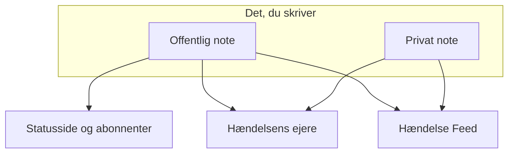

# Hændelsesnoter, ejere og feed

Hver hændelse samler en skriftlig optegnelse, mens du arbejder på den: opdateringer til dine kunder, arbejdsnoter til dit team og et aktivitetsfeed over alt, hvad der skete. Denne side dækker, hvordan du skriver offentlige og private noter, hvem hver af dem når, hændelsens feed og de ejere, der får besked om hver ændring.

:::cards
- [Slå en offentlig note op](#slå-en-offentlig-note-op): Fortæl kunderne, hvad du ved, på statussiden og med en notifikation.
- [Hvornår abonnenterne får besked](#hvornår-en-offentlig-note-faktisk-når-abonnenterne): De kontroller, en offentlig note passerer, og dens mærke.
- [Hændelsens feed](#hændelsens-feed): Tidslinjen over alt, hvad der skete.
- [Ejere](#ejere): Hvem der har ansvaret, og hvad de får at vide.
:::

## Sådan fungerer det

Noget af det, du skriver, er til dine kunder — opdateringen, der går ud på statussiden klokken 02:14 og siger, at du har fundet den dårlige udrulning. Resten er til dit team — stacksporet, nogen indsatte, grafen, der endelig gav mening, beslutningen om at skifte over. OneUptime holder de to målgrupper adskilt og registrerer begge på hændelsen.



**Offentlige noter** offentliggøres på din statusside og kan give abonnenterne besked. **Private noter** (modellen `IncidentInternalNote`) bliver inde i dashboardet. Under begge ligger **Hændelse Feed**, en tidslinje, der kun kan tilføjes til, og som registrerer alt, hvad der skete med hændelsen, og listen **Ejere**, der afgør, hvem der får besked.

Det hele hænger på hændelsens sidemenu: **Noter → Offentlige noter**, **Noter → Private noter** og **Team → Ejere**. Feedet ligger på hændelsens side **Oversigt**.

## Offentlige noter over for private noter

De to slags noter ligner hinanden i dashboardet og opfører sig meget forskelligt.

|                          | Offentlig note                                                      | Privat note                                                     |
| ------------------------ | ------------------------------------------------------------------- | --------------------------------------------------------------- |
| Model                    | `IncidentPublicNote`                                                | `IncidentInternalNote`                                          |
| Vises på statussider     | Ja, som en del af hændelsens tidslinje                              | Aldrig — intet i statussideappen læser dem                      |
| Tidspunkt for opslag     | `postedAt`, som du selv kan sætte                                   | Intet: stemplet og sorteret efter `createdAt`                   |
| Giver abonnenter besked  | Når **Notify status page subscribers** er slået til                 | Aldrig: den har slet ingen felter til abonnenter                |
| Vedhæftninger tilgængelige for | Statussidens besøgende, via en rute på statussiden            | Kun det godkendte dashboard-API                                 |
| Giver ejere besked       | Ja                                                                  | Ja                                                              |

**Hvad "privat" faktisk betyder.** Det betyder "ikke offentliggjort på statussiden" — ikke "begrænset til en mindre gruppe personer". De indbyggede roller, der kan læse en hændelse, læser begge slags noter, så alle, der kan læse hændelsen, kan som regel også læse dens private noter; i en brugerdefineret rolle er det separate tilladelser, **Read Incident Status Page Note** og **Read Incident Internal Note**. Skal du begrænse, hvem der overhovedet kan se en hændelse, så brug flaget **Privat hændelse** (`isPrivate`) på selve hændelsen, som skjuler hændelsen for alle statussider og begrænser den til de brugere, der ejer den, medlemmerne af de teams, der ejer den, og projektadministratorer og projektejere.

**Ejerne ser begge.** Det job, der giver ejerne besked, henter offentlige og private noter sammen. En privat note er privat for dine abonnenter, ikke for de personer, der reagerer.

| Hvis du vil…                                           | Vælg             |
| ------------------------------------------------------ | ---------------- |
| Fortælle kunderne, hvad du ved, og hvornår du ved mere | **Offentlig note** |
| Tilbagedatere en opdatering, du allerede har sendt et andet sted | **Offentlig note** |
| Registrere en hypotese, en kommando, du kørte, eller en blindgyde | **Privat note** |
| Vedhæfte et heap dump eller et skærmbillede af et internt dashboard | **Privat note** |

## Slå en offentlig note op

:::steps
### Åbn de offentlige noter

Åbn hændelsen, og vælg **Noter → Offentlige noter** i dens sidemenu. Editoren over noterne siger, hvem der læser noten, før du slår den op: **Public · Visible on your status page**.

### Skriv opdateringen

Skriv noten i Markdown, eller start fra en af dine **Skabeloner** eller fra **Draft with AI**. Tilføj filer med **Attach**, hvis abonnenterne skal se dem.

### Bestem, hvem der får besked

Lad **Notify status page subscribers** være markeret for at give abonnenterne besked, eller fjern markeringen for at offentliggøre i stilhed. **Will notify** under det viser, hvilke statussider noten når, og **Forhåndsvisning** viser den e-mail, de får.

### Slå den op

Klik på **Post update**, eller tryk på Ctrl+Enter (⌘+Enter på en Mac). Noten vises øverst i listen med et mærke, der følger dens notifikation.
:::

Den samme editor åbner i en dialog fra **Add Public Note** i menuen **Handlinger** i hændelsens feed (se [Hændelsens feed](#hændelsens-feed)), så en note skrives på samme måde fra begge steder.

| Element                            | Formål                                                                                                                                        |
| ---------------------------------- | --------------------------------------------------------------------------------------------------------------------------------------------- |
| Noten                              | Teksten, i Markdown. Påkrævet.                                                                                                                |
| **Skabeloner**                     | Sætter en af dine noteskabeloner ind i noten, efter det, du allerede har skrevet. Se [Noteskabeloner](#noteskabeloner).                       |
| **Draft with AI**                  | Skriver et udkast til noten ud fra hændelsen, som du redigerer. Se [Generér en note med AI](#generér-en-note-med-ai).                       |
| **Attach**                         | Filer, der deles med abonnenterne på statussiden. Valgfrit.                                                                                   |
| **Posted now**                     | Hvornår noten siger, den blev slået op: det øjeblik, du slår den op, medmindre du vælger et tidligere tidspunkt her, i din aktuelle tidszone. |
| **Notify status page subscribers** | Afkrydsningsfelt. Slået til som standard, medmindre hændelsen blev erklæret uden at give abonnenterne besked — så starter det slået fra. Slå det fra for at offentliggøre i stilhed. |

**Stille hændelser forbliver stille.** Blev en hændelse erklæret med **Underret statussideabonnenter** slået fra (eller som en privat hændelse), har dens abonnenter aldrig fået besked om den, så en offentlig note bør ikke være det første, de hører. På sådan en hændelse starter afkrydsningsfeltet slået fra, med en linje under, der forklarer hvorfor. Du kan stadig markere det for at give abonnenterne besked om den note. Noter, der slås op uden et udtrykkeligt valg, følger samme regel: noter fra Slack og Microsoft Teams, workflows og API-anmodninger, der udelader `shouldStatusPageSubscribersBeNotifiedOnNoteCreated`. Et udtrykkeligt `true` eller `false` bevares altid. Offentlige noter på [planlagte vedligeholdelseshændelser](/docs/status-pages/subscribers#planlagte-vedligeholdelsesbegivenheder) og [hændelsesepisoder](/docs/status-pages/subscribers) følger en lignende regel, baseret på om begivenheden eller episoden selv gav abonnenterne besked, da den blev oprettet; at gøre en episode privat påvirker det ikke.

**Se, hvem noten når.** Mens **Notify status page subscribers** er markeret, viser en linje **Will notify** under det de statussider, noten går til, med et "op til"-antal abonnenter pr. kanal, og de sider, der viser hændelsens monitorer, men ikke får besked, med årsagen. Får ingen besked, viser den intet, medmindre hændelsen er skjult for statussider, eller dens statussideomfang er årsagen. Den følger hændelsens statussideomfang, så en note på en hændelse, der er begrænset til to lokationssider, siger, at den når de to. Se [Én statusside pr. målgruppe](/docs/status-pages/one-status-page-per-audience).

**Se, hvad de får.** Ved siden af samme afkrydsningsfelt viser **Forhåndsvisning** den e-mail, abonnenterne på hver af de statussider får for den note, du skriver, og hvilken skabelon den bruger og hvorfor. Den forbliver grå, indtil noten har noget tekst. **Send test til mig** sender den e-mail til din egen kontos e-mail og til ingen andre. Se [Abonnenter og meddelelser](/docs/status-pages/subscribers#hændelser).

> [!TIP]
> **Tidspunktet for opslaget er notens rigtige tidsstempel.** Statussider sorterer og viser offentlige noter efter `postedAt`, ikke efter hvornår du skrev dem — så hvis du bringer statussiden ajour med en opdatering, du sendte for 40 minutter siden, så vælg **Posted now**, og sæt, hvornår det faktisk skete. Kommer en note ind via API'et (`/api/incident-public-note`) uden et tidspunkt, stempler OneUptime det aktuelle tidspunkt.

Hver note viser, hvem der skrev den, tidspunktet for opslaget, den viste Markdown med dens vedhæftninger og, i dens hoved, hvordan det står til med dens notifikation til abonnenterne. **Search notes…** finder noter på det, de siger, og feedet kan læses med de nyeste eller de ældste først.

## Slå en privat note op

**Noter → Private noter** er bevidst enklere. Det er den samme editor, der siger **Private · Only your team can see this**, med noten, **Skabeloner**, **Draft with AI** og **Attach** til filer, der er beregnet til det team, der reagerer på hændelsen. **Tilføj privat note** i menuen **Handlinger** i hændelsens feed åbner den i en dialog. Via API'et er private noter `/api/incident-internal-note`.

Intet tidspunkt for opslag, intet afkrydsningsfelt for abonnenter — noten stemples, når den oprettes.

Begge slags noter skrives i Markdown-editoren, som indlejrer listepunkter med **Forøg indrykning** og **Formindsk indrykning** — eller Tab og Shift+Tab — og bevarer listerne, linkene og formateringen fra det, du indsætter fra Word, Google Docs eller en anden OneUptime-side. Ctrl+Z fortryder en indrykning, og i visuel tilstand også de blokke og indsættelser, editoren satte ind, i rækkefølge med det, du skrev. En kodeblok, der kopieres fra en note, indsættes igen som en kodeblok, og et ord, der kopieres ud af en, som inline-kode. Se [Opret en hændelse](/docs/incidents/declaring-incidents#trin-1-hændelsesdetaljer).

## Vedhæftninger på noter

Begge slags noter tager imod vedhæftede filer via editorens knap **Attach**, og begge viser en liste over vedhæftninger under notens tekst med et link **Download attachment** pr. fil.

Hvor de skiller sig ud, er, hvem der kan hente filen:

- **Vedhæftninger på offentlige noter** kan downloades af statussidens besøgende via en rute på statussiden, sammen med selve noten.
- **Vedhæftninger på private noter** kan kun nås via det godkendte dashboard-API. Der er ingen rute på statussiden til dem.

Det gør vedhæftninger til det samme valg mellem offentligt og privat som notens tekst. Et billede til tidslinjen, som kunderne ser, hører til en offentlig note; et konfigurationsdump til en privat.

Billeder følger det samme valg. Et billede, du indsætter eller trækker ind i en note, eller tilføjer med **Upload billede**, gemmes i hændelsens projekt og vises inde i noten, og hvem der kan se det, følger noten:

- **I en privat note** — eller i en offentlig note, før den er slået op — vises et billede kun for projektets medlemmer, logget ind på den måde, projektet kræver. Alle andre, der åbner dets adresse, ser intet, som om der ikke var noget billede.
- **I en offentlig note** vises et billede for alle, der kan se noten: på statussiden og i de e-mails, abonnenterne får. En offentlig note vises med sin hændelse, aldrig uden: mens hændelsen er skjult for statussider eller privat, vises dens noters billeder også kun for projektets medlemmer.

Hver upload starter privat, fra dashboardet og fra API'et. Et billede kan kun ses af alle, så længe noget, dine statussider viser, har det i sig: en offentlig note, mens dens hændelse, episode eller planlagte vedligeholdelseshændelse vises på statussider, en meddelelse fra det tidspunkt, den begynder at blive vist, hændelsens beskrivelse, mens hændelsen er **Synlig på statussiden** og ikke privat, dens postmortem, når den også er offentliggjort dér, en episodes eller en planlagt vedligeholdelseshændelses beskrivelse, mens den vises på statussider (aldrig mens episoden er privat), og statussidens egne beskrivelser af oversigt, grupper og ressourcer. Når det holder op — hændelsen skjules eller gøres privat, billedet redigeres ud, noten eller hændelsen slettes — er billedet privat igen, medmindre noget andet, dine statussider viser, stadig har det i sig. En formulars beskrivelse og takkebesked viser deres billeder for alle på samme måde, mens formularen tager imod indsendelser.

At læse en note via API'et, Terraform eller et workflow viser kun de vedhæftninger, læseren må åbne: filer fra notens projekt og offentlige filer. En vedhæftning, som en note nævner fra et andet projekt, udelades af listen, som om noten ikke havde den.

## Generér en note med AI

Editoren har en knap **Draft with AI** på begge notesider og i feedets dialoger **Add Public Note** og **Tilføj privat note**. Den sender hændelsen til dit projekts AI-udbyder og sætter den genererede Markdown ind i noten, hvor du redigerer den, før du slår den op — intet offentliggøres automatisk.

| Dialog                             | Hvad den skriver                                                     | Skabeloner                                                        |
| ---------------------------------- | -------------------------------------------------------------------- | ----------------------------------------------------------------- |
| **Generate Public Note with AI**   | En note til kunderne ud fra en analyse af hændelsens data.           | **Status Update**, **Resolution Notice**, **Maintenance Update**  |
| **Generate Private Note with AI**  | En intern teknisk note.                                              | **Investigation Update**, **Technical Analysis**, **Shift Handoff** |

Bag knappen sender dashboardet en anmodning til `/incident/generate-note-from-ai/{incidentId}` med den valgte skabelon og en notetype `public` eller `internal`.

Det, der sendes, er hændelsens tekst. Et billede eller en fil, der er indlejret i den — et skærmbillede indsat i beskrivelsen for eksempel — erstattes af en kort note som `[image omitted: PNG, 340 KB]`, og hvert tekstfelt afkortes til 16.000 tegn, så én stor indsættelse aldrig fortrænger resten. Selve hændelsen beholder sine billeder.

## Noteskabeloner

Skriver dit team de samme tre opdateringer ved hvert udfald, så gem dem én gang. Editorens menu **Skabeloner** viser dem, på begge notesider og i feedets notedialoger, og vælger du en, sættes den ind i noten.

Skabeloner deles mellem offentlige og private noter: én liste over skabeloner tjener begge, og den samme skabelon kan indsættes i begge slags noter.

Pladsholdere i en skabelon — `{{incident.title}}`, `{{incident.state}}`, `{{incident.customFields.impact}}` og de andre, der er nævnt under [Noteskabeloner](/docs/incidents/settings#noteskabeloner) — udfyldes med hændelsens aktuelle værdier, når du vælger den, både på notesiderne og i dialogerne **Bekræft** og **Løs**. Det, du allerede havde skrevet, ændres aldrig, og en pladsholder uden værdi bliver stående, som den er skrevet.

> [!IMPORTANT]
> Læs den udfyldte note, før du slår en offentlig op: `{{incident.affectedStatusPages}}` nævner hver statusside, hændelsen når, og abonnenterne på dem alle læser den.

Du administrerer dem under **Hændelser → Indstillinger → Noteskabeloner** — kortet hedder **Skabeloner til offentlige eller private noter for hændelser**, og dets formular er én side: **Skabelonnavn** og **Skabelonbeskrivelse**, begge påkrævet, og derefter teksten. Før du har nogen, siger menuen **Skabeloner** det og linker dertil.

## Slå noter op fra Slack eller Microsoft Teams

Har du forbundet et arbejdsområde, behøver de, der reagerer, aldrig at forlade kanalen. Både Slack og Microsoft Teams har en handling til at tilføje en note, der åbner en dialog med en rullemenu **Note Type** — **Public Note** (slået op på statussiden) eller **Private Note** (kun synlig for teammedlemmer) — og et tekstfelt **Note**, og som skriver resultatet direkte på hændelsen.

Tre detaljer, der er værd at kende:

- **Beskyttelse mod dubletter** — hver note registrerer den Slack-besked, den kom fra (`postedFromSlackMessageId`, i formatet `channel_id:message_ts`), så flere personer, der reagerer på den samme besked, giver én note, ikke fem.
- **Noter vender tilbage** — at slå begge slags noter op sender også en besked ind i den forbundne hændelseskanal, fordi notens feedpost oprettes med notifikation til arbejdsområdet slået til.
- **Slået op som den, der bad om det** — en note fra dialogen eller fra en reaktion slås op med den persons OneUptime-tilladelser, så det kræver vedkommendes tilladelse til at slå den slags note op på hændelsen. Afvises den, får vedkommende at vide hvorfor — i en direkte besked i Slack og i samtalen i Microsoft Teams (i beskedens tråd, ved en reaktion) — og intet slås op.

## Hvornår en offentlig note faktisk når abonnenterne

At oprette en offentlig note med **Underret statussideabonnenter** slået til garanterer ikke i sig selv, at en e-mail går ud. Noten skal igennem en kæde af kontroller, og hver fejl registrerer en bestemt årsag i stedet for at give en fejl:

```mermaid title="De kontroller, en offentlig note passerer, før abonnenterne hører om den"
flowchart TB
    note["Offentlig note slået op"] --> box{"Notifikationsfelt slået til?"}
    box -->|Nej| skipped["Abonnenter ikke underrettet"]
    box -->|Ja| incident{"Hændelse på statussider?"}
    incident -->|Nej| skipped
    incident -->|Ja| pages{"Side inden for omfanget?"}
    pages -->|Nej| skipped
    pages -->|Ja| prefs{"Abonnent tilmeldt?"}
    prefs -->|Ja| sent["Besked sendt"]
```

1. **Underret statussideabonnenter** skal være slået til. Er det ikke, stemples noten som sprunget over i det øjeblik, den oprettes. Det starter slået fra på hændelser, der blev erklæret uden at give abonnenterne besked.
2. Noten skal høre til en hændelse, der stadig findes.
3. Hændelsen skal have mindst én monitor knyttet til sig — uden monitorer er der ingen ressource på en statusside at sende noten til.
4. Hændelsens flag **Synlig på statussiden** (`isVisibleOnStatusPage`) skal være sandt, og hændelsen må ikke være privat (`isPrivate`). En privat hændelse er skjult for alle statussider, uanset hvad flaget siger — se [Hold en hændelse væk fra statussiden](/docs/incidents/states-and-severities#hold-en-hændelse-væk-fra-statussiden).
5. Hver statusside, hændelsen når, skal have **Vis hændelser** (`showIncidentsOnStatusPage`) slået til. De sider, den når, er dem, der viser dens monitorer, indsnævret til de sider, hændelsen er begrænset til, hvis der er nogen. En hændelse, der ikke er begrænset til nogen side, springer de sider over, der kun viser hændelser, der er begrænset til dem. Se [Én statusside pr. målgruppe](/docs/status-pages/one-status-page-per-audience).
6. Hver abonnent skal komme igennem sine egne præferencer — ikke afmeldt, og tilmeldt denne ressource og hændelsestypen `Incident`, hvor siden lader abonnenterne vælge.

> [!NOTE]
> **Notifikationer er ikke øjeblikkelige.** Det job, der sender dem, kører én gang i minuttet, så regn med op til omkring et minut mellem gemning af noten og afsendelse af mailen. Det er det, **Notifying subscribers soon** betyder på en note, og **Sending Soon** på hændelsens egne notifikationer.

En offentlig notes hoved følger hele rejsen med et mærke. Klik på det for notifikationens statusbesked, som siger, hvad der skete:

| Mærke                          | Hvad det betyder                                                                                                                                  |
| ------------------------------ | ------------------------------------------------------------------------------------------------------------------------------------------------- |
| **Subscribers not notified**   | Intet blev sendt: noten blev slået op med **Underret statussideabonnenter** umarkeret, eller en af portene ovenfor lukkede. Årsagen er registreret. |
| **Notifying subscribers soon** | I kø og venter på næste kørsel af afsendelsesjobbet.                                                                                              |
| **Notifying subscribers**      | Jobbet arbejder sig gennem listen over abonnenter.                                                                                                |
| **Subscribers notified**       | Hver abonnents besked blev sendt. Statusbeskeden viser pr. statusside, hvor mange der gik ud på hver kanal.                                       |
| **Notification failed**        | Ikke alle abonnenter fik den sendt, eller jobbet stoppede med en fejl. Statusbeskeden siger hvilken.                                              |

**Sendt betyder sendt.** Jobbet venter på hver besked: en e-mail eller en SMS tæller som sendt, når mailserveren eller SMS-udbyderen har taget imod den, og en besked til Slack, Microsoft Teams eller en webhook, når den anden ende har svaret. En besked, der afvises, giver en fejl eller ikke får svar inden for 4 minutter, tæller som fejlet, og én fejl sætter mærket til **Notification failed**; de andre abonnenter får den stadig sendt. Statusbeskeden lyder så for eksempel `Not every subscriber was sent this notification: 2 of 61 messages failed. Site 03: 41 email sent. Site 07: 16 email, 2 SMS sent; 2 email failed.` "Sendt" er så langt, OneUptime kan se: en mailserver kan stadig afvise en e-mail senere.

:::details Store sider og lange afsendelser
En statussides abonnenter læses 10.000 ad gangen, indtil alle er nået, og 20 beskeder er undervejs på én gang. Én notifikation holder op med at starte nye beskeder efter 20 minutter: det, den ikke nåede inden da, opregnes, og den markeres som **Notification failed**. En afsendelse, der blev afbrudt undervejs — dens server genstartede eller holdt op med at svare — markeres også som **Notification failed**, med en besked, der begynder med `Interrupted:`, når den har stået på **Notifying subscribers** i 40 minutter, så den aldrig bliver hængende for evigt. Se [Abonnenter og meddelelser](/docs/status-pages/subscribers).
:::

### Send en notes notifikation igen

Klik på en notes notifikationsmærke for at se, hvad der skete. En note, hvis notifikation fejlede, tilbyder **Prøv meddelelse igen**, og en, hvis notifikation gik ud, tilbyder **Send meddelelse igen**. Begge spørger først: bekræftelsen viser de statussider, noten ville nå nu, med et "op til"-antal pr. kanal, eller siger, at den ikke ville nå nogen, og siger, hvad der sker. Begge sætter noten tilbage i afventende tilstand, så næste kørsel tager den op, og sender den til hver statusside, hændelsen når nu, også til de abonnenter, der allerede har fået den. Har du ændret de sider, hændelsen er begrænset til, siden noten blev slået op, går den til de sider, den er begrænset til nu. En note, der blev slået op med **Underret statussideabonnenter** umarkeret, tilbyder ingen af dem, fordi den aldrig var ment til at blive sendt, og ingen af dem tilbydes, mens en notifikation stadig står i kø eller er ved at blive sendt. Offentlige noter på planlagte vedligeholdelseshændelser og hændelsesepisoder beholder kun **Prøv meddelelse igen** efter en fejl.

At sende en notes notifikation igen fortæller hver abonnent, hvad noten siger, ligesom opslaget gjorde, så det kræver tilladelsen til at slå offentlige noter op, der giver abonnenterne besked, samt tilladelsen til at redigere offentlige noter. Via API'et er det den samme opdatering, dashboardet laver, og som sætter `subscriberNotificationStatusOnNoteCreated` tilbage til `Pending`; den afvises for en kalder uden de tilladelser, for en note, der blev slået op uden at give abonnenterne besked, og mens notens notifikation er ved at blive sendt.

:::details Hvordan hændelsens notifikation 'oprettet' fortsætter
Kun hændelsens notifikation 'oprettet' fortsætter, hvor den stoppede: den holder styr på de statussider, den er sendt fuldt ud til, og **Prøv igen** på hændelsens **Oversigt** springer dem over. Det registreres pr. statusside, ikke pr. abonnent, så en side, den stoppede midt i, får den sendt fuldt ud igen, også de abonnenter på siden, der allerede har fået den. Bekræftelsen af **Prøv igen** tilbyder **Send den igen til alle statussider, også de sider, der allerede er nået**, hvilket gør den til **Send igen til alle sider**, og **Send igen** efter en succes sender den til hver side igen. Se [Én statusside pr. målgruppe](/docs/status-pages/one-status-page-per-audience#adding-status-pages).
:::

### Rediger en offentlig note

**At redigere en offentlig note sker i stilhed, medmindre du beder om andet.** Notens redigeringsformular har et afkrydsningsfelt **Underret abonnenter om denne opdatering**, umarkeret hver gang. Markér det for en ændring, abonnenterne skal kende til, så får de den redigerede note, markeret som en opdatering; noten viser så et andet mærke for opdateringen ved siden af det oprindelige, med sin egen **Prøv meddelelse igen** efter en fejl:

| Mærke for opdateringen        | Hvad det betyder                                    |
| ----------------------------- | --------------------------------------------------- |
| **Opdatering i kø**           | Venter på næste kørsel af afsendelsesjobbet.        |
| **Sender opdatering**         | Jobbet arbejder sig gennem listen over abonnenter.  |
| **Opdatering sendt**          | Hver abonnent fik den redigerede note sendt.        |
| **Opdatering mislykkedes**    | Ikke alle abonnenter fik den sendt.                 |
| **Opdatering ikke sendt**     | En af portene ovenfor stoppede den.                 |

En sendt opdatering tilbydes ikke igen: rediger noten med afkrydsningsfeltet markeret for at sende den seneste tekst, eller send selve noten igen. Er den oprindelige notifikation ikke sendt endnu, går der ingen separat opdatering ud — den oprindelige tager redigeringen med. Er den ved at blive sendt lige da, venter opdateringen, til den er færdig, og går så ud. Afkrydsningsfeltet og opdateringens **Prøv meddelelse igen** kræver de samme tilladelser som at sende notens notifikation igen; uden dem kan du stadig redigere noten uden at give nogen besked. Se [Abonnenter og meddelelser](/docs/status-pages/subscribers).

Den faktiske besked, abonnenterne får, bygges med en skabelon pr. statusside og pr. kanal — e-mail, SMS, Slack og Microsoft Teams har hver deres skabelon til begivenheden **Subscriber Incident Note Created**, med variabler for statussidens navn og URL, linket til detaljerne, de berørte ressourcer, hændelsens alvorsgrad og titel, notens tekst, hændelsens etiketter, berørte statussider og brugerdefinerede felter samt et afmeldingslink pr. abonnent. Standardbeskederne pr. e-mail, i Slack og i Microsoft Teams viser også hændelsens brugerdefinerede felter, der er markeret med **Medtag i abonnentnotifikationer**, med deres aktuelle værdier. Se [Abonnenter og meddelelser](/docs/status-pages/subscribers) for, hvordan de skabeloner og kanaler sættes op.

## Hændelsens feed

Kortet **Hændelse Feed** står nederst i venstre kolonne på hændelsens side **Oversigt**. Det er hændelsens historie i rækkefølge: hver post er et ikon, avataren og navnet på den, der forårsagede den, et relativt tidsstempel med det præcise lokale tidspunkt, når du holder musen over, og en tekst i Markdown. Som standard står de nyeste poster øverst.

Nogle poster har ekstra detaljer — en notifikation til ejerne viser for eksempel alle, der fik en mail, og en notifikation til abonnenterne viser hver statusside, den gik til, med antallet af sendte og fejlede beskeder på hver kanal og det emne, dens e-mail gik ud med, efterfulgt, når den sendte nogen, af de værdier i brugerdefinerede felter, den satte ind i en besked, under **Custom fields sent**. De viser en knap **More Information**, der åbner et panel **More Information**.

Kortets hoved har også en menu **Handlinger**, så du kan handle uden at forlade tidslinjen:

- **Execute Runbook** — start et [runbook](/docs/runbooks/index) for denne hændelse.
- **Udfør vagtpolitik** — tilkald en politik efter behov. En arkiveret politik tilkalder ingen: dens udførelseslog på hændelsen siger, at den ikke blev udført, fordi politikken er arkiveret.
- **Add Public Note** — siden **Offentlige noter**'s editor, i en dialog: skriv noten, og derefter **Post update**. Skabeloner, **Draft with AI**, vedhæftninger, **Notify status page subscribers** med hvem den når, og **Forhåndsvisning** er der alle. Noten slås op nu; for at tilbagedatere den vælger du **Posted now**.
- **Tilføj privat note** — siden **Private noter**'s editor, i en dialog: skriv noten, og derefter **Add note**.

Begge notehandlinger er låst, med navnet på den manglende tilladelse, for en, der ikke må skrive noter. Når en note er slået op, lukker dialogen, og feedet viser den.

Alt andet ligger bag knappen **⋯** ved siden af, den samme knap **Flere indstillinger**, som et tabelkorts hoved har, så hovedet viser så få knapper som muligt:

- **Nyeste først** / **Ældste først** — den rækkefølge, feedet læses i. Et flueben markerer den, der bruges, og din browser husker valget for hver hændelses feed.
- **Filtrér efter begivenhedstype** — en dialog med feedets begivenhedstyper, hver med det ikon, dens poster har, og et søgefelt, når listen er lang. Markér dem, der skal vises, og vælg **Anvend filtre**; med intet markeret vises hver begivenhedstype. Mens feedet er filtreret, siger en boks over det, hvor mange begivenhedstyper det viser, med et mærke for hver, **Rediger filtre** og **Ryd filtre**. Filteret gemmes ikke: forlad hændelsen, og dens feed viser alt igen.
- **Opdater** — henter feedet igen.

> [!NOTE]
> **Feedet kan kun tilføjes til, og det er ikke din revisionslog.** API'et tillader at oprette og læse feedposter, men ikke at opdatere eller slette dem, så ingen i stilhed kan omskrive en hændelses historik. Det er heller ikke permanent: på installationer med fakturering fjernes feedrækker, der er ældre end tre år. For en varig optegnelse over, hvem der ændrede hvad, bruger du **Avanceret → Auditlogs** i hændelsens sidemenu.

## Hvad feedet registrerer

Feedposter skrives af selve hændelsestjenesten, af begge notetjenester, af tilstandstidslinjen, af ændringer af ejere og medlemmer, af tilknytning og frakobling af advarsler, af regelmotorerne, af vagtens udførelse, af kørslerne af AI-undersøgelsen og postmortemmen og af cronjobbene til notifikationer. Begivenhedstyperne dækker:

- **Selve hændelsen** — `IncidentCreated`, `IncidentUpdated`, `IncidentStateChanged`. En post `IncidentUpdated` registrerer, hvad en redigering ændrede: titlen, beskrivelsen, grundårsagen, afhjælpningsnoterne, etiketterne, alvorsgraden, monitorerne og den status, der blev sat på dem, og de statussider, der blev tilføjet til eller fjernet fra hændelsens omfang. Den har en linje for hver værdi, der ændrede sig, og ingen for en værdi, der blev gemt, som den var, så at gemme et kort uden ændringer, eller en API-klient eller et workflow, der skriver hændelsen tilbage, som den er, tilføjer slet ingen post. Tekst, der lyder ens, er ens (linjeskift og mellemrummene omkring den undtaget), og etiketter er det samme sæt i enhver rækkefølge; en værdi, der blev ryddet, lyder som fjernet, og at fjerne alle etiketter som "All labels removed.". En advarsels poster **Alert updated** virker på samme måde.
- **Noter og rapporter** — `PublicNote`, `PrivateNote`, `RootCause`, `RemediationNotes`, `PostmortemNote`. En post `PostmortemNote` skrives, når postmortemmens note ændres, ikke hver gang postmortemmen gemmes.
- **Personer** — `OwnerUserAdded`, `OwnerTeamAdded`, `OwnerUserRemoved`, `OwnerTeamRemoved`, `IncidentMemberAdded`, `IncidentMemberRemoved`.
- **Tilknyttede advarsler** — `AlertLinked` og `AlertUnlinked`, vist som **Advarsel tilknyttet** og **Advarsel frakoblet**.
- **Notifikationer** — `OwnerNotificationSent`, `SubscriberNotificationSent`, `OnCallPolicy`, `OnCallNotification`.
- **Automatisering** — `LabelRuleExecuted`, `OwnerRuleExecuted`, `PrivacyRuleExecuted`, `OnCallRuleExecuted`, `AutoRemediation`.
- **Videoopkald** — `VideoCallStarted` og `VideoCallFailed`: et opkald, der blev startet for hændelsen, med dets deltagerlink, eller årsagen til, at en udbyder ikke kunne starte et. Se [Videoopkald](/docs/workspace-connections/video-calls).

Hver type får sit eget ikon, så du kan skimme et langt feed og finde tilstandsændringerne blandt snakken. AI-genererede analyser af grundårsagen markeres særskilt og vises i en begrænset Markdown-tilstand. Posten **Hændelse oprettet**, posten, der registrerer en ny titel, og posterne for at gå ind i eller ud af en episode viser en titel præcis, som den er skrevet: de escaper `\`, `[`, `]`, `*`, `_`, `~`, backticks og \< i den, så en titel ikke kan blive til et billede, rå HTML, en Slack-omtale som \<!here\>, et link, hvis tekst skjuler, hvor det fører hen, eller fed, kursiv eller kode. En adresse i en titel vises stadig som et link til den samme adresse.

At knytte en advarsel registreres også på advarslen. Advarsler har deres eget feed, hvor den samme ændring vises som **Tilknyttet hændelse** (`LinkedToIncident`) eller **Frakoblet hændelse** (`UnlinkedFromIncident`) med hændelsens navn. Kun hændelsens poster **Advarsel tilknyttet** og **Advarsel frakoblet** slås op i Slack og Microsoft Teams, så hver tilknytning annonceres én gang. En hændelse, der erklæres fra advarsler, får én post **Advarsel tilknyttet**, der nævner dem alle, i stedet for én pr. advarsel, og titlen på en privat advarsel eller hændelse udelades af den anden sides post. Se [Tilknyttede advarsler](/docs/incidents/linked-alerts).

Feeds respekterer hændelsers privatliv: for private hændelser filtreres feedet på samme måde som hændelsen.

## Ejere

Ejere er de personer og teams, der har ansvaret for en hændelse. De er modtagerne af notifikationerne om alt, hvad der sker med den — og de er grunden til, at en hændelse ikke går upåagtet hen, mens alle går ud fra, at en anden tager sig af den.

Åbn **Team → Ejere** i hændelsens sidemenu. Kortet **Ejere** viser et mærke med et antal og beskriver ejere som de personer og teams, der har ansvaret for denne hændelse, og som får besked om ændringer, med en løbende optælling som "2 people · 1 team". Ejere vises som overlappende avatarer; holder du musen over en, vises personens e-mail, eller posten markeres som et **Team**.

- Klik på **Tilføj ejer** for at åbne en vælger med et søgefelt til personer eller teams.
- Klik på fjernelseselementet på en avatar for at åbne bekræftelsen **Fjern ejer**, og derefter på **Fjern**.
- Er der endnu ingen ejere, siger kortet det og opfordrer dig til at tilføje en kollega eller et team, så de får besked om ændringer.

Brugere, der ejer, og teams, der ejer, er separate poster — at tilføje et team gør hvert medlem af teamet til ejer i notifikationsøjemed uden at nævne dem enkeltvis. Via API'et er de `/api/incident-owner-user` og `/api/incident-owner-team`.

Kun dit projekts egne teams og medlemmer kan være ejere. Vælgeren tilbyder kun dem, og ejere, der tilføjes via API'et, Terraform eller et workflow, holdes til det samme: et team fra et andet projekt, eller en, der ikke er medlem af projektet, afvises.

## Hvordan ejere tildeles

Der er fire veje ind på listen over ejere:

- **Fra en hændelsesskabelon** — skabeloner har et felt **Ejere**: de personer og teams, der ejer hændelsen og får besked, når den oprettes eller opdateres, valgt fra den samme liste som **Tilføj ejer**. At oprette en hændelse fra skabelonen udfylder dem på forhånd, og de tilføjes, når hændelsens Slack- og Microsoft Teams-kanaler findes, så en notifikationsregel, der inviterer hændelsens ejere til en ny kanal, også inviterer dem. Dashboardet, og et workflows trin **Create One Incident** med en valgt **Incident Template**, tilføjer dem uden beskeden "du er blevet tilføjet"; en [formular](/docs/forms/on-submit) med en skabelon giver dem besked og holder hændelsens notifikation **Hændelse oprettet** tilbage, indtil de er tilføjet. Se [Opret en hændelse](/docs/incidents/declaring-incidents).
- **Fra Ejerregler for hændelse** — matchende regler tilføjer ejere automatisk ved oprettelsen.
- **Ved oprettelse via API'et** — brugere og teams, der angives som ejere med oprettelseskaldet, tilføjes på samme måde, når kanalerne findes, og uden beskeden "du er blevet tilføjet".
- **I hånden** — elementet **Tilføj ejer** på siden **Ejere**, når som helst under hændelsen.

At tilføje den samme person to gange er ufarligt; ejere, der allerede er tildelt, kommer ikke med to gange.

## Ejerregler for hændelser

**Ejerregler for hændelse** tildeler automatisk brugere og teams som ejere, når matchende hændelser oprettes — det routinglag, der gør, at en databasehændelse lander hos databaseteamet, uden at nogen behøver tænke over det. Du finder dem under **Hændelser → Regler → Ejerregler**, og resten af hændelsesautomatiseringen dækkes i [Hændelsesindstillinger og automatisering](/docs/incidents/settings).

Regelformularen har to trin — **Match**, de betingelser, en hændelse skal opfylde, og derefter **Ejere**, hvad reglen tilføjer:

- **Ejere** — **Tilføj ejer** åbner én liste med personer og teams; klik på hver for at tilføje den, og fjern et valg med **×** på dets mærke. Når reglen matcher, tilføjes hver valgt person og hvert valgt team som ejer, og ejere, der allerede er tildelt, kommer ikke med to gange.
- **Nedarv ejere**, foldet sammen under **Ejere** — tildel ejere fra relaterede enheder i stedet for at nævne dem. **Nedarv ejere fra overvågninger** gør hver ejer af hændelsens monitorer til ejer af hændelsen, og **Nedarv ejere fra værter**, **Nedarv ejere fra Kubernetes-klynger**, **Nedarv ejere fra Docker-værter**, **Inherit Owners From Podman Hosts** og **Nedarv ejere fra tjenester** gør det samme for de ressourcer.

En ny regel skal tilføje nogen: vælg mindst én ejer, eller slå en kontakt under **Nedarv ejere** til. API'et og Terraform afviser også en ny regel, der ikke tilføjer nogen. Dens **Navn** udfyldes ud fra de ejere, du vælger — eller, på en regel, der kun nedarver, ud fra dens kontakter (_Inherit owners from monitors_) — indtil du selv skriver et navn. At redigere en regel kræver aldrig ejere, så en ældre regel, der ikke tilføjer noget, kan stadig omdøbes eller slås fra; listen markerer den med **Tilføjer intet**. Se [Etiket- og ejerregler](/docs/configuration/label-and-owner-rules).

**Underret ejere**, under **Flere felter**, styrer, om folk får det at vide. Lad det være slået til for rigtig routing; slå det fra for at tilføje ejere i stilhed — nyttigt, når en regel er en administrativ bekvemmelighed og ikke en tilkaldelse.

Hver kørsel af en regel skrives i hændelsens feed, så du altid kan se, om en person blev tilføjet af en regel eller af et menneske.

## Hvad ejerne får besked om

Fem jobs giver ejerne besked, og hvert kører én gang i minuttet:

| Notifikation               | Hvornår                                                      | Emne på e-mailen                                               |
| -------------------------- | ------------------------------------------------------------ | -------------------------------------------------------------- |
| **Hændelse oprettet**      | Hændelsen erklæres.                                          | `[New Incident {number}] - {title}`                            |
| **En note blev slået op**  | En offentlig *eller* privat note slås op.                    | `[Update Incident {number}] - {title}`                         |
| **Tilstanden ændrede sig** | Hændelsen går til en anden tilstand.                         | `[{State} Incident {number}] - {title}`                        |
| **Du blev tilføjet**       | Du tilføjes som ejer.                                        | `You have been added as the owner of Incident {number} - {title}` |
| **Stadig ikke løst**       | En påmindelse, styret af tidspunktet for hændelsens næste påmindelse. | `[Reminder] Incident {number} is still {state} - {title}` |

Hver notifikation går ud på de kanaler, personen har slået til under **Brugerindstillinger → Notifikationsindstillinger** — e-mail, SMS, taleopkald, push, WhatsApp, Telegram, Slack, Microsoft Teams eller webhook — som afgør, hvad der faktisk sendes. Hver modtager kan slå hver af dem fra enkeltvis — indstillingerne pr. bruger handler om at sende dig notifikationerne om oprettet hændelse, opslået note, ændret tilstand, tilføjet ejer, tildelt medlem og påmindelse om, at den stadig er åben. En, der kun vil have et opkald ved tilstandsændringer, kan få præcis det. Se [Hændelsestilstande og alvorsgrader](/docs/incidents/states-and-severities) for, hvad en tilstandsændring betyder.

**Hændelser uden ejer er ikke tavse.** Har en hændelse slet ingen ejere, falder notifikationsjobbene tilbage på projektets ejere, så intet går tabt. Notifikationen **Hændelse oprettet** for en hændelse, der er meldt via en formular, hvis skabelon har ejere, venter i stedet på de ejere. Hver person, der får besked, føjes også til den tilsvarende feedpost, så du bagefter kan se præcis, hvem der fik besked, og på hvilken adresse.

## Næste skridt

:::cards
- [Hændelsesindstillinger og automatisering](/docs/incidents/settings): Ejerregler, noteskabeloner og resten af automatiseringen.
- [Abonnenter og meddelelser](/docs/status-pages/subscribers): Hvor offentlige noter ender, og hvem der modtager dem.
- [Én statusside pr. målgruppe](/docs/status-pages/one-status-page-per-audience): Hvilke statussider en hændelses noter når.
- [Hændelsestilstande og alvorsgrader](/docs/incidents/states-and-severities): Den tilstandsmaskine, der driver halvdelen af feedet.
:::
