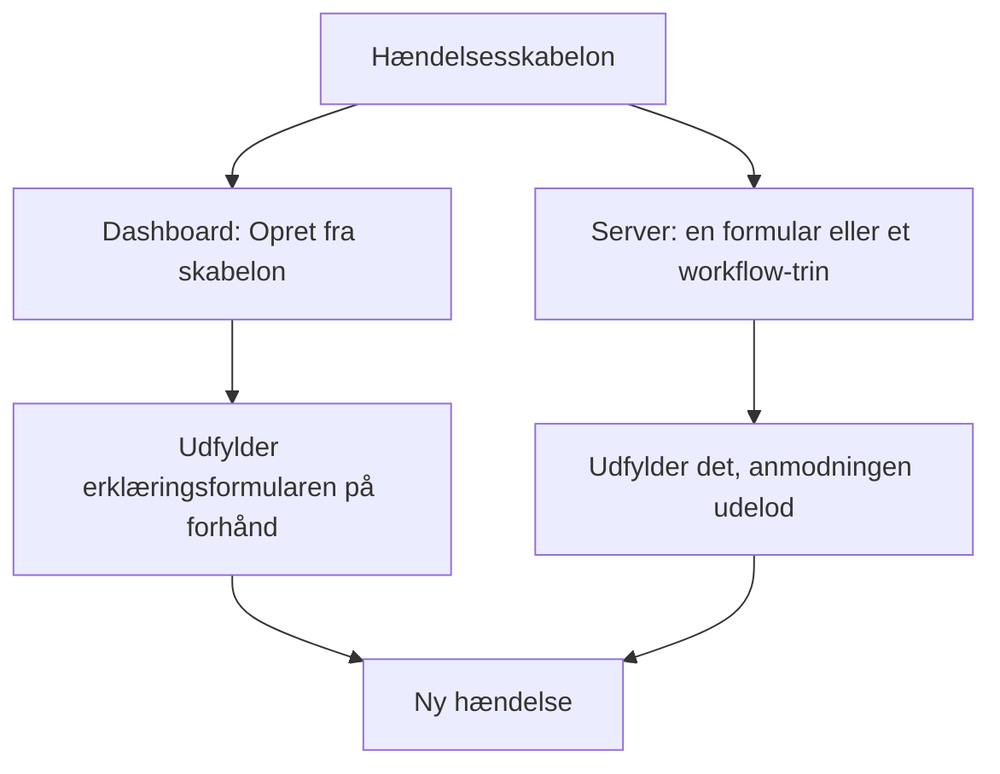
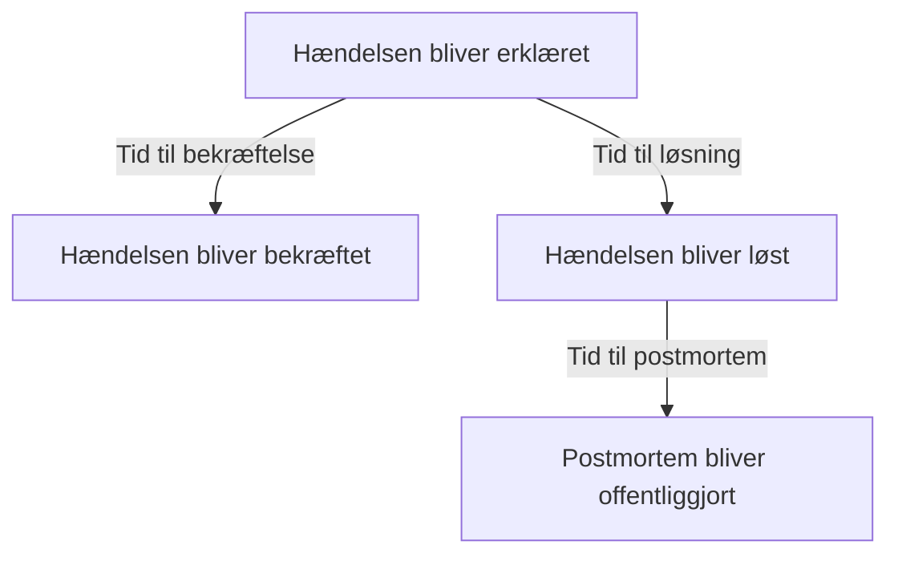
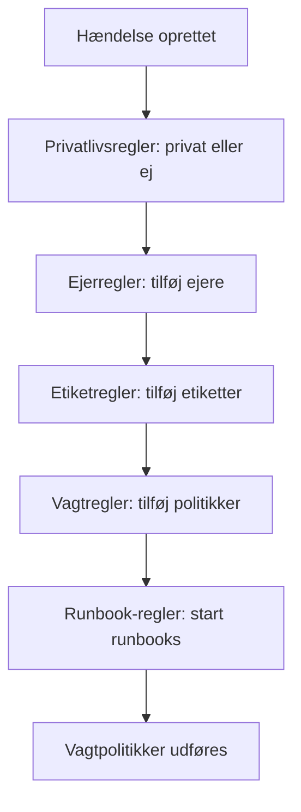

# Hændelsesindstillinger og automatisering

Konfigurationen af hændelser ligger under **Hændelser**, ikke under **Projektindstillinger**: tilstande og alvorsgrader, skabeloner, brugerdefinerede felter, roller, målinger og nummerpræfikser og de regler, der virker på hver ny hændelse. Denne side er opslagsværket for hver af de sider og for det, der kører af sig selv i det øjeblik, en hændelse erklæres.

:::cards
- [Hændelsesskabeloner](#hændelsesskabeloner): Erklær den samme slags hændelse, udfyldt på forhånd, hver gang.
- [Brugerdefinerede felter](#brugerdefinerede-felter): Dine egne felter på hver hændelse, spurgt om, når den erklæres.
- [Målinger](#målinger): Tiden til bekræftelse, løsning eller afbødning, beregnet for hver hændelse.
- [Regler](#regler-der-kører-når-en-hændelse-oprettes): Ejere, etiketter, tilkaldelse og episoder, sat automatisk.
:::

## Hvor hændelsesindstillingerne ligger

Åbn **Hændelser** fra menuen **Produkter** i topbjælken, og fold derefter **Indstillinger** ud nederst i dens sidemenu. **Regler** og **Indstillinger** starter begge sammenfoldet, så fold dem ud, før siderne nedenfor vises. Alt her hører til projektet: skabeloner, roller, brugerdefinerede felter og regler hører til ét projekt og gælder for hver hændelse, der erklæres i det, på ruter, der begynder med `/dashboard/{projectId}/incidents/settings/`.

| Side                         | Hvad du gør der                                                                              |
| ---------------------------- | -------------------------------------------------------------------------------------------- |
| **Hændelsesstatus**          | Tilføje, omdøbe, give nye farver og ændre rækkefølgen på de tilstande, en hændelse går igennem. |
| **Hændelsesalvor**           | Tilføje, omdøbe, give nye farver og ændre rækkefølgen på alvorsgraderne.                     |
| **Hændelsesskabeloner**      | Udfylde en hel hændelse på forhånd — titel, beskrivelse, ressourcer, vagtpolitikker, ejere, etiketter. |
| **Noteskabeloner**           | Genbrugelig tekst til offentlige og private noter.                                           |
| **Postmortem-skabeloner**    | Genbrugelige strukturer til postmortems.                                                     |
| **Brugerdefinerede felter**  | Definere ekstra felter, der vises på hver hændelse.                                          |
| **Hændelsesroller**          | Definere de roller, du tildeler dem, der reagerer, som Hændelsesleder.                       |
| **Målinger**                 | Måle, hvor lang tid tingene tager, som tiden til bekræftelse eller løsning, på hver hændelse. |
| **Tilknyttede advarsler**    | Vælge, om de advarsler, der er knyttet til en hændelse, bekræftes og løses sammen med den. Begge er slået til i nye projekter. |
| **Nummerpræfiks**            | Teksten foran hændelses- og episodenumre, som `INC-` i `INC-42`.                             |

Det, OneUptime AI gør på egen hånd, sættes ikke her: det har sit eget afsnit, **Hændelser → AI**, på ruter, der begynder med `/dashboard/{projectId}/incidents/ai/`. Dets side **Indstillinger** slår undersøgelse af nye hændelser, automatisk rettelse af dem (slået fra, indtil du slår den til), med de pull requests til rettelser og manglende telemetri, der hører til rettelsen, samlet under den, og udkast til postmortems til eller fra, og hver gemmes, så snart du slår den om; undersøgelsesreglerne og reglerne for automatisk afhjælpning, der indsnævrer, hvilke hændelser der undersøges og rettes, og de valgfri grænser, AI arbejder under, er foldet sammen under **Yderligere indstillinger**, og ingen af dem gælder, før du sætter dem. **Indsigter** og **Protokoller** står ved siden af: hvad AI har lært af dine hændelser, og alt, hvad den har gjort. Se [AI SRE](/docs/ai/ai-sre).

**Hændelsesstatus** og **Hændelsesalvor** gennemgås grundigt i [Hændelsestilstande og alvorsgrader](/docs/incidents/states-and-severities) — resten af denne side fortsætter fra **Hændelsesskabeloner**. Formularer, der lader folk uden for dit team melde hændelser, er et produkt for sig: se [Formularer](/docs/forms/index). Værktøjer, der selv åbner hændelser, som [Huntress](/docs/integrations/huntress), sættes op under **Hændelser → Integrationer**.

Fold **Regler** ud, og du får otte sider mere: **Grupperingsregler**, **Vagtregler**, **Ejerregler**, **Runbook-regler**, **Privatlivsregler**, **Etiketregler**, **SLA-regler** og **Reminder Rules**. De gennemgås længere nede.

## Hændelsesskabeloner

En hændelsesskabelon er et gemt skelet af en hændelse. I stedet for at skrive den samme titel, den samme liste over monitorer og den samme vagtpolitik igen, hver gang betalingsklyngen vakler, gemmer du den én gang og erklærer fra den.

:::steps
1. Gå til **Hændelser → Indstillinger → Hændelsesskabeloner** (`/dashboard/{projectId}/incidents/settings/templates`). Kortet hedder **Hændelsesskabeloner**.
2. Klik på **Opret Hændelse Skabelon**. Navngiv skabelonen på **Skabeloninformation**, og udfyld derefter den hændelse, den erklærer, på **Hændelsesdetaljer**: en **Titel**, en **Hændelsesalvor** og en **Beskrivelse**.
3. Tryk **Næste** gennem de valgfri trin — de ressourcer, den berører, dens brugerdefinerede felter og dens vagtpolitikker — og udfyld det, som hver hændelse af den slags har til fælles.
4. Klik på **Opret Hændelse Skabelon** på det sidste trin. Fra nu af tilbydes skabelonen af **Opret fra skabelon** i listen over hændelser.
:::

Oprettelsen fører dig gennem en guide i fire trin, med to trin mere, når dit projekt har brugerdefinerede hændelsesfelter. Kun de to første spørger om noget, du skal svare på: **Næste** går gennem de valgfri trin efter dem, og **Opret Hændelse Skabelon** står på det sidste trin.

- **Skabeloninformation** — **Skabelonnavn** og **Skabelonbeskrivelse**. De navngiver selve skabelonen; de vises aldrig på hændelsen.
- **Hændelsesdetaljer** — **Titel**, **Beskrivelse** (Markdown) og **Hændelsesalvor**. Under **Flere felter**, hvis sammenfoldede overskrift nævner de tre og viser hver, der er sat:
  - **Indledende hændelsestilstand** — den tilstand, hændelser, der erklæres fra skabelonen, starter i. Den starter tom, som på erklæringsformularen, og dens muligheder står i tilstandenes rækkefølge. Lader du den være tom, som dens pladsholder siger, starter de i den sædvanlige starttilstand: projektets oprettelsestilstand, den, hver ny hændelse starter i. En skabelon, der er gemt med en tilstand, beholder den.
  - **Ejere** — de personer og teams, der ejer hændelser, der erklæres fra skabelonen. **Tilføj ejer** åbner én liste med begge, den samme liste som en hændelses side **Ejere**; hvert valg vises som et mærke, du kan fjerne. En eksisterende skabelon viser dem på et kort **Ejere**.
  - **Etiketter** — de etiketter, hændelser, der erklæres fra skabelonen, starter med.
- **Berørte ressourcer** — som på erklæringsformularen: **Monitorer**, derefter **Skift overvågningsstatus til**, derefter **Andre berørte ressourcer** til værterne, klyngerne og tjenesterne, med **Begræns til disse statussider** under **Flere felter**. En skabelon spørger altid om **Skift overvågningsstatus til**, uanset om der er valgt monitorer: den gælder også de monitorer, der vælges, når en hændelse erklæres fra skabelonen, hvor erklæringsformularen viser den, så snart den første monitor er valgt. En eksisterende skabelons kort **Berørte ressourcer** spørger på samme måde og viser den status, skabelonen vælger, eller **Monitorer beholder deres status.**, når den ikke vælger nogen. **Begræns til disse statussider** begrænser hændelser, der erklæres fra skabelonen, til nogle af de statussider, der viser deres monitorer — en skabelon `Region East outage` kan tage siderne for lokationen Øst med. En eksisterende skabelon viser det på et kort **Statussideomfang** med **Rediger statussideomfang**. Se [Én statusside pr. målgruppe](/docs/status-pages/one-status-page-per-audience).
- **Brugerdefinerede felter** — kun når dit projekt har brugerdefinerede hændelsesfelter: de værdier, hændelser, der erklæres fra denne skabelon, starter med. Hvert felt tilbydes her, ikke kun dem, trinnet **Detaljer** spørger om, og intet er påkrævet. En eksisterende skabelon har et kort **Brugerdefinerede felter** til at ændre dem.
- **Brugerdefinerede felter ved oprettelse** — også kun når dit projekt har brugerdefinerede hændelsesfelter: hvilke af dem trinnet **Detaljer** spørger om, når en hændelse erklæres fra denne skabelon, og hvilke der skal udfyldes. En eksisterende skabelon har et kort **Brugerdefinerede felter ved oprettelse** til at ændre dem. Se [Brugerdefinerede felter ved oprettelse](#brugerdefinerede-felter-ved-oprettelse).
- **Vagt** — **Vagtpolitik**, de politikker, der udføres, når en hændelse, der er oprettet fra denne skabelon, erklæres.

Et par hurtige regler:

- Listen over skabeloner viser kun **Navn** og **Beskrivelse**. Rækker kan ikke redigeres eller slettes fra listen — åbn en skabelon (`/dashboard/{projectId}/incidents/settings/templates/{modelId}`) for at ændre den.
- Alle, der kan redigere en skabelon, kan ændre dens detaljer og dens berørte ressourcer, **Indledende hændelsestilstand** og **Skift overvågningsstatus til** inklusive: Project Owners, Project Admins og Project Members, Incident Admins og Incident Members og en rolle med **Edit Incident Template**.
- Skabeloner understøtter import og eksport i JSON, så du kan flytte en mellem projekter.
- Uden skabeloner siger listen **Ingen hændelsesskabeloner fundet** med **Opret Hændelse Skabelon** lige nedenunder.
- Heller ikke uden skabeloner åbner **Opret fra skabelon** i listen over hændelser en dialog **No Incident Templates**, der siger, hvor skabeloner laves, og dens knap **Create Template** åbner **Hændelser → Indstillinger → Hændelsesskabeloner**.

### Sådan anvendes en skabelon

Der er to veje, og de fletter på samme måde.



- **I dashboardet** — knappen **Opret fra skabelon** i listen over hændelser åbner en vælger **Vælg hændelsesskabelon**, og erklæringssiden læser skabelonen fra forespørgselsparameteren `incidentTemplateId` og udfylder derefter formularen med skabelonen plus dens ejerteams og ejerbrugere. Dens trin **Detaljer** følger skabelonens [brugerdefinerede felter ved oprettelse](#brugerdefinerede-felter-ved-oprettelse). Ejerne bliver hændelsens ejere uden at få besked, når hændelsens Slack- og Microsoft Teams-kanaler findes, så en notifikationsregel, der inviterer hændelsens ejere til en ny kanal, også inviterer dem.
- **På serveren** — en [formular](/docs/forms/on-submit#the-incident-template), der har en **Hændelse Skabelon**, og et workflows trin **Create One Incident** med en valgt **Incident Template** erklærer hændelsen fra skabelonen på serveren. Trinnet læser skabelonen som Project Admin for workflowets projekt, så en skabelon fra et andet projekt, eller en, der er slettet, afvises, og på et abonnement, der ikke omfatter hændelsesskabeloner, afvises trinnet med det abonnement, det kræver. Skabelonens ejere bliver hændelsens ejere, som i dashboardet. Se [Workflow-komponenter](/docs/workflows/components).

En hændelse, der erklæres på serveren, registrerer skabelonen i `createdIncidentTemplateId`. Kun OneUptime sætter den kolonne, for en formular eller et workflow-trin, der nævner en skabelon: en API-nøgle eller en indlogget bruger kan ikke, og en anmodning, der sender `createdIncidentTemplateId`, afvises. For at erklære fra en skabelon via API'et læser du den fra `/api/incident-templates` og sender dens værdier i anmodningen.

> [!IMPORTANT]
> Det vigtige er fletteregeln: **en skabelon udfylder kun et felt, du ikke har sat**. Titel, beskrivelse, hændelsens alvorsgrad, indledende hændelsestilstand, monitorstatussen bag **Skift overvågningsstatus til**, monitorer, værter, Kubernetes-klynger, Docker-værter, Podman-værter, tjenester, vagtpolitikker, etiketter og statussider kopieres kun fra skabelonen, når kalderen eller formularen ikke angav noget. Det, du sætter udtrykkeligt, vinder altid, også en tilstand: en hændelse, der nævner sin tilstand, starter i den og tager stadig alt andet fra skabelonen, som i dashboardet. Værdier i brugerdefinerede felter flettes ét felt ad gangen: skabelonen udfylder de felter, hændelsen blev erklæret uden, og en værdi, du sætter — `0`, `false` og `null` inklusive — vinder over skabelonens.

### Brugerdefinerede felter ved oprettelse

Projektets indstillinger afgør, hvad trinnet **Detaljer** spørger om, når en hændelse erklæres: **Vis ved oprettelse** spørger om et felt, og **Påkrævet ved oprettelse** gør det obligatorisk. En skabelon kan ændre begge for de hændelser, der erklæres fra den. Dens kort **Brugerdefinerede felter ved oprettelse** — og guidens trin med samme navn — viser hvert brugerdefineret hændelsesfelt i dets **Rækkefølge**, med én indstilling hver:

| Indstilling      | Når en hændelse erklæres fra denne skabelon                                                                                         |
| ---------------- | ----------------------------------------------------------------------------------------------------------------------------------- |
| **Standard**     | Feltet følger sine egne **Vis ved oprettelse** og **Påkrævet ved oprettelse**. Muligheden siger hvilken, som **Standard (Påkrævet)**. |
| **Påkrævet**     | Trinnet **Detaljer** spørger om feltet, og det skal udfyldes. Et ja/nej-felt skal være slået til.                                   |
| **Valgfrit**     | Trinnet spørger om feltet, og det kan stå tomt — også når projektet kræver det.                                                     |
| **Skjult**       | Trinnet spørger ikke om feltet, også når projektet viser eller kræver det. Skabelonens egen værdi for det anvendes stadig.         |

På kortet viser et felt, som skabelonen sætter til **Påkrævet**, **Valgfrit** eller **Skjult**, også under sin type, hvad projektet gør med det: **Projektets standard: Påkrævet**, **Projektets standard: Valgfrit** eller **Projektets standard: Vises ikke**. Alle, der kan se skabelonen, ser det.

Brug det, når hændelserne fra én skabelon kræver et svar, andre ikke gør — et kundeniveau på en skabelon `Customer data exposure` for eksempel — eller for at holde et spørgsmål, projektet stiller overalt, ude af en skabelon, hvor det ikke passer.

- **Gemt pr. skabelonvariabel.** Hver indstilling gemmes under feltets **Skabelonvariabel**, som aldrig ændres, så en omdøbning af et felt beholder dets indstilling. Et felt, der slettes og oprettes igen med samme navn, får sin indstilling tilbage — i modsætning til en formulars spørgsmål, der nævner et felt ved dets ID, så et felt, der slettes og oprettes igen, ikke spørges om, før det er tilføjet igen.
- **Rediger og Gem læser dem på ny.** **Rediger** på kortet læser felterne og skabelonens indstillinger igen, med en indlæsningsindikator i dialogen i mellemtiden, og **Gem** læser dem én gang til og skriver kun de felter, du ændrede i den. Så en ændring, en anden administrator lavede på andre felter i mellemtiden, bevares — også en indstilling, vedkommende gav et felt, der blev oprettet, mens din dialog var åben — og en ændring, du lavede på et felt, der blev slettet i mellemtiden, skrives ikke. Kortet viser derefter felterne, som de er. Kan de ikke læses, når du trykker på **Rediger**, siger dialogen hvorfor og tilbyder **Prøv igen** i stedet for **Gem**; trykker du på **Gem**, siger den hvorfor, gemmer intet og beholder dine valg.
- **Kun dashboardet anvender dem.** Ligesom **Påkrævet ved oprettelse** former indstillingerne formularen **Erklær hændelse** og intet andet. Hændelser, der erklæres via API'et, af et workflow, en monitor, Slack, Microsoft Teams eller AI, er ikke bundet af dem, og [formularer](/docs/forms/building) stiller deres egne spørgsmål. Se [Påkrævet ved oprettelse kontrolleres kun af dashboardet](#påkrævet-ved-oprettelse-kontrolleres-kun-af-dashboardet).
- **Et felt, der kopieres fra et brugerdefineret monitorfelt,** spørges der stadig ikke om, når hændelsen har en monitor, uanset hvad skabelonen siger.
- **Alle, der kan redigere hændelsesskabeloner, kan ændre dem** — Project Members og Incident Members inklusive — også for et felt, en Project Admin har gjort **Påkrævet ved oprettelse** for hele projektet. Selve indstillingerne for hele projektet kræver en Project Owner, en Project Admin eller tilladelsen **Edit Incident Custom Field**.
- **De følger med skabelonen.** En skabelons JSON-eksport indeholder dem, og i det projekt, du importerer den til, gælder de for felterne med samme **Skabelonvariabel**.

Via API'et er de skabelonens `customFieldSettings`: et objekt med hvert felts **Skabelonvariabel** som nøgle og `Required`, `Optional`, `Hidden` eller `Default` for hvert felt.

```json title="customFieldSettings"
{
  "customFieldSettings": {
    "impact": "Required",
    "affected_location": "Optional",
    "additional_information": "Hidden"
  }
}
```

Et felt, der ikke er med i listen, følger sine egne indstillinger, som med `Default`. En anmodning afvises med en fejl `400`, når en nøgle ikke er en gyldig **Skabelonvariabel** — små bogstaver, cifre og understregninger — eller en værdi ikke er en af de fire. En nøgle, der ikke matcher noget felt, bevares og ignoreres.

## Noteskabeloner

Noteskabeloner giver dem, der reagerer, færdig tekst til opdateringer om hændelsen, så en opdatering på statussiden klokken tre om natten ikke skrives fra bunden af en, der er halvt i søvne.

:::steps
1. Gå til **Hændelser → Indstillinger → Noteskabeloner** (`/dashboard/{projectId}/incidents/settings/note-templates`). Kortet hedder **Skabeloner til offentlige eller private noter for hændelser** — ét bibliotek tjener begge slags noter.
2. Klik på **Opret Hændelse Note Skabelon**, og udfyld dens ene side: **Skabelonnavn** og **Skabelonbeskrivelse**, begge påkrævet, og derefter selve **Note**, i Markdown, påkrævet: den tekst, en note starter med, når skabelonen vælges.
3. Gem den. Skabelonen tilbydes af **Skabeloner** på begge notesider og af **Vælg noteskabelon** i dialogerne **Bekræft hændelse** og **Løs hændelse**.
:::

Ligesom hændelsesskabeloner oprettes og vises rækkerne i stedet for at blive redigeret i listen; åbn en skabelon for at ændre den.

**Variabler.** En noteskabelon kan indeholde variabler, der udfyldes med hændelsens værdier, når skabelonen vælges, så forfatteren ser — og stadig kan ændre — den færdige tekst, før den slås op:

| Variabel                            | Udfyldes med                                                       |
| ----------------------------------- | ------------------------------------------------------------------ |
| `{{incident.title}}`                | Hændelsens titel.                                                  |
| `{{incident.number}}`               | Dens nummer, for eksempel `INC-42` eller `#42`.                    |
| `{{incident.severity}}`             | Dens alvorsgrad.                                                   |
| `{{incident.state}}`                | Dens aktuelle tilstand.                                            |
| `{{incident.startedAt}}`            | Hvornår den blev erklæret, i forfatterens tidszone, med tidszonen nævnt. |
| `{{incident.labels}}`               | Dens etiketter, adskilt af kommaer.                                |
| `{{incident.affectedStatusPages}}`  | De statussider, den vises på og giver besked, som forfatteren kan se. |
| `{{incident.customFields.<key>}}`   | Et brugerdefineret felts værdi, ved feltets **Skabelonvariabel**, som editoren **Note** viser under **Skabelonvariabler** ved feltets navn. |

Brugerdefinerede felter blev tidligere skrevet `{{customFields.<key>}}`; skabeloner, der stadig bruger det, udfyldes på samme måde. En variabel, der ikke har nogen værdi, eller som ikke er på listen, bliver stående præcis, som den er skrevet, så forfatteren kan udfylde den. Værdier indsættes som tekst: en hændelses titel kan ikke blive til et billede, HTML eller et link, hvis tekst skjuler, hvor det fører hen, i den opslåede note, selv om en adresse i den stadig vises som et link til den adresse. Et brugerdefineret felt **Formateret tekst (Markdown)** indsættes som den Markdown, det er.

> [!IMPORTANT]
> Variablerne for brugerdefinerede felter, etiketter og statussider udfylder dit teams egne optegnelser, hvert brugerdefineret felt, uanset om det er markeret med **Medtag i abonnentnotifikationer** eller ej, og ét bibliotek tjener også offentlige noter, som vises på hændelsens statussider og mailes til deres abonnenter. Læs den udfyldte tekst, før du slår en offentlig note op.

**Indsæt en variabel.** Du behøver aldrig skrive en variabels navn. Editoren **Note** tilbyder variablerne på tre måder, og hver sætter variablen, hvor markøren står:

- **Skabelonvariabler**, foldet sammen under editoren: åbn det for at se hver variabel med det, den udfyldes med — projektets brugerdefinerede hændelsesfelter ved navn — og klik på en.
- **Indsæt variabel**, i slutningen af editorens værktøjslinje: den samme liste med et søgefelt.
- At skrive `{{` i noten åbner listen under markøren. Skriv videre for at indsnævre den, vælg med piletasterne, og tryk på Enter eller Tab for at indsætte variablen; Escape lukker listen.

Den samme liste, knap og `{{` følger med de andre skabeloner, der har variabler: en SLA-regels notepåmindelser, en grupperingsregel for hændelser eller advarsler og dens episodetitel og -beskrivelse, en monitorregels hændelses- og advarselsbeskrivelse og afhjælpningsnoter, en SLO-forbrugsrateregels skabeloner og en statussides brugerdefinerede skabeloner til abonnentnotifikationer.

Noteskabeloner dukker op, hvor du faktisk har brug for dem: bekræftelsesdialogerne **Bekræft hændelse** og **Løs hændelse** tilbyder begge **Vælg noteskabelon** over feltet **Offentlig note**, foldet sammen under **Tilføj en offentlig note**. Se [Hændelsesnoter, ejere og feed](/docs/incidents/notes-owners-and-feed) for, hvordan offentlige og private noter adskiller sig.

## Postmortem-skabeloner

En postmortem-skabelon er skelettet til den rapport, du laver efter en hændelse — dine overskrifter, dine opfordringer, dine faste spørgsmål — så hver gennemgang i projektet følger samme form.

:::steps
1. Gå til **Hændelser → Indstillinger → Postmortem-skabeloner** (`/dashboard/{projectId}/incidents/settings/postmortem-templates`). Kortet hedder **Postmortem-skabeloner**.
2. Klik på **Opret Hændelse Postmortem Skabelon**, og udfyld dens ene side: **Skabelonnavn** og **Skabelonbeskrivelse**, begge påkrævet, og derefter **Postmortem-skabelon**, selve teksten, i Markdown, påkrævet.
3. Gem den. Hver hændelses side **Postmortem** tilbyder nu **Anvend skabelon**.
:::

Du anvender en fra hændelsen, ikke fra indstillingerne. Åbn en hændelse, vælg **Postmortem** i dens sidemenu (`/dashboard/{projectId}/incidents/{incidentId}/postmortem`), og brug **Anvend skabelon**. Det åbner en dialog **Anvend postmortem-skabelon** med en rullemenu **Vælg skabelon**; vælger du en, indlæses skabelonens tekst i editoren **Postmortem-note**, hvor du redigerer den, før du gemmer. Hændelsesepisoder har den samme side **Postmortem** og trækker på det samme skabelonbibliotek. **Anvend skabelon** vises kun, når projektet har en postmortem-skabelon; er der kun én, er den allerede valgt. Editoren åbner på hændelsens postmortem, som den er, med skabelonen som note, så om den er på statussiden, hvornår den blev offentliggjort, og dens vedhæftninger forbliver, som de var.

## Brugerdefinerede felter

Med brugerdefinerede felter bærer du dine egne metadata på hver hændelse — navnet på en intern tjeneste, en reference til en ændringsbillet, et kundeniveau — og stiller de samme spørgsmål, hver gang en hændelse erklæres, som dens påvirkning og hvornår den forventes løst.

:::steps
1. Gå til **Hændelser → Indstillinger → Brugerdefinerede felter** (`/dashboard/{projectId}/incidents/settings/custom-fields`). Siden hedder **Brugerdefinerede hændelsesfelter** og viser felterne i deres **Rækkefølge**, hver kun ved sit **Feltnavn** og sin **Felttype**.
2. Klik på **Opret Hændelse Brugerdefineret Felt**, og udfyld dets **Feltnavn**, **Feltbeskrivelse** og **Felttype** — og, for en rullemenutype, dets muligheder, lige under typen.
3. For at spørge om feltet, hver gang en hændelse erklæres, åbner du **Flere felter** og slår **Vis ved oprettelse** til, og **Påkrævet ved oprettelse**, hvis det skal besvares.
4. Gem det, og træk derefter rækken i dens greb derhen, hvor feltet skal stå. **Rediger** på et felts række åbner resten af dets indstillinger.
:::

At oprette et felt spørger om dets **Feltnavn**, **Feltbeskrivelse** og **Felttype** på én side — og, for en rullemenutype, dets muligheder, lige under typen. Et nyt felts værdier skrives ind. Alt andet ligger under **Flere felter**, som starter sammenfoldet, uanset om du opretter eller redigerer et felt; sammenfoldet nævner overskriften, hvad der er i det, og viser, hvad der er sat. For at lave et felt, der kopierer sin værdi fra et brugerdefineret monitorfelt i stedet, åbner du menuen **Mere** (**⋯**) ved siden af **Opret Hændelse Brugerdefineret Felt** og vælger **Opret tilknyttet brugerdefineret felt** — se [Felter, der kopieres fra en monitor](#felter-der-kopieres-fra-en-monitor).

Hver definition har:

- **Feltnavn** — påkrævet, mindst to tegn. Pladsholderen foreslår et slug-agtigt navn som `internal-service`.
- **Feltbeskrivelse** — valgfri.
- **Felttype** — påkrævet. Den afgør, hvordan data indtastes; typerne står nedenfor. Rullemenutyper skal også have deres muligheder angivet.
- **Rullemenuindstillinger** — de værdier, der vises i rullemenuen, hver med en valgfri farve: den lille knap ved siden af en mulighed viser dens farve og åbner de samme navngivne farver som hvert andet farvefelt, med **Ingen farve** først og **Brugerdefineret farve** til en præcis kode. Træk en mulighed i grebet i starten af dens række for at ændre, hvor den står. Muligheder kan tilføjes, omdøbes og tages ud, efter at hændelser har værdier; se [Skift en rullemenus muligheder](#skift-en-rullemenus-muligheder).
- **Rækkefølge** — hvor feltet vises blandt hændelsens brugerdefinerede felter: på hændelsens side **Brugerdefinerede felter**, i trinnet **Detaljer** og i beskeder til abonnenter. Der er intet tal at skrive: træk et felt i grebet i starten af dets række for at flytte det op eller ned, og et nyt felt tilføjes til sidst. Trækning er slået fra, mens et filter eller en søgning indsnævrer listen.
- **Vis ved oprettelse** — under **Flere felter**. Spørger om feltet i trinnet **Detaljer**, når en hændelse erklæres fra dashboardet (se [Opret en hændelse](/docs/incidents/declaring-incidents)). En hændelsesskabelon kan give ethvert felt en startværdi, vist ved oprettelse eller ej, og kan spørge om et felt eller udelade det for de hændelser, der erklæres fra den — se [Brugerdefinerede felter ved oprettelse](#brugerdefinerede-felter-ved-oprettelse). [Formularer](/docs/forms/building#custom-fields) følger det ikke: en formular spørger kun om de felter, der er tilføjet til den.
- **Påkrævet ved oprettelse** — under **Flere felter**, tilbudt, så snart **Vis ved oprettelse** er slået til. Trinnet **Detaljer** lader dig ikke erklære hændelsen, før feltet er udfyldt, og et felt **Boolesk** skal være slået til. Dashboardet er det eneste sted, hvor det kontrolleres; se [Påkrævet ved oprettelse kontrolleres kun af dashboardet](#påkrævet-ved-oprettelse-kontrolleres-kun-af-dashboardet).
- **Medtag i abonnentnotifikationer** — under **Flere felter**. Sender feltet og dets værdi til statussidens abonnenter med hændelsens beskeder: standardbeskederne pr. e-mail, i Slack og i Microsoft Teams og webhooks, men ikke SMS. Abonnenter er som regel uden for dit team, så slå det kun til for felter, der trygt kan deles. Se [Abonnenter og meddelelser](/docs/status-pages/subscribers#hændelser).
- **Skabelonvariabel** — den nøgle, en skabelon når feltet med, `{{incident.customFields.<key>}}`, i noteskabeloner og brugerdefinerede skabeloner til abonnentnotifikationer. Den dannes ud fra feltets navn, når feltet oprettes — små bogstaver, cifre og understregninger, så `Expected Resolution` bliver til `expected_resolution`, med `_2`, `_3` og så videre tilføjet, når et andet felt allerede har nøglen — og den ændres ikke, når feltet omdøbes. Ingen sætter den i hånden: API'et ignorerer en værdi, der sendes for den. Skabeloner, der er skrevet med det ældre `{{customFields.<key>}}`, virker fortsat. Du behøver aldrig slå den op: de editorer, der indsætter den — en noteskabelons **Note** og en statussides brugerdefinerede skabeloner til abonnentnotifikationer for hændelsesbegivenheder — viser hvert felts variabel under **Skabelonvariabler** ved feltets navn. Et felts formular **Rediger** viser den også, skrivebeskyttet, nederst i **Flere felter**, med en knap, der kopierer den.

**Rækkefølge**, **Vis ved oprettelse**, **Påkrævet ved oprettelse**, **Medtag i abonnentnotifikationer** og **Skabelonvariabel** findes kun på brugerdefinerede hændelsesfelter. De brugerdefinerede felter på monitorer, advarsler, planlagte vedligeholdelseshændelser og de andre ressourcer har dem ikke.

Definitionerne ligger i deres egen model; værdierne ligger på selve hændelsen i kolonnen `customFields`. På en enkelt hændelse udfylder du dem fra **Brugerdefinerede felter** i hændelsens sidemenu (`/dashboard/{projectId}/incidents/{incidentId}/custom-fields`), hvor felterne står i deres **Rækkefølge**. Hændelsesskabeloner gemmer værdier til de samme felter i deres egne `customFields`.

**Ét hul, der er værd at kende.** Definitioner af brugerdefinerede hændelsesfelter er den eneste del af hændelsesfamilien uden workflow-udløsere — se afsnittet om workflows nedenfor.

### Felttyper

| Felttype                                   | Indtastes som                                         | Godt til                                           |
| ------------------------------------------ | ----------------------------------------------------- | -------------------------------------------------- |
| **Tekst**                                  | Én linje tekst                                        | En reference til en ændringsbillet, navnet på en intern tjeneste |
| **Tal**                                    | Et tal                                                | Anslået varighed i minutter, berørte brugere       |
| **Boolesk**                                | En ja/nej-kontakt                                     | En bekræftelse, "kundevendt"                       |
| **Rullemenu (enkeltvalg)**                 | Én mulighed fra en liste                              | Påvirkning, region                                 |
| **Rullemenu (flervalg)**                   | Flere muligheder fra en liste                         | Berørte systemer                                   |
| **Dato**                                   | En dato                                               | En dato for fornyelse af en kontrakt               |
| **Dato og klokkeslæt**                     | En dato og et klokkeslæt                              | Forventet løsning                                  |
| **Lang tekst**                             | Flere linjer almindelig tekst                         | Berørte brugere eller systemer, yderligere oplysninger |
| **Formateret tekst (Markdown)**            | Formateret tekst, i Markdown-editoren med dens visuelle tilstand | En midlertidig løsning med links og lister |

**Lang tekst** og **Formateret tekst (Markdown)** findes til de brugerdefinerede felter på hver ressource, ikke kun hændelser. En værdi med formateret tekst gemmes som den Markdown, den blev skrevet i. Der er ingen type med radioknapper eller en gruppe af afkrydsningsfelter: brug en **Rullemenu (enkeltvalg)**, en **Rullemenu (flervalg)** eller en **Boolesk**.

### Påkrævet ved oprettelse kontrolleres kun af dashboardet

**Påkrævet ved oprettelse** holder formularen **Erklær hændelse** tilbage og intet andet. Hændelser, som en monitor, API'et, Slack, Microsoft Teams eller AI åbner, kan ikke udfylde en formular, så de oprettes med feltet tomt. Når en hændelse findes, forbliver hvert felt valgfrit på dens side **Brugerdefinerede felter**, så en, der retter én værdi midt under et udfald, aldrig bliver bedt om alle de andre. Se det som en påmindelse til dem, der erklærer hændelser, ikke som et løfte om, at hver hændelse har en værdi.

En skabelons [brugerdefinerede felter ved oprettelse](#brugerdefinerede-felter-ved-oprettelse) er det samme: de former formularen **Erklær hændelse** og intet andet. [Formularer](/docs/forms/building#required-questions) er undtagelsen, fordi serveren kontrollerer en formulars spørgsmål **Påkrævet**, når formularen sendes.

### Felter, der kopieres fra en monitor

Et brugerdefineret felt kan tage sin værdi fra et brugerdefineret felt på hændelsens monitorer i stedet for at få den skrevet ind — en region eller et kundeniveau, dine monitorer allerede registrerer, for eksempel. For at lave et åbner du menuen **Mere** (**⋯**) ved siden af **Opret Hændelse Brugerdefineret Felt** og vælger **Opret tilknyttet brugerdefineret felt**. Det spørger om tre ting:

- **Monitorfelt** — det brugerdefinerede monitorfelt, der skal kopieres. Hvert tilbydes, hver med sin type under sit navn. Det nye felt får den type, og en rullemenus muligheder, så de to altid passer sammen.
- **Feltnavn** — starter som monitorfeltets navn, indtil du skriver et andet.
- **Feltbeskrivelse** — valgfri.

Værdien udfyldes, når en hændelse oprettes med en monitor, og holdes opdateret, når monitorens værdi ændres. Når en hændelses monitorer har forskellige værdier, lades et felt med én værdi være, som det er, og et flervalgsfelt får dem alle. Kopiering rydder aldrig en værdi: en hændelse uden monitor beholder det, der er skrevet på den, og at rydde monitorens værdi lader kopierne være. Trinnet **Detaljer** spørger ikke om et kopieret felt, når hændelsen har en monitor.

For at kopiere et eksisterende felts værdi fra en monitor, ændre, hvilket monitorfelt det kopierer, eller gå tilbage til at skrive den ind, åbner du **Rediger** på feltets række og bruger **Hent værdi fra** under **Flere felter**. Brugerdefinerede felter på advarsler og planlagt vedligeholdelse kan kopiere fra deres monitorer på samme måde.

### Værdier i brugerdefinerede felter via API'et

På `POST /api/incident` og ved opdateringer af en hændelse er `customFields` et objekt med hvert felts **Feltnavn** som nøgle:

```json title="customFields"
{
  "customFields": {
    "Impact": "Major",
    "Estimated Duration": 90,
    "Acknowledgement": true,
    "Expected Resolution": "2026-10-01T14:30:00.000Z"
  }
}
```

Når en bruger eller en API-nøgle opretter eller opdaterer en hændelse, skal hver værdi, anmodningen sætter eller ændrer, passe til sit felt, ellers afvises anmodningen med en fejl `400`, der nævner feltet og den værdi, det fik:

| Felttype                                                           | Accepterer                                                     |
| ------------------------------------------------------------------ | -------------------------------------------------------------- |
| **Tekst**, **Lang tekst**, **Formateret tekst (Markdown)**         | Tekst. Et tal, `true` eller `false` gemmes, som det blev sendt. |
| **Tal**                                                            | Et tal, eller tekst, der er et, som `"42"`.                    |
| **Boolesk**                                                        | `true` eller `false`, eller teksten `"true"` eller `"false"`.  |
| **Dato**, **Dato og klokkeslæt**                                   | En dato, helst som ISO 8601-tekst.                             |
| **Rullemenu (enkeltvalg)**                                         | En af dets muligheder.                                         |
| **Rullemenu (flervalg)**                                           | En liste over dets muligheder, eller en enkelt mulighed alene. |

For en **Rullemenu (flervalg)** nævner afvisningen de første 10 poster, der ikke er blandt dens muligheder, og derefter hvor mange flere der er.

Hvad der ikke kontrolleres, så eksisterende integrationer bliver ved med at virke:

- **Værdier, anmodningen lader være, som de er.** Kortet **Brugerdefinerede felter** sender hver værdi tilbage, når du gemmer en af dem, så en værdi, der blev gemt, før disse kontroller fandtes, eller en rullemenumulighed, der er fjernet siden, aldrig forhindrer dig i at gemme de andre. Et flervalgsfelt beholder de poster, det allerede havde.
- **Nøgler, der ikke er navnet på et brugerdefineret hændelsesfelt**, som den `jiraIssueKey`, som [Jira-integrationen](/docs/integrations/jira) skriver.
- **Tomme værdier.** `null` eller en tom streng rydder et felt.
- **Værdier, der kopieres fra et brugerdefineret monitorfelt**, og skrivninger, som OneUptime selv laver.
- **Påkrævet ved oprettelse.** API'et spørger aldrig om et felt.

En hændelse, som en formular eller et workflows trin **Create One Incident** erklærer fra en skabelon (`createdIncidentTemplateId`), starter med skabelonens værdier i brugerdefinerede felter, flettet ét felt ad gangen under dem, den sender (se [Sådan anvendes en skabelon](#sådan-anvendes-en-skabelon)). En API-nøgle kan ikke erklære fra en skabelon: en anmodning, der sender `createdIncidentTemplateId`, afvises.

### Omdøb et felt

Værdier gemmes under feltets navn, så en omdøbning af et felt må flytte dem. Når du gemmer et nyt **Feltnavn**, flytter OneUptime feltets værdi til det nye navn på hver hændelse og hver hændelsesskabelon i projektet og opdaterer de gemte visninger af listen over hændelser, der viser feltet eller filtrerer på det. Flytningen starter intet workflow **On Update Incident**, og den ændrer ikke nogen hændelses tidspunkt for seneste opdatering. Feltets **Skabelonvariabel** forbliver, som den var, så noteskabeloner, brugerdefinerede skabeloner til abonnentnotifikationer og webhook-integrationer, der bruger den, bliver ved med at virke.

To omdøbninger afvises: én til et navn, et andet brugerdefineret hændelsesfelt allerede har (sammenlignet uden hensyn til store og små bogstaver), og en API-anmodning, der ville omdøbe flere felter på én gang. Workflows og API-klienter, der læser eller skriver en værdi ved feltets gamle navn, skal ændres til det nye.

Efter en omdøbning indeholder feltet kun sine egne værdier. At slette et felt efterlader dets værdier på de hændelser, der havde dem, så hændelser kan stadig have værdier under det nye navn fra et felt, der blev slettet; omdøbningen rydder dem i stedet for at vise dem som dette felts svar eller sende dem til abonnenter. Hver hændelse og skabelon flyttes samlet: fejler flytningen, ændres ingen af dem, feltet beholder sit gamle navn, og gemningen melder en fejl, så du bare kan prøve igen. Et felt, der **oprettes** med navnet på et slettet felt, er anderledes: det viser de værdier, det felt efterlod, og sender dem til abonnenterne, så snart **Medtag i abonnentnotifikationer** er slået til.

At slette et felt efterlader de spørgsmål, der spørger om det, på hver [formular](/docs/forms/building#custom-fields) i projektet, men de stilles ikke længere: formularbyggeren markerer hvert enkelt, så du kan slette det. Et felt, der oprettes igen med samme navn, er et nyt felt og spørges ikke om på en formular, før nogen tilføjer det dér. Hændelsesskabeloner beholder deres indstilling **Brugerdefinerede felter ved oprettelse** for det.

### Skift en rullemenus muligheder

Mulighederne i et felt **Rullemenu (enkeltvalg)** eller **Rullemenu (flervalg)** kan ændres når som helst: åbn **Rediger** på feltets række. En hændelse gemmer teksten på den mulighed, den fik, så hvad en ændring gør ved de hændelser, der har en mulighed, afhænger af ændringen:

| Hvad du gør med en mulighed              | Hvad der sker med de hændelser, der har den                                                                        |
| ---------------------------------------- | ------------------------------------------------------------------------------------------------------------------ |
| **Tilføjer** en                          | Intet. Den tilbydes fra nu af.                                                                                     |
| **Omdøber** den (ændrer dens tekst)      | De viser det nye navn. Under muligheden siger formularen, hvor mange hændelser der vil gøre det.                    |
| **Tager den ud** (skraldespanden ved siden af) | De beholder den, vist som _ikke længere en mulighed_, medmindre du vælger en anden mulighed til dem under **Ikke længere muligheder**. |
| **Trækker** den i dens greb              | Intet. Kun den rækkefølge, mulighederne står i, ændres.                                                            |

Når formularen åbner, tæller den, hvor mange hændelser der har hver værdi. **Ikke længere muligheder** viser hver mulighed, du tager ud, og som en hændelse stadig har, og hver værdi, hændelser har, og som aldrig var en mulighed (en, der blev skrevet via API'et, for eksempel), hver med hvor mange hændelser der har den. For hver kan du beholde den, som den er, eller vælge den mulighed, de hændelser skal have i stedet. **Fortryd** sætter en mulighed tilbage, du tog ud ved en fejl.

Når du gemmer, flyttes en omdøbt mulighed og en værdi, du vælger en mulighed til: på hver hændelse og hændelsesskabelon i projektet, i de gemte visninger af listen over hændelser, der filtrerer på dem, og i de svar, [formularskabeloner](/docs/forms/building) giver for feltet. Som ved et omdøbt felt starter flytningen intet workflow **On Update Incident** og ændrer ingen hændelses tidspunkt for seneste opdatering; fejler den, flyttes intet, og feltet beholder sine gamle muligheder. Workflows, API-klienter og Terraform-konfigurationer, der skriver en mulighed ved dens gamle tekst, skal have den nye tekst.

En hændelse, hvis værdi dens felt ikke længere tilbyder, viser værdien, markeret som _ikke længere en mulighed_, på sin side **Brugerdefinerede felter** og i listen over hændelser. At redigere dens andre felter beholder den; vælg en anden mulighed for at ændre den.

De brugerdefinerede felter på alle andre ressourcer virker på samme måde: monitorer, advarsler, planlagte vedligeholdelseshændelser, statussider, vagtpolitikker, teams, teammedlemmer og lagerelementer. At omdøbe en mulighed i et monitorfelt, eller tilføje en, gør det samme ved de hændelses-, advarsels- og vedligeholdelsesfelter, der kopierer det (se [Felter, der kopieres fra en monitor](#felter-der-kopieres-fra-en-monitor)), så de bliver ved med at tilbyde hver værdi, de kopierer.

Via API'et sender du den nye liste som `dropdownOptions` og omdøbningerne i `miscDataProps`:

```json
{
  "data": { "dropdownOptions": "Facility Alpha\nFacility B" },
  "miscDataProps": {
    "renamedDropdownOptions": [{ "from": "Facility A", "to": "Facility Alpha" }]
  }
}
```

Hver `to` skal være en af feltets muligheder, når det er gemt, og hver `from` kan kun omdøbes én gang. Uden `renamedDropdownOptions` ændres listen, og hver gemt værdi forbliver, som den er, hvilket også er det, der sker, når du ændrer `dropdown_options` i Terraform.

### Terraform

Indstillingerne ligger på ressourcen `oneuptime_incident_custom_field` som `sort_order`, `show_on_create`, `is_required_on_create` og `include_in_subscriber_notifications`. `variable_key` er skrivebeskyttet: den nøgle, OneUptime dannede, da feltet blev oprettet.

Udelad `sort_order`, og et nyt felt kommer sidst i listen. Giv det det tal, et andet felt allerede har, og det tager den plads, mens felterne i vejen rykker én plads. Et tal, som intet andet felt har, beholdes, som du skrev det.

## Målinger

En måling er tiden mellem to øjeblikke i en hændelse. **Tid til bekræftelse** er tiden fra, at en hændelse erklæres, til nogen bekræfter den; **tid til løsning** løber fra, at den erklæres, til den er løst. Du sætter en måling op én gang, og OneUptime beregner den for hver hændelse, også tidligere hændelser, og viser den i et diagram, så du kan se, om dit team bliver hurtigere.

Gå til **Hændelser → Indstillinger → Målinger** (`/dashboard/{projectId}/incidents/settings/measurements`), og vælg **Opret Incident Measurement**. Hver definition har et **navn**, et **startpunkt** og et **slutpunkt**. Dens permanente **nøgle** dannes ud fra navnet, mens du skriver det — "Time to Detect" får `time-to-detect` — så der er intet at udfylde. For at vælge din egen nøgle vælger du **Rediger** ved siden af den, før du opretter målingen.



Advarsler og planlagte vedligeholdelseshændelser har den samme funktion under **Advarsler → Indstillinger → Målinger** og **Planlagt vedligeholdelse → Indstillinger → Målinger**. Alt nedenfor gælder for alle tre, hver med sine egne øjeblikke.

### Færdige målinger

Formularen åbner på **Hvad vil du måle?**. Vælg en af disse, og dens navn, beskrivelse og begge øjeblikke udfyldes: **Næste** viser øjeblikkene, og målingen oprettes fra det sidste trin.

| Hvor                      | Måling                                 | Starter, når                                      | Slutter, når                           |
| ------------------------- | -------------------------------------- | ------------------------------------------------- | -------------------------------------- |
| Hændelser                 | **Tid til bekræftelse**                | Hændelsen bliver erklæret                         | Hændelsen bliver bekræftet             |
| Hændelser                 | **Tid til løsning**                    | Hændelsen bliver erklæret                         | Hændelsen bliver løst                  |
| Hændelser                 | **Tid til postmortem**                 | Hændelsen bliver løst                             | Postmortem bliver offentliggjort       |
| Advarsler                 | **Tid til bekræftelse**                | Advarslen bliver oprettet                         | Advarslen bliver bekræftet             |
| Advarsler                 | **Tid til løsning**                    | Advarslen bliver oprettet                         | Advarslen bliver løst                  |
| Planlagt vedligeholdelse  | **Startforsinkelse**                   | Vedligeholdelsen skal efter planen starte         | Vedligeholdelsen starter               |
| Planlagt vedligeholdelse  | **Overskridelse**                      | Vedligeholdelsen skal efter planen slutte         | Vedligeholdelsen slutter               |
| Planlagt vedligeholdelse  | **Vedligeholdelsens varighed**         | Vedligeholdelsen starter                          | Vedligeholdelsen slutter               |

Vælg **Noget andet** for selv at vælge de to øjeblikke. Et navn, du har skrevet, bevares, når du vælger en af disse.

### Vælg de to øjeblikke

Det andet trin, **Start og slut**, har **Starter, når** og **Slutter, når**. Hver viser med almindelige ord de øjeblikke, en måling kan starte eller slutte ved. En ny måling starter, når hændelsen erklæres, så for det meste vælger du kun, hvor den slutter.

| Øjeblik                                           | Hvornår det sker                                                             | Gemt i API'et som                                     |
| ------------------------------------------------- | ---------------------------------------------------------------------------- | ----------------------------------------------------- |
| **Hændelsen bliver erklæret**                     | Hvornår hændelsen startede i OneUptime: hvornår den blev oprettet, medmindre nogen satte et tidligere tidspunkt. | `Declared At` (`Timeline Start` er det samme øjeblik) |
| **Hændelsen bliver bekræftet**                    | Når den når din bekræftede tilstand, eller en tilstand efter den (en løsning direkte fra starten tæller også). | `State Role Entered`, rolle `Acknowledged`  |
| **Hændelsen bliver løst**                         | Når den når din løste tilstand.                                              | `State Role Entered`, rolle `Resolved`                |
| **Postmortem bliver offentliggjort**              | Når hændelsens postmortem offentliggøres.                                    | `Postmortem Posted At`                                |
| **Hændelsen går i en tilstand, du vælger**        | En af dine hændelsestilstande. Formularen spørger så hvilken.                | `State Entered`, med tilstanden                       |
| **Påvirkningen begynder**                         | Hvornår kunderne først blev berørt — se nedenfor.                            | `Impact Started At`                                   |
| **Hændelsen går i sin første tilstand**           | Når den når den tilstand, nye hændelser starter i, som Identified.           | `State Role Entered`, rolle `Created`                 |
| **Hændelsen bliver oprettet i OneUptime**         | Som regel samme øjeblik, som den erklæres.                                   | `Created At`                                          |

Advarsler starter fra **Advarslen bliver oprettet** og har ingen postmortem; planlagt vedligeholdelse tilføjer **Vedligeholdelsen skal efter planen starte** og **Vedligeholdelsen skal efter planen slutte**, det planlagte vindue, ved siden af **Vedligeholdelsen starter**, **Vedligeholdelsen slutter** og **Vedligeholdelsen bliver fuldført**.

At nå **bekræftet** eller **løst** følger den tilstand, der spiller den rolle, så det virker fortsat, hvis du omdøber eller erstatter tilstanden. **En tilstand, du vælger,** er bundet til den ene tilstand.

### Flere felter

Nogle få muligheder, som de fleste målinger aldrig ændrer, er foldet sammen under **Flere felter** i slutningen af trinnet **Start og slut**, sat til de standarder, API'et også bruger. Sammenfoldet nævner overskriften dem og viser dem, der er ændret.

- **Hvis starten sker mere end én gang** og **Hvis slutningen sker mere end én gang** vises for et øjeblik, der når en tilstand. En genåbnet hændelse kan nå den samme tilstand igen. **Brug første gang** er standarden og svarer til de indbyggede tider for hændelser; **Brug sidste gang** følger en genåbnet hændelse til dens sidste gennemløb.
- **Vis varigheder i** er den enhed, målingens diagrammer bruger. **Automatisk** er standarden: den registrerer sekunder, som diagrammerne viser som sekunder, minutter, timer eller dage, efterhånden som tallene vokser. **Minutter**, **Timer** eller **Dage** holder et diagram i én enhed. Hvert punkt skrives i den enhed, du vælger, og at ændre den omskriver målingens punkter i den nye.
- **Diagramopsummering** er, hvordan **Vis diagram** opsummerer mange hændelser: **Gennemsnit** som standard, eller **Median**, 90., 95. eller 99. percentil, **Længste** eller **Korteste**.
- **Vis på hændelsessider** sætter målingen på kortet **Målinger** på hver hændelses side (se nedenfor). Den er slået til som standard; slå den fra for en måling, du kun vil have i et diagram. Advarsler og planlagt vedligeholdelse kalder den **Vis på advarselssider** og **Vis på sider for vedligeholdelseshændelser**.

At redigere en måling tilføjer en kontakt **Aktiveret**: slå den fra for at holde op med at måle hændelser. De tal, der allerede er registreret, bevares.

### Hvad en måling rapporterer

| Status             | Betydning                                                                                 |
| ------------------ | ----------------------------------------------------------------------------------------- |
| **Recorded**       | Begge øjeblikke er sket. Varigheden står på hændelsen og i diagrammet.                    |
| **Afventer**       | Et øjeblik er ikke sket endnu, men kan stadig ske — hændelsen er stadig åben.             |
| **Not Applicable** | Et øjeblik kan aldrig ske — tilstanden blev sprunget over, eller tidspunktet blev aldrig registreret. |
| **Invalid**        | Begge øjeblikke er sket, men slutningen ligger før starten. Dine registrerede tider modsiger hinanden. |

Kun værdier **Recorded** bliver til punkter i diagrammet. Et øjeblik, der blev sprunget over, skriver intet i stedet for et nul, så det kan ikke trække et gennemsnit i sin retning.

**Invalid** er den status, der er værd at holde øje med. Det er det, en måling siger, når den tidslinje, den blev beregnet ud fra, er forkert — for eksempel en slutning 17 minutter før starten. Det er bevidst mere iøjnefaldende end et troværdigt udseende tal, som ingen sætter spørgsmålstegn ved.

### På hver hændelses side

Hver hændelses side viser sine egne målinger på et kort **Målinger** lige under **Hændelsesdetaljer**, i rækkefølgen fra listen på denne indstillingsside. Hver siger, hvad den måler — **Erklæret → Bekræftet** — og hvad den viser for denne hændelse:

| Den viser                             | Når                                                                                                                              |
| ------------------------------------- | -------------------------------------------------------------------------------------------------------------------------------- |
| En varighed, som **4 minutter**       | Begge øjeblikke er sket (**Recorded**). Den står i målingens enhed: **Automatisk** læses som sidens andre tider, **1 time og 5 minutter**, og **Timer** læses **1,5 time**. |
| **Har kørt i 12 minutter**            | Uret er startet, og slutningen er ikke sket endnu. Den tæller op, mens siden er åben.                                            |
| **Ikke startet endnu**                | Starten er ikke sket endnu, eller er et tidspunkt, der stadig ligger forude, som en vedligeholdelseshændelses planlagte start.    |
| **Ikke nået**                         | Hændelsen er løst, og det øjeblik, målingen ventede på, kom aldrig — en hændelse, der blev løst uden at blive bekræftet.          |
| **Ikke målt**                         | Et øjeblik kan aldrig ske (**Not Applicable**), med årsagen, som en tilstand, der blev sprunget over.                            |
| **Slutter før den starter**           | De registrerede tider modsiger hinanden (**Invalid**), med hvor langt fra hinanden de ligger.                                    |
| **Ikke beregnet endnu**               | OneUptime har ikke beregnet den for denne hændelse endnu, som lige efter at målingen blev oprettet.                              |

En måling, hvis start eller slutning du ændrer, bliver ved med at vise sin gamle værdi på hver hændelse, indtil OneUptime har beregnet den igen, ligesom dens diagram. Lige efter en tilstandsændring fra hændelsens hoved viser kortet de nye værdier, så snart OneUptime har beregnet dem, som regel med det samme.

Advarsler og planlagte vedligeholdelseshændelser har det samme kort på deres sider. For en vedligeholdelseshændelse kommer **Ikke nået**, når hændelsen er afsluttet. Kortet udelades, når ingen aktiveret måling har **Vis på hændelsessider** slået til, og for en, der ikke må læse målinger.

### Påvirkning startede, og hvorfor det er tomt

**Påvirkning startede** er et felt på hændelsen og på advarslen. Det er tomt som standard, og OneUptime udfylder det aldrig. Det registreres af en hændelsesformular, der spørger, hvornår påvirkningen begyndte (se [Formularer](/docs/forms/index)), eller via API'et. Indtil det er registreret, har en måling, der starter eller slutter ved **Påvirkningen begynder**, intet tal for den hændelse.

Det er netop pointen. `Declared At` registrerer, hvornår OneUptime fandt ud af det, hvilket for en hændelse, der udløses af en monitor, er, når kriterierne blev behandlet — ikke når påvirkningen begyndte. Hvis "Time to Detect" som standard lod starten være det samme tidspunkt, som slutningen bruger, ville hver hændelse rapportere nul, og diagrammet ville sige "vi opdager med det samme". Et tomt felt og en måling **Not Applicable** siger det sande: ingen har registreret, hvornår det begyndte.

### Ret et forkert tidsstempel

Hver måling beregnes forfra, hver gang dataene under den ændres — en post i tilstandstidslinjen, der oprettes, redigeres eller slettes, eller `Impact Started At`, `Declared At` eller `Postmortem Posted At`, der rettes på hændelsen. Intet lappes trinvis, så der er ingen forældet værdi at reparere.

Feltet **Begynder den** på en post i tilstandstidslinjen kan redigeres. Blev en hændelse bekræftet klokken 09:12, men posten siger 09:29, så ret posten, og hver måling, der er afledt af den, flytter sig med.

### Diagrammer, API og Terraform

Vælg **Vis diagram** på en måling for at åbne dens diagram i metrikudforskeren, over den seneste måned, opsummeret på dens måde. Hver aktiveret måling skriver en metrik med navnet `oneuptime.incident.measurement.<key>`, som du også kan føje til ethvert dashboard. Advarsler bruger `oneuptime.alert.measurement.<key>`, og planlagt vedligeholdelse bruger `oneuptime.scheduled-maintenance.measurement.<key>`. Listens kolonne **Nøgle**, skjult som standard, viser hver målings nøgle.

Definitioner er almindelige API-ressourcer, så Terraform-provideren administrerer dem som `oneuptime_incident_measurement`, `oneuptime_alert_measurement` og `oneuptime_scheduled_maintenance_measurement`. Beregnede værdier er skrivebeskyttede og vises som datakilder. Udeladt tager mulighederne under **Flere felter** de samme standarder som i dashboardet: `unit` er `seconds` (eller `minutes`, `hours`, `days`), `aggregation_type` er `Avg` (eller `P50`, `P90`, `P95`, `P99`, `Max`, `Min`), og `start_state_occurrence` og `end_state_occurrence` er `First` (eller `Last`). `show_on_incident_view` (`show_on_alert_view`, `show_on_scheduled_maintenance_view`) er `true`.

**Nøglen** er permanent, fordi den er en del af metrikkens navn — at ændre den ville efterlade serien forældreløs. Omdøb målingen frit; nøglen bliver.

Via API'et og i Terraform kan nøglen også udelades: den dannes ud fra navnet, med `-2`, `-3` og så videre tilføjet, når en anden måling i projektet allerede har den. En nøgle, du sender, bevares, som du skrev den. Den skal bestå af små bogstaver, tal og bindestreger, starte med et bogstav eller et tal, være højst 50 tegn, og ingen anden måling i projektet må have den.

### Skift fra en anden hændelsesplatform

Kommer du fra et værktøj med deklarative definitioner af målinger, kan de overføres direkte:

| Deres måling            | Sæt den op her som                                                                                  |
| ----------------------- | --------------------------------------------------------------------------------------------------- |
| Time to Detect          | **Noget andet**: **Påvirkningen begynder** → **Hændelsen bliver erklæret**                          |
| Time to Acknowledge     | Den færdige **Tid til bekræftelse**                                                                 |
| Time to Mitigate        | **Noget andet**: **Hændelsen bliver erklæret** → **Hændelsen går i en tilstand, du vælger**, en tilstand **Mitigated**, du tilføjer mellem Bekræftet og Løst |
| Time to Resolve         | Den færdige **Tid til løsning**                                                                     |

Time to Mitigate kræver en tilstand, der ikke findes som standard. Tilføj den under **Hændelser → Indstillinger → Hændelsesstatus** — en ny tilstand tilføjes lige over den løste tilstand, og du kan trække den hvor som helst mellem de andre.

> [!NOTE]
> **Én ting at vide om historikken.** En måling, du opretter i dag, beregnes også for tidligere hændelser i baggrunden: værdien på hver hændelse og dens punkt i diagrammet. At ændre, hvor en måling starter eller slutter, eller dens enhed, beregner den igen for hver hændelse. Vil du beholde de gamle tal, så opret en ny måling i stedet.

## Hændelsesroller

Hændelsesroller er de navngivne opgaver, du tildeler folk under en indsats. Definér dem under **Hændelser → Indstillinger → Hændelsesroller** (`/dashboard/{projectId}/incidents/settings/roles`). Tabellen viser hver rolles navn og beskrivelse.

Et nyt projekt starter med én rolle, **Hændelsesleder**, den person, der har ansvaret for indsatsen. OneUptime udfylder den for dig: erklærer du en hændelse fra dashboardet uden at vælge nogen til rollen, bliver du dens Hændelsesleder, og en hændelse, der stadig ikke har en, får den første person, der ændrer dens tilstand, medmindre vedkommende allerede har en anden rolle på den. Hændelsesleder kan omdøbes, men ikke slettes, og den besiddes altid af én person. Dens **Slet** er låst og siger hvorfor.

Tilføj de andre roller, dit team bruger, som Responder, Communications Lead eller Scribe, med **Opret Hændelse Rolle**. Formularen er én side: et navn og en beskrivelse og derefter **Flere felter**, foldet sammen, med **Tillad flere brugere**, rollens ikon og dens farve. En ny rolles farve er allerede valgt, en farve, som rollerne i listen ikke bruger endnu, og ikonet er valgfrit, så du åbner kun **Flere felter** for at ændre dem. En rolle besiddes af én person pr. hændelse, medmindre du slår **Tillad flere brugere** til. Projekter, der blev oprettet af tidligere versioner af OneUptime, startede også med Responder, Communications Lead og Observer. De beholder dem, indtil du sletter dem.

Roller er kun definitioner. Du tildeler folk til dem pr. hændelse — erklæringsguiden spørger på sit trin **Vagt og roller** med et felt **Tildel hændelsesroller**, og hver hændelse har en side **Roller** i sin sidemenu. En monitors kriterier og en grupperingsregel for hændelser kan vælge folk til dem på forhånd. Hver af de formularer spørger med de samme kort, ét pr. rolle: en rolle med mærket **Primær** er Hændelsesleder eller en anden primær rolle, og en rolle til én person fjerner sin vælger, når den har en. På en hændelses kort **Roller** tilbyder en rolle til flere personer **Add More**.

## Nummerpræfikser

Hver hændelse får et nummer fra en tæller pr. projekt. Uden præfiks vises det som `#42`; med et vises det som `INC-42`. Siger dit team "INC-42" højt, så få produktet til at sige det samme. Nye projekter starter med `INC-` til hændelser og `IE-` til hændelsesepisoder.

Gå til **Hændelser → Indstillinger → Nummerpræfiks** (`/dashboard/{projectId}/incidents/settings/number-prefix`). Kortet **Nummerpræfiks** har en række for **Hændelser** og en for **Hændelse Episoder**. Hver viser sit præfiks og et eksempel på det nummer, det danner: `INC-`, og derefter **Eksempel:** `INC-42`. Et projekt uden præfiks viser **Intet præfiks** og `#42`.

:::steps
1. Klik på **Opdater**. Dialogen **Rediger nummerpræfiks** åbner med to felter: **Nummerpræfiks for hændelse** (pladsholder `INC-`) og **Nummerpræfiks for hændelsesepisode** (pladsholder `IE-`).
2. Skriv præfikset. Under hvert felt viser **Forhåndsvisning:** nummeret, mens du skriver, så du ser `OPS-42`, før du gemmer `OPS-`. Lad et felt stå tomt for at gå tilbage til `#`.
3. Klik på **Gem ændringer**. Hændelser og episoder, der oprettes fra nu af, får det nye præfiks.
:::

Et præfiks:

- har op til 20 tegn;
- bruger bogstaver (fra ethvert alfabet), cifre og `-` `_` `.` `/` `:` `#` — ingen mellemrum og intet, Markdown, Slack eller HTML ville læse som formatering;
- slutter ikke med et ciffer, der ville løbe sammen med nummeret: `SEV1` ville gøre hændelse 42 til `SEV142`.

Dialogen siger, hvad der er galt, før du gemmer, og API'et afviser de samme præfikser. Mellemrum omkring et præfiks fjernes.

**Hvad et nyt præfiks ændrer.** Kun hændelser og episoder, der oprettes, efter du har gemt, får det nye præfiks. Hver eksisterende beholder det nummer, den fik: værdien med præfiks gemmes på hændelsen som `incidentNumberWithPrefix`, som er det, listen over hændelser, hændelsens hoved, notifikationer og navnene på hændelsens Slack- og Microsoft Teams-kanaler bruger. Tælleren fortsætter: var den sidste hændelse `INC-41`, og skifter du til `OPS-`, er den næste `OPS-42`.

Project Owners, Project Admins og alle med **Edit Project** kan ændre præfikserne. Alle andre ser dem med knappen **Opdater** låst.

Advarsler og planlagte vedligeholdelseshændelser har den samme side: **Advarsler → Indstillinger → Nummerpræfiks** til numre på advarsler og advarselsepisoder (`ALT-` og `AE-` i nye projekter) og **Planlagt vedligeholdelse → Indstillinger → Nummerpræfiks** til numre på hændelser (`SM-`). I alle tre virker den gamle adresse for **Flere indstillinger** (`…/settings/more`) stadig og åbner **Nummerpræfiks**.

## Kontakter for tilknyttede advarsler

At knytte advarsler til en hændelse ændrer aldrig i sig selv deres tilstand. To projektkontakter på kortet **Tilknyttede advarsler** under **Hændelser → Indstillinger → Tilknyttede advarsler** (`/dashboard/{projectId}/incidents/settings/linked-alerts`) lader hændelsen tage sine tilknyttede advarsler med:

- **Bekræft tilknyttede advarsler, når hændelsen bekræftes** — at bekræfte hændelsen bekræfter hver tilknyttet advarsel, der ikke er bekræftet endnu, hvilket stopper vagtens eskaleringer for de advarsler.
- **Løs tilknyttede advarsler, når hændelsen løses** — at løse hændelsen løser hver tilknyttet advarsel, der ikke er løst endnu, undtagen en advarsel, der stadig er knyttet til en anden hændelse, som ikke er løst.

Begge er slået til i nye projekter; et projekt, der blev oprettet, før de var slået til som standard, beholder den indstilling, det havde. Hver er en kontakt, der gemmes, så snart du slår den om. Kun Project Owners og Project Admins kan ændre dem; for alle andre er kontakterne låst og siger, hvilken tilladelse de kræver. Tilstande sammenlignes efter deres rækkefølge, så egne tilstande tæller med; advarsler går aldrig baglæns, at genåbne en hændelse genåbner ikke dens advarsler, og en advarsel, der knyttes til en hændelse, som allerede er bekræftet eller løst, bringes i takt, mens den knyttes. At slå en kontakt til overdrager de tilknyttede advarslers tilstande til hændelsen: den, der kan ændre en hændelses tilstand, eller knytte en advarsel til en hændelse, der allerede er bekræftet eller løst, flytter også advarslerne uden at have brug for tilladelse til at redigere advarsler. [Tilknyttede advarsler](/docs/incidents/linked-alerts) har de fulde regler, også hvorfor det at løse en advarsel, hvis monitor stadig fejler, får monitoren til at åbne en ny.

## Regler, der kører, når en hændelse oprettes

**Hændelser → Regler** rummer otte regelmotorer, og **Hændelser → AI → Indstillinger** to mere under **Yderligere indstillinger**: **Regler for automatisk afhjælpning** og **Undersøgelsesregler**. De gør alle det samme arbejde — ser på en hændelse i det øjeblik, den oprettes, og handler, hvis den matcher — men de adskiller sig i, hvad de gør, og i hvordan flere matchende regler afgøres.



Grupperings-, SLA-, påmindelses-, undersøgelses- og afhjælpningsregler virker også på den nye hændelse, hver for sig: se hver regel nedenfor.

- **Grupperingsregler** — samler beslægtede hændelser i episoder. Reglerne evalueres fra toppen af listen og nedad; træk en regel for at ændre dens plads. Gennemgås i detaljer nedenfor.
- **Vagtregler** — udfører vagtpolitikker for matchende hændelser. Gennemgås i detaljer nedenfor.
- **Ejerregler** — tildeler ejere automatisk.
- **Runbook-regler** — starter et [runbook](/docs/runbooks/index), når en hændelse matcher.
- **Regler for automatisk afhjælpning**, under **AI** → **Indstillinger** — hvilke nye hændelser der rettes, mens **Ret nye hændelser automatisk** er slået til, og hvordan: af OneUptime AI eller med reglens runbooks, med eller uden at spørge først. Uden nogen regel rettes hver ny hændelse. Står en AI-undersøgelse i kø for hændelsen, kører de, når den er færdig, med dens analyse ved hånden.
- **Undersøgelsesregler**, under **AI** → **Indstillinger** — hvilke nye hændelser OneUptime AI undersøger. Uden nogen regel undersøges hver enkelt. Se [AI SRE](/docs/ai/ai-sre).
- **Privatlivsregler** — afgør, om en matchende hændelse er privat.
- **Etiketregler** — sætter etiketter automatisk.
- **SLA-regler** — følger svar- og løsningstider. Reglerne evalueres fra toppen af listen og nedad; træk en regel for at ændre dens plads.
- **Reminder Rules** — minder jævnligt en hændelses ejere om den, mens den stadig er åben. Reglerne evalueres fra toppen af listen og nedad, og den første matchende regel vinder; træk en regel for at ændre dens plads. En hændelses regel matches igen, og ventetiden til dens næste påmindelse starter forfra, når dens alvorsgrad eller etiketter ændres, eller dens kontakt **Send påmindelser** slås om. At gemme den alvorsgrad og de etiketter, den allerede har — hver gemning af kortet **Hændelsesdetaljer** sender dem — lader dens næste påmindelse blive, hvor den var. Advarsler virker på samme måde.

> [!IMPORTANT]
> **Betydningen af rækkefølge er ikke ens.** Grupperingsregler, SLA-regler og Reminder Rules evalueres i rækkefølge, og deres lister ordnes ved at trække: en ny regel tilføjes til sidst. Vagtregler gør ikke — hver matchende regel udløses. Gå ikke ud fra, at én model gælder for alle ti.

Siderne **Vagtregler**, **Ejerregler**, **Etiketregler** og **Privatlivsregler** har faner — en fane **Incident Rules** og en fane **Episode Rules**, hver med sin egen tabel. Sæt fanen **Incident Rules** op, medmindre du specifikt mener episoder. **Grupperingsregler**, **Runbook-regler**, **Regler for automatisk afhjælpning**, **Undersøgelsesregler**, **SLA-regler** og **Reminder Rules** er enkelte tabeller.

Ejer-, etiket- og privatlivsregler virker kun på hændelser og episoder, der oprettes, efter at reglen findes. For at anvende en af dem på hændelser, der allerede findes, bruger du **Run Now** på reglens række, på dens egen side eller fra tabellens massehandlinger — se [Kør regler på eksisterende ressourcer](/docs/configuration/run-rules-now). Vagt-, runbook-, afhjælpnings-, undersøgelses-, grupperings-, SLA- og påmindelsesregler kan ikke køres på eksisterende hændelser.

**En ny regel starter slået til.** At oprette en regel spørger ikke, om den skal være aktiveret: den starter aktiveret, præcis som en, der oprettes via API'et eller Terraform, og hver anden kontakt på formularen starter, som API'et ville gemme den — **Underret ejere** på en ejerregel er slået til, for eksempel. For at sætte en regel på pause uden at slette den slår du **Aktiveret** fra på dens redigeringsformular; listen viser et grønt mærke **Aktiveret** eller et rødt mærke **Deaktiveret** for hver regel. Grupperingsregler er undtagelsen: deres oprettelsesformular viser kontakten **Aktiveret**, allerede slået til.

**En regel nævner kun dit projekts poster.** De monitorer, etiketter, alvorsgrader, vagtpolitikker, roller og teams, en regel vælger, er dit projekts, og personerne er dets medlemmer — formularens vælgere tilbyder intet andet. Regler, der gemmes via API'et, Terraform eller et workflow, holdes til det samme: en regel, der nævner en post fra et andet projekt, en post, der ikke findes, eller en, der ikke er medlem af projektet, afvises, og fejlen nævner feltet og id'et. At redigere en regel kontrollerer kun det, redigeringen tilføjer, så en regel, der nævner en, der siden har forladt projektet, stadig kan gemmes. Når en regel kører, tilføjer den kun dit projekts egne teams som ejere og tilkalder kun dit projekts egne vagtpolitikker.

## Etiket- og ejerregler for hændelser

**Hændelser → Regler → Etiketregler** sætter etiketter på nye hændelser, der matcher, og **Ejerregler** tilføjer brugere og teams som ejere til dem. **Advarsler → Regler** og **Planlagt vedligeholdelse → Regler** har de samme to sider og virker på samme måde. At oprette en regel tager to trin: **Match**, de betingelser, en hændelse skal opfylde, og derefter **Etiketter** (eller **Ejere**), hvad reglen tilføjer. Dens **Navn** udfyldes ud fra det, du vælger, indtil du selv skriver et navn, og den valgfri **Beskrivelse** (og en ejerregels **Underret ejere**) venter under **Flere felter**.

**En regel kan nedarve.** Under **Etiketter at tilføje** (eller **Ejere**) rummer det sammenfoldede afsnit **Nedarv etiketter** (eller **Nedarv ejere**) seks kontakter, der også giver etiketterne (eller ejerne) videre fra hændelsens monitorer, værter, Kubernetes-klynger, Docker-værter, Podman-værter og tjenester. En regel, der nedarver, kan lade **Etiketter at tilføje** stå tomt og navngives så efter det, den nedarver fra (_Inherit labels from monitors, hosts_); en ny regel, der hverken nævner eller nedarver noget, kan ikke gemmes — hverken fra formularen, API'et eller Terraform. Episoderegler på fanen **Episode Rules** har ingen kontakter til at nedarve.

**Ældre regler, der ikke tilføjer noget** — gemt, før OneUptime spurgte, hvad de tilføjer — kan stadig omdøbes, slås fra eller slettes, og listen markerer hver med **Tilføjer intet**. [Etiket- og ejerregler](/docs/configuration/label-and-owner-rules) gennemgår formularen trin for trin.

## Grupperingsregler for hændelser

**Hændelser → Regler → Grupperingsregler** (`/dashboard/{projectId}/incidents/settings/grouping-rules`) samler beslægtede hændelser i én episode. Går en database ned, og åbner 20 monitorer hændelser inden for fem minutter, kan en regel lægge alle 20 i én episode, som dit team bekræfter og løser samlet. **Advarsler → Regler → Grupperingsregler** gør det samme for advarsler.

**Start fra en skabelon.** Et projekt uden grupperingsregler ser fire færdige regler i stedet for den tomme liste; når der er regler, åbner **Opret fra skabelon** på kortet de samme fire. **Tilføj regel** gemmer en med et enkelt klik — aktiveret, sidst i listen og gældende for hver ny hændelse. Rediger den bagefter som enhver anden regel.

| Skabelon                                             | Grupperer                                                  | Tidsvindue  |
| ---------------------------------------------------- | ---------------------------------------------------------- | ----------- |
| **Gruppér hændelser fra samme overvågning**          | Én episode pr. monitor                                     | 30 minutter |
| **Gruppér hændelser, der sker samtidig**             | Én fælles episode, uanset monitor                          | 10 minutter |
| **Gruppér hændelser efter alvorlighed**              | Én episode pr. alvorsgrad                                  | 30 minutter |
| **Gruppér gentagelser af samme hændelse**            | Én episode pr. hændelsestitel, tal og store og små bogstaver ignoreret | 1 time |

**Eller besvar to spørgsmål.** **Opret brugerdefineret regel**, eller kortets oprettelsesknap, åbner en formular, der starter som en fungerende regel:

- **Gruppering** — **Gruppér hændelser efter**: **Overvågning**, **Alt samlet**, **Alvorlighed**, **Titel** eller **Brugerdefineret**. Brugerdefineret tilføjer et trin **Gruppér efter** med de fem kontakter bag svarene (monitor, alvorsgrad, hændelsestitel, hændelsesetiketter og monitoretiketter; etiketter grupperer efter deres præcise sæt). **Gruppér kun hændelser, der kommer tæt efter hinanden** er slået til som standard: en hændelse går kun ind i en episode, hvis den kommer inden for tidsvinduet fra episodens forrige hændelse. Slået fra bliver matchende hændelser ved med at gå ind i den åbne episode, indtil den er løst. **Navn** følger svaret, indtil du skriver dit eget, og **Aktiveret** er slået til.
- **Hvilke hændelser** — betingelser, der indsnævrer reglen. Lad det stå tomt for at gruppere hver ny hændelse.

Alt andet, en regel kan gøre, er foldet sammen under **Flere felter** i slutningen af trinnet **Gruppering**, i tre grupper: **Vagt og ejerskab** (de vagtpolitikker, der køres, når reglen åbner en episode, **Episodeejere** og episodens rolletildelinger), **Episodens livscyklus** (genåbn nyligt løste episoder, vent før en episode løses, og løs stille episoder — hver en kontakt med sine minutter) og **Detaljer** (reglens beskrivelse, skabelonerne til episodens titel og beskrivelse, visning af episoder på statussider og episodens etiketter). Sammenfoldet nævner overskriften, hvad det rummer, og hver indstilling, en regel bruger, er et mærke, der siger, hvad den er sat til — "On-Call Duty Policies: 2", "Reopen recently resolved episodes: 30 minutes" — så at redigere en regel skjuler aldrig, hvad den gør. At åbne det tilføjer intet trin: **Opret grupperingsregel for hændelser** står på **Hvilke hændelser**, det sidste trin. Advarselsformularen har ingen indstillinger for statussider eller episoderoller.

Listens kolonne **Gruppering** siger, hvad hver regel gør — "One episode per monitor", "New incidents join while they arrive within 30 minutes of the last one" — med en bemærkning for hver livscyklusindstilling, der er slået til, for de vagtpolitikker, den kører, og for visning af episoder på statussider. **Matchkriterier** viser, hvilke hændelser den gælder for, og **Status**, om den er slået til.

**Episodeejere** er én vælger til personer og teams, åbnet med **Tilføj ejer**. Hver, du vælger, bliver ejer af hver episode, reglen åbner: vist på episodens side **Ejere** og underrettet som enhver anden ejer. Kun dit projekts teams og medlemmer kan vælges, og API'et afviser en regel, der nævner et team fra et andet projekt eller en, der ikke er medlem. En, der forlader projektet senere, springes over, og en, hvis invitation stadig afventer, bliver ejer af de episoder, der åbnes, efter at vedkommende er blevet medlem. Ejere gælder for episoder, reglen åbner, efter du har gemt; episoder, den åbnede før, beholder de ejere, de har.

:::details Regler, der er gemt med en standardtildelt
Regler, der blev gemt, før formularen spurgte om ejere, kan stadig have et standardteam og en standardbruger, som formularen tidligere spurgte om som Default Assign To Team og Default Assign To User. Intet i OneUptime viste den standardtildelte, så den gjorde ingen ansvarlig. At redigere sådan en regel siger det på den sammenfoldede overskrift **Flere felter** — et mærke **Standardtildelt** og en sætning under det, der beder dig afklare det — og at åbne foldningen viser en linje **Standardtildelt** under **Episodeejere**, der nævner dem: **Tilføj som ejere** gør dem til ejere af de episoder, reglen åbner fra da af, og **Fjern** dropper den gamle indstilling. Begge træder i kraft, når du gemmer. Indtil nogen gør det, beholder reglen den: API'et returnerer den stadig som `defaultAssignToUser` og `defaultAssignToTeam`, og hver ny episode bærer den stadig som `assignedToUser` og `assignedToTeam`, så længe den nævner et medlem og et af dit projekts teams, men den gør ingen til ejer og sender ingen en notifikation.
:::

## Vagtregler for hændelser

**Hændelser → Regler → Vagtregler** (`/dashboard/{projectId}/incidents/settings/on-call-rules`) er dér, du gør tilkaldelse automatisk. Kortet, **Hændelsesvagtregler**, beskriver regler, der automatisk udfører vagtpolitikker, når matchende hændelser oprettes. Siden har to faner: **Incident Rules** og **Episode Rules**.

Oprettelsesformularen har tre trin:

:::steps
1. **Grundlæggende oplysninger** — **Navn** (pladsholderen foreslår noget i stil med at tilkalde databaseteamet ved enhver DB-hændelse) og **Beskrivelse**. Reglen starter aktiveret; dens redigeringsformular tilføjer kontakten **Aktiveret**, og listen viser et grønt mærke **Aktiveret** eller et rødt mærke **Deaktiveret** pr. regel.
2. **Matchkriterier** — reglens **Betingelser**. Hver betingelse vælger et kriterium — **Monitorer**, **Hændelse Alvorligheder**, **Hændelsesetiketter**, **Overvågningsetiketter**, **Hændelsestitel**, **Hændelsesbeskrivelse**, **Overvågningsnavn** eller **Overvågningsbeskrivelse** — en operator og en værdi og læses som en sætning: "Hvis **Hændelsestitel** indeholder `database`", "Og **Overvågningsetiketter** har en af _Production_".
3. **Vagtpolitikker** — de politikker, denne regel udfører.
:::

### Sådan afgøres matchning

De regler, siden selv kommer med, er værd at gøre til dine egne:

- Med to eller flere betingelser vælger du **Alle skal matche** (hver betingelse skal være sand) eller **Én skal matche** (én er nok). En regel uden betingelser matcher hver hændelse.
- Et listekriterium — **Monitorer**, **Hændelse Alvorligheder**, **Hændelsesetiketter**, **Overvågningsetiketter** — bruger **Har en af**, **Har alle** eller **Har ingen af** de værdier, du vælger.
- Et tekstkriterium — hændelsens titel og beskrivelse, dens monitorers navne og beskrivelser — bruger **Indeholder**, **Indeholder ikke**, **Er lig med**, **Er ikke lig med**, **Starter med** eller **Slutter med**, uden hensyn til store og små bogstaver, eller **Matcher mønster** / **Matcher ikke mønster** til et regulært udtryk uden forskel på store og små bogstaver eller et jokertegn `*`. En ny tekstbetingelse starter på **Indeholder**.
- **Alle matchende regler udløses.** Der er ingen prioritet og ingen kortslutning.
- Det sæt politikker, der faktisk udføres, er foreningen af hver matchende regels politikker plus enhver politik, der er knyttet til hændelsen i hånden eller af en skabelon, uden dubletter, så hver politik kører højst én gang.

> [!NOTE]
> Alvorsgraden er et matchkriterium her og ingen andre steder. Der er intet vagtfelt på en hændelsesalvorsgrad — at vælge "Critical Incident" tilkalder ikke i sig selv nogen. Vil du have, at alvorsgraden styrer tilkaldelsen, så skriv en vagtregel, der matcher på den.

## Knyt vagtpolitikker direkte

Regler er ikke den eneste vej. Hver hændelse har sin egen liste over vagtpolitikker, der vises som feltet **Vagtpolitik** på trinnet **Vagt og roller** i erklæringsguiden og på trinnet **Vagt** i en hændelsesskabelon. Feltets beskrivelse siger det ligeud: det er de vagtpolitikker, der skal udføres, når denne hændelse oprettes.

Når en hændelse oprettes, kører OneUptime etiketreglerne, derefter vagtreglerne (som fletter deres matchende politikker ind i hændelsens liste), derefter runbook-reglerne — og er den resulterende liste ikke tom, udføres hver politik i den. Udførelserne kører parallelt og afgøres uafhængigt, så fejler én politik, stopper det ikke de andre. Hver udførelse mærkes med den hændelse, der udløste den, og med notifikationsbegivenhedstypen for en oprettet hændelse.

For at se, hvad der skete, åbner du hændelsen og vælger **Vagtudførelser** i dens sidemenu (`/dashboard/{projectId}/incidents/{incidentId}/on-call-policy-execution-logs`).

## Styr hændelser fra workflows

Workflow-udløsere for hændelser er ikke håndskrevne — OneUptime genererer dem ud fra datamodellerne, så hver model i hændelsesfamilien får komponenterne **On Create X**, **On Update X** og **On Delete X**, navngivet efter modellens navn i ental. De tre vigtigste er **On Create Incident**, **On Update Incident** og **On Delete Incident**. Du finder dem i panelet **Add Trigger** på `/dashboard/{projectId}/workflows` under **OneUptime resources** → **Incident**; de to første står også under **Popular**.

Den samme generering giver dig udløsere til selve konfigurationen: **On Create Incident State**, **On Update Incident Severity**, **On Create Incident Template**, **On Create Incident Note Template**, **On Create Incident State Timeline**, **On Create Incident Public Note**, **On Create Incident Internal Note**, **On Create Incident On-Call Rule**, **On Create Incident Role**, **On Create Incident Member** og flere. Hver model får også tilsvarende handlingskomponenter — **Find One Incident**, **Create One Incident**, **Update One Incident**, **Delete One Incident** og deres modstykker for mange rækker — så en udløser og en handling med lignende navne står side om side i samme kategori. **On Create Incident** starter et workflow; **Create One Incident** åbner en hændelse.

Et par detaljer, der betyder noget, når du forbinder dem:

- **On Update X** tager et valgfrit argument **Listen on**, der indsnævrer udløseren til opdateringer, der ændrer bestemte felter, uanset hvad de ændres til: en kontakt, der slås fra, eller et felt, der ryddes, tæller også. Et felt, der gemmes med den værdi, det allerede har, er ikke en ændring, så en redigeringsformular, der sender det tilbage ved hver gemning, vækker ikke workflowet. Lad det stå tomt for at udløse ved enhver ændring. Kommer en opdatering ind uden en optegnelse over, hvilke felter der ændrede sig, springes filteret over, og workflowet kører alligevel.
- **On Create X** og **On Update X** tager begge et påkrævet argument **Select Fields**; **On Delete X** tager ingen argumenter.
- Alle tre har en enkelt udgangsport **Success**, og hver accepterer et ID-argument, så du kan køre workflowet i hånden mod én post.
- Navnene kommer fra modellens navn i ental, ikke fra dens tabelnavn — derfor ser du **On Create Incident Team Owner** og **On Create Incident User Owner** i stedet for navne i tabelform.
- Der er ingen udløsere for definitioner af brugerdefinerede hændelsesfelter. Den model er det eneste medlem af hændelsesfamilien, hvor workflows er slået fra.

For at bygge resten af workflowet, se [Opret et workflow](/docs/workflows/authoring) og [Workflow-variabler](/docs/workflows/variables).

## Hvad du kan læse bagefter

:::cards
- [Opret en hændelse](/docs/incidents/declaring-incidents): Hvor skabeloner, brugerdefinerede felter og roller dukker op, mens du erklærer.
- [Hændelsestilstande og alvorsgrader](/docs/incidents/states-and-severities): Indstillingssiderne for tilstande og alvorsgrader, og hvad flagene gør.
- [Tilknyttede advarsler](/docs/incidents/linked-alerts): Hvad kontakterne for tilknyttede advarsler gør ved en hændelses advarsler.
- [Workflows – Oversigt](/docs/workflows/index): Automatisér oven på hændelsesudløserne.
:::
