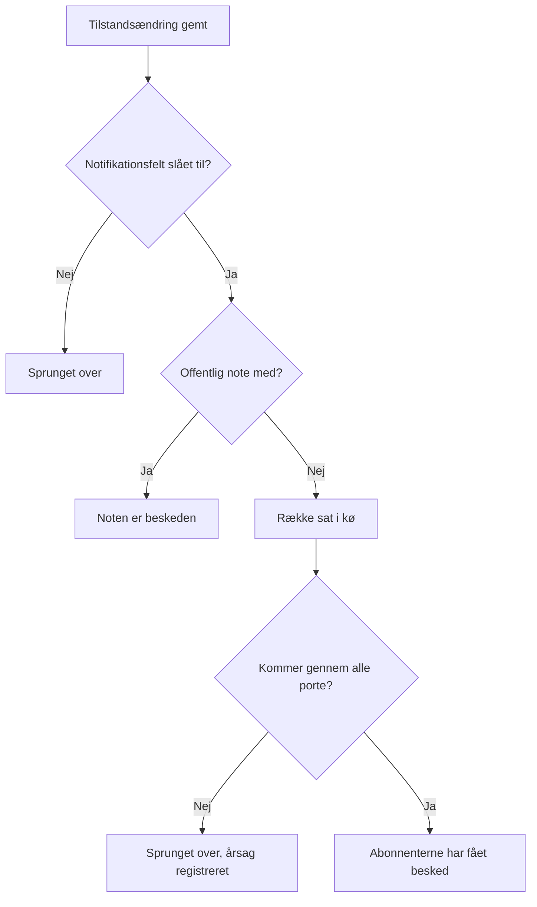

# Hændelsestilstande og alvorsgrader

Hver hændelse har to klassificeringer: en **tilstand**, der siger, hvor den er i din indsats, og en **alvorsgrad**, der siger, hvor ondt den gør. Denne side forklarer, hvad hver tilstand gør, hvordan du tilføjer dine egne, og hvordan alvorsgrader rangeres — for alle, der sætter hændelser op, eller som vil vide, hvorfor en hændelse tilkaldte eller ikke tilkaldte, blev løst eller ej, eller blev vist på en statusside eller ej.

:::cards
- [Tilføj dine egne tilstande](#tilføj-dine-egne-tilstande): Form din indsats, og se, hvad hver tilstand tæller som.
- [Hvad bekræftelse gør](#hvad-bekræftelse-gør): Tilkaldelsen stopper, og SLA'en markeres som besvaret.
- [Hvad løsning gør](#hvad-løsning-gør): Monitorerne gives fri, og SLA'en lukkes.
- [Giv abonnenterne besked](#giv-statussideabonnenter-besked-om-en-tilstandsændring): De porte, en tilstandsændring passerer, før en statusside hører om den.
:::

## Sådan fungerer det

I dashboardet ligner tilstande og alvorsgrader hinanden — begge vises som farvede mærker i listen over hændelser og som en farvet prik foran navnet, overalt hvor du vælger en, og begge er lister i projektet, som du kan omdøbe og give nye farver. De udfører vidt forskellige opgaver.

Tilstande styrer adfærd. Tre booleske flag på tilstandenes rækker afgør sammen med tilstandenes rækkefølge, hvilke hændelser der tæller som aktive, hvilke knapper der vises i hændelsens hoved, hvornår SLA-uret stopper, og hvornår hændelsen forsvinder fra din statusside. Alvorsgrader styrer intet i sig selv — de er etiketter, der beskriver påvirkningen, og som andre regler kan matche på.

```mermaid title="Hændelser går kun nedad i listen; hvor en tilstand står, afgør hvad den tæller som"
flowchart TB
    subgraph open["Tæller som ikke bekræftet"]
        identified["Identified"]
    end
    subgraph working["Tæller som bekræftet"]
        acknowledged["Bekræftet"]
        mitigated["Mitigated (egen)"]
    end
    subgraph done["Tæller som løst"]
        resolved["Løst"]
        closed["Closed (egen)"]
    end
    identified --> acknowledged
    acknowledged --> mitigated
    mitigated --> resolved
    resolved --> closed
    identified -. "spring over" .-> resolved
```

Modellen `IncidentState` har `name`, `description`, `color` og `order`, plus tre booleans: `isCreatedState`, `isAcknowledgedState` og `isResolvedState`. Alt, hvad produktet gør med tilstande, tager udgangspunkt i de booleans og i `order` — aldrig i tilstandens navn. Derfor kan du omdøbe **Løst** til "Closed", uden at noget går i stykker: flaget følger med rækken.

Modellen `IncidentSeverity` har `name`, `description`, `color` og `order` og intet andet. Der er ingen flag. Intet i OneUptime behandler af sig selv **Critical Incident** anderledes end **Minor Incident** — alvorsgraden betyder kun noget, hvor du peger noget på den, som matchkriteriet **Hændelse Alvorligheder** i en vagtregel.

Et par hurtige regler:

- **Vælg alvorsgraden for at kommunikere påvirkningen** — den vises i listen over hændelser og på hændelsens **Oversigt**, og den er et påkrævet felt, når du erklærer en hændelse.
- **Vælg tilstande for at forme din proces** — de trin i indsatsen, du faktisk går igennem, i den rækkefølge du går igennem dem.
- **Læg ikke hastegrad ind i tilstande** — en tilstand med navnet "Critical" tilkalder ingen. Det gør alvorsgraden sammen med en vagtregel.

> [!TIP]
> Begge lister oprettes, når dit projekt oprettes, og begge redigeres under **Hændelser → Indstillinger**. Det afsnit af Hændelsers sidemenu er foldet sammen som standard, så fold **Indstillinger** ud, før du leder efter dem.

## De forudoprettede tilstande

Tre tilstande oprettes med projektet, i denne rækkefølge. Oprettelsen er idempotent — en tilstand tilføjes kun, når der ikke allerede findes en med det navn.

| Tilstand         | `order` | Flag                  | Farve     | Hvad den betyder                                   |
| ---------------- | ------- | --------------------- | --------- | -------------------------------------------------- |
| **Identified**   | `1`     | `isCreatedState`      | `#fd625e` | Den tilstand, nye hændelser havner i.              |
| **Bekræftet**    | `2`     | `isAcknowledgedState` | `#ffbf53` | Nogen har taget hændelsen.                         |
| **Løst**         | `3`     | `isResolvedState`     | `#2ab57d` | Hændelsen er overstået og holder op med at tælle som aktiv. |

> [!NOTE]
> Den første tilstand hedder **Identified**, selv om flere beskrivelser i produktet stadig kalder den "created"-tilstanden. Når et dokument eller et værktøjstip siger "oprettelsestilstand", mener det den tilstand, der har `isCreatedState` — i et nyt projekt er det **Identified**.

## Hvad hvert tilstandsflag faktisk gør

| Flag                  | Formål                                                                                                                                                                                               |
| --------------------- | ---------------------------------------------------------------------------------------------------------------------------------------------------------------------------------------------------- |
| `isCreatedState`      | Den tilstand, en hændelse får, når ingen har valgt en. Har ingen tilstand i projektet dette flag, fejler oprettelsen af en hændelse med en fejl, der beder dig tilføje en oprettelsestilstand for hændelser fra indstillingerne. |
| `isAcknowledgedState` | Markerer projektets bekræftede tilstand: den, **Bekræft** flytter en hændelse til, og som nøgletalsfeltet for bekræftelse er opkaldt efter. En hændelse i den, i en senere tilstand, eller løst, er bekræftet — **Bekræft** tilbydes ikke længere for den, vagten holder op med at tilkalde for den, og dens SLA markeres som besvaret. |
| `isResolvedState`     | Markerer projektets løste tilstand: den, **Løs** flytter en hændelse til, og som nøgletalsfeltet for løsning viser. En hændelse i den, eller i en senere tilstand, er løst — den forsvinder fra **Aktive hændelser** og fra en statussides aktive del, og dens SLA markeres som løst. |

Der forventes kun én tilstand pr. projekt med hvert flag — opslagene henter den første i rækkefølgen. De tre tilstande med flag har mærket **Indbygget** på indstillingssiden; hold musen over det (eller gå til det med Tab) for at læse, hvad OneUptime gør med tilstanden. De kan omdøbes, få nye farver og trækkes, men:

- **De beholder deres rækkefølge.** Oprettelsestilstanden kommer før den bekræftede, og den bekræftede før den løste. Et træk, der ville bryde det — **Løst** over **Bekræftet** for eksempel — afvises, rækkerne går tilbage, og siden siger hvorfor.
- **De kan ikke slettes.** Deres **Slet** bliver i rækkens menu, låst, med årsagen. En massesletning springer dem over og nævner dem som ikke slettet. API'et nægter også at slette et projekts sidste oprettelses-, bekræftede eller løste tilstand.

Fordi brugerfladen læser tilstandsnavne dynamisk, ændrer en omdøbning det, du ser overalt — nøgletalsfelterne (**Acknowledged in** og **Resolved in** med de forudoprettede navne), bekræftelsen **Markér hændelse som …** for en egen tilstand og mærket i listen over hændelser følger alle det navn, du gav rækken.

## Tilføj dine egne tilstande

En tilstand, du tilføjer, er et trin i din indsats, som de tre forudoprettede ikke nævner: "Investigating", "Mitigated", "Monitoring", "Closed".

:::steps
### Åbn listen over tilstande

Gå til **Hændelser → Indstillinger → Hændelsesstatus**. Kortet **Hændelse Tilstande** viser dine tilstande i deres rækkefølge, én række hver: et greb at trække den i, dens farve og navn, hvad en hændelse i den **Tæller som**, og dens beskrivelse. Sætningen under titlen siger det ligeud: hændelser bevæger sig kun nedad i denne liste.

### Opret tilstanden

Klik på **Opret Hændelsesstatus** i kortets hoved, og udfyld formularen (felter nedenfor). Den nye tilstand tilføjes **lige over den løste tilstand** — hvor de fleste tilstande hører hjemme, og aldrig under den, hvor den i stilhed ville tælle som løst.

### Træk den på plads

Træk en række i dens greb for at flytte den. Den nye rækkefølge gemmes, når du slipper; der er intet rækkefølgenummer at skrive. Med tastaturet sætter du fokus på grebet, trykker på mellemrum, flytter med piletasterne og trykker på mellemrum igen. Kolonnen **Tæller som** opdateres, når du slipper rækken.
:::

**Rediger** åbner den samme formular som oprettelsen. Tilstandens ID står under **Vis ID** i rækkens menu.

| Felt            | Påkrævet | Hvad det gør                                                                                                                                                                                                                                                       |
| --------------- | -------- | ------------------------------------------------------------------------------------------------------------------------------------------------------------------------------------------------------------------------------------------------------------------ |
| **Navn**        | Ja       | Mindst to tegn. Pladsholderen foreslår noget i stil med "Investigating".                                                                                                                                                                                           |
| **Beskrivelse** | Nej      | Fri tekst, der forklarer, hvornår en hændelse står i denne tilstand.                                                                                                                                                                                               |
| **Farve**       | Ja       | Allerede valgt, når formularen åbner: en farve, som ingen af tilstandene i listen bruger endnu, så en ny tilstand aldrig får samme røde farve som den ovenover. Vælg en anden fra rækken af navngivne farver (Rød, Orange, Limegrøn, Grøn, Blågrøn, Blå, Indigo, Lilla, Magenta, Lyserød), eller brug **Brugerdefineret farve** til en præcis brandfarve som `#fd625e`. |

Farven farver tilstandens mærke og prikken foran dens navn i hver tilstandsvælger: erklærings- og skabelonformularerne, massehandlingen **Skift tilstand**, hovedets tilstandsmenu og betingelserne i regler og filtre. Hver af de vælgere viser tilstandene i den rækkefølge, denne side sætter dem i.

Du kan ikke sætte de tre flag fra denne formular — de hører til de forudoprettede rækker. En tilstand, du tilføjer, er derfor en tilstand uden flag, hvilket har tre konsekvenser, der er værd at planlægge efter:

- **Hvor den står, afgør hvad den tæller som.** Kolonnen **Tæller som** viser det og ændrer sig, mens du trækker: over den bekræftede tilstand er en hændelse i den **Ikke bekræftet**; fra den bekræftede tilstand og ned tæller den som **Bekræftet**, så vagtpolitikkerne holder op med at eskalere den; fra den løste tilstand og ned tæller den som **Løst**, så statussider holder op med at vise den som aktiv.
- **Over den løste tilstand holder den hændelsen aktiv.** **Aktive hændelser** rummer de hændelser, hvis aktuelle tilstand står over den løste tilstand, så en tilstand, du tilføjer dér, holder hændelsen i den aktive liste og i tælleren i sidebjælken. En tilstand, der er trukket under den løste tilstand, tæller som løst overalt — i de aktive lister, på statussider, i påmindelser og for SLA'en — og at flytte en hændelse ind i den fra **Løst** er ikke en anden løsning.
- **Du flytter en hændelse ind i den fra hovedets menu.** Hovedets knapper er kun **Bekræft** og **Løs**; en egen tilstand ligger under **Change state to** i menuen **⋯** ved siden af dem, som viser hver tilstand efter den aktuelle. Dens bekræftelse hedder **Markér hændelse som `<state name>`**, med en indsendelsesknap **Markér som `<state name>`**.

> [!TIP]
> En almindelig form er et afbødningstrin mellem den bekræftede og den løste tilstand — opret "Mitigated", og den lander lige over **Løst**, efter **Bekræftet**, og tæller som bekræftet. Til et triagetrin, før nogen har bekræftet hændelsen, trækker du den op over **Bekræftet**.

## Rækkefølgen er en reel begrænsning, ikke en visningspræference

Rækkefølgen håndhæves, når en tilstandsændring skrives, ikke kun når listen tegnes:

- **Overgange baglæns afvises.** At flytte en hændelse til en tilstand, der står tidligere i rækkefølgen end dens nuværende, fejler med en fejl, der nævner begge tilstande.
- **At vælge den aktuelle tilstand igen afvises.** At sætte en hændelse i den tilstand, den allerede er i, fejler med "Incident state cannot be same as previous state."
- **En tilbagedateret række kan ikke gentage sin nabo.** At indsætte en tidslinjerække, hvis tilstand er den samme som rækken efter den, afvises også.
- **Hovedets knapper følger de flagede tilstandes placering i rækkefølgen.** **Bekræft** og **Løs** tilbydes ud fra, hvor den aktuelle tilstand står i den sorterede liste. En egen tilstand, der er placeret *efter* den løste tilstand, viser aldrig en knap **Løs**, fordi en hændelse i den allerede tæller som løst.

Så når du tilføjer en tilstand, så placér den, hvor en hændelse faktisk ville passere den. At ordne den forkert ser ikke bare mærkeligt ud — det gør overgange umulige. At flytte en tilstand længere ned ændrer, hvad hændelserne i den allerede tæller som, i det øjeblik du slipper den.

Via API'et og Terraform er rækkefølgen kolonnen `order`: lavere tal kommer først. En tilstand, der oprettes uden, kommer lige over den løste tilstand; en, der oprettes eller opdateres med et tal, tager den plads, og tilstandene i vejen rykker én plads ned. Tal, som ingen anden har, beholdes, som de er skrevet, så en tilstand, der styres af Terraform, læser det tal tilbage, den fik.

## De forudoprettede alvorsgrader

Tre alvorsgrader oprettes med projektet, i denne rækkefølge, den mest alvorlige først:

| Alvorsgrad            | `order` | Farve     | Forudoprettet beskrivelse                                                                                                                                                                 |
| --------------------- | ------- | --------- | ----------------------------------------------------------------------------------------------------------------------------------------------------------------------------------------- |
| **Critical Incident** | `1`     | `#b70400` | Issues causing very high impact to customers. Immediate response is required. Examples include a full outage, or a data breach.                                                          |
| **Major Incident**    | `2`     | `#fd625e` | Issues causing significant impact. Immediate response is usually required. We might have some workarounds that mitigate the impact on customers. Examples include an important sub-system failing. |
| **Minor Incident**    | `3`     | `#ffbf53` | Issues with low impact, which can usually be handled within working hours. Most customers are unlikely to notice any problems. Examples include a slight drop in application performance. |

Alvorsgraden er påkrævet, når du erklærer en hændelse, og den er påkrævet i hver hændelsesspecifikation i en monitors kriterier, så hver hændelse — manuel eller automatisk — kommer med en. Se [Opret en hændelse](/docs/incidents/declaring-incidents) for erklæringsforløbet og [Hændelse- og advarselsskabeloner](/docs/monitor/incident-alert-templating) for vejen via monitorer.

## Rediger alvorsgrader

Gå til **Hændelser → Indstillinger → Hændelsesalvor**. Samme form som tilstandssiden — én række pr. alvorsgrad, den mest alvorlige først, træk en række for at ændre dens rang, **Opret Hændelsesalvor** tilføjer en til sidst (den mindst alvorlige), med **Navn**, **Beskrivelse** og **Farve** på formularen, farven allerede valgt som på tilstandsformularen.

Rangen betyder noget overalt, hvor OneUptime sammenligner alvorsgrader: en episode tager alvorsgraden fra sin mest alvorlige hændelse, og Critical og Warning i en anbefaling til en monitor svarer til din første og anden alvorsgrad.

To forskelle fra tilstande:

- **Der er ingen sletningsbeskyttelse.** Enhver alvorsgrad kan slettes, også de tre forudoprettede.
- **Der er ingen flag at arve og intet "Tæller som".** En ny alvorsgrad opfører sig præcis som de forudoprettede — den er en etiket med en farve og en rang.

Hvor alvorsgraden gør mere end at beskrive: under **Hændelser → Regler → Vagtregler** er en regels felt **Hændelse Alvorligheder** et matchkriterium. At angive **Critical Incident** dér er, hvordan "tilkald databaseteamet ved alt kritisk" udtrykkes — vagtpolitikken sidder på reglen, ikke på alvorsgraden.

**At ændre en hændelses alvorsgrad** — under **Rediger** på hændelsens kort **Hændelsesdetaljer**, via API'et eller Terraform (`incidentSeverityId`), med et workflow eller med AI-værktøjerne — gør de samme fire ting, uanset hvordan det sendes: hændelsens feed får en post **Incident updated**, der nævner den nye alvorsgrad, hændelsens SLA-frister beregnes igen, dens påmindelsesregel matches igen, og hændelsesmetrikkerne tæller én ændring af alvorsgrad. At gemme den alvorsgrad, hændelsen allerede har, gør ingen af dem, så redigerer du kun titlen på en hændelse, forbliver dens SLA-frister, påmindelser og antal ændringer af alvorsgrad, som de var. En advarsels alvorsgrad virker på samme måde for dens feedpost og dens påmindelser.

## Flyt en hændelse gennem dens tilstande

Der er fire måder, en hændelse skifter tilstand på:

| Måde                | Hvor                                                                                        | Hvad den spørger om                                                                                                                                                                                          |
| ------------------- | ------------------------------------------------------------------------------------------- | ------------------------------------------------------------------------------------------------------------------------------------------------------------------------------------------------------------ |
| **Knapper i hovedet** | Hændelsens hoved: **Bekræft** og **Løs**, og **Change state to** i dens menu **⋯**         | En kort bekræftelse — **Bekræft hændelse** eller **Løs hændelse** — med **Underret statussideabonnenter** og, foldet sammen under **Tilføj en offentlig note**, den valgfri **Offentlig note** med vælgeren **Vælg noteskabelon** (når projektet har noteskabeloner). |
| **Tilstandstidslinje** | **Tilstandstidslinje** i hændelsens sidemenu                                             | En række, der tilføjes i hånden, med **Hændelsesstatus**, **Begynder den** og **Underret statussideabonnenter**.                                                                                            |
| **Masseændring**    | **Skift tilstand** på et udvalg i listen over hændelser                                     | Én side med tilstanden, **Underret statussideabonnenter** og den samme sammenfoldede **Tilføj en offentlig note**.                                                                                           |
| **Automatisk**      | Et monitorkriterium eller din egen kode                                                     | Et kriterium med **Løs hændelse automatisk** slået til løser sin hændelse, når kriteriet ikke længere er opfyldt. API'et ændrer tilstanden ved at oprette en række på `/api/incident-state-timeline`.         |

Står den aktuelle tilstand før den bekræftede tilstand, tilbyder hovedet **Bekræft** og **Løs**; står den mellem de to, kun **Løs**. Bekræftelse stopper også enhver eskalering fra vagten for hændelsen.

Hver af dem skriver en tidslinjerække. En tilstandsændring gør også nogle ting, du ikke behøver bede om: den skriver en post i hændelsens feed, tildeler en Hændelsesleder, hvis hændelsen ikke har en endnu, og opdaterer SLA-uret. At genåbne en løst hændelse starter en ny SLA-post fra tidspunktet for genåbningen.

## Hvad bekræftelse gør

En hændelse er bekræftet fra det øjeblik, den går ind i din bekræftede tilstand, i en senere tilstand — en tilstand **Mitigated** eller **Investigating**, du har placeret under **Bekræftet** — eller i en løst tilstand, uanset hvilken af de fire måder ovenfor der flytter den. Kolonnen **Tæller som** på indstillingssiden for tilstande viser, hvilke tilstande det er. Når den er bekræftet:

- **Bekræft tilbydes ikke længere.** Ikke i hændelsens hoved, ikke i mobilappen (dens knap og dens swipe), ikke i Slack eller Microsoft Teams og ikke via OneUptime MCP-serverens `acknowledge_incident`. At bekræfte den alligevel — fra en tilkaldelsesside, Slack eller Teams — afvises med "Incident is already acknowledged." (eller "Incident is already resolved."), i stedet for at flytte den op i listen igen.
- **Vagten holder op med at tilkalde for den.** En vagthavende, der bekræfter sin tilkaldelse, efter at en kollega har bekræftet hændelsen eller flyttet den videre, får sin tilkaldelse bekræftet, og hændelsen bliver, hvor den er.
- **SLA'en markeres som besvaret** ved den første sådanne flytning; at gå videre gennem senere tilstande beholder det tidspunkt.
- **Tiden til bekræftelse løber til den første flytning** — nøgletalsfeltet på hændelsens **Oversigt**, metrikken **Time to Acknowledge**, en måling, der slutter, når **Hændelsen bliver bekræftet**, og MTTA i opsummeringerne i Slack og Microsoft Teams. En hændelse, der gik direkte fra **Identified** til **Investigating**, blev bekræftet da; en, der blev løst med det samme, blev bekræftet, da den blev løst.
- **Et filter Bekræftet** — på et dashboards widget med en hændelsesliste for eksempel — viser hændelserne i din bekræftede tilstand og i enhver senere tilstand, op til løst.

Advarsler og episoder følger samme regel med dine advarselstilstande.

## Hvad løsning gør

En hændelse er løst, når den går fra en tilstand over din løste tilstand ind i den løste tilstand, eller ind i en senere tilstand — uanset hvilken af de fire måder ovenfor der flytter den. Hver løsning:

- **Giver de monitorer fri, hændelsen holder.** En hændelse, der erklæres åben, holder sine monitorer: den satte dem i sin status fra **Skift overvågningsstatus til**, når den nævner en, og satte, når den blev erklæret i hånden, deres overvågning på pause. En redigering, mens den er åben — at tilføje monitorer eller ændre den status — får den også til at holde dem. Løsningen genoptager deres overvågning og sætter dem tilbage til driftsklar, medmindre en anden åben hændelse stadig ligger på dem, og fra da af holder hændelsen intet. Så en hændelse, der erklæres allerede løst, giver intet fri, og det gør en anden løsning efter en genåbning heller ikke: en status, dens monitorer fik i mellemtiden — fra deres prober, fra vedligeholdelse eller sat i hånden — bliver stående.
- **Markerer SLA'en som løst** og skriver, når OneUptime AI's postmortem-udkast er slået til, et udkast til en postmortem.

At gå videre fra **Løst** til en senere tilstand — **Closed** for eksempel — er ikke en anden løsning: intet af dette kører igen, og ingen ny SLA starter. En hændelse, der blev erklæret, før OneUptime begyndte at registrere dette, giver sine monitorer fri ved sin næste løsning, som før.

## Tilstandstidslinjen

Hændelsens side **Tilstandstidslinje** i hændelsens sidemenu er revisionssporet for hver tilstand, hændelsen har været i. Kortet på den side hedder **Statustidslinje**, og det er sorteret med de nyeste først.

| Kolonne                            | Hvad den viser                                                                                                                                                                                                                                                 |
| ---------------------------------- | -------------------------------------------------------------------------------------------------------------------------------------------------------------------------------------------------------------------------------------------------------------- |
| **Hændelsesstatus**                | Et farvet mærke med tilstandens navn og farve.                                                                                                                                                                                                                 |
| **Begynder den**                   | Hvornår hændelsen gik ind i denne tilstand.                                                                                                                                                                                                                    |
| **Slutter den**                    | Hvornår den forlod den. Den aktuelle tilstand viser `Currently Active`.                                                                                                                                                                                        |
| **Varighed**                       | Tiden i tilstanden, for den aktuelle talt indtil nu.                                                                                                                                                                                                           |
| **Abonnentnotifikationsstatus**    | Om statussidens notifikation for denne ændring blev sendt, sprunget over eller stadig afventer, med et link **flere detaljer**, og — når afsendelsen fejlede — en handling **Prøv igen**. **Prøv igen** sender tilstandsændringen igen til hver statusside, hændelsen når nu, også til de abonnenter, der allerede har fået den. |

Hver række har to handlinger:

- **Vis årsag** — åbner en dialog **Grundårsag**, der viser den Markdown, der blev registreret med tilstandsændringen.
- **Vis logge** — åbner en dialog, der forklarer, hvorfor statussen ændrede sig, med en visning **Hændelsestilstandslog**.

I dashboardet kan tidslinjerækker tilføjes og slettes, men ikke redigeres; en hændelse beholder altid mindst én række. Via API'et kan en rækkes `startsAt` rettes, og hver måling, der beregnes ud fra tidslinjen, følger med.

> [!WARNING]
> At slette den forkerte række omskriver hændelsens historik, så brug det som et værktøj til rettelser og ikke som en vane til oprydning.

## Listen Aktive hændelser

**Hændelser → Aktive hændelser** er den liste, du holder øje med under en vagt. Dens definition er præcis én betingelse: hændelsens aktuelle tilstand står over din løste tilstand — den første tilstand i rækkefølgen med flaget `isResolvedState`. Intet andet tages i betragtning — ikke alvorsgraden, ikke alderen, ikke om nogen har bekræftet den.

Punktet i sidemenuen har et rødt mærke med en tæller, der bruger den samme forespørgsel, så mærket og listen er altid enige. Er der intet at se, siger siden det.

Den praktiske konsekvens: en egen tilstand, du tilføjer over den løste tilstand, holder hændelser i denne liste — "Mitigated" er ikke "færdig" — og en, du placerer efter den, tager dem ud, ligesom den løste tilstand gør. Advarsler og episoder følger samme regel med deres egne tilstande, og tællerne i sidemenuen, påmindelserne, statussiderne og mobilappen læser den alle.

## Giv statussideabonnenter besked om en tilstandsændring

En tilstandsændring kan give dine statussideabonnenter besked, men den går gennem flere porte. At forstå dem sparer en masse fejlfinding af typen "hvorfor fik ingen besked".



Notifikation bestilles pr. tidslinjerække med **Underret statussideabonnenter** (`shouldStatusPageSubscribersBeNotified`), afkrydsningsfeltet i dialogen til tilstandsændringer og på den manuelle tidslinjeformular. I dialogen til tilstandsændringer starter det slået fra, når hændelsen blev erklæret uden at give abonnenterne besked. Det samme afkrydsningsfelt afgør også, om dialogens offentlige note giver nogen besked. Når det er slået fra, gemmes rækken med status sprunget over og en forklaring. Når det er slået til, sættes rækken i kø, og et baggrundsjob tager den op — jobbet kører hvert minut, så leveringen er hurtig, men ikke øjeblikkelig.

**Rækken i køen springes derefter over, når en af disse gælder:**

- **Den nye tilstand er oprettelsestilstanden.** Abonnenterne fik allerede besked, da hændelsen blev erklæret, så den første tidslinjerække sender bevidst ikke en besked mere.
- **Hændelsen har ingen monitorer knyttet til sig.** Uden ressourcer er der ingen statusside at knytte hændelsen til.
- **Hændelsen er ikke synlig på statussiden** (`isVisibleOnStatusPage` er slået fra).
- **Statussiden har slået hændelser fra** (`showIncidentsOnStatusPage` er slået fra). Det gælder pr. statusside — andre sider, der viser den samme monitor, får stadig besked.
- **Statussiden ligger uden for hændelsens omfang.** En hændelse, der med **Begræns til disse statussider** er begrænset til nogle statussider, giver kun de sider besked blandt dem, der viser dens monitorer, og en side med **Vis kun hændelser, der er begrænset til denne side** slået til får aldrig besked om en hændelse, der ikke er begrænset til den. Det gælder også pr. statusside. Se [Én statusside pr. målgruppe](/docs/status-pages/one-status-page-per-audience).

**Én ting mere, der ændrer udfaldet.** Skriver du en **Offentlig note** i dialogen til tilstandsændringer (under **Tilføj en offentlig note**) eller i massehandlingen **Skift tilstand**, mens **Underret statussideabonnenter** er slået til, markeres tidslinjerækken som allerede underrettet i stedet for at blive sat i kø, og dens statusbesked siger, at noten bar den. Det er selve noten, der når abonnenterne, så de får én besked i stedet for to. En note med ikke andet end mellemrum slås ikke op, og rækken sættes i kø som sædvanlig. Tilstandsændringer for planlagt vedligeholdelse virker på samme måde. Hændelsestypen bag den almindelige besked om en tilstandsændring er `Subscriber Incident State Changed`.

**Noten siger, hvad hændelsen er nu.** Fordi noten er den ene besked, nævner den den nye tilstand på hver kanal, som beskeden om tilstandsændringen ville have gjort: e-mailens emne lyder `[Resolved Incident] <title>`, og dens detaljer viser en række **Status** i tilstandens farve, SMS'en siger `Incident <title> on <status page> is Resolved.`, beskeder i Slack og Microsoft Teams har en linje `**Status:** Resolved`, og webhookens payload `IncidentNoteCreated` har `incidentState` i `data`. En note, der slås op for sig selv, beholder sin sædvanlige besked, og det gør en redigerings opdateringsnotifikation også.

**At slå noten op kræver sin egen tilladelse.** At ændre tilstanden og at slå en offentlig note op er separate tilladelser (**Create Incident State Timeline** og **Create Incident Status Page Note** i en brugerdefineret rolle; de indbyggede hændelses- og projektroller har begge). At ændre tilstanden kræver ingen tilladelse til at redigere hændelsen: se [Ændring af en tilstand](/docs/permissions/index#ændring-af-en-tilstand). En, der må ændre en hændelses tilstand, men ikke slå offentlige noter op, får ikke tilbudt **Tilføj en offentlig note** i dialogen eller i massehandlingen **Skift tilstand**. En tilstandsændring, vedkommende sender med en note via API'et, afvises i sin helhed med en besked, der siger, at tilstanden ikke blev ændret, og hvorfor, så en ændring aldrig registreres som meddelt af en note, der aldrig blev slået op. Udelad noten, og ændringen går igennem. Advarsler, advarselsepisoder og hændelsesepisoder tilbyder i stedet en privat note med en tilstandsændring (**Tilføj en privat note**), og den virker på samme måde: at slå den op kræver notens egen tilladelse (**Create Alert Internal Note**, **Create Alert Episode Internal Note** eller **Create Incident Episode Internal Note** i en brugerdefineret rolle; de indbyggede advarsels-, hændelses- og projektroller har dem), og en tilstandsændring, der sendes med en privat note af en uden den tilladelse, afvises i sin helhed, så tilstanden ikke ændres.

**Sendt betyder, at hver abonnent fik den sendt.** Jobbet venter på hver besked og tæller den som sendt eller fejlet, pr. statusside og kanal, og rækkens statusbesked nævner de tal. Én fejlet besked, eller en afsendelse, der løb tør for tid eller blev afbrudt, gør rækken til **Mislykkedes**. Se [Abonnenter og meddelelser](/docs/status-pages/subscribers).

For hvem der modtager dem, og hvordan skabelonerne vælges, se [Abonnenter og meddelelser](/docs/status-pages/subscribers).

## Hold en hændelse væk fra statussiden

Fire separate ting afgør, om en hændelse overhovedet står på en offentlig side, og alle fire skal være sande:

- **Vis hændelser** (`showIncidentsOnStatusPage`) på selve statussiden.
- **Synlig på statussiden** (`isVisibleOnStatusPage`) på hændelsen — en kontakt på hændelsens side **Indstillinger**. Den er sand som standard og er ikke med i guiden til at erklære; et monitorkriterium kan sætte den med **Vis hændelse på statusside**. En hændelse, der erklæres skjult, giver ingen abonnent besked, når den oprettes; slår du kontakten til senere, tilbyder redigeringsformularen **Underret abonnenter om, at denne hændelse er oprettet**. Se [Opret en hændelse](/docs/incidents/declaring-incidents).
- **Siden er inden for hændelsens rækkevidde.** Siden viser en af hændelsens monitorer og er, hvis hændelsen er begrænset til nogle statussider, en af dem. En side med **Vis kun hændelser, der er begrænset til denne side** slået til viser kun de hændelser, der er begrænset til den. Se [Én statusside pr. målgruppe](/docs/status-pages/one-status-page-per-audience).
- **Den aktuelle tilstand står over den løste tilstand.** Det er det, der fjerner en hændelse fra den aktive del: statussidens forespørgsel henter hændelser, hvis aktuelle tilstand står over din løste tilstand, så den løste tilstand og enhver senere tilstand tager hændelsen af. Du arkiverer eller lukker ikke noget — du løser den, og den går over i historikken.

**Private hændelser vises aldrig.** At slå **Privat hændelse** til skjuler hændelsen for alle statussider, uanset kontakterne ovenfor, og begrænser den til dens ejere plus projektadministratorer og projektejere. Intet om den når heller en statussideabonnent: ikke dens oprettelse, ikke dens tilstandsændringer, ikke dens offentlige noter og ikke dens postmortem. Billederne i dens beskrivelse, postmortem, brugerdefinerede felter og offentlige noter kan ikke ses af alle, mens den er privat.

De to kontakter holdes i takt, så hændelsens side **Indstillinger** altid viser, hvad statussiderne gør:

- At gøre en hændelse privat slår **Synlig på statussiden** fra samtidig.
- At slå **Synlig på statussiden** til, mens hændelsen forbliver privat, lader den stå slået fra. For at offentliggøre en privat hændelse slår du **Privat hændelse** fra og **Synlig på statussiden** til — i én gemning eller den ene efter den anden.

Det gælder, uanset hvordan hændelsen skrives: dashboardet, API'et, Terraform, et workflow, en monitor, en hændelsesskabelon eller en privatlivsregel. En værdi, der sendes som tekst, som `"true"`, tæller som `true`. Én skrivning til mange hændelser, der slår **Synlig på statussiden** til — et workflows **Update Many** for eksempel — viser dem, der ikke er private, og lader hver privat forblive skjult. Hver hændelse afgøres, som den er, når skrivningen når den, så en ændring af dens privatliv, der lander i samme øjeblik, aldrig overhales: en hændelse gemmes aldrig som både privat og synlig. En hændelse, der oprettes privat, oprettes skjult og giver ingen abonnent besked om, at den er oprettet.

**Episoder følger samme regel.** En privat hændelsesepisode er skjult for alle statussider, uanset hvad dens kontakt **Synlig på statussiden** siger, og dens abonnenter hører intet om den. På episodens side **Indstillinger** siger kontakten det og forbliver slået fra, mens episoden er privat. En privat hændelse bringer aldrig sin episode på en statusside: en episode når kun en side gennem hændelser, der ikke er private.

:::details Opgradering fra en version uden disse regler
Hændelser og episoder, der er gemt som private med **Synlig på statussiden** stadig slået til fra før disse regler, får den slået fra, når du opgraderer. Intet sendes til nogen. De billeder, sådan en hændelse eller episode havde gjort synlige for alle, gøres private igen, medmindre noget, dine statussider viser, stadig har dem i sig. Det samme gælder billederne i offentlige noter på hændelser, episoder og planlagte vedligeholdelseshændelser, som dine statussider ikke viser, og som før forblev synlige for alle.
:::

Hvor meget løst historik siden beholder, er en indstilling på statussiden, ikke på hændelsen. Se [Statusside – ressourcer og grupper](/docs/status-pages/resources-and-groups) for, hvordan monitorer på siden afgør, hvilke hændelser der overhovedet vises.

## Næste skridt

:::cards
- [Opret en hændelse](/docs/incidents/declaring-incidents): Vælg en starttilstand og en alvorsgrad, når du erklærer.
- [Hændelsesnoter, ejere og feed](/docs/incidents/notes-owners-and-feed): Slå den offentlige note op, der følger med en tilstandsændring.
- [Hændelsesindstillinger og automatisering](/docs/incidents/settings): Mål tiden mellem tilstande, og match alvorsgrader i regler.
- [Abonnenter og meddelelser](/docs/status-pages/subscribers): Hvem der får de beskeder, en tilstandsændring sender.
:::
