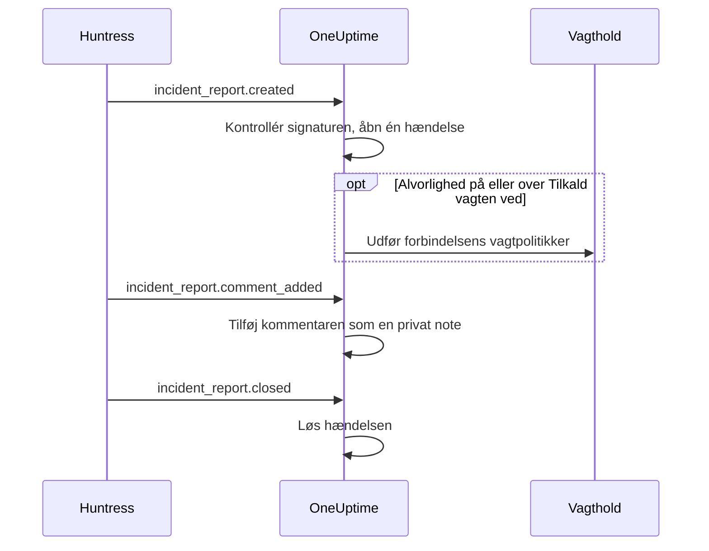

# Huntress-integration

Tilkald dit vagthold ved Huntress-hændelsesrapporter. Når Huntress' SOC sender en hændelsesrapport om et endpoint eller en identitet, åbner OneUptime én hændelse for den, med den alvorlighed, du vælger, tilkalder de vagtpolitikker, du vælger, og løser hændelsen, når rapporten lukkes i Huntress.

Denne integration er **indgående**: Huntress sender hver begivenhed om en hændelsesrapport til en webhook-URL, som du får af OneUptime, signeret med endpointets signeringshemmelighed. OneUptime kalder aldrig Huntress og har derfor ikke brug for en Huntress-API-nøgle.

:::cards
- [Sådan virker det](#sådan-virker-det): Hvad OneUptime gør med hver begivenhed om en rapport.
- [Opsætning](#opsæt-integrationen): Forbind i OneUptime, tilføj endpointet i Huntress, gem dets signeringshemmelighed, send en test.
- [Indstillinger](#indstillinger): Tilkald, alvorligheder, organisationer, etiketter og løsning.
- [Fejlfinding](#fejlfinding): Hvad forbindelsens fejl betyder, og hvad der skal ændres.
:::

## Sådan virker det

Huntress sender en begivenhed om en hændelsesrapport, når rapporten sendes, når nogen kommenterer den, og når den lukkes. Hver begivenhed indeholder hele rapporten.

1. **Kontrollér.** En anmodning skal være signeret med endpointets signeringshemmelighed, højst fem minutter før den ankommer. Alt andet afvises, og forbindelsens side fortæller hvorfor.
2. **Åbn én hændelse.** Den første begivenhed om en rapport åbner en hændelse, der er opkaldt efter rapporten, f.eks. `Huntress: Incident on DESKTOP-01 (Acme Corp)`. Dens beskrivelse indeholder rapportens resumé, dens alvorlighed i Huntress, organisationen, den berørte vært eller identitet, de indikatorer, Huntress fandt, og et link til rapporten i Huntress. Senere begivenheder om samme rapport, og leveringer som Huntress sender igen, finder den hændelse: En rapport åbner aldrig to.
3. **Tilkald.** Hændelsen åbnes med den hændelsesalvorlighed, som forbindelsen giver rapportens Huntress-alvorlighed. Når den alvorlighed er på eller over **Tilkald vagten ved**, udføres forbindelsens **Vagtpolitikker**.
4. **Følg rapporten.** En kommentar tilføjet i Huntress bliver til en privat note på hændelsen. Når rapporten lukkes eller afvises, løses hændelsen.

Hændelser, der åbnes på denne måde, vises aldrig på en statusside. Dine hændelsesregler (vagt-, ejer-, etiket- og privatlivsregler) gælder for dem som for enhver anden hændelse.

## Før du begynder

- I OneUptime rollen **Project Owner** eller **Project Admin**. Medlemmer, læsere og hændelsesrollerne kan se forbindelsen og de modtagne rapporter, men ikke ændre den.
- I Huntress rollen **Account Admin**: Kun kontoadministratorer kan tilføje webhooks.
- En vagtpolitik at tilkalde. Uden den åbner rapporter hændelser og tilkalder ingen, medmindre en vagtregel for hændelser matcher dem.
- På en selvhostet installation en OneUptime, som Huntress kan nå fra internettet over HTTPS: Huntress sender kun webhooks til `https://`-URL'er.

## Opsæt integrationen

:::steps
### Forbind Huntress i OneUptime

Åbn **Hændelser → Integrationer → Huntress** (`/dashboard/{projectId}/incidents/integrations/huntress`). Sektionen **Integrationer** i hændelsernes sidemenu er som standard foldet sammen, så fold den ud først. Klik på **Forbind Huntress**.

Vælg de **Vagtpolitikker**, der skal tilkaldes. **Tilkald vagten ved** spørger derefter, hvilke rapporter der tilkalder dem, og starter på **Høje og kritiske rapporter**. Alt andet venter under **Flere felter** med en standardværdi (se [Indstillinger](#indstillinger)). Klik på **Forbind Huntress**. Forbindelsens side åbnes, med et kort **Forbind Huntress**, der fører dig gennem de næste tre trin.

### Tilføj et webhook-endpoint i Huntress

Klik på **Kopiér webhook-URL** på forbindelsens side. URL'en ser ud som `https://oneuptime.com/api/huntress/webhook/<connection-id>`; på en selvhostet installation begynder den med din egen vært.

Åbn menuen øverst til højre i Huntress, og vælg **Integrations**. Klik på **Add an Integration**, vælg **Webhooks**, og klik på **Add Endpoint**. Indsæt URL'en, slå **Incident Reports** til, og gem. Lad **Escalations**, **Platform Actions** og **Account Notices** være slået fra: OneUptime tager imod de begivenheder og gør intet med dem.

### Gem endpointets signeringshemmelighed

Åbn endpointets menu (⋯) i Huntress, og vælg **View Signing Secret**. Kopiér hele den: Den starter med `whsec_`. Klik på **Gem signeringshemmelighed** på forbindelsens side, indsæt den, og klik på **Gem signeringshemmelighed**. Hemmeligheden krypteres og vises aldrig igen.

Indtil hemmeligheden er gemt, afviser OneUptime enhver anmodning til URL'en. Huntress sender en afvist begivenhed igen senere, så en begivenhed, der afvises nu, når alligevel frem.

### Send en test

Åbn endpointets menu (⋯) i Huntress, og vælg **Send Test**. Inden for få sekunder bliver kortet på forbindelsens side til **Forbindelse**, med tilstanden **Modtager rapporter**.

> [!NOTE]
> Uanset hvad testen indeholder, viser forbindelsen, at den er ankommet. En test med en hændelsesrapport åbner en hændelse som enhver anden rapport og tilkalder vagten, hvis den er alvorlig nok.
:::

## Indstillinger

**Forbind Huntress** spørger kun, hvem der tilkaldes, og ved hvilke rapporter. Alt andet venter under **Flere felter**, med en standardværdi, der passer til de fleste teams. Klik på **Rediger indstillinger** på forbindelsens kort **Indstillinger** for at ændre en indstilling senere.

| Indstilling | Hvad den gør | Standard |
| --- | --- | --- |
| **Vagtpolitikker** | De politikker, der udføres, når en rapport er alvorlig nok. Lad feltet stå tomt for at åbne hændelser uden at tilkalde nogen. | Ingen |
| **Tilkald vagten ved** | Hvilke rapporter der tilkalder politikkerne: **Kun kritiske rapporter**, **Høje og kritiske rapporter** eller **Alle rapporter**. Hver rapport åbner en hændelse under alle omstændigheder. | **Høje og kritiske rapporter** |
| **Navn** | Hvad forbindelsen hedder i OneUptime. | `Huntress` |
| **Alvorlighed for kritiske rapporter**, **Alvorlighed for høje rapporter**, **Alvorlighed for lave rapporter** | Den hændelsesalvorlighed, som hver Huntress-alvorlighed åbner med. | Dine tre højeste hændelsesalvorligheder, i rækkefølge |
| **Kun disse organisationer** | De Huntress-organisationer, hvis rapporter åbner hændelser, ét organisationsnavn eller -id pr. linje. Navne skelner ikke mellem store og små bogstaver. | Tom: alle organisationer |
| **Etiketter** | Etiketter, der tilføjes hver hændelse, foruden den, der er opkaldt efter rapportens organisation. | Ingen |
| **Løs, når Huntress lukker rapporten** | Løs hændelsen, når dens rapport lukkes eller afvises i Huntress. Når det er slået fra, oplyser en privat note på hændelsen det i stedet. | Til |

### Alvorligheder

Huntress giver hver hændelsesrapport én af tre alvorligheder. Medmindre du vælger en hændelsesalvorlighed for en af dem, åbner rapporten efter rækkefølgen af dine hændelsesalvorligheder, som **Hændelser → Indstillinger → Hændelsesalvor** viser dem:

| Alvorlighed i Huntress | Hvad Huntress mener med den | Hændelsesalvorlighed |
| --- | --- | --- |
| Critical | Angribere ved tastaturet, farlig malware eller aktiv kompromittering, der skal inddæmmes med det samme. | Den højeste |
| High | Bekræftet malware, der kræver hurtig afhjælpning, eller kompromittering af en identitet, der skal handles på. | Den anden |
| Low | Potentielt uønskede programmer, rester af malware og ældre fund om identiteter. | Den tredje |

Et projekt med færre alvorligheder bruger sin laveste til resten. En rapport uden alvorlighed behandles som høj. Hvis en alvorlighed, du har valgt, slettes, afgør rækkefølgen igen.

### Organisationer

Hver hændelse får en etiket, der er opkaldt efter rapportens Huntress-organisation, f.eks. _Acme Corp_. Én forbindelse modtager rapporterne fra alle organisationer i din Huntress-konto, og **Kun disse organisationer** indsnævrer det.

> [!TIP]
> For at tilkalde hver kundes eget team skal du lade forbindelsens **Vagtpolitikker** stå tomme og tilføje en vagtregel for hændelser pr. organisation, f.eks. »Hvis **Hændelsesetiketter** har en af _Acme Corp_«, der udfører kundens politik. Se [Vagtregler for hændelser](/docs/incidents/settings#vagtregler-for-hændelser).

## Rapporter på forbindelsens side

Forbindelsens liste **Hændelsesrapporter** viser hver rapport, Huntress har sendt, den nyeste først: den berørte vært eller identitet, dens alvorlighed og status i Huntress og dens **Resultat**.

| Resultat | Hvad der skete |
| --- | --- |
| **Hændelse åbnet** | Rapporten åbnede en hændelse. **Se hændelse** åbner den; **Vagten tilkaldt** siger, at forbindelsen tilkaldte sine politikker. |
| **Hændelse løst** | Huntress lukkede rapporten, og dens hændelse blev løst. |
| **Sprunget over: organisationen overvåges ikke** | Rapportens organisation står ikke i **Kun disse organisationer**. |
| **Sprunget over: allerede lukket i Huntress** | Rapporten var allerede lukket, første gang OneUptime hørte om den. |

En rapport, der er sprunget over, forbliver sprunget over, når du ændrer indstillingerne senere. Når **Løs, når Huntress lukker rapporten** er slået fra, beholder en lukket rapport resultatet **Hændelse åbnet**.

## Sikkerhed

- **Kun signerede anmodninger.** OneUptime kontrollerer de headere `svix-id`, `svix-timestamp` og `svix-signature`, som Huntress sender, mod anmodningens brødtekst, præcis som den ankom. En anmodning, der ikke er signeret med den gemte hemmelighed eller blev signeret mere end fem minutter før eller efter, afvises.
- **Hemmeligheden forbliver hemmelig.** Den gemmes krypteret, returneres aldrig af API'et og vises aldrig igen. **Erstat signeringshemmelighed** på forbindelsens side gemmer en anden, f.eks. hemmeligheden for et nyt endpoint.
- **URL'en er en adresse, ikke en adgangskode.** Den navngiver forbindelsen; kun en anmodning signeret med endpointets hemmelighed behandles.
- **Ét endpoint pr. forbindelse.** Hver forbindelse har sin egen URL og hemmelighed. Forbind igen for at modtage rapporterne fra en anden Huntress-konto.

## Brug e-mail i stedet

Huntress sender også hændelsesrapporter med e-mail, og en [monitor for indgående e-mail](/docs/monitor/incoming-email-monitor) kan åbne hændelser ud fra de e-mails, f.eks. når emnet indeholder `Critical Incident Report`. Den behandler dog e-mailsene som én monitors status: Mens dens hændelse er åben, åbner den næste rapport ingen, og hændelsen løses af monitorens kriterier i stedet for, når Huntress lukker rapporten. Huntress-forbindelsen åbner én hændelse pr. rapport og løser hver enkelt med dens rapport, så foretræk den. Så snart forbindelsen modtager rapporter, skal du holde op med at sende e-mailsene til monitoren, ellers tilkalder hver rapport to gange.

## Fejlfinding

Når OneUptime afviser en anmodning, viser forbindelsens side årsagen under **Den seneste anmodning blev afvist**. I Huntress viser **View Delivery Attempts** i endpointets menu (⋯) hver levering med OneUptimes svar.

:::details "A request arrived but was refused, because no signing secret is saved for this connection yet"
Gem endpointets signeringshemmelighed: se [Opsæt integrationen](#opsæt-integrationen). Huntress sender den afviste anmodning igen.
:::

:::details "The request's signature does not match the signing secret"
Den gemte hemmelighed hører ikke til dette endpoint. Hvert endpoint har sin egen: Åbn endpointets menu (⋯) i Huntress, vælg **View Signing Secret**, kopiér hele den, og gem den med **Erstat signeringshemmelighed**.
:::

:::details "The request was signed more than five minutes from now"
Urene hos Huntress og på din OneUptime-server er mere end fem minutter fra hinanden, eller anmodningen er en gentagelse. På en selvhostet installation skal du kontrollere, at serverens ur går rigtigt.
:::

:::details "No Huntress connection has this address."
Forbindelsen er slettet, eller endpointets URL i Huntress er ikke forbindelsens. Klik på **Kopiér webhook-URL** på forbindelsens side, og indsæt URL'en i endpointet i Huntress igen.
:::

:::details "This project has no incident severities, so a Huntress report cannot open an incident"
Tilføj en under **Hændelser → Indstillinger → Hændelsesalvor**. Huntress sender rapporten igen.
:::

:::details Ingen blev tilkaldt
En rapport under **Tilkald vagten ved** åbner en hændelse uden at tilkalde nogen. I listen **Hændelsesrapporter** siger **Vagten tilkaldt** under en rapports resultat, at forbindelsen tilkaldte. Hændelsens side **Vagtudførelser** viser, hvad hver politik gjorde.
:::

## Næste trin

:::cards
- [Vagtregler for hændelser](/docs/incidents/settings#vagtregler-for-hændelser): Tilkald hver organisations eget team via dens etiket.
- [Hændelsestilstande og alvorsgrader](/docs/incidents/states-and-severities): Ordn de alvorligheder, som Huntress-rapporter åbner med.
- [Eskaleringsregler](/docs/on-call/escalation-rules): Bestem, hvem der tilkaldes, og hvornår tilkaldet går videre.
- [Oversigt over integrationer](/docs/integrations/index): De andre værktøjer, du kan forbinde.
:::
