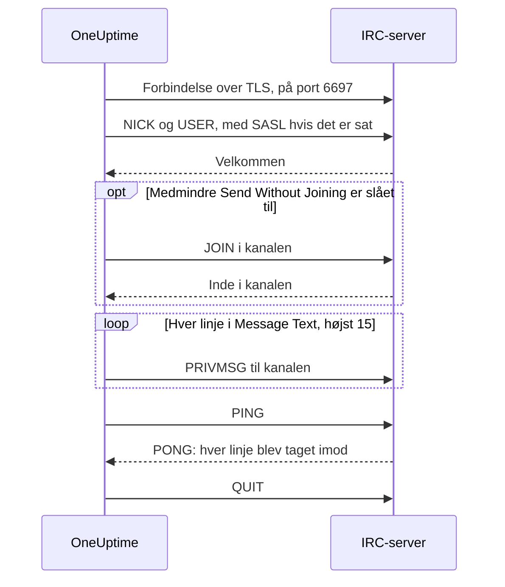

# IRC-integration

Post hændelsesopdateringer i en kanal på et hvilket som helst IRC-netværk: Libera.Chat, OFTC eller din egen server.

IRC har ingen webhooks, så OneUptimes workflowtrin **Send Message to IRC** forbinder selv til serveren, ligesom enhver IRC-klient. Der er intet at installere og ingen app at registrere. Denne integration er **udgående**: OneUptime poster i kanalen og læser ikke, hvad der bliver sagt der.

:::cards
- [Sådan virker det](#sådan-virker-det): Hvad én kørsel af trinnet siger til serveren.
- [Opsætning](#opsæt-integrationen): Server og kanal, adgangskoder og så workflowet: fra skabelonen eller fra bunden.
- [Tips](#tips): Post uden at gå ind i kanalen, SASL, lange beskeder og byger.
- [Fejlfinding](#fejlfinding): Hvad trinnets fejl betyder, og hvad du skal ændre.
:::

## Sådan virker det

Hver kørsel af trinnet fører en kort samtale med IRC-serveren, sådan som en IRC-klient ville, og lægger derefter på.

1. **Forbind.** Trinnet forbinder over TLS på port `6697` og kontrollerer serverens certifikat.
2. **Registrér.** Det registrerer sig som `OneUptime`, medmindre du sætter et andet **Nickname**, og logger ind med SASL, når **SASL Username** og **SASL Password** er udfyldt.
3. **Gå ind.** Det går ind i kanalen, medmindre **Send Without Joining** er slået til, med **Channel Key**, hvis kanalen har en.
4. **Send.** Hver linje i **Message Text** går ud som sin egen IRC-besked, en `PRIVMSG`.
5. **Bekræft.** IRC siger aldrig "leveret", så trinnet sender et `PING` og venter på serverens `PONG`. En server svarer i rækkefølge, så til den tid er enhver afvisning af beskeden kommet.
6. **Afslut.** Det forlader serveren.

Trinnet tager sin udgang **Succes**, så snart serveren har taget imod hver linje. Det tager **Fejl**, med årsagen i serverens egne ord, hvor den gav nogen, når serveren ikke kan nås, eller når den afviser forbindelsen, nicknamet, en adgangskode, kanalen eller beskeden.

## Før du begynder

- På OneUptime Cloud planen **Growth** eller en højere: workflows og deres variabler er en del af den. Selvhostede installationer uden fakturering har ingen plangrænser.
- En rolle, der bygger workflows: **Project Owner**, **Project Admin** eller **Workflow Admin**.
- En konto på IRC-netværket, hvis det vil have dig logget ind. Det vil Libera.Chat for forbindelser fra nogle cloud- og VPN-adresser.

## Opsæt integrationen

:::steps
### Vælg en server og en kanal

Bestem, hvor beskederne skal hen: serverens værtsnavn, for eksempel `irc.libera.chat`, og kanalen, for eksempel `#your-channel`.

- **IRC Server** tager værtsnavnet og intet andet: ingen `ircs://` og ingen port. Trinnet forbinder over TLS på port `6697`. Tager din server imod TLS på en anden port, så sæt den i **Port** under **Flere felter**.
- **Channel** skal være en kanal. Et nickname skrevet der bliver afvist, så trinnet aldrig sender nogen en privat besked ved en fejl.

Serveren skal være en, som OneUptime må forbinde til. Loopback-adresser (`localhost`, `127.0.0.1`), link-local-adresser og cloud-metadataadresser afvises altid. På OneUptime Cloud afvises også en server på en privat netværksadresse. En selvhostet installation kan nå en IRC-server på sit eget netværk, medmindre `DATA_SOURCE_BLOCK_PRIVATE_ADDRESSES` er sat til `true`.

### Gem adgangskoder som hemmelige variabler

Spring dette trin over, hvis din server, dit netværk og din kanal ikke kræver nogen adgangskode. Ellers skal du gemme hver adgangskode som en hemmelig [global variabel](/docs/workflows/variables#globale-variabler). Så indeholder workflowet variablens navn i stedet for adgangskoden, og du ændrer adgangskoden ét sted.

| Indstilling         | Udfyld den, når                                                                        | Variabel, for eksempel |
| ------------------- | -------------------------------------------------------------------------------------- | ---------------------- |
| **Server Password** | Serveren eller din bouncer beder om en adgangskode, når du forbinder.                  | `IRC_SERVER_PASSWORD`  |
| **SASL Password**   | Netværket vil have dig logget ind på din konto. **SASL Username** tager kontoens navn. | `IRC_SASL_PASSWORD`    |
| **Channel Key**     | Kanalen har en nøgle (tilstand `+k`).                                                  | `IRC_CHANNEL_KEY`      |

For at gemme en skal du åbne **Arbejdsgange → Globale variabler** og klikke på **Opret Workflow Variabel**. Skriv navnet i **Navn**, og klik på **Næste**. Indsæt adgangskoden i **Indhold**, slå **Hemmelighed** til, og klik på **Opret Workflow Variabel**. Kørselslogge viser `[REDACTED]` i stedet for værdien af en hemmelig variabel.

### Byg workflowet

Start fra skabelonen, som bygger hele workflowet for dig, eller fra bunden.

:::tabs
@tab Fra skabelonen
1. Åbn **Arbejdsgange**, og klik på **Opret arbejdsgang**.
2. Skriv `IRC` i **Søg i skabeloner…**, klik på **Tell IRC when an incident opens** og derefter på **Brug denne skabelon**.
3. Behold navnet **Notify IRC on new incident**, eller ret det, og klik på **Næste**.
4. Indtast **IRC Server** og **IRC Channel**, og klik på **Opret arbejdsgang**.

Workflowet åbner i **Bygger** med tre trin: **On Create Incident**; **Send Message to IRC**, som poster hændelsens nummer, titel, alvorlighed og tilstand på to linjer; og et **Log**-trin på dens udgang **Fejl**, som noterer, hvorfor en besked ikke blev leveret. Serveren og kanalen gemmes som workflowets variabler `ircServer` og `ircChannel`. Har du gemt adgangskoder i det forrige trin, så klik på **Send Message to IRC**, åbn **Flere felter**, og vælg hver variabel med knappen **{ }** i dens indstilling.
@tab Fra bunden
1. Åbn **Arbejdsgange**, klik på **Opret arbejdsgang**, vælg **Start fra bunden**, giv workflowet et navn, og klik på **Opret arbejdsgang**.
2. Klik i **Bygger** på **Choose what starts this workflow**, og vælg **On Create Incident** under **Popular**. Klik på triggeren, og vælg i **Select Fields** de felter fra hændelsen, som din besked viser, for eksempel dens titel.
3. Klik på **Tilføj komponent**, søg efter `irc`, og klik på **Send Message to IRC**. Forbind triggerens udgang **Succes** med trinnet.
4. Klik på det nye trin, og udfyld **IRC Server**, **Channel** og **Message Text**. Knappen **{ }** i **Message Text** indsætter felter fra hændelsen, for eksempel dens titel.
5. Har du gemt adgangskoder i det forrige trin, så åbn **Flere felter**. Klik i **Server Password**, **SASL Password** eller **Channel Key** på **{ }**, og vælg variablen under **Global variables**. Skriv din kontos navn i **SASL Username**.
:::

### Slå det til, og test det

Slå kontakten **Aktiveret** til øverst i **Bygger**. Fra nu af bliver hver ny hændelse postet i kanalen.

For at teste uden at åbne en hændelse skal du klikke på **Kør arbejdsgang** og sætte ID'et for en hændelse, du allerede har, i **Hændelses-ID**. Hændelsens side viser dens ID. Klik på **Run Workflow Manually**, og bekræft med **Run**. Panelet **Arbejdsgangskørsel** følger kørslen: IRC-trinnets log siger, hvor mange linjer det sendte, for eksempel `Sent 2 lines to #your-channel.`, og beskeden dukker op i kanalen. Tager trinnet i stedet **Fejl**, siger dets log hvorfor: se [Fejlfinding](#fejlfinding).
:::

## Tips

- **Post uden at gå ind i kanalen.** De fleste kanaler tager kun imod beskeder fra deres medlemmer (tilstand `+n`), så trinnet går ind, før det poster, og forlader kanalen lige efter. En kanal med `-n` tager imod beskeder udefra: Slå **Send Without Joining** til under **Flere felter**, så ser kanalen ikke trinnet komme og gå.
- **Log ind med SASL.** På netværk, der bruger SASL, som Libera.Chat, skal du udfylde **SASL Username** og **SASL Password** for at logge ind på din konto. Libera.Chat kræver det for forbindelser fra nogle cloud- og VPN-adresser. Se [Libera.Chats vejledning til SASL](https://libera.chat/guides/sasl).
- **Hold øje med grænsen på 15 linjer.** Hver linje i **Message Text** er sin egen IRC-besked, en lang linje deles, så den passer, og tomme linjer udelades. En besked sendes som højst 15 IRC-linjer: En længere bliver afkortet, og dens sidste linje siger det. De første fire linjer går ud med det samme og resten én pr. sekund, i IRC-klienters tempo, så 15 linjer tager omkring 11 sekunder.
- **Saml byger i én besked.** Hver kørsel er sin egen forbindelse, og IRC-netværk begrænser, hvor ofte én adresse må forbinde. En byge af kørsler kan blive afvist med en årsag som `Reconnecting too fast` og tager **Fejl** som enhver anden afvisning. For et workflow, der kan køre mange gange i minuttet, skal du samle det, det har at sige, i én besked eller sende det gennem din egen server.
- **Formatér med IRC's egne koder.** IRC har ingen Markdown, så teksten sendes, som den er skrevet. IRC's formateringskoder, som fed skrift og farver, virker.
- **En server uden TLS.** Slå kun **Disable TLS** til for en server, der ikke tilbyder TLS: Trinnet forbinder så på port `6667`, og enhver adgangskode sendes ukrypteret. For at stole på en servers certifikat fra din egen certifikatudsteder sætter en selvhostet installation i stedet `NODE_EXTRA_CA_CERTS`.
- **Et andet nickname.** Beskeder kommer fra `OneUptime`, medmindre du sætter **Nickname**. Er nicknamet optaget, tilføjer trinnet en understregning eller et tal.

## Fejlfinding

Når trinnet tager **Fejl**, siger kørselsloggen hvorfor, i en sætning, der begynder som en af disse.

:::details "The IRC server refused the connection"
Serveren, eller din bouncer, afviste forbindelsen, og meddelelsen slutter med dens årsag. Når serveren vil have en adgangskode, siger meddelelsen det: Udfyld **Server Password**, eller kontrollér den.
:::

:::details "SASL sign-in failed"
Netværket afviste kontoen eller adgangskoden. Kontrollér **SASL Username** og **SASL Password**.
:::

:::details "Could not join #your-channel"
Kanalen afviste trinnet, af den årsag meddelelsen giver. En kanal med en nøgle skal have den i **Channel Key**.
:::

:::details "Could not send to #your-channel"
Serveren afviste beskeden, af den årsag meddelelsen giver. Med **Send Without Joining** slået til tager kanalen måske kun imod beskeder fra sine medlemmer: Slå det fra.
:::

:::details "The TLS certificate of the IRC server … is not trusted"
Serverens certifikat er ikke et, som OneUptime stoler på. En selvhostet installation kan stole på sin egen certifikatudsteder med `NODE_EXTRA_CA_CERTS`. Slå kun **Disable TLS** til for en server, der ikke tilbyder TLS.
:::

## Næste skridt

:::cards
- [Komponenter → IRC](/docs/workflows/components#irc): Hver indstilling i trinnet, og hvad dets udgange betyder.
- [Variabler](/docs/workflows/variables#globale-variabler): Hemmelige globale variabler, og hvordan trin bruger dem.
- [Kørsler](/docs/workflows/runs-and-logs): Læs, hvad hver kørsel af workflowet gjorde.
- [Oversigt over integrationer](/docs/integrations/index): Det udgående mønster og de andre værktøjer, du kan forbinde.
:::
