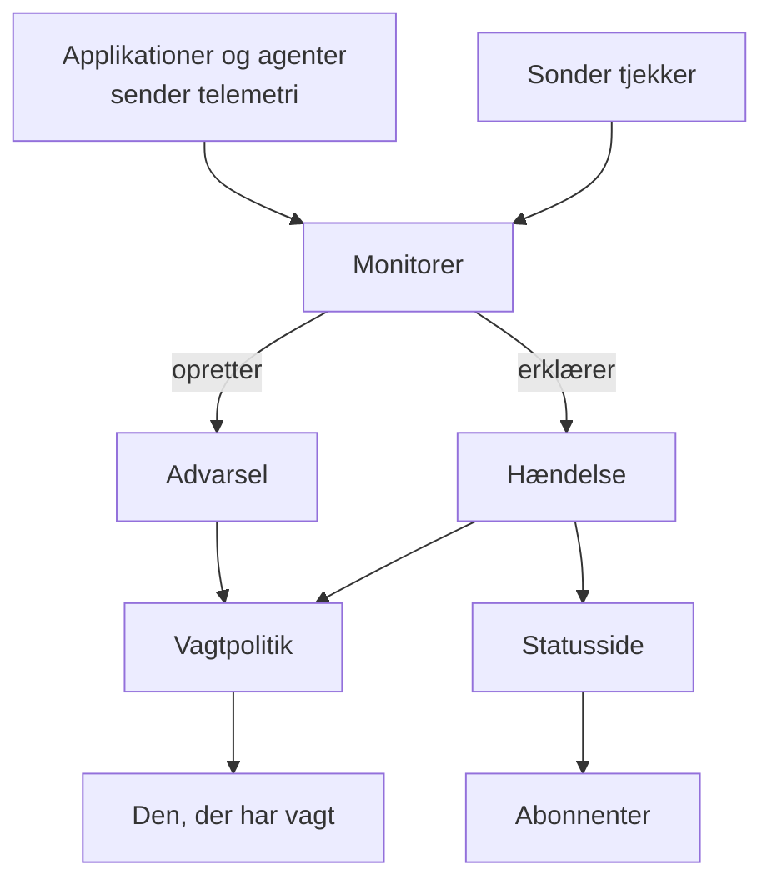

# Grundbegreber

OneUptime har mange produkter, men de hviler på en håndfuld idéer: projekter, monitorer, hændelser og advarsler, vagter, statussider og telemetri. Denne side forklarer hver idé med få sætninger, viser, hvordan de hænger sammen, og linker til de sider, der dækker dem i detaljer. Læs den én gang, så bliver alle andre sider i dokumentationen lettere at læse.

:::cards
- [Projekter og personer](#projekter-og-personer): Hvor alt ligger, og hvem der må hvad.
- [Monitorer og sonder](#monitorer-og-sonder): Hvordan OneUptime opdager, at noget er galt.
- [Hændelser og advarsler](#hændelser-og-advarsler): Den post, dit team arbejder ud fra.
- [Vagt](#vagt): Hvem der tilkaldes, hvordan, og hvem der er den næste.
:::

## Sådan hænger delene sammen

Et problem bevæger sig i én retning gennem OneUptime. Sonder og din egen telemetri føder monitorer. En monitors kriterier afgør, hvornår noget er galt, og hvad der åbnes: en hændelse, en advarsel eller begge. Vagtpolitikker tilkalder personer om dem, og statussider fortæller dine kunder om hændelser.

## Projekter og personer

Et **projekt** rummer alt: monitorer, hændelser, vagtpolitikker, statussider, telemetri og indstillinger. De fleste virksomheder har brug for ét, og nogle har ét pr. miljø eller forretningsenhed. Intet, du opretter i ét projekt, kan ses i et andet.

Din **konto** er adskilt fra dine projekter. Én konto, med én e-mail og én adgangskode, kan høre til så mange projekter, du vil; skift mellem dem med projektvælgeren øverst til venstre. Se [Din konto](/docs/introduction/your-account).

Personer er med i et projekt gennem **teams**, og et teams tilladelser afgør, hvad dets medlemmer må. Hvert nyt projekt starter med tre teams: Owners, med dig i, Admin og Members. På OneUptime Cloud har hvert projekt sin egen plan.

:::cards
- [Brugere, teams og tilladelser](/docs/permissions/index): Invitér personer, og bestem, hvad de må.
:::

## Monitorer og sonder

En **monitor** tjekker én ting, du kører, og afgør, om den virker. De fleste monitorer tjekkes af **sonder**: maskiner, der kører tjekket efter en tidsplan, for eksempel ved at hente en side, kalde et API, pinge en vært eller forespørge en database. OneUptime Cloud kører sonder i flere regioner, en selvhostet installation kører sine egne, og du kan tilføje brugerdefinerede sonder i dit netværk. Andre monitorer læser i stedet det, du sender: telemetrien fra dine applikationer, eller de data, en agent rapporterer fra dine servere, Kubernetes-klynger og øvrige infrastruktur.

En monitors **kriterier** afgør, hvad hvert resultat betyder. De tjekkes i rækkefølge, og det første, der passer, kan ændre monitorens status, erklære en hændelse, oprette en advarsel eller alle tre. Hvert nyt projekt har tre monitorstatusser: **I drift**, **Forringet** og **Offline**.

:::cards
- [Opret en monitor](/docs/monitor/create-monitor): Vælg en type, sig hvad der skal tjekkes, og hvor ofte.
- [Brugerdefinerede probes](/docs/probe/custom-probe): Tjek det, kun dit eget netværk kan nå.
:::

## Hændelser og advarsler

Begge registrerer et problem, og begge kan tilkalde den, der har vagt. Forskellen er, hvem problemet rammer.

| | Hændelse | Advarsel |
| --- | --- | --- |
| **Hvad det er** | Et problem, der rammer dine brugere, for eksempel et nedbrud eller en opbremsning | Et problem, dit team bør se på, før brugerne bliver ramt |
| **På statussider** | Kan vises, og giver abonnenter besked | Aldrig |
| **Startstatusser** | **Identified**, **Bekræftet**, **Løst** | **Identified**, **Bekræftet**, **Løst** |
| **Startalvorligheder** | Critical Incident, Major Incident, Minor Incident | **High**, **Low** |

At bekræfte en siger, at nogen tager sig af den, og forhindrer dens vagtpolitikker i at tilkalde det næste niveau. At løse den afslutter den. Du kan tilføje dine egne statusser og alvorligheder og knytte advarsler til den hændelse, de viste sig at høre til.

En **episode** samler relaterede hændelser, eller relaterede advarsler, så dit team arbejder med dem som én. Grupperingsregler afgør, hvad der hører sammen.

:::cards
- [Hændelser – Oversigt](/docs/incidents/index): Hvordan hændelser erklæres, håndteres og løses.
- [Tilknyttede advarsler](/docs/incidents/linked-alerts): Knyt de advarsler, et nedbrud udløste, til dets hændelse.
:::

## Vagt

En **vagtpolitik** afgør, hvem der tilkaldes om en hændelse eller advarsel, og hvem der er den næste, hvis ingen reagerer. Dens **eskaleringsregler** er dens niveauer: hver tilkalder sine personer og venter så på, at nogen bekræfter, før det næste niveau tilkaldes. Et niveau kan tilkalde personer, teams eller en **vagtplan**, en rotation, der til enhver tid ved, hvem der har vagt.

Hvordan hver person kontaktes, bestemmer vedkommende selv. I **Brugerindstillinger** gemmer hver person de måder, OneUptime kan kontakte dem på, for eksempel e-mail, SMS, opkald, push-notifikationer, Slack eller Microsoft Teams, og hvilke der bruges ved et tilkald.

:::cards
- [Eskaleringsregler](/docs/on-call/escalation-rules): Tilkald personer niveau for niveau, indtil nogen reagerer.
- [Vagtplaner](/docs/on-call/schedules): Rotationer, lag og vagtskifter.
:::

## Statussider og vedligeholdelse

En **statusside** viser dine kunder, om dine tjenester virker. Du vælger, hvilke monitorer den viser, under navne, dine kunder forstår. Mens en hændelse på en af de monitorer er aktiv, viser siden den, og dens **abonnenter** får besked via e-mail, SMS, Slack, Microsoft Teams eller webhook. En statusside kan være offentlig eller privat for dem, du lukker ind.

**Planlagt vedligeholdelse** annoncerer planlagt arbejde på forhånd. En begivenhed går gennem **Planlagt**, **Igangværende**, **Afsluttet** og **Fuldført**, og de statussider, du viser den på, fortæller besøgende og abonnenter om den.

:::cards
- [Statussider – Oversigt](/docs/status-pages/index): Opret en statusside, og bestem, hvad den viser.
- [Abonnenter og meddelelser](/docs/status-pages/subscribers): Hvem der får besked, og hvornår.
:::

## Telemetri

**Telemetri** er det, dine systemer sender til OneUptime: logs, metrikker, traces, undtagelser og profiler. Applikationer sender den med OpenTelemetry, og OneUptimes agenter sender den fra værter, Kubernetes-klynger, Docker-værter og øvrig infrastruktur. Hver afsender bruger en **indtagelsesnøgle**, oprettet under **Projektindstillinger → Telemetri og APM → Indtagelsesnøgler**. Du søger i telemetrien, viser den på dashboards og holder øje med den med telemetrimonitorer, der åbner hændelser og advarsler som enhver anden monitor.

:::cards
- [OpenTelemetry](/docs/telemetry/open-telemetry): Send logs, metrikker og traces fra dine applikationer.
- [Log-monitor](/docs/monitor/logs-monitor): Få besked, når et mønster dukker op i dine logs.
:::

## Automatisering og AI

- **Arbejdsgange** udfører handlinger, når der sker noget, for eksempel en besked i Slack, når en hændelse erklæres.
- **Runbooks** gør en beredskabsprocedure til trin, dit team kan køre manuelt eller automatisk.
- **OneUptime AI** undersøger nye hændelser og advarsler og poster det, den fandt, på deres tidslinje, og **Ask AI** besvarer spørgsmål om dit projekt. Et nyt projekt starter med AI slået til; kontakten **Aktivér AI** under **Projektindstillinger → AI → AI Features** slår det hele fra.

:::cards
- [Workflows – Oversigt](/docs/workflows/index): Automatisér handlinger med triggere og komponenter.
- [AI SRE](/docs/ai/ai-sre): Hvordan OneUptime AI undersøger hændelser og advarsler.
:::

## Etiketter og ejere

**Etiketter** er mærker, du sætter på monitorer, hændelser, statussider og de fleste andre ressourcer, så du kan filtrere og gruppere dem. Et teams tilladelser kan begrænses til ressourcer med bestemte etiketter. **Ejere** er de personer og teams, der er ansvarlige for én ressource: de får besked, når der sker noget med den. Etiketregler og ejerregler tilføjer etiketter og ejere til nye ressourcer for dig.

:::cards
- [Etiket- og ejerregler](/docs/configuration/label-and-owner-rules): Giv nye ressourcer etiketter og ejere automatisk.
:::

## Næste trin

:::cards
- [Hurtigstart](/docs/introduction/quickstart): Brug idéerne i praksis på femten minutter.
- [Startside og genveje](/docs/introduction/home): Find hvert produkt i dashboardet.
- [Opret en monitor](/docs/monitor/create-monitor): Din første monitor, felt for felt.
- [Hændelser – Oversigt](/docs/incidents/index): Hvad der sker, efter at en monitor erklærer en hændelse.
:::
