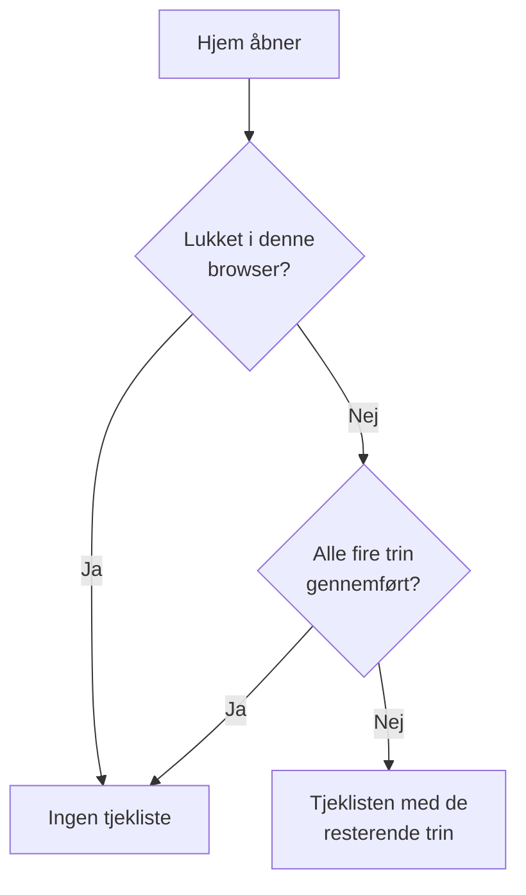

# Startside og genveje

Hjem er den første side, du ser i et projekt. Den viser med et blik, om noget har brug for dig lige nu, og fører et nyt projekt gennem den første opsætning. Denne side forklarer, hvad Hjem viser, hvordan du finder ethvert produkt, enhver side og handling i dashboardet, og de tastaturgenveje, der sparer dig for ture gennem menuerne.

:::cards
- [Hvad Hjem viser](#hvad-hjem-viser): Velkomsttjeklisten, de fem felter og de aktive hændelser.
- [Find rundt](#find-rundt): Menuen Produkter og bjælkerne øverst på hver side.
- [Søg](#søg-efter-en-side-en-indstilling-eller-en-handling): Find enhver side, indstilling eller handling ved at skrive dens navn.
- [Tastaturgenveje](#tastaturgenveje): Gå til Hjem, Overvågninger eller Hændelser med to taster.
:::

## Hvad Hjem viser

Åbn **Hjem** i bjælken øverst, eller tryk `g` og derefter `h` hvor som helst. Fra top til bund viser Hjem:

1. **Velkommen til OneUptime 👋**, en tjekliste til et nyt projekt, indtil den er gennemført.
2. Fem felter, der tæller det, der kræver opmærksomhed.
3. **Aktive hændelser**, hver hændelse, der ikke er løst endnu.

### Velkomsttjeklisten

Tjeklisten fører dig gennem de fire ting, et projekt har brug for, før det er nyttigt. Hvert trin åbner den side, hvor du gør det, og krydser sig selv af, når projektet har det, trinnet beder om.

| Trin | Gennemført, når | Åbner |
| --- | --- | --- |
| **Opret din første overvågning** | Projektet har en monitor. | Formularen **Opret monitor**, eller listen **Monitorer** for den, der ikke må oprette monitorer. |
| **Udgiv en statusside** | Projektet har en statusside. | **Statussider** |
| **Inviter dit team** | Andre end dig er i projektet eller inviteret til det. | **Brugere** |
| **Opsæt en vagtpolitik** | Projektet har en vagtpolitik. | **Vagtordning** |

Under trinene viser **Sådan virker OneUptime** de fire kerneprodukter i den rækkefølge, et problem bevæger sig gennem dem: **Monitorer**, **Hændelser og advarsler**, **Vagtordning** og **Statussider**. Klik på et for at åbne det.

Tjeklisten forsvinder, når alle fire trin er gennemført. Klik på **Luk** for at skjule den før. Det huskes i denne browser for dette projekt; alt, hvad trinene åbner, ligger stadig i menuen **Produkter**.

### Felterne

Hvert felt tæller noget, siger, om det kræver din opmærksomhed, og åbner listen bag tallet.

| Felt | Hvad det tæller | Når tallet er nul |
| --- | --- | --- |
| **Aktive hændelser** | Hændelser, der ikke er løst | **Alt er i orden** |
| **Aktive advarsler** | Advarsler, der ikke er løst | **Alt er i orden** |
| **Ikke-operationelle monitorer** | Monitorer, hvis status ikke er en driftsstatus. Arkiverede monitorer tæller ikke med. | **Alle i drift** |
| **Igangværende vedligeholdelse** | Planlagte vedligeholdelser, der er i gang | **Ingen i gang** |
| **SLO'er i fare** | Aktive SLO'er, der er i fare eller har brugt deres fejlbudget op | **Budgetterne er sunde** |

Et tal over nul viser **Kræver opmærksomhed**, eller **I gang** og **Budgettet bruges op** på felterne for vedligeholdelse og SLO'er. Et projekt uden monitorer ser **Ingen monitorer endnu** på monitorfeltet, og et uden SLO'er ser **Ingen SLO'er endnu**: et tomt projekt er ikke det samme som et sundt. De to felter åbner så listerne **Monitorer** og **SLOs**, hvor du opretter en.

### Hjems sidemenu

Sidemenuen ved siden af Hjem har de samme lister, hver med et tal:

| Afsnit | Sider |
| --- | --- |
| **Hændelser** | **Aktive hændelser** og **Aktive episoder** |
| **Advarsler** | **Aktive advarsler** og **Aktive episoder** |
| **Monitorer** | **Ikke operationel** |
| **Planlagte begivenheder** | **Igangværende** |

En episode samler relaterede hændelser eller advarsler, så du arbejder med dem som én. Se [Grundbegreber](/docs/introduction/core-concepts#hændelser-og-advarsler).

## Find rundt

Alt i OneUptime ligger under **Produkter** i topbjælken. Menuen viser sine grupper som rækkerne i én liste og åbner altid med den første af dem, det grundlæggende, foldet ud: Overvågninger, Hændelser, Advarsler, Vagtordning, Statussider, Planlagt vedligeholdelse og SLOs. Hver anden gruppe (Observabilitet, AI, Kode, Ressourcer, Infrastruktur, Dashboards og automatisering og Indstillinger) er foldet sammen til en række i den samme liste. Hver række nævner gruppens produkter og siger, hvor mange der er. Klik på en række for at folde den ud eller sammen, eller gå til den med piletasterne og tryk på **Enter**.

- **Søgning finder alt.** Skriv i menuens søgefelt for at finde ethvert produkt på navn, på hvad det gør, eller på et velkendt ord som `k8s` eller `RUM`. Søgningen kigger også i de sammenfoldede grupper.
- **Du starter, hvor du er.** Gruppen for den side, du er på, folder sig selv ud, og de produkter, du har åbnet for nylig, står øverst.
- **Dine valg bliver.** Menuen husker i din browser, hvilke af de andre grupper du har foldet ud eller sammen. Det grundlæggende er foldet ud igen, hver gang du åbner menuen, også selvom du foldede det sammen.
- **På en telefon** viser menuknappen produkterne på samme måde: det grundlæggende foldet ud øverst og hver anden gruppe som én række, der åbner med et tryk.

### Bjælkerne øverst

To bjælker løber hen over toppen af hver side.

| Hvor | Hvad der er |
| --- | --- |
| Øverst til venstre | Projektvælgeren: skift til et andet af dine projekter, eller opret et nyt. |
| Øverst til højre | **Søg** og **Ask AI**, notifikationsklokken med det, der kræver dig nu (aktive hændelser og advarsler, de vagtpolitikker, du har vagt i, ventende invitationer), **Hjælp**, og dit billede, som åbner menuen for din [konto](/docs/introduction/your-account). |
| Under dem | **Hjem** og **Produkter** til venstre, **Brugerindstillinger** til højre: hvordan OneUptime kontakter dig i dette projekt. |

**Hjælp** åbner denne dokumentation (**Dokumentation**) og listen **Keyboard shortcuts** og tilbyder support via e-mail og på Slack. På en smal skærm, som på en telefon, er **Søg**, **Ask AI** og **Hjælp** udeladt for at spare plads; klokken og dit billede bliver.

## Søg efter en side, en indstilling eller en handling

Tryk på **Cmd+K** (Mac) eller **Ctrl+K** (Windows og Linux), eller klik på søgeikonet i topbjælken, og begynd at skrive. Søgningen finder:

- **Hver side i menuerne**, under det navn, menuen giver den: API-nøgler, Farezone, Vagtplaner, Hændelsesalvor, dine egne Notifikationsmetoder. Hvert resultat siger, hvor det ligger, for eksempel *Projektindstillinger › Avanceret*, så sider med samme navn (Brugerdefinerede felter under Hændelser, Advarsler og Monitorer) er lette at skelne.
- **Handlinger**, efter hvad du vil gøre: Erklær hændelse, Opret monitor eller Delete Project, som åbner Farezone. En handling, der ændrer noget, tilbydes kun til dem, der må udføre den.
- **Dine monitorer, hændelser, advarsler, statussider og vagtpolitikker**, efter navn.

Søgningen læser det, du skriver, som du mener det:

- Store og små bogstaver, accenter, mellemrum og bindestreger er ligegyldige: *on-call*, *on call* og *oncall* finder de samme sider, og ordene kan stå i vilkårlig rækkefølge.
- Den kender andre ord for mange sider, på engelsk: *pager* eller *escalation* for Vagtpolitikker, *rota* for Vagtplaner, *2fa* for totrinsgodkendelse, *delete project* for Farezone.
- Tilføj produktets navn for at indsnævre en søgning: *incident custom fields* finder siden Brugerdefinerede felter under Hændelser.
- En lille tastefejl, som *incidnet*, finder stadig det, du mente, når intet passer præcist.

Med et tomt søgefelt viser søgningen de sider, du har åbnet for nylig, handlingerne og produkterne.

## Tastaturgenveje

Tryk på `?` hvor som helst i dashboardet for at se alle genveje, eller åbn **Hjælp** og vælg **Keyboard shortcuts**. På en Mac er `Mod` Command-tasten; på Windows og Linux er det Ctrl.

| Taster | Hvad de gør |
| --- | --- |
| `Mod` + `K` | Åbn kommandopaletten: søg efter enhver side, indstilling eller handling. |
| `Mod` + `I` | Spørg AI om det, du kigger på. |
| `/` | Søg i listen på denne side. |
| `?` | Vis tastaturgenvejene. |
| `Esc` | Luk en dialog eller et panel. |

### Gå til et produkt

Tryk på `g` og derefter et bogstav for at gå direkte til et produkt. Tryk bogstavet inden for halvanden sekund efter `g`.

| Taster | Går til |
| --- | --- |
| `g` derefter `h` | Hjem |
| `g` derefter `m` | Overvågninger |
| `g` derefter `i` | Hændelser |
| `g` derefter `a` | Advarsler |
| `g` derefter `o` | Vagtordning |
| `g` derefter `s` | Statussider |
| `g` derefter `e` | Planlagt vedligeholdelse |
| `g` derefter `d` | Dashboards |
| `g` derefter `l` | Protokoller |
| `g` derefter `t` | Spor |

Genvejene står ikke i vejen. `?`, `/` og `g` gør intet, mens du skriver i et felt, og intet navigerer væk, mens en dialog er åben, så et forkert tastetryk ikke kan koste dig en halvt udfyldt formular. Ethvert andet produkt er én søgning væk med `Mod` + `K`.

## Næste trin

:::cards
- [Hurtigstart](/docs/introduction/quickstart): Gå velkomsttjeklisten igennem, trin for trin.
- [Din konto](/docs/introduction/your-account): Din profil, sikkerheden ved dit login, sprog og tema.
- [Spørg AI](/docs/ai/ask-ai): Hvad Ask AI kan svare på og gøre for dig.
- [Grundbegreber](/docs/introduction/core-concepts): Hvad monitorer, hændelser, advarsler og vagter er.
:::
