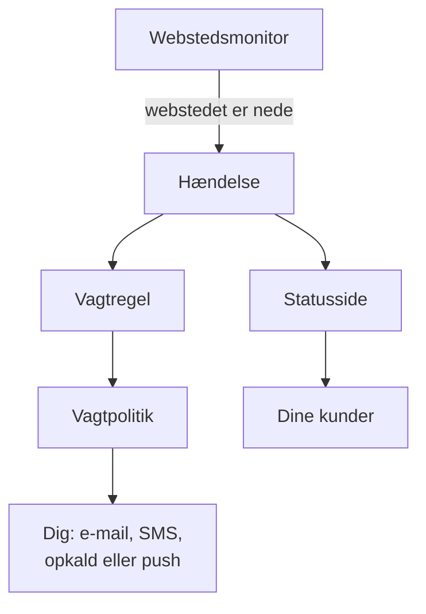

# Hurtigstart

Denne guide fører dig fra en ny konto til en fungerende opsætning på omkring femten minutter: en monitor, der tjekker dit websted hvert femte minut, en vagtpolitik, der tilkalder dig, når webstedet går ned, og en statusside, der informerer dine kunder. Den følger tjeklisten **Velkommen til OneUptime 👋** på dit projekts startside.

## Før du begynder

- **En konto.** På OneUptime Cloud tilmelder du dig på [oneuptime.com](https://oneuptime.com/accounts/register) og åbner linket i den e-mail, du får. På din egen installation åbner du den i din browser og tilmelder dig: den første konto bliver hovedadministrator. Se [Docker Compose](/docs/installation/docker-compose) for at installere en.
- **Et websted at holde øje med.** Enhver adresse, der svarer over HTTP eller HTTPS, for eksempel din virksomheds forside.

## Opret et projekt

I OneUptime ligger alt i et projekt: dine monitorer, hændelser, vagtpolitikker, statussider og de personer, der arbejder med dem.

:::steps
### Start et nyt projekt

Første gang du logger ind, viser OneUptime **Ingen projekter**. Klik på **Opret nyt projekt**. Hvis nogen allerede har inviteret dig til et projekt, accepterer du i stedet invitationen på samme side.

### Giv det et navn

Indtast et **Projektnavn**, for eksempel din virksomheds navn. På OneUptime Cloud beder det næste trin dig vælge en plan.

### Opret det

Klik på **Opret projekt**. Dit projekts startside åbner, med tjeklisten **Velkommen til OneUptime 👋** øverst.
:::

## Overvåg dit websted

:::steps
### Åbn oprettelse af monitor

Klik på **Opret din første overvågning** i tjeklisten. Du kan også åbne **Monitorer** fra menuen **Produkter** og klikke på **Opret monitor**.

### Vælg Websted

Under **Monitortype** vælger du **Websted**. Indtast et **Navn**, for eksempel `Website`, og klik på **Næste**.

### Indtast adressen

Indtast den fulde adresse på dit websted i **Websteds-URL**, for eksempel `https://example.com`. OneUptime tilføjer kriterierne for dig: monitoren går **Offline** og erklærer en hændelse, når webstedet ikke svarer eller svarer med en fejl. Klik på **Næste**.

### Opret monitoren

Behold de valgte **Sonder** og **Overvågningsinterval** **Hvert 5. minut**, og klik på **Opret monitor**. Monitorens side åbner, og sonderne begynder at tjekke dit websted.
:::

Vil du prøve tjekket, før du gemmer, så klik på **Test monitor** i det andet trin. Alle andre monitortyper er beskrevet i [Opret en monitor](/docs/monitor/create-monitor).

## Bliv tilkaldt, når det går ned

Som det er nu, sendes en hændelse uden ejere med e-mail til projektets ejere, og det omfatter dig. For at blive tilkaldt, indtil nogen reagerer, opretter du en vagtpolitik og lader hver hændelse udløse den.

:::steps
### Opret en vagtpolitik

Klik på **Opsæt en vagtpolitik** i tjeklisten, eller åbn **Vagtordning** fra menuen **Produkter**. Klik på **Opret Vagtpolitik**, og indtast et **Navn**. Under **Hvem tilkaldes først?** klikker du på **Tilføj modtager** og vælger dig selv. Klik på **Opret Vagtpolitik**.

### Udløs den for hver hændelse

Åbn **Hændelser** fra menuen **Produkter**, fold **Regler** ud i sidemenuen, og vælg **Vagtregler**. Klik på **Opret Incident On-Call Rule**, indtast et **Navn**, og klik på **Næste**. Lad **Matchkriterier** stå tomt, så reglen gælder for alle hændelser, og klik på **Næste**. Vælg din politik under **Vagtpolitikker**, og klik på **Opret Incident On-Call Rule**.

### Vælg, hvordan du bliver kontaktet

Din login-e-mail er allerede en måde at kontakte dig på. For også at få SMS eller opkald åbner du **Brugerindstillinger** i bjælken under topbjælken, går til **Notifikationsmetoder** og tilføjer på fanen **Direct Contact** dit nummer under **Telefonnumre til SMS-meddelelser** eller **Telefonnumre til opkaldsnotifikationer**. Klik på **Bekræft**, og indtast den kode, OneUptime sender dig. Et bekræftet nummer bruges straks til vagtkald.
:::

> [!NOTE]
> SMS og telefonopkald er slået fra i et nyt projekt. En projektejer, en Billing Admin eller en person med Manage Billing slår dem til i kortet **Notifikationskanaler** under **Projektindstillinger → Notifikationer → Notifikationsindstillinger**.

Se [Eskaleringsregler](/docs/on-call/escalation-rules) og [Vagtplaner](/docs/on-call/schedules) for flere niveauer, rotationer og hvor længe hvert niveau venter.

## Udgiv en statusside

:::steps
### Opret statussiden

Klik på **Udgiv en statusside** i tjeklisten, eller åbn **Statussider** fra menuen **Produkter**. Klik på **Opret statusside**, indtast et **Navn**, for eksempel `Acme Status`, og klik på **Opret statusside**.

### Tilføj din monitor

Åbn den nye statusside. I dens sidemenu, under **Ressourcer**, vælger du **Monitorer**; i projekter med monitorgrupper slået til hedder punktet **Ressourcer**. Klik på **Tilføj monitor**, vælg din webstedsmonitor, og klik på **Tilføj monitor**. Rækken viser monitorens navn for besøgende; ret det under **Visningsnavn**, hvis du vil.

### Åbn siden

Vælg **Oversigt** i sidemenuen. Kortet **Status Page Preview URL** linker til din statusside: åbn den, og dit websted vises som i drift.
:::

En ny statusside er offentlig: alle med adressen kan åbne den. Se [Statusside – branding og domæner](/docs/status-pages/branding-and-domains) for at give den dit eget domæne, logo og dine egne farver.

## Invitér dit team

Klik på **Inviter dit team** i tjeklisten, eller åbn **Brugere** fra menuen **Produkter**, under **Indstillinger**. Klik på **Inviter bruger**, indtast personens **E-mail**, og vælg et **Team**: medlemsteamet er valgt fra start. Klik på **Inviter**. OneUptime sender invitationen med e-mail, og teamet bestemmer, hvad personen må. Se [Brugere, teams og tilladelser](/docs/permissions/index).

## Prøv det

Erklær en testhændelse for at se hele kæden virke.

:::steps
### Erklær en testhændelse

Åbn **Hændelser**, og klik på **Erklær hændelse**. Indtast en **Titel**, for eksempel `Test incident`, vælg en **Hændelsesalvor**, og klik på **Næste**. Under **Monitorer** vælger du din webstedsmonitor, så hændelsen vises på din statusside. Klik på **Næste**, indtil du når oversigten, og klik så på **Erklær hændelse**.

### Se, hvad der sker

Inden for et minut eller to tilkalder din vagtpolitik dig, og hændelsen vises på din statusside.

### Løs den

Klik på **Løs** på hændelsens side. Tilkaldene stopper, og hændelsen forsvinder fra din statusside.
:::

> [!WARNING]
> Alle, der åbner din statusside, ser testhændelsen, indtil du løser den. Kør testen, før du deler sidens adresse.

## Fejlfinding

:::details Jeg blev ikke tilkaldt
Åbn hændelsen, og vælg **Vagtudførelser** i dens sidemenu: der kan du se, om din politik kørte, og hvem den tilkaldte. Kørte den ikke, så tjek, at din vagtregel er slået til og nævner politikken. Kørte den, så tjek, at dine metoder under **Brugerindstillinger → Notifikationsmetoder** er bekræftet.
:::

:::details Hændelsen vises ikke på min statusside
En statusside viser en hændelse, når en af hændelsens monitorer er på siden. Tjek, at hændelsen har din monitor blandt sine berørte ressourcer, og at monitoren er på statussiden.
:::

:::details Monitoren siger offline, men mit websted virker
Åbn monitoren, og se, hvad sonderne modtog. Se fejlfindingsafsnittet i [Websted-monitor](/docs/monitor/website-monitor).
:::

## Næste trin

:::cards
- [Grundbegreber](/docs/introduction/core-concepts): Idéerne bag det, du lige har sat op.
- [Vagtplaner](/docs/on-call/schedules): Del vagterne med dit team.
- [Statusside – branding og domæner](/docs/status-pages/branding-and-domains): Gør statussiden til din egen.
- [OpenTelemetry](/docs/telemetry/open-telemetry): Send logs, metrikker og traces fra dine applikationer.
:::
