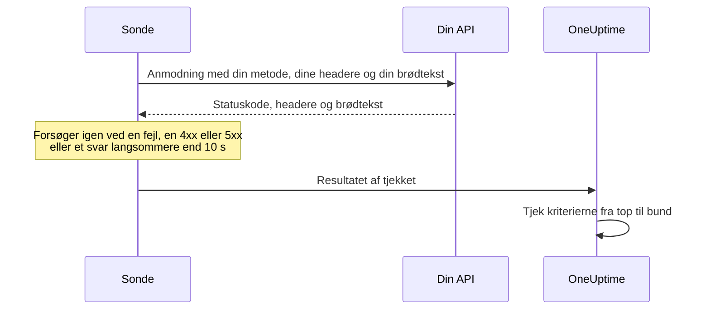

# API-monitor

En API-monitor kalder et HTTP-endpoint efter en tidsplan, med den metode, de headere og den brødtekst, du vælger, og tjekker, hvad der kommer tilbage: statuskoden, svartiden, headerne og brødteksten. Brug den til REST-, JSON- og GraphQL-endpoints, sundhedstjek og ethvert kald, dine brugere er afhængige af.

:::cards
- [Opret monitoren](#opret-en-api-monitor): Seks trin i dashboardet.
- [Konfigurationsmuligheder](#konfigurationsmuligheder): Metode, headere, brødtekst, omdirigeringer, certifikater, timeouts og genforsøg.
- [Overvågningskriterier](#overvågningskriterier): Hvad der fra start tæller som oppe eller nede.
- [Fejlfinding](#fejlfinding): Når et tjek fejler, som burde bestå.
:::

## Sådan virker det

Ved hvert tjek sender en sonde anmodningen, følger omdirigeringer og registrerer statuskoden, svartiden, headerne og brødteksten. En anmodning, der fejler, får timeout, svarer med en status `4xx` eller `5xx` eller tager længere end 10 sekunder, forsøges igen, op til det antal genforsøg, du tillader. Derefter kører OneUptime resultatet gennem monitorens kriterier.



En sonde, der har mistet sin egen netværksforbindelse, rapporterer intet resultat, så den kan ikke markere din API som offline.

## Før du starter

- **En rolle, der kan oprette monitorer**: Project Owner, Project Admin, Project Member, Monitor Admin eller Monitor Member eller en brugerdefineret rolle med tilladelsen Create Monitor.
- **En sonde, der kan nå API'et.** Dit projekts standardsonder vælges for hver ny monitor. Står der en firewall foran API'et, så tillad [OneUptime Clouds sonde-IP-adresser](/docs/configuration/ip-addresses). En API på et privat netværk har brug for en [brugerdefineret sonde](/docs/probe/custom-probe) i det netværk, som må nå private adresser: se [Adgang til privat netværk](/docs/self-hosted/private-network-access).
- **Legitimationsoplysninger som monitorhemmeligheder.** Har API'et brug for en nøgle eller et token, så gem det først som en [monitorhemmelighed](/docs/monitor/monitor-secrets), så monitoren kun indeholder en henvisning til den.

## Opret en API-monitor

:::steps
### Start en ny monitor

Gå til **Monitorer**, og klik på **Opret monitor**. Vælg **API** under **Monitortype**.

### Navngiv den

Angiv et **Navn**, som `Orders API`, og klik så på **Næste**.

### Angiv anmodningen

Angiv endpointets fulde URL under **API-URL**, som `https://api.example.com/health`. Vælg **API-anmodningstype** (**GET**, medmindre du ændrer den). For at tilføje headere eller en brødtekst åbner du **Flere felter** og udfylder **Anmodningsheadere** og **Anmodningstekst (i JSON)**.

### Test den

Klik på **Test monitor**, vælg en sonde under **Vælg sonde**, og klik på **Kør test**. **Overvågningstestresultat** viser, hvad API'et svarede.

### Gennemgå kriterierne

**Monitorkriterier** starter med [standardkriterierne](#standardkriterier): offline, når API'et ikke svarer eller svarer med en fejl, online ved enhver status `2xx` eller `3xx`. For også at tjekke, hvad API'et returnerer, tilføjer du et filter og klikker så på **Næste**.

### Vælg sonder, og opret

Behold eller ret **Sonder** og **Overvågningsinterval** (det starter på **Hvert 5. minut**), og klik så på **Opret monitor**. Monitorens side åbner.
:::

## Konfigurationsmuligheder

### API-URL

Det endpoint, der kaldes, som fuld URL med skema, som `https://api.example.com/v1/health`. Du kan sætte en [monitorhemmelighed](/docs/monitor/monitor-secrets) ind i URL'en som `{{monitorSecrets.NAME}}`.

### Dynamiske URL-pladsholdere

Når et CDN eller en caching-proxy står foran API'et, kan en sonde få svar fra cachen i stedet for fra din server. For at komme forbi cachen tilføjer du en pladsholder i URL'en; sonden erstatter den med en ny værdi ved hvert tjek.

| Pladsholder | Erstattes med | Eksempelværdi |
| --- | --- | --- |
| `{{timestamp}}` | Den aktuelle Unix-tid i sekunder | `1719500000` |
| `{{random}}` | En tilfældig, unik streng på 32 hexadecimale tegn | `3f2b8c1d9e7a4b6c8d0e1f2a3b4c5d6e` |

En URL med en pladsholder:

```text
https://api.example.com/health?cb={{timestamp}}
```

Hvad sonden anmoder om ved to tjek med fem minutters mellemrum:

```text
https://api.example.com/health?cb=1719500000
https://api.example.com/health?cb=1719500300
```

Brug `{{random}}` på samme måde: `https://api.example.com/health?nocache={{random}}`.

### API-anmodningstype

Den HTTP-metode, der sendes. **GET** er standard; de andre er **POST**, **PUT**, **PATCH**, **DELETE** og **HEAD**. Får en anmodning **HEAD** et svar med status `4xx` eller `5xx`, gentager sonden den som `GET`.

### Flere felter

Disse indstillinger er foldet sammen under **Flere felter**. Den sammenfoldede overskrift nævner dem og viser, hvilke du har ændret.

| Felt | Standard | Hvad det gør |
| --- | --- | --- |
| **Anmodningsheadere** | Ingen | Headere, der sendes, som par af navn og værdi. Klik på **Tilføj Request Header** for hver af dem. |
| **Anmodningstekst (i JSON)** | Ingen | Et JSON-objekt, der sendes som brødtekst, som regel med **POST**, **PUT** eller **PATCH**. Det skal være gyldig JSON. |
| **Følg ikke omdirigeringer** | Fra | Bedøm det første svar i stedet for at følge omdirigeringer. Se [nedenfor](#følg-ikke-omdirigeringer). |
| **Tillad selvsignerede certifikater** | Fra | Spring valideringen af TLS-certifikatet over for monitorens eget værtsnavn. |
| **Brug klientcertifikat (mTLS)** | Fra | Præsentér et klientcertifikat og en privat nøgle. Se [Klientcertifikat (mTLS)](#klientcertifikat-mtls). |
| **Anmodningstimeout (sekunder)** | `60` | Hvor længe der ventes på hvert forsøg. Maksimum er 60 sekunder. |
| **Genforsøg ved fejl** | Sondens standard, som regel `3` | Hvor mange gange et mislykket forsøg gentages. Maksimum er 3. Se [Genforsøg og timeouts](#genforsøg-og-timeouts). |

Anmodningsheadere og anmodningens brødtekst kan bruge [monitorhemmeligheder](/docs/monitor/monitor-secrets), for eksempel en header `Authorization` med værdien `Bearer {{monitorSecrets.ApiKey}}`.

#### Følg ikke omdirigeringer

Som standard følger sonden omdirigeringer (`301`, `302`, `303`, `307` og `308`), op til 10 af dem, og bedømmer det svar, den ender på. Slå **Følg ikke omdirigeringer** til for i stedet at bedømme selve omdirigeringssvaret. [Standardkriterierne](#standardkriterier) tæller et omdirigeringssvar som online.

Når den følger en omdirigering:

- En `303`, eller en `301` eller `302` som svar på et `POST`, gør anmodningen til et `GET` uden brødtekst, som browsere gør.
- Dine anmodningsheadere sendes kun til URL'ens egen oprindelse (samme skema, vært og port). En omdirigering til en anden oprindelse sendes uden dem.
- En omdirigering til en anden oprindelse får tjekket til at fejle, hvis anmodningen stadig har en brødtekst eller en anden metode end `GET` eller `HEAD`.
- **Tillad selvsignerede certifikater** følger omdirigeringer, der bliver på monitorens eget værtsnavn. En omdirigering til et andet værtsnavn verificeres som normalt.

#### Klientcertifikat (mTLS)

Kræver API'et gensidig TLS, så slå **Brug klientcertifikat (mTLS)** til, og udfyld:

| Felt | Hvad du angiver |
| --- | --- |
| **Klientcertifikat (PEM)** | Det PEM-kodede klientcertifikat, der præsenteres. |
| **Privat klientnøgle (PEM)** | Den tilsvarende PEM-kodede private nøgle. |
| **Adgangsudtryk til privat klientnøgle** | Valgfrit. Adgangsudtrykket, kun hvis den private nøgle er krypteret. |

Det svarer til curls flag `--cert` og `--key`:

```bash
curl --cert client.crt --key client.key https://api.example.com/health
```

For at holde nøglen ude af monitorens indstillinger gemmer du certifikatet og nøglen som [monitorhemmeligheder](/docs/monitor/monitor-secrets) og angiver `{{monitorSecrets.NAME}}` i disse felter. Hemmeligheder udfyldes på serveren, og deres værdier vises aldrig i dashboardet.

Klientcertifikatet præsenteres kun, så længe anmodningen bliver på URL'ens oprindelse. Efter en omdirigering til en anden oprindelse fortsætter sonden uden det.

#### Genforsøg og timeouts

**Genforsøg ved fejl** tæller genforsøg _efter_ det første forsøg, så `0` kører tjekket én gang og `2` op til tre gange. Står feltet tomt, bruges sondens standard: 3, medmindre sondens `PROBE_MONITOR_RETRY_LIMIT` siger andet. Sonden venter et sekund mellem forsøgene, og hvert forsøg får hele **Anmodningstimeout (sekunder)**.

Disse fejl forsøges igen: forbindelsesfejl, timeouts, svar `4xx` og `5xx` og svar, der er langsommere end 10 sekunder. Disse gør ikke, fordi et nyt forsøg ikke kan ændre dem: en ugyldig eller blokeret URL, mere end 10 omdirigeringer og et svar større end 512 KiB.

## Overvågningskriterier

Kriterier afgør, hvornår API'et tæller som online, forringet eller offline, og om det erklærer en hændelse eller opretter en advarsel. Hvert kriterium tjekker et eller flere filtre:

| Filter | Betingelser | Hvad det tjekker |
| --- | --- | --- |
| **Is Online** | **Sand**, **Falsk** | Om API'et overhovedet svarede, uanset statuskode. |
| **Svarstatuskode** | **Equal To**, **Not Equal To**, **Greater Than**, **Less Than**, **Greater Than Or Equal To**, **Less Than Or Equal To** | HTTP-statuskoden. |
| **Svartid (i ms)** | **Greater Than**, **Less Than**, **Greater Than Or Equal To**, **Less Than Or Equal To** | Hvor lang tid anmodningen tog, omdirigeringer medregnet. |
| **Svarets brødtekst** | **Indeholder**, **Not Contains** | Tekst i svarets brødtekst. Der skelnes mellem store og små bogstaver. |
| **Response Header** | **Indeholder**, **Not Contains** | Om svaret har en header med dette navn. Angiv navnet med små bogstaver, som `x-request-id`. |
| **Response Header Value** | **Indeholder**, **Not Contains** | Om en header har præcis denne værdi, sammenlignet med små bogstaver, som `application/json`. |
| **JavaScript Expression** | **Evaluates To True** | Et udtryk over svaret. Se [JavaScript-udtryk](/docs/monitor/javascript-expression). |
| **Is Request Timeout** | **Sand**, **Falsk** | Om anmodningen fik timeout ved hvert forsøg. |

Et JSON-svar tjekkes i sin kompakte form uden mellemrum mellem nøgler og værdier. For at finde `"status": "ok"` med **Svarets brødtekst** angiver du `"status":"ok"`.

**Tilføj kriterier** tilføjer et kriterium, der allerede er navngivet efter sit filter, for eksempel _Response Time (in ms) is above 3000_. Navnet ændrer sig med filtrene, indtil du skriver dit eget. En beskrivelse er valgfri: for at tilføje en åbner du kriteriets **Indstillinger**.

Med to eller flere filtre afgør **Matchbetingelse**, om **Alle** skal matche, eller om **Enhver** enkelt er nok. Et kriteriums **Handlinger** afgør, hvad det gør: ændrer monitorstatus, opretter en advarsel, erklærer en hændelse eller flere af dem.

### Standardkriterier

En ny API-monitor starter med to kriterier, så den virker uden ændringer:

- **Offline** — API'et svarer ikke eller svarer med en statuskode på `400` eller derover (eller under `200`). Monitoren markeres som **Offline**, og der oprettes en hændelse. Hændelsen løser sig selv, når API'et er tilbage.
- **Oppe** — API'et svarer med en hvilken som helst statuskode `2xx` eller `3xx`, som `200`, `201`, `202` eller `204`. Monitoren markeres som **I drift**.

På listen over kriterier er de navngivet efter monitoren: _Check if (name) is offline_ og _Check if (name) is online_.

Et endpoint, der svarer `201 Created` eller `204 No Content`, tæller altså som oppe. Hvis kun én statuskode betyder sund for dig, så ret begge kriterier på monitorens side **Konfiguration → Kriterier**: for eksempel **Svarstatuskode** / **Equal To** / `200` i online-kriteriet og **Not Equal To** / `200` i offline-kriteriet, i stedet for de to statuskodefiltre, hvert af dem har. For også at tjekke, hvad API'et returnerer, tilføjer du et filter **Svarets brødtekst** eller **JavaScript Expression** til offline-kriteriet.

Kriterier tjekkes fra top til bund, og det første, der matcher, afgør, hvad der sker.

Når intet matcher, falder monitoren tilbage til sin standardstatus: **I drift**, medmindre du vælger en anden under **Flere felter** under kriterierne. Den sammenfoldede overskrift på **Flere felter** viser, hvilken status det er.

Monitorer, der blev oprettet, før OneUptime ændrede disse standarder, beholder de kriterier, de blev oprettet med, og tæller kun `200` som online. Monitorer, der oprettes via API'et eller Terraform, bruger de kriterier, du sender.

### Evaluering over en periode

**Evaluér disse kriterier over en periode** er et afkrydsningsfelt under et filter, der tilbydes for **Is Online**, **Svarstatuskode** og **Svartid (i ms)**. Slå det til for at bedømme et vindue af tidligere tjek i stedet for kun det seneste: vælg en aggregering under **Evaluér** og et vindue fra 2 til 60 minutter under **For de seneste (i minutter)**.

| Aggregering | Matcher, når |
| --- | --- |
| **Gennemsnit**, **Sum**, **Maximum Value**, **Minimum Value** | Den værdi over vinduet opfylder betingelsen. Kun numeriske filtre. |
| **All Values** | Hvert tjek i vinduet opfylder betingelsen. |
| **Any Value** | Mindst ét tjek i vinduet opfylder betingelsen. |

**All Values** matcher først, når vinduet virkelig er dækket af data. En monitor, der lige er oprettet, eller en, hvis tjek ikke længere er blevet registreret, har ikke nok historik til at sige noget om de seneste N minutter, så kriteriet venter i stedet for at matche på den ene måling, det har. **Any Value** er indstillingen for "sig det med det samme, når et enkelt tjek overskrider grænsen" og udløses stadig med det samme.

**Hvis ingen data** afgør, hvad der sker, så længe vinduet ikke kan bære kriteriet:

| Mulighed | Hvad der sker | Brug den til |
| --- | --- | --- |
| **Ignore** (standard) | Kriteriet matcher ikke. | Almindelige tærskeladvarsler. |
| **Trigger** | De manglende data tæller som problemet. | Tjek, hvor stilhed i sig selv er en fejl. |
| **Treat As Zero** | Vinduet sammenlignes som et enkelt nul. | Tællere, hvor ingen hændelser virkelig betyder nul. |

### Eksempelkriterier

| Mål | Filter | Betingelse | Værdi |
| --- | --- | --- | --- |
| Markér API'et som forringet, når det er langsomt | **Svartid (i ms)** | **Greater Than** | `1000` |
| Offline, når sundhedstjekket melder et problem | **Svarets brødtekst** | **Not Contains** | `"status":"ok"` |
| Det samme, læst fra den fortolkede JSON | **JavaScript Expression** | **Evaluates To True** | `"{{responseBody.status}}" !== "ok"` |
| Accepter kun `201` fra et `POST` | **Svarstatuskode** | **Equal To** | `201` |

## Fejlfinding

:::details API'et svarer på mine anmodninger, men monitoren er offline
Sonden fik et andet svar end dig. Hændelsens grundårsag og **Overvågningslogs** på monitoren viser, hvad sonden så. Tjek, at sonden sender det, API'et forventer: metoden, headeren `Authorization`, brødteksten. En firewall eller en hastighedsbegrænser foran API'et kan også blokere sonderne: tillad [OneUptime Clouds sonde-IP-adresser](/docs/configuration/ip-addresses).
:::

:::details Monitoren sender `{{monitorSecrets.NAME}}` bogstaveligt
Monitoren må ikke bruge hemmeligheden, eller navnet passer ikke. Se [Monitorhemmeligheder](/docs/monitor/monitor-secrets) for, hvem der må bruge en hemmelighed.
:::

:::details Tjekket fejler med "unsafe cross-origin redirect"
API'et omdirigerede en anmodning med en brødtekst, eller med en anden metode end `GET` eller `HEAD`, til en anden oprindelse, og sonden videresender ikke den slags. Peg monitoren på den URL, API'et omdirigerer til, eller slå **Følg ikke omdirigeringer** til, og tjek selve omdirigeringen.
:::

:::details Tjekket fejler med "Remote response exceeded the allowed size."
Sonden læser højst 512 KiB af et svar, og dette er større. Kald et endpoint, der returnerer mindre, for eksempel med en mindre sidestørrelse.
:::

## Næste skridt

:::cards
- [JavaScript-udtryk](/docs/monitor/javascript-expression): Tjek felter dybt inde i et JSON-svar.
- [Monitorhemmeligheder](/docs/monitor/monitor-secrets): Hold API-nøgler og tokens ude af monitorindstillingerne.
- [Websted-monitor](/docs/monitor/website-monitor): Tjek en webside i stedet for et endpoint.
- [Hændelse- og advarselsskabeloner](/docs/monitor/incident-alert-templating): Sæt detaljer fra svaret ind i titler på hændelser og advarsler.
:::
