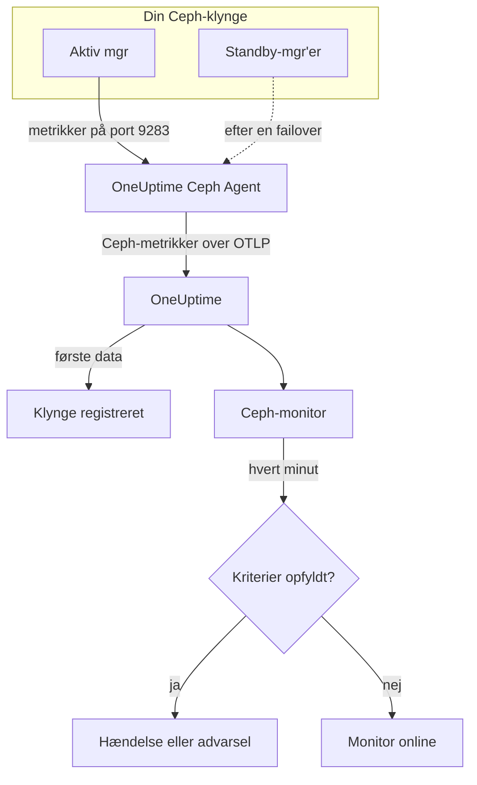

# Ceph-monitor

En Ceph-monitor holder øje med én Ceph-klynge — dens tilstand, health checks, monitorernes quorum, OSD'er, pools og placement groups — og giver dig besked i det øjeblik, tilstanden forværres, en OSD går ned, eller kapaciteten bliver knap. Den læser de `ceph_*`-metrikker, som Ceph-mgr'ens `prometheus`-modul eksporterer, og som OneUptime Ceph Agent indsamler, så intet afprøves udefra.

:::cards
- [Opret monitoren](#opret-en-ceph-monitor): Seks trin i dashboardet.
- [Skabeloner](#færdige-alarmskabeloner): 23 færdige alarmer for tilstand, OSD'er, placement groups og kapacitet.
- [Health checks](#serier-for-health-checks): Få alarm på ethvert Ceph-health check efter navn.
- [Metrikker](#indsamlede-metrikker): Hver `ceph_*`-serie, monitoren kan alarmere på.
:::

## Sådan virker det

Ceph-mgr'ens `prometheus`-modul stiller klyngens metrikker til rådighed på port 9283. OneUptime Ceph Agent henter fra hver mgr-dæmon hvert 30. sekund — den aktive svarer, standby'erne returnerer intet, indtil de tager over —, beholder Cephs egne labels (`ceph_daemon`, `pool_id`) og sender metrikkerne til OneUptime over OTLP, mærket med klyngens navn, `ceph.cluster.name`. De første data registrerer klyngen.

En Ceph-monitor hører til én klynge. Hvert minut kører den sin forespørgsel på den klynges metrikker og sammenligner resultatet med sine kriterier.



## Før du begynder

- **Aktivér mgr'ens `prometheus`-modul** på klyngen:

  ```bash
  ceph mgr module enable prometheus
  ```

- **Installér Ceph Agent** på en maskine, der kan nå hver mgr-dæmon på port 9283, og angiv dem alle i `CEPH_MGR_ENDPOINTS`. [Vejledningen til Ceph Agent](/docs/telemetry/ceph) beskriver installationen.
- **Tjek, at klyngen er registreret.** Den vises under **Produkter → Infrastruktur → Ceph → Alle klynger**, navngivet efter agentens `CEPH_CLUSTER_NAME`, cirka et minut efter første hentning.
- **Til alarmer på health checks** skal du køre Ceph Quincy eller nyere. Ældre udgaver eksporterer ikke `ceph_health_detail`.

## Opret en Ceph-monitor

:::steps
### Start en ny monitor

Gå til **Monitorer**, og klik på **Opret monitor**.

### Vælg Ceph

Klik på **Flere monitortyper** under **Monitortype**, og vælg **Ceph** under **Infrastruktur**, eller skriv `ceph` i søgefeltet. Angiv et **Navn** — det bruges i titlerne på hændelser og advarsler — og klik på **Næste**.

### Vælg klyngen

Vælg klyngen i **Ceph Cluster** under **Ceph Monitor Configuration**. Alle klynger, der har sendt data, står på listen.

### Vælg, hvad der skal overvåges

Vælg en af de tre faner:

- **Quick Setup** — klik på en [skabelon](#færdige-alarmskabeloner). Den indstiller metrikker, filtre, aggregering, tidsinterval og tærskler og erstatter kriterierne nedenfor med sine egne. Du kan stadig ændre **Tidsinterval**.
- **Custom Metric** — vælg én metrik i **Ceph Metric**, og indstil derefter **Aggregering** og **Tidsinterval**. **OSD** og **Pool ID** indsnævrer den til én dæmon eller pool.
- **Avanceret** — byg selv forespørgsler og formler under **Vælg målinger**, for eksempel et forhold for brugt kapacitet ud fra `ceph_cluster_total_used_bytes / ceph_cluster_total_bytes`. Brug **Group by** `ceph_daemon` eller `pool_id` for at vurdere hver dæmon eller pool for sig.

### Tjek kriterierne

Åbn hvert kriterium under **Monitorkriterier**, og tjek **Metrik**, **Aggregering**, **Betingelse** og **Threshold**. En skabelon udfylder dem. Med **Custom Metric** eller **Avanceret** starter monitoren med [standardkriterierne](#standardkriterier), der kun opdager, at en metrik falder til nul, så sæt din egen tærskel.

### Opret monitoren

Klik på **Opret monitor**. OneUptime åbner monitorens side og evaluerer den hvert minut. Hændelser og advarsler, den rejser, vises også på klyngens sider **Hændelser** og **Advarsler**.
:::

> [!TIP]
> For at oprette flere skabeloner på én gang skal du åbne klyngen fra **Produkter → Infrastruktur → Ceph** og gå til **Recommendations**. Vælg de skabeloner, du vil have, og hvem der kaldes, så opretter OneUptime én monitor pr. skabelon.

## Monitorindstillinger

| Felt | Fane | Hvad det gør |
| --- | --- | --- |
| **Ceph Cluster** | Alle | Påkrævet. Begrænser hver forespørgsel til `resource.ceph.cluster.name`. |
| **OSD** | Custom Metric, Avanceret | Valgfri. Eksakt match på labelen `ceph_daemon`, for eksempel `osd.3`. |
| **Pool ID** | Custom Metric, Avanceret | Valgfri. Eksakt match på labelen `pool_id`, for eksempel `2`. |
| **Ceph Metric** | Custom Metric | Én metrik fra [kataloget](#indsamlede-metrikker). |
| **Aggregering** | Custom Metric | Hvordan målinger kombineres: **Gennemsnit**, **Maksimum**, **Minimum**, **Sum** eller **Antal**. Starter med metrikkens sædvanlige aggregering. |
| **Tidsinterval** | Alle | Det glidende vindue, forespørgslen læser, fra **Past 1 Minute** til **Past 365 Days**. En ny monitor starter på **Past 1 Minute**; skabeloner sætter deres eget. |
| **Vælg målinger** | Avanceret | Forespørgselsbyggeren: **Metrik**, **Aggregate by**, **Filter by attributes**, **Group by**, plus **Tilføj metrik** og **Tilføj formel** til at kombinere forespørgsler. |

Pools dataserier har kun labelen `pool_id`: Poolens navn findes kun på `ceph_pool_metadata`. Filtrér og gruppér poolserier efter `pool_id`, og slå navnet op i `ceph_pool_metadata`, når du har brug for det.

### Serier for health checks

`ceph_health_detail` eksporterer **én serie pr. aktivt health check**, med labelerne `name` (for eksempel `OSD_NEARFULL` eller `RECENT_CRASH`) og `severity`. En serie findes kun, mens dens check udløses, så ingen serie betyder sund. For at få alarm på et hvilket som helst Ceph-health check filtrerer du på dets `name`, udløser på **Maksimum** over `0` og genopretter ved `0` med **Hvis ingen data** sat til **Treat As Zero** — præcis sådan er skabelonerne for health checks bygget. `ceph_daemon_health_metrics` virker på samme måde pr. dæmon, med en `type`-label (for eksempel `SLOW_OPS`) og `ceph_daemon`.

## Færdige alarmskabeloner

**Quick Setup** tilbyder 23 skabeloner, der dækker klyngens tilstand, OSD'er, placement groups og kapacitet. Hver bygger en komplet monitor — forespørgsler, labelfiltre, en gruppering, et kriterium, der udløser, og et, der genopretter. Tærsklerne er udgangspunkter, du kan redigere.

Skabeloner læser de seneste 5 minutter, medmindre tabellen siger andet. Et kriterium udløses kun, når betingelsen gælder i hvert minut af dets vindue, og et tærskelkriterium genopretter først 10 % forbi sin tærskel, så en værdi, der svinger omkring grænsen, ikke blafrer. **Alvorlighed** er den label, vælgeren viser; hændelsen og advarslen, en skabelon opretter, starter med projektets højeste hændelses- og advarselsalvorlighed.

### Skabeloner for klyngens tilstand

| Skabelon | Alvorlighed | Overvåger | Udløses, når | Genopretter, når |
| --- | --- | --- | --- | --- |
| Cluster Health Error | Kritisk | `ceph_health_status`, Max, seneste minut | 2 eller mere: `HEALTH_ERR` | Under 1,8: `HEALTH_WARN` eller bedre |
| Cluster Health Warning | Warning | `ceph_health_status`, Max | 1 eller mere: `HEALTH_WARN` eller værre | Under 0,9: `HEALTH_OK` |
| Monitor Quorum Degraded | Kritisk | `ceph_mon_quorum_status`, Min pr. `ceph_daemon`, seneste minut | En monitor falder under 1, ude af quorum. Én hændelse pr. monitor | Tilbage på 1 |
| Slow Operations | Warning | `ceph_healthcheck_slow_ops`, Max | Over 0: Klyngens `SLOW_OPS`-check er aktivt | På 0 |
| Daemon Slow Operations | Warning | `ceph_daemon_health_metrics` for `type = SLOW_OPS`, Max pr. `ceph_daemon` | Over 0. Én hændelse pr. OSD eller monitor | Serien forsvinder |
| Daemon Crash | Kritisk | `ceph_health_detail` for `name = RECENT_CRASH`, Max | Checket er aktivt: Der findes ikke-arkiverede dæmonnedbrud. Mgr'en har ingen `ceph_crash_*`-metrik, så dette er det eneste signal om nedbrud | Nedbruddene arkiveres |
| Monitor Clock Skew | Warning | `ceph_health_detail` for `name = MON_CLOCK_SKEW`, Max | Checket er aktivt: Monitorernes ure afviger mere end tilladt (standard 0,05 s) | Checket forsvinder |
| Monitor Disk Critically Low | Kritisk | `ceph_health_detail` for `name = MON_DISK_CRIT`, Max | Checket er aktivt: En monitors databasedisk har under 5 % ledigt (standard) | Checket forsvinder |
| Monitor Disk Space Low | Warning | `ceph_health_detail` for `name = MON_DISK_LOW`, Max | Checket er aktivt: under 30 % ledigt (standard) | Checket forsvinder |

### OSD-skabeloner

| Skabelon | Alvorlighed | Overvåger | Udløses, når | Genopretter, når |
| --- | --- | --- | --- | --- |
| OSD Down | Kritisk | `ceph_osd_up`, Min pr. `ceph_daemon` | En OSD falder under 1. Én hændelse pr. OSD | Tilbage på 1 |
| OSD Out | Warning | `ceph_osd_in`, Min pr. `ceph_daemon` | En OSD falder under 1: taget ud af datafordelingen | Tilbage på 1 |
| OSD High Latency | Warning | `ceph_osd_apply_latency_ms`, Avg pr. `ceph_daemon` | Over 100 ms. Én hændelse pr. OSD | På eller under 90 ms |
| OSD Slow Heartbeats | Warning | `ceph_health_detail` for `name = OSD_SLOW_PING_TIME_FRONT` og `name = OSD_SLOW_PING_TIME_BACK`, Max | Et af checkene er aktivt: Heartbeats på det offentlige netværk eller klyngenetværket er langsomme. Mgr'en eksporterer ingen måling af ping-tid | Begge checks forsvinder |

### Skabeloner for placement groups

| Skabelon | Alvorlighed | Overvåger | Udløses, når | Genopretter, når |
| --- | --- | --- | --- | --- |
| Inactive Placement Groups | Kritisk | `ceph_pg_total` − `ceph_pg_active`, Max pr. `pool_id` | Over 0: PG'er kan ikke håndtere I/O, så klientforespørgsler til dem hænger. Én hændelse pr. pool | På 0 |
| Degraded Placement Groups | Warning | `ceph_pg_degraded`, Max pr. `pool_id` | Over 0: Objekter har færre replikaer end konfigureret | På 0 |
| Undersized Placement Groups | Warning | `ceph_pg_undersized`, Max pr. `pool_id` | Over 0: PG'er ligger på færre OSD'er end deres antal replikaer | På 0 |
| Damaged Placement Groups | Kritisk | `ceph_health_detail` for `name = PG_DAMAGED` og `name = OSD_SCRUB_ERRORS`, Max | Et af checkene er aktivt: Scrubbing har fundet skader eller læsefejl | Begge checks forsvinder |

### Kapacitetsskabeloner

| Skabelon | Alvorlighed | Overvåger | Udløses, når | Genopretter, når |
| --- | --- | --- | --- | --- |
| Cluster Near Full | Warning | `ceph_cluster_total_used_bytes` ÷ `ceph_cluster_total_bytes` × 100 | Over 85 %, Cephs standard-nearfull-forhold | På eller under 76,5 % |
| Cluster Full | Kritisk | Samme forhold | Over 95 %, Cephs standard-full-forhold, hvor skrivning stopper i hele klyngen | På eller under 85,5 % |
| Pool Near Full | Warning | `ceph_pool_stored` ÷ (`ceph_pool_stored` + `ceph_pool_max_avail`) × 100, pr. `pool_id` | Over 85 % af, hvad poolen kan rumme. Én hændelse pr. pool | På eller under 76,5 % |
| OSD Nearfull | Warning | `ceph_health_detail` for `name = OSD_NEARFULL`, Max | Checket er aktivt: En OSD har passeret nearfull-tærsklen (standard 85 %). Enkelte OSD'er fyldes længe før klyngens gennemsnit | Checket forsvinder |
| OSD Backfillfull | Warning | `ceph_health_detail` for `name = OSD_BACKFILLFULL`, Max | Checket er aktivt: Backfill til OSD'en afvises (standard 90 %), så genopretningen går i stå | Checket forsvinder |
| OSD Full | Kritisk | `ceph_health_detail` for `name = OSD_FULL`, Max, seneste minut | Checket er aktivt: En OSD har nået full-tærsklen (standard 95 %), og skrivning afvises | Checket forsvinder |

- **Skabeloner for nedbrud og quorum bruger minimum**, så én nede OSD eller én monitor uden for quorum udløser dem i stedet for at blive skjult af det sunde flertal.
- **Optællings- og health check-skabeloner bruger maksimum**, så én dårlig hentning er nok.
- **PG- og poolserier er pr. pool**: Der er ingen måling for hele klyngen, så disse skabeloner grupperer efter `pool_id` og åbner én hændelse pr. pool.
- **Kapacitetsforhold** tager **Sum** af begge sider. Begge kommer fra samme hentning fra mgr'en, så resultatet er en ægte procentdel. **Inactive Placement Groups** bruger i stedet **Maksimum** pr. pool, fordi en sum ville lægge hentningerne sammen i en subtraktion.
- **Health check-skabeloner** genopretter, når checket forsvinder: Deres genopretningskriterier tæller en manglende serie som 0.

Nogle alarmer har ingen skabelon. Skævt fordelte PG'er kræver statistik på tværs af serier, som kriterier ikke kan beregne. Kapacitetsprognoser kræver en vækstkurve, som klyngens dashboard tegner i stedet. Forudsigelse af diskfejl og forsinket scrubbing har ingen mgr-metrik, og NVMe-oF, RBD-spejling og cephadm kræver andre eksportører.

## Indsamlede metrikker

Agenten henter fra hver mgr-dæmon hvert 30. sekund og beholder Cephs egne labels, så serier pr. dæmon har `ceph_daemon` (`osd.3`, `mon.a`), og serier pr. pool har `pool_id`.

### Metrikker for klyngens tilstand

| Metrik | Enhed | Beskrivelse |
| --- | --- | --- |
| `ceph_health_status` | — | Samlet tilstand: 0 = `HEALTH_OK`, 1 = `HEALTH_WARN`, 2 = `HEALTH_ERR`. |
| `ceph_health_detail` | antal | Én serie pr. **aktivt** health check, med labelerne `name` og `severity`. Kun fra Quincy. |
| `ceph_healthcheck_slow_ops` | antal | Langsomme OSD- og monitoroperationer, som checket `SLOW_OPS` rapporterer. |
| `ceph_daemon_health_metrics` | antal | Tilstandsmetrikker pr. dæmon med `type` (for eksempel `SLOW_OPS`) og `ceph_daemon`. |
| `ceph_mon_quorum_status` | antal | 1, når monitoren er i quorum, pr. `ceph_daemon` (for eksempel `mon.a`). |
| `ceph_mon_metadata` | antal | Monitorens metadata, altid 1. Læg dem sammen for at tælle monitorer. |
| `ceph_cluster_total_bytes` | bytes | Samlet rå kapacitet. |
| `ceph_cluster_total_used_bytes` | bytes | Rå kapacitet i brug. |

### OSD-metrikker

| Metrik | Enhed | Beskrivelse |
| --- | --- | --- |
| `ceph_osd_up` | antal | 1, når OSD'en kører, pr. `ceph_daemon` (for eksempel `osd.3`). |
| `ceph_osd_in` | antal | 1, når OSD'en er med i datafordelingen. |
| `ceph_osd_apply_latency_ms` | ms | Tid til at anvende en operation på det underliggende lager. |
| `ceph_osd_commit_latency_ms` | ms | Tid til at gemme en operation i journalen eller WAL. |
| `ceph_osd_stat_bytes` | bytes | Rå kapacitet for OSD'ens enhed. |
| `ceph_osd_stat_bytes_used` | bytes | Rå bytes brugt på OSD'en. Sammenlign med totalen for at finde skævt fyldte eller næsten fulde OSD'er. |
| `ceph_osd_numpg` | antal | Placement groups på OSD'en. |
| `ceph_osd_metadata` | antal | OSD'ens metadata (værtsnavn, enhedsklasse, version), altid 1. Læg dem sammen for at tælle OSD'er. |

### Poolmetrikker

| Metrik | Enhed | Beskrivelse |
| --- | --- | --- |
| `ceph_pool_stored` | bytes | Brugerdata gemt i poolen. |
| `ceph_pool_max_avail` | bytes | Bytes, der stadig kan skrives til poolen, givet dens replikerings- eller erasure coding-profil. |
| `ceph_pool_objects` | antal | Objekter i poolen. |
| `ceph_pool_rd` | ops | Læseoperationer på poolen. En tæller over hele levetiden. |
| `ceph_pool_wr` | ops | Skriveoperationer på poolen. En tæller over hele levetiden. |
| `ceph_pool_rd_bytes` | bytes | Bytes læst fra poolen. En tæller over hele levetiden. |
| `ceph_pool_wr_bytes` | bytes | Bytes skrevet til poolen. En tæller over hele levetiden. |
| `ceph_pool_metadata` | antal | Poolens metadata, altid 1 — den eneste serie, der knytter `pool_id` til et navn. |

### Metrikker for placement groups

Hver `ceph_pg_*`-serie er pr. pool, med labelen `pool_id`; læg sammen på tværs af pools for et tal for hele klyngen.

| Metrik | Enhed | Beskrivelse |
| --- | --- | --- |
| `ceph_pg_total` | antal | Placement groups i poolen. |
| `ceph_pg_active` | antal | PG'er i tilstanden `active`, der kan håndtere I/O. |
| `ceph_pg_clean` | antal | PG'er i tilstanden `clean`, fuldt replikeret. |
| `ceph_pg_degraded` | antal | PG'er i tilstanden `degraded`. |
| `ceph_pg_undersized` | antal | PG'er i tilstanden `undersized`. |
| `ceph_num_objects_degraded` | antal | Objekter med færre replikaer end konfigureret. |
| `ceph_num_objects_misplaced` | antal | Objekter, der ikke ligger, hvor CRUSH vil have dem. Dataene er sikre; kun placeringen er forkert. |

## Overvågningskriterier

Et kriterium sammenligner en af monitorens forespørgsler eller formler med en tærskel. En Ceph-monitors kriterier har ingen **Filtertype**: Hver regel tjekker metrikkens værdi med disse felter.

| Felt | Hvad det gør |
| --- | --- |
| **Metrik** | Forespørgslen eller formlen, der tjekkes, efter dens variabelnavn. |
| **Aggregering** | Hvordan værdierne i vinduet bliver til ét svar: **Gennemsnit**, **Sum**, **Maximum Value**, **Minimum Value**, **All Values** (hver værdi skal matche) eller **Any Value** (én er nok). |
| **Betingelse** | **Greater Than**, **Less Than**, **Greater Than Or Equal To**, **Less Than Or Equal To** eller **Equal To** — eller en anomalibetingelse: **Anomalously High**, **Anomalously Low** eller **Anomalous**. |
| **Threshold** | Værdien, der sammenlignes med. Ved siden af står en enhedsliste, når metrikken har en enhed. Vises ikke ved anomalibetingelser. |
| **Følsomhed** | Kun anomalibetingelser. **Low** (4σ), **Medium** (3σ, standard) eller **High** (2σ). |
| **Baseline-vindue** | Kun anomalibetingelser. 14 dage (standard), 28, 60 eller 90 dages historik. |
| **Hvis ingen data** | Under **Flere felter**. Hvad der sker, når vinduet ikke har nogen målinger: **Ignore** (standard), **Treat As Zero** eller **Trigger**. |

Anomalibetingelser sammenligner hver værdi med samme time i ugen i baselinen. De bliver i tilstanden "Learning" og rejser intet, indtil baseline-vinduet har nok historik.

Hvert kriterium angiver også, hvad der skal ske, når det matcher: ændre monitorstatus, oprette en advarsel eller erklære en hændelse. Kriterierne tjekkes oppefra og ned, og det første, der matcher, afgør det.

### Standardkriterier

En monitor, du ikke bygger ud fra en skabelon, starter med to kriterier:

| Rækkefølge | Kriterium | Matcher, når | Derefter |
| --- | --- | --- | --- |
| 1 | Check if _monitornavn_ is offline | En værdi i den første forespørgsel er `0` | Sætter monitoren til **Offline** og erklærer hændelsen "_monitornavn_ is offline", som løser sig selv, når monitoren kommer sig. |
| 2 | Check if _monitornavn_ is online | En værdi er over `0` | Sætter monitoren til **I drift**. |

Disse standarder passer til få Ceph-metrikker: `ceph_health_status` er 0, når klyngen er sund. Vælg en skabelon, eller sæt dine egne kriterier.

> [!IMPORTANT]
> Stilhed matcher ingen af de to kriterier: En klynge, der holder op med at sende data, efterlader monitoren, som den var. For at få besked, når data stopper, skal du sætte **Hvis ingen data** til **Trigger** på et kriterium.

## Fejlfinding

:::details Klyngen står ikke på listen Ceph Cluster
Klynger registrerer sig selv ud fra agentens data. Tjek, at agenten kører og sender data (se [vejledningen til Ceph Agent](/docs/telemetry/ceph)), og at `CEPH_CLUSTER_NAME` er sat.
:::

:::details Metrikkerne stoppede efter en mgr-failover
Agenten skal hente fra **hver** mgr-dæmon, ikke kun den aktive: Standby'er returnerer intet, indtil de tager over. Angiv hver mgr i `CEPH_MGR_ENDPOINTS`.
:::

:::details ceph_health_status er 1, men intet udløses
Tjek, at kriteriet bruger **Greater Than Or Equal To** `1` og ikke **Greater Than**, og at monitorens **Tidsinterval** dækker mindst én hentning på 30 sekunder.
:::

:::details Health check-skabeloner udløses aldrig
Skabelonerne, der overvåger `ceph_health_detail` — Daemon Crash, Monitor Clock Skew, OSD Nearfull, OSD Backfillfull, OSD Full, de to skabeloner for monitordiske, Damaged Placement Groups og OSD Slow Heartbeats — kræver mgr'ens `prometheus`-modul fra Quincy eller nyere. Bekræft, mens et check er aktivt, at serien findes:

```bash
curl http://ACTIVE_MGR:9283/metrics | grep ceph_health_detail
```

Serier for health checks, også `ceph_daemon_health_metrics`, findes kun, mens et check udløses, så det er forventeligt ikke at finde nogen, mens klyngen er sund.
:::

:::details Tællere som ceph_pool_wr_bytes vokser kun
Pools I/O-serier er tællere over hele levetiden, og kriterier sammenligner rå værdier: Der er ingen rate-operator, og **Convert to per-second rate** i forespørgselsbyggeren ændrer kun grafen. Vis dem som en rate, eller få alarm på deres vækst med en formel, såsom en **Maksimum**-forespørgsel minus en **Minimum**-forespørgsel af samme tæller.
:::

## Næste trin

:::cards
- [Ceph Agent](/docs/telemetry/ceph): Installér og opgradér agenten, som denne monitor læser.
- [Proxmox-monitor](/docs/monitor/proxmox-monitor): Overvåg den Proxmox VE-klynge, der bruger lageret.
- [Storage-array-monitor](/docs/monitor/storage-array-monitor): Samme slags monitor til Pure Storage-arrays.
- [Hændelser](/docs/incidents/index): Hvad der sker, efter et kriterium har erklæret en hændelse.
:::
