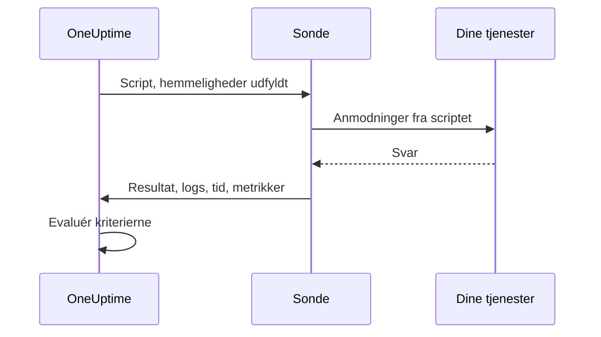

# Brugerdefineret kode-monitor

En monitor med brugerdefineret kode kører et JavaScript-script, som du selv skriver, fra en sonde efter en tidsplan. Brug den til kontroller, som de andre monitortyper ikke kan udtrykke — et login efterfulgt af et godkendt API-kald, en transaktion i flere trin eller en værdi, du beregner ud fra flere svar. Hvis scriptet kaster en fejl, mislykkes kontrollen; det, scriptet returnerer, er tilgængeligt for dine kriterier og dine hændelsesskabeloner.

:::cards
- [Opret monitoren](#opret-en-monitor-med-brugerdefineret-kode): Skriv et script, og vælg de sonder, der kører det.
- [Skriv scriptet](#skriv-scriptet): En kørbar API-kontrol i flere trin at starte fra.
- [Brug hemmeligheder](#brug-af-monitorhemmeligheder): Hold adgangskoder og tokens ude af scriptet.
- [Indsaml brugerdefinerede metrikker](#brugerdefinerede-metrikker): Vis ethvert tal, dit script beregner, i en graf.
:::

## Sådan fungerer det

Ved hver kontrol kører en sonde dit script i en isoleret JavaScript-sandkasse, hvor dine monitorhemmeligheder allerede er udfyldt. Scriptet kalder det, det har brug for, og returnerer derefter et resultat eller kaster en fejl. Sonden rapporterer resultatet, scriptets logmeddelelser, hvor længe det kørte, og de metrikker, det indsamlede, og OneUptime evaluerer dine kriterier ud fra dem.



Sandkassen er ikke Node.js: der er ingen `require`, `process`, `fetch` eller filsystem, kun de [moduler, der står nedenfor](#moduler-der-er-tilgængelige-i-scriptet).

## Før du begynder

- En **sonde**, der kan nå alle de endpoints, scriptet kalder. Brug en [brugerdefineret sonde](/docs/probe/custom-probe) til endpoints inde i dit netværk.
- For at kalde en privat adresse (som `10.0.0.5`) skal sonden tillade det: sæt `PROBE_ALLOW_PRIVATE_NETWORK_MONITORS=true` på den sonde. Loopback-, link-local- og cloudmetadata-adresser afvises altid. Se [Adgang til privat netværk](/docs/self-hosted/private-network-access).
- Alle de adgangskoder, API-nøgler og tokens, scriptet har brug for, gemt som [monitorhemmeligheder](/docs/monitor/monitor-secrets).

## Opret en monitor med brugerdefineret kode

:::steps
### Start en ny monitor

Gå til **Monitorer**, og klik på **Opret monitor**. Under **Monitortype** skal du klikke på **Flere monitortyper** og vælge **Custom JavaScript Code** under **Synthetic Monitoring** eller skrive `script` i søgefeltet. Angiv et **Navn**, og klik derefter på **Næste**.

### Tilføj scriptet

Skriv dit script i editoren **JavaScript-kode**. Start fra [eksemplet nedenfor](#skriv-scriptet).

### Test det

Klik på **Test monitor** for at køre scriptet én gang fra en sonde, og tjek resultatet.

### Gennemgå kriterierne

Monitoren starter med to kriterier: den er offline og erklærer en hændelse, når scriptet mislykkes, og online, når det ikke gør. Ret dem, eller tilføj dine egne — se [Kriterier](#kriterier) — og klik derefter på **Næste**.

### Vælg sonder, og opret

Vælg de **Sonder**, der kan nå dine endpoints, og et **Overvågningsinterval** — monitorer med brugerdefineret kode tilbydes hvert 5. minut eller sjældnere — og klik derefter på **Opret monitor**.
:::

## Skriv scriptet

Scriptet er kroppen af en `async`-funktion: du kan bruge `await` på øverste niveau, returnere et resultat med `return` og få kontrollen til at mislykkes med `throw`. Dette eksempel logger ind, kalder et endpoint med det token, det fik tilbage, og mislykkes, hvis svaret ikke er, hvad det forventer:

```javascript title="Custom code monitor script"
// 1. Log in. axios rejects a 4xx or 5xx response, which fails the check.
const login = await axios.post("https://api.example.com/v1/login", {
  username: "monitoring@example.com",
  password: "{{monitorSecrets.ApiPassword}}",
});

// 2. Call an endpoint that needs the token.
const orders = await axios.get("https://api.example.com/v1/orders?limit=10", {
  headers: { Authorization: `Bearer ${login.data.token}` },
  timeout: 10000,
});

// 3. Fail the check when the data is wrong, not only when the request fails.
if (!Array.isArray(orders.data.items)) {
  throw new Error("The orders endpoint returned no items");
}

console.log(`Fetched ${orders.data.items.length} orders`);

// 4. Return what the criteria and incident templates should see.
return {
  data: orders.data.items.length,
};
```

| For at | Gør dette | Hvad OneUptime registrerer |
| --- | --- | --- |
| Rapportere et resultat | `return { data: ... }` med en vilkårlig JSON-værdi | **Resultat**. Kun egenskaben `data` gemmes: `return 5` registrerer intet resultat. |
| Få kontrollen til at mislykkes | `throw new Error("...")` | **Scriptfejl**, som standardkriterierne gør til en hændelse. |
| Efterlade et spor | `console.log(...)` | **Logmeddelelser**, op til 1.000 pr. kørsel. |

For at se en kørsel skal du åbne monitorens **Oversigt**: kortet **Monitor-resumé** viser sonden, udførelsestiden og fejlen, og **Vis flere detaljer** viser resultatet, scriptfejlen og logmeddelelserne. **Overvågningslogs** har det samme resumé for tidligere kontroller.

> [!NOTE]
> `axios` i denne sandkasse følger ikke omdirigeringer, og dens anmodninger går ikke gennem en proxy, der er konfigureret på sonden. Anmod om den endelige URL.

## Brug af monitorhemmeligheder

Henvis til en hemmelighed som `{{monitorSecrets.NAME}}` hvor som helst i scriptet. OneUptime erstatter henvisningen med hemmelighedens værdi, som ren tekst, før scriptet når sonden. Sæt derfor en hemmelighed i anførselstegn for at bruge den som en streng, og lad den stå uden anførselstegn for at bruge den som et tal eller en boolesk værdi:

```javascript
// Used as a string: wrap it in quotes.
const apiKey = "{{monitorSecrets.ApiKey}}";

// Used as a number or a boolean: leave it bare.
const retryLimit = {{monitorSecrets.RetryLimit}};
const verbose = {{monitorSecrets.Verbose}};

// Check the secret was filled in without logging the secret itself.
console.log(apiKey.length > 0);
```

En hemmelig værdi, der indeholder et anførselstegn, ødelægger strengen omkring den. En henvisning, som monitoren ikke må bruge, bliver stående i scriptet, som den er skrevet. Se [Monitorhemmeligheder](/docs/monitor/monitor-secrets) for at oprette en hemmelighed og vælge, hvilke monitorer der må bruge den.

## Brugerdefinerede metrikker

Du kan indsamle brugerdefinerede metrikker fra dit script med funktionen `oneuptime.captureMetric()`. Disse metrikker gemmes i OneUptime og kan vises i grafer på dashboards med Metric Explorer.

```javascript
oneuptime.captureMetric(name, value, attributes);
```

| Parameter | Type | Beskrivelse |
| --- | --- | --- |
| `name` | string, påkrævet | Metrikkens navn (f.eks. `"api.response.time"`). Det gemmes automatisk med præfikset `custom.monitor.`. |
| `value` | number, påkrævet | Metrikkens numeriske værdi. En værdi, der ikke er et tal, ignoreres. |
| `attributes` | object, valgfri | Nøgle-værdi-par med ekstra kontekst. Strenge, tal og booleske værdier registreres (tal og booleske værdier gemmes som tekst, fordi metrikattributter er dimensioner og ikke målinger). Værdier af enhver anden type ignoreres. |

### Eksempel

```javascript
const response = await axios.get("https://api.example.com/health");

// Capture a simple metric
oneuptime.captureMetric("api.response.time", response.data.latency);

// Capture a metric with attributes
oneuptime.captureMetric("api.queue.depth", response.data.queueDepth, {
  region: "us-east-1",
  environment: "production",
});

return {
  data: response.data,
};
```

Når de er indsamlet, vises disse metrikker i Metric Explorer under navne som `custom.monitor.api.response.time` og på monitorens side **Metrikker** under **Brugerdefinerede metrikker**. OneUptime føjer monitoren og sonden til hvert datapunkt, så du kan vise dem i grafer, advare på dem og filtrere efter monitor, sonde eller de brugerdefinerede attributter, du har angivet.

### Grænser

| Grænse | Værdi | Over grænsen |
| --- | --- | --- |
| Metrikker pr. scriptkørsel | 100 | Yderligere kald ignoreres. |
| Længde på metriknavn | 200 tegn | Navnet afkortes. |
| Attributter pr. metrik | 50 | Yderligere attributter droppes. |
| Længde på attributnøgle | 200 tegn | Nøglen afkortes. |
| Længde på attributværdi | 1000 tegn | Værdien afkortes. |

### Reserverede attributnøgler

Nogle attributnavne tilhører OneUptime selv, og et script kan ikke skrive dem. Hvis dit script sætter et af dem, droppes attributten — selve metrikken registreres stadig — og en advarsel med nøglens navn skrives i OneUptimes serverlogs. Det drejer sig om:

- Monitorens identitet: `monitorId`, `projectId`, `monitorName`, `probeName`, `probeId`, `isCustomMetric`.
- Alt i navnerummene `oneuptime.` eller `resource.` — de bærer de identifikatorer, OneUptime påfører ved indtagelse.
- Attributter for ressourceidentitet: `service.name`, `host.name`, `k8s.cluster.name`, `iot.fleet.name`, `proxmox.cluster.name`, `vmware.vcenter.name`, `ceph.cluster.name`, `storage.array.name` og `docker.swarm.cluster.name`.

Disse navne er ikke bare etiketter — OneUptime læser dem tilbage som en påstand om, hvilken ressource et datapunkt tilhører. En metrik mærket `service.name: payments-api` ville dukke op på den tjenestes fane Metrikker, og hvis du senere byggede en metrikmonitor grupperet efter `service.name`, ville dens advarsler blive knyttet til den tjeneste, tilkalde tjenestens ejere og tie under et vedligeholdelsesvindue på den. Brug i stedet monitorens egne etiketter for at knytte en monitor til en tjeneste eller en vært.

## Kriterier

Kriterierne for en monitor med brugerdefineret kode kan tjekke:

| Filtertype | Hvad den tjekker | Filterbetingelser |
| --- | --- | --- |
| **Fejl** | Den fejl, scriptet kastede, hvis nogen. | Indeholder, Not Contains, Equal To, Not Equal To, Is Empty, Is Not Empty |
| **Result Value** | De `data`, scriptet returnerede. Sammenlignes som et tal, når det er et. | De samme plus Greater Than, Less Than, Greater Than Or Equal To, Less Than Or Equal To, Sand og Falsk |
| **Udførelsestid (i ms)** | Hvor længe scriptet kørte. | Numeriske sammenligninger |

Standardkriterierne markerer monitoren som online, når **Fejl** er tom, og som offline — med en hændelse, der løser sig selv, når scriptet lykkes igen — når den ikke er. I hændelses- og advarselsskabeloner er kørslen tilgængelig som `{{result}}`, `{{scriptError}}`, `{{logMessages}}` og `{{executionTimeInMs}}`: se [Hændelse- og advarselsskabeloner](/docs/monitor/incident-alert-templating).

### Advarsler på de returnerede data

Det, scriptet returnerer som `data`, er monitorens **Result Value**, og et kriterium kan sammenligne det — for eksempel _Result Value is Equal To `UP`_.

Når `data` er et objekt eller et array, skal du udfylde **Feltsti (valgfri)** på Result Value-filteret for at sammenligne ét felt i stedet for hele værdien. Brug punktummer til indlejrede felter og `[n]` til elementer i et array:

```javascript
const response = await axios.get("https://api.example.com/health");

return {
  data: {
    status: response.data.status, // "UP"
    cpu_busy_percent: response.data.cpu, // 42
    healthy: response.data.healthy, // true
    checks: response.data.checks, // [{ name: "db", latency: 12 }]
  },
};
```

| Feltsti | Sammenligner | Eksempel på betingelse |
| --- | --- | --- |
| `status` | `"UP"` | Not Equal To `UP` |
| `cpu_busy_percent` | `42` | Greater Than `90` |
| `healthy` | `true` | Falsk |
| `checks[0].latency` | `12` | Greater Than `500` |

Tilføj ét filter pr. felt, du vil tjekke; hvert filter kan have sin egen betingelse og værdi.

- Lad feltstien være tom for at sammenligne hele værdien, som for et script, der returnerer et enkelt tal eller en enkelt streng.
- Greater Than, Less Than og de andre talbetingelser matcher kun et tal, så returnér et felt som `42`, ikke `"42"`. Sand og Falsk matcher kun en boolesk værdi.
- Et felt, der ikke findes i de returnerede data — en manglende nøgle eller et arrayindeks ud over enden — sammenlignes som tomt: **Is Empty** matcher det, og ingen anden betingelse gør.
- Et felt, hvis navn indeholder et punktum, kan ikke nås med en sti.
- I Terraform sætter filterets `custom_code_monitor_options` feltstien: se [Monitortrin](/docs/terraform/monitor-steps#comparing-one-field-of-a-scripts-result).

## Moduler, der er tilgængelige i scriptet

| Navn | Hvad det er |
| --- | --- |
| `axios` | En promise-baseret HTTP-klient: kald `axios(...)` eller `axios.get`, `post`, `put`, `patch`, `delete`, `head`, `options`, `request` og `create`. Størrelsen på anmodninger og svar er begrænset (10 MB hver), omdirigeringer følges ikke, og en sondes proxy bruges ikke. |
| `crypto` | `createHash` og `createHmac` (kald `update()` én gang og derefter `digest()`), `randomBytes`, `randomInt` og `randomUUID`. Det er ikke Node.js' `crypto`-modul: der er ingen ciphers eller signaturer. |
| `http`, `https` | Kun deres klasse `Agent`, til at give videre til `axios` — for eksempel `httpsAgent: new https.Agent({ rejectUnauthorized: false })`. Der er ingen `request` eller `get`. |
| `console.log` | Logger data til fejlsøgning. Kun `console.log` findes; `console.error` og de andre gør ikke. |
| `oneuptime.captureMetric` | Indsamler en brugerdefineret metrik. Se [Brugerdefinerede metrikker](#brugerdefinerede-metrikker). |
| `setTimeout`, `clearTimeout`, `sleep(ms)` | Vent inde i scriptet. En forsinkelse løber aldrig ud over scriptets timeout. |

## Ting at overveje

- **Timeout.** Et script, der kører længere end 60 sekunder, stoppes, og kontrollen mislykkes med "Script execution timed out". På en selvhostet sonde ændrer `PROBE_CUSTOM_CODE_MONITOR_SCRIPT_TIMEOUT_IN_MS` grænsen.
- **Hukommelse.** Hver kørsel får sin egen sandkasse med en hukommelsesgrænse på 128 MB.
- **Omdirigeringer.** `axios` følger dem ikke, så en URL, der omdirigerer, får anmodningen til at mislykkes. Brug den endelige URL.

## Fejlfinding

:::details Kontrollen mislykkes med "Script execution timed out"
Scriptet kørte længere end tidsgrænsen. Giv hver anmodning sin egen `timeout` (i millisekunder), så et langsomt endpoint fejler hurtigt med en fejl, der nævner det.
:::

:::details En anmodning mislykkes med status 301 eller 302
`axios` følger ikke omdirigeringer her. Ret URL'en til den adresse, der omdirigeres til.
:::

:::details En anmodning til en intern adresse afvises
Sonden tillader ikke adresser i private netværk. Sæt `PROBE_ALLOW_PRIVATE_NETWORK_MONITORS=true` på en sonde inde i dit netværk, og kør monitoren fra den — se [Adgang til privat netværk](/docs/self-hosted/private-network-access).
:::

:::details En hemmelighed bliver ikke udfyldt
Monitoren må ikke bruge hemmeligheden, eller navnet i henvisningen svarer ikke nøjagtigt til hemmelighedens navn. Se [Monitorhemmeligheder](/docs/monitor/monitor-secrets).
:::

## Næste trin

:::cards
- [Syntetisk monitor](/docs/monitor/synthetic-monitor): Styr en rigtig browser i stedet for at kalde API'er.
- [Monitorhemmeligheder](/docs/monitor/monitor-secrets): Gem de legitimationsoplysninger, dit script bruger.
- [Hændelse- og advarselsskabeloner](/docs/monitor/incident-alert-templating): Sæt scriptets resultat og logs ind i hændelser.
:::
