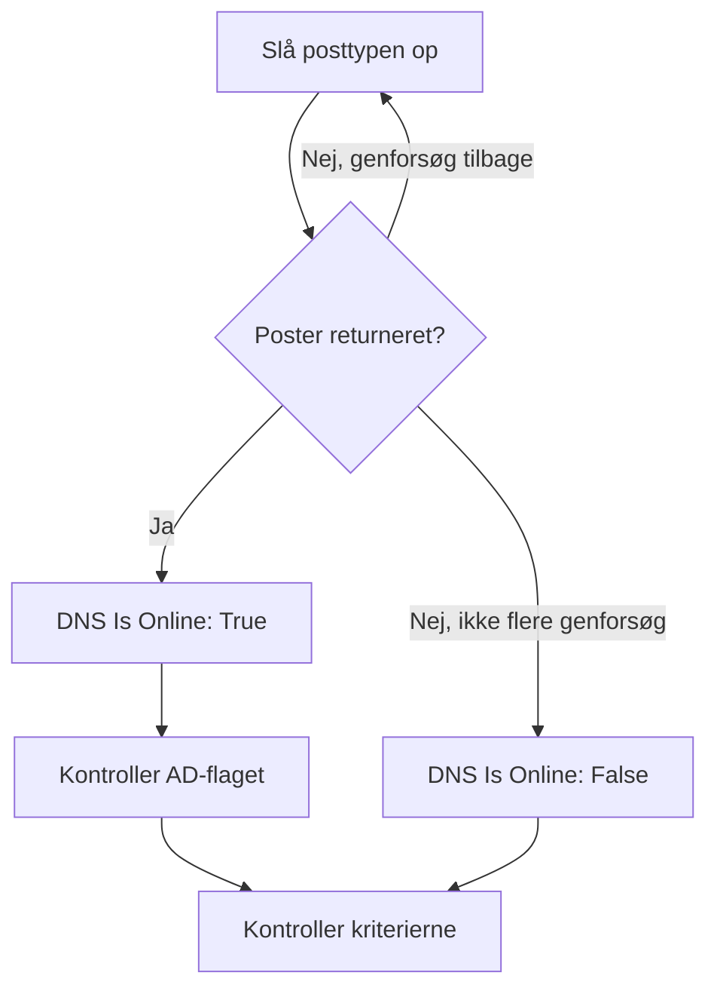

# DNS-monitor

En DNS-monitor slår en DNS-post op efter en tidsplan og kontrollerer svaret: at navnet kan slås op, hvor hurtigt, og hvad posterne siger. Brug den til at opdage et DNS-nedbrud, en post der er ændret eller forsvundet, eller en langsom resolver, før dine brugere opdager det.

:::cards
- [Opret monitoren](#opret-en-dns-monitor): Seks trin i dashboardet.
- [Konfigurationsmuligheder](#konfigurationsmuligheder): Navnet, posttypen og DNS-serveren.
- [Overvågningskriterier](#overvågningskriterier): Opslag, poster, svartid og DNSSEC.
- [Fejlfinding](#fejlfinding): Når monitoren og `dig` er uenige.
:::

## Sådan virker det

Ved hver kontrol beder en sonde en DNS-server om én posttype for ét navn, for eksempel `A`-posterne for `example.com`. Navnet er online, når serveren svarer med mindst én post af den type. En forespørgsel, der fejler, får timeout eller ikke returnerer nogen post, prøves igen et sekund senere, op til det antal genforsøg, du angiver. Derefter spørger sonden en validerende resolver, om svaret bærer DNSSEC's authenticated-data-flag (AD), og OneUptime vurderer resultatet med monitorens kriterier.



En sonde, der har mistet sin egen netværksforbindelse, rapporterer intet resultat og kan derfor ikke markere din DNS som offline.

## Før du starter

- **En rolle, der kan oprette monitorer**: Project Owner, Project Admin, Project Member, Monitor Admin eller Monitor Member eller en brugerdefineret rolle med tilladelsen Create Monitor.
- **En sonde, der kan nå DNS-serveren.** Dit projekts standardsonder vælges for hver ny monitor. For at slå op i en DNS-server på et privat netværk, for eksempel en intern resolver, skal du bruge en [brugerdefineret sonde](/docs/probe/custom-probe) i det netværk.

## Opret en DNS-monitor

:::steps
### Start en ny monitor

Gå til **Monitorer**, og klik på **Opret monitor**. Klik på **Flere monitortyper** under **Monitortype**, og vælg **DNS** under **DNS Monitoring**.

### Navngiv den

Indtast et **Navn**, for eksempel `example.com A records`, og klik derefter på **Næste**.

### Indtast forespørgslen

Indtast det **Domænenavn**, der skal slås op, for eksempel `example.com`, og vælg dets **Posttype**. For at spørge en bestemt server skal du indtaste den i **DNS-server (valgfri)**; lad feltet være tomt for at bruge sondens egen resolver.

### Test den

Klik på **Test monitor**, vælg en sonde under **Vælg sonde**, og klik på **Kør test**. **Overvågningstestresultat** viser de poster, sonden fik tilbage.

### Gennemgå kriterierne

**Monitorkriterier** starter med [standardkriterierne](#standardkriterier): offline, når navnet ikke kan slås op, online, når det kan. For at kontrollere, hvad posterne siger, skal du tilføje et filter **DNS Record Value** og derefter klikke på **Næste**.

### Vælg sonder, og opret

Behold eller skift **Sonder** og **Overvågningsinterval** (det starter på **Hvert 5. minut**), og klik derefter på **Opret monitor**. Monitorens side åbnes.
:::

## Konfigurationsmuligheder

| Felt | Standard | Hvad du skal angive |
| --- | --- | --- |
| **Domænenavn** | Ingen | Navnet, der slås op, for eksempel `example.com` eller `_sip._tcp.example.com`. For en `PTR`-post det omvendte navn, for eksempel `34.216.184.93.in-addr.arpa`. |
| **Posttype** | `A` | Den posttype, der slås op. Se [Posttyper](#posttyper). |
| **DNS-server (valgfri)** | Sondens resolver | En DNS-server, der spørges i stedet, for eksempel `8.8.8.8` eller `ns1.example.com`. Alle posttyper, også `CAA`, spørges hos den. |
| **Port** (under **Flere felter**) | `53` | Porten på serveren i **DNS-server (valgfri)**. DNSSEC-kontrollen spørger på den samme port. |
| **Timeout (ms)** (under **Flere felter**) | `5000` | Hvor længe der ventes på et svar, i millisekunder. |
| **Genforsøg** (under **Flere felter**) | `3` | Genforsøg, efter at det første forsøg er mislykket. `0` betyder et enkelt forsøg. |

### Posttyper

Et kriterium med **DNS Record Value** sammenligner din tekst med hver post, som sonden skriver den, så følg dette format:

| Posttype | Hvad den indeholder | Værdiens format, til kriterier |
| --- | --- | --- |
| `A` | IPv4-adresser | `93.184.216.34` |
| `AAAA` | IPv6-adresser | `2606:2800:220:1:248:1893:25c8:1946` |
| `CNAME` | Navnet, som dette er et alias for | `example.net` |
| `MX` | Mailservere | `10 mail.example.com` (prioritet, derefter serveren) |
| `NS` | Navneservere | `ns1.example.com` |
| `TXT` | Tekst, for eksempel SPF- og verifikationsposter | `v=spf1 include:_spf.example.com ~all` |
| `SOA` | Zonens start of authority | `ns1.example.com hostmaster.example.com 2024010101 7200 3600 1209600 3600` (server, kontakt, serienummer, refresh, retry, expire, minimum-TTL) |
| `PTR` | Navnet, som en adresse peger tilbage på (omvendt DNS) | `server1.example.com` |
| `SRV` | Tjenester | `10 5 5060 sip.example.com` (prioritet, vægt, port, mål) |
| `CAA` | De certifikatudstedere, der må udstede for navnet | `0 letsencrypt.org` (flag, derefter udstederen) |

En `TXT`-post, der er delt op i flere strenge, sættes sammen til én værdi.

## Overvågningskriterier

Kriterier afgør, hvornår navnet tæller som online, forringet eller offline, og om det erklærer en hændelse eller opretter en advarsel. Hvert kriterium kontrollerer et eller flere filtre:

| Filter | Betingelser | Hvad det kontrollerer |
| --- | --- | --- |
| **DNS Is Online** | **Sand**, **Falsk** | Om forespørgslen returnerede mindst én post af typen. |
| **DNS Response Time (in ms)** | **Greater Than**, **Less Than**, **Greater Than Or Equal To**, **Less Than Or Equal To** | Hvor lang tid forespørgslen tog. |
| **DNS Record Exists** | **Sand**, **Falsk** | Om der kom en post af typen tilbage. |
| **DNS Record Value** | **Indeholder**, **Not Contains**, **Starts With**, **Ends With**, **Equal To**, **Not Equal To** | Posternes værdier. Filteret matcher, når én enkelt post matcher. |
| **DNSSEC Is Valid** | **Sand**, **Falsk** | Om en validerende resolver sætter AD-flaget på svaret. |

**DNS Record Value** matcher, når _en hvilken som helst_ af posterne matcher. Med flere `A`-poster matcher **Equal To** `93.184.216.34`, når en af dem er den adresse, og **Not Equal To** matcher, når en af dem ikke er det.

**DNSSEC Is Valid** spørger serveren i **DNS-server (valgfri)**, på dens **Port**, eller Google Public DNS (`8.8.8.8`), når feltet er tomt, så den server, du angiver, bør validere DNSSEC. Filteret har ingen værdi og matcher ingen af vejene, når sonden ikke kan udføre den kontrol. Til en fuld kontrol af en signeret zone skal du bruge en [DNSSEC-monitor](/docs/monitor/dnssec-monitor).

Med to eller flere filtre afgør **Matchbetingelse**, om **Alle** skal matche, eller om **Enhver** af dem er nok. Et kriteriums **Handlinger** afgør, hvad det gør: ændrer monitorens status, opretter en advarsel, erklærer en hændelse eller flere af disse.

### Standardkriterier

En ny DNS-monitor starter med to kriterier:

- **Offline** — navnet kan ikke slås op, eller har ingen post af typen, efter alle genforsøg. Monitoren markeres som **Offline**, og der oprettes en hændelse med navnet "_monitor name_ is offline". Hændelsen løser sig selv, når navnet kan slås op igen.
- **Oppe** — navnet kan slås op. Monitoren markeres som **I drift**.

Kriterier kontrolleres fra top til bund, og det første, der matcher, afgør, hvad der sker. Når ingen matcher, viser monitoren sin standardstatus: **I drift**, medmindre du vælger en anden under **Flere felter** under kriterierne.

### Evaluering over en periode

**Evaluér disse kriterier over en periode** er et afkrydsningsfelt under et filter, der tilbydes for **DNS Is Online** og **DNS Response Time (in ms)**. Slå det til for at bedømme et vindue af tidligere kontroller i stedet for den seneste: vælg en aggregering under **Evaluér** og et vindue, fra 2 til 60 minutter, under **For de seneste (i minutter)**.

| Aggregering | Matcher, når |
| --- | --- |
| **Gennemsnit**, **Sum**, **Maximum Value**, **Minimum Value** | Den værdi over vinduet opfylder betingelsen. Kun **DNS Response Time (in ms)**. |
| **All Values** | Hver kontrol i vinduet opfylder betingelsen. |
| **Any Value** | Mindst én kontrol i vinduet opfylder betingelsen. |

**All Values** matcher først, når vinduet reelt er dækket af data. En monitor, der lige er oprettet, eller en, hvis kontroller ikke længere blev registreret, har ikke nok historik til at sige noget om de seneste N minutter, så kriteriet venter i stedet for at matche på den ene måling, det har. **Any Value** er indstillingen til "sig til, så snart en enkelt kontrol overskrider grænsen" og udløses stadig med det samme.

**Hvis ingen data** afgør, hvad der sker, så længe vinduet ikke kan bære kriteriet:

| Mulighed | Hvad der sker | Brug den til |
| --- | --- | --- |
| **Ignore** (standard) | Kriteriet matcher ikke. | Almindelige tærskeladvarsler. |
| **Trigger** | De manglende data tæller som problemet. | Kontroller, hvor stilhed i sig selv er en fejl. |
| **Treat As Zero** | Vinduet sammenlignes som et enkelt nul. | Tællere, hvor ingen hændelser reelt betyder nul. |

### Eksempelkriterier

| Mål | Filter | Betingelse | Værdi |
| --- | --- | --- | --- |
| Offline, når navnet ikke længere kan slås op | **DNS Is Online** | **Falsk** | — |
| Advar, når et navns eneste `A`-post ændres | **DNS Record Value** | **Not Equal To** | `93.184.216.34` |
| Advar, når en `MX`-post peger uden for dit domæne | **DNS Record Value** | **Not Contains** | `example.com` |
| Markér DNS som forringet, når det er langsomt | **DNS Response Time (in ms)** | **Greater Than** | `500` |
| Advar, når DNSSEC-valideringen fejler | **DNSSEC Is Valid** | **Falsk** | — |

## Fejlfinding

:::details Monitoren siger offline, men navnet kan slås op hos mig
Sonden spurgte en anden server eller efter en anden posttype. Kontroller **Posttype**: et navn med kun en `CNAME`, eller kun `AAAA`-poster, har ingen `A`-post. Sammenlign med `dig` mod den samme server:

```bash
dig @8.8.8.8 example.com A
```
:::

:::details Et kriterium med Not Equal To udløses, selvom den rigtige adresse er der
**DNS Record Value** matcher, når én enkelt post matcher. Med flere poster udløses **Not Equal To**, så snart en af dem afviger. For at kontrollere, at en bestemt værdi er blandt posterne, skal du bruge rækkefølgen af kriterierne, da det første, der matcher, vinder:

1. Behold standardkriteriet for offline øverst: **DNS Is Online** / **Falsk**.
2. Tilføj under det et kriterium med **DNS Record Value** / **Equal To** / den forventede værdi, der markerer monitoren som **I drift**.
3. Tilføj under det igen et kriterium med **DNS Is Online** / **Sand**, der markerer monitoren som **Offline** og erklærer en hændelse. Det matcher kun svar, der ikke har værdien.
:::

:::details DNSSEC Is Valid matcher aldrig
Serveren i **DNS-server (valgfri)** validerer ikke DNSSEC og sætter derfor aldrig AD-flaget, eller sonden kunne ikke udføre kontrollen. Lad feltet være tomt for at validere med `8.8.8.8`, eller brug en [DNSSEC-monitor](/docs/monitor/dnssec-monitor).
:::

## Næste skridt

:::cards
- [DNSSEC-monitor](/docs/monitor/dnssec-monitor): Validér tillidskæden i en signeret zone.
- [Domæne-monitor](/docs/monitor/domain-monitor): Hold øje med domænets registrering og udløb.
- [Brugerdefinerede probes](/docs/probe/custom-probe): Slå op i interne DNS-servere fra dit eget netværk.
- [Hændelser – Oversigt](/docs/incidents/index): Hvad der sker, efter at monitoren har erklæret en.
:::
