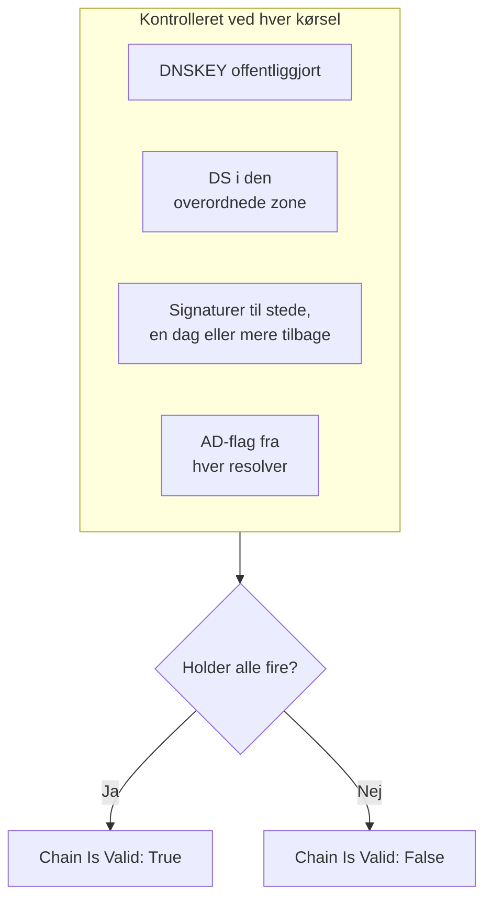

# DNSSEC-monitor

En DNSSEC-monitor kontrollerer, at en signeret DNS-zone stadig validerer: at den offentliggør sine nøgler, at dens overordnede zone står inde for den, at dens signaturer ikke er udløbet, og at validerende resolvere accepterer den. Brug den til at opdage en brudt tillidskæde, før resolvere begynder at svare `SERVFAIL` for dit domæne.

:::cards
- [Opret monitoren](#opret-en-dnssec-monitor): Seks trin i dashboardet.
- [Hvad der kontrolleres](#sådan-virker-det): Kontrollerne bag en gyldig kæde.
- [Overvågningskriterier](#overvågningskriterier): Kædens gyldighed, nøgler, DS-poster, signaturer, resolvere og navneservere.
- [Bedste praksis](#bedste-praksis): Tærskler og resolvere, der virker.
:::

## Sådan virker det

Ved hver kontrol kører en sonde en række DNS-forespørgsler mod zonen:

| Forespørgsel | Stilles til | Hvad den fortæller dig |
| --- | --- | --- |
| `DNSKEY` | Den første resolver i **Resolvere** | Om zonen offentliggør sine signeringsnøgler. |
| `DS` | Den første resolver i **Resolvere** | Om den overordnede zone offentliggør en delegation signer-post for zonen. |
| `SOA`, med DNSSEC-poster | Den første resolver i **Resolvere** | Om zonens poster er signeret (den `RRSIG`, der signerer dens `SOA`-post), og hvornår den signatur, der udløber først, udløber. |
| `A`, med DNSSEC-validering | Hver resolver i **Resolvere** | Om hver validerende resolver accepterer zonen, hvilket den viser med authenticated-data-flaget (AD). |
| `NS`, derefter `SOA` | Den første resolver, derefter hver autoritativ navneserver, den nævner | Om hver navneserver leverer det samme SOA-serienummer. Kun når **Kontroller navneserverkonsistens** er slået til. |

Validerende resolvere kontrollerer tillidskæden fra roden og nedefter, så AD-flaget fortæller dig, at hele kæden holder. Kæden tæller som gyldig, når alt dette holder:

En signatur med mindre end en dag tilbage tæller allerede som brudt, så du får det at vide op til en dag før, resolvere begynder at afvise zonen. En kontrol, der finder kæden brudt eller navneserverne ude af trit, køres igen et sekund senere, op til det antal genforsøg, du angiver, før OneUptime vurderer resultatet med monitorens kriterier. Alle forespørgsler i ét forsøg deler en frist på tre gange **Timeout (ms)**; et forsøg, der løber tør for tid, rapporterer en timeout, ikke en dom over zonen.

## Før du starter

- **En rolle, der kan oprette monitorer**: Project Owner, Project Admin, Project Member, Monitor Admin eller Monitor Member eller en brugerdefineret rolle med tilladelsen Create Monitor.
- **En signeret zone.** Zonen skal være signeret, og dens DS-post offentliggjort i den overordnede zone via din registrator.
- **Udgående DNS fra sonden** til de resolvere, du angiver, og, til kontrollen af navneserverkonsistens, til zonens autoritative navneservere. Dit projekts standardsonder vælges for hver ny monitor.

## Opret en DNSSEC-monitor

:::steps
### Start en ny monitor

Gå til **Monitorer**, og klik på **Opret monitor**. Klik på **Flere monitortyper** under **Monitortype**, og vælg **DNSSEC** under **DNS Monitoring**.

### Navngiv den

Indtast et **Navn**, for eksempel `example.com DNSSEC`, og klik derefter på **Næste**.

### Indtast zonen

Indtast den zone, der skal valideres, i **Zone (domænenavn)**, for eksempel `example.com`. Behold standard-**Resolvere**, eller angiv dine egne, adskilt af kommaer. Lad **Kontroller navneserverkonsistens** være slået til, medmindre dit netværk blokerer DNS til vilkårlige servere.

### Test den

Klik på **Test monitor**, vælg en sonde under **Vælg sonde**, og klik på **Kør test**. **Overvågningstestresultat** viser, hvad hver kontrol fandt.

### Gennemgå kriterierne

**Monitorkriterier** starter med [standardkriterierne](#standardkriterier): offline, når kæden er brudt, online, når den er gyldig. For at blive advaret, før signaturer udløber, skal du tilføje et kriterium (se [Bedste praksis](#bedste-praksis)) og derefter klikke på **Næste**.

### Vælg sonder, og opret

Behold eller skift **Sonder** og **Overvågningsinterval** (det starter på **Hvert 5. minut**), og klik derefter på **Opret monitor**. Monitorens side åbnes.
:::

## Konfigurationsmuligheder

| Felt | Standard | Hvad du skal angive |
| --- | --- | --- |
| **Zone (domænenavn)** | Ingen | Den zone, der valideres, for eksempel `example.com`. |
| **Resolvere** | `1.1.1.1, 8.8.8.8, 9.9.9.9` | Validerende resolvere, der spørges, adskilt af kommaer. Hver af dem skal returnere AD-flaget, for at kæden tæller som gyldig. |
| **Kontroller navneserverkonsistens** | Til | Spørg hver autoritativ navneserver direkte, og sammenlign deres SOA-serienumre. Slå det fra, hvis dit netværk blokerer udgående DNS til vilkårlige servere. |
| **Advarsel om signaturudløb (dage)** (under **Flere felter**) | `7` | Gemmes sammen med monitoren. Filteret **DNSSEC Signature Expires In Days** bruger den værdi, du giver det i kriteriet, så angiv din tærskel dér. |
| **Timeout (ms)** (under **Flere felter**) | `10000` | Hvor længe der ventes på hver DNS-forespørgsel, i millisekunder. Et forsøg kan i alt tage op til tre gange så lang tid. |
| **Genforsøg** (under **Flere felter**) | `3` | Genforsøg, efter at det første forsøg er mislykket. `0` betyder et enkelt forsøg. |

## Overvågningskriterier

Kriterier afgør, hvornår zonen tæller som online, forringet eller offline, og om det erklærer en hændelse eller opretter en advarsel. Hvert kriterium kontrollerer et eller flere filtre:

| Filter | Betingelser | Hvad det kontrollerer |
| --- | --- | --- |
| **DNSSEC Chain Is Valid** | **Sand**, **Falsk** | Alle fire kontroller ovenfor holder: nøgler offentliggjort, DS i den overordnede zone, signaturer til stede med en dag eller mere tilbage, og AD-flaget fra hver resolver. |
| **DNSSEC DNSKEY Record Exists** | **Sand**, **Falsk** | Zonen offentliggør mindst én DNSKEY-post. |
| **DNSSEC DS Record Exists At Parent** | **Sand**, **Falsk** | Den overordnede zone offentliggør en DS-post for zonen. |
| **DNSSEC Signature Expires In Days** | **Greater Than**, **Less Than**, **Greater Than Or Equal To**, **Less Than Or Equal To** | Hele dage, indtil den signatur (RRSIG), der udløber først, udløber. |
| **DNSSEC Resolver Consensus (AD Flag)** | **Sand**, **Falsk** | Hver resolver i **Resolvere** returnerer AD-flaget. |
| **DNSSEC Nameservers Are Consistent** | **Sand**, **Falsk** | Hver autoritativ navneserver svarer med det samme SOA-serienummer. Altid **Sand**, så længe **Kontroller navneserverkonsistens** er slået fra. |

Med to eller flere filtre afgør **Matchbetingelse**, om **Alle** skal matche, eller om **Enhver** af dem er nok. Et kriteriums **Handlinger** afgør, hvad det gør: ændrer monitorens status, opretter en advarsel, erklærer en hændelse eller flere af disse.

### Standardkriterier

En ny DNSSEC-monitor starter med to kriterier:

- **Kæden er brudt** — **DNSSEC Chain Is Valid** er **Falsk**. Monitoren markeres som **Offline**, og der oprettes en hændelse med navnet "_monitor name_ DNSSEC chain is broken". Hændelsen løser sig selv, så snart kæden er gyldig igen.
- **Kæden er gyldig** — monitoren markeres som **I drift**.

Kriterier kontrolleres fra top til bund, og det første, der matcher, afgør, hvad der sker. Når ingen matcher, viser monitoren sin standardstatus: **I drift**, medmindre du vælger en anden under **Flere felter** under kriterierne.

Standardkriterierne holder ikke selv øje med signaturudløb eller navneserverkonsistens. Tilføj kriterier for dem, som nedenfor.

### Eksempelkriterier

| Mål | Filter | Betingelse | Værdi |
| --- | --- | --- | --- |
| Offline, når kæden er brudt (et standardkriterie) | **DNSSEC Chain Is Valid** | **Falsk** | — |
| Advar, før signaturer udløber | **DNSSEC Signature Expires In Days** | **Less Than** | `7` |
| Opdag en delegering, der har mistet sin DS-post | **DNSSEC DS Record Exists At Parent** | **Falsk** | — |
| Opdag resolvere, der er uenige | **DNSSEC Resolver Consensus (AD Flag)** | **Falsk** | — |
| Opdag navneservere, der er ude af trit | **DNSSEC Nameservers Are Consistent** | **Falsk** | — |

## Bedste praksis

1. **Vælg resolvere, der altid kan nås.** Hver resolver skal returnere AD-flaget, for at kæden tæller som gyldig, så en resolver, sonden ikke kan nå, får kontrollen til at fejle, når genforsøgene er brugt op. Standardværdierne, `1.1.1.1`, `8.8.8.8` og `9.9.9.9`, drives af tre forskellige operatører, hvilket også fanger en zone, der validerer hos én resolver, men ikke hos en anden.
2. **Bliv advaret, før signaturer udløber.** Signeringsprogrammer gensignerer en zone, før dens signaturer udløber, så en signatur tæt på udløb betyder, at gensigneringen er stoppet. Tilføj et kriterium med **DNSSEC Signature Expires In Days** / **Less Than** / `7`, der opretter en advarsel, og et andet på `2`, der erklærer en hændelse. Træk begge op over det kriterium, der markerer kæden som gyldig, med `2`-dageskriteriet først, fordi det første kriterium, der matcher, vinder. Vælg tærskler, der er lavere end den tid, dit signeringsprogram normalt lader en signatur have tilbage, før det gensignerer, så de forbliver tavse, mens gensigneringen virker.
3. **Overvåg hver signeret zone.** Medtag apex-domænet, signerede underdomæner og enhver zone, der er delegeret til en anden operatør.
4. **Lad kontrollen af navneserverkonsistens være slået til,** og tilføj et kriterium for den. Den fanger en sekundær server, der er holdt op med at modtage overførsler fra den primære, hvilket DNSSEC-validering alene kan overse.

## Fejlfinding

:::details Kæden rapporteres som brudt, men zonen validerer med `dig`
En af resolverne i **Resolvere** returnerede ikke AD-flaget: den kunne ikke nås fra sonden, eller den validerer ikke DNSSEC. Tabellen **Resolver Checks**, i **Overvågningstestresultat** og i hver kontrols resumé, viser hver resolvers svar og fejl. Fjern de resolvere, sonden ikke kan nå, og angiv kun validerende resolvere.
:::

:::details Navneservere rapporteres som inkonsistente lige efter en ændring
Sekundære servere kan halte efter den primære et stykke tid, efter at zonen er ændret. Tabellen **Nameserver Consistency** i kontrollens resumé viser hver navneservers SOA-serienummer. Hvis én bliver ved med at halte, er den sekundære server holdt op med at modtage overførsler. Hvis hver navneserver viser en fejl, er sonden måske forhindret i at spørge dem direkte: slå **Kontroller navneserverkonsistens** fra.
:::

:::details Kontrollen rapporterer en timeout
Alle forespørgsler i ét forsøg deler tre gange **Timeout (ms)**. En langsom eller utilgængelig resolver bruger den tid op; fjern den fra **Resolvere**, eller hæv timeouten.
:::

## Næste skridt

:::cards
- [DNS-monitor](/docs/monitor/dns-monitor): Kontrollér, at et navn kan slås op, og hvad dets poster siger.
- [Domæne-monitor](/docs/monitor/domain-monitor): Hold øje med domænets registrering og udløb.
- [SSL-certifikat-monitor](/docs/monitor/ssl-certificate-monitor): Hold øje med de certifikater, der leveres på domænet.
- [Hændelser – Oversigt](/docs/incidents/index): Hvad der sker, efter at monitoren har erklæret en.
:::
