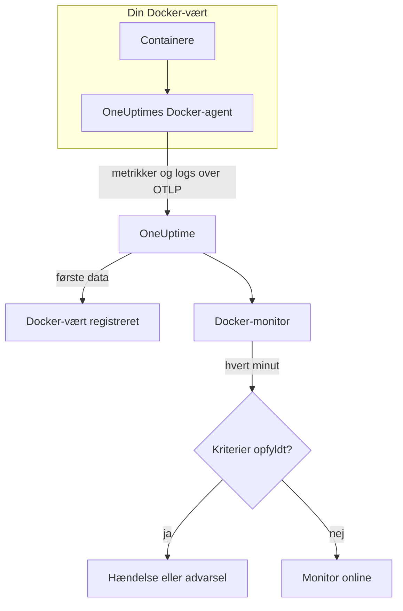

# Docker-monitor

En Docker-monitor overvåger containerne på én Docker-vært og giver dig besked, når en container kører varm, løber tør for hukommelse eller sidder fast i en crash-løkke. Den læser de metrikker, som OneUptimes Docker-agent sender fra værten, så intet undersøges udefra: installér agenten, og opret derefter monitoren ud fra en skabelon eller din egen forespørgsel.

:::cards
- [Opret monitoren](#opret-en-docker-monitor): Seks trin i dashboardet.
- [Skabeloner](#færdige-advarselsskabeloner): Seks færdige advarsler, én hændelse pr. container.
- [Metrikker](#indsamlede-metrikker): Hvad agenten indsamler, og hvad hver metrik betyder.
- [Logs](#indsamlede-logs): Containerlogs og den logdriver, de kræver.
:::

## Sådan virker det

OneUptimes Docker-agent kører som en container på værten. Hvert 30. sekund læser den containerstatistik fra Docker Engine-API'et, følger containernes logfiler og sender begge dele til OneUptime over OTLP. De første data fra en vært registrerer den i OneUptime.

En Docker-monitor er knyttet til én vært. Hvert minut kører den sin forespørgsel over værtens containermetrikker og sammenligner resultatet med sine kriterier.



## Før du begynder

- **Installér Docker-agenten** på værten. [Vejledningen til Docker-agenten](/docs/telemetry/docker-host) dækker installation, opgradering og kontrol.
- **Kontrollér, at værten er registreret.** Den vises under **Produkter → Infrastruktur → Docker → Alle værter**, navngivet efter agentens `DOCKER_HOST_NAME`, så snart dens første data ankommer.
- **Til containerlogs** skal containerne køre med Dockers logdriver `json-file`. Se [Krav til logdriveren](#krav-til-logdriveren).

## Opret en Docker-monitor

:::steps
### Start en ny monitor

Gå til **Monitorer**, og klik på **Opret monitor**.

### Vælg Docker Container

Klik under **Monitortype** på **Flere monitortyper**, og vælg **Docker Container** under **Infrastruktur**, eller skriv `docker` i søgefeltet. Angiv et **Navn** – det bruges i titler på hændelser og advarsler – og klik på **Næste**.

### Vælg værten

Vælg værten i **Docker-vært** under **Docker-monitor-konfiguration**. Hver vært, der har sendt data, er på listen.

### Vælg, hvad der skal overvåges

Vælg en af de tre faner:

- **Quick Setup** – klik på en [skabelon](#færdige-advarselsskabeloner). Den angiver metrikken, aggregeringen, tidsintervallet og tærsklerne og erstatter kriterierne nedenfor med sine egne. Du kan stadig ændre **Tidsinterval**.
- **Custom Metric** – vælg én metrik i **Docker-måling**, og angiv derefter **Aggregering** og **Tidsinterval**. **Containernavn** og **Container-image** indsnævrer den til bestemte containere.
- **Avanceret** – byg selv forespørgsler og formler under **Vælg målinger**. Brug **Group by** `resource.container.name` for at bedømme hver container for sig.

### Kontrollér kriterierne

Åbn hvert kriterium under **Monitorkriterier**, og kontrollér dets **Metrik**, **Aggregering**, **Betingelse** og **Threshold**. En skabelon udfylder dem. Med **Custom Metric** eller **Avanceret** starter monitoren med [standardkriterierne](#standardkriterier), som kun bemærker, at en metrik falder til nul, så angiv din egen tærskel.

### Opret monitoren

Klik på **Opret monitor**. OneUptime åbner monitorens side og evaluerer den hvert minut. Hændelser og advarsler, den åbner, vises også på værtens sider **Hændelser** og **Advarsler**.
:::

> [!TIP]
> For at oprette flere skabeloner på én gang skal du åbne værten fra **Produkter → Infrastruktur → Docker** og gå til **Recommendations**. Vælg de skabeloner, du vil have, og hvem der skal kaldes, så opretter OneUptime én monitor pr. skabelon.

## Monitorindstillinger

| Felt | Fane | Hvad det gør |
| --- | --- | --- |
| **Docker-vært** | Alle | Påkrævet. Afgrænser hver forespørgsel til værtens `resource.host.name`. OneUptime tilføjer også `resource.container.runtime = docker` til hver forespørgsel. |
| **Docker-måling** | Custom Metric | Én metrik fra agentens katalog, grupperet som CPU, hukommelse, netværk, blok-I/O og container. |
| **Containernavn** | Custom Metric, Avanceret | Valgfri. Præcis match på `resource.container.name`, f.eks. `my-container`. |
| **Container-image** | Custom Metric, Avanceret | Valgfri. Præcis match på `resource.container.image.name`, f.eks. `nginx:latest`. |
| **Aggregering** | Custom Metric | Hvordan målinger kombineres: **Gennemsnit**, **Maksimum**, **Minimum**, **Sum** eller **Antal**. Starter ved metrikkens sædvanlige aggregering. |
| **Tidsinterval** | Alle | Det glidende vindue, forespørgslen læser, fra **Past 1 Minute** til **Past 365 Days**. En ny monitor starter ved **Past 1 Minute**; skabeloner angiver deres eget. |
| **Vælg målinger** | Avanceret | Forespørgselsbyggeren: **Metrik**, **Aggregate by**, **Filter by attributes**, **Group by** samt **Tilføj metrik** og **Tilføj formel** til at kombinere forespørgsler. |

## Færdige advarselsskabeloner

**Quick Setup** tilbyder seks skabeloner. Hver bygger en komplet monitor: en forespørgsel grupperet efter `resource.container.name`, et kriterium, der udløses, og et, der genopretter. Hver container bedømmes for sig, så én travl container ikke skjuler en anden, og hver container over tærsklen får sin egen hændelse og sin egen advarsel. Tærsklerne er udgangspunkter, du kan redigere.

Medmindre tabellen siger andet, udløses et kriterium kun, når betingelsen gælder i hvert minut af dets vindue, og det genopretter 10 % forbi tærsklen, så en værdi, der svæver ved grænsen, ikke blafrer.

| Skabelon | Alvorlighed | Overvåger | Udløses, når | Genopretter, når |
| --- | --- | --- | --- | --- |
| High Container CPU Usage | Warning | `container.cpu.utilization`, Max pr. container, seneste 5 minutter | Over 80 (% af én kerne) | Ved eller under 72 |
| High Container Memory Usage | Warning | `container.memory.percent`, Max pr. container, seneste 5 minutter | Over 85 % | Ved eller under 76,5 % |
| Container Restart Loop | Kritisk | Vækst i `container.restarts` pr. container, seneste 15 minutter | Mere end 3 genstarter i vinduet (Sum) | 2,7 eller færre |
| Container CPU Throttling | Warning | Vækst i `container.cpu.throttling_data.throttled_time` i ms pr. container, seneste 5 minutter | Mere end 1000 ms i vinduet (Sum) | 900 ms eller mindre |
| High Container Process Count | Warning | `container.pids.count`, Max pr. container, seneste 5 minutter | Over 2000 | Ved eller under 1800 |
| Container Down (Low Uptime) | Kritisk | `container.uptime`, Min pr. container, seneste 1 minut | Lig med 0 | Over 0 |

**Alvorlighed** er den etiket, vælgeren viser. Hændelsen og advarslen, som en skabelon opretter, starter på dit projekts mest alvorlige hændelses- og advarselsalvorlighed; ændr dem i kriterierne.

> [!NOTE]
> `container.cpu.utilization` er det tal, `docker stats` udskriver: 100 % er én hel CPU-kerne, ikke hele værten, så en container, der bruger to kerner, viser 200. På en vært med flere kerner er tærsklen på 80 et CPU-budget, ikke en andel af maskinen.

> [!NOTE]
> `container.memory.percent` dividerer med containerens hukommelsesgrænse, når der er sat en, og ellers med **værtens** samlede hukommelse. Kontrollér, om containeren blev startet med `--memory`, før du behandler en overskridelse som et nært forestående drab på grund af hukommelsesmangel.

> [!WARNING]
> `container.restarts` og `container.cpu.throttling_data.throttled_time` vokser kun, så de to skabeloner advarer på, hvor meget de voksede i vinduet: en Maksimum- og en Minimum-forespørgsel pr. minut, trukket fra hinanden af en formel og summeret. Ved agentens indsamling hvert 30. sekund ser det omkring halvdelen af den reelle aktivitet, og tærsklerne tager allerede højde for det. Hvis du hæver agentens `collection_interval` til 60 sekunder eller mere, indeholder hvert minut én måling, og begge skabeloner holder op med at advare.

> [!CAUTION]
> **Container Down (Low Uptime)** kan ikke fange en container, der stopper og forbliver stoppet. Agenten rapporterer kun kørende containere, så en stoppet container sender slet ingen data, og dens oppetid viser aldrig 0. For en tjeneste, der skal blive kørende, skal du også overvåge det, den leverer – f.eks. med en [API-monitor](/docs/monitor/api-monitor).

## Indsamlede metrikker

Agenten bruger OpenTelemetry-modtageren `docker_stats` mod Docker-socketten hvert 30. sekund. Hver containers metrikker bærer dens identitet som ressourceattributter: `resource.container.name`, `resource.container.image.name`, `resource.container.id`, `resource.container.runtime` (`docker`) og `resource.host.name`.

### CPU

| Metrik | Beskrivelse |
| --- | --- |
| `container.cpu.utilization` | CPU-udnyttelse, hvor 100 % er én hel CPU-kerne (kolonnen CPU% i `docker stats`). |
| `container.cpu.usage.total` | Brugt CPU-tid, siden containeren startede, i nanosekunder. En tæller over hele levetiden. |
| `container.cpu.throttling_data.throttled_time` | Nanosekunder, containeren er blevet droslet af sin CPU-grænse, siden den startede. En tæller over hele levetiden. |
| `container.cpu.throttling_data.throttled_periods` | Droslingsperioder, siden containeren startede. En tæller over hele levetiden. |

### Hukommelse

| Metrik | Beskrivelse |
| --- | --- |
| `container.memory.usage.total` | Hukommelse i brug, i bytes. |
| `container.memory.usage.limit` | Hukommelsesgrænse, i bytes. |
| `container.memory.percent` | Hukommelsesforbrug som procentdel af containerens grænse, eller af værtens samlede hukommelse, når containeren ikke har nogen grænse. |

### Netværk

| Metrik | Beskrivelse |
| --- | --- |
| `container.network.io.usage.rx_bytes` | Modtagne bytes. En tæller over hele levetiden. |
| `container.network.io.usage.tx_bytes` | Sendte bytes. En tæller over hele levetiden. |

### Blok-I/O

| Metrik | Beskrivelse |
| --- | --- |
| `container.blockio.io_service_bytes_recursive.read` | Bytes læst fra blokenheder. |
| `container.blockio.io_service_bytes_recursive.write` | Bytes skrevet til blokenheder. |

### Container

| Metrik | Beskrivelse |
| --- | --- |
| `container.uptime` | Sekunder, siden containeren startede. Kun kørende containere rapporterer den. |
| `container.restarts` | Antal gange, containeren er genstartet, siden den blev oprettet. En tæller over hele levetiden. |
| `container.pids.count` | Opgaver i containeren. Cgroup'ens pids-controller tæller tråde lige så vel som processer. |

Listen **Docker-måling** tilbyder også `container.cpu.usage.percpu`, `container.memory.rss`, `container.memory.cache` og tællerne for netværkspakker. Den medfølgende agentkonfiguration slår dem ikke til, så kontrollér værtens side **Metrikker**, før du bygger på dem. `container.cpu.throttling_data.throttled_periods` er ikke på listen; forespørg den fra **Avanceret**.

## Overvågningskriterier

Et kriterium sammenligner en af monitorens forespørgsler eller formler med en tærskel. En Docker-monitors kriterier har ingen **Filtertype**: hver regel kontrollerer metrikværdien med disse felter.

| Felt | Hvad det gør |
| --- | --- |
| **Metrik** | Den forespørgsel eller formel, der kontrolleres, efter dens variabelnavn. |
| **Aggregering** | Hvordan værdierne i vinduet bliver til ét svar: **Gennemsnit**, **Sum**, **Maximum Value**, **Minimum Value**, **All Values** (hver værdi skal matche) eller **Any Value** (én er nok). |
| **Betingelse** | **Greater Than**, **Less Than**, **Greater Than Or Equal To**, **Less Than Or Equal To** eller **Equal To** – eller en anomalibetingelse: **Anomalously High**, **Anomalously Low** eller **Anomalous**. |
| **Threshold** | Den værdi, der sammenlignes med. En liste over enheder står ved siden af, når metrikken har en enhed. Vises ikke for anomalibetingelser. |
| **Følsomhed** | Kun anomalibetingelser. **Lav** (4σ), **Mellem** (3σ, standard) eller **Høj** (2σ). |
| **Baseline-vindue** | Kun anomalibetingelser. 14 dage (standard), 28, 60 eller 90 dages historik. |
| **Hvis ingen data** | Under **Flere felter**. Hvad der sker, når vinduet ikke har nogen målinger: **Ignore** (standard), **Treat As Zero** eller **Trigger**. |

Anomalibetingelser sammenligner hver værdi med samme time på ugen i baselinen. De forbliver i en "Learning"-tilstand og giver intet, før baseline-vinduet rummer nok historik.

Hvert kriterium siger også, hvad der skal ske, når det matcher: ændre monitorens status, oprette en advarsel eller erklære en hændelse. Kriterier kontrolleres fra top til bund, og det første, der matcher, afgør det.

### Standardkriterier

En monitor, som du ikke bygger ud fra en skabelon, starter med to kriterier:

| Rækkefølge | Kriterium | Matcher, når | Så |
| --- | --- | --- | --- |
| 1 | Check if _monitor name_ is offline | En vilkårlig værdi i den første forespørgsel er `0` | Markerer monitoren som **Offline** og erklærer hændelsen "_monitor name_ is offline", som løser sig selv, når monitoren kommer sig. |
| 2 | Check if _monitor name_ is online | En vilkårlig værdi er over `0` | Markerer monitoren som **I drift**. |

> [!IMPORTANT]
> Stilhed matcher ingen af kriterierne: en vært, der holder op med at sende data, efterlader monitoren, som den var. For at få besked, når data stopper, skal du sætte **Hvis ingen data** til **Trigger** på et kriterium. Tid, hvor OneUptime selv ikke modtog data, er aldrig manglende data: en kontrol, hvis vindue indeholder sådan tid, venter i stedet, som [Når OneUptime ikke modtager data](/docs/monitor/when-oneuptime-is-not-receiving) forklarer.

## Indsamlede logs

Agenten følger også hver containers fil `*-json.log` og sender hver linje som en OpenTelemetry-logpost med:

| Felt | Værdi |
| --- | --- |
| `resource.host.name` | Værten, fra `DOCKER_HOST_NAME`. |
| `resource.container.id` | Det fulde container-ID. |
| `resource.container.runtime` | Altid `docker`. |
| `attributes["log.iostream"]` | `stdout` eller `stderr`. |
| `severityText` / `severityNumber` | Læst fra et niveaunøgleord, hvor et niveau står i linjen (`[ERROR]`, `app.INFO:`, `{"level":"warn"}`, `level=error`). En linje uden niveau falder tilbage på sin strøm: `stderr` er `ERROR`, `stdout` er `INFO`. |
| `body` | Den linje, containeren skrev. Linjer, der starter med blanktegn eller en afsluttende parentes, som linjer i en stakspore, føjes til linjen før. |
| `time` | Docker-dæmonens tidsstempel for linjen. |

Logs vises på værtens side **Protokoller** og på hver containers side.

### Krav til logdriveren

Agenten kan kun læse logs fra containere, der bruger Dockers logdriver `json-file`. Det er Dockers standard, men en container eller hele dæmonen kan bruge en anden:

| Driver | Hvad agenten ser |
| --- | --- |
| `json-file` | Hver linje. |
| `local` | Intet: filen er binær, og agenten kan ikke fortolke den. |
| `journald`, `syslog`, `fluentd`, `gelf`, `awslogs`, `splunk`, … | Intet: logsene sendes et andet sted hen, så der er ingen fil at følge. |
| `none` | Intet: logsene kasseres. |

Kontrollér en containers driver og dæmonens standard:

```bash
docker inspect <container> --format '{{.HostConfig.LogConfig.Type}}'
docker info --format '{{.LoggingDriver}}'
```

Skift til `json-file`. Docker fastlægger en containers logdriver, når containeren oprettes, så genopret hver container efter ændringen – en genstart beholder den gamle driver.

:::tabs
@tab Docker Compose
Angiv driveren på hver tjeneste, med rotation:

```yaml title="docker-compose.yml"
services:
  my-app:
    image: my-app:latest
    logging:
      driver: "json-file"
      options:
        max-size: "100m"
        max-file: "5"
```

Genopret derefter tjenesten:

```bash
docker compose up -d --force-recreate <service>
```
@tab Docker-dæmon
Gør `json-file` til standard for hver container, der oprettes fremover:

```json title="/etc/docker/daemon.json"
{
  "log-driver": "json-file",
  "log-opts": {
    "max-size": "100m",
    "max-file": "5"
  }
}
```

Genstart Docker-dæmonen, og fjern og genopret derefter hver container:

```bash
docker rm -f <container>
docker run ... <image>
```
:::

## Fejlfinding

:::details Værten er ikke på listen Docker-vært
Værter registrerer sig selv ud fra agentens data. Kontrollér, at agentcontaineren kører, og at værten står under **Produkter → Infrastruktur → Docker → Alle værter**. [Vejledningen til Docker-agenten](/docs/telemetry/docker-host) har de kontroller, du skal køre på værten.
:::

:::details Metrikker ankommer, men siden Protokoller er tom
Containerne bruger næsten helt sikkert ikke logdriveren `json-file`. Kontrollér dem med kommandoerne i [Krav til logdriveren](#krav-til-logdriveren), skift de containere, hvis logs du vil have, og genopret dem.
:::

:::details Agenten logger "no files match the configured criteria"
Agenten leder efter `/var/lib/docker/containers/*/*-json.log` og fandt intet. Enten bruger ingen container på værten `json-file`, eller agentens montering af `/var/lib/docker/containers` (`-v /var/lib/docker/containers:/var/lib/docker/containers:ro`) mangler eller er tom, eller agenten kører på Docker Desktop til macOS, hvis containerfiler ligger inde i dens Linux-VM.
:::

:::details Data ankommer under det forkerte værtsnavn
OneUptime identificerer en vært ud fra `resource.host.name`, som agenten tager fra `DOCKER_HOST_NAME`. Ændrer du `DOCKER_HOST_NAME` efter de første data, opstår der en ny vært i stedet for at omdøbe den første, og en monitor forbliver knyttet til det navn, den blev oprettet med.
:::

:::details En CPU-advarsel udløses aldrig
Gruppér forespørgslen efter `resource.container.name`, og aggregér med **Maksimum**, som skabelonen **High Container CPU Usage** gør. Et gennemsnit over alle containere på en travl vært trækkes ned af de inaktive. Husk, at 100 % betyder én hel kerne, så en container, der må bruge flere kerner, har brug for en højere tærskel.
:::

:::details Skabelonen for genstartsløkker eller drosling holdt op med at advare
Begge måler, hvor meget en tæller voksede mellem to målinger i samme minut. Hvis agentens `collection_interval` er 60 sekunder eller mere, indeholder hvert minut én måling, væksten viser altid 0, og ingen af skabelonerne udløses. Behold agentens standard på 30 sekunder.
:::

## Næste trin

:::cards
- [Docker-agent](/docs/telemetry/docker-host): Installér, opgradér og fejlfind den agent, denne monitor læser.
- [Podman-monitor](/docs/monitor/podman-monitor): Den samme monitor til Podman-værter.
- [Docker Swarm-monitor](/docs/monitor/docker-swarm-monitor): Overvåg opgaverne i en Swarm-klynge.
- [Hændelser – Oversigt](/docs/incidents/index): Hvad der sker, efter at et kriterium har erklæret en hændelse.
:::
