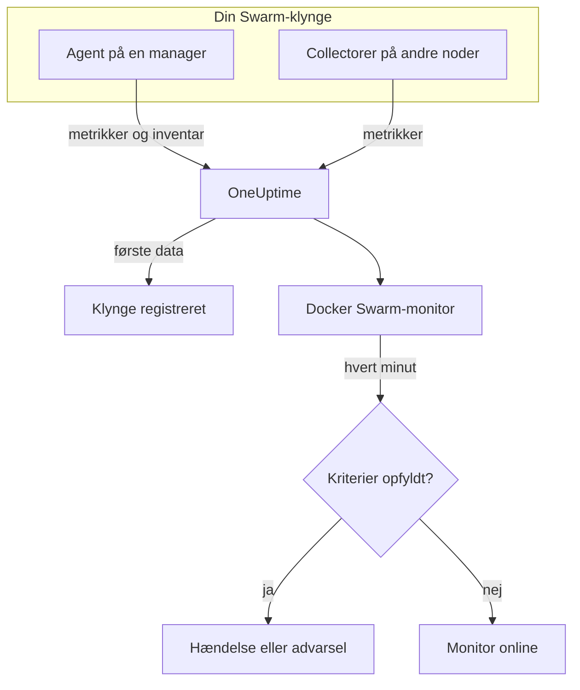

# Docker Swarm-monitor

En Docker Swarm-monitor overvåger containerne bag en Swarm-klynges tjenesteopgaver og giver dig besked, når en opgave genstarter, kører varm eller løber tør for hukommelse. Den læser de containermetrikker, som OneUptimes Docker Swarm-agent sender, så intet undersøges udefra: installér agenten, og opret derefter monitoren ud fra en skabelon eller din egen forespørgsel.

:::cards
- [Opret monitoren](#opret-en-docker-swarm-monitor): Seks trin i dashboardet.
- [Skabeloner](#færdige-advarselsskabeloner): Fire færdige advarsler, én hændelse pr. opgave.
- [Metrikker](#indsamlede-metrikker): De containermetrikker, du kan advare på.
- [Filtre](#monitorindstillinger): Indsnævr en monitor til en tjeneste, en opgave eller et image.
:::

## Sådan virker det

OneUptimes Docker Swarm-agent kører på en managernode. Dens collector læser containerstatistik fra nodens Docker-dæmon hvert 30. sekund og stempler hver batch med klyngens navn, `docker.swarm.cluster.name`. En lille inventarpoller ved siden af læser klyngens noder, tjenester og opgaver fra Swarm-API'et hvert 5. minut. De første data registrerer klyngen i OneUptime.

Collectoren ser kun containere på den node, den kører på. For at få metrikker fra hver node skal du køre collectoren på hver node med det samme `DOCKER_SWARM_CLUSTER_NAME`.

En Docker Swarm-monitor er knyttet til én klynge. Hvert minut kører den sin forespørgsel over klyngens containermetrikker og sammenligner resultatet med sine kriterier.

## Før du begynder

- **Installér Docker Swarm-agenten** på en managernode. [Vejledningen til Docker Swarm-agenten](/docs/telemetry/docker-swarm) dækker installation og opgradering samt kørsel af collectoren på de andre noder.
- **Kontrollér, at klyngen er registreret.** Den vises under **Produkter → Infrastruktur → Docker Swarm → Alle klynger**, navngivet efter agentens `DOCKER_SWARM_CLUSTER_NAME`, så snart dens første data ankommer.

## Opret en Docker Swarm-monitor

:::steps
### Start en ny monitor

Gå til **Monitorer**, og klik på **Opret monitor**.

### Vælg Docker Swarm

Klik under **Monitortype** på **Flere monitortyper**, og vælg **Docker Swarm** under **Infrastruktur**, eller skriv `swarm` i søgefeltet. Angiv et **Navn** – det bruges i titler på hændelser og advarsler – og klik på **Næste**.

### Vælg klyngen

Vælg klyngen i **Docker Swarm Cluster** under **Docker Swarm Monitor Configuration**. Hver klynge, der har sendt data, er på listen.

### Vælg, hvad der skal overvåges

Vælg en af de tre faner:

- **Quick Setup** – klik på en [skabelon](#færdige-advarselsskabeloner). Den angiver metrikken, aggregeringen, tidsintervallet og tærsklerne og erstatter kriterierne nedenfor med sine egne. Du kan stadig ændre **Tidsinterval**.
- **Custom Metric** – vælg én metrik i **Docker Swarm Metric**, og angiv derefter **Aggregering** og **Tidsinterval**. [Filtrene](#monitorindstillinger) indsnævrer den til bestemte opgaver.
- **Avanceret** – byg selv forespørgsler og formler under **Vælg målinger**. Brug **Group by** `resource.container.name` for at bedømme hver opgave for sig.

### Kontrollér kriterierne

Åbn hvert kriterium under **Monitorkriterier**, og kontrollér dets **Metrik**, **Aggregering**, **Betingelse** og **Threshold**. En skabelon udfylder dem. Med **Custom Metric** eller **Avanceret** starter monitoren med [standardkriterierne](#standardkriterier), som kun bemærker, at en metrik falder til nul, så angiv din egen tærskel.

### Opret monitoren

Klik på **Opret monitor**. OneUptime åbner monitorens side og evaluerer den hvert minut. Hændelser og advarsler, den åbner, vises også på klyngens sider **Hændelser** og **Advarsler**.
:::

> [!TIP]
> For at oprette flere skabeloner på én gang skal du åbne klyngen fra **Produkter → Infrastruktur → Docker Swarm** og gå til **Recommendations**. Vælg de skabeloner, du vil have, og hvem der skal kaldes, så opretter OneUptime én monitor pr. skabelon.

## Monitorindstillinger

| Felt | Fane | Hvad det gør |
| --- | --- | --- |
| **Docker Swarm Cluster** | Alle | Påkrævet. Afgrænser hver forespørgsel til `resource.docker.swarm.cluster.name`. Det er den eneste ressourceattribut, agenten stempler, så monitoren tilføjer intet filter på `container.runtime` eller `host.name`. |
| **Tjenestenavn** | Custom Metric, Avanceret | Valgfri. Præcis match på `docker.swarm.service.name`, f.eks. `web`. |
| **Nodenavn** | Custom Metric, Avanceret | Valgfri. Præcis match på `docker.swarm.node.name`, f.eks. `swarm-node-1`. |
| **Containernavn** | Custom Metric, Avanceret | Valgfri. Præcis match på `resource.container.name`. En opgaves container hedder `<service>.<slot>.<taskid>`, f.eks. `web.1.abc123`. |
| **Container-image** | Custom Metric, Avanceret | Valgfri. Præcis match på `resource.container.image.name`, f.eks. `nginx:latest`. |
| **Docker Swarm Metric** | Custom Metric | Én metrik fra [kataloget](#indsamlede-metrikker). |
| **Aggregering** | Custom Metric | Hvordan målinger kombineres: **Gennemsnit**, **Maksimum**, **Minimum**, **Sum** eller **Antal**. Starter ved metrikkens sædvanlige aggregering. |
| **Tidsinterval** | Alle | Det glidende vindue, forespørgslen læser, fra **Past 1 Minute** til **Past 365 Days**. En ny monitor starter ved **Past 1 Minute**; skabeloner angiver deres eget. |
| **Vælg målinger** | Avanceret | Forespørgselsbyggeren: **Metrik**, **Aggregate by**, **Filter by attributes**, **Group by** samt **Tilføj metrik** og **Tilføj formel** til at kombinere forespørgsler. |

> [!WARNING]
> Den medfølgende agent angiver endnu ikke `docker.swarm.service.name` eller `docker.swarm.node.name`, så en monitor med **Tjenestenavn** eller **Nodenavn** udfyldt finder ingen data. Indsnævr i stedet med **Container-image**, eller gruppér efter `resource.container.name`.

## Færdige advarselsskabeloner

**Quick Setup** tilbyder fire skabeloner. Hver bygger en komplet monitor: en forespørgsel grupperet efter `resource.container.name`, et kriterium, der udløses, og et, der genopretter. Hver opgave bedømmes for sig og får sin egen hændelse og sin egen advarsel, hvis grundårsag viser de berørte opgaver og deres værdier. Tærsklerne er udgangspunkter, du kan redigere.

Medmindre tabellen siger andet, udløses et kriterium kun, når betingelsen gælder i hvert minut af dets vindue, og det genopretter 10 % forbi tærsklen, så en værdi, der svæver ved grænsen, ikke blafrer.

| Skabelon | Alvorlighed | Overvåger | Udløses, når | Genopretter, når |
| --- | --- | --- | --- | --- |
| Task Down (Low Uptime) | Kritisk | `container.uptime`, Min pr. opgave, seneste 1 minut | En vilkårlig værdi er under 60 sekunder | Hver værdi er ved eller over 66 sekunder |
| High Task CPU Usage | Warning | `container.cpu.utilization`, Avg pr. opgave, seneste 5 minutter | Over 80 (% af én kerne) | Ved eller under 72 |
| High Task Memory Usage | Warning | `container.memory.percent`, Avg pr. opgave, seneste 5 minutter | Over 85 % | Ved eller under 76,5 % |
| High Task Process Count | Warning | `container.pids.count`, Max pr. opgave, seneste 5 minutter | Over 500 | Ved eller under 450 |

**Alvorlighed** er den etiket, vælgeren viser. Hændelsen og advarslen, som en skabelon opretter, starter på dit projekts mest alvorlige hændelses- og advarselsalvorlighed; ændr dem i kriterierne.

> [!NOTE]
> **Task Down (Low Uptime)** udløses på én enkelt ung måling, fordi en genstart er en hændelse, ikke et niveau. Swarm giver en erstatningsopgave en ny container og dermed en ny serie, og derfor leder skabelonen efter en oppetid under et minut i stedet for et 0. En udrulning eller en opskalering udløser den også, og den ophører, så snart de nye opgaver har passeret et minuts oppetid. En opgave, der dør og ikke erstattes, sender intet, så den fanges ikke.

## Indsamlede metrikker

Agentens collector bruger OpenTelemetry-modtageren `docker_stats`, så metrikkerne er de almindelige containermetrikker, én serie pr. opgavecontainer. Der er ingen metrikker `docker_swarm_*`: noder, tjenester og opgaver holdes som inventar på klyngens sider **Tjenester**, **Opgaver**, **Noder** og relaterede sider.

### CPU

| Metrik | Enhed | Beskrivelse |
| --- | --- | --- |
| `container.cpu.utilization` | % | CPU-udnyttelse for en opgaves container, hvor 100 % er én hel CPU-kerne. |

### Hukommelse

| Metrik | Enhed | Beskrivelse |
| --- | --- | --- |
| `container.memory.usage.total` | bytes | Hukommelse brugt af en opgaves container. |
| `container.memory.percent` | % | Brugt hukommelse som procentdel af containerens grænse, eller af nodens samlede hukommelse, når tjenesten ikke angiver nogen grænse. |

### Netværk

| Metrik | Enhed | Beskrivelse |
| --- | --- | --- |
| `container.network.io.usage.rx_bytes` | bytes | Bytes modtaget af en opgaves container. En tæller over hele levetiden. |
| `container.network.io.usage.tx_bytes` | bytes | Bytes sendt af en opgaves container. En tæller over hele levetiden. |

### Container

| Metrik | Enhed | Beskrivelse |
| --- | --- | --- |
| `container.pids.count` | antal | Processer i en opgaves container. En pludselig stigning kan betyde en forkbombe eller en lækage. |
| `container.uptime` | sekunder | Hvor længe en opgaves container har kørt. En opgave, der planlægges om eller genstartes, starter en ny container på 0. |

Hver serie bærer containerens identitet som ressourceattributter: `resource.container.name` (`<service>.<slot>.<taskid>`), `resource.container.image.name` og `resource.docker.swarm.cluster.name`.

## Overvågningskriterier

Et kriterium sammenligner en af monitorens forespørgsler eller formler med en tærskel. En Docker Swarm-monitors kriterier har ingen **Filtertype**: hver regel kontrollerer metrikværdien med disse felter.

| Felt | Hvad det gør |
| --- | --- |
| **Metrik** | Den forespørgsel eller formel, der kontrolleres, efter dens variabelnavn. |
| **Aggregering** | Hvordan værdierne i vinduet bliver til ét svar: **Gennemsnit**, **Sum**, **Maximum Value**, **Minimum Value**, **All Values** (hver værdi skal matche) eller **Any Value** (én er nok). |
| **Betingelse** | **Greater Than**, **Less Than**, **Greater Than Or Equal To**, **Less Than Or Equal To** eller **Equal To** – eller en anomalibetingelse: **Anomalously High**, **Anomalously Low** eller **Anomalous**. |
| **Threshold** | Den værdi, der sammenlignes med. En liste over enheder står ved siden af, når metrikken har en enhed. Vises ikke for anomalibetingelser. |
| **Følsomhed** | Kun anomalibetingelser. **Lav** (4σ), **Mellem** (3σ, standard) eller **Høj** (2σ). |
| **Baseline-vindue** | Kun anomalibetingelser. 14 dage (standard), 28, 60 eller 90 dages historik. |
| **Hvis ingen data** | Under **Flere felter**. Hvad der sker, når vinduet ikke har nogen målinger: **Ignore** (standard), **Treat As Zero** eller **Trigger**. |

Anomalibetingelser sammenligner hver værdi med samme time på ugen i baselinen. De forbliver i en "Learning"-tilstand og giver intet, før baseline-vinduet rummer nok historik.

Hvert kriterium siger også, hvad der skal ske, når det matcher: ændre monitorens status, oprette en advarsel eller erklære en hændelse. Kriterier kontrolleres fra top til bund, og det første, der matcher, afgør det.

### Standardkriterier

En monitor, som du ikke bygger ud fra en skabelon, starter med to kriterier:

| Rækkefølge | Kriterium | Matcher, når | Så |
| --- | --- | --- | --- |
| 1 | Check if _monitor name_ is offline | En vilkårlig værdi i den første forespørgsel er `0` | Markerer monitoren som **Offline** og erklærer hændelsen "_monitor name_ is offline", som løser sig selv, når monitoren kommer sig. |
| 2 | Check if _monitor name_ is online | En vilkårlig værdi er over `0` | Markerer monitoren som **I drift**. |

> [!IMPORTANT]
> Stilhed matcher ingen af kriterierne: en klynge, der holder op med at sende data, efterlader monitoren, som den var. For at få besked, når data stopper, skal du sætte **Hvis ingen data** til **Trigger** på et kriterium. Tid, hvor OneUptime selv ikke modtog data, er aldrig manglende data: en kontrol, hvis vindue indeholder sådan tid, venter i stedet, som [Når OneUptime ikke modtager data](/docs/monitor/when-oneuptime-is-not-receiving) forklarer.

## Fejlfinding

:::details Klyngen er ikke på listen Docker Swarm Cluster
Klynger registrerer sig selv ud fra agentens data. Kontrollér, at agenten kører på en managernode, at `DOCKER_SWARM_CLUSTER_NAME` er angivet, og at klyngen står under **Produkter → Infrastruktur → Docker Swarm → Alle klynger**. [Vejledningen til Docker Swarm-agenten](/docs/telemetry/docker-swarm) har de kontroller, du skal køre på noden.
:::

:::details Kun nogle opgaver har metrikker
Collectoren læser Docker-dæmonen på den node, den kører på, så den ser kun opgaverne på den node. Kør collectoren på hver node med det samme `DOCKER_SWARM_CLUSTER_NAME`.
:::

:::details En monitor filtreret efter tjeneste eller node finder ingen data
**Tjenestenavn** og **Nodenavn** matcher `docker.swarm.service.name` og `docker.swarm.node.name`, som den medfølgende agent ikke angiver. Ryd dem, og indsnævr med **Container-image**, eller gruppér efter `resource.container.name`.
:::

:::details Hver opgave vises som én serie
Gruppér efter ressourceattributten `resource.container.name`, som skabelonerne gør. Det bare `container.name` matcher intet, så alle opgaver smelter sammen til én serie med et tomt navn.
:::

## Næste trin

:::cards
- [Docker Swarm-agent](/docs/telemetry/docker-swarm): Installér og opgradér den agent, denne monitor læser.
- [Docker-monitor](/docs/monitor/docker-monitor): Overvåg containerne på en enkelt Docker-vært.
- [Hændelser – Oversigt](/docs/incidents/index): Hvad der sker, efter at et kriterium har erklæret en hændelse.
- [Vagtplaner](/docs/on-call/schedules): Bestem, hvem der kaldes, når en opgave går i stykker.
:::
