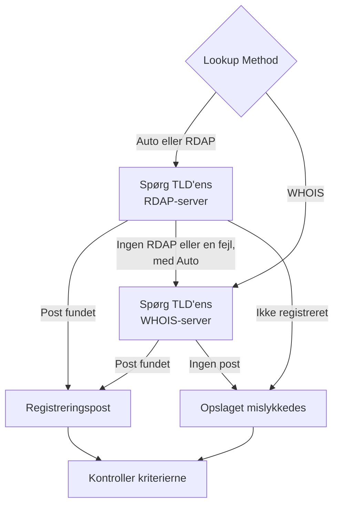

# Domæne-monitor

En domæne-monitor læser dit domænes registreringspost efter en tidsplan for at følge dets udløbsdato, registrator, navneservere og statuskoder og advarer dig, før det udløber. Brug den til hvert domæne, som dine websteder, API'er og e-mail afhænger af: en udløbet registrering tager dem alle ned på én gang.

:::cards
- [Opret monitoren](#opret-en-domæne-monitor): Seks trin i dashboardet.
- [Opslagsmetoder](#opslagsmetoder): RDAP, WHOIS, og hvorfor **Auto** er standarden.
- [Standardkriterier](#standardkriterier): En udløbsadvarsel 30 dage i forvejen, uden opsætning.
- [Fejlfinding](#fejlfinding): Nedlagte WHOIS-servere, proxyer og manglende datoer.
:::

## Sådan virker det

Ved hver kontrol slår en sonde domænets registreringspost op via RDAP eller WHOIS, afhængigt af **Lookup Method**, og ensretter det, den finder: udløbsdatoen, registratoren, navneserverne og statuskoderne. Et opslag, der fejler, forsøges igen, op til det antal genforsøg, du angiver. Derefter kører OneUptime posten gennem monitorens kriterier.

Hvis et opslag ikke kan give registreringsdata — fordi TLD'ens tjeneste er nedlagt, eller domænet ikke er registreret — rapporteres monitoren som **offline** med årsagen vist i monitorens sondesvar, i stedet for at blive rapporteret som sund med en tom udløbsdato. Et register, der svarer "dette domæne er ledigt" (for eksempel `Status: free` hos DENIC), behandles som **ikke registreret**, ikke som en sund post.

Internationaliserede domænenavne accepteres i begge former: `münchen.de` konverteres til sin A-label (`xn--mnchen-3ya.de`) før opslaget.

## Før du starter

- **En rolle, der kan oprette monitorer**: Project Owner, Project Admin, Project Member, Monitor Admin eller Monitor Member eller en brugerdefineret rolle med tilladelsen Create Monitor.
- **Udgående adgang fra sonden** til registrene. Dit projekts standardsonder vælges for hver ny monitor; en [brugerdefineret sonde](/docs/probe/custom-probe) skal kunne nå:

| Destination | Protokol | Bruges til |
| --- | --- | --- |
| `https://data.iana.org/rdap/dns.json` | HTTPS, port 443 | IANA's RDAP-bootstrapregister, der fortæller, hvor hver TLD's RDAP-server er. Hentes én gang og caches i 24 timer. |
| Registrenes RDAP-servere | HTTPS, port 443 | RDAP-opslag. |
| WHOIS-servere | TCP-port 43 | WHOIS-opslag. |

RDAP-anmodninger respekterer sondens indstillinger `HTTP_PROXY_URL` / `HTTPS_PROXY_URL` / `NO_PROXY`. WHOIS kører over en rå socket og gør ikke. Hvis en sonde ikke kan nå `data.iana.org`, falder **Auto** tilbage til WHOIS og prøver IANA igen efter fem minutter.

## Opret en domæne-monitor

:::steps
### Start en ny monitor

Gå til **Monitorer**, og klik på **Opret monitor**. Klik på **Flere monitortyper** under **Monitortype**, og vælg **Domæne** under **Basic Monitoring**.

### Navngiv den

Indtast et **Navn**, for eksempel `example.com registration`, og klik derefter på **Næste**.

### Indtast domænet

Indtast **Domænenavn**, for eksempel `example.com`. Lad **Lookup Method** stå på **Auto**, medmindre du har en grund til andet (se [Opslagsmetoder](#opslagsmetoder)).

### Test den

Klik på **Test monitor**, vælg en sonde under **Vælg sonde**, og klik på **Kør test**. **Overvågningstestresultat** viser den registreringspost, sonden læste, og om RDAP eller WHOIS svarede.

### Gennemgå kriterierne

**Monitorkriterier** starter med [standardkriterierne](#standardkriterier): offline, når registreringen er udløbet eller ikke kan læses, en advarsel, når den udløber om 30 dage eller mindre. Ret dem efter behov, og klik derefter på **Næste**.

### Vælg sonder, og opret

Behold eller skift **Sonder** og **Overvågningsinterval** (det starter på **Hvert 5. minut**), og klik derefter på **Opret monitor**. Monitorens side åbnes.
:::

## Konfigurationsmuligheder

| Felt | Standard | Hvad du skal angive |
| --- | --- | --- |
| **Domænenavn** | Ingen | Det registrerede domæne, for eksempel `example.com`. En indsat adresse virker også: `https://example.com/pricing` læses som `example.com`. |
| **Lookup Method** | **Auto** | **Auto**, **RDAP** eller **WHOIS**. Se [Opslagsmetoder](#opslagsmetoder). |
| **Timeout (ms)** (under **Flere felter**) | `10000` | Hvor længe der ventes på hvert registreringsopslag, i millisekunder. |
| **Genforsøg** (under **Flere felter**) | `3` | Genforsøg, efter at det første forsøg er mislykket. `0` betyder et enkelt forsøg. |

Hvert mislykket opslag gentages, med en pause på et sekund mellem forsøgene. Det gælder også, når et register svarer, at domænet ikke er registreret, eller at det ikke har nogen registreringstjeneste, i tilfælde af at svaret var en forbigående fejl. Kun et forkert udformet domænenavn rapporteres med det samme, uden et opslag.

Timeouten gælder for hver anmodning, ikke for hele kontrollen: en kontrol med **Auto**, der prøver RDAP og derefter falder tilbage til WHOIS, kan tage dobbelt så lang tid eller længere.

### Opslagsmetoder

Registreringsdata kan læses via to protokoller, og hvilken der virker, afhænger af TLD'en.

| Metode | Opførsel |
| --- | --- |
| **Auto** | Standard. Bruger RDAP, når TLD'en offentliggør en RDAP-tjeneste, og falder tilbage til WHOIS, når den ikke gør, eller når RDAP-opslaget fejler. |
| **RDAP** | Kun RDAP. Fejler med en tydelig fejlmeddelelse, hvis TLD'en ikke offentliggør nogen RDAP-tjeneste. |
| **WHOIS** | Kun WHOIS. |

**RDAP** ([RFC 9083](https://www.rfc-editor.org/rfc/rfc9083)) er den afløser for WHOIS, som ICANN har gjort obligatorisk. Den autoritative server for hver TLD findes via [IANA's bootstrapregister](https://www.rfc-editor.org/rfc/rfc9224), så den forbliver korrekt, når registre flytter. Hver gTLD offentliggør en. Når TLD'ens RDAP-server siger, at domænet ikke er registreret, tager **Auto** det som svaret og spørger ikke WHOIS.

**WHOIS** har ingen tilsvarende mekanisme til at finde servere — klienter leveres med en fast tabel fra TLD til WHOIS-vært, og de tabeller bliver forældede. Hver TLD fra Identity Digital (`.digital`, `.email`, `.life`, `.today`, `.zone` og omkring 290 andre) peger stadig på en nedlagt vært, der nu besvarer hver forespørgsel med den bogstavelige tekst `TLD is not supported.` i stedet for en post. WHOIS er fortsat den eneste mulighed for de mange ccTLD'er, der slet ikke offentliggør nogen RDAP-tjeneste, for eksempel `.io`, `.co`, `.de`, `.ch` og `.jp`.

## Overvågningskriterier

Kriterier afgør, hvornår domænet tæller som i orden eller fejlbehæftet, og om det erklærer en hændelse eller opretter en advarsel. Hvert kriterium kontrollerer et eller flere filtre:

| Filter | Betingelser | Hvad det kontrollerer |
| --- | --- | --- |
| **Is Online** | **Sand**, **Falsk** | Om selve registreringsopslaget lykkedes. |
| **Is Request Timeout** | **Sand**, **Falsk** | Om opslaget fik timeout ved hvert forsøg. |
| **Domain Expires In Days** | **Greater Than**, **Less Than**, **Greater Than Or Equal To**, **Less Than Or Equal To** | Dage, indtil registreringen udløber, rundet op til en hel dag. |
| **Domain Is Expired** | **Sand**, **Falsk** | Om udløbsdatoen er passeret. |
| **Domain Registrar** | **Indeholder**, **Not Contains**, **Starts With**, **Ends With**, **Equal To**, **Not Equal To** | Registratorens navn. |
| **Domain Name Server** | **Indeholder**, **Not Contains**, **Starts With**, **Ends With**, **Equal To**, **Not Equal To** | Domænets navneservere. Matcher, når én af dem matcher. |
| **Domain Status Code** | **Indeholder**, **Not Contains**, **Starts With**, **Ends With**, **Equal To**, **Not Equal To** | Domænets EPP-statuskoder. Matcher, når én af dem matcher. |

Statuskoder ensrettes til deres EPP-navne (`clientTransferProhibited`), uanset hvilken protokol der svarede, så et kriterium bliver ved med at matche, når **Auto** skifter mellem RDAP og WHOIS. Registratorers _navne_ er det, den svarende tjeneste offentliggør, og kan variere en smule mellem de to protokoller, så foretræk **Indeholder** frem for **Equal To** i et kriterium med **Domain Registrar**.

Datoer ensrettes til ISO 8601. En dato, som et register offentliggør i en form, der ikke kan fortolkes, udelades i stedet for at blive gemt, så et udløbskriterium ikke kan afgøre noget og ikke matcher, i stedet for i al stilhed at svare "ikke udløbet" for evigt.

Med to eller flere filtre afgør **Matchbetingelse**, om **Alle** skal matche, eller om **Enhver** af dem er nok. Et kriteriums **Handlinger** afgør, hvad det gør: ændrer monitorens status, opretter en advarsel, erklærer en hændelse eller flere af disse.

### Standardkriterier

En ny domæne-monitor starter med tre kriterier, så den advarer dig, før en registrering udløber, uden nogen opsætning:

1. **Domænekontrollen mislykkedes** — registreringen er udløbet, eller dens registreringsdata kunne ikke læses. Monitoren markeres som **Offline**, og der oprettes en hændelse med navnet "_monitor name_ domain check failed". Hændelsen løser sig selv, så snart registreringen kan læses og er gældende igen.
2. **Domænet udløber snart** — registreringen er ikke udløbet, men udløber om 30 dage eller mindre. Der oprettes en **advarsel** med navnet "_monitor name_ domain expires soon".
3. **Domænet er ikke udløbet** — monitoren markeres som **I drift**.

Advarslen "udløber snart" er en advarsel, ikke en hændelse: den vises ikke på dine statussider, den tilkalder ingen, medmindre du føjer en vagtpolitik til den, og den ændrer ikke monitorens status. Den bruger dit projekts anden advarselsalvorlighed, **Low** i et nyt projekt. Så snart fornyelsen vises i registreringsposten, løser advarslen sig selv. Et register, der ikke offentliggør nogen udløbsdato, giver ikke advarslen noget at gå efter, så den forbliver tavs.

Kriterier kontrolleres fra top til bund, og det første, der matcher, afgør, hvad der sker. Derfor står "udløber snart" over "er ikke udløbet": et domæne, der er ved at udløbe, er endnu ikke udløbet, så det ville matche begge.

For at blive advaret tidligere skal du ændre værdien af filteret **Domain Expires In Days** i kriteriet "udløber snart", for eksempel til `60`. For at få nogen tilkaldt i stedet skal du åbne kriteriets **Handlinger**: slå **Når filtre matcher, erklæres en hændelse.** til, eller behold advarslen, og føj en vagtpolitik til den under **Vagtpolitikker**.

:::details Føj advarslen til en monitor, der blev oprettet, før den fandtes
Monitorer, der blev oprettet, før OneUptime indførte denne advarsel, har intet kriterium "udløber snart". Sådan tilføjer du det:

1. Åbn **Konfiguration → Kriterier** på monitoren, og klik på **Rediger Overvågningskriterier**.
2. Klik på **Tilføj kriterier**. Sæt dets filter til **Domain Is Expired** / **Falsk**, klik på **Tilføj filter**, og sæt det andet til **Domain Expires In Days** / **Less Than Or Equal To** / `30`. Lad **Matchbetingelse** stå på **Alle** (den vises under filtrene, så snart der er to).
3. Slå **Når filtre matcher, oprettes en advarsel.** til under **Handlinger**, og lad **Når filtre matcher, ændres overvågningsstatus.** være slået fra, så det opretter en advarsel og ikke ændrer monitorens status.
4. Træk det nye kriterium op over det kriterium, der markerer monitoren som online, og gem derefter.
:::

### Eksempelkriterier

| Mål | Filter | Betingelse | Værdi |
| --- | --- | --- | --- |
| Advar, når domænet udløber inden for 30 dage (et standardkriterium) | **Domain Expires In Days** | **Less Than Or Equal To** | `30` |
| Offline, når domænet er udløbet | **Domain Is Expired** | **Sand** | — |
| Offline, når registreringen ikke kan læses | **Is Online** | **Falsk** | — |
| Advar, når navneserverne ændres | **Domain Name Server** | **Not Contains** | `ns1.example.com` |
| Advar, når domænet er låst op for overførsel | **Domain Status Code** | **Not Contains** | `clientTransferProhibited` |

**Domain Name Server** og **Domain Status Code** matcher, når _en hvilken som helst_ enkelt værdi matcher, så **Not Contains** matcher, så snart én navneserver eller én statuskode ikke indeholder teksten.

## Bedste praksis

1. **Giv dig selv tid til at forny** — Standardadvarslen kommer 30 dage før udløb. Hvis fornyelsen kræver godkendelser eller en betaling, der tager længere tid, så hæv den til 60 dage.
2. **Dæk mislykkede opslag** — Tag et filter **Is Online** / **Falsk** med i dit offline-kriterium, så en registrering, der ikke kan læses, ikke forveksles med en sund. Nye monitorer har det i deres standardkriterier; en monitor, der blev oprettet, før det kom med, skal have det tilføjet i hånden. For at komme igennem en WHOIS-server, der en gang imellem begrænser sonden, skal du sætte flueben i **Evaluér disse kriterier over en periode** under det filter og vælge **All Values**: domænet går så først offline, når hvert opslag i vinduet er mislykket.
3. **Overvåg alle vigtige domæner** — Tag primære domæner, separat registrerede underdomæner og alle domæner, der bruges til e-mail eller API'er, med.
4. **Hold øje med skift af registrator** — Tilføj et kriterium med **Domain Registrar** / **Not Contains** / navnet på din registrator for at opdage en uautoriseret overførsel.

## Fejlfinding

:::details WHOIS-serveren "answered without any registration data"
TLD'ens WHOIS-vært er nedlagt, begrænser sonden eller er kortvarigt i stykker. En nedlagt vært, som den, der stadig er tilknyttet Identity Digitals TLD'er, svarer `TLD is not supported.` hver gang. Hvis fejlen fortsætter med **Lookup Method** på **WHOIS**, så skift til **Auto**, så sonden læser TLD'ens RDAP-tjeneste, hvor der er en.
:::

:::details Kontrollen fejler med "No RDAP service is published"
Monitoren bruger **RDAP**, og TLD'en offentliggør ingen RDAP-tjeneste, som mange ccTLD'er ikke gør. Skift **Lookup Method** til **Auto**, der falder tilbage til WHOIS.
:::

:::details Domænet rapporteres som ikke registreret
Registret svarede, at domænet er ledigt. Kontrollér stavningen, og at du har indtastet det registrerede domæne, for eksempel `example.com`, ikke et underdomæne.
:::

:::details Opslag fejler på en sonde bag en proxy
RDAP går gennem sondens proxyindstillinger, WHOIS gør ikke. Tillad udgående TCP-port 43 til WHOIS, eller brug **Auto** eller **RDAP** til TLD'er, der offentliggør en RDAP-tjeneste.
:::

:::details Udløbsdatoen er tom, og udløbskriterierne udløses aldrig
Registret offentliggør ingen udløbsdato, eller en i en form, der ikke kan fortolkes. Udløbskriterier kan ikke afgøre noget uden en dato, så de forbliver tavse. **Is Online** fortæller dig stadig, om posten kan læses.
:::

## Næste skridt

:::cards
- [SSL-certifikat-monitor](/docs/monitor/ssl-certificate-monitor): Bliv advaret, før certifikaterne på domænet udløber.
- [DNS-monitor](/docs/monitor/dns-monitor): Kontrollér, at domænets poster kan slås op, og hvad de siger.
- [DNSSEC-monitor](/docs/monitor/dnssec-monitor): Validér tillidskæden i en signeret zone.
- [Eskaleringsregler](/docs/on-call/escalation-rules): Bestem, hvem der tilkaldes af advarslerne og hændelserne.
:::
