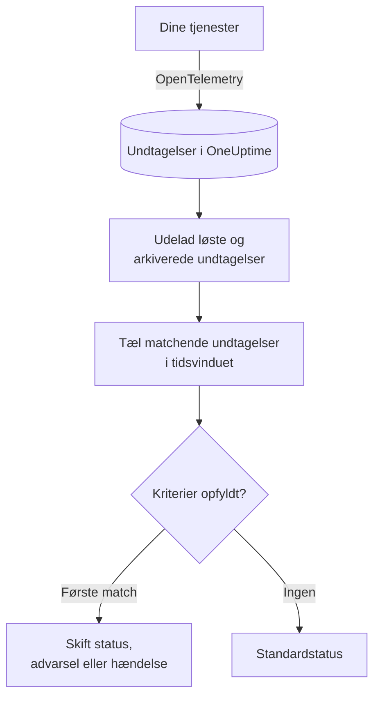

# Undtagelse-monitor

En undtagelse-monitor tæller inden for et tidsvindue de undtagelser, dine tjenester rapporterer til OneUptime, som matcher dine filtre (meddelelse, undtagelsestype, miljø, tjeneste). Når antallet opfylder dine kriterier, ændrer den monitorens status, opretter en advarsel eller erklærer en hændelse. Brug den til at få advarsler om ethvert nyt nedbrud i produktion, om én undtagelsestype eller om en pludselig stigning i fejl.

:::cards
- [Opret monitoren](#opret-en-undtagelse-monitor): Vælg, hvilke undtagelser der tælles, og hvornår du får en advarsel.
- [Miljøer](#miljøer): Begræns monitoren til `production`.
- [Sådan evalueres den](#sådan-evalueres-den): Hvad der tælles, og hvad det gør at løse en undtagelse.
- [Kriterier](#kriterier): Betingelserne og standardværdierne.
:::

## Sådan virker det



Hvert minut tæller OneUptime de undtagelser, der matcher monitorens filtre og opstod inden for dens tidsvindue, og udelader de undtagelser, du har markeret som løst eller arkiveret. Det sammenligner antallet med monitorens kriterier fra top til bund, og det første kriterium, der matcher, afgør, hvad der sker. Når intet matcher, går monitoren tilbage til sin standardstatus.

## Før du starter

- Dine tjenester sender undtagelser til OneUptime via OpenTelemetry. Se [OpenTelemetry](/docs/telemetry/open-telemetry).
- For at begrænse en monitor til et miljø skal dine tjenester angive ressourceattributten `deployment.environment`.

## Opret en undtagelse-monitor

:::steps
### Start en ny monitor

Gå til **Monitorer**, og klik på **Opret monitor**.

### Vælg Exceptions

Under **Monitortype** klikker du på **Flere monitortyper** og vælger **Undtagelser** under **Telemetri**, eller du skriver `exceptions` i søgefeltet. Angiv et **Navn**, og klik derefter på **Næste**.

### Vælg de undtagelser, der skal tælles

I **Undtagelsesmonitor-konfiguration** angiver du **Filtrér undtagelsesbesked**, **Undtagelsestyper**, **Environments** og **Overvåg undtagelser i (time)**. Et filter, du lader stå tomt, matcher alle undtagelser. **Forhåndsvisning af undtagelser** under filtrene viser de undtagelser, de matcher lige nu.

### Indsnævr dem (valgfrit)

Åbn **Flere felter** for at filtrere efter telemetritjeneste eller infrastrukturentitet eller for også at tælle løste og arkiverede undtagelser.

### Angiv kriterierne

Kortet **Monitorkriterier** starter med to kriterier: offline, med en hændelse, når en undtagelse matcher; online, når ingen gør. Ret dem til det, du vil have advarsler om (se [Kriterier](#kriterier)).

### Opret monitoren

Klik på **Opret monitor**. Monitoren åbner på sin side **Oversigt**, og dens første evaluering kører inden for et minut.
:::

## Hvad den forespørger

| Felt | Hvad det matcher | Standard |
| --- | --- | --- |
| **Filtrér undtagelsesbesked** | Undtagelser, hvis meddelelse indeholder denne tekst, uden forskel på store og små bogstaver. | Tom: alle undtagelser |
| **Undtagelsestyper** | Undtagelser af en af disse typer, adskilt af kommaer, såsom `TypeError, NullReferenceException`. Typenavnet skal matche præcist. | Tom: alle typer |
| **Environments** | Undtagelser fra et af disse miljøer, adskilt af kommaer (se [Miljøer](#miljøer)). | Tom: alle miljøer |
| **Overvåg undtagelser i (time)** | Undtagelser fra de seneste 5 sekunder op til de seneste 24 timer. | **Seneste 1 minut** |
| **Filtrér efter telemetritjeneste** (under **Flere felter**) | Undtagelser fra en af de valgte tjenester. | Tom: alle tjenester |
| **Filter by Infrastructure Entity** (under **Flere felter**) | Undtagelser fra en af de valgte værter, pods, containere og andre entiteter. | Tom: alle entiteter |
| **Inkluder løste undtagelser** (under **Flere felter**) | Tæl også undtagelser, der er markeret som løst. | Fra |
| **Inkluder arkiverede undtagelser** (under **Flere felter**) | Tæl også arkiverede undtagelser. | Fra |

Alle de filtre, du angiver, skal matche, før en undtagelse tælles.

### Miljøer

Miljøer kommer fra OpenTelemetry-ressourceattributten `deployment.environment` på hver undtagelse, den samme værdi, som undtagelses-explorer filtrerer på med `env:production`. Angiv ét miljø eller flere adskilt af kommaer; en undtagelse tælles, når dens miljø matcher et af dem.

Sammenligningen er præcis og skelner mellem store og små bogstaver: `production` matcher ikke `Production` eller `prod`. Undtagelser uden miljø tælles ikke, når dette filter er angivet. Lad det stå tomt for at tælle undtagelser fra alle miljøer, også dem uden miljø.

Miljøfilteret kombineres med alle andre filtre, så en monitor, der er begrænset til én telemetritjeneste og `production`, kun tæller den tjenestes produktionsundtagelser.

Når du opretter monitoren via API'et, sætter du `environments` på trinnets `exceptionMonitor` til en liste med miljønavne:

```json
{
  "exceptionMonitor": {
    "telemetryServiceIds": [],
    "environments": ["production"],
    "exceptionTypes": [],
    "message": "",
    "includeResolved": false,
    "includeArchived": false,
    "lastXSecondsOfExceptions": 300
  }
}
```

## Sådan evalueres den

- **Hvert minut.** En undtagelse-monitor tjekkes ikke af sonder, så den har intet interval at angive og ingen side **Sonder og interval**.
- **Forekomster, ikke undtagelsestyper.** Monitoren tæller hver gang, en matchende undtagelse opstod inden for **Overvåg undtagelser i (time)**. Én undtagelse, der kastes 40 gange, tæller 40.
- **Løste og arkiverede undtagelser udelades.** Medmindre du slår **Inkluder løste undtagelser** eller **Inkluder arkiverede undtagelser** til, tæller forekomsterne af en undtagelse, du har markeret som løst eller arkiveret, ikke med. At markere en undtagelse som løst kan derfor lukke den hændelse, den åbnede. Når en løst undtagelse opstår igen, bliver den automatisk uløst og tælles igen.
- **Ingen undtagelser er et antal på 0.**
- **OneUptimes egen nedetid er ikke stilhed.** Så længe tidsvinduet rummer tid, hvor OneUptime selv ikke modtog data (det genstartede, blev opgraderet eller indhentede et efterslæb), venter tjekket: statussen ændres ikke, og ingen hændelse eller advarsel åbnes eller løses. Se [Når OneUptime ikke modtager data](/docs/monitor/when-oneuptime-is-not-receiving).
- **Kriterier fra top til bund.** Det første kriterium, der matcher, afgør det, så sæt det alvorligste øverst.

Hver statusændring registreres med sin årsag på monitorens **Statustidslinje**.

## Kriterier

En undtagelse-monitors kriterier har én **Filtertype**: **Exception Count**, antallet af undtagelser, der matchede i vinduet. Vælg en **Filterbetingelse** og en **Værdi**.

| Filterbetingelse | Matcher, når antallet af undtagelser er… |
| --- | --- |
| **Greater Than** | over værdien |
| **Greater Than Or Equal To** | lig med værdien eller derover |
| **Less Than** | under værdien |
| **Less Than Or Equal To** | lig med værdien eller derunder |
| **Equal To** | præcis værdien |
| **Not Equal To** | alt andet end værdien |

Antal undtagelser har ingen anomalibetingelser: der er ingen baseline at sammenligne dem med.

En ny undtagelse-monitor starter med disse kriterier:

| Kriterium | Filter | Effekt |
| --- | --- | --- |
| Check if … has exceptions | **Exception Count** **Greater Than** `0` | Sætter monitoren offline og erklærer en hændelse, der løses automatisk |
| Check if … has no exceptions | **Exception Count** **Equal To** `0` | Sætter monitoren online |

## Gennemgået eksempel: kun produktionsundtagelser

Du vil have en hændelse, hver gang API'et kaster en undtagelse i produktion, og intet for staging. Du sætter **Environments** til `production` og **Overvåg undtagelser i (time)** til **Seneste 5 minutter** og beholder standardkriterierne. De seneste fem minutter:

| Undtagelser | Miljø | Tilstand | Tælles? |
| --- | --- | --- | --- |
| `TypeError` × 3 | `production` | Aktiv | Ja: 3 |
| `TypeError` × 40 | `staging` | Aktiv | Nej: et andet miljø |
| `TimeoutError` × 2 | intet | Aktiv | Nej: intet miljø |
| `NullReferenceException` × 4 | `production` | Løst, efter at de opstod | Nej: løst |

**Exception Count** er 3, så **Greater Than** `0` matcher: monitoren går offline, og der erklæres en hændelse. Når der er gået fem minutter uden nogen aktiv produktionsundtagelse, matcher online-kriteriet, og hændelsen løser sig selv.

## Fejlfinding

:::details Undtagelser vises i explorer, men monitoren tæller 0
Sammenlign værdien i **Environments** med explorerens filter `env:`: sammenligningen er præcis og skelner mellem store og små bogstaver, og undtagelser uden miljø udelades, når filteret er angivet. Tjek derefter, om de undtagelser er løst eller arkiveret. Åbn monitorens side **Kriterier** (under **Konfiguration**), og klik på **Edit Monitoring Criteria**: **Forhåndsvisning af undtagelser** viser, hvad filtrene matcher.
:::

:::details Hændelsen blev løst, da jeg løste undtagelsen
Det er forventet. Løste undtagelser tælles ikke, så antallet faldt, og kriteriet holdt op med at matche. Hvis undtagelsen opstår igen, bliver den uløst og tælles igen. Slå **Inkluder løste undtagelser** til for at tælle dem alligevel.
:::

:::details Et filter på undtagelsestype matcher intet
**Undtagelsestyper** sammenlignes præcist med det typenavn, undtagelsen blev rapporteret med, såsom `TypeError`. Kopiér typen fra undtagelses-explorer.
:::

## Næste skridt

:::cards
- [Trace-monitor](/docs/monitor/traces-monitor): Få advarsler om mislykkede spans og endpoints.
- [Log-monitor](/docs/monitor/logs-monitor): Få advarsler om logmængde og -indhold.
- [Hændelse- og advarselsskabeloner](/docs/monitor/incident-alert-templating): Skriv nyttige titler og beskrivelser til advarsler.
- [OpenTelemetry](/docs/telemetry/open-telemetry): Send undtagelser til OneUptime.
:::
