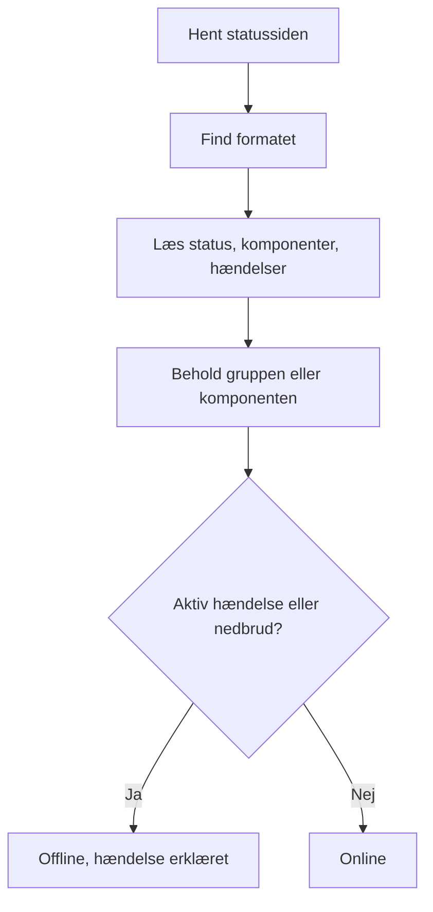

# Ekstern statusside-monitor

En monitor for eksterne statussider holder øje med den offentlige statusside for en tjeneste, du er afhængig af — AWS, GCP, Azure, GitHub, OpenAI, Anthropic og mange flere — og advarer dig, når udbyderen melder om et nedbrud eller forringet ydeevne. Brug den til at høre om problemer hos dine leverandører, så snart udbyderen melder dem, og til at skelne dem fra dine egne.

:::cards
- [Opret monitoren](#opret-en-monitor-for-eksterne-statussider): Indsæt URL'en til en statusside, og vælg, hvad der skal overvåges.
- [Afgræns den](#konfigurationsmuligheder): Hold øje med én komponentgruppe eller én komponent.
- [Kriterier](#overvågningskriterier): Hvad der som standard tæller som nede.
- [Populære statussider](#populære-statusside-urler): URL'er til de tjenester, de fleste teams er afhængige af.
:::

## Sådan fungerer det

Ved hver kontrol henter en sonde statussiden, finder ud af, hvilket format den bruger, og læser den samlede status, komponenterne og de aktive hændelser. Hvis du har afgrænset monitoren til en komponentgruppe eller en komponent, tæller kun de med. Derefter afgør kriterierne, om monitoren er online eller offline.

Du kan bruge den til at:

- Overvåge tilgængeligheden af tredjepartstjenester, din applikation er afhængig af
- Blive advaret, når dine leverandører har nedbrud
- Følge status for de enkelte komponenter
- Afgrænse overvågningen til en enkelt komponentgruppe (f.eks. kun OpenAI's "APIs"), så hændelser andre steder på siden, der ikke har noget med dig at gøre, ikke udløser din monitor
- Opdage forringet ydeevne, før det rammer dine brugere
- Sammenholde dine egne hændelser med problemer hos dine leverandører

## Understøttede udbydere

| Udbyder | Beskrivelse |
| ------------------------ | ---------------------------------------------------------------------- |
| **Auto** (standard) | Finder automatisk statussidens format |
| **Atlassian Statuspage** | Statussider, der kører på Atlassian Statuspage (JSON-API) |
| **incident.io** | Statussider, der kører på incident.io (f.eks. `https://status.openai.com`) |
| **RSS** | Statussider, der tilbyder et RSS-feed |
| **Atom** | Statussider, der tilbyder et Atom-feed |

### Automatisk genkendelse

Når udbyderen er sat til **Auto**, finder OneUptime automatisk statussidens format i denne rækkefølge:

1. Først prøver den statusside-API'et fra incident.io (`/proxy/<host>`).
2. Derefter prøver den JSON-API'et fra Atlassian Statuspage (`/api/v2/status.json`, `/api/v2/components.json` og `/api/v2/incidents/unresolved.json`).
3. Mislykkes de, forsøger den at læse siden som et RSS- eller Atom-feed.
4. Som sidste udvej udfører den et simpelt tjek af, om siden kan nås over HTTP.

> [!NOTE]
> incident.io tjekkes først, fordi nogle statussider fra incident.io (som `https://status.openai.com`) også udstiller et begrænset, Atlassian-kompatibelt endpoint, der udelader komponentgrupper og aktive hændelser. Når incident.io tjekkes først, bruges de rigere data med grupper.

Tjekket af, om siden kan nås, er også udvejen, når en udbyder, du udtrykkeligt har valgt, fejler. Det fortæller dig kun, om siden svarer — online ved et svar `2xx` eller `3xx` — og melder ingen komponenter eller hændelser.

## Opret en monitor for eksterne statussider

:::steps
### Start en ny monitor

Gå til **Monitorer**, og klik på **Opret monitor**. Under **Monitortype** skal du klikke på **Flere monitortyper** og vælge **External Status Page** under **Basic Monitoring** eller skrive `statuspage` i søgefeltet. Angiv et **Navn**, og klik derefter på **Næste**.

### Angiv statussidens URL

Angiv **Statusside-URL**. Lad **Udbyder** stå på **Auto**, medmindre du kender formatet.

### Afgræns den, hvis du har brug for det

Åbn **Flere felter** for at angive et **Component Group Filter (Optional)**, som `APIs`, og et **Filter for komponentnavn (valgfrit)** for at holde øje med en enkelt komponent (inden for gruppen, hvis en gruppe er angivet).

### Test den

Klik på **Test monitor** for at hente siden én gang, og tjek den udbyder, de komponenter og de hændelser, den fandt.

### Gennemgå kriterierne

Kriterietrinnet starter med [standardkriterierne](#standardkriterier), som markerer monitoren som offline, når udbyderen melder om en aktiv hændelse eller et nedbrud inden for afgrænsningen. Ret dem, hvis du har brug for det, og klik derefter på **Næste**.

### Vælg sonder, og opret

Vælg **Sonder** og et **Overvågningsinterval** — det starter på **Hvert 5. minut** — og klik derefter på **Opret monitor**.
:::

## Konfigurationsmuligheder

| Mulighed | Hvad du angiver | Standard |
| --- | --- | --- |
| **Statusside-URL** | URL'en til statussiden. For sider, der kører på Atlassian Statuspage og incident.io, er det typisk rod-URL'en (f.eks. `https://status.example.com`). For RSS-/Atom-feeds skal du angive feedets URL direkte. | — |
| **Udbyder** | **Auto** for at finde formatet, eller **Atlassian Statuspage**, **incident.io**, **RSS** eller **Atom**, hvis du kender det. | **Auto** |
| **Component Group Filter (Optional)** | Den gruppe, monitoren afgrænses til. Under **Flere felter**. | Alle grupper |
| **Filter for komponentnavn (valgfrit)** | Den komponent, der skal holdes øje med. Under **Flere felter**. | Alle komponenter inden for afgrænsningen |
| **Timeout (ms)** | Den længste tid, der ventes på statussiden. Under **Flere felter**. | `10000` (10 sekunder) |
| **Genforsøg** | Hvor mange gange der prøves igen, med et sekunds mellemrum, efter at det første forsøg er mislykkedes; `0` betyder et enkelt forsøg. Under **Flere felter**. | `3` (op til 4 forsøg) |

### Component Group Filter

Hvis statussiden inddeler sine komponenter i grupper, kan du afgrænse monitoren til en enkelt gruppe. På `https://status.openai.com` afgrænser du for eksempel monitoren til OpenAI's API-tjenester ved at angive `APIs`.

Når en komponentgruppe er angivet, beregnes **antallet af aktive hændelser** og den **samlede status** kun ud fra komponenterne i den gruppe — en hændelse, der rammer en gruppe uden forbindelse til din (for eksempel ChatGPT), udløser ikke en monitor, der er afgrænset til gruppen "APIs".

Filtrering på komponentgruppe understøttes for udbyderne **Atlassian Statuspage** og **incident.io**. RSS- og Atom-feeds har ingen komponentgrupper.

### Filter for komponentnavn

Hvis statussiden melder om flere komponenter, kan du angive et komponentnavn for kun at overvåge den komponent. Filteret matcher enhver komponent, hvis navn indeholder det, du angiver, uden hensyn til store og små bogstaver — `actions` matcher en komponent, der hedder "Actions".

Når der også er angivet en komponentgruppe, anvendes filteret for komponentnavn **inden for** den gruppe, så du kan ramme en enkelt komponent i en større gruppe. Når ingen af filtrene er angivet, overvåges alle komponenter inden for afgrænsningen. På et RSS- eller Atom-feed sammenlignes navnefilteret med titlerne på feedets elementer.

> [!WARNING]
> Et filter, der ikke matcher noget, ser sundt ud: uden komponenter inden for afgrænsningen er der intet, der kan melde om et nedbrud. Tjek stavningen op mod statussiden, og brug **Test monitor** for at se, hvad filteret beholder.

## Overvågningskriterier

Du kan konfigurere kriterier, der afgør, hvornår den eksterne tjeneste betragtes som online eller offline, ud fra:

| Filtertype | Hvad den tjekker | Filterbetingelser |
| --- | --- | --- |
| **External Status Page Is Online** | Om statussiden kan nås og returnerer statusdata | Sand eller Falsk |
| **External Status Page Overall Status** | Den samlede status, siden melder | Equal To, Not Equal To, Indeholder, Not Contains, Starts With, Ends With |
| **External Status Page Component Status** | Status for komponenterne inden for afgrænsningen (med hensyn til filtrene for komponentgruppe / komponentnavn): I drift, Under Maintenance, Degraded Performance, Partial Outage, Major Outage eller Full Outage | Equal To, Not Equal To, Indeholder, Not Contains, Starts With, Ends With |
| **External Status Page Active Incidents** | Antallet af aktuelt aktive hændelser på statussiden (afgrænset til komponentgruppen / komponenten, når et filter er angivet) | Equal To, Not Equal To og de numeriske sammenligninger |
| **External Status Page Response Time (in ms)** | Hvor lang tid det tager at hente statussidens data | Greater Than, Less Than, Greater Than Or Equal To, Less Than Or Equal To |

Den samlede status er det, siden siger, så dens værdier afhænger af udbyderen: en Atlassian Statuspage melder sin egen beskrivelse, som `All Systems Operational`; et feed melder `operational` eller `degraded_performance`; tjekket af, om siden kan nås, melder `reachable` eller `unreachable`. Disse sammenligninger skelner mellem store og små bogstaver. Til advarsler om nedbrud er **External Status Page Active Incidents** og **External Status Page Component Status** som regel mere pålidelige.

På et RSS- eller Atom-feed tæller elementerne fra de seneste 24 timer som aktive hændelser: et RSS-element ud fra dets udgivelsesdato, et Atom-element ud fra dets opdateringsdato.

### Standardkriterier

Som standard opretter OneUptime kriterier ud fra det, der virkelig betyder noget for en statusside — dens aktive hændelser og komponenternes tilstand frem for blot, om den kan nås:

| Kriterium | Filtre | Virkning |
| --- | --- | --- |
| Offline | **Enhver** af: siden er ikke online; der er mindst én aktiv hændelse inden for afgrænsningen; en komponent inden for afgrænsningen melder Degraded Performance, Partial Outage, Major Outage eller Full Outage | Markerer monitoren som offline og erklærer en hændelse, der løser sig selv, når kriteriet ikke længere matcher |
| Online | **Alle** af: siden er online; der er ingen aktive hændelser inden for afgrænsningen | Markerer monitoren som online |

Fordi antallet af aktive hændelser og komponenternes status respekterer filtrene for komponentgruppe / komponentnavn, rammer disse standardkriterier automatisk kun de komponenter, du interesserer dig for.

## Skabelonvariabler

Når du opretter hændelser eller advarsler fra monitorer for eksterne statussider, kan du bruge disse variabler i titler, beskrivelser og afhjælpningsnoter (se [Hændelse- og advarselsskabeloner](/docs/monitor/incident-alert-templating)):

| Variabel | Beskrivelse |
| ------------------------- | ------------------------------------------------------------------------------- |
| `{{isOnline}}`            | Om statussiden er online (true/false) |
| `{{responseTimeInMs}}`    | Svartid i millisekunder |
| `{{failureCause}}`        | Årsagen til fejlen, hvis der er en |
| `{{overallStatus}}`       | Værdien af den samlede statusindikator |
| `{{activeIncidentCount}}` | Antal aktive hændelser (afgrænset til filteret, hvis der er et) |
| `{{componentStatuses}}`   | JSON-array med komponenternes status (`name`, `status`, `description`, `groupName`) |
| `{{provider}}`            | Den fundne udbyder (Atlassian Statuspage, incident.io, RSS, Atom); tom efter et tjek af, om siden kan nås |
| `{{componentGroup}}`      | Den komponentgruppe, monitoren er afgrænset til, hvis der er en |
| `{{componentName}}`       | Den komponent, monitoren er afgrænset til, hvis der er en |

## Populære statusside-URL'er

Her er en liste over statussider for populære tjenester. Mange af dem bruger Atlassian Statuspage eller incident.io, så udbyderen **Auto** genkender dem automatisk. En side, der ikke er bygget på nogen af dem og ikke er et feed, får kun tjekket af, om den kan nås — overvåg i stedet udbyderens RSS- eller Atom-feed for dem, hvis den udgiver et.

| Tjeneste | Statusside-URL |
| ---------------------------- | --------------------------------------------- |
| AWS                          | `https://health.aws.amazon.com/health/status` |
| Google Cloud Platform        | `https://status.cloud.google.com`             |
| Microsoft Azure              | `https://status.azure.com`                    |
| GitHub                       | `https://www.githubstatus.com`                |
| OpenAI                       | `https://status.openai.com`                   |
| Anthropic                    | `https://status.anthropic.com`                |
| Cloudflare                   | `https://www.cloudflarestatus.com`            |
| Datadog                      | `https://status.datadoghq.com`                |
| PagerDuty                    | `https://status.pagerduty.com`                |
| Twilio                       | `https://status.twilio.com`                   |
| Stripe                       | `https://status.stripe.com`                   |
| Slack                        | `https://status.slack.com`                    |
| Atlassian (Jira, Confluence) | `https://status.atlassian.com`                |
| Vercel                       | `https://www.vercel-status.com`               |
| Netlify                      | `https://www.netlifystatus.com`               |
| DigitalOcean                 | `https://status.digitalocean.com`             |
| Heroku                       | `https://status.heroku.com`                   |
| MongoDB Atlas                | `https://status.cloud.mongodb.com`            |
| Fastly                       | `https://status.fastly.com`                   |
| New Relic                    | `https://status.newrelic.com`                 |
| Sentry                       | `https://status.sentry.io`                    |
| CircleCI                     | `https://status.circleci.com`                 |

## Bedste praksis

- **Brug udbyderen Auto**, medmindre du kender det nøjagtige format — automatisk genkendelse virker godt for de fleste statussider.
- **Afgræns til en komponentgruppe**, hvis du kun er afhængig af en del af en udbyder (f.eks. kun OpenAI's "APIs"), så hændelser uden forbindelse til dig ikke giver støj.
- **Overvåg bestemte komponenter**, hvis du kun er afhængig af bestemte tjenester.
- **Kombinér med dine egne monitorer** — sæt monitorer for eksterne statussider sammen med dine egne API- og websitemonitorer. Når begge går ned på samme tid, peger leverandørens statusside dig hurtigere hen til årsagen.

## Fejlfinding

:::details Monitoren er offline, men hændelsen gælder en del af tjenesten, som jeg ikke bruger
Afgræns monitoren med et **Component Group Filter**, et **Filter for komponentnavn** eller begge. Antallet af aktive hændelser og komponenternes status tæller så kun det, der er inden for afgrænsningen.
:::

:::details Monitoren går aldrig offline, heller ikke under et nedbrud
Filtrene matcher måske ingenting, hvilket ser sundt ud, eller siden får måske kun tjekket af, om den kan nås. Kør **Test monitor**, og tjek den udbyder og de komponenter, den fandt.
:::

:::details Auto vælger det forkerte format eller finder ingen komponenter
Sæt **Udbyder** til den, du ved, at siden bruger. For et RSS- eller Atom-feed skal du angive feedets egen URL i stedet for statussidens.
:::

:::details En intern statusside kan ikke nås
En sonde afviser adresser i private netværk, medmindre den har lov til at nå dem. Sæt `PROBE_ALLOW_PRIVATE_NETWORK_MONITORS=true` på en sonde inde i dit netværk — se [Adgang til privat netværk](/docs/self-hosted/private-network-access).
:::

## Næste trin

:::cards
- [Hændelse- og advarselsskabeloner](/docs/monitor/incident-alert-templating): Sæt udbyderens status ind i dine hændelsestitler.
- [API-monitor](/docs/monitor/api-monitor): Tjek dine egne endpoints ved siden af din udbyders status.
- [Opret en monitor](/docs/monitor/create-monitor): De trin, alle monitortyper har til fælles.
:::
