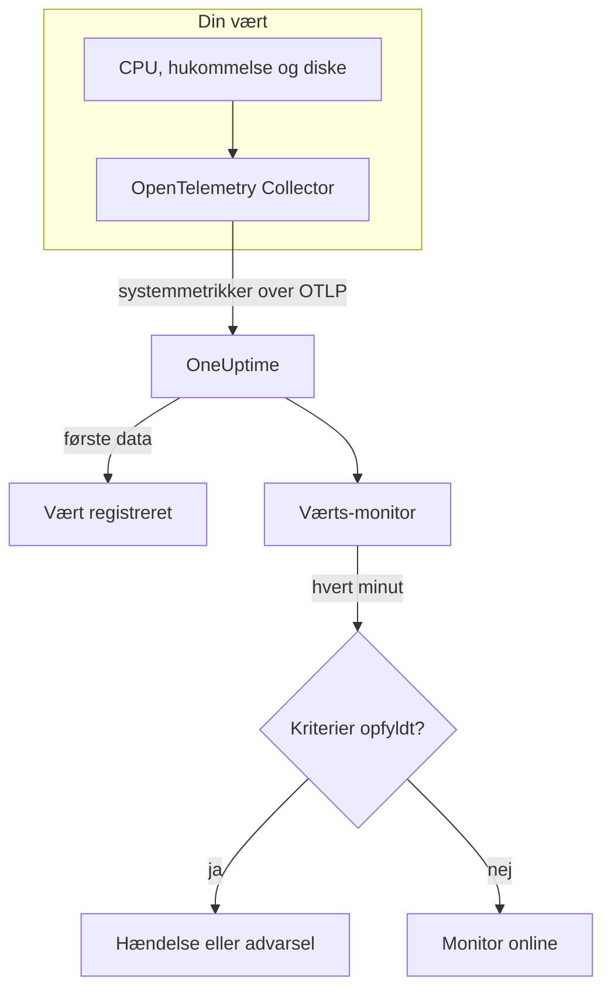

# Værts-monitor

En værts-monitor overvåger én maskine – dens CPU, hukommelse, diske, belastning og processer – og giver dig besked, når den er mættet eller ved at blive fyldt op. Den læser de OpenTelemetry-metrikker `system.*`, som en OpenTelemetry Collector sender fra værten, de samme data, som produktet **Værter** viser, så intet undersøges udefra.

:::cards
- [Opret monitoren](#opret-en-værts-monitor): Seks trin i dashboardet.
- [Skabeloner](#færdige-advarselsskabeloner): Fem færdige advarsler for CPU, hukommelse, disk, belastning og processer.
- [Metrikker](#indsamlede-metrikker): De værtsmetrikker, du kan advare på, og deres enheder.
- [Vært eller Server / VM?](#værts-monitor-eller-server-vm-monitor): Hvilken af de to maskinmonitorer du skal bruge.
:::

## Sådan virker det

En OpenTelemetry Collector kører på værten med modtageren `hostmetrics`. Hvert 30. sekund læser den værtens tal for CPU, hukommelse, disk, netværk, belastning og processer og sender dem til OneUptime over OTLP. De første data fra en vært registrerer den under **Værter**.

En værts-monitor er knyttet til én vært. Hvert minut kører den sin forespørgsel over værtens metrikker og sammenligner resultatet med sine kriterier.

### Værts-monitor eller Server- / VM-monitor?

OneUptime har to monitorer til maskiner. De kan køre på den samme vært.

| | Værts-monitor | Server- / VM-monitor |
| --- | --- | --- |
| **Agent** | En OpenTelemetry Collector med modtageren `hostmetrics` | OneUptimes infrastrukturagent |
| **Data** | OpenTelemetry-metrikker `system.*` og `process.*`, de samme, som siderne under **Værter** viser i diagrammer | En statusrapport, som agenten sender til monitoren |
| **Kriterier** | Tærskler eller anomalidetektion på enhver metrikforespørgsel eller formel | Indbyggede kontroller som CPU-, hukommelses- og diskforbrug |
| **Opsætning** | Installér collectoren; værten registrerer sig selv | Opret monitoren, og giv derefter dens hemmelige nøgle til agenten |

Brug værts-monitoren, når værten allerede sender OpenTelemetry-data, eller når du vil have logs og rigere metrikker fra den samme collector. Se [Server- / VM-monitor](/docs/monitor/server-monitor) for den anden.

## Før du begynder

- **Kør en OpenTelemetry Collector på værten** med modtageren `hostmetrics`. [OpenTelemetry-collector på værten](/docs/telemetry/host-otel-collector) dækker Linux, macOS og Windows, og **Produkter → Infrastruktur → Værter → Dokumentation** giver en færdig konfiguration.
- **Slå udnyttelsesmetrikkerne til.** `system.cpu.utilization`, `system.memory.utilization` og `system.filesystem.utilization` er valgfrie i modtageren, og skabelonerne for CPU, hukommelse og filsystem har brug for dem. Konfigurationen fra dashboardet slår dem til.
- **Kontrollér, at værten er registreret.** Den vises under **Produkter → Infrastruktur → Værter → Alle værter**, navngivet efter sit `host.name`, så snart dens første data ankommer.

## Opret en værts-monitor

:::steps
### Start en ny monitor

Gå til **Monitorer**, og klik på **Opret monitor**.

### Vælg Vært

Klik under **Monitortype** på **Flere monitortyper**, og vælg **Vært** under **Infrastruktur**. Angiv et **Navn** – det bruges i titler på hændelser og advarsler – og klik på **Næste**.

### Vælg værten

Vælg maskinen i **Vært** under **Host Monitor Configuration**. Hver vært, der har sendt data, er på listen.

### Vælg, hvad der skal overvåges

Vælg en af de tre faner:

- **Quick Setup** – klik på en [skabelon](#færdige-advarselsskabeloner). Den angiver metrikken, aggregeringen, tidsintervallet og tærsklerne og erstatter kriterierne nedenfor med sine egne. Du kan stadig ændre **Tidsinterval**.
- **Custom Metric** – vælg én metrik i **Host Metric**, og angiv derefter **Aggregering** og **Tidsinterval**.
- **Avanceret** – byg selv forespørgsler og formler under **Vælg målinger**, f.eks. et filter på `state` eller en gruppering efter `mountpoint`.

### Kontrollér kriterierne

Åbn hvert kriterium under **Monitorkriterier**, og kontrollér dets **Metrik**, **Aggregering**, **Betingelse** og **Threshold**. En skabelon udfylder dem. Med **Custom Metric** eller **Avanceret** starter monitoren med [standardkriterierne](#standardkriterier), som kun bemærker, at en metrik falder til nul, så angiv din egen tærskel.

### Opret monitoren

Klik på **Opret monitor**. OneUptime åbner monitorens side og evaluerer den hvert minut. Hændelser og advarsler, den åbner, vises også på værtens sider **Hændelser** og **Advarsler**.
:::

> [!TIP]
> For at oprette flere skabeloner på én gang skal du åbne værten fra **Produkter → Infrastruktur → Værter** og gå til **Recommendations**. Vælg de skabeloner, du vil have, og hvem der skal kaldes, så opretter OneUptime én monitor pr. skabelon.

## Monitorindstillinger

| Felt | Fane | Hvad det gør |
| --- | --- | --- |
| **Vært** | Alle | Påkrævet. Afgrænser hver forespørgsel til værtens `resource.host.name`. |
| **Host Metric** | Custom Metric | Én metrik fra [kataloget](#indsamlede-metrikker), grupperet som CPU, hukommelse, disk, netværk, belastning og processer. |
| **Aggregering** | Custom Metric | Hvordan målinger kombineres: **Gennemsnit**, **Maksimum**, **Minimum**, **Sum** eller **Antal**. Starter ved metrikkens sædvanlige aggregering. |
| **Tidsinterval** | Alle | Det glidende vindue, forespørgslen læser, fra **Past 1 Minute** til **Past 365 Days**. En ny monitor starter ved **Past 1 Minute**; skabeloner angiver deres eget. |
| **Vælg målinger** | Avanceret | Forespørgselsbyggeren: **Metrik**, **Aggregate by**, **Filter by attributes**, **Group by** samt **Tilføj metrik** og **Tilføj formel** til at kombinere forespørgsler. |

## Færdige advarselsskabeloner

**Quick Setup** tilbyder fem skabeloner. Hver bygger en komplet monitor: en forespørgsel, et kriterium, der udløses, og et, der genopretter. Tærsklerne er udgangspunkter, du kan redigere.

Et kriterium udløses kun, når betingelsen gælder i hvert minut af dets vindue, og det genopretter 10 % forbi tærsklen, så en værdi, der svæver ved grænsen, ikke blafrer.

| Skabelon | Alvorlighed | Overvåger | Udløses, når | Genopretter, når |
| --- | --- | --- | --- | --- |
| High CPU Utilization | Warning | `system.cpu.utilization` for tilstandene `user` og `system`, lagt sammen og vist som procent, seneste 5 minutter | Over 80 % | Ved eller under 72 % |
| High Memory Utilization | Warning | `system.memory.utilization` for tilstanden `used`, som procent, seneste 5 minutter | Over 85 % | Ved eller under 76,5 % |
| High Filesystem Usage | Kritisk | `system.filesystem.utilization`, Max pr. `mountpoint` og `device`, som procent, seneste 5 minutter | Over 90 % | Ved eller under 81 % |
| High Load Average (1m) | Warning | `system.cpu.load_average.1m`, Avg, seneste 5 minutter | Over 4 | Ved eller under 3,6 |
| High Process Count | Warning | `system.processes.count`, Max, seneste 5 minutter | Over 2000 | Ved eller under 1800 |

**Alvorlighed** er den etiket, vælgeren viser. Hændelsen og advarslen, som en skabelon opretter, starter på dit projekts mest alvorlige hændelses- og advarselsalvorlighed; ændr dem i kriterierne.

- **CPU** er optaget tid (`user` plus `system`), det samme tal, som værtens **Oversigt** viser i diagrammer. Iowait og steal er udeladt.
- **Hukommelse** udelader buffere og sidecache, så en vært, der mest indeholder cache, ikke udløser den.
- **Filsystem** åbner én hændelse pr. montering. Skrivebeskyttede pseudofilsystemer, som snap-monteringer af typen `squashfs` eller `devfs` på macOS, er altid 100 % fulde; udelad dem i collectorens scraper `filesystem`.
- **Belastningsgennemsnit** er en rå længde af kørselskøen, ikke divideret med antallet af kerner: 4 er mætning på en vært med 2 kerner og rutine på en med 32, så hæv den på store værter.
- **Antal processer** sammenligner den største enkelte procestilstand (`running`, `sleeping`, …), ikke værtens samlede antal, så det vil ikke svare til en procesliste. Scraperen for processer rapporterer kun på Linux.

## Indsamlede metrikker

Listen **Host Metric** tilbyder disse metrikker. Hver bærer `resource.host.name`, som er den måde, monitoren afgrænser sine forespørgsler til én vært.

> [!IMPORTANT]
> Udnyttelsesmetrikkerne er et forhold fra 0 til 1, ikke en procent: brug `0.8` for 80 % i en tærskel på den rå metrik. Skabelonerne omregner til procent med en formel, så deres tærskler lyder 80, 85 og 90.

### CPU

| Metrik | Enhed | Beskrivelse |
| --- | --- | --- |
| `system.cpu.utilization` | forhold | Andel af CPU-tiden i hver `state` (`user`, `system`, `idle`, …). Filtrér på `state`: et gennemsnit over alle tilstande når aldrig en brugbar tærskel. |
| `process.cpu.utilization` | forhold | CPU-udnyttelse for hver proces på værten. |

### Hukommelse

| Metrik | Enhed | Beskrivelse |
| --- | --- | --- |
| `system.memory.utilization` | forhold | Andel af den fysiske hukommelse i hver `state` (`used`, `free`, `cached`, …). Filtrér på `state = used` for hukommelse i brug. |
| `system.memory.usage` | bytes | Hukommelsesforbrug i bytes. |

### Disk

| Metrik | Enhed | Beskrivelse |
| --- | --- | --- |
| `system.filesystem.utilization` | forhold | Andel af hvert filsystems kapacitet i brug, pr. `mountpoint` og `device`. |
| `system.filesystem.usage` | bytes | Filsystemforbrug i bytes. |

### Netværk

| Metrik | Enhed | Beskrivelse |
| --- | --- | --- |
| `system.network.io` | bytes | Modtagne og sendte bytes. En tæller over hele levetiden. |

### Belastning

| Metrik | Enhed | Beskrivelse |
| --- | --- | --- |
| `system.cpu.load_average.1m` | antal | Belastningsgennemsnit over det seneste minut. |
| `system.cpu.load_average.5m` | antal | Belastningsgennemsnit over de seneste 5 minutter. |
| `system.cpu.load_average.15m` | antal | Belastningsgennemsnit over de seneste 15 minutter. |

### Processer

| Metrik | Enhed | Beskrivelse |
| --- | --- | --- |
| `system.processes.count` | antal | Processer på værten, én serie pr. proces-`status`. |

Forespørgselsbyggeren i **Avanceret** viser hver metrik, værten sender, ikke kun disse.

## Overvågningskriterier

Et kriterium sammenligner en af monitorens forespørgsler eller formler med en tærskel. En værts-monitors kriterier har ingen **Filtertype**: hver regel kontrollerer metrikværdien med disse felter.

| Felt | Hvad det gør |
| --- | --- |
| **Metrik** | Den forespørgsel eller formel, der kontrolleres, efter dens variabelnavn. |
| **Aggregering** | Hvordan værdierne i vinduet bliver til ét svar: **Gennemsnit**, **Sum**, **Maximum Value**, **Minimum Value**, **All Values** (hver værdi skal matche) eller **Any Value** (én er nok). |
| **Betingelse** | **Greater Than**, **Less Than**, **Greater Than Or Equal To**, **Less Than Or Equal To** eller **Equal To** – eller en anomalibetingelse: **Anomalously High**, **Anomalously Low** eller **Anomalous**. |
| **Threshold** | Den værdi, der sammenlignes med. En liste over enheder står ved siden af, når metrikken har en enhed. Vises ikke for anomalibetingelser. |
| **Følsomhed** | Kun anomalibetingelser. **Lav** (4σ), **Mellem** (3σ, standard) eller **Høj** (2σ). |
| **Baseline-vindue** | Kun anomalibetingelser. 14 dage (standard), 28, 60 eller 90 dages historik. |
| **Hvis ingen data** | Under **Flere felter**. Hvad der sker, når vinduet ikke har nogen målinger: **Ignore** (standard), **Treat As Zero** eller **Trigger**. |

Anomalibetingelser sammenligner hver værdi med samme time på ugen i baselinen. De forbliver i en "Learning"-tilstand og giver intet, før baseline-vinduet rummer nok historik.

Hvert kriterium siger også, hvad der skal ske, når det matcher: ændre monitorens status, oprette en advarsel eller erklære en hændelse. Kriterier kontrolleres fra top til bund, og det første, der matcher, afgør det.

### Standardkriterier

En monitor, som du ikke bygger ud fra en skabelon, starter med to kriterier:

| Rækkefølge | Kriterium | Matcher, når | Så |
| --- | --- | --- | --- |
| 1 | Check if _monitor name_ is offline | En vilkårlig værdi i den første forespørgsel er `0` | Markerer monitoren som **Offline** og erklærer hændelsen "_monitor name_ is offline", som løser sig selv, når monitoren kommer sig. |
| 2 | Check if _monitor name_ is online | En vilkårlig værdi er over `0` | Markerer monitoren som **I drift**. |

> [!IMPORTANT]
> Stilhed matcher ingen af kriterierne: en vært, der holder op med at sende data, efterlader monitoren, som den var. For at få besked, når værten bliver tavs, skal du sætte **Hvis ingen data** til **Trigger** på et kriterium. Tid, hvor OneUptime selv ikke modtog data, er aldrig manglende data: en kontrol, hvis vindue indeholder sådan tid, venter i stedet, som [Når OneUptime ikke modtager data](/docs/monitor/when-oneuptime-is-not-receiving) forklarer.

## Fejlfinding

:::details Værten er ikke på listen Vært
Værter registrerer sig selv ud fra collectorens data, som skal have et `host.name` og værtens OS-type – begge kommer fra collectorens processor `resourcedetection`. Kontrollér, at collectoren kører, og at værten står under **Produkter → Infrastruktur → Værter → Alle værter**. [OpenTelemetry-collector på værten](/docs/telemetry/host-otel-collector) dækker konfigurationen.
:::

:::details En CPU- eller hukommelsestærskel udløses aldrig
Udnyttelsesmetrikkerne er forhold, der topper ved `1.0`, så en håndskrevet tærskel på `80` krydses aldrig: brug `0.8`, eller start fra en skabelon, som omregner til procent. Filtrér også på `state` – `user` og `system` for CPU, `used` for hukommelse. Et gennemsnit over alle tilstande holder sig nær 1 divideret med antallet af tilstande.
:::

:::details Hændelser udløses for den forkerte vært
Monitoren afgrænser hver forespørgsel med `resource.host.name` lig med den vært, du valgte. Værter, der rapporterer det samme `host.name`, smelter sammen til én serie, så giv hver vært et unikt navn.
:::

:::details High Filesystem Usage udløses for en montering, der altid er fuld
Skrivebeskyttede pseudofilsystemer, som snap-loop-monteringer af typen `squashfs` under `/snap` eller `devfs` på macOS, er 100 % fulde med vilje og kommer sig aldrig. Udelad dem fra collectorens scraper `filesystem`.
:::

## Næste trin

:::cards
- [OpenTelemetry-collector på værten](/docs/telemetry/host-otel-collector): Installér og konfigurér den collector, denne monitor læser.
- [Server- / VM-monitor](/docs/monitor/server-monitor): Monitoren til maskiner, som en agent sender til.
- [Metrik-monitor](/docs/monitor/metrics-monitor): Advar på enhver metrik på tværs af værter og tjenester.
- [Hændelser – Oversigt](/docs/incidents/index): Hvad der sker, efter at et kriterium har erklæret en hændelse.
:::
