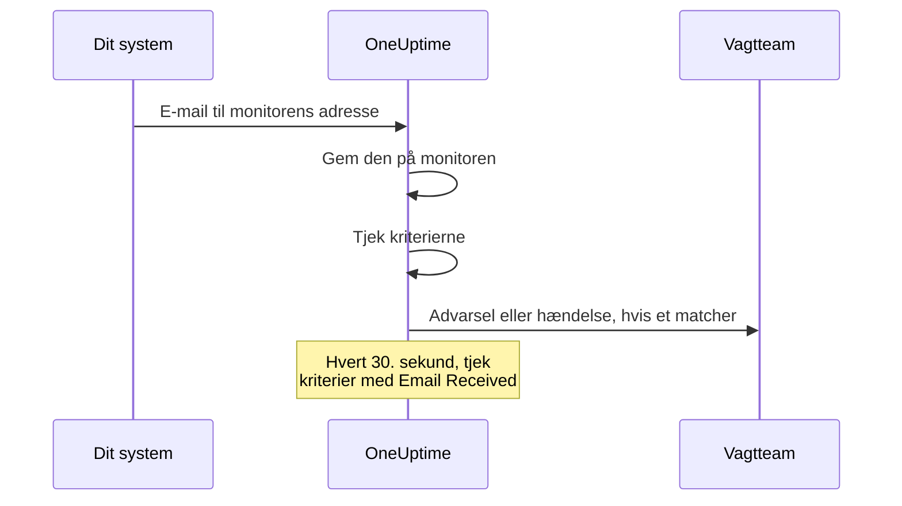

# Indgående e-mail-monitor

En monitor for indgående e-mail giver dig en e-mailadresse, der hører til én monitor. Alt, der kan sende e-mail — et backupjob, et ældre system, en cloududbyders advarsler — sender sine resultater dertil, og OneUptime tjekker hver e-mail ud fra dine kriterier for at markere monitoren som nede, åbne en hændelse eller oprette en advarsel og for at løse dem, når klarmeldingen kommer.

:::cards
- [Opret monitoren](#opret-en-monitor-for-indgående-e-mail): Få en adresse, og peg din afsender på den.
- [Bekræft adressen](#bekræft-adressen-hos-afsenderen): Læs en afsenders bekræftelsesmail på monitoren.
- [Skriv kriterier](#tilgængelige-filtertyper): Match emnet, afsenderen eller teksten, eller advar, når e-mails holder op med at komme.
- [Brug e-mailen i advarsler](#skabelonvariabler): Sæt emnet og teksten ind i titler og beskrivelser.
:::

## Sådan fungerer det

E-mail er en push-model: dit system sender, og OneUptime lytter. Hver e-mail tjekkes ud fra monitorens kriterier, når den ankommer. Kriterier, der leder efter e-mails, som *skulle* være kommet, tjekkes desuden efter en tidsplan, hvert 30. sekund.



1. Når du opretter en monitor for indgående e-mail, giver OneUptime den en unik e-mailadresse.
2. Hver e-mail, der sendes til den adresse, gemmes på monitoren og evalueres ud fra dens kriterier oppefra; det første kriterium, der matcher, afgør det.
3. Et matchende kriterium kan ændre monitorens status, oprette en advarsel og erklære en hændelse. En hændelse med **Løs hændelse automatisk** slået til eller en advarsel med **Løs advarsel automatisk** slået til løses, når et andet kriterium matcher senere — for eksempel det, der markerer monitoren som online.

## Opret en monitor for indgående e-mail

:::steps
### Start en ny monitor

Gå til **Monitorer**, og klik på **Opret monitor**.

### Vælg Incoming Email

Under **Monitortype** skal du klikke på **Flere monitortyper** og vælge **Incoming Email** under **Inbound Monitoring** eller skrive `email` i søgefeltet. Angiv et **Navn**, og klik derefter på **Næste**.

### Gennemgå kriterierne

Trinnet **Kriterier** starter med [standardkriterierne](#hvad-du-får-fra-start), som markerer monitoren som offline, når en e-mail nævner `error`. Klik på et kriterium for at ændre det, eller klik på **Tilføj kriterier** for at tilføje et. Se [Eksempler på konfigurationer](#eksempler-på-konfigurationer) for almindelige opsætninger.

### Opret monitoren

Klik på **Opret monitor**. Monitoren åbner på sin side **Oversigt**, hvor kortet **Incoming Email Address** viser adressen med en kopiknap, indtil den første e-mail ankommer.

### Send e-mail til adressen

Konfigurér dit system til at sende sine notifikationer til adressen. Hvis afsenderen beder dig bekræfte adressen først, så se [Bekræft adressen hos afsenderen](#bekræft-adressen-hos-afsenderen).
:::

> [!NOTE]
> Adressen indeholder monitorens hemmelige nøgle, så kun personer, der kan redigere monitorer, kan se den. Alle andre ser, at opsætningsoplysningerne er skjult.

## E-mailadressens format

Hver monitor for indgående e-mail får en unik adresse i dette format:

```text
monitor-{secret-key}@{inbound-domain}
```

Den hemmelige nøgle er et UUID, for eksempel `monitor-3f2b8c1e-5d4a-4f6b-9a7c-2e1d0b9f8a6c@inbound.yourdomain.com`. Når den første e-mail er ankommet, bliver adressen stående på monitorens side **Oversigt** i kortet **Inbound email address** ved siden af tidspunktet for den seneste e-mail. Monitorens side **Dokumentation** viser den også.

## Nulstil eller tilpas e-mailadressen

Gå til monitorens fane **Indstillinger**. Kortet **Incoming Email Address** viser den nuværende adresse og giver to måder at erstatte den på:

| Handling | Hvad den gør | Brug den, når |
| --- | --- | --- |
| **Reset Address** | Giver monitoren en ny, tilfældigt genereret adresse `monitor-{secret-key}@{inbound-domain}`. Har monitoren en tilpasset adresse, fjerner nulstillingen den. Du bliver bedt om at bekræfte først. | Adressen er sluppet ud, eller du vil lukke af for det, der sender til den. |
| **Customize Address** | Lader dig vælge delen før @, for eksempel `nightly-backups@{inbound-domain}`. Angiv den i **Address name** — du kan skrive navnet eller indsætte hele adressen — og klik på **Save Address**. | Du vil have en adresse, som folk kan genkende. |

Begge handlinger slutter med at vise den nye adresse med en kopiknap.

> [!WARNING]
> **Den gamle adresse holder straks op med at virke**: e-mail, der sendes til den, ignoreres, så opdatér alle systemer, der sender e-mail til denne monitor.

Regler for tilpassede adresser:

- 3 til 64 tegn: små bogstaver, tal, punktummer (`.`), bindestreger (`-`) og understregninger (`_`), uden to punktummer i træk. Den skal starte og slutte med et bogstav eller et tal. Store bogstaver laves om til små for dig.
- Domænet er altid serverens domæne for indgående e-mail.
- Navnet må ikke allerede bruges af en anden monitor. Alle projekter på serveren deler domænet for indgående e-mail, så navnet skal være unikt på tværs af dem alle.
- Navne på formen `monitor-{id}` og `workflow-{id}` er forbeholdt genererede adresser. Navne på postkasser, der hører til selve domænet, er også forbeholdt: `abuse`, `admin`, `administrator`, `hostmaster`, `mailer-daemon`, `noc`, `postmaster`, `root`, `security` og `webmaster`.

En tilpasset adresse er lige så meget en legitimation som en genereret: alle, der kender den, kan sende e-mail, som denne monitor evaluerer. Genererede adresser er praktisk talt umulige at gætte, men et kort, oplagt navn er ikke. Vælg noget, der er svært at gætte, hvis det betyder noget for dig.

API-brugere kan gøre det samme via Monitor-API'et på en eksisterende monitor: sæt `incomingEmailCustomLocalPart` til navnet for at bruge en tilpasset adresse, eller sæt det til `null` for at gå tilbage til den genererede. Nulstilling betyder, at du skriver en ny `incomingEmailSecretKey` og sætter `incomingEmailCustomLocalPart` til `null` i den samme opdatering.

## Bekræft adressen hos afsenderen

Nogle tjenester sender ikke advarsler til en ny adresse, før nogen beviser, at de kan læse post der. De sender først en bekræftelsesmail, og den ankommer til monitoren som enhver anden e-mail. Sådan læser du den:

:::steps
### Tilføj adressen i tjenesten

Tilføj monitorens adresse i tjenesten, og gem. Tjenesten sender sin bekræftelsesmail.

### Åbn den nyeste e-mail

Åbn monitoren i OneUptime. På dens side **Oversigt** viser kortet **Monitor-resumé** den nyeste e-mail. Tjek, at **Fra** og **Emne** hører til bekræftelsesmailen, og klik derefter på **Vis flere detaljer**.

### Kopiér koden eller linket

Koden eller linket står i **E-mailtekst (Tekst)**. **E-mailtekst (HTML)** viser HTML-kilden, så hvis du kopierer et link derfra, skal du ændre hver `&amp;` i det til `&`.

### Gør bekræftelsen færdig

Gør bekræftelsen færdig, som e-mailen fortæller dig.
:::

Er der kommet en anden e-mail siden, viser kortet ikke længere bekræftelsesmailen. Åbn **Overvågningslogs**, find bekræftelsesmailen ud fra dens emne i kolonnen **E-mail**, og klik på **Vis oversigt** i den række.

> [!IMPORTANT]
> **Dine kriterier ser den også.** Bekræftelsesmailen evalueres som enhver anden e-mail. En formulering som "if you received this in error" matcher standardkriteriet `error` og markerer monitoren som offline. For at undgå det skal du slå **Tjek denne overvågning** fra i kortet **Overvågning** på monitorens side **Indstillinger**, mens du bekræfter (du bliver bedt om at bekræfte). En monitor med overvågning slået fra gemmer stadig e-mailen, og kortet **Monitor-resumé** viser den stadig. Den evaluerer dog ingenting, så e-mailen får ingen række i **Overvågningslogs**: læs den, før en anden e-mail ankommer. Når du er færdig, skal du trykke på **Slå overvågning til** i banneret øverst på monitorens sider eller slå kontakten til igen.

**Bekræftelsen hører til adressen.** Hvis du [nulstiller eller tilpasser adressen](#nulstil-eller-tilpas-e-mailadressen), ser tjenesten en ny modtager, og du skal bekræfte igen.

### Handlingsgrupper i Azure Monitor

Siden juli 2026 har Azure gradvist indført et krav om, at hver ny modtager af typen **Email** i en handlingsgruppe bekræftes med en engangskode. Indtil det er sket, sender handlingsgruppen hverken advarsler eller testnotifikationer til den adresse.

:::steps
1. Tilføj en notifikation af typen **Email** med monitorens adresse til handlingsgruppen, og gem handlingsgruppen. Azure sender bekræftelsesmailen fra en Microsoft-adresse som `azure-noreply@microsoft.com`.
2. Læs den på monitoren som beskrevet ovenfor, og følg instruktionerne i den inden for 30 minutter efter, at du gemte handlingsgruppen. Udløber engangskoden, så åbn handlingsgruppen, og vælg **Resend**.
3. Åbn handlingsgruppen, og vælg **Test** for at sende en testnotifikation. Den ankommer til monitoren som en rigtig advarsel, så den viser også, om dine kriterier matcher Azures e-mails.
:::

Bekræftelsen gælder for alle handlingsgrupper i den samme Azure-tenant, så hver adresse skal kun bekræftes én gang.

### Amazon SNS

Et e-mailabonnement på et SNS-emne modtager ingenting, før det er bekræftet. Når du opretter abonnementet, sender Amazon SNS en bekræftelsesmail til adressen. Læs den på monitoren som beskrevet ovenfor, og åbn dens link **Confirm subscription** i din browser. SNS sletter et abonnement, der ikke er bekræftet inden for 48 timer; sker det, så opret abonnementet igen.

## Hvad du får fra start

En ny monitor for indgående e-mail oprettes med to kriterier, der læser e-mailens tekst:

| Kriterium | Filtertype | Filterbetingelse | Værdi | Virkning |
| -------- | ----------- | ---------------- | ------- | -------------------------------------------- |
| Offline  | Email Body  | Indeholder | `error` | Markerer monitoren som offline, åbner en hændelse |
| Online   | Email Body  | Not Contains | `error` | Markerer monitoren som online |

Det passer til det almindelige tilfælde, hvor et job eller et værktøj fra en tredjepart sender sit eget resultat med e-mail: en besked, hvis tekst nævner `error`, tager monitoren ned, og den næste besked uden ordet bringer monitoren op igen og løser hændelsen. Sammenligningen af teksten skelner ikke mellem store og små bogstaver, så `Error` og `ERROR` matcher også.

Ret værdien til det, din afsender faktisk skriver (`FAILED`, `exit code 1` og så videre).

> [!NOTE]
> Disse standarder er **ikke** en dødmandsknap: intet her udløses, når e-mails holder op med at komme. Kriterier, der kun læser emnet, afsenderen, teksten eller modtageren, evalueres, når en e-mail lander, og på intet andet tidspunkt. Vil du advares ved stilhed, så tilføj et kriterium **Email Received** / **Not Recieved In Minutes** — se [Eksempel 3](#eksempel-3-heartbeat-monitor-ingen-e-mail-advarsel).

## Tilgængelige filtertyper

Du kan oprette kriterier ud fra disse e-mailfelter:

| Filtertype | Beskrivelse |
| ------------------------- | ----------------------------------------------------------------------------------- |
| **E-mailemne** | Emnelinjen i den indgående e-mail |
| **Email From Address** | Afsenderens e-mailadresse: den rene adresse med små bogstaver, uden visningsnavn |
| **Email Body** | E-mailens del i ren tekst |
| **Email To Address** | Modtagerens e-mailadresse |
| **Email Received** | Tidsbaserede kriterier for, hvornår e-mails modtages |
| **JavaScript Expression** | Et brugerdefineret JavaScript-udtryk, der skal give sand |

Monitorens egen adresse maskeres, før et kriterium læser e-mailen, så i **Email To Address**, **E-mailemne** og **Email Body** står der `[REDACTED]`.

## Filterbetingelser

### Strengfiltre (emne, afsender, tekst, modtager)

| Filterbetingelse | Beskrivelse | Eksempel |
| ---------------- | ----------------------------------------- | ---------------------------------- |
| **Indeholder** | Feltet indeholder den angivne tekst | Emnet indeholder "CRITICAL" |
| **Not Contains** | Feltet indeholder ikke den angivne tekst | Emnet indeholder ikke "TEST" |
| **Equal To** | Feltet svarer nøjagtigt til den angivne tekst | Afsenderen er lig med "alerts@service.com" |
| **Not Equal To** | Feltet svarer ikke til den angivne tekst | Emnet er ikke lig med "OK" |
| **Starts With** | Feltet starter med den angivne tekst | Emnet starter med "[ALERT]" |
| **Ends With** | Feltet slutter med den angivne tekst | Emnet slutter med "- Production" |
| **Is Empty** | Feltet er tomt | Teksten er tom |
| **Is Not Empty** | Feltet har indhold | Emnet er ikke tomt |

Ingen af disse sammenligninger skelner mellem store og små bogstaver. Et filter med en tom værdi matcher aldrig.

### Tidsbaserede filtre (Email Received)

Dashboardet staver disse betingelser "Recieved".

| Filterbetingelse | Beskrivelse | Eksempel |
| --------------------------- | ----------------------------------- | -------------------------------- |
| **Recieved In Minutes** | Der er modtaget en e-mail inden for X minutter | E-mail modtaget inden for 30 minutter |
| **Not Recieved In Minutes** | Der er ikke modtaget nogen e-mail i X minutter | Ingen e-mail modtaget i 60 minutter |

En monitor, der aldrig har modtaget en e-mail, regner sit oprettelsestidspunkt som den seneste e-mail.

### JavaScript Expression

| Filterbetingelse | Beskrivelse |
| --------------------- | ------------------------------------- |
| **Evaluates To True** | Udtrykket returnerer en sand værdi |

Udtrykket kører i en sandkasse uden bundne e-mailfelter, så det kan ikke læse emnet, afsenderen, teksten eller modtageren af den besked, der udløste tjekket. Brug filtertyperne **E-mailemne**, **Email From Address**, **Email Body** og **Email To Address** for at matche på e-mailens indhold.

## Eksempler på konfigurationer

Hvert eksempel er et par kriterier. Et kriterium har filtre, en **Matchbetingelse** (**Alle** eller **Enhver** af dets filtre) og handlinger: ændre monitorens status, oprette en advarsel, erklære en hændelse. Slå **Løs advarsel automatisk** (eller **Løs hændelse automatisk**) til under **Flere felter** i advarslen eller hændelsen, så det andet kriterium løser det, det første åbnede.

### Eksempel 1: Opret en advarsel ved kritiske e-mails

| Kriterium | Filtre | Matchbetingelse | Handlinger |
| --- | --- | --- | --- |
| Kritisk e-mail | **E-mailemne** Indeholder `CRITICAL`; **E-mailemne** Indeholder `ALERT`; **E-mailemne** Indeholder `ERROR` | **Enhver** | Ændr status til offline; opret en advarsel |
| Klarmelding | **E-mailemne** Indeholder `RESOLVED`; **E-mailemne** Indeholder `RECOVERED` | **Enhver** | Ændr status til online |

Placér det kritiske kriterium først: kriterier tjekkes oppefra, og det første, der matcher, afgør det.

### Eksempel 2: Overvåg en bestemt afsender

| Kriterium | Filtre | Matchbetingelse | Handlinger |
| --- | --- | --- | --- |
| Mislykket job | **Email From Address** Equal To `monitoring@legacy-system.com`; **E-mailemne** Indeholder `Failed` | **Alle** | Ændr status til offline; erklær en hændelse |
| Vellykket job | **Email From Address** Equal To `monitoring@legacy-system.com`; **E-mailemne** Indeholder `Success` | **Alle** | Ændr status til online |

### Eksempel 3: Heartbeat-monitor (ingen e-mail = advarsel)

| Kriterium | Filtre | Handlinger |
| --- | --- | --- |
| E-mailen er forsinket | **Email Received** Not Recieved In Minutes `60` | Ændr status til offline; opret en advarsel |
| E-mailen er kommet | **Email Received** Recieved In Minutes `60` | Ændr status til online |

Det første kriterium udløses, når der ikke er kommet nogen e-mail i 60 minutter — nyttigt til planlagte jobs eller batchprocesser, der sender en e-mail, når de er færdige. Det andet løser advarslen, så snart en e-mail kommer. Minutter, hvor OneUptime ikke selv modtog e-mail, tæller ikke med i de 60, som [Når OneUptime ikke modtager data](/docs/monitor/when-oneuptime-is-not-receiving) forklarer.

## Brugsscenarier

| Brugsscenarie | Hvad monitoren gør |
| --- | --- |
| Integration med ældre systemer | Gør advarsler, som ældre systemer kun sender med e-mail, til hændelser i OneUptime og løser dem, når klarmeldingen kommer. |
| Tjenester fra tredjeparter | Modtager notifikationer fra cloududbydere (AWS, GCP, Azure), sikkerhedsscannere, backupværktøjer og advarsler om certifikater, der udløber. |
| Planlagte jobs | Advarer, når en e-mail om et færdigt job er forsinket, eller når et job sender en e-mail om en fejl. |
| Samling af advarsler | Samler e-mailadvarsler fra Nagios, Zabbix eller andre værktøjer, så OneUptime er det ene sted, du håndterer dem. |

## Skabelonvariabler

Titler, beskrivelser og afhjælpningsnoter i de advarsler og hændelser, denne monitor opretter, kan bruge disse variabler. Kriteriets formularer til advarsler og hændelser viser dem under **Skabelonvariabler**, og [Hændelse- og advarselsskabeloner](/docs/monitor/incident-alert-templating) forklarer syntaksen.

| Variabel | Beskrivelse |
| --------------------- | ----------------------------------------------------------------- |
| `{{emailSubject}}`    | Emnet for den modtagne e-mail |
| `{{emailFrom}}`       | Afsenderens e-mailadresse |
| `{{emailTo}}`         | Hvem e-mailen blev sendt til, med denne monitors egen adresse maskeret |
| `{{emailBody}}`       | E-mailens tekst i ren tekst |
| `{{emailReceivedAt}}` | Hvornår e-mailen blev modtaget, som et ISO 8601-tidsstempel i UTC |

- **En titel får én linje af hver.** I en titel afkortes hver variabel til én linje på højst 150 tegn, der slutter med `...`, når den var længere. En titel må ikke være længere end 500 tegn, og en advarsel eller hændelse med en for lang titel oprettes slet ikke, så hvis du citerede en hel e-mail, ville monitoren ikke kunne advare om lange e-mails. Beskrivelser og afhjælpningsnoter får hele værdien.
- **Denne monitors adresse er maskeret.** Adressen virker som en adgangskode, så den maskeres, før e-mailen gemmes, og `{{emailTo}}` lyder `monitor-[REDACTED]@{inbound-domain}` (eller `[REDACTED]@{inbound-domain}` for en tilpasset adresse).
- **Et tjek for manglende e-mail bruger den seneste e-mail.** Når et kriterium med **Email Received** åbner en advarsel, fordi der ikke kom nogen e-mail i tide, beskriver variablerne den seneste e-mail, monitoren modtog. De er tomme, hvis der endnu ikke er kommet nogen.

## Visningen Monitor-resumé

Når monitoren har modtaget en e-mail, viser kortet **Monitor-resumé** på dens side **Oversigt** den nyeste:

- **Seneste e-mail modtaget den**: Hvornår den nyeste e-mail blev modtaget
- **Fra**: Afsenderen af den seneste e-mail
- **Emne**: Emnelinjen i den seneste e-mail

Klik på **Vis flere detaljer** for at se resten:

- **E-mailheaders**: Den seneste e-mails fulde headere
- **E-mailtekst (Tekst)**: Teksten i ren tekst
- **E-mailtekst (HTML)**: HTML-teksten, vist som HTML-kilde i stedet for at blive gengivet

### Tidligere e-mails

Kortet viser kun den nyeste e-mail. Hver e-mail, monitoren evaluerer, skrives også til **Overvågningslogs**: kolonnen **E-mail** viser dens emne og afsender, og **Vis oversigt** i dens række viser hele e-mailen på samme måde som kortet. En monitor med overvågning slået fra evaluerer ingenting, så de e-mails, den modtager, får ingen rækker. Hvis et af dine kriterier tjekker **Email Received**, skriver monitoren også en række, hver gang den tjekker for manglende e-mail. Kolonnen **E-mail** siger "Scheduled check" i de rækker, og deres **Vis oversigt** viser den nyeste e-mail på tidspunktet for tjekket eller "No email yet", hvis der ikke var kommet nogen. Overvågningslogs gemmes som standard i én dag. På en selvhostet server kan en administrator ændre det med **Opbevaring af overvågningslogfiler (dage)** i Admin Dashboards indstillinger.

## Selvhostet opsætning

Hvis du selv hoster OneUptime, skal du konfigurere en udbyder af indgående e-mail. I øjeblikket understøttes:

- **SendGrid Inbound Parse** - Se [SendGrid indgående e-mail](/docs/self-hosted/sendgrid-inbound-email) for opsætningsinstruktioner

Indtil det er sat op, siger monitorens adressekort, at indgående e-mail ikke er konfigureret.

## Ting at overveje

- **E-mailadressens sikkerhed**: Monitorens e-mailadresse virker som en adgangskode: alle, der kender den, kan sende e-mail til monitoren. Del den ikke offentligt, og nulstil den fra monitorens fane **Indstillinger**, hvis den slipper ud.
- **E-mailstørrelse**: OneUptime accepterer en indgående e-mail på op til 50 MB inklusive vedhæftede filer. Vedhæftede filer gemmes ikke — kun deres navne, typer og størrelser.
- **Behandlingstid**: E-mails behandles asynkront. Der kan gå et par sekunder, fra en e-mail sendes, til advarslen oprettes.
- **Store og små bogstaver**: Ingen af strengsammenligningerne (Indeholder, Equal To osv.) skelner mellem store og små bogstaver.
- **Ren tekst**: Kriterier for e-mailens tekst læser e-mailens del i ren tekst. En e-mail, der kun er sendt som HTML, har en tom tekst for kriterierne — så den indeholder ikke `error`, og standardkriterierne markerer monitoren som online.

## Fejlfinding

### E-mails bliver ikke modtaget

1. Bekræft, at e-mailadressen er korrekt (tjek for slåfejl).
2. Tjek, om afsenderen venter på, at du bekræfter adressen. Handlingsgrupper i Azure Monitor og Amazon SNS sender ingenting til en ny adresse, før den er bekræftet. Se [Bekræft adressen hos afsenderen](#bekræft-adressen-hos-afsenderen).
3. Tjek, om e-mailen bliver blokeret af spamfiltre.
4. Bekræft, at din udbyder af indgående e-mail er konfigureret korrekt.
5. Tjek OneUptimes logs for fejlmeddelelser.

### Advarsler bliver ikke oprettet

1. Bekræft, at dine kriterier matcher e-mailens indhold. Husk, at monitorens egen adresse lyder `[REDACTED]`, og at en e-mail med kun HTML har en tom tekst.
2. Tjek, at overvågningen er slået til: monitorens side **Indstillinger**, kortet **Overvågning**.
3. Åbn **Overvågningslogs**, og klik på **Vis oversigt** i e-mailens række for at se, hvad kriterierne læste.
4. Tjek rækkefølgen af dine kriterier: det første, der matcher, afgør det.

### Advarsler bliver ikke løst

1. Bekræft, at dine kriterier for løsning matcher klarmeldingen.
2. Tjek, at **Løs advarsel automatisk** (eller **Løs hændelse automatisk**) er slået til i det kriterium, der åbnede den.
3. Tjek, at klarmeldingen sendes til den samme monitoradresse.

## Næste trin

:::cards
- [Hændelse- og advarselsskabeloner](/docs/monitor/incident-alert-templating): Sæt e-mailens emne og tekst ind i advarsler.
- [Indgående anmodning-monitor](/docs/monitor/incoming-request-monitor): Modtag heartbeats og webhooks over HTTP i stedet.
- [SendGrid indgående e-mail](/docs/self-hosted/sendgrid-inbound-email): Sæt indgående e-mail op på en selvhostet server.
:::
