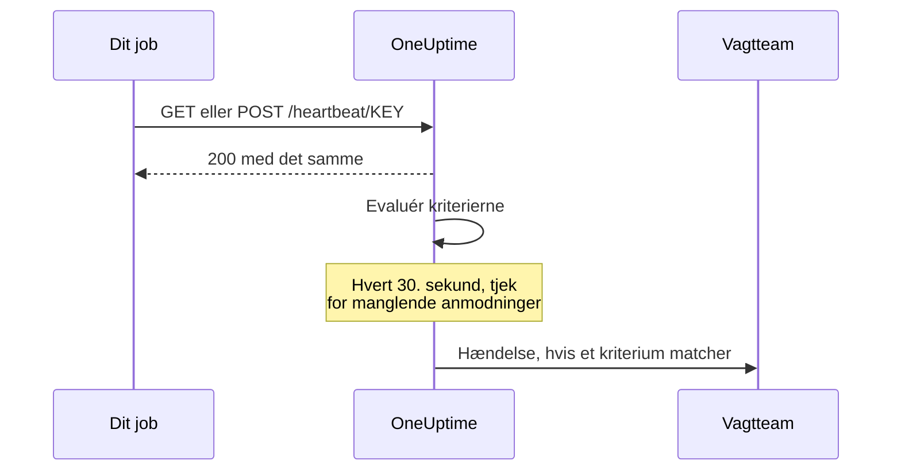

# Indgående anmodning-monitor

En monitor for indgående anmodninger giver dig en URL, som andre systemer sender HTTP-anmodninger til. OneUptime evaluerer hver anmodning ud fra dine kriterier og kan ændre monitorens status, erklære hændelser og tilkalde dem, der har vagt.

Den dækker to forskellige opgaver:

- **Heartbeat-overvågning** — et cronjob, en worker eller en enhed kalder URL'en efter en tidsplan, og OneUptime opretter en hændelse, når kaldene holder op med at komme.
- **Modtagelse af advarsler fra et andet system** — Prometheus Alertmanager, Grafana eller alt andet, der kan sende JSON med POST, skubber advarsler ind, og OneUptime gør hver enkelt til en hændelse med eskalering til vagten og automatisk løsning, når problemet er væk.

Begge bruger den samme monitortype. Det, der skiller dem ad, er de kriterier, du konfigurerer.

:::cards
- [Opret monitoren](#opret-en-monitor-for-indgående-anmodninger): Få en heartbeat-URL i nogle få trin.
- [Send et heartbeat](#send-et-heartbeat): Fra curl, cron, Node.js, Python eller Go.
- [Advar, når kaldene stopper](#markér-som-offline-hvis-der-ikke-er-noget-heartbeat-i-10-minutter-en-dødmandsknap): Gør monitoren til en dødmandsknap.
- [Modtag advarsler](#modtagelse-af-advarsler-fra-et-andet-system): Én hændelse pr. advarsel fra Alertmanager eller Grafana.
:::

## Sådan fungerer det

Intet tjekker dit system udefra: dit system kalder monitorens URL, OneUptime svarer med det samme og evaluerer derefter anmodningen ud fra monitorens kriterier. Et kriterium, der leder efter anmodninger, som er *holdt op* med at komme, tjekkes desuden igen i baggrunden hvert 30. sekund, så også stilhed kan oprette en hændelse.



Brug den til at:

- Overvåge cronjobs og planlagte opgaver
- Bekræfte, at baggrunds-workers kører
- Overvåge tjenester bag firewalls, som ikke kan nås udefra
- Modtage advarsler fra Prometheus Alertmanager, Grafana og andre advarselssystemer
- Følge heartbeat-signaler fra ethvert system, der kan tale HTTP

## Opret en monitor for indgående anmodninger

:::steps
### Start en ny monitor

Gå til **Monitorer**, og klik på **Opret monitor**.

### Vælg Incoming Request

Under **Monitortype** skal du vælge **Incoming Request** — den er en af de almindelige typer øverst. Angiv et **Navn**, og klik derefter på **Næste**.

### Gennemgå kriterierne

Trinnet **Kriterier** starter med [standardkriterierne](#hvad-du-får-fra-start). Til et heartbeat skal du klikke på **Tilføj kriterier** og give det nye kriterium et filter **Incoming Request** / **Not Recieved In Minutes**, der ændrer status til offline og erklærer en hændelse, med **Løs hændelse automatisk** slået til. Træk det derefter øverst på listen — se [Eksempler på kriterier](#eksempler-på-kriterier) for at se hvorfor.

### Opret monitoren

Klik på **Opret monitor**. Monitoren åbner på sin side **Oversigt**, hvor kortet **Send the first heartbeat** viser **Heartbeat URL** med en kopiknap og en eksempelkommando med `curl`.

### Send den første anmodning

Konfigurér din tjeneste til at sende anmodninger til den URL (se [Send et heartbeat](#send-et-heartbeat)). Når den første anmodning kommer, giver kortet plads til monitorens historik, og et kort **Heartbeat URL** viser URL'en, og hvornår den seneste anmodning kom.
:::

> [!NOTE]
> URL'en indeholder monitorens hemmelige nøgle, så kun personer, der kan redigere monitorer, kan se den. Du kan altid finde den igen på monitorens side **Dokumentation** i afsnittet **Konfiguration** i sidemenuen.

## Anmodnings-URL'en

Din monitor har en unik URL i dette format:

```text
https://oneuptime.com/heartbeat/YOUR_SECRET_KEY
```

Erstat `https://oneuptime.com` med URL'en til din OneUptime-instans, hvis du selv hoster.

Send **GET**- eller **POST**-anmodninger til denne URL. HEAD accepteres og behandles som GET; PUT, PATCH og DELETE returnerer 404. Den hemmelige nøgle i stien er den eneste legitimation — der kræves ingen header eller token. Querystrenge ignoreres: send det, kriterierne skal læse, i brødteksten eller i headerne.

> [!WARNING]
> Alle, der kender denne URL, kan markere monitoren som sund, så behandl den som en hemmelighed. Hvis den slipper ud, skal du åbne monitorens side **Indstillinger** og klikke på **Nulstil hemmelig nøgle for indgående anmodning** og derefter opdatere hver afsender. Alle headere, du sender, gemmes på monitoren og er synlige for alle, der kan læse den — send ikke API-nøgler eller tokens i headere til dette endpoint.

> [!IMPORTANT]
> OneUptime svarer straks `200` med et tomt JSON-objekt (`{}`) og behandler anmodningen via en kø. Svaret skrives, før nogen validering finder sted, så en `200` er **ikke** en bekræftelse på, at anmodningen blev accepteret — en forkert hemmelig nøgle, en slettet monitor og en deaktiveret monitor returnerer også `200`. Tjek monitorens egen tidslinje for at bekræfte, at anmodningerne lander.

### Send en brødtekst i anmodningen

Hvis du vil bruge felter inde i brødteksten — `{{requestBody.status}}` i en hændelsestitel, en JSON-sti i grupperingen af hændelser eller et kriterium med et JavaScript-udtryk — skal du sende `Content-Type: application/json`. Det er det format, denne dokumentation går ud fra overalt. Brødteksten skal være et JSON-objekt eller et JSON-array: ugyldig JSON eller en enkeltstående værdi som `"error"` afvises med en `500`.

| Indholdstype | Hvad kriterier og skabeloner ser |
| --- | --- |
| `application/json` | Den fortolkede JSON. |
| `application/x-www-form-urlencoded` | Den fortolkede formular. Nøgler i firkantede parenteser indlejres (`alerts[0][status]=firing`), og alle værdier er strenge. |
| Alt andet eller ingen | En tom brødtekst (`{}`), så enhver henvisning til `requestBody` ender som ingenting. |

Brødtekster på op til 50 MB accepteres; en større afvises med en `413`. Komprimér ikke brødteksten med `Content-Encoding: gzip`: så gemmes den ikke som JSON, og stier ind i den bliver ikke løst op.

### Send et heartbeat

Hvert eksempel sender én anmodning. Erstat `YOUR_SECRET_KEY` med nøglen fra din monitors URL.

:::tabs
@tab curl
```bash
# Simple GET request
curl https://oneuptime.com/heartbeat/YOUR_SECRET_KEY

# POST request with a JSON body
curl -X POST https://oneuptime.com/heartbeat/YOUR_SECRET_KEY \
  -H "Content-Type: application/json" \
  -d '{"status": "healthy", "version": "1.2.3"}'
```
@tab Cron
```bash
# Send a heartbeat every 5 minutes
*/5 * * * * curl -fsS https://oneuptime.com/heartbeat/YOUR_SECRET_KEY > /dev/null

# Or ping only when the job succeeds, so a failed run counts as a missed heartbeat
0 2 * * * /usr/local/bin/backup.sh && curl -fsS https://oneuptime.com/heartbeat/YOUR_SECRET_KEY > /dev/null
```
@tab Node.js
```javascript title="heartbeat.mjs"
// Node.js 18 or later: fetch is built in. Run with `node heartbeat.mjs`.
const response = await fetch(
  "https://oneuptime.com/heartbeat/YOUR_SECRET_KEY",
  {
    method: "POST",
    headers: { "Content-Type": "application/json" },
    body: JSON.stringify({ status: "healthy", version: "1.2.3" }),
  },
);

console.log(response.status); // 200
```
@tab Python
```python title="heartbeat.py"
# Python 3, standard library only. Run with `python3 heartbeat.py`.
import json
import urllib.request

request = urllib.request.Request(
    "https://oneuptime.com/heartbeat/YOUR_SECRET_KEY",
    data=json.dumps({"status": "healthy", "version": "1.2.3"}).encode(),
    headers={"Content-Type": "application/json"},
    method="POST",
)

with urllib.request.urlopen(request, timeout=10) as response:
    print(response.status)  # 200
```
@tab Go
```go title="heartbeat.go"
// Run with `go run heartbeat.go`.
package main

import (
	"bytes"
	"fmt"
	"net/http"
)

func main() {
	body := []byte(`{"status": "healthy", "version": "1.2.3"}`)

	resp, err := http.Post(
		"https://oneuptime.com/heartbeat/YOUR_SECRET_KEY",
		"application/json",
		bytes.NewReader(body),
	)
	if err != nil {
		panic(err)
	}
	defer resp.Body.Close()

	fmt.Println(resp.StatusCode) // 200
}
```
@tab PowerShell
```powershell
# Windows PowerShell 5.1 or PowerShell 7
Invoke-RestMethod -Method Post `
  -Uri "https://oneuptime.com/heartbeat/YOUR_SECRET_KEY" `
  -ContentType "application/json" `
  -Body '{"status": "healthy", "version": "1.2.3"}'
```
:::

## Overvågningskriterier

Du kan konfigurere kriterier, der afgør, hvornår din tjeneste betragtes som online, forringet eller offline. Hvert kriteriefilter har en **Filtertype** (hvad der ses på), en **Filterbetingelse** (hvordan der sammenlignes) og en **Værdi**.

### Hvad du får fra start

En ny monitor for indgående anmodninger oprettes med to kriterier, der læser anmodningens brødtekst:

| Kriterium | Filtertype | Filterbetingelse | Værdi | Virkning |
| -------- | ------------ | ---------------- | ------- | -------------------------------------------- |
| Offline  | Anmodningsbrødtekst | Indeholder | `error` | Markerer monitoren som offline, åbner en hændelse |
| Online   | Anmodningsbrødtekst | Not Contains | `error` | Markerer monitoren som online |

Det passer til det almindelige tilfælde, hvor afsenderen rapporterer sit eget helbred i payloaden: en anmodning, hvis brødtekst nævner `error`, tager monitoren ned, og den næste anmodning uden ordet bringer monitoren op igen og løser hændelsen. En anmodning helt uden brødtekst tæller som "indeholder ikke `error`", så et rent heartbeat-kald holder monitoren online.

Ret værdien til det, din afsender faktisk sender (`"status":"firing"`, `FAILED` og så videre) — sammenligningen er en søgning efter en delstreng, der skelner mellem store og små bogstaver, i hele brødteksten inklusive nøgler, så også `{"error":null}` matcher `error`.

> [!NOTE]
> Disse standarder er **ikke** en dødmandsknap: intet her udløses, når anmodningerne holder op med at komme. Vil du advares ved stilhed, så tilføj et kriterium **Incoming Request** / **Not Recieved In Minutes** som beskrevet nedenfor.

### Tilgængelige filtertyper

| Filtertype | Tjekker | Bemærkninger |
| --------------------- | ------------------------------------------------------ | -------------------------------------------------------------------------------------------- |
| Incoming Request | Om der er modtaget en anmodning inden for et tidsvindue | Det eneste tjek, der kan udløses, når intet kommer |
| Anmodningsbrødtekst | Anmodningens brødtekst | Søgning efter en delstreng. Objekter som brødtekst sammenlignes som kompakt JSON |
| Request Header | Navnene på anmodningens headere | Nøjagtig sammenligning med et helt headernavn, uden hensyn til store og små bogstaver |
| Request Header Value | Værdierne af anmodningens headere | Nøjagtig sammenligning med en hel headerværdi, uden hensyn til store og små bogstaver |
| JavaScript Expression | Ethvert udtryk over `requestBody` og `requestHeaders` | Den mest fleksible mulighed — se [JavaScript-udtryk](/docs/monitor/javascript-expression) |

### Filterbetingelser

Hver filtertype har sine egne betingelser:

| Filtertype | Betingelser |
| --- | --- |
| **Incoming Request** | **Recieved In Minutes** — der er modtaget en anmodning inden for det angivne antal minutter. **Not Recieved In Minutes** — der er ikke modtaget nogen anmodning inden for det angivne antal minutter. (Dashboardet staver dem sådan.) |
| **Anmodningsbrødtekst**, **Request Header**, **Request Header Value** | **Indeholder** og **Not Contains** |
| **JavaScript Expression** | **Evaluates To True** |

> [!NOTE]
> Headernavne og -værdier sammenlignes med små bogstaver og med hele navnet eller hele værdien, ikke som delstreng: `application/json` matcher ikke `application/json; charset=utf-8`. Kun **Anmodningsbrødtekst** søger efter en delstreng. Headere, som din proxy eller OneUptimes egen load balancer tilføjer (`x-forwarded-for`, `x-real-ip`), gemmes også.

Objekter som brødtekst sammenlignes som kompakt JSON uden mellemrum, så et filter **Anmodningsbrødtekst** / **Indeholder** skal skrives `"status":"firing"` — kopierer du `"status": "firing"` fra en pænt formateret payload, matcher det aldrig.

### Eksempler på kriterier

#### Markér som offline, hvis der ikke er noget heartbeat i 10 minutter (en dødmandsknap)

| Felt | Værdi |
| --- | --- |
| **Filtertype** | Incoming Request |
| **Filterbetingelse** | Not Recieved In Minutes |
| **Værdi** | `10` |

#### Markér som forringet ud fra indholdet af anmodningens brødtekst

| Felt | Værdi |
| --- | --- |
| **Filtertype** | Anmodningsbrødtekst |
| **Filterbetingelse** | Indeholder |
| **Værdi** | `"status":"degraded"` |

> [!IMPORTANT]
> Placér dødmandsknappen **over** standardkriterierne. Kriterier tjekkes oppefra, og det første, der matcher, afgør det. Baggrundstjekket læser den seneste anmodning igen, så standardkriteriet for online — "Request Body Not Contains `error`" — bliver ved med at matche den, og et kriterium under det kommer aldrig til. **Tilføj kriterier** tilføjer et kriterium nederst: træk det op.

> [!WARNING]
> En monitor evalueres kun igen i baggrunden, hvis mindst ét af dens kriterier tjekker **Incoming Request**. En monitor, hvis kriterier kun tjekker brødteksten, Request Header eller et JavaScript-udtryk, evalueres, når en anmodning kommer, og på intet andet tidspunkt — så den kan aldrig gå offline af sig selv. Vil du have en alarm for manglende heartbeats, har du brug for et kriterium med **Incoming Request**.

Baggrundstjekket tæller hele minutter og udløses, så snart *mere* end værdien er gået: "Not Recieved In Minutes: 10" udløses omkring 11 minutter efter den seneste anmodning (tjekket kører hvert 30. sekund). En monitor, der aldrig har modtaget en anmodning, behandles, som om dens oprettelsestidspunkt var den seneste anmodning, så det samme kriterium på en helt ny monitor udløses omkring 11 minutter efter, at du opretter den, også selv om afsenderen aldrig blev koblet på. Kun minutter, hvor OneUptime modtog, tæller med i værdien: minutter, hvor OneUptime selv genstarter, opgraderes eller indhenter et efterslæb, tæller ikke, som [Når OneUptime ikke modtager data](/docs/monitor/when-oneuptime-is-not-receiving) forklarer.

## Modtagelse af advarsler fra et andet system

Alertmanager, Grafana og lignende værktøjer sender med POST et JSON-dokument, der beskriver én eller flere advarsler. Som standard åbner et kriterium **én** hændelse, så en payload med fem advarsler ville give en enkelt hændelse. Gruppering af hændelser ændrer det: den trækker en værdi ud af payloaden og åbner **en separat hændelse pr. særskilt værdi**, som alle kan være åbne på samme tid.

```mermaid title="Gruppering af hændelser: én hændelse pr. advarsel i payloaden"
flowchart TB
    payload["Webhook-payload"] --> keys["Én nøgle pr. advarsel"]
    keys --> state{"Advarsel løst?"}
    state -->|Nej| open["Åbn eller behold dens hændelse"]
    state -->|Ja| resolve["Løs dens hændelse"]
```

### Slå gruppering af hændelser til

:::steps
1. Åbn kriteriet, og fold **Indstillinger** ud.
2. Slå **Group incidents and alerts by a payload field** til.
3. Udfyld **Open a separate incident for each…**. Skal hver hændelse løse sig selv, så udfyld også feltet og værdien under **Auto-resolve each incident when…** (se nedenfor). Gem derefter monitoren.
:::

| Felt | Eksempel | Hvad det gør |
| ---------------------------------- | ---------------------------------------- | ---------------------------------------------------------------------- |
| Open a separate incident for each… | `requestBody.alerts[*].labels.alertname` | Den sti, hvis særskilte værdier deler hændelserne op |
| Field that signals recovery | `requestBody.alerts[*].status` | Den sti, der tjekkes for at afgøre, at en advarsel er ovre |
| Value that means recovered | `resolved` | Den nøjagtige værdi, der markerer, at problemet er ovre |
| Max incidents per request | `100` (standard) | Sikkerhedsloft, så et felt med mange værdier ikke kan åbne et ubegrænset antal hændelser |

### Syntaks for stier

Stier skal starte med det bogstavelige præfiks `requestBody.`. En sti uden det — `alerts[*].labels.alertname` — matcher ingenting, uden at sige det. Indpakningen `{{ }}` er valgfri: `requestBody.status` og `{{requestBody.status}}` opfører sig ens.

- `[*]` folder sig ud over et array — én hændelse pr. **særskilt** værdi. To elementer med samme værdi slås sammen til én hændelse, og den hændelses tilstand (aktiv/løst) tages fra det **første** matchende element. **Kun den første `[*]` i en sti er et jokertegn**; `requestBody.groups[*].alerts[*].name` matcher ingenting.
- `[0]` og `[last]` vælger et enkelt element og må komme efter en `[*]`.
- Objekt- og arrayværdier, tomme strenge og null-værdier springes over. `0` og `false` er gyldige nøgler.
- Brødteksten skal være et JSON-objekt; en payload, hvis øverste niveau er et array, grupperes ikke.

### Løsning sker på baggrund af hændelser

En webhook beskriver kun det, der står i den payload, så OneUptime løser aldrig en hændelse, fordi dens nøgle holdt op med at dukke op. En hændelse løses kun, når en payload udtrykkeligt siger, at den nøgle er ovre. To ting skal begge være sande:

1. **Field that signals recovery** og **Value that means recovered** er udfyldt og matcher payloaden. Sammenligningen er nøjagtig og skelner mellem store og små bogstaver — `Resolved` matcher ikke `resolved`.
2. Kriteriets hændelse har **Løs hændelse automatisk** slået til under **Flere felter** i hændelsesformularen. Uden det ignoreres matchende meldinger om, at problemet er ovre, og hændelserne forbliver åbne. (Det samme gælder for advarsler og **Løs advarsel automatisk**.) Standardkriteriet for offline starter med det slået til; en hændelse, du selv føjer til et kriterium, starter med det slået fra.

**Max incidents per request** begrænser udtrækningen, ikke kun oprettelsen. Nøgler ud over loftet er også usynlige for løsningen, så i en payload med flere særskilte nøgler end loftet lukker en advarsel, der melder `resolved` ud over loftet, ikke sin hændelse.

> [!NOTE]
> Når én monitor modtager anmodninger hurtigere, end OneUptime evaluerer dem, evaluerer OneUptime den nyeste og springer dem imellem over, så en byge af webhooks kan efterlade en aktiv eller en løst advarsel uevalueret. På en selvhostet server får `INCOMING_REQUEST_INGEST_COALESCE_ENABLED=false` i OneUptime-appens miljø hver anmodning til at blive evalueret for sig.

> [!WARNING]
> Hvis **Field that signals recovery** indeholder `[*]`, men **Open a separate incident for each…** ikke gør, bliver intet nogensinde løst. Brug enten `[*]` i begge eller i ingen af dem. En sti for løsning uden `[*]` evalueres mod hele payloaden, så en `status: resolved` på payloadens niveau løser hver nøgle i den payload — også advarsler, hvis egen status stadig er aktiv.

### Navngiv hændelserne

Grupperingsnøglen gøres tilgængelig for hændelses- og advarselsskabeloner som en variabel, der er opkaldt efter **stiens sidste segment**:

| Sti | Variabel |
| ---------------------------------------- | ----------------- |
| `requestBody.alerts[*].labels.alertname` | `{{alertname}}`   |
| `requestBody.alerts[*].fingerprint`      | `{{fingerprint}}` |
| `requestBody.commonLabels.severity`      | `{{severity}}`    |

Hele payloaden er tilgængelig ved siden af, så både en hændelsestitel `{{alertname}}` og en beskrivelse, der henviser til `{{requestBody.commonAnnotations.summary}}`, virker. Se [Hændelse- og advarselsskabeloner](/docs/monitor/incident-alert-templating).

> [!WARNING]
> Variablens navn er en del af den identitet, OneUptime bruger til at matche en melding om, at problemet er ovre, med en åben hændelse. Ændrer du grupperingsstien til en med et andet sidste segment, bliver alle hændelser, der står åbne under den gamle sti, forældreløse — de kan ikke længere løses automatisk og skal lukkes manuelt.

`[*]` virker **kun** i de to felter til grupperingsstier. Andre steder løses den ikke op, og en pladsholder, der ikke løses op, skrives **ordret** i stedet for at blive tømt — en titel `{{requestBody.alerts[*].labels.alertname}}` vises med tuborgklammerne stadig i. En titel `{{requestBody.alerts[0].annotations.summary}}` løses op, men læser altid den første advarsel i payloaden, ikke den, hændelsen blev åbnet for. Foretræk grupperingsvariablen plus payloadens fælles felter `commonAnnotations`.

### Gennemgået eksempel

En komplet Alertmanager-konfiguration finder du under [Prometheus Alertmanager](/docs/integrations/prometheus-alertmanager). For Grafana, se [Grafana](/docs/integrations/grafana).

## Bedste praksis

1. **Sæt tidsvinduet passende** — Hvis dit cronjob kører hvert 5. minut, så sæt tærsklen for "Not Recieved In Minutes" til 10–15 minutter for at give plads til lejlighedsvise forsinkelser, og placér det kriterium først.
2. **Send meningsfulde data med** — Send statusoplysninger i anmodningens brødtekst, så du kan opsætte detaljerede kriterier.
3. **Brug POST med `Content-Type: application/json`** — alt, der læser inde i brødteksten, afhænger af det.
4. **Bland ikke de to opgaver på én monitor** — en monitor, der modtager hændelsesdrevne advarsler, har ingen fast rytme, så et kriterium "Not Recieved In Minutes" på den vil skifte frem og tilbage. Brug en separat monitor til dødmandsknappen.
5. **Overvåg overvågningen** — Sørg for, at den tjeneste, der sender anmodningerne, håndterer fejl ordentligt, så mislykkede anmodninger ikke går ubemærket hen.

## Fejlfinding

:::details Min afsender får en 200, men intet vises på monitoren
`200` sendes, før anmodningen valideres, så den beviser ikke, at anmodningen blev accepteret. Tjek, at den hemmelige nøgle i URL'en svarer til monitorens **Heartbeat URL**, og at monitoren ikke er deaktiveret. Se derefter på monitorens tidslinje, om anmodningerne lander.
:::

:::details Monitoren går aldrig offline, når heartbeats stopper
Kun et kriterium med **Incoming Request** (**Not Recieved In Minutes**) kan opdage stilhed. Tilføj et, hvis der ikke er noget, og træk det op over standardkriterierne: standardkriteriet for online matcher den seneste anmodning ved hvert baggrundstjek, og det første kriterium, der matcher, afgør det.
:::

:::details Et filter på Anmodningsbrødtekst matcher aldrig
Send `Content-Type: application/json`, og skriv værdien som kompakt JSON — `"status":"firing"` uden mellemrum efter kolonet. Uden en indholdstype for JSON eller formularer fortolkes brødteksten ikke.
:::

:::details Et filter på Request Header matcher aldrig
Headernavne og -værdier sammenlignes i deres helhed. Angiv hele værdien, for eksempel `application/json; charset=utf-8`, i stedet for en del af den.
:::

:::details Afsenderen får en 500
Anmodningen siger `Content-Type: application/json`, men dens brødtekst er ikke et JSON-objekt eller et JSON-array. Send gyldig JSON eller en anden indholdstype.
:::

## Næste trin

:::cards
- [Prometheus Alertmanager](/docs/integrations/prometheus-alertmanager): En komplet opsætning til indgående advarsler.
- [Grafana](/docs/integrations/grafana): Det samme for advarsler fra Grafana.
- [Hændelse- og advarselsskabeloner](/docs/monitor/incident-alert-templating): Alle variabler, der er tilgængelige i titler og beskrivelser.
- [JavaScript-udtryk](/docs/monitor/javascript-expression): Syntaks for udtryk og regler for anførselstegn.
:::
