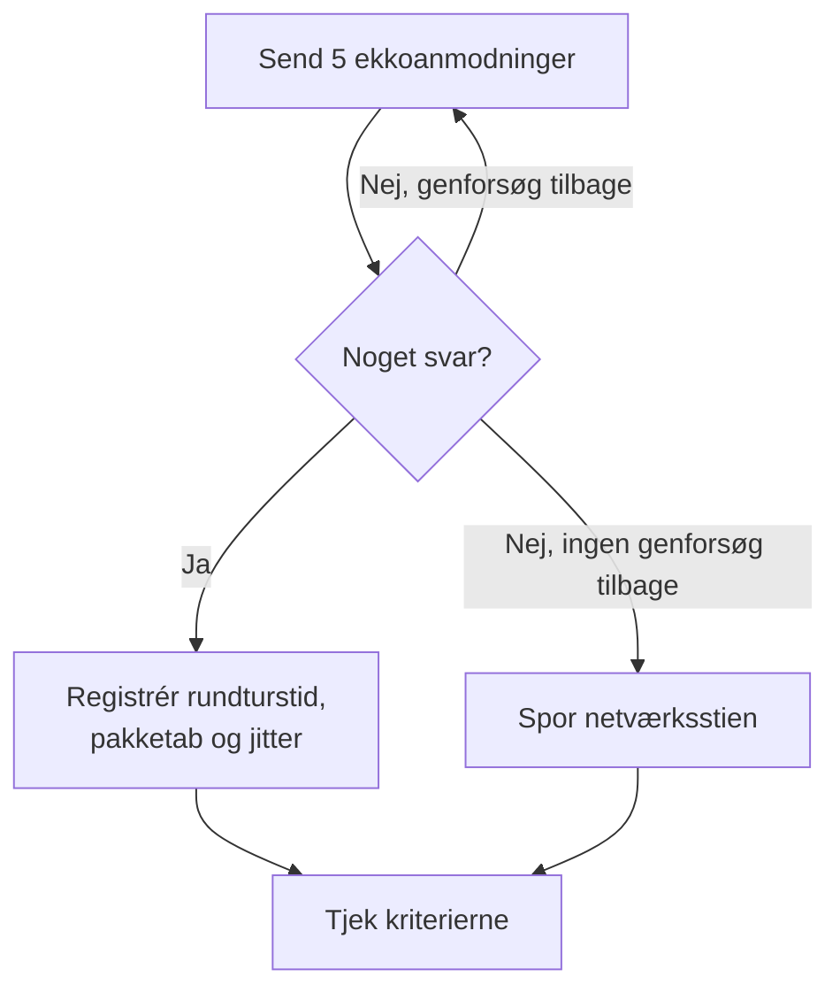

# IP-monitor

En IP-monitor tjekker, at en IPv4- eller IPv6-adresse svarer på ping (ICMP-ekkoanmodninger), og måler rundturstiden, pakketabet og jitteren. Brug den til infrastruktur, du kender på adressen, som en gateway, en load balancers virtuelle IP eller en server med fast adresse.

:::cards
- [Opret monitoren](#opret-en-ip-monitor): Seks trin i dashboardet.
- [Konfigurationsmuligheder](#konfigurationsmuligheder): Adressen, timeout og genforsøg.
- [Overvågningskriterier](#overvågningskriterier): Tilgængelighed, latens, pakketab og jitter.
- [Fejlfinding](#fejlfinding): Når adressen er oppe, men monitoren siger offline.
:::

## Sådan virker det

En IP-monitor kører det samme tjek som en [ping-monitor](/docs/monitor/ping-monitor). Ved hvert tjek sender en sonde fem ekkoanmodninger til adressen. Kommer der mindst ét svar tilbage, er adressen online, og sonden registrerer den gennemsnitlige rundturstid som svartid sammen med pakketabet, jitteren og det hurtigste og langsomste svar. Kommer der intet svar tilbage, prøver sonden igen, op til det antal genforsøg, du tillader. Derefter kører OneUptime resultatet gennem monitorens kriterier.

Når et tjek fejler, sporer sonden også ruten til adressen og vedhæfter det, den fandt, til resultatet som **Network Path at Time of Failure**, så du kan se, hvor ruten brød sammen.

Hvilken du skal bruge:

| Monitor | Tager | Brug den, når |
| --- | --- | --- |
| **IP** | Kun en IP-adresse | Selve adressen er det, du overvåger, og den ændrer sig ikke. |
| [Ping](/docs/monitor/ping-monitor) | Et værtsnavn eller en IP-adresse | Du kender værten på navn; navnet slås op ved hvert tjek, så monitoren følger DNS-ændringer. |

> [!NOTE]
> Nogle hostingudbydere blokerer ICMP på de maskiner, en sonde kører på. En sonde, der slet ikke kan sende ping, tjekker i stedet TCP-port `80` på adressen, så monitoren stadig siger, om den kan nås. Pakketab og jitter måles så ikke.

En sonde, der har mistet sin egen netværksforbindelse, rapporterer intet resultat, så den kan ikke markere din adresse som offline.

## Før du starter

- **En rolle, der kan oprette monitorer**: Project Owner, Project Admin, Project Member, Monitor Admin eller Monitor Member eller en brugerdefineret rolle med tilladelsen Create Monitor.
- **En sonde, der kan nå adressen**, med ICMP tilladt på vejen. Dit projekts standardsonder vælges for hver ny monitor. Står der en firewall foran den, så tillad ICMP-ekkoanmodninger fra [OneUptime Clouds sonde-IP-adresser](/docs/configuration/ip-addresses). En privat adresse har brug for en [brugerdefineret sonde](/docs/probe/custom-probe) på det netværk, og en IPv6-adresse har brug for en sonde med IPv6-forbindelse.

## Opret en IP-monitor

:::steps
### Start en ny monitor

Gå til **Monitorer**, og klik på **Opret monitor**. Klik på **Flere monitortyper** under **Monitortype**, og vælg **IP** under **Basic Monitoring**.

### Navngiv den

Angiv et **Navn**, som `Office gateway`, og klik så på **Næste**.

### Angiv adressen

Angiv under **IP-adresse** den IPv4- eller IPv6-adresse, der skal tjekkes, som `192.168.1.1` eller `2001:db8::1`. Et værtsnavn accepteres ikke: feltet viser en fejl. For at pinge en vært på navn bruger du en [ping-monitor](/docs/monitor/ping-monitor).

### Test den

Klik på **Test monitor**, vælg en sonde under **Vælg sonde**, og klik på **Kør test**. **Overvågningstestresultat** viser de rundturstider og det pakketab, sonden så.

### Gennemgå kriterierne

**Monitorkriterier** starter med [standardkriterierne](#standardkriterier): offline, når adressen ikke svarer, online, når den gør. Ret dem efter behov, og klik så på **Næste**.

### Vælg sonder, og opret

Behold eller ret **Sonder** og **Overvågningsinterval** (det starter på **Hvert 5. minut**), og klik så på **Opret monitor**. Monitorens side åbner.
:::

## Konfigurationsmuligheder

| Felt | Standard | Hvad du angiver |
| --- | --- | --- |
| **IP-adresse** | Ingen | En IPv4-adresse, som `192.168.1.1`, eller en IPv6-adresse, som `2001:db8::1`. Kantede parenteser om en IPv6-adresse fjernes. |
| **Anmodningstimeout (sekunder)** (under **Flere felter**) | `60` | Hvor længe der ventes på et svar ved hvert forsøg. Maksimum er 60 sekunder. |
| **Genforsøg ved fejl** (under **Flere felter**) | Sondens standard, som regel `3` | Hvor mange gange et mislykket forsøg gentages. Maksimum er 3. |

**Genforsøg ved fejl** tæller genforsøg _efter_ det første forsøg, så `0` kører tjekket én gang og `2` op til tre gange. Står feltet tomt, bruges sondens standard: 3, medmindre sondens `PROBE_MONITOR_RETRY_LIMIT` siger andet. Hver fejl forsøges igen, timeouts medregnet, med en pause på et sekund mellem forsøgene. Et vellykket tjek, hvis svar tog længere end 10 sekunder, tjekkes også igen.

## Overvågningskriterier

Kriterier afgør, hvornår adressen tæller som online, forringet eller offline, og om det erklærer en hændelse eller opretter en advarsel. Hvert kriterium tjekker et eller flere filtre:

| Filter | Betingelser | Hvad det tjekker |
| --- | --- | --- |
| **Is Online** | **Sand**, **Falsk** | Om mindst én ekkoanmodning fik svar. |
| **Svartid (i ms)** | **Greater Than**, **Less Than**, **Greater Than Or Equal To**, **Less Than Or Equal To** | Svarenes gennemsnitlige rundturstid. |
| **Packet Loss (in %)** | **Greater Than**, **Less Than**, **Greater Than Or Equal To**, **Less Than Or Equal To** | Andelen af de fem ekkoanmodninger, der ikke fik svar. |
| **Jitter (in ms)** | **Greater Than**, **Less Than**, **Greater Than Or Equal To**, **Less Than Or Equal To** | Standardafvigelsen af rundturstiderne over pakkerne i ét tjek. |
| **Is Request Timeout** | **Sand**, **Falsk** | Om pingen fik timeout ved hvert forsøg. |

Med to eller flere filtre afgør **Matchbetingelse**, om **Alle** skal matche, eller om **Enhver** enkelt er nok. Et kriteriums **Handlinger** afgør, hvad det gør: ændrer monitorstatus, opretter en advarsel, erklærer en hændelse eller flere af dem.

### Standardkriterier

En ny IP-monitor starter med to kriterier:

- **Offline** — adressen svarer ikke på nogen af ekkoanmodningerne eller kan slet ikke nås efter alle genforsøg. Monitoren markeres som **Offline**, og der oprettes en hændelse med navnet "_monitor name_ is offline". Hændelsen løser sig selv, når adressen svarer igen.
- **Oppe** — adressen svarer. Monitoren markeres som **I drift**.

Kriterier tjekkes fra top til bund, og det første, der matcher, afgør, hvad der sker. Når intet matcher, viser monitoren sin standardstatus: **I drift**, medmindre du vælger en anden under **Flere felter** under kriterierne.

### Evaluering over en periode

**Evaluér disse kriterier over en periode** er et afkrydsningsfelt under et filter, der tilbydes for **Is Online**, **Svartid (i ms)**, **Packet Loss (in %)** og **Jitter (in ms)**. Slå det til for at bedømme et vindue af tidligere tjek i stedet for kun det seneste: vælg en aggregering under **Evaluér** og et vindue fra 2 til 60 minutter under **For de seneste (i minutter)**.

| Aggregering | Matcher, når |
| --- | --- |
| **Gennemsnit**, **Sum**, **Maximum Value**, **Minimum Value** | Den værdi over vinduet opfylder betingelsen. Kun numeriske filtre. |
| **All Values** | Hvert tjek i vinduet opfylder betingelsen. |
| **Any Value** | Mindst ét tjek i vinduet opfylder betingelsen. |

**All Values** matcher først, når vinduet virkelig er dækket af data. En monitor, der lige er oprettet, eller en, hvis tjek ikke længere er blevet registreret, har ikke nok historik til at sige noget om de seneste N minutter, så kriteriet venter i stedet for at matche på den ene måling, det har. **Any Value** er indstillingen for "sig det med det samme, når et enkelt tjek overskrider grænsen" og udløses stadig med det samme.

**Hvis ingen data** afgør, hvad der sker, så længe vinduet ikke kan bære kriteriet:

| Mulighed | Hvad der sker | Brug den til |
| --- | --- | --- |
| **Ignore** (standard) | Kriteriet matcher ikke. | Almindelige tærskeladvarsler. |
| **Trigger** | De manglende data tæller som problemet. | Tjek, hvor stilhed i sig selv er en fejl. |
| **Treat As Zero** | Vinduet sammenlignes som et enkelt nul. | Tællere, hvor ingen hændelser virkelig betyder nul. |

### Eksempelkriterier

| Mål | Filter | Betingelse | Værdi |
| --- | --- | --- | --- |
| Offline, når adressen ikke kan nås | **Is Online** | **Falsk** | — |
| Advar, når latensen er høj | **Svartid (i ms)** | **Greater Than** | `100` |
| Markér adressen som forringet på en forbindelse med tab | **Packet Loss (in %)** | **Greater Than** | `20` |
| Advar ved en ustabil forbindelse | **Jitter (in ms)** | **Greater Than** | `30` |

## Fejlfinding

:::details Adressen er oppe, men monitoren siger offline
Adressen, eller en firewall foran den, svarer ikke på ICMP-ekkoanmodninger fra sonden. Tillad ICMP-ekkoanmodninger fra sonderne, eller overvåg i stedet en tjeneste på den adresse med en [port-monitor](/docs/monitor/port-monitor). **Network Path at Time of Failure** på det mislykkede tjek viser, hvor langt ruten nåede.
:::

:::details En IPv6-adresse fejler altid
Sonden, der kørte tjekket, har ingen IPv6-forbindelse; fejlen siger det. Kør monitoren på en sonde med IPv6: se [Brugerdefinerede probes](/docs/probe/custom-probe).
:::

:::details Pakketab og jitter er tomme
Sonden, der kørte tjekket, kan ikke sende ping, så den tjekkede i stedet TCP-port `80`, som ikke måler nogen af dem. Kør monitoren på en sonde, der må sende ICMP.
:::

## Næste skridt

:::cards
- [Ping-monitor](/docs/monitor/ping-monitor): Ping en vært på navn, og følg DNS-ændringer.
- [Port-monitor](/docs/monitor/port-monitor): Tjek en tjeneste på adressen, ikke kun adressen.
- [Brugerdefinerede probes](/docs/probe/custom-probe): Tjek private adresser og IPv6-adresser fra dit eget netværk.
- [Hændelser](/docs/incidents/index): Hvad der sker, efter at monitoren har erklæret en.
:::
