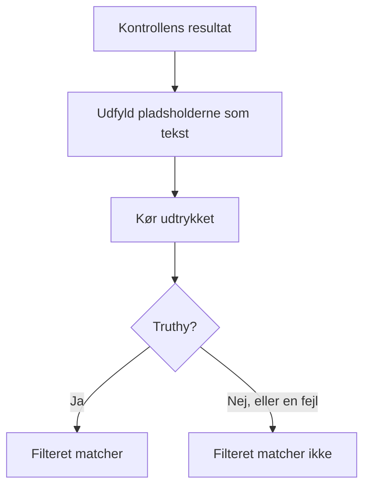

# JavaScript-udtryk

Et kriteriefilter **JavaScript Expression** afgør med en linje JavaScript i stedet for en fast sammenligning, om en monitors kriterium er opfyldt. Brug det, når de indbyggede filtre ikke kan udtrykke betingelsen — et felt dybt inde i et JSON-svar, to værdier, der sammenlignes med hinanden, eller flere kontroller kombineret med `&&` og `||`.

:::cards
- [Sådan virker det](#sådan-virker-det): Pladsholderne udfyldes, derefter kører udtrykket.
- [Variabler](#variabler-efter-monitortype): Hvad hver monitortype giver dig.
- [Eksempler](#eksempler): Udtryk til API'er, indgående anmodninger og databaser.
- [Regler for anførselstegn](#regler-for-anførselstegn): Den fejl, næsten alle laver.
:::

## Sådan virker det

Før udtrykket kører, erstattes hver pladsholder `{{variable}}` i det med værdien fra monitorens seneste kontrol — som ren tekst. Resultatet køres derefter som JavaScript. Hvis det giver en sand værdi (truthy), matcher filteret; alt andet, også en fejl, betyder, at det ikke matcher.



Fordi pladsholderne erstattes som tekst, bliver `{{responseBody.item}}` til den rå værdi. En streng skal stå i anførselstegn for at være en JavaScript-streng; et tal eller en boolesk værdi skal ikke — se [Regler for anførselstegn](#regler-for-anførselstegn). Udtryk kører på OneUptime-serveren, i en isoleret sandkasse.

## Tilføj et filter af typen JavaScript Expression

:::steps
### Åbn kriterierne

Åbn **Konfiguration → Kriterier** på monitoren, og klik på **Rediger Overvågningskriterier**, eller brug trinnet **Kriterier** i **Opret monitor**. Arbejd i det kriterium, du vil ændre, eller klik på **Tilføj kriterier** for et nyt.

### Tilføj et filter

Klik på **Tilføj filter** under **Filtre**, og sæt dets **Filtertype** til **JavaScript Expression**. **Filterbetingelse** er **Evaluates To True**.

### Skriv udtrykket

Indtast udtrykket i **Værdi** med [variablerne for monitorens type](#variabler-efter-monitortype). Linket under filteret, **Read documentation for using JavaScript expressions here.**, åbner denne side.

### Gem

Gem monitoren. Filteret evalueres ved monitorens næste kontrol.
:::

## Variabler efter monitortype

JavaScript-udtryk tilbydes for monitorer af typen Website, API, Incoming Request, Incoming Email, SQL Query og Database Health.

### Websted- og API-monitorer

| Variabel | Beskrivelse | Type |
| --- | --- | --- |
| `responseBody` | Svarets brødtekst. Hvis brødteksten er JSON, fortolkes den; ellers, for eksempel ved HTML eller XML, er den en streng. | `string` eller `JSON` |
| `responseHeaders` | Svarets headere, med navne i små bogstaver. | `Dictionary<string>` |
| `responseStatusCode` | Svarets statuskode. | `number` |
| `responseTimeInMs` | Svartiden i millisekunder. | `number` |
| `isOnline` | Om monitoren tæller svaret som online. | `boolean` |

### Monitorer for indgående anmodninger

| Variabel | Beskrivelse | Type |
| --- | --- | --- |
| `requestBody` | Anmodningens brødtekst. | `string` eller `JSON` |
| `requestHeaders` | Anmodningens headere, med navne i små bogstaver. | `Dictionary<string>` |

### Monitorer for SQL-forespørgsler

| Variabel | Beskrivelse | Type |
| --- | --- | --- |
| `rowCount` | Antallet af rækker, som forespørgslen returnerede. | `number` |
| `scalarValue` | Den første kolonne i den første række. | vilkårlig |
| `firstRow` | Den første række, som par af kolonne og værdi. | `JSON` |
| `executionTimeInMs` | Hvor lang tid forespørgslen tog, i millisekunder. | `number` |
| `queryError` | Forespørgslens fejl, hvis der var en. | `string` |
| `isOnline` | Om databasen kunne nås, og forespørgslen lykkedes. | `boolean` |

### Monitorer for databasetilstand

`isOnline`, `engineVersion`, `connectionError`, `collectedGroups`, `unavailableGroups` og `metrics`. Se [Variabler til JavaScript-udtryk](/docs/monitor/database-health-monitor#variabler-til-javascript-udtryk) på siden om databasetilstands-monitoren.

### Monitorer for indgående e-mail

Filteret tilbydes, men der er ingen e-mailfelter knyttet til det: et udtryk kan ikke læse emnet, afsenderen, brødteksten eller modtageren. Brug i stedet e-mailfiltertyperne — se [Indgående e-mail-monitor](/docs/monitor/incoming-email-monitor#tilgængelige-kriteriefelter).

## Eksempler

Hver linje nedenfor er ét komplet udtryk. For en JSON-brødtekst i et svar som denne:

```json
{
  "item": "hello",
  "count": 3,
  "items": [{ "name": "hello" }]
}
```

| Udtryk | Matcher, når |
| --- | --- |
| `"{{responseBody.item}}" === "hello"` | Feltet `item` er `hello`. |
| `{{responseBody.count}} > 2` | Feltet `count` er større end 2. |
| `"{{responseBody.items[0].name}}" === "hello"` | Det første element i `items` har navnet `hello`. |
| `{{responseStatusCode}} === 200 && {{responseTimeInMs}} < 500` | Status er 200, og svaret tog mindre end et halvt sekund. |
| `/hel+o/.test("{{responseBody.item}}")` | Feltet `item` matcher et regulært udtryk. |
| `"{{responseHeaders.content-type}}".startsWith("application/json")` | Svaret er JSON. Headernavne er med små bogstaver. |

Kombiner betingelser med `&&` og `||`, og gruppér dem med parenteser:

```javascript
({{responseStatusCode}} === 200 || {{responseStatusCode}} === 204) && {{responseTimeInMs}} < 1000
```

For en monitor for indgående anmodninger, der modtager `{"status": "degraded", "region": "eu"}` som `Content-Type: application/json`:

```javascript
"{{requestBody.status}}" === "degraded" && "{{requestBody.region}}" === "eu"
```

For en monitor for SQL-forespørgsler, hvis forespørgsel returnerer et antal, så advar ved et højt antal eller en langsom forespørgsel:

```javascript
{{scalarValue}} > 50 || {{executionTimeInMs}} > 2000
```

For en monitor for databasetilstand skal du læse én måling ved at slå op i hele objektet `metrics` — seriernes navne indeholder punktummer, så de kan ikke stå inden i klammerne:

```javascript
{{metrics}}['oneuptime.monitor.database.connections.used.percent'] > 90
```

## Regler for anførselstegn

`{{var}}` erstattes med værdien, som tekst. For at sammenligne en streng skal du sætte den i anførselstegn, som i `"{{responseBody.item}}" === "hello"`; for at sammenligne et tal skal du lade det stå uden, som i `{{responseStatusCode}} === 200`.

| Værditype | Skriv den | Eksempel |
| --- | --- | --- |
| Streng | I anførselstegn | `"{{responseBody.status}}" === "ok"` |
| Tal | Uden anførselstegn | `{{responseTimeInMs}} < 500` |
| Boolesk værdi | Uden anførselstegn | `{{isOnline}} === true` |
| Objekt eller array | Uden anførselstegn, og slå derefter op i det | `{{responseHeaders}}['content-type']` |

Tre ting, du skal være opmærksom på:

- **En pladsholder i anførselstegn er alene altid sand.** `"{{responseBody.healthy}}"` er den ikke-tomme streng `"false"`, når feltet er `false`. Sammenlign den: `"{{responseBody.healthy}}" === "true"`, eller lad den stå uden anførselstegn: `{{responseBody.healthy}} === true`.
- **Værdier escapes ikke.** En værdi, der indeholder et dobbelt anførselstegn eller et linjeskift, afslutter strengen for tidligt, og udtrykket fejler. For at søge efter tekst på en HTML-side skal du i stedet bruge filteret **Svarets brødtekst**.
- **En sti, der mangler, bliver stående, som den er skrevet.** Hvis kontrollen ikke har et sådant felt, bliver `{{responseBody.item}}` stående i udtrykket, som det er, hvilket som regel er en syntaksfejl — så filteret matcher ikke.

## Begrænsninger

Et udtryk har 5 sekunder til at køre. Et udtryk, der tager længere tid eller kaster en fejl, matcher ikke, og fejlen skrives til OneUptime-serverens log.

## Fejlfinding

:::details Udtrykket matcher aldrig
Kontrollér først anførselstegnene: en strengpladsholder uden anførselstegn bliver til et løst ord, hvilket er en syntaksfejl, og en fejl matcher aldrig. Kontrollér derefter, at stien findes i kontrollens resultat — en pladsholder for en sti, der ikke findes, udfyldes ikke.
:::

:::details Udtrykket matcher altid
En pladsholder i anførselstegn er alene en ikke-tom streng, og den er altid truthy. Sammenlign den med en værdi.
:::

## Næste skridt

:::cards
- [Hændelse- og advarselsskabeloner](/docs/monitor/incident-alert-templating): Brug de samme pladsholdere i titler og beskrivelser af hændelser.
- [API-monitor](/docs/monitor/api-monitor): Kontrollér et HTTP-endpoint og dets svar.
- [Indgående anmodning-monitor](/docs/monitor/incoming-request-monitor): Vurder anmodninger, som andre systemer sender dig.
:::
