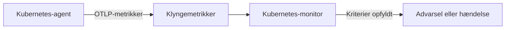

# Kubernetes-monitor

En Kubernetes-monitor advarer på de metrikker, som OneUptimes Kubernetes-agent sender fra en klynge: noder, pods, containere, arbejdsbyrder, autoskalere og kontrolplanet. Start fra en færdig advarselsskabelon, vælg en enkelt metrik, eller skriv din egen forespørgsel, og angiv derefter den tærskel, der åbner en advarsel eller en hændelse.

:::cards
- [Installér agenten](/docs/monitor/kubernetes-agent): Én Helm-kommando bringer klyngen ind i OneUptime.
- [Opret monitoren](#opret-en-kubernetes-monitor): Vælg klyngen, og derefter en skabelon, en metrik eller en forespørgsel.
- [Advarselsskabeloner](#færdige-advarselsskabeloner): Sytten færdige advarsler, fra CrashLoopBackOff til etcd.
- [Kriterier](#overvågningskriterier): Statiske tærskler og anomalidetektion.
:::

## Sådan virker det

Agenten sender klyngens metrikker til OneUptime over OTLP, hver mærket med klyngens navn (`k8s.cluster.name`, chartets `clusterName`). De første data fra et nyt navn registrerer klyngen under **Kubernetes**, og fra da af kan klyngen vælges i en Kubernetes-monitor. Hvert minut forespørger monitoren disse metrikker over sit **Tidsinterval**, aggregerer dem og sammenligner resultatet med sine kriterier.

## Før du begynder

- OneUptimes Kubernetes-agent kører i klyngen. Se [Kubernetes-agent (Helm-installation)](/docs/monitor/kubernetes-agent); klyngen vises under **Kubernetes** et par minutter efter installationen.
- Til kontrolplan-skabelonerne (**etcd No Leader**, **API Server Request Saturation**, **Scheduler Backlog**): agentens indsamling fra kontrolplanet, `controlPlane.enabled`. Administrerede klynger (EKS, GKE, AKS) eksponerer ikke disse endpoints, så der modtager de monitorer aldrig data.

## Opret en Kubernetes-monitor

:::steps
### Start en ny monitor

Gå til **Monitorer**, og klik på **Opret monitor**. Vælg **Kubernetes** under **Flere monitortyper** – eller skriv `k8s` i søgefeltet.

### Vælg klyngen

Vælg den i **Kubernetes-klynge**. Listen indeholder hver klynge, agenten har rapporteret fra.

### Vælg, hvad der skal overvåges

Brug en af de tre faner:

| Fane | Hvad du vælger |
| --- | --- |
| **Quick Setup** | En [færdig advarselsskabelon](#færdige-advarselsskabeloner). Den udfylder metrikken, omfanget, tidsintervallet og kriterierne; du kan stadig ændre **Tidsinterval**. |
| **Custom Metric** | Én metrik fra [metrikkataloget](#metrikkatalog), derefter dens **Ressourceomfang**, filtre, **Aggregering** (Gennemsnit, Maksimum, Minimum, Sum eller Antal) og **Tidsinterval**. |
| **Avanceret** | **Ressourceomfang**, filtre og **Tidsinterval** samt dine egne metrikforespørgsler og formler under **Vælg målinger**, med et livediagram over resultatet. |

### Angiv kriterierne

Angiv, hvornår monitoren skifter status, og hvornår den åbner en advarsel eller en hændelse – se [Overvågningskriterier](#overvågningskriterier). En skabelon har allerede udfyldt dem: gennemgå tærsklerne, alvorlighederne og vagtpolitikkerne.

### Gem monitoren

Gør formularen færdig, og gem. Monitoren vises under **Monitorer**, og dens status følger dine kriterier fra den første evaluering.
:::

## Konfigurationsmuligheder

### Ressourceomfang og filtre

**Ressourceomfang** angiver det niveau, metrikken evalueres på, og afgør, hvilke filtre formularen viser. Hvert filter er valgfrit.

| Omfang | Overvåger | Filtre |
| --- | --- | --- |
| Klynge | Hele klyngen | — |
| Navnerum | Ressourcer i et navnerum | **Navnerum** |
| Arbejdsbyrde | En deployment, statefulset, daemonset, job eller cronjob | **Navnerum**, **Arbejdsbelastningsnavn** |
| Node | En node i klyngen | **Nodenavn** |
| Pod | En pod | **Navnerum**, **Pod-navn** |

### Tidsinterval

**Tidsinterval** er det vindue, metrikforespørgslen dækker, hver gang monitoren evalueres, fra **Past 1 Minute** op til **Past 365 Days**. Korte vinduer (1 til 15 minutter) passer til advarsler; længere vinduer udjævner støjende metrikker.

### Metrikforespørgsler og formler

På fanen **Avanceret** angiver hver forespørgsel en metrik, hvordan dens værdier aggregeres, og valgfrie attributfiltre. En **formel** kombinerer forespørgsler med aritmetik – skabelonerne for nodeudnyttelse dividerer f.eks. forbruget med den allokerbare kapacitet.

## Metrikkatalog

Fanen **Custom Metric** tilbyder disse metrikker, grupperet efter ressourcetype:

| Kategori | Metrikker |
| --- | --- |
| Pod | Pod CPU Usage, Pod Memory Usage, Pod Phase (Code), Pod Filesystem Usage, Pod Memory Limit Utilization, Pod CPU Limit Utilization, Pod Network I/O (Cumulative, Both Directions) |
| Node | Node CPU Usage, Node Allocatable CPU, Node Memory Usage, Node Filesystem Usage, Node Allocatable Memory, Node Ready Condition, Node Filesystem Available |
| Container | Container Restarts, Container CPU Limit, Container CPU Request, Container Memory Limit, Container Memory Request, Container Ready |
| Arbejdsbyrde | Deployment Available Replicas, Deployment Desired Replicas, DaemonSet Misscheduled Nodes, DaemonSet Ready Nodes, StatefulSet Ready Replicas, Job Failed Pods, Job Successful Pods |
| HPA | HPA Current Replicas, HPA Desired Replicas, HPA Max Replicas, HPA Min Replicas |
| Kontrolplan | etcd Has Leader, API Server In-Flight Requests, Scheduler Pending Pods |

> [!NOTE]
> **Pod CPU Usage** og **Node CPU Usage** er i kerner, ikke procent: `0.18` er 0,18 af en kerne. **Pod Phase (Code)** er en kode (1 Pending, 2 Running, 3 Succeeded, 4 Failed, 5 Unknown) – aggregér den med Maksimum eller Minimum, aldrig Sum. Kontrolplan-metrikker kommer kun, når agentens indsamling fra kontrolplanet er slået til.

## Overvågningskriterier

### Hvad der evalueres

Disse monitorer evaluerer altid **Metric Value** – værdien af den konfigurerede metrikforespørgsel eller formel. Kriterieformularen har ingen vælger for filtertype; den viser **Metrik**, **Aggregering**, **Betingelse** og **Threshold**.

### Aggregeringstyper

| Aggregering | Beskrivelse |
| --- | --- |
| Gennemsnit | Gennemsnitsværdi over tidsvinduet |
| Sum | Summen af alle værdier |
| Maximum Value | Højeste værdi i tidsvinduet |
| Minimum Value | Laveste værdi i tidsvinduet |
| All Values | Alle værdier skal matche kriteriet |
| Any Value | Mindst én værdi skal matche |

### Betingelser

Statiske tærskler sammenlignes med den **Threshold**, du angiver: **Greater Than**, **Less Than**, **Greater Than Or Equal To**, **Less Than Or Equal To** og **Equal To**.

Anomalidetektion mod en baseline kræver ingen tærskel. Vælg en af disse betingelser, så viser formularen i stedet **Følsomhed** og **Baseline-vindue**:

| Betingelse | Matcher, når værdien |
| --- | --- |
| **Anomalously High** | Stiger over det forventede interval |
| **Anomalously Low** | Falder under det forventede interval |
| **Anomalous** | Forlader det forventede interval i en af retningerne |

Hver måling sammenlignes med en baseline for samme time på ugen, bygget ud fra **Baseline-vindue** (som standard 14 dage; 28, 60 eller 90 dage). **Følsomhed** angiver, hvor bredt det forventede interval er: **Lav (4σ — kun grove afvigelser)**, **Mellem (3σ — anbefalet)**, som er standard, eller **Høj (2σ — mere støjende, meget stabile tjenester)**. Anomalibetingelser forbliver i en "Learning"-tilstand og giver ingen advarsler, før der findes mindst det valgte baseline-vindue af metrikhistorik.

**Hvis ingen data**, under **Flere felter**, afgør, hvad der sker, når forespørgslen intet returnerer i vinduet: **Ignore** (standard) matcher ikke, **Trigger** behandler stilheden som problemet, og **Treat As Zero** sammenligner et nul. Tid, hvor OneUptime selv ikke modtog data, er aldrig manglende data: en kontrol, hvis vindue indeholder sådan tid, venter i stedet, som [Når OneUptime ikke modtager data](/docs/monitor/when-oneuptime-is-not-receiving) forklarer.

## Færdige advarselsskabeloner

Fanen **Quick Setup** viser disse skabeloner, grupperet efter kategori. Hver udfylder to kriterier: et, der markerer monitoren som offline og åbner en hændelse og en advarsel, mens betingelsen gælder, og et, der bringer den online igen, når betingelsen ophører.

| Skabelon | Kategori | Udløses, når | Alvorlighed |
| --- | --- | --- | --- |
| CrashLoopBackOff Detection | Arbejdsbyrde | En container er genstartet mere end 5 gange, siden dens pod blev oprettet | Kritisk |
| Pod Stuck in Pending | Planlægning | En pod er i fasen Pending i hver måling i et vindue på 15 minutter | Warning |
| Node Not Ready | Node | En node melder NotReady | Kritisk |
| High Node CPU Utilization | Node | En nodes gennemsnitlige CPU-forbrug er over 90 % af dens allokerbare CPU | Warning |
| High Node Memory Utilization | Node | En nodes gennemsnitlige hukommelsesforbrug er over 85 % af dens allokerbare hukommelse | Warning |
| Deployment Replica Mismatch | Arbejdsbyrde | En deployment har færre tilgængelige replikaer end ønsket i 15 minutter | Warning |
| Job Failures | Arbejdsbyrde | Et job har fejlede pods | Warning |
| etcd No Leader | Kontrolplan | etcd har ingen valgt leder | Kritisk |
| API Server Request Saturation | Kontrolplan | API-serveren holder 200 eller flere igangværende forespørgsler i hele vinduet | Kritisk |
| Scheduler Backlog | Planlægning | Schedulerens kø af ventende pods er ikke tom i 5 minutter | Warning |
| High Node Disk Usage | Lagerplads | En nodes filsystem er mere end 90 % fuldt | Warning |
| DaemonSet Misscheduled Nodes | Arbejdsbyrde | Et DaemonSet kører pods på noder, der ikke længere matcher dets nodeselector, affinitet eller tolerationer | Warning |
| High Node CPU Request Commitment | Node | En nodes samlede CPU-requests fra containere overstiger 90 % af dens allokerbare CPU | Warning |
| High Node Memory Request Commitment | Node | En nodes samlede hukommelses-requests fra containere overstiger 90 % af dens allokerbare hukommelse | Warning |
| HPA Saturated at Max Replicas | Arbejdsbyrde | En HPA kører på 90 % eller mere af sin `maxReplicas` | Kritisk |
| Pod Memory Saturating Container Limit | Arbejdsbyrde | En pod bruger mere end 90 % af sine containeres hukommelsesgrænse | Kritisk |
| Pod CPU Saturating Container Limit | Arbejdsbyrde | En pod bruger mere end 90 % af sine containeres CPU-grænse | Warning |

Skabeloner på metrikker pr. objekt evaluerer hver node, pod, deployment, job, DaemonSet eller HPA for sig, så en klynge med flere usunde pods får en hændelse pr. pod i stedet for én for hele klyngen.

> [!NOTE]
> **CrashLoopBackOff Detection** læser containerens samlede antal genstarter for dens nuværende pod, ikke en rate. En container, der sad fast i en crash-løkke og derefter kom sig, holder advarslen åben, indtil dens pod erstattes.

### Fang årsager, ikke kun symptomer

Skabelonerne på nodeniveau (High Node CPU Utilization, High Node Memory Utilization, Node Not Ready, Pod Stuck in Pending) udløses i *slutningen* af en kæde af ressourceudtømning, når klyngen allerede er forringet. Tre skabeloner udløses i *starten* af den, hvor løsningen som regel findes:

- **Pod Memory Saturating Container Limit** og **Pod CPU Saturating Container Limit** fanger en arbejdsbyrde, der ligger op ad sine egne grænser. At krydse en hukommelsesgrænse betyder en øjeblikkelig OOMKill; at krydse en CPU-grænse får kernen til at drosle poden, så den bliver langsommere uden nogensinde at fejle. Begge er den sædvanlige årsag bag CrashLoopBackOff og uforklaret latens.
- **HPA Saturated at Max Replicas** fanger en autoskalering uden mere luft. En arbejdsbyrde, hvis grænser pr. pod er for lave, bliver droslet eller dræbt, hvilket puster netop den metrik op, som HPA'en skalerer på – så autoskaleringen bliver ved med at tilføje replikaer, der hver især mangler lige så meget, indtil den rammer sit loft. At hæve grænserne er løsningen; at hæve `maxReplicas` gør det værre.

Slå dem til sammen i ethvert navnerum, der kører en autoskaleret arbejdsbyrde: kombinationen skelner "har reelt brug for mere kapacitet" fra "for få ressourcer pr. pod".

> [!NOTE]
> De to pod-grænseskabeloner dividerer podens forbrug med **summen** af dens containeres grænser, så pods med sidecars måles korrekt. Kubelets tal for podhukommelse omfatter genindvindelig sidecache, så en filtung arbejdsbyrde kan ligge højt på hukommelsesskabelonen uden nogensinde at blive OOMKilled: læs det som "nærmer sig grænsen", ikke "er ved at blive dræbt".

## Fejlfinding

:::details Klyngen er ikke på listen Kubernetes-klynge
Klynger registrerer sig selv ud fra agentens data under det `clusterName`, agenten blev installeret med. Kontrollér, at agentens pods kører, og at klyngen står under **Produkter → Infrastruktur → Kubernetes → Alle klynger**. [Kubernetes-agent (Helm-installation)](/docs/monitor/kubernetes-agent) dækker installationen, og hvad du skal kontrollere, når der ikke kommer data.
:::

:::details En kontrolplan-skabelon udløses aldrig
**etcd No Leader**, **API Server Request Saturation** og **Scheduler Backlog** læser metrikker, som kun agentens indsamling fra kontrolplanet henter. Slå `controlPlane.enabled` til i agentens Helm-værdier; den er slået fra som standard. Administrerede klynger (EKS, GKE, AKS) eksponerer ikke disse endpoints, så på dem modtager disse monitorer aldrig data.
:::

:::details En CPU-tærskel udløses aldrig
**Pod CPU Usage** og **Node CPU Usage** er i kerner, ikke procent, så en tærskel på `80` betyder 80 kerner. Angiv tærsklen i kerner, eller start fra **High Node CPU Utilization** eller **Pod CPU Saturating Container Limit**, som sammenligner en procentdel.
:::

:::details CrashLoopBackOff Detection forbliver åben, efter at poden er kommet sig
Skabelonen læser containerens samlede antal genstarter for dens nuværende pod, så tallet falder ikke tilbage, når det først har passeret 5. Advarslen løses, når poden erstattes, f.eks. af en ny udrulning, en eviction eller en tømning af noden.
:::

## Næste trin

:::cards
- [Kubernetes-agent (Helm-installation)](/docs/monitor/kubernetes-agent): Installér, opgradér og finjustér agenten med Helm.
- [Kubernetes-agent](/docs/telemetry/kubernetes-agent): Navnerumsfiltre, kontrolplan-metrikker, filtre for logalvorlighed og AI-agenten.
- [Metrik-monitor](/docs/monitor/metrics-monitor): Advar på enhver metrik, også agentens brugerdefinerede metrikker og eBPF-metrikker.
- [Hændelse- og advarselsskabeloner](/docs/monitor/incident-alert-templating): Sæt den pod eller node, der overskrider grænsen, i hændelsestitler.
:::
