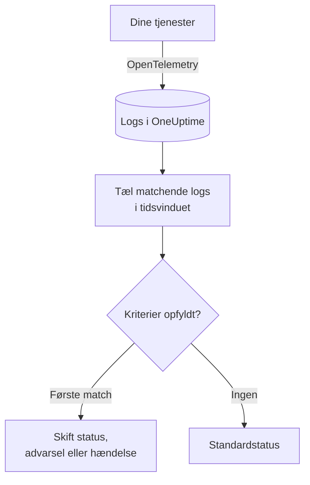
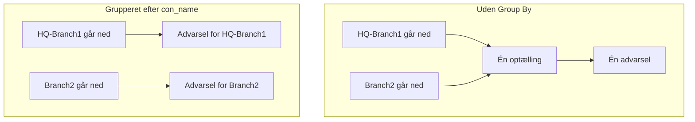

# Log-monitor

En log-monitor tæller inden for et tidsvindue de logs, dine tjenester sender til OneUptime, som matcher dine filtre (tekst, alvorlighed, tjeneste, attributter). Når antallet opfylder dine kriterier, ændrer den monitorens status, opretter en advarsel eller erklærer en hændelse. Brug den til at opdage en stigning i fejl, en bestemt fejlmeddelelse eller en tjeneste, der er holdt op med at logge.

:::cards
- [Opret monitoren](#opret-en-log-monitor): Vælg, hvilke logs der tælles, og hvornår du får en advarsel.
- [Sådan evalueres den](#sådan-evalueres-den): Tidsvinduet, optællingen og cyklussen på ét minut.
- [Kriterier](#kriterier): Tærskler, anomalidetektion og standardværdierne.
- [Advarsler pr. gruppe](#advarsler-pr-gruppe-group-by): Én advarsel pr. tunnel, bruger eller interface.
:::

## Sådan virker det



Hvert minut tæller OneUptime de logs, der matcher monitorens filtre og er ankommet inden for dens tidsvindue. Det sammenligner antallet med monitorens kriterier fra top til bund, og det første kriterium, der matcher, afgør, hvad der sker. Når intet matcher, går monitoren tilbage til sin standardstatus.

## Før du starter

- Dine tjenester sender logs til OneUptime via OpenTelemetry (eller en anden logkilde, som OneUptime indlæser). Se [OpenTelemetry](/docs/telemetry/open-telemetry).
- For at filtrere eller gruppere på en værdi inde i loglinjen, såsom navnet på en tunnel eller en bruger, gør du den først til en attribut med en [logpipeline](/docs/telemetry/log-pipelines).

## Opret en log-monitor

:::steps
### Start en ny monitor

Gå til **Monitorer**, og klik på **Opret monitor**.

### Vælg Logs

Under **Monitortype** klikker du på **Flere monitortyper** og vælger **Protokoller** under **Telemetri**, eller du skriver `logs` i søgefeltet. Angiv et **Navn**, og klik derefter på **Næste**.

### Vælg de logs, der skal tælles

I **Log-monitor-konfiguration** angiver du **Overvågningslogfiler, der indeholder denne tekst**, **Overvågningslogfiler i (time)** og **Logalvorlighed**. Et filter, du lader stå tomt, matcher alle logs. **Forhåndsvisning af protokoller** under filtrene viser de logs, de matcher lige nu.

### Indsnævr dem (valgfrit)

Åbn **Flere felter** for at filtrere efter telemetritjeneste, infrastrukturentitet eller attribut. Vil du have én advarsel pr. tunnel, bruger eller interface i stedet for én for hele monitoren, så tilføj attributten under **Group by Attributes** (se [Advarsler pr. gruppe](#advarsler-pr-gruppe-group-by)).

### Angiv kriterierne

Kortet **Monitorkriterier** starter med to kriterier: offline, med en hændelse, når ingen logs matcher; online, når mindst én gør. Ret dem til det, du vil have advarsler om (se [Kriterier](#kriterier)).

### Opret monitoren

Klik på **Opret monitor**. Monitoren åbner på sin side **Oversigt**, og dens første evaluering kører inden for et minut.
:::

## Hvad den forespørger

| Felt | Hvad det matcher | Standard |
| --- | --- | --- |
| **Overvågningslogfiler, der indeholder denne tekst** | Logs, hvis brødtekst indeholder denne tekst, uden forskel på store og små bogstaver. | Tom: alle logs |
| **Overvågningslogfiler i (time)** | Logs fra de seneste 5 sekunder op til de seneste 24 timer. | **Seneste 1 minut** |
| **Logalvorlighed** | Logs med en af de valgte alvorligheder. | Tom: alle alvorligheder |
| **Group by Attributes** | Intet filter: tæller hver kombination af disse attributters værdier for sig. | Tom: én optælling |
| **Filtrér efter telemetritjeneste** (under **Flere felter**) | Logs fra en af de valgte tjenester. | Tom: alle tjenester |
| **Filter by Infrastructure Entity** (under **Flere felter**) | Logs fra en af de valgte værter, pods, containere og andre entiteter. | Tom: alle entiteter |
| **Filtrér efter attributter** (under **Flere felter**) | Logs, hvis attributter opfylder alle betingelser. Hver betingelse har sin egen operator, såsom "er lig med" eller "indeholder". | Tom: ingen betingelse |

Alle de filtre, du angiver, skal matche, før en log tælles.

### Logalvorlighed

Hver log gemmes med en af syv alvorligheder. For logs fra OpenTelemetry kommer den fra loggens alvorlighedsnummer, så vælg efter alvorlighed og ikke efter den tekst, din logger skrev:

| Alvorlighed | OpenTelemetrys alvorlighedsnumre |
| --- | --- |
| **Spor** | 1–4 |
| **Debug** | 5–8 |
| **Information** | 9–12 |
| **Warning** | 13–16 |
| **Fejl** | 17–20 |
| **Fatal** | 21–24 |
| **Uspecificeret** | Alt andet |

## Sådan evalueres den

- **Hvert minut.** En log-monitor tjekkes ikke af sonder, så den har intet interval at angive og ingen side **Sonder og interval**.
- **Ét tal pr. evaluering.** Monitoren tæller de logs, der matcher alle filtre og er ankommet inden for **Overvågningslogfiler i (time)** før evalueringen. Med **Seneste 5 minutter** kigger hver evaluering fem minutter tilbage, så vinduerne for på hinanden følgende evalueringer overlapper.
- **Ingen logs er et antal på 0.** En tjeneste, der holder op med at logge, giver 0, og det er det, standardkriteriet for offline leder efter.
- **OneUptimes egen nedetid er ikke stilhed.** Så længe tidsvinduet rummer tid, hvor OneUptime selv ikke modtog data (det genstartede, blev opgraderet eller indhentede et efterslæb), venter tjekket: statussen ændres ikke, og ingen hændelse eller advarsel åbnes eller løses. Se [Når OneUptime ikke modtager data](/docs/monitor/when-oneuptime-is-not-receiving).
- **Kriterier fra top til bund.** Det første kriterium, der matcher, afgør det, så sæt det alvorligste øverst. En grupperet monitor fungerer anderledes: den tjekker alle kriterier for hver gruppe (se [Evalueringen af kriterier er anderledes](#evalueringen-af-kriterier-er-anderledes)).

Hver statusændring registreres med sin årsag på monitorens **Statustidslinje**.

## Kriterier

En log-monitors kriterier har én **Filtertype**: **Log Count**, antallet af logs, der matchede i vinduet. Vælg en **Filterbetingelse** og, for en tærskelbetingelse, en **Værdi**.

| Filterbetingelse | Matcher, når antallet af logs er… |
| --- | --- |
| **Greater Than** | over værdien |
| **Greater Than Or Equal To** | lig med værdien eller derover |
| **Less Than** | under værdien |
| **Less Than Or Equal To** | lig med værdien eller derunder |
| **Equal To** | præcis værdien |
| **Anomalously High** | over det forventede interval for denne time på ugen |
| **Anomalously Low** | under det interval |
| **Anomalous** | uden for det interval, i begge retninger |

Anomalibetingelserne har ingen **Værdi**. Vælg en **Følsomhed** (Low, Medium, som er standard, eller High) og et **Baseline-vindue** på 14 (standard), 28, 60 eller 90 dage. OneUptime omregner antallet til en rate pr. minut og sammenligner den med samme time på ugen over det vindue. Baselinen dækker kun monitorens tjenester og alvorligheder: dens tekst- og attributfiltre indgår ikke. Indtil den time på ugen har nok historik, er kriteriet stadig ved at lære og udløses ikke.

En ny log-monitor starter med disse kriterier:

| Kriterium | Filter | Effekt |
| --- | --- | --- |
| Check if … is offline | **Log Count** **Equal To** `0` | Sætter monitoren offline og erklærer en hændelse, der løses automatisk |
| Check if … is online | **Log Count** **Greater Than** `0` | Sætter monitoren online |

> [!TIP]
> For at få advarsler om fejl i stedet for om stilhed sætter du **Logalvorlighed** til **Fejl** og ændrer offline-kriteriet til **Log Count** **Greater Than** det antal fejl, du kan acceptere i vinduet.

## Gennemgået eksempel: en stigning i fejl

Du vil have en hændelse, når checkout-tjenesten logger mere end 50 fejl på fem minutter:

- **Logalvorlighed**: **Fejl**
- **Overvågningslogfiler i (time)**: **Seneste 5 minutter**
- **Filtrér efter telemetritjeneste**: `checkout`
- Kriterium 1: **Log Count** **Greater Than** `50`: sæt monitoren offline, og erklær en hændelse
- Kriterium 2: **Log Count** **Less Than Or Equal To** `50`: sæt monitoren online

Fire evalueringer i træk:

| Tid | Fejllogs de seneste 5 minutter | Kriterium, der matcher | Hvad der sker |
| --- | --- | --- | --- |
| 10:00 | 12 | 2 | Monitoren er online. |
| 10:01 | 64 | 1 | Monitoren går offline, og der erklæres en hændelse. |
| 10:02 | 81 | 1 | Forbliver offline. Hændelsen er allerede åben, så der erklæres ikke en til. |
| 10:06 | 9 | 2 | Monitoren er online igen, og hændelsen løser sig selv, fordi **Løs hændelse automatisk** er slået til. |

Fordi vinduerne overlapper, holder én byge af fejl antallet højt i op til fem minutter, efter at den er slut. Brug et kortere vindue til en monitor, der skal komme sig hurtigere.

## Advarsler pr. gruppe (Group By)

**Group by Attributes** deler en log-monitors optælling op i én optælling pr. særskilt kombination af attributværdier (én pr. IPsec-tunnel, pr. VPN-bruger, pr. firewall-interface) og evaluerer kriterierne for hver gruppe for sig. Det er logmodstykket til en metrik-monitors [Group By](/docs/monitor/metrics-monitor#advarsler-pr-serie-group-by).

### Én advarsel pr. gruppe

Uden Group By er en monitor, der holder øje med afsluttede IPsec-tunneler, én samlet optælling for hele monitoren og giver **én advarsel for hele monitoren**. Mens den advarsel er åben, giver det intet nyt, at en anden tunnel går ned: monitoren advarer allerede.

Med Group By på tunnelnavnet åbner afslutningen af tunnelen `HQ-Branch1` sin egen advarsel, og afslutningen af tunnelen `Branch2` ti minutter senere åbner en **anden, separat advarsel** ved siden af.



### Uafhængig løsning

Hver gruppes advarsel eller hændelse løses for sig. Så snart en gruppe ikke længere opfylder kriterierne (`HQ-Branch1` logger ikke flere afslutninger inden for tidsvinduet), løses dens advarsel, mens advarslen for `Branch2` forbliver åben, indtil `Branch2` også stopper. Når én gruppe kommer sig, lukker det aldrig en anden gruppes advarsel.

En log-monitor ser hændelser, ikke tilstande: en gruppes advarsel løses, så snart gruppen i et helt tidsvindue ikke har logget noget, der opfylder kriterierne, uanset om tunnelen er oppe igen eller ej.

### Eksempel: én advarsel pr. Sophos-IPsec-tunnel

Her antages det, at firewallens syslog-linjer deles op i attributter med en [Key=Value-parser](/docs/telemetry/log-pipelines#keyvalue-parser) uden målpræfiks, så tunnelnavnet er attributten `con_name`:

```text
log_component="IPSec" con_name="HQ-Branch1" status="Terminated" message="IPSec Connection HQ-Branch1 between 10.171.4.117 and 10.171.4.118 for Child HQ-Branch1 terminated."
```

:::steps
1. Opret en monitor af typen **Protokoller**.
2. Sæt **Overvågningslogfiler, der indeholder denne tekst** til `terminated` og **Overvågningslogfiler i (time)** til **Seneste 5 minutter**.
3. Under **Flere felter** tilføjer du attributfilteret `log_component` = `IPSec`.
4. Under **Group by Attributes** tilføjer du `con_name`.
5. Tilføj et kriterium med filteret **Log Count** **Greater Than** `0`, der opretter en advarsel eller en hændelse med titlen `IPsec tunnel {{con_name}} terminated`.
:::

Hver tunnel, der logger en afslutning, får nu sin egen advarsel (`IPsec tunnel HQ-Branch1 terminated`, `IPsec tunnel Branch2 terminated`), og hver af dem løses for sig.

### Gruppeværdier i titler og beskrivelser

Værdien af hver Group By-attribut er en [skabelonvariabel](/docs/monitor/incident-alert-templating) i titlen, beskrivelsen og afhjælpningsnoterne for advarslen eller hændelsen, ligesom labels på en metrikserie: gruppering efter `con_name` giver dig `{{con_name}}`. En nøgle med punktummer læses som en sti, så `sophos.con_name` bliver `{{sophos.con_name}}`. Når titlen ikke allerede nævner gruppen, føjes gruppen til den (`IPsec tunnel terminated - Con Name: HQ-Branch1`), og `{{seriesResourceSuffix}}` og `{{seriesResourceSummary}}` virker som på metrik-monitorer.

### Sådan tælles grupper

- Op til 10 attributter. Hver særskilt kombination af deres værdier er en gruppe.
- En log, der mangler en Group By-attribut, tælles med en **tom værdi** for den, så logs uden attributten danner deres egen gruppe, hvis advarsel ikke nævner nogen værdi for den. Kommer alle advarsler uden gruppeværdi, så tjek attributtens nøgle: en logpipeline med et målpræfiks gemmer `con_name` som `sophos.con_name`.
- Gruppeværdier på over 256 tegn afkortes til 256.
- Højst **100 grupper** evalueres pr. tjek: de 100 med flest logs. Matcher flere grupper, springes resten over i det tjek, og der logges en advarsel; indsnævr monitorens filtre for at dække dem.

### Evalueringen af kriterier er anderledes

- **Alle kriterier evalueres**, som på en grupperet metrik-monitor, så forskellige grupper kan opfylde forskellige kriterier samtidig. En gruppe, der opfylder to kriterier, får stadig kun én advarsel, fra det første; sorter derfor kriterierne fra mest til mindst alvorlige.
- **En gruppe findes kun, hvis den har logget noget i tidsvinduet.** Kriterier som **Equal To 0** og **Less Than** udløses derfor kun for grupper, der har logget mindst én gang; for at få en advarsel, når logs helt holder op med at komme, bruger du en monitor uden Group By.
- **Anomalidetektion** (**Anomalously High**, **Anomalously Low**, **Anomalous**) evalueres ikke pr. gruppe (dens baseline dækker hele monitoren), så de filtre matcher aldrig på en grupperet monitor.
- Monitorens status følger det første kriterium, som en gruppe opfylder. Når ingen gruppe opfylder et kriterium, går monitoren tilbage til sin standardstatus.

## Fejlfinding

:::details Monitoren er offline, men min tjeneste logger
Antallet var 0, så filtrene matcher ingen af de logs, tjenesten sender. Åbn monitorens side **Kriterier** (under **Konfiguration**), og klik på **Edit Monitoring Criteria**: **Forhåndsvisning af protokoller** viser, hvad filtrene udvælger lige nu. De almindeligste årsager er en alvorlighed valgt efter den tekst, loggeren skriver, i stedet for dens alvorlighedsnummer (se [Logalvorlighed](#logalvorlighed)), et tjeneste- eller attributfilter, der ikke matcher, og et tidsvindue, der er kortere end intervallet mellem tjenestens logs.
:::

:::details Der var en stigning, men ingen advarsel
Kriterierne tjekkes fra top til bund, og det første match afgør det. Et bredt kriterium over det, du forventede, såsom **Log Count** **Greater Than** `0`, matcher først og stopper resten. Sæt det alvorligste kriterium øverst.
:::

:::details Et anomalikriterium udløses aldrig
Det er stadig ved at lære: den time på ugen, det sammenligner med, har endnu ikke nok historik. På en monitor med **Group by Attributes** matcher anomalibetingelser aldrig; brug en tærskel der.
:::

:::details Gruppeadvarsler kommer uden gruppeværdi
Logs, der mangler Group By-attributten, tælles med en tom værdi. Tjek nøglens præcise navn i log-explorer: en logpipeline med et målpræfiks gemmer `con_name` som `sophos.con_name`.
:::

## Næste skridt

:::cards
- [Logpipelines](/docs/telemetry/log-pipelines): Del loglinjer op i attributter, som du kan filtrere og gruppere på.
- [Hændelse- og advarselsskabeloner](/docs/monitor/incident-alert-templating): Sæt gruppeværdier og antal ind i titler og beskrivelser.
- [Metrik-monitor](/docs/monitor/metrics-monitor): Få advarsler om en metrik, pr. vært eller pr. container.
- [Trace-monitor](/docs/monitor/traces-monitor): Få på samme måde advarsler om mislykkede spans.
:::
