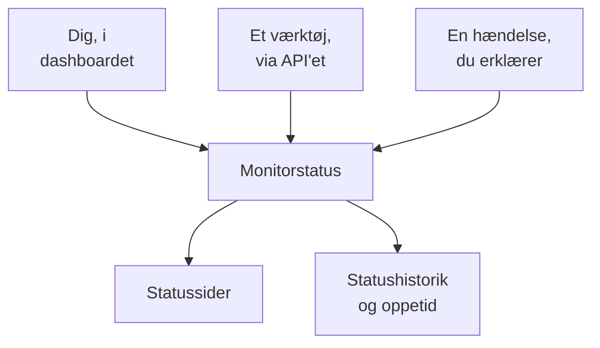

# Manuel monitor

En manuel monitor har ingen automatiske kontroller: dens status er det, du indstiller, i dashboardet eller via API'et. Brug den til at repræsentere noget, OneUptime ikke selv kan kontrollere — en afhængighed af en tredjepart, et fysisk system, en forretningsproces — på dine statussider og i dine hændelser.

:::cards
- [Opret en](#opret-en-manuel-monitor): Ét trin i dashboardet.
- [Skift dens status](#opdater-status): I dashboardet eller fra dine egne værktøjer via API'et.
- [Hændelser og advarsler](#hændelser-og-advarsler): Erklær en hændelse, og indstil status i samme trin.
:::

## Hvornår skal du bruge en manuel monitor

| Anvendelse | Beskrivelse |
| --- | --- |
| Tredjepartstjenester | Følg status for eksterne tjenester, du er afhængig af, men ikke kan overvåge direkte. |
| Fysisk infrastruktur | Repræsenter hardware eller fysiske systemer uden netværksovervågning. |
| Forretningsprocesser | Følg ikke-tekniske processer, der påvirker tjenestens status. |
| Status styret via API | Lad dine egne værktøjer indstille status via OneUptime-API'et. |
| Pladsholdere på statussider | Vis komponenter på din statusside, der styres uden for OneUptime. |

En udbyder, der offentliggør en statusside, behøver ikke en: en [ekstern statusside-monitor](/docs/monitor/external-status-page-monitor) følger den side for dig.

## Sådan virker det

En manuel monitor har intet overvågningsinterval, ingen sonder og ingen kriterier. Dens status forbliver, som du indstiller den, indtil du, et værktøj via API'et eller en hændelse, du erklærer, ændrer den — og den nye status vises overalt, hvor monitoren vises.



Hver ændring er en post på monitorens **Statustidslinje**, så dens oppetid og statushistorik gemmes som for enhver anden monitor. En manuel monitor er ikke en aktiv monitor, så på OneUptime Cloud lægger den intet til din regning.

## Opret en manuel monitor

:::steps
### Start en ny monitor

Gå til **Monitorer**, og klik på **Opret monitor**.

### Vælg Manual

Klik på **Flere monitortyper** under **Monitortype**, og vælg **Manual** under **Andet**.

### Navngiv den, og opret den

Indtast et **Navn** — og en **Beskrivelse** under **Flere felter**, hvis du vil — og klik derefter på **Opret monitor**. En manuel monitor behøver ikke mere, så den oprettes fra dette første trin.
:::

## Opdater status

### I dashboardet

:::steps
1. Åbn monitoren, og klik på **Statustidslinje** i dens sidemenu.
2. Klik på **Opret Monitor Status Begivenhed**.
3. Vælg **Monitorstatus**. **Begynder den** er nu; angiv et tidligere tidspunkt, hvis ændringen skete tidligere.
4. Klik på **Opret Monitor Status Begivenhed**. Den nye status vises med det samme på monitoren og på hver statusside, der viser den.
:::

### Via API'et

Send den nye status som en statusbegivenhed for monitoren med en [API-nøgle](/docs/api-reference/api-reference) fra dit projekt i headeren `ApiKey`:

```bash
curl -X POST https://oneuptime.com/api/monitor-status-timeline \
  -H "ApiKey: $ONEUPTIME_API_KEY" \
  -H "Content-Type: application/json" \
  -d '{"data": {"monitorId": "<monitor id>", "monitorStatusId": "<monitor status id>"}}'
```

- `monitorId` er monitorens ID: klik på linjen **ID** på dens side for at kopiere det.
- `monitorStatusId` er den status, der skal indstilles: vælg **Vis ID** i rækken for den status under **Monitorer → Indstillinger → Monitorstatus**.
- `startsAt` er valgfri. Udelades den, starter ændringen nu.
- Ved en selvhostet installation skal du sende anmodningen til din egen vært i stedet for `oneuptime.com`.

Hvis du sender den status, monitoren allerede har, afvises det med `Monitor Status cannot be same as previous status.`, og intet registreres, så et værktøj, der rapporterer ved hver kørsel, kan ignorere det svar.

## Hændelser og advarsler

En manuel monitor vælges som enhver anden monitor overalt, hvor der vælges monitorer:

- Erklær en hændelse, og vælg monitoren under **Monitorer**. Med **Skift overvågningsstatus til** indstiller erklæringen også monitorens status, og når hændelsen løses, sættes monitoren tilbage til i drift, medmindre en anden hændelse på den stadig er åben. Se [Opret en hændelse](/docs/incidents/declaring-incidents#trin-2-berørte-ressourcer).
- Opret en advarsel om den, for et problem, dit team skal handle på uden at fortælle det til dine kunder.
- Føj den til en statusside for at vise kunderne en afhængighed, du holder øje med i hånden.

## Næste skridt

:::cards
- [Opret en monitor](/docs/monitor/create-monitor): De monitortyper, der kontrollerer ting for dig.
- [Ekstern statusside-monitor](/docs/monitor/external-status-page-monitor): Følg i stedet en udbyders statusside automatisk.
- [Statussider – Oversigt](/docs/status-pages/index): Vis monitorens status for dine kunder.
:::
