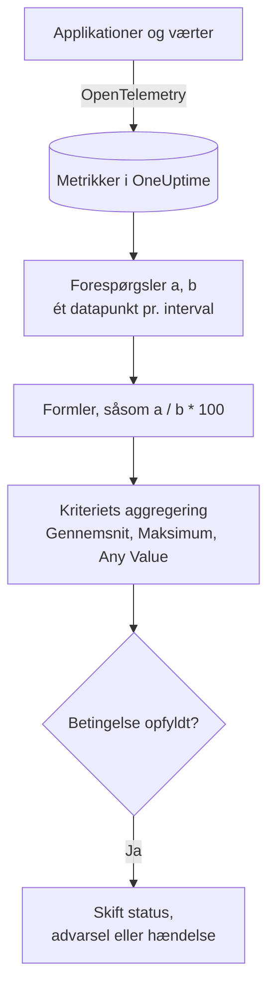

# Metrik-monitor

En metrik-monitor forespørger de metrikker, dine applikationer og din infrastruktur sender til OneUptime, kombinerer dem med formler, når du har brug for et forhold eller en sum, og sammenligner resultatet med dine kriterier over et glidende tidsinterval. Brug den til anmodningsrater, fejlforhold, kødybder, CPU, hukommelse og disk (enhver numerisk serie), med én advarsel pr. vært eller pr. container, når du grupperer den.

:::cards
- [Opret monitoren](#opret-en-metrik-monitor): Forespørgsler, formler, et tidsinterval og kriterier.
- [Sådan evalueres den](#sådan-evalueres-den): Datapunkter, formler og kriteriernes aggregering.
- [Gennemgået eksempel](#gennemgået-eksempel-en-voksende-kø): De samme data under hver aggregering.
- [Advarsler pr. serie](#advarsler-pr-serie-group-by): Én advarsel pr. vært, container eller monteringspunkt.
:::

## Sådan virker det

Hvert minut kører OneUptime hver af monitorens metrikforespørgsler over dens tidsinterval. En forespørgsel returnerer ét datapunkt pr. tidsinterval, og formler kombinerer forespørgslerne interval for interval. Hvert kriterium reducerer derefter datapunkterne fra den forespørgsel eller formel, det tjekker (til deres gennemsnit, deres maksimum eller en test af hvert punkt), og sammenligner resultatet med sin tærskel.

## Før du starter

- Dine applikationer eller din infrastruktur sender metrikker til OneUptime via OpenTelemetry. Se [OpenTelemetry](/docs/telemetry/open-telemetry).
- Kend metrikkens navn og de attributter, du vil filtrere eller gruppere på. Listerne **Metrik** og **Group by** tilbyder kun navne og attributter, som OneUptime har modtaget.

## Opret en metrik-monitor

:::steps
### Start en ny monitor

Gå til **Monitorer**, og klik på **Opret monitor**.

### Vælg Metrics

Under **Monitortype** klikker du på **Flere monitortyper** og vælger **Metrikker** under **Telemetri**, eller du skriver `metrics` i søgefeltet. Angiv et **Navn**, og klik derefter på **Næste**.

### Vælg tidsintervallet

I **Metrik-monitor-konfiguration** vælger du et **Tidsinterval**: hvor langt hver evaluering kigger tilbage. Det starter på **Past 1 Minute**.

### Tilføj metrikforespørgslerne

Under **Vælg målinger** vælger du en **Metrik**, og hvordan den aggregeres med **Aggregate by**. Åbn **Filters & grouping** for at filtrere efter attributter eller gruppere med **Group by**. Klik på **Tilføj metrik** for endnu en forespørgsel eller på **Tilføj formel** for at kombinere dem. Diagrammet under forespørgslerne viser en forhåndsvisning af tidsintervallet, så du kan se de værdier, kriterierne vil tjekke.

### Angiv kriterierne

I **Monitorkriterier** vælger hvert kriterium den **Metrik**, der skal tjekkes (en forespørgsel eller en formel), sin **Aggregering**, en **Betingelse** og en **Threshold**. Se [Kriterier](#kriterier) for de kriterier, en ny monitor starter med.

### Opret monitoren

Klik på **Opret monitor**. Monitoren åbner på sin side **Oversigt**, og dens første evaluering kører inden for et minut.
:::

## Hvad den forespørger

### Metrikforespørgsler

| Felt | Hvad det gør | Standard |
| --- | --- | --- |
| **Metrik** | Den metrik, der forespørges. | Påkrævet |
| **Aggregate by** | Hvordan værdierne i hvert tidsinterval kombineres til ét datapunkt: Gns., Sum, Min, Max, Antal eller en percentil (P50, P75, P90, P95 eller P99). | Gns. |
| **Filter by attributes** (under **Filters & grouping**) | Kun serier, hvis attributter opfylder disse betingelser. | Intet filter |
| **Group by** (under **Filters & grouping**) | Én serie pr. unik værdi af disse attributter (se [Advarsler pr. serie](#advarsler-pr-serie-group-by)). | Én serie |

Hver forespørgsel og formel får en variabel (`a`, `b`, `c` og så videre) i den rækkefølge, du tilføjer dem.

### Formler

En formel kombinerer forespørgselsvariabler med `+`, `-`, `*`, `/`, `%`, `^` og parenteser, interval for interval. Du kan skrive variablerne med eller uden et `$` foran:

- `a / b * 100`: den andel af `b`, som `a` udgør, i procent
- `a + b`: to metrikker lagt sammen
- `a - b`: forskellen mellem dem

### Glidende tidsvindue

**Tidsinterval** bestemmer, hvor langt hver evaluering kigger tilbage: **Past 1 Minute**, **Past 5 Minutes**, **Past 10 Minutes**, **Past 15 Minutes**, **Past 30 Minutes**, **Past 1 Hour**, **Past 2 Hours**, **Past 3 Hours**, **Past 6 Hours**, **Past 12 Hours**, **Past 1 Day**, **Past 2 Days**, **Past 3 Days**, **Past 7 Days**, **Past 14 Days**, **Past 30 Days**, **Past 60 Days**, **Past 90 Days**, **Past 180 Days** eller **Past 365 Days**.

Jo længere intervallet er, jo bredere er hvert tidsinterval, så ét datapunkt står for mere tid:

| Tidsinterval | Ét datapunkt pr. |
| --- | --- |
| Past 1 Minute til Past 3 Hours | minut |
| Past 6 Hours, Past 12 Hours | 5 minutter |
| Past 1 Day | 15 minutter |
| Past 2 Days, Past 3 Days | 30 minutter |
| Past 7 Days | time |
| Past 14 Days, Past 30 Days | dag |
| Past 60 Days til Past 180 Days | uge |
| Past 365 Days | måned |

## Sådan evalueres den

- **Hvert minut.** En metrik-monitor tjekkes ikke af sonder, så den har intet interval at angive og ingen side **Sonder og interval**.
- **Først forespørgsler, så formler.** Hver forespørgsel returnerer ét datapunkt pr. tidsinterval i tidsintervallet ved hjælp af sin **Aggregate by**. Formler beregnes for hvert interval ud fra forespørgslernes datapunkter.
- **Derefter kriteriets aggregering.** Hvert kriterium reducerer datapunkterne for sin **Metrik** til det, det sammenligner med tærsklen:

| Aggregering | Betingelsen tjekkes mod… |
| --- | --- |
| Gennemsnit | gennemsnittet af datapunkterne |
| Sum | summen af datapunkterne |
| Maximum Value | det højeste datapunkt |
| Minimum Value | det laveste datapunkt |
| All Values | hvert datapunkt: de skal alle opfylde betingelsen |
| Any Value | hvert datapunkt: det er nok, at ét af dem opfylder betingelsen |

- **Kriterier fra top til bund.** På en monitor uden Group By afgør det første kriterium, der matcher, så sæt det alvorligste øverst. En grupperet monitor tjekker alle kriterier for hver serie (se [Evalueringen af kriterier er anderledes](#evalueringen-af-kriterier-er-anderledes)).
- **Ingen data er ikke nul.** Når forespørgslen ikke returnerer nogen datapunkter i tidsintervallet, gør et kriterium det, som dets indstilling **Hvis ingen data** siger, under **Flere felter**: **Ignore** (standard: kriteriet matcher ikke), **Treat As Zero** eller **Trigger**.
- **OneUptimes egen nedetid er ikke stilhed.** Så længe tidsintervallet rummer tid, hvor OneUptime selv ikke modtog data (det genstartede, blev opgraderet eller indhentede et efterslæb), venter tjekket: statussen ændres ikke, og ingen hændelse eller advarsel åbnes eller løses, uanset hvad **Hvis ingen data** siger. Se [Når OneUptime ikke modtager data](/docs/monitor/when-oneuptime-is-not-receiving).

## Kriterier

Disse monitorer evaluerer altid **Metric Value**: den aggregerede værdi af den konfigurerede metrikforespørgsel eller formel. Kriterieformularen har ingen vælger for filtertype; den viser **Metrik**, **Aggregering**, **Betingelse** og **Threshold**. Når metrikken har en enhed, vælger du tærsklens enhed ved siden af den.

| Betingelse | Matcher, når værdien er… |
| --- | --- |
| **Greater Than** | over tærsklen |
| **Greater Than Or Equal To** | lig med tærsklen eller derover |
| **Less Than** | under tærsklen |
| **Less Than Or Equal To** | lig med tærsklen eller derunder |
| **Equal To** | præcis tærsklen |
| **Anomalously High** | over det forventede interval for denne time på ugen |
| **Anomalously Low** | under det interval |
| **Anomalous** | uden for det interval, i begge retninger |

Anomalibetingelserne har ingen tærskel. Formularen viser i stedet **Følsomhed** (Low, Medium, som er standard, eller High) og **Baseline-vindue** (14 dage, som er standard, 28, 60 eller 90), og den sammenligner hvert datapunkt med baselinen for samme time på ugen, bygget ud fra det vindue. Indtil den time på ugen har nok historik, er kriteriet stadig ved at lære og giver ingen advarsler.

En ny metrik-monitor starter med to kriterier på sin første forespørgsel, begge med aggregeringen **Any Value**:

| Kriterium | Betingelse | Effekt |
| --- | --- | --- |
| Check if … is offline | **Equal To** `0` | Sætter monitoren offline og erklærer en hændelse, der løses automatisk |
| Check if … is online | **Greater Than** `0` | Sætter monitoren online |

> [!NOTE]
> Offline-kriteriet udløses af en rapporteret værdi på 0, ikke af stilhed. For at få en advarsel, når en metrik holder op med at komme, sætter du dens **Hvis ingen data** til **Trigger**.

## Gennemgået eksempel: en voksende kø

Du vil have en hændelse, når checkout-køen forbliver dyb. Forespørgsel `a` er gaugen `checkout.queue.depth` med **Aggregate by** Max, og **Tidsinterval** er **Past 5 Minutes**. Én evaluering ser disse fem datapunkter på ét minut hver:

| Minut | 10:01 | 10:02 | 10:03 | 10:04 | 10:05 |
| --- | --- | --- | --- | --- | --- |
| `a` | 640 | 980 | 1.500 | 1.620 | 1.100 |

Et kriterium med **Metrik** `a`, **Betingelse** **Greater Than** og **Threshold** `1000` giver et forskelligt svar for hver **Aggregering**:

| Aggregering | Sammenlignet med 1.000 | Matcher? |
| --- | --- | --- |
| Gennemsnit | 1.168 | Ja |
| Sum | 5.840 | Ja |
| Maximum Value | 1.620 | Ja |
| Minimum Value | 640 | Nej |
| All Values | 640, 980, 1.500, 1.620, 1.100 | Nej: to punkter er ikke over 1.000 |
| Any Value | 640, 980, 1.500, 1.620, 1.100 | Ja: 1.500 er |

**Gennemsnit** advarer om et vedvarende efterslæb og ignorerer et enkelt dybt minut; **All Values** venter, til hvert minut i intervallet er dybt; **Any Value** advarer ved det første dybe minut.

## Advarsler pr. serie (Group By)

**Group by** på en metrikforespørgsel deler forespørgslen op i én serie pr. unik attributværdi (én pr. vært, én pr. container, én pr. monteringspunkt), og en monitor med Group By evaluerer hver serie uafhængigt. Den ene indstilling er forskellen mellem "flåden er usund" og "`prod-db-01` er usund".

### Én advarsel pr. gruppe

Med Group By sat til `host.name` giver en monitor for diskforbrug, der holder øje med halvtreds værter, **én advarsel (eller hændelse) pr. vært over tærsklen**. Når vært A fyldes op, åbner den sin egen advarsel; når vært B fyldes op ti minutter senere, åbner den en anden, separat advarsel ved siden af.

Uden Group By er den samme monitor én skalar: forespørgslen samler alle værter i ét tal, og monitoren giver **én advarsel for hele monitoren**. Mens den advarsel er åben, giver en anden vært over tærsklen intet (monitoren advarer allerede, så der er intet nyt at give), og vagthavende ingeniør hører aldrig om vært B. **Group By er måden at få advarsler pr. vært på.** Vil du kaldes pr. vært, pr. container eller pr. monteringspunkt, så angiv det.

### Uafhængig løsning

Hver advarsel pr. gruppe følger sin egen gruppe. Når vært A falder under tærsklen igen, løses dens advarsel af sig selv, og advarslen for vært B forbliver åben, indtil vært B kommer sig. Når én gruppe kommer sig, lukker det aldrig en anden gruppes advarsel.

### Evalueringen af kriterier er anderledes

- **Grupperede monitorer evaluerer alle kriterier.** Alvorlighedsniveauer kan derfor udløses for forskellige grupper på samme tid: med "Critical: større end 95" over "Warning: større end 80" åbner en vært på 96 % en kritisk advarsel, mens en vært på 85 % åbner en almindelig advarsel i samme tjek. En vært, der overskrider begge niveauer, får stadig præcis én advarsel, fra det første kriterium, der matcher, så **sorter kriterierne med det alvorligste først**.
- **Ugrupperede monitorer stopper ved det første kriterium, der matcher.** Kun det ene kriterium udløses, endnu en grund til at sætte advarselskriteriet over det sunde: et bredt sundt kriterium øverst matcher i næsten hvert tjek og forhindrer, at advarselskriteriet under det nogensinde evalueres.

| Vært | Disk brugt | Critical (> 95) | Warning (> 80) | Givet advarsel |
| --- | --- | --- | --- | --- |
| `prod-db-01` | 96 % | Ja | Ja | Critical |
| `prod-db-02` | 85 % | Nej | Ja | Warning |
| `prod-db-03` | 40 % | Nej | Nej | Ingen |

### Vælg en attribut at gruppere efter

Gruppér efter en attribut, der virkelig identificerer en særskilt ting, du ville kalde nogen ud for: værtsattributten for en værtsmetrik på tværs af flåden, container- eller pod-attributten for en containermetrik, monteringspunkt- eller enhedsattributten for en filsystem- eller disk-I/O-metrik, interface-attributten for en netværksmetrik. Rullelisten **Group by** udfyldes med de attributter, din collector faktisk sender, så vælg fra listen i stedet for at skrive en nøgle i hånden.

Gruppér ikke en metrik, der allerede er én skalar for hele systemet (et leder-flag for hele klyngen, et efterslæb i scheduleren eller CPU'en på én vært i en monitor for én vært). At gruppere sådanne metrikker giver præcis én serie og ændrer intet ud over advarslernes titler.

Grupperingsattributtens værdier er også tilgængelige som [skabelonvariabler](/docs/monitor/incident-alert-templating) i titlen, beskrivelsen og afhjælpningsnoterne for advarslen eller hændelsen: gruppering efter `host.name` lader titlen lyde `Disk almost full on {{host.name}}`.

## Fejlfinding

:::details Diagrammet viser en overskridelse, men monitoren advarede ikke
Tjek først kriteriets **Aggregering**: **All Values** matcher kun, når hvert datapunkt i tidsintervallet overskrider tærsklen, og **Gennemsnit** udglatter en kort spids. Tjek derefter, at kriteriets **Metrik** er den forespørgsel eller formel, du mener (`a` er ikke formlen `c`), og at tærsklen er i den enhed, du tror.
:::

:::details Metrikken holdt op med at komme, og intet skete
Et tidsinterval uden datapunkter er ikke en værdi på 0. Med **Hvis ingen data** på standardværdien, **Ignore**, matcher kriteriet ikke. Sæt det til **Trigger** under kriteriets **Flere felter** for at få en advarsel om stilhed.
:::

:::details Jeg får én advarsel for hele flåden
Forespørgslen har ingen **Group by**, så alle værter samles i ét tal. Gruppér forespørgslen efter vært-, container- eller monteringspunktattributten (se [Advarsler pr. serie](#advarsler-pr-serie-group-by)).
:::

:::details Et anomalikriterium udløses aldrig
Det er stadig ved at lære: den time på ugen, det sammenligner med, har endnu ikke nok historik inden for **Baseline-vindue**.
:::

## Næste skridt

:::cards
- [Hændelse- og advarselsskabeloner](/docs/monitor/incident-alert-templating): Sæt værten og værdien ind i advarslernes titler.
- [Log-monitor](/docs/monitor/logs-monitor): Få advarsler om logmængde og -indhold, pr. gruppe.
- [Værts-monitor](/docs/monitor/host-monitor): Færdige tjek af CPU, hukommelse og disk for dine værter.
- [OpenTelemetry](/docs/telemetry/open-telemetry): Send metrikker til OneUptime.
:::
