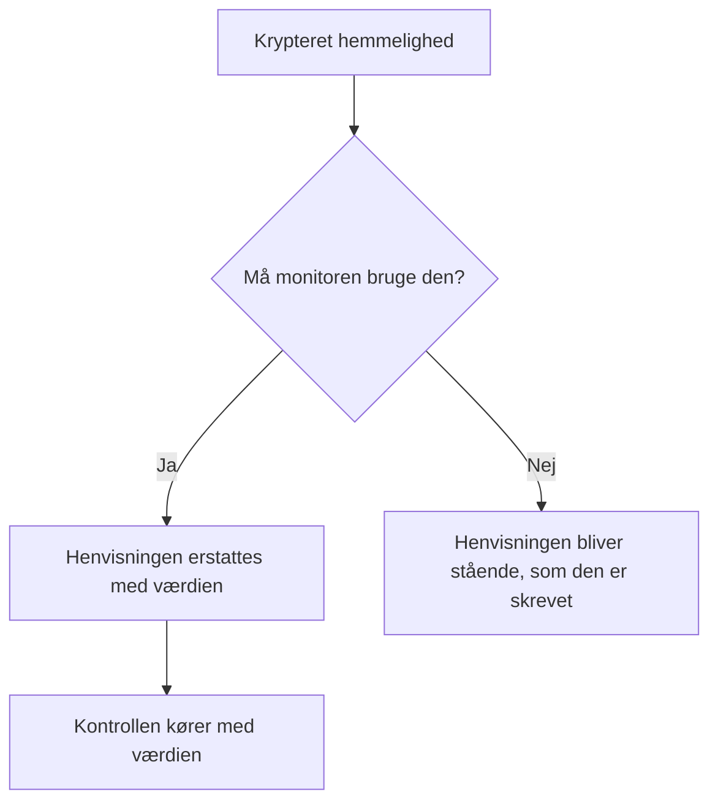

# Monitorhemmeligheder

Monitorhemmeligheder holder de adgangskoder, API-nøgler og tokens, dine monitorer har brug for, uden for selve monitoren. Du gemmer en værdi én gang, krypteret, vælger, hvilke monitorer der må bruge den, og henviser til den som `{{monitorSecrets.NAME}}`, hvor monitoren har brug for den.

:::cards
- [Tilføj en hemmelighed](#tilføj-en-hemmelighed): Gem en værdi, og vælg, hvem der må bruge den.
- [Vælg adgang](#vælg-hvilke-monitorer-der-må-bruge-en-hemmelighed): Alle monitorer, bestemte monitorer eller monitorer med etiketter.
- [Brug en hemmelighed](#brug-en-hemmelighed): Hvor `{{monitorSecrets.NAME}}` virker.
:::

## Sådan når hemmeligheder frem til en monitor

En hemmelighed gemmes krypteret og vises aldrig igen, når du har gemt den. Før OneUptime giver en monitor videre til en sonde, erstatter den hver henvisning, som monitoren må bruge, med den dekrypterede værdi; en henvisning, som monitoren ikke må bruge, bliver stående, som den er skrevet.

Den sonde, der udfører kontrollen, modtager værdien, så en monitor, der bruger en hemmelighed, bør køre på sonder, du stoler på: OneUptimes egne eller en [brugerdefineret sonde](/docs/probe/custom-probe), som du selv driver.

## Før du starter

- **Growth-abonnementet eller højere**, på OneUptime Cloud. Selvhostede installationer har ingen abonnementer.
- **En rolle, der kan administrere hemmeligheder**: Project Owner, Project Admin eller en brugerdefineret rolle med tilladelsen Create Monitor Secret.

## Arbejd med hemmeligheder

### Tilføj en hemmelighed

:::steps
1. Gå til **Monitorer → Indstillinger → Hemmeligheder**, og klik på **Opret Monitor Hemmelighed**.
2. Indtast et **Navn** og **Værdi af hemmelighed**. Navnet er det, du henviser til, for eksempel `ApiKey`. Det må kun indeholde bogstaver, tal, bindestreger (`-`) og understregninger (`_`), og to hemmeligheder i et projekt kan ikke have det samme.
3. Vælg i trinnet **Adgang**, hvilke monitorer der må bruge den (se næste afsnit), og klik derefter på **Opret Monitor Hemmelighed**.
:::

> [!IMPORTANT]
> Hemmeligheder krypteres og opbevares sikkert. Hemmelighedens værdi vises aldrig igen, efter at den er gemt — hverken i tabellen, i redigeringsformularen eller via API'et. Hvis du mister værdien, skal du hente den, hvor den kom fra, og indstille den igen. For at rotere en hemmelighed skal du bruge knappen **Opdater hemmelig værdi** i dens række; du behøver ikke at slette og genoprette den.

### Vælg, hvilke monitorer der må bruge en hemmelighed

Hver hemmelighed har én af tre adgangsmuligheder:

| Mulighed | Hvilke monitorer der må bruge hemmeligheden | Brug den til |
| --- | --- | --- |
| **Alle overvågninger** | Hver monitor i projektet, også monitorer, du opretter senere. | En loginoplysning, som mange monitorer deler. |
| **Bestemte overvågninger** | Kun de monitorer, du vælger. Det er standarden, og hemmeligheder, der blev oprettet, før disse muligheder fandtes, virker sådan. | En loginoplysning til én eller nogle få monitorer. |
| **Overvågninger med etiketter** | Monitorer, der har mindst én af de etiketter, du vælger. Når en af de etiketter føjes til en monitor, får den adgang, og når etiketten fjernes, mister den adgangen, næste gang monitoren kører. | En loginoplysning til en gruppe monitorer, der ændrer sig over tid. |

Du kan når som helst ændre muligheden med **Rediger** i hemmelighedens række. Kun listen for den valgte mulighed gemmes: et skift til **Alle overvågninger** rydder hemmelighedens lister over monitorer og etiketter, og et skift mellem **Bestemte overvågninger** og **Overvågninger med etiketter** rydder den liste, du skifter væk fra.

En hemmelighed er aldrig tilgængelig for monitorer i et andet projekt.

> [!WARNING]
> Alle, der kan redigere en monitor, som må bruge en hemmelighed, kan sende den hemmelighed hen, hvor monitoren forbinder til. Med **Alle overvågninger** er det alle, der kan oprette eller redigere monitorer i projektet. Med **Overvågninger med etiketter** omfatter det også alle, der kan føje en af de etiketter til en monitor.

Via API'et er adgangsmuligheden feltet `monitorAccess`: `All Monitors`, `Specific Monitors` eller `Monitors With Labels`. Felterne `monitors` og `labels` indeholder listerne. En hemmelighed, der oprettes uden `monitorAccess`, får `Specific Monitors`.

### Brug en hemmelighed

For at bruge en hemmelighed skal du skrive `{{monitorSecrets.SECRET_NAME}}` i et felt, der accepterer hemmeligheder. For eksempel sender en anmodningsheader `Authorization: Bearer {{monitorSecrets.ApiKey}}` værdien af hemmeligheden `ApiKey`.

Disse monitortyper og felter accepterer hemmeligheder:

| Monitortype | Felter |
| --- | --- |
| API | URL'en, anmodningens headere og brødtekst samt klientcertifikatet, den private nøgle og adgangssætningen (mTLS) |
| Websted | URL'en samt klientcertifikatet, den private nøgle og adgangssætningen (mTLS) |
| Ping, IP, Port, NTP, SSL Certificate | Den vært eller URL, der kontrolleres |
| DNS | Domænenavnet og DNS-serveren |
| DNSSEC, Domæne | Domænenavnet |
| SQL Query | Værten, databasenavnet, brugernavnet, adgangskoden og forespørgslen |
| Database Health | Værten, databasenavnet, brugernavnet og adgangskoden |
| External Status Page | Statussidens URL |
| Synthetic Monitor, Custom JavaScript Code | Scriptet |
| Network Device | SNMP-community-strengen samt SNMPv3-godkendelses- og privatlivsnøglerne |

Hemmeligheder udfyldes, før scriptet i en monitor af typen Synthetic Monitor eller Custom JavaScript Code kører, så en henvisning som `{{monitorSecrets.ApiKey}}` i scriptet er den dekrypterede værdi, når det udføres.

Hvis en monitor henviser til en hemmelighed, den ikke må bruge, bliver henvisningen stående, som den er, og erstattes ikke med værdien.

Når du tester en monitor, før du gemmer den, udfyldes kun hemmeligheder, der er tilgængelige for **Alle overvågninger**, fordi en ny monitor ikke står på nogen liste og endnu ikke har nogen etiketter. Når du har gemt monitoren, bruger testene hver hemmelighed, som monitoren må bruge.

## Fejlfinding

:::details `{{monitorSecrets.NAME}}` sendes bogstaveligt
Monitoren må ikke bruge hemmeligheden, eller navnet passer ikke. Kontrollér hemmelighedens adgangsmulighed med **Rediger** i dens række, og at navnet i henvisningen er præcis hemmelighedens navn.
:::

:::details Når en ny monitor testes, udfyldes hemmeligheden ikke
Før en monitor er gemt, udfyldes kun hemmeligheder, der er tilgængelige for **Alle overvågninger**. Gem monitoren, og test den igen.
:::

:::details Et felt ignorerer hemmeligheden
Kun felterne i tabellen ovenfor accepterer hemmeligheder. I ethvert andet felt sendes `{{monitorSecrets.NAME}}`, som det er skrevet.
:::

## Næste skridt

:::cards
- [API-monitor](/docs/monitor/api-monitor): Send en hemmelighed i en anmodningsheader.
- [Syntetisk monitor](/docs/monitor/synthetic-monitor): Brug en hemmelighed i et browserscript.
- [SQL-forespørgsel-monitor](/docs/monitor/sql-monitor): Hold en databaseadgangskode krypteret.
:::
