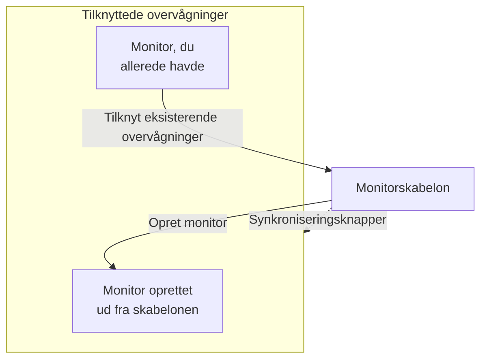

# Monitorskabeloner

En monitorskabelon er en gemt monitorkonfiguration (en type, kriterier, et interval, etiketter og standardværdier for brugerdefinerede felter), som du opretter monitorer ud fra med ét klik. Monitorer, der er oprettet ud fra den eller knyttet til den, forbliver forbundet: ret skabelonen, og synkronisér så ændringen til dem alle. Brug skabeloner, når mange monitorer skal opføre sig ens, som det samme sundhedstjek på hver tjeneste eller de samme API-tjek i produktion og staging.

:::cards
- [Opret en skabelon](#opret-en-skabelon): Fire trin, som Opret monitor.
- [Opret monitorer ud fra den](#opret-monitorer-ud-fra-en-skabelon): Ét klik, eller tilknyt monitorer, du allerede har.
- [Synkronisér ændringer](#synkronisér-ændringer-til-tilknyttede-monitorer): Hvad hver synkroniseringsknap kopierer.
- [Behold værdier for hver monitor](#behold-værdier-for-hver-monitor): Beskyt en destination eller headere mod en synkronisering.
:::

## Sådan virker skabeloner

En skabelon overvåger ikke selv noget. Monitorer oprettes ud fra den eller knyttes til den, og skabelonens side viser dem som **Tilknyttede overvågninger**. Når du ændrer skabelonen, ændres intet på de monitorer, før du synkroniserer: hver synkroniseringsknap kopierer én del af skabelonen til hver tilknyttet monitor, og felter, du beskytter, beholder hver monitors egen værdi.



## Før du starter

- **En rolle, der kan oprette skabeloner**: Project Owner, Project Admin, Project Member, Monitor Admin eller Monitor Member eller en brugerdefineret rolle med tilladelsen Create Monitor Template. At ændre en skabelon kræver de samme roller eller tilladelsen Edit Monitor Template.
- **Tilladelse til at opdatere de tilknyttede monitorer.** En synkronisering skriver til hver tilknyttet monitor som dig og springer de monitorer over, som dine tilladelser ikke dækker.

## Opret en skabelon

:::steps
### Åbn Skabeloner

Gå til **Monitorer → Indstillinger → Skabeloner**, og klik på **Opret Monitor Skabelon**.

### Navngiv skabelonen

Angiv under **Skabeloninformation** et **Skabelonnavn**, som `Production API Health`, og en **Skabelonbeskrivelse**, og klik så på **Næste**.

### Angiv monitorens standarder

Vælg under **Overvågningsstandarder** **Monitortype** med den samme vælger som i Opret monitor. Angiv eventuelt et **Standardnavn for overvågning**; lades det stå tomt, får hver monitor navn efter den ressource, den overvåger. **Standardbeskrivelse for overvågning** og **Etiketter** venter under **Flere felter**. Klik på **Næste**.

### Angiv kriterierne og intervallet

Udfyld under **Kriterier**, hvad der skal tjekkes, og kriterierne, som i [Opret monitor](/docs/monitor/create-monitor#kriterier). Med kortet **Template sync settings** øverst kan du beskytte felter mod synkroniseringer (se [Behold værdier for hver monitor](#behold-værdier-for-hver-monitor)). For en monitortype, som sonder tjekker, beder det sidste trin, **Interval**, om **Overvågningsinterval**. Klik på **Opret Monitor Skabelon** på det sidste trin.
:::

Skabelonen tilføjes listen. Åbn den for at se dens side med et kort for hver del: **Skabeloninformation**, **Overvågningsstandarder**, **Overvågningskriterier**, **Overvågningsinterval** (med **Minimum sondeenighed**), **Etiketter**, **Custom Field Defaults** (når projektet har brugerdefinerede monitorfelter) og **Tilknyttede overvågninger**. Du ændrer hver del på dens eget kort, for eksempel med **Rediger Kriterier** eller **Rediger Interval**.

## Opret monitorer ud fra en skabelon

- **Ny monitor.** Klik på **Opret monitor** i skabelonens række på listen eller på **Opret overvågning fra skabelon** på dens side. **Opret monitor** åbner med skabelonens type og indstillinger udfyldt; ret det, du har brug for, og opret den. Den nye monitor er knyttet til skabelonen.
- **Monitorer, du allerede har.** Klik på **Tilknyt eksisterende overvågninger** under **Tilknyttede overvågninger**, og vælg dem. De beholder deres indstillinger, indtil du synkroniserer.

Værdier, der er sat under **Custom Field Defaults**, skrives til hver monitor, der oprettes ud fra skabelonen, også monitorer, som regler for automatisk import og advarselspolitikker opretter ud fra den.

## Synkronisér ændringer til tilknyttede monitorer

At redigere en skabelon ændrer kun skabelonen. For at kopiere en ændring til de tilknyttede monitorer bruger du synkroniseringsknappen på det kort, du har ændret. Hver knap nævner, hvor mange monitorer den når, som **Sync Criteria to 3 Linked Monitors**, og er nedtonet, så længe intet er tilknyttet. En synkronisering kan ikke fortrydes.

| Knap | Kopierer til hver tilknyttet monitor | Lader være |
| --- | --- | --- |
| **Synkronisér kriterier til tilknyttede overvågninger** | Kriterierne og trinindstillingerne, som destinationer og anmodningsindstillinger, undtagen beskyttede felter | Overvågningsintervallet, minimum sondeenighed, navnet, beskrivelsen, etiketterne og værdierne i brugerdefinerede felter |
| **Synkronisér interval til tilknyttede overvågninger** | Overvågningsintervallet og minimum sondeenighed | Kriterierne, navnet, beskrivelsen, etiketterne og værdierne i brugerdefinerede felter |
| **Synkronisér etiketter til tilknyttede overvågninger** | Etiketterne og intet andet | Alt andet |
| **Sync Custom Fields to Linked Monitors** | De brugerdefinerede felter, som skabelonen har en standardværdi for, i stedet for det, hver monitor havde | Brugerdefinerede felter, som skabelonen lader stå tomme, og alt andet |

For at synkronisere en enkelt monitor klikker du på **Synkronisér fra skabelon** i dens række under **Tilknyttede overvågninger**. Det kopierer kriterierne og trinindstillingerne (undtagen beskyttede felter), overvågningsintervallet, minimum sondeenighed og etiketterne og lader monitorens navn, beskrivelse og værdier i brugerdefinerede felter være. **Fjern kæde fra skabelon** frakobler en monitor; den beholder sine indstillinger.

Efter en synkronisering siger en opsummering, hvor mange monitorer der blev opdateret. **Delvist synkroniseret** betyder, at nogle tilknyttede monitorer stadig har den tidligere konfiguration, som regel fordi dine tilladelser ikke dækker dem.

## Behold værdier for hver monitor

En kriteriesynkronisering kopierer også trinindstillinger som destinationer, anmodningsheadere og timeouts, medmindre du beskytter de felter. Beskyt et felt, så hver tilknyttet monitor beholder sin egen værdi for det.

:::steps
### Åbn skabelonen

Gå til **Monitorer → Indstillinger → Skabeloner**, og åbn skabelonen.

### Rediger dens kriterier

Klik på **Rediger Kriterier** på kortet **Overvågningskriterier**.

### Beskyt felterne

Sæt under **Template sync settings** flueben i **Do not sync this field** ud for hvert felt, du vil beholde på de tilknyttede monitorer.

### Gem

Gem dine ændringer. Kortet **Overvågningskriterier** og bekræftelsen af begge synkroniseringer nedenfor viser de beskyttede felter.

### Synkronisér

Brug **Synkronisér kriterier til tilknyttede overvågninger** eller **Synkronisér fra skabelon** på en enkelt tilknyttet monitor.
:::

Beskyt for eksempel **Monitor destination** og **Request headers** på en API-skabelon. Produktions- og staging-monitorer beholder deres egne URL'er og headere, mens begge får skabelonens opdaterede kriterier og de øvrige ubeskyttede indstillinger.

Hvilke muligheder der findes, afhænger af monitortypen. De omfatter destinationer og porte, HTTP-anmodningsindstillinger, databaseforbindelser, DNS-indstillinger, infrastrukturvælgere og telemetriforespørgsler. Relaterede legitimationsoplysninger, som et klientcertifikat og dets private nøgle, holdes sammen.

### Sådan opfører undtagelser sig

- Felter med flueben beholder hver eksisterende monitors aktuelle værdi, også en tom eller ikke-sat værdi. Anmodningsheadere og andre samlinger bevares fuldt ud.
- Felter uden flueben synkroniseres fortsat fra skabelonen. Fjern fluebenet fra et beskyttet felt, og gem for at kopiere dets skabelonværdi ved næste synkronisering.
- Undtagelser gælder for samlede og enkelte synkroniseringer. De gemmes på skabelonen og vælges ikke særskilt for hver synkronisering.
- Nye monitorer starter stadig med skabelonens feltværdier. Undtagelser påvirker kun synkronisering af eksisterende monitorer.
- Kriterier synkroniseres altid. En synkronisering af kun kriterier lader overvågningsintervallet, etiketterne og andre indstillinger på monitorniveau være.
- Eksisterende skabeloner har ingen feltundtagelser, før du sætter dem op. Netværksenhedsmonitorer beholder fortsat automatisk deres egen enhedstilknytning.

I skabeloner med flere trin matches beskyttede værdier via trin-id'erne. Uafhængigt oprettede monitorer med ét trin kan også modtage en skabelon med ét trin. Kan et beskyttet trin ikke matches, afvises synkroniseringen, før nogen monitor opdateres, så et nyt eller omrokeret trin ikke ved et uheld kan kopiere et andet trins destination eller legitimationsoplysninger.

> [!IMPORTANT]
> Før du ændrer monitortypen for en gemt skabelon (med **Rediger Overvågningsstandarder**), skal du under **Rediger Kriterier** fjerne de undtagelser, der ikke gælder for den nye type. Alle en skabelons undtagelser skal findes for dens monitortype.

## Konfiguration via API

Hvert skabelontrin accepterer et array `doNotSyncFields` i sit objekt `MonitorStep.value`. For en API-monitor beskytter du dens destination og hele samlingen af headere med:

```json title="monitorSteps (excerpt)"
{
  "_type": "MonitorSteps",
  "value": {
    "monitorStepsInstanceArray": [
      {
        "_type": "MonitorStep",
        "value": {
          "id": "<step id>",
          "doNotSyncFields": ["monitorDestination", "requestHeaders"]
        }
      }
    ]
  }
}
```

Udelad arrayet, eller sæt det til `[]`, for at synkronisere alle understøttede trinindstillinger. Feltnavne, der ikke understøttes, og felter, der ikke gælder for skabelonens monitortype, afvises. Skabelonens array styrer synkroniseringen; den slags metadata på en tilknyttet monitor tilsidesætter det ikke.

:::details Feltnavne for doNotSyncFields efter monitortype
| Monitortype | Feltnavne |
| --- | --- |
| Websted, API, Ping, IP, Port, SSL Certificate, NTP | `monitorDestination`, `requestTimeoutInMs`, `retryCount` |
| Kun API | `requestHeaders`, `requestType`, `requestBody` |
| Websted og API | `doNotFollowRedirects`, `allowSelfSignedCertificates`, `tlsClientAuthentication` (klientcertifikatet, nøglen og adgangsudtrykket samlet) |
| Port, NTP | `monitorDestinationPort` |
| Synthetic Monitor, Custom JavaScript Code | `customCode` |
| Synthetic Monitor | `browserTypes`, `screenSizeTypes`, `retryCountOnError` |
| DNS | `dnsMonitor.queryName`, `dnsMonitor.recordType`, `dnsMonitor.resolver` (DNS-serveren og porten samlet), `dnsMonitor.timeout`, `dnsMonitor.retries` |
| Domæne | `domainMonitor.domainName`, `domainMonitor.lookupMethod`, `domainMonitor.timeout`, `domainMonitor.retries` |
| DNSSEC | `dnssecMonitor.domainName`, `dnssecMonitor.resolvers`, `dnssecMonitor.checkNameserverConsistency`, `dnssecMonitor.signatureExpiryWarningDays`, `dnssecMonitor.timeout`, `dnssecMonitor.retries` |
| SQL Query | `sqlMonitor.connection`, `sqlMonitor.connectionTimeoutInMs`, `sqlMonitor.statementTimeoutInMs`, `sqlMonitor.query`, `sqlMonitor.maxRows` |
| Database Health | `databaseMonitor.connection`, `databaseMonitor.connectionTimeoutInMs`, `databaseMonitor.statementTimeoutInMs`, `databaseMonitor.enabledMetricGroups` |
| External Status Page | `externalStatusPageMonitor.statusPageUrl`, `externalStatusPageMonitor.provider`, `externalStatusPageMonitor.components`, `externalStatusPageMonitor.timeout`, `externalStatusPageMonitor.retries` |
| Protokoller, Security Events, Spor, AI / LLM, Metrikker, Undtagelser | `logMonitor`, `securityEventsMonitor`, `traceMonitor`, `llmMonitor`, `metricMonitor`, `exceptionMonitor` (monitorens hele konfiguration) |

Infrastrukturmonitorer (Kubernetes, Docker Container, Vært, Podman Container, Proxmox, Docker Swarm, Ceph, Lagerarray, IoT Device) tilbyder deres ressourcevælger, filtre (alle undtagen Vært), metrikforespørgsler og forespørgslens tidsvindue. Deres navne vises under **Template sync settings** på en skabelon af den type.
:::

## Fejlfinding

:::details En synkronisering siger "Delvist synkroniseret"
Nogle tilknyttede monitorer blev ikke opdateret, som regel fordi dine tilladelser ikke dækker dem. Bed en person, der kan opdatere alle tilknyttede monitorer, om at køre synkroniseringen igen.
:::

:::details En synkronisering fejler med "a template step cannot be matched to an existing monitor step"
Et beskyttet felt kunne ikke matches til et trin på en af monitorerne, så synkroniseringen stoppede, før nogen af dem blev ændret. Giv skabelonens trin de samme id'er som monitorernes trin, eller brug en skabelon med ét trin sammen med monitorer med ét trin.
:::

:::details Synkroniseringsknapperne er nedtonede
Ingen monitor er knyttet til skabelonen endnu. Opret en monitor ud fra den, eller klik på **Tilknyt eksisterende overvågninger** under **Tilknyttede overvågninger**.
:::

:::details Gem fejler med "Unsupported do not sync field"
Et navn i `doNotSyncFields` er ikke et felt for skabelonens monitortype. Tjek det mod feltnavnene ovenfor.
:::

## Næste skridt

:::cards
- [Opret en monitor](/docs/monitor/create-monitor): Den formular, en skabelon udfylder.
- [API-monitor](/docs/monitor/api-monitor): De indstillinger, en API-skabelon har med.
- [Monitorhemmeligheder](/docs/monitor/monitor-secrets): Del legitimationsoplysninger mellem monitorer uden at kopiere dem.
- [Terraform-monitortrin](/docs/terraform/monitor-steps): Administrér monitorer og deres trin som kode.
:::
