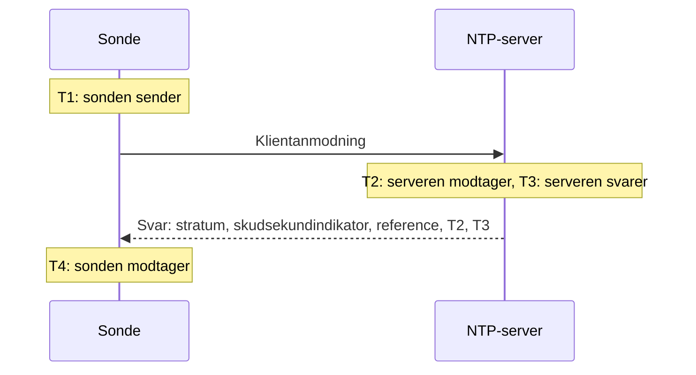

# NTP-monitor

En NTP-monitor kontrollerer, at en tidsserver svarer på UDP-port 123 og leverer pålidelig tid: at den er synkroniseret, på et fornuftigt stratum, og at dens ur stemmer med sondens. Brug den til de tidsservere, du selv driver, som et GPS-ur i datacenteret eller de interne servere, dine maskiner synkroniserer med, og til de offentlige servere, du er afhængig af.

:::cards
- [Opret monitoren](#opret-en-ntp-monitor): Seks trin i dashboardet.
- [Hvad kontrollen aflæser](#hvad-kontrollen-aflæser): Stratum, urafvigelse, skudsekundindikator og resten af svaret.
- [Overvågningskriterier](#overvågningskriterier): Tilgængelighed, synkronisering, stratum og afvigelse.
- [Fejlfinding](#fejlfinding): Når serveren kører, men monitoren siger noget andet.
:::

## Sådan virker det

Ved hver kontrol sender en sonde én SNTP-klientanmodning (NTP version 4, klienttilstand) fra en tilfældig lokal port til serverens UDP-port og venter på svaret. Kun et ægte svar på den anmodning tæller: sonden lægger 64 tilfældige bit i anmodningens afsendelsestidsstempel og ignorerer enhver pakke, der ikke sender dem tilbage, er kortere end en NTP-pakke eller ikke er i servertilstand. Et gammelt svar på en tidligere kontrol, eller et forfalsket svar, kan aldrig få en nede server til at se levende ud.

Ud fra de fire tidsstempler beregner sonden **urafvigelsen**, ((T2 − T1) + (T3 − T4)) / 2: hvor langt serverens ur er fra sondens. En positiv afvigelse betyder, at serveren går foran. Formlen antager, at anmodningen og svaret tager lige lang tid, så en vej, der er meget langsommere den ene vej, kan skævvride afvigelsen med op til halvdelen af rundturen.

> [!NOTE]
> Afvigelsen måles i forhold til sondens eget ur. OneUptime Clouds sonder holder deres ure synkroniseret. På en [brugerdefineret sonde](/docs/probe/custom-probe) skal værtens ur også holdes synkroniseret, med chrony eller systemd-timesyncd, ellers kan en afvigelsesadvarsel handle om sonden og ikke om serveren.

En server, der svarer, bliver ikke spurgt igen, heller ikke når den svarer uden pålidelig tid. Stilhed, en afvist port og et mislykket DNS-opslag forsøges igen med en ny anmodning. Når serveren slet ikke svarer, sporer sonden også ruten dertil og vedhæfter det, den fandt, som **Network Path at Time of Failure**. En sonde, der har mistet sin egen netværksforbindelse, rapporterer intet resultat, så den kan ikke markere din server som offline.

## Før du starter

- **En rolle, der kan oprette monitorer**: Project Owner, Project Admin, Project Member, Monitor Admin eller Monitor Member, eller en brugerdefineret rolle med tilladelsen Create Monitor.
- **En sonde, der kan nå UDP-port 123 på serveren.** Enhver sonde kan kontrollere en offentlig tidsserver. Til en server på et privat netværk skal du bruge en [brugerdefineret sonde](/docs/probe/custom-probe) inde i det netværk. En firewall foran serveren skal lukke UDP igennem, ikke kun TCP, fra [OneUptime Clouds sonde-IP-adresser](/docs/configuration/ip-addresses) eller fra din brugerdefinerede sonde.

## Opret en NTP-monitor

:::steps
### Start en ny monitor

Gå til **Monitorer** og klik på **Opret monitor**. Under **Monitortype** skriver du `ntp` i søgefeltet og vælger **NTP**. Den findes også under **Flere monitortyper** i gruppen Netværk.

### Giv den et navn

Indtast et **Navn**, f.eks. `GPS-tidsserver`, og klik på **Næste**.

### Indtast serveren

I **NTP-server** indtaster du serverens værtsnavn eller IP-adresse, f.eks. `time.example.com` eller `192.168.1.10`. Anmodningen går til port 123. Åbn **Flere felter** og angiv **Port** for at bruge en anden port.

### Test den

Klik på **Test monitor**, vælg en sonde under **Vælg sonde** og klik på **Kør test**. **Overvågningstestresultat** viser, om serveren svarede, om den er synkroniseret, dens stratum, og hvor meget dens ur afviger.

### Gennemgå kriterierne

**Monitorkriterier** starter med [standardkriterierne](#standardkriterier): offline, når serveren ikke leverer pålidelig tid, online, når den gør. Tilpas dem efter behov, og klik på **Næste**.

### Vælg sonder og opret

Behold eller ændr **Sonder** og **Overvågningsinterval** (det starter på **Hvert 5. minut**), og klik på **Opret monitor**. Monitorens side åbner.
:::

## Konfigurationsmuligheder

| Felt | Standard | Hvad du indtaster |
| --- | --- | --- |
| **NTP-server** | Ingen | Serveren, f.eks. `time.example.com`, `192.168.1.10` eller `2001:db8::123`. Indtast kun værten, uden `udp://`. En port skrevet efter værten, f.eks. `time.example.com:1123`, bruges i stedet for **Port**. |
| **Port** (under **Flere felter**) | `123` | UDP-porten, som serveren svarer på NTP på, fra `1` til `65535`. Lad den stå tom for `123`. |
| **Anmodningstimeout (sekunder)** (under **Flere felter**) | `5` | Hvor længe ét forsøg venter på svaret, DNS-opslaget medregnet. Maksimum er 60 sekunder. |
| **Genforsøg ved fejl** (under **Flere felter**) | Sondens standard, normalt `3` | Hvor mange gange et forsøg uden svar gentages. Maksimum er 3. |

**Genforsøg ved fejl** tæller genforsøg _efter_ det første forsøg, så `0` kører kontrollen én gang og `2` op til tre gange, med en pause på et sekund mellem forsøgene. Står feltet tomt, bruges sondens standard: 3, medmindre sondens `PROBE_MONITOR_RETRY_LIMIT` siger noget andet.

## Hvad kontrollen aflæser

Monitorens side viser den seneste kontrol fra hver sonde:

| Felt | Hvad det betyder |
| --- | --- |
| **Synkroniseret** | Om serveren svarede på stratum 1 til 15, uden alarmen i sin skudsekundindikator og med rigtige tidsstempler i svaret. |
| **Urafvigelse** | Hvor langt serverens ur er fra sondens, og i hvilken retning. En sund server ligger inden for få millisekunder. |
| **Stratum** | Hvor mange spring serveren er fra et referenceur: 1 for en server med sin egen GPS- eller atomkilde, 2 for en, der synkroniserer med en stratum 1-server, og så videre. 16 betyder ikke synkroniseret. |
| **Reference** | Hvad serveren synkroniserer med: et kildenavn som `GPS`, `PPS` eller `NIST` på stratum 1, den overordnede servers adresse fra stratum 2 og op. |
| **Skudsekundindikator** | 0, når intet skudsekund venter, 1 eller 2, når et lægges til eller trækkes fra ved dagens slutning, 3, når serveren siger, at dens ur ikke er synkroniseret. |
| **Rodspredning** | Serverens eget skøn over, hvor langt dens tid kan være fra den sande tid. Den vokser, mens serveren ikke kan nå sin kilde. ntpd holder op med at stole på en server, når halvdelen af dens rodforsinkelse plus denne værdi overstiger 1,5 sekund. |
| **Rodforsinkelse** | Rundturen fra serveren til dens referenceur. |
| **Svartid** | Fra sonden sender anmodningen, til den modtager svaret, uden DNS-opslaget. |
| **Servertid** | Serverens ur, da den sendte svaret. |

En server, der nægter at oplyse tiden, sender i stedet et **kiss-o'-death**: et svar på stratum 0 med en kode på fire bogstaver. De mest almindelige koder er `RATE` (serveren begrænser sondens frekvens), `DENY` og `RSTR` (dens adgangsregler afviser sonden) og `INIT` (den er ikke synkroniseret endnu). Kontrollen viser koden og regner serveren som svarende, men ikke synkroniseret.

## Overvågningskriterier

Kriterier afgør, hvornår serveren regnes som online, forringet eller offline, og om det erklærer en hændelse eller opretter en advarsel. Hvert kriterium kontrollerer et eller flere filtre:

| Filter | Betingelser | Hvad det kontrollerer |
| --- | --- | --- |
| **NTP Is Online** | **Sand**, **Falsk** | Om serveren besvarede sondens anmodning med et NTP-svar. Et kiss-o'-death er et svar. |
| **NTP Is Synchronized** | **Sand**, **Falsk** | Om serveren, der svarede, leverer synkroniseret tid. Når serveren ikke svarer, kontrolleres dette filter ikke; brug **NTP Is Online** til det. |
| **NTP Stratum** | **Greater Than**, **Greater Than Or Equal To**, **Less Than**, **Less Than Or Equal To**, **Equal To**, **Not Equal To** | Serverens stratum. Et kiss-o'-deaths 0 tæller som 16, ikke synkroniseret. |
| **NTP Clock Offset (in ms)** | **Greater Than**, **Less Than**, **Greater Than Or Equal To**, **Less Than Or Equal To** | Hvor langt serverens ur er fra sondens, i begge retninger. |
| **NTP Response Time (in ms)** | **Greater Than**, **Less Than**, **Greater Than Or Equal To**, **Less Than Or Equal To** | Fra anmodningen til svaret. |
| **NTP Root Dispersion (in ms)** | **Greater Than**, **Less Than**, **Greater Than Or Equal To**, **Less Than Or Equal To** | Serverens eget skøn over sin største fejl. |

Med to eller flere filtre afgør **Matchbetingelse**, om **Alle** skal matche, eller om **Enhver** enkelt er nok. Et kriteriums **Handlinger** afgør, hvad det gør: ændrer monitorens status, opretter en advarsel, erklærer en hændelse eller en kombination af dem.

### Standardkriterier

En ny NTP-monitor starter med to kriterier:

- **Offline** — serveren svarer ikke, er ikke synkroniseret, eller dens ur er `1000` ms eller mere fra sondens. Monitoren markeres som **Offline**, og der oprettes en hændelse ved navn "_monitornavn_ is not serving good time". Den løser sig selv, når serveren igen leverer pålidelig tid.
- **Online** — serveren svarer, er synkroniseret, og dens ur er inden for `1000` ms af sondens. Monitoren markeres som **I drift**.

Kriterierne kontrolleres oppefra og ned, og det første, der matcher, afgør, hvad der sker. En server, der svarer med forkert tid, behandles med vilje som nede: hver klient, der følger den, ville også tage den tid.

### Evaluering over en periode

**Evaluér disse kriterier over en periode** er et afkrydsningsfelt under hvert NTP-filter. Slå det til for at bedømme et vindue af tidligere kontroller i stedet for den seneste: vælg en aggregering under **Evaluér** og et vindue, fra 2 til 60 minutter, under **For de seneste (i minutter)**. Kun kontroller, som serveren svarede på, har et stratum, en afvigelse og en rodspredning, så et vindue med stilhed har ingen data for de filtre, og **Hvis ingen data** afgør, hvad der sker.

### Eksempler på kriterier

| Mål | Filter | Betingelse | Værdi |
| --- | --- | --- | --- |
| Advar, når en GPS-server falder tilbage til en netværkskilde | **NTP Stratum** | **Greater Than** | `1` |
| Advar, når uret driver | **NTP Clock Offset (in ms)** | **Greater Than** | `100` |
| Advar, når serverens fejlmargin vokser | **NTP Root Dispersion (in ms)** | **Greater Than** | `500` |
| Advar, når svarene bliver langsomme | **NTP Response Time (in ms)** | **Greater Than** | `1000` |

## Fejlfinding

:::details Serveren kører, men monitoren siger, at den ikke svarede
Anmodningen eller svaret gik tabt undervejs. En firewall, der tillader TCP men ikke UDP, en ntpd-regel `restrict` eller chrony-regel `allow`, der udelader sondens adresse, eller en server, der kun lytter på en intern grænseflade, ser alle sådan ud. **Network Path at Time of Failure** viser, hvor langt ruten nåede. Luk sonden igennem, eller kontrollér serveren fra en [brugerdefineret sonde](/docs/probe/custom-probe) inde i netværket.
:::

:::details Monitoren siger, at serveren afviste anmodningen
Værten svarede, at intet lytter på den UDP-port (ICMP port unreachable): NTP-tjenesten er stoppet, eller den lytter på en anden port. Start tjenesten, eller sæt **Port** til den, den bruger.
:::

:::details Serveren svarer med et kiss-o'-death
`RATE` betyder, at serveren begrænser sondens frekvens. Sonden spørger én gang pr. kontrol, så et længere **Overvågningsinterval**, eller en undtagelse for sondens adresser i serverens begrænsning, stopper det. `DENY` og `RSTR` betyder, at serverens adgangsregler afviser sonden. `INIT` og `STEP` betyder, at serveren ikke er synkroniseret endnu, hvilket er normalt de første minutter efter opstart.
:::

:::details Alle NTP-monitorer på én sonde viser en lignende afvigelse
Det er sondens ur, der afviger, ikke servernes. Kontrollér, at sondens vært holder sit ur synkroniseret, eller kør monitorerne på en anden sonde.
:::

:::details Afvigelsen springer mellem kontroller
Sonden er langt fra serveren, eller vejen er langsommere den ene vej end den anden. Brug en sonde tættere på serveren, eller bedøm afvigelsen over et par minutter med **Evaluér disse kriterier over en periode** og **Gennemsnit**.
:::

## Næste trin

:::cards
- [Ping-monitor](/docs/monitor/ping-monitor): Kontrollér, at selve værten kan nås.
- [Port-monitor](/docs/monitor/port-monitor): Kontrollér TCP-tjenesterne på samme vært.
- [Brugerdefinerede probes](/docs/probe/custom-probe): Kontrollér tidsservere på dit eget netværk.
- [Hændelse- og advarselsskabeloner](/docs/monitor/incident-alert-templating): Sæt stratum og afvigelse i en hændelses titel.
:::
