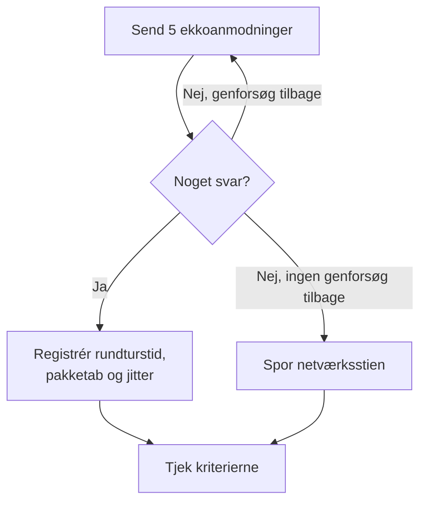

# Ping-monitor

En ping-monitor tjekker, at en vært svarer på ping (ICMP-ekkoanmodninger), og måler rundturstiden, pakketabet og jitteren. Brug den til servere, routere, firewalls og andre enheder, du når via værtsnavn eller IP-adresse.

:::cards
- [Opret monitoren](#opret-en-ping-monitor): Seks trin i dashboardet.
- [Konfigurationsmuligheder](#konfigurationsmuligheder): Værten, timeout og genforsøg.
- [Overvågningskriterier](#overvågningskriterier): Tilgængelighed, latens, pakketab og jitter.
- [Fejlfinding](#fejlfinding): Når værten kører, men monitoren siger offline.
:::

## Sådan virker det

Ved hvert tjek sender en sonde fem ekkoanmodninger til værten. Kommer der mindst ét svar tilbage, er værten online, og sonden registrerer den gennemsnitlige rundturstid som svartid sammen med pakketabet, jitteren og det hurtigste og langsomste svar. Kommer der intet svar tilbage, prøver sonden igen, op til det antal genforsøg, du tillader. Derefter kører OneUptime resultatet gennem monitorens kriterier.

Når et tjek fejler, sporer sonden også ruten til værten og slår dens navn op og vedhæfter det, den fandt, til resultatet som **Network Path at Time of Failure**, så du kan se, hvor ruten brød sammen.

> [!NOTE]
> Nogle hostingudbydere blokerer ICMP på de maskiner, en sonde kører på. En sonde, der slet ikke kan sende ping, tjekker i stedet TCP-port `80` på værten, så monitoren stadig siger, om værten kan nås. Pakketab og jitter måles så ikke.

En sonde, der har mistet sin egen netværksforbindelse, rapporterer intet resultat, så den kan ikke markere din vært som offline.

## Før du starter

- **En rolle, der kan oprette monitorer**: Project Owner, Project Admin, Project Member, Monitor Admin eller Monitor Member eller en brugerdefineret rolle med tilladelsen Create Monitor.
- **En sonde, der kan nå værten**, med ICMP tilladt på vejen. Dit projekts standardsonder vælges for hver ny monitor. Står der en firewall foran værten, så tillad ICMP-ekkoanmodninger fra [OneUptime Clouds sonde-IP-adresser](/docs/configuration/ip-addresses). En vært på et privat netværk har brug for en [brugerdefineret sonde](/docs/probe/custom-probe) i det netværk.

## Opret en ping-monitor

:::steps
### Start en ny monitor

Gå til **Monitorer**, og klik på **Opret monitor**. Vælg **Ping** under **Monitortype**.

### Navngiv den

Angiv et **Navn**, som `Core router`, og klik så på **Næste**.

### Angiv værten

Angiv under **Værtsnavn eller IP-adresse** det værtsnavn eller den IPv4- eller IPv6-adresse, der skal pinges, som `example.com` eller `192.168.1.1`. Angiv kun værten, uden `http://` og uden port.

### Test den

Klik på **Test monitor**, vælg en sonde under **Vælg sonde**, og klik på **Kør test**. **Overvågningstestresultat** viser de rundturstider og det pakketab, sonden så.

### Gennemgå kriterierne

**Monitorkriterier** starter med [standardkriterierne](#standardkriterier): offline, når værten ikke svarer, online, når den gør. Ret dem efter behov, og klik så på **Næste**.

### Vælg sonder, og opret

Behold eller ret **Sonder** og **Overvågningsinterval** (det starter på **Hvert 5. minut**), og klik så på **Opret monitor**. Monitorens side åbner.
:::

## Konfigurationsmuligheder

| Felt | Standard | Hvad du angiver |
| --- | --- | --- |
| **Værtsnavn eller IP-adresse** | Ingen | Værten, der skal pinges, som `example.com`, `192.168.1.1` eller `2001:db8::1`. Et værtsnavn slås op ved hvert tjek, så monitoren følger DNS-ændringer. |
| **Anmodningstimeout (sekunder)** (under **Flere felter**) | `60` | Hvor længe der ventes på et svar ved hvert forsøg. Maksimum er 60 sekunder. |
| **Genforsøg ved fejl** (under **Flere felter**) | Sondens standard, som regel `3` | Hvor mange gange et mislykket forsøg gentages. Maksimum er 3. |

**Genforsøg ved fejl** tæller genforsøg _efter_ det første forsøg, så `0` kører tjekket én gang og `2` op til tre gange. Står feltet tomt, bruges sondens standard: 3, medmindre sondens `PROBE_MONITOR_RETRY_LIMIT` siger andet. Hver fejl forsøges igen, timeouts medregnet, med en pause på et sekund mellem forsøgene. Et vellykket tjek, hvis svar tog længere end 10 sekunder, tjekkes også igen.

For at overvåge en fast IP-adresse og aldrig et værtsnavn kan du i stedet bruge en [IP-monitor](/docs/monitor/ip-monitor). Den kører det samme tjek.

## Overvågningskriterier

Kriterier afgør, hvornår værten tæller som online, forringet eller offline, og om det erklærer en hændelse eller opretter en advarsel. Hvert kriterium tjekker et eller flere filtre:

| Filter | Betingelser | Hvad det tjekker |
| --- | --- | --- |
| **Is Online** | **Sand**, **Falsk** | Om mindst én ekkoanmodning fik svar. |
| **Svartid (i ms)** | **Greater Than**, **Less Than**, **Greater Than Or Equal To**, **Less Than Or Equal To** | Svarenes gennemsnitlige rundturstid. |
| **Packet Loss (in %)** | **Greater Than**, **Less Than**, **Greater Than Or Equal To**, **Less Than Or Equal To** | Andelen af de fem ekkoanmodninger, der ikke fik svar. |
| **Jitter (in ms)** | **Greater Than**, **Less Than**, **Greater Than Or Equal To**, **Less Than Or Equal To** | Standardafvigelsen af rundturstiderne over pakkerne i ét tjek. |
| **Is Request Timeout** | **Sand**, **Falsk** | Om pingen fik timeout ved hvert forsøg. |

Med to eller flere filtre afgør **Matchbetingelse**, om **Alle** skal matche, eller om **Enhver** enkelt er nok. Et kriteriums **Handlinger** afgør, hvad det gør: ændrer monitorstatus, opretter en advarsel, erklærer en hændelse eller flere af dem.

### Standardkriterier

En ny ping-monitor starter med to kriterier:

- **Offline** — værten svarer ikke på nogen af ekkoanmodningerne eller kan slet ikke nås efter alle genforsøg. Monitoren markeres som **Offline**, og der oprettes en hændelse med navnet "_monitor name_ is offline". Hændelsen løser sig selv, når værten svarer igen.
- **Oppe** — værten svarer. Monitoren markeres som **I drift**.

Kriterier tjekkes fra top til bund, og det første, der matcher, afgør, hvad der sker. Når intet matcher, viser monitoren sin standardstatus: **I drift**, medmindre du vælger en anden under **Flere felter** under kriterierne.

### Evaluering over en periode

**Evaluér disse kriterier over en periode** er et afkrydsningsfelt under et filter, der tilbydes for **Is Online**, **Svartid (i ms)**, **Packet Loss (in %)** og **Jitter (in ms)**. Slå det til for at bedømme et vindue af tidligere tjek i stedet for kun det seneste: vælg en aggregering under **Evaluér** og et vindue fra 2 til 60 minutter under **For de seneste (i minutter)**.

| Aggregering | Matcher, når |
| --- | --- |
| **Gennemsnit**, **Sum**, **Maximum Value**, **Minimum Value** | Den værdi over vinduet opfylder betingelsen. Kun numeriske filtre. |
| **All Values** | Hvert tjek i vinduet opfylder betingelsen. |
| **Any Value** | Mindst ét tjek i vinduet opfylder betingelsen. |

**All Values** matcher først, når vinduet virkelig er dækket af data. En monitor, der lige er oprettet, eller en, hvis tjek ikke længere er blevet registreret, har ikke nok historik til at sige noget om de seneste N minutter, så kriteriet venter i stedet for at matche på den ene måling, det har. **Any Value** er indstillingen for "sig det med det samme, når et enkelt tjek overskrider grænsen" og udløses stadig med det samme.

**Hvis ingen data** afgør, hvad der sker, så længe vinduet ikke kan bære kriteriet:

| Mulighed | Hvad der sker | Brug den til |
| --- | --- | --- |
| **Ignore** (standard) | Kriteriet matcher ikke. | Almindelige tærskeladvarsler. |
| **Trigger** | De manglende data tæller som problemet. | Tjek, hvor stilhed i sig selv er en fejl. |
| **Treat As Zero** | Vinduet sammenlignes som et enkelt nul. | Tællere, hvor ingen hændelser virkelig betyder nul. |

### Eksempelkriterier

| Mål | Filter | Betingelse | Værdi |
| --- | --- | --- | --- |
| Offline, når værten ikke kan nås | **Is Online** | **Falsk** | — |
| Advar, når latensen er høj | **Svartid (i ms)** | **Greater Than** | `200` |
| Markér værten som forringet på en forbindelse med tab | **Packet Loss (in %)** | **Greater Than** | `20` |
| Advar ved en ustabil forbindelse | **Jitter (in ms)** | **Greater Than** | `30` |

For kun at advare, når latensen forbliver høj, slår du **Evaluér disse kriterier over en periode** til for svartidsfilteret og vælger **All Values** over **5** minutter.

## Fejlfinding

:::details Værten kører, men monitoren siger offline
Værten, eller en firewall foran den, svarer ikke på ICMP-ekkoanmodninger fra sonden. Mange servere og cloudnetværk dropper ping som standard. Tillad ICMP-ekkoanmodninger fra sonderne, eller overvåg i stedet en tjeneste på værten med en [port-monitor](/docs/monitor/port-monitor). **Network Path at Time of Failure** på det mislykkede tjek viser, hvor langt ruten nåede.
:::

:::details Tjekket fejler med "This probe could not resolve" for værten
Sondens DNS-server kender ikke værtsnavnet. Tjek navnet, eller angiv i stedet IP-adressen. Et navn, der kun slås op inde på dit netværk, har brug for en [brugerdefineret sonde](/docs/probe/custom-probe) der.
:::

:::details Pakketab og jitter er tomme
Sonden, der kørte tjekket, kan ikke sende ping, så den tjekkede i stedet TCP-port `80`, som ikke måler nogen af dem. Kør monitoren på en sonde, der må sende ICMP.
:::

## Næste skridt

:::cards
- [IP-monitor](/docs/monitor/ip-monitor): Overvåg en fast IPv4- eller IPv6-adresse.
- [Port-monitor](/docs/monitor/port-monitor): Tjek en tjeneste på værten, ikke kun værten.
- [Brugerdefinerede probes](/docs/probe/custom-probe): Ping værter på dit eget netværk.
- [Hændelser](/docs/incidents/index): Hvad der sker, efter at monitoren har erklæret en.
:::
