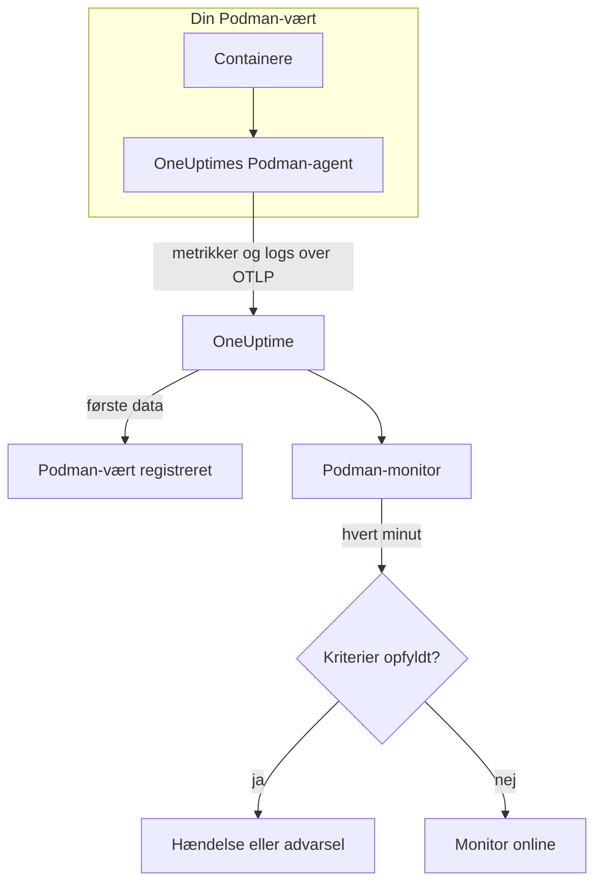

# Podman-monitor

En Podman-monitor overvåger containerne på én Podman-vært og giver dig besked, når en container kører varm, løber tør for hukommelse eller bliver ved med at genstarte. Den læser de metrikker, som OneUptimes Podman-agent sender fra værten, så intet undersøges udefra: installér agenten, og opret derefter monitoren ud fra en skabelon eller din egen forespørgsel.

:::cards
- [Opret monitoren](#opret-en-podman-monitor): Seks trin i dashboardet.
- [Skabeloner](#færdige-advarselsskabeloner): Fem færdige advarsler, én hændelse pr. container.
- [Metrikker](#indsamlede-metrikker): Hvad agenten indsamler, og hvad hver metrik betyder.
- [Logs](#indsamlede-logs): Containerlogs og den logdriver, de kræver.
:::

## Sådan virker det

OneUptimes Podman-agent kører som en container på værten. Hvert 30. sekund læser den containerstatistik gennem Podmans Docker-kompatible API-socket, følger containernes logfiler og sender begge dele til OneUptime over OTLP. De første data fra en vært registrerer den i OneUptime.

En Podman-monitor er knyttet til én vært. Hvert minut kører den sin forespørgsel over værtens containermetrikker og sammenligner resultatet med sine kriterier.



## Før du begynder

- **Installér Podman-agenten** på værten. [Vejledningen til Podman-agenten](/docs/telemetry/podman-host) dækker installation, opgradering og kontrol. Agenten skal bruge Podmans API-socket på `/run/podman/podman.sock`.
- **Kontrollér, at værten er registreret.** Den vises under **Produkter → Infrastruktur → Podman → Alle værter**, navngivet efter agentens `PODMAN_HOST_NAME`, så snart dens første data ankommer.
- **Til containerlogs** skal containerne køre med logdriveren `k8s-file`. Se [Krav til logdriveren](#krav-til-logdriveren).

## Opret en Podman-monitor

:::steps
### Start en ny monitor

Gå til **Monitorer**, og klik på **Opret monitor**.

### Vælg Podman Container

Klik under **Monitortype** på **Flere monitortyper**, og vælg **Podman Container** under **Infrastruktur**, eller skriv `podman` i søgefeltet. Angiv et **Navn** – det bruges i titler på hændelser og advarsler – og klik på **Næste**.

### Vælg værten

Vælg værten i **Podman Host** under **Podman Monitor Configuration**. Hver vært, der har sendt data, er på listen.

### Vælg, hvad der skal overvåges

Vælg en af de tre faner:

- **Quick Setup** – klik på en [skabelon](#færdige-advarselsskabeloner). Den angiver metrikken, aggregeringen, tidsintervallet og tærsklerne og erstatter kriterierne nedenfor med sine egne. Du kan stadig ændre **Tidsinterval**.
- **Custom Metric** – vælg én metrik i **Podman Metric**, og angiv derefter **Aggregering** og **Tidsinterval**. **Containernavn** og **Container-image** indsnævrer den til bestemte containere.
- **Avanceret** – byg selv forespørgsler og formler under **Vælg målinger**. Brug **Group by** `resource.container.name` for at bedømme hver container for sig.

### Kontrollér kriterierne

Åbn hvert kriterium under **Monitorkriterier**, og kontrollér dets **Metrik**, **Aggregering**, **Betingelse** og **Threshold**. En skabelon udfylder dem. Med **Custom Metric** eller **Avanceret** starter monitoren med [standardkriterierne](#standardkriterier), som kun bemærker, at en metrik falder til nul, så angiv din egen tærskel.

### Opret monitoren

Klik på **Opret monitor**. OneUptime åbner monitorens side og evaluerer den hvert minut. Hændelser og advarsler, den åbner, vises også på værtens sider **Hændelser** og **Advarsler**.
:::

> [!TIP]
> For at oprette flere skabeloner på én gang skal du åbne værten fra **Produkter → Infrastruktur → Podman** og gå til **Recommendations**. Vælg de skabeloner, du vil have, og hvem der skal kaldes, så opretter OneUptime én monitor pr. skabelon.

## Monitorindstillinger

| Felt | Fane | Hvad det gør |
| --- | --- | --- |
| **Podman Host** | Alle | Påkrævet. Afgrænser hver forespørgsel til værtens `resource.host.name`. OneUptime tilføjer også `resource.container.runtime = podman` til hver forespørgsel. |
| **Podman Metric** | Custom Metric | Én metrik fra agentens katalog, grupperet som CPU, hukommelse, netværk, blok-I/O og container. |
| **Containernavn** | Custom Metric, Avanceret | Valgfri. Præcis match på `resource.container.name`, f.eks. `my-container`. |
| **Container-image** | Custom Metric, Avanceret | Valgfri. Præcis match på `resource.container.image.name`, f.eks. `nginx:latest`. |
| **Aggregering** | Custom Metric | Hvordan målinger kombineres: **Gennemsnit**, **Maksimum**, **Minimum**, **Sum** eller **Antal**. Starter ved metrikkens sædvanlige aggregering. |
| **Tidsinterval** | Alle | Det glidende vindue, forespørgslen læser, fra **Past 1 Minute** til **Past 365 Days**. En ny monitor starter ved **Past 1 Minute**; skabeloner angiver deres eget. |
| **Vælg målinger** | Avanceret | Forespørgselsbyggeren: **Metrik**, **Aggregate by**, **Filter by attributes**, **Group by** samt **Tilføj metrik** og **Tilføj formel** til at kombinere forespørgsler. |

## Færdige advarselsskabeloner

**Quick Setup** tilbyder fem skabeloner. Hver bygger en komplet monitor: en forespørgsel grupperet efter `resource.container.name`, et kriterium, der udløses, og et, der genopretter. Hver container bedømmes for sig og får sin egen hændelse og sin egen advarsel. Tærsklerne er udgangspunkter, du kan redigere.

Et kriterium udløses kun, når betingelsen gælder i hvert minut af dets vindue, og det genopretter 10 % forbi tærsklen, så en værdi, der svæver ved grænsen, ikke blafrer.

| Skabelon | Alvorlighed | Overvåger | Udløses, når | Genopretter, når |
| --- | --- | --- | --- | --- |
| High Container CPU Usage | Warning | `container.cpu.utilization`, Avg pr. container, seneste 5 minutter | Over 80 (% af én kerne) | Ved eller under 72 |
| High Container Memory Usage | Warning | `container.memory.percent`, Avg pr. container, seneste 5 minutter | Over 85 % | Ved eller under 76,5 % |
| High Container Restart Count | Kritisk | `container.restarts`, Max pr. container, seneste 5 minutter | Over 5 genstarter i alt | 4,5 eller færre |
| High Container Process Count | Warning | `container.pids.count`, Max pr. container, seneste 5 minutter | Over 500 | Ved eller under 450 |
| Container Restarted (Low Uptime) | Kritisk | `container.uptime`, Min pr. container, seneste 1 minut | Under 120 sekunder | Ved eller over 132 sekunder |

**Alvorlighed** er den etiket, vælgeren viser. Hændelsen og advarslen, som en skabelon opretter, starter på dit projekts mest alvorlige hændelses- og advarselsalvorlighed; ændr dem i kriterierne.

De to procentskabeloner bruger **Gennemsnit**: deres metrikker er allerede procenter pr. container, så gennemsnittet for et minut er den vedvarende værdi. Antal genstarter og antal processer bruger **Maksimum**, hvor én måling over tærsklen er signalet.

> [!NOTE]
> `container.cpu.utilization` er det tal, `podman stats` udskriver: 100 % er én hel CPU-kerne, ikke containerens samlede CPU-tildeling. En container, der har fået flere kerner, viser et godt stykke over 100, mens den er sund, så hæv tærsklen for den.

> [!NOTE]
> `container.restarts` er en løbende total, som Podman fører, ikke et antal genstarter i vinduet. **High Container Restart Count** forbliver derfor åben, indtil containeren genoprettes, hvilket nulstiller tallet.

> [!CAUTION]
> `container.uptime` findes kun for kørende containere. En container, der stopper og forbliver stoppet, sender ingen data, så **Container Restarted (Low Uptime)** fanger genstarter og nye udrulninger, ikke en permanent nedlukning. En container, der er beregnet til at køre i under to minutter, forbliver i advarselstilstand hele sin levetid.

Der er ingen skabelon for CPU-drosling. Droslingsmetrikkerne, som agenten indsamler, vokser kun, og en advarsel om "overhovedet droslet" ville udløses én gang og aldrig ophøre. Begge indsamles stadig, så du kan vise dem i diagrammer.

## Indsamlede metrikker

Agenten bruger OpenTelemetry-modtageren `docker_stats`, rettet mod Podmans Docker-kompatible socket, `/run/podman/podman.sock`, hvert 30. sekund. Hver containers metrikker bærer dens identitet som ressourceattributter: `resource.container.name`, `resource.container.image.name`, `resource.container.id`, `resource.container.runtime` (`podman`) og `resource.host.name`.

### CPU

| Metrik | Beskrivelse |
| --- | --- |
| `container.cpu.utilization` | Containerens CPU-udnyttelse, hvor 100 % er én hel CPU-kerne. |
| `container.cpu.usage.total` | Brugt CPU-tid, siden containeren startede, i nanosekunder. En tæller over hele levetiden. |
| `container.cpu.throttling_data.throttled_time` | Nanosekunder, containeren er blevet droslet af sin CPU-grænse. En tæller over hele levetiden. |
| `container.cpu.throttling_data.throttled_periods` | Droslingsperioder, siden containeren startede. En tæller over hele levetiden. |

### Hukommelse

| Metrik | Beskrivelse |
| --- | --- |
| `container.memory.usage.total` | Hukommelse i brug, i bytes. |
| `container.memory.usage.limit` | Hukommelsesgrænse, i bytes. |
| `container.memory.percent` | Hukommelsesforbrug som procentdel af containerens grænse, eller af værtens hukommelse, når containeren ikke har nogen grænse. |

### Netværk

| Metrik | Beskrivelse |
| --- | --- |
| `container.network.io.usage.rx_bytes` | Modtagne bytes. En tæller over hele levetiden. |
| `container.network.io.usage.tx_bytes` | Sendte bytes. En tæller over hele levetiden. |

### Blok-I/O

| Metrik | Beskrivelse |
| --- | --- |
| `container.blockio.io_service_bytes_recursive.read` | Bytes læst fra blokenheder. |
| `container.blockio.io_service_bytes_recursive.write` | Bytes skrevet til blokenheder. |

### Container

| Metrik | Beskrivelse |
| --- | --- |
| `container.uptime` | Sekunder, siden containeren startede. Kun kørende containere rapporterer den. |
| `container.restarts` | Antal gange, containeren er genstartet. En løbende total. |
| `container.pids.count` | Opgaver i containeren. Cgroup'ens pids-controller tæller tråde lige så vel som processer. |

Listen **Podman Metric** tilbyder også `container.cpu.usage.percpu`, `container.memory.rss`, `container.memory.cache` og tællerne for netværkspakker. Den medfølgende agentkonfiguration slår dem ikke til, så kontrollér værtens side **Metrikker**, før du bygger på dem. `container.cpu.throttling_data.throttled_periods` er ikke på listen; forespørg den fra **Avanceret**.

## Overvågningskriterier

Et kriterium sammenligner en af monitorens forespørgsler eller formler med en tærskel. En Podman-monitors kriterier har ingen **Filtertype**: hver regel kontrollerer metrikværdien med disse felter.

| Felt | Hvad det gør |
| --- | --- |
| **Metrik** | Den forespørgsel eller formel, der kontrolleres, efter dens variabelnavn. |
| **Aggregering** | Hvordan værdierne i vinduet bliver til ét svar: **Gennemsnit**, **Sum**, **Maximum Value**, **Minimum Value**, **All Values** (hver værdi skal matche) eller **Any Value** (én er nok). |
| **Betingelse** | **Greater Than**, **Less Than**, **Greater Than Or Equal To**, **Less Than Or Equal To** eller **Equal To** – eller en anomalibetingelse: **Anomalously High**, **Anomalously Low** eller **Anomalous**. |
| **Threshold** | Den værdi, der sammenlignes med. En liste over enheder står ved siden af, når metrikken har en enhed. Vises ikke for anomalibetingelser. |
| **Følsomhed** | Kun anomalibetingelser. **Lav** (4σ), **Mellem** (3σ, standard) eller **Høj** (2σ). |
| **Baseline-vindue** | Kun anomalibetingelser. 14 dage (standard), 28, 60 eller 90 dages historik. |
| **Hvis ingen data** | Under **Flere felter**. Hvad der sker, når vinduet ikke har nogen målinger: **Ignore** (standard), **Treat As Zero** eller **Trigger**. |

Anomalibetingelser sammenligner hver værdi med samme time på ugen i baselinen. De forbliver i en "Learning"-tilstand og giver intet, før baseline-vinduet rummer nok historik.

Hvert kriterium siger også, hvad der skal ske, når det matcher: ændre monitorens status, oprette en advarsel eller erklære en hændelse. Kriterier kontrolleres fra top til bund, og det første, der matcher, afgør det.

### Standardkriterier

En monitor, som du ikke bygger ud fra en skabelon, starter med to kriterier:

| Rækkefølge | Kriterium | Matcher, når | Så |
| --- | --- | --- | --- |
| 1 | Check if _monitor name_ is offline | En vilkårlig værdi i den første forespørgsel er `0` | Markerer monitoren som **Offline** og erklærer hændelsen "_monitor name_ is offline", som løser sig selv, når monitoren kommer sig. |
| 2 | Check if _monitor name_ is online | En vilkårlig værdi er over `0` | Markerer monitoren som **I drift**. |

> [!IMPORTANT]
> Stilhed matcher ingen af kriterierne: en vært, der holder op med at sende data, efterlader monitoren, som den var. For at få besked, når data stopper, skal du sætte **Hvis ingen data** til **Trigger** på et kriterium. Tid, hvor OneUptime selv ikke modtog data, er aldrig manglende data: en kontrol, hvis vindue indeholder sådan tid, venter i stedet, som [Når OneUptime ikke modtager data](/docs/monitor/when-oneuptime-is-not-receiving) forklarer.

## Indsamlede logs

Agenten følger også hver containers fil `ctr.log` og sender hver linje som en OpenTelemetry-logpost med:

| Felt | Værdi |
| --- | --- |
| `resource.host.name` | Værten, fra `PODMAN_HOST_NAME`. |
| `resource.container.id` | Det fulde container-ID. |
| `resource.container.runtime` | Altid `podman`. |
| `attributes["log.iostream"]` | `stdout` eller `stderr`. |
| `severityText` / `severityNumber` | Læst fra et niveaunøgleord, hvor et niveau står i linjen (`[ERROR]`, `app.INFO:`, `{"level":"warn"}`, `level=error`). En linje uden niveau falder tilbage på sin strøm: `stderr` er `ERROR`, `stdout` er `INFO`. |
| `body` | Den linje, containeren skrev. Linjer, der starter med blanktegn eller en afsluttende parentes, som linjer i en stakspore, føjes til linjen før. |
| `time` | Podmans tidsstempel for linjen. |

Logs vises på værtens side **Protokoller** og på hver containers side.

### Krav til logdriveren

Agenten læser de filer, som Podmans logdriver `k8s-file` skriver, i `/var/lib/containers/storage/overlay-containers/*/userdata/ctr.log`. Rootful Podman bruger som standard `journald`, som i stedet skriver til systemd-journalen, så der er ingen fil at læse:

| Driver | Hvad agenten ser |
| --- | --- |
| `k8s-file` (eller `json-file`, som Podman behandler på samme måde) | Hver linje. |
| `journald` | Intet: logsene ligger i systemd-journalen. |
| `none` | Intet: logsene kasseres. |

Metrikker afhænger ikke af logdriveren: en vært, hvis containere bruger `journald`, rapporterer stadig metrikker, kun dens side **Protokoller** forbliver tom.

Kontrollér en containers driver og Podmans standard:

```bash
podman inspect <container> --format '{{.HostConfig.LogConfig.Type}}'
podman info --format '{{.Host.LogDriver}}'
```

Skift til `k8s-file`. Podman fastlægger en containers logdriver, når containeren oprettes, så genopret hver container efter ændringen – en genstart beholder den gamle driver.

:::tabs
@tab podman run
Start containeren med driveren:

```bash
podman run --log-driver k8s-file ... <image>
```

For at skifte en eksisterende container skal du fjerne den og køre den igen:

```bash
podman rm -f <container>
podman run --log-driver k8s-file ... <image>
```
@tab Podman Compose
Angiv driveren på hver tjeneste:

```yaml title="docker-compose.yml"
services:
  my-app:
    image: my-app:latest
    logging:
      driver: "k8s-file"
      options:
        max-size: "100m"
```

Genopret derefter tjenesten:

```bash
podman compose up -d --force-recreate <service>
```
@tab containers.conf
Gør `k8s-file` til standard for hver container, der oprettes fremover, i `/etc/containers/containers.conf` (rootful) eller `~/.config/containers/containers.conf` (rootless):

```toml title="containers.conf"
[containers]
log_driver = "k8s-file"
```

Fjern og genopret derefter hver container.
:::

## Fejlfinding

:::details Værten er ikke på listen Podman Host
Værter registrerer sig selv ud fra agentens data. Kontrollér, at agentcontaineren kører, at Podmans API-socket er slået til, og at værten står under **Produkter → Infrastruktur → Podman → Alle værter**. [Vejledningen til Podman-agenten](/docs/telemetry/podman-host) har de kontroller, du skal køre på værten.
:::

:::details Metrikker ankommer, men siden Protokoller er tom
Containerne bruger næsten helt sikkert `journald`. Skift de containere, hvis logs du vil have, til `k8s-file` (se [Krav til logdriveren](#krav-til-logdriveren)), og genopret dem.
:::

:::details Agenten logger "no files match the configured criteria"
Agenten leder efter `/var/lib/containers/storage/overlay-containers/*/userdata/ctr.log` og fandt intet. Enten bruger ingen container på værten `k8s-file`, eller agentens montering af `/var/lib/containers/storage` mangler eller er tom, eller agenten og containerne kører i forskellige tilstande – rootless containere har deres lager et sted, som den rootful sti ikke dækker, og omvendt.
:::

:::details Data ankommer under det forkerte værtsnavn
OneUptime identificerer en vært ud fra `resource.host.name`, som agenten tager fra `PODMAN_HOST_NAME`. Ændrer du `PODMAN_HOST_NAME` efter de første data, opstår der en ny vært i stedet for at omdøbe den første, og en monitor forbliver knyttet til det navn, den blev oprettet med.
:::

:::details En CPU-advarsel udløses aldrig
Gruppér forespørgslen efter `resource.container.name`, som skabelonen **High Container CPU Usage** gør, så hver container bedømmes for sig. Et gennemsnit over alle containere på en travl vært trækkes ned af de inaktive. Husk, at 100 % betyder én hel kerne, så en container, der må bruge flere kerner, har brug for en højere tærskel.
:::

:::details Advarslen om antal genstarter ophører aldrig
`container.restarts` er en løbende total, så den falder ikke af sig selv under tærsklen. Ret årsagen, og genopret derefter containeren for at nulstille tallet, eller hæv tærsklen.
:::

## Næste trin

:::cards
- [Podman-agent](/docs/telemetry/podman-host): Installér, opgradér og fejlfind den agent, denne monitor læser.
- [Docker-monitor](/docs/monitor/docker-monitor): Den samme monitor til Docker-værter.
- [Hændelser – Oversigt](/docs/incidents/index): Hvad der sker, efter at et kriterium har erklæret en hændelse.
- [Vagtplaner](/docs/on-call/schedules): Bestem, hvem der kaldes, når en container går i stykker.
:::
