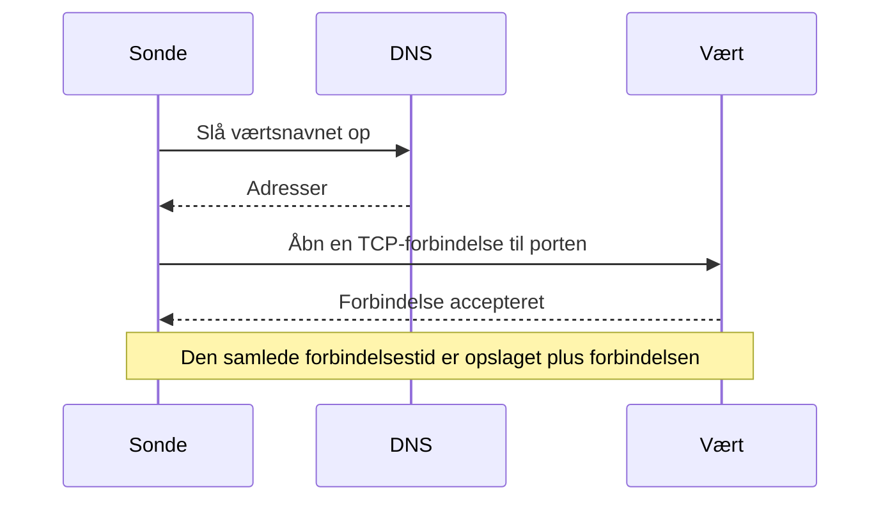

# Port-monitor

En port-monitor tjekker, at en vært accepterer TCP-forbindelser på en port, og måler, hvor lang tid forbindelsen tager. Brug den til tjenester, der ikke taler HTTP, eller hvis HTTP du ikke vil tjekke: databaser, mailservere, SSH, meddelelsesbrokere og lignende.

:::cards
- [Opret monitoren](#opret-en-port-monitor): Seks trin i dashboardet.
- [Forbindelsestider](#forbindelsestider): Hvad DNS-, TCP- og totaltiderne måler.
- [Overvågningskriterier](#overvågningskriterier): Tilgængelighed og forbindelsestider.
- [Fejlfinding](#fejlfinding): Når tjenesten kører, men monitoren siger offline.
:::

## Sådan virker det

Ved hvert tjek slår en sonde værtsnavnet op, hvis du har angivet et, og åbner en TCP-forbindelse til porten. Porten er online, så snart forbindelsen accepteres; sonden lukker den så uden at sende noget. En forbindelse, der afvises eller får timeout, forsøges igen, op til det antal genforsøg, du tillader. Derefter kører OneUptime resultatet gennem monitorens kriterier.

Sonden åbner kun TCP-forbindelser: en tjeneste, der kun lytter på UDP, som en SNMP-agent, kan ikke tjekkes med en port-monitor.

Når et tjek fejler, sporer sonden også ruten til værten og slår dens navn op og vedhæfter det, den fandt, til resultatet som **Network Path at Time of Failure**, så du kan se, hvor ruten brød sammen. En sonde, der har mistet sin egen netværksforbindelse, rapporterer intet resultat, så den kan ikke markere din tjeneste som offline.

## Før du starter

- **En rolle, der kan oprette monitorer**: Project Owner, Project Admin, Project Member, Monitor Admin eller Monitor Member eller en brugerdefineret rolle med tilladelsen Create Monitor.
- **En sonde, der kan nå porten.** Dit projekts standardsonder vælges for hver ny monitor. Står der en firewall foran tjenesten, så tillad [OneUptime Clouds sonde-IP-adresser](/docs/configuration/ip-addresses) at forbinde til porten. En tjeneste på et privat netværk, som en database, har brug for en [brugerdefineret sonde](/docs/probe/custom-probe) i det netværk.

## Opret en port-monitor

:::steps
### Start en ny monitor

Gå til **Monitorer**, og klik på **Opret monitor**. Vælg **Port** under **Monitortype**.

### Navngiv den

Angiv et **Navn**, som `Orders database`, og klik så på **Næste**.

### Angiv værten og porten

Angiv under **Værtsnavn eller IP-adresse** den vært, porten er på, som `db.example.com` eller `10.0.0.12`. Angiv portnummeret under **Port**, som `5432`.

### Test den

Klik på **Test monitor**, vælg en sonde under **Vælg sonde**, og klik på **Kør test**. **Overvågningstestresultat** viser, om forbindelsen åbnede, og hvor lang tid hver del tog.

### Gennemgå kriterierne

**Monitorkriterier** starter med [standardkriterierne](#standardkriterier): offline, når porten ikke accepterer en forbindelse, online, når den gør. Ret dem efter behov, og klik så på **Næste**.

### Vælg sonder, og opret

Behold eller ret **Sonder** og **Overvågningsinterval** (det starter på **Hvert 5. minut**), og klik så på **Opret monitor**. Monitorens side åbner.
:::

## Konfigurationsmuligheder

| Felt | Standard | Hvad du angiver |
| --- | --- | --- |
| **Værtsnavn eller IP-adresse** | Ingen | Værten, som `example.com`, `192.168.1.1` eller `2001:db8::1`. Angiv kun værten, uden `http://`. |
| **Port** | Ingen | Den TCP-port, der forbindes til, fra `1` til `65535`. |
| **Anmodningstimeout (sekunder)** (under **Flere felter**) | `60` | Hvor længe ét forsøg må tage, DNS-opslaget og TCP-forbindelsen tilsammen. Maksimum er 60 sekunder. |
| **Genforsøg ved fejl** (under **Flere felter**) | Sondens standard, som regel `3` | Hvor mange gange et mislykket forsøg gentages. Maksimum er 3. |

**Genforsøg ved fejl** tæller genforsøg _efter_ det første forsøg, så `0` kører tjekket én gang og `2` op til tre gange. Står feltet tomt, bruges sondens standard: 3, medmindre sondens `PROBE_MONITOR_RETRY_LIMIT` siger andet. Hver fejl forsøges igen, timeouts medregnet, med en pause på et sekund mellem forsøgene. En vellykket forbindelse, der tog længere end 10 sekunder, tjekkes også igen.

Almindelige porte:

| Port | Tjeneste |
| --- | --- |
| `22` | SSH |
| `25` | SMTP |
| `80` | HTTP |
| `443` | HTTPS |
| `3306` | MySQL |
| `5432` | PostgreSQL |
| `6379` | Redis |
| `27017` | MongoDB |

> [!NOTE]
> Mange hostingudbydere blokerer udgående SMTP. På en sonde, der ikke kan sende ping, og det er sådan en sonde opdager, at den kører hos sådan en udbyder, tæller et tjek af port `25`, der får timeout, som online. For pålideligt at tjekke port `25` på en mailserver kører du monitoren på en [brugerdefineret sonde](/docs/probe/custom-probe), der må forbinde til den.

## Forbindelsestider

For et værtsnavn måler sonden tjekket i to faser:

| Fase | Fra | Til |
| --- | --- | --- |
| **DNS-opslag** | Starten af tjekket | Det første TCP-forbindelsesforsøg |
| **TCP-forbindelse** | Det første TCP-forbindelsesforsøg | At forbindelsen accepteres, inklusive den tid, der går med at skifte mellem IPv6- og IPv4-adresser |

**Total Connection Time (DNS + TCP)** løber fra starten af tjekket, til forbindelsen accepteres. Det er også port-monitorens svartid, så eksisterende kriterier, advarsler og diagrammer, der bruger svartiden, fortsætter med at virke.

Når målet er en IP-adresse, er der intet DNS-opslag, så den fase udelades. Tjekresultater fra før fasetiderne fandtes, viser kun den samlede forbindelsestid.

## Overvågningskriterier

Kriterier afgør, hvornår porten tæller som online, forringet eller offline, og om det erklærer en hændelse eller opretter en advarsel. Hvert kriterium tjekker et eller flere filtre:

| Filter | Betingelser | Hvad det tjekker |
| --- | --- | --- |
| **Is Online** | **Sand**, **Falsk** | Om porten accepterede en forbindelse. |
| **Total Connection Time (DNS + TCP) (in ms)** | **Greater Than**, **Less Than**, **Greater Than Or Equal To**, **Less Than Or Equal To** | Hele forbindelsestiden, inklusive DNS-opslaget for et værtsnavn. |
| **Port DNS Lookup Time (in ms)** | **Greater Than**, **Less Than**, **Greater Than Or Equal To**, **Less Than Or Equal To** | DNS-opslaget før det første TCP-forsøg. Det har ingen værdi, når målet er en IP-adresse. |
| **Port TCP Connect Time (in ms)** | **Greater Than**, **Less Than**, **Greater Than Or Equal To**, **Less Than Or Equal To** | Fra det første TCP-forsøg, til forbindelsen accepteres, inklusive skift mellem IPv6 og IPv4. |
| **Is Request Timeout** | **Sand**, **Falsk** | Om DNS-opslaget eller TCP-forbindelsen overskred timeout ved hvert forsøg. |

Et kriterium for DNS-opslagstid har intet at evaluere, når målet er en IP-adresse. Til kriterier, der skal virke med både værtsnavne og IP-adresser, bruger du totaltiden eller TCP-forbindelsestiden.

Med to eller flere filtre afgør **Matchbetingelse**, om **Alle** skal matche, eller om **Enhver** enkelt er nok. Et kriteriums **Handlinger** afgør, hvad det gør: ændrer monitorstatus, opretter en advarsel, erklærer en hændelse eller flere af dem.

### Standardkriterier

En ny port-monitor starter med to kriterier:

- **Offline** — porten accepterer ikke en forbindelse efter alle genforsøg. Monitoren markeres som **Offline**, og der oprettes en hændelse med navnet "_monitor name_ is offline". Hændelsen løser sig selv, når porten accepterer forbindelser igen.
- **Oppe** — porten accepterer en forbindelse. Monitoren markeres som **I drift**.

Kriterier tjekkes fra top til bund, og det første, der matcher, afgør, hvad der sker. Når intet matcher, viser monitoren sin standardstatus: **I drift**, medmindre du vælger en anden under **Flere felter** under kriterierne.

### Evaluering over en periode

**Evaluér disse kriterier over en periode** er et afkrydsningsfelt under et filter, der tilbydes for **Is Online**, **Total Connection Time (DNS + TCP) (in ms)**, **Port DNS Lookup Time (in ms)** og **Port TCP Connect Time (in ms)**. Slå det til for at bedømme et vindue af tidligere tjek i stedet for kun det seneste: vælg en aggregering under **Evaluér** og et vindue fra 2 til 60 minutter under **For de seneste (i minutter)**.

| Aggregering | Matcher, når |
| --- | --- |
| **Gennemsnit**, **Sum**, **Maximum Value**, **Minimum Value** | Den værdi over vinduet opfylder betingelsen. Kun numeriske filtre. |
| **All Values** | Hvert tjek i vinduet opfylder betingelsen. |
| **Any Value** | Mindst ét tjek i vinduet opfylder betingelsen. |

**All Values** matcher først, når vinduet virkelig er dækket af data. En monitor, der lige er oprettet, eller en, hvis tjek ikke længere er blevet registreret, har ikke nok historik til at sige noget om de seneste N minutter, så kriteriet venter i stedet for at matche på den ene måling, det har. **Any Value** er indstillingen for "sig det med det samme, når et enkelt tjek overskrider grænsen" og udløses stadig med det samme.

**Hvis ingen data** afgør, hvad der sker, så længe vinduet ikke kan bære kriteriet:

| Mulighed | Hvad der sker | Brug den til |
| --- | --- | --- |
| **Ignore** (standard) | Kriteriet matcher ikke. | Almindelige tærskeladvarsler. |
| **Trigger** | De manglende data tæller som problemet. | Tjek, hvor stilhed i sig selv er en fejl. |
| **Treat As Zero** | Vinduet sammenlignes som et enkelt nul. | Tællere, hvor ingen hændelser virkelig betyder nul. |

### Eksempelkriterier

| Mål | Filter | Betingelse | Værdi |
| --- | --- | --- | --- |
| Offline, når porten er lukket | **Is Online** | **Falsk** | — |
| Advar, når det går langsomt at forbinde | **Total Connection Time (DNS + TCP) (in ms)** | **Greater Than** | `500` |
| Markér tjenesten som forringet, når den er langsom til at forbinde | **Total Connection Time (DNS + TCP) (in ms)** | **Greater Than** | `200` |
| Advar, når DNS er langsom | **Port DNS Lookup Time (in ms)** | **Greater Than** | `100` |
| Advar, når TCP-handshaket er langsomt | **Port TCP Connect Time (in ms)** | **Greater Than** | `250` |

## Fejlfinding

:::details Tjenesten kører, men monitoren siger offline
Sonden kunne ikke åbne en forbindelse: en firewall dropper den, tjenesten lytter kun på en privat grænseflade, eller porten er forkert. Hændelsens grundårsag og **Overvågningslogs** på monitoren viser fejlen, og **Network Path at Time of Failure** viser, hvor langt ruten nåede. Lad sonderne komme gennem firewallen, eller brug en [brugerdefineret sonde](/docs/probe/custom-probe) inde i netværket.
:::

:::details DNS-opslagstiden er altid tom
Målet er en IP-adresse, så der er intet at slå op. Brug i stedet **Total Connection Time (DNS + TCP) (in ms)** eller **Port TCP Connect Time (in ms)**.
:::

:::details Jeg skal tjekke en UDP-tjeneste
Port-monitorer åbner kun TCP-forbindelser. Til en DNS-server bruger du en [DNS-monitor](/docs/monitor/dns-monitor), og til en tidsserver på UDP-port 123 en [NTP-monitor](/docs/monitor/ntp-monitor). Begge sender rigtige forespørgsler.
:::

## Næste skridt

:::cards
- [Ping-monitor](/docs/monitor/ping-monitor): Tjek, at selve værten kan nås.
- [SSL-certifikat-monitor](/docs/monitor/ssl-certificate-monitor): Tjek certifikatet på en TLS-port.
- [Databasetilstands-monitor](/docs/monitor/database-health-monitor): Gå videre end en åben port, og hold øje med en databases tilstand.
- [Brugerdefinerede probes](/docs/probe/custom-probe): Tjek porte på dit eget netværk.
:::
