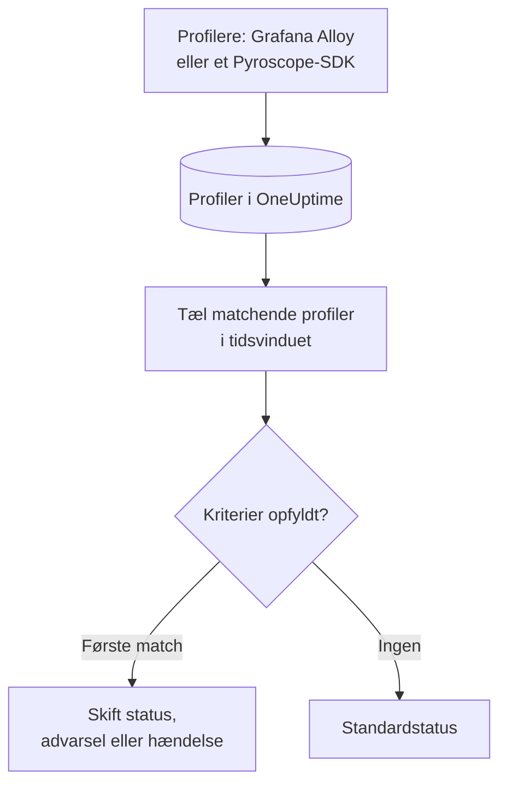

# Profil-monitor

En profil-monitor tæller inden for et tidsvindue de kontinuerlige profiler, dine tjenester sender til OneUptime, som matcher dine filtre (profiltype, tjeneste, attributter). Når antallet opfylder dine kriterier, ændrer den monitorens status, opretter en advarsel eller erklærer en hændelse. Den bruges mest til at opdage, når profileringsdata holder op med at komme fra en tjeneste.

> [!IMPORTANT]
> **Opret monitor** i dashboardet tilbyder ikke Profiles: der findes endnu ingen formular til dens filtre. Opret en profil-monitor via [API'et](/docs/api-reference/api-reference) eller [Terraform](/docs/terraform/monitor-steps) som beskrevet nedenfor. Når den findes, kan du se og redigere dens kriterier på monitorens side **Kriterier** i dashboardet; dens filtre kan kun ændres via API'et eller Terraform.

:::cards
- [Opret monitoren](#opret-en-profil-monitor): Den konfiguration, der skal sendes via API'et eller Terraform.
- [Hvad den forespørger](#hvad-den-forespørger): Profiltyper, tjenester, attributter og vinduet.
- [Kriterier](#kriterier): De betingelser, du kan bruge.
- [Gennemgået eksempel](#gennemgået-eksempel-profiler-holder-op-med-at-komme): Få at vide, når en tjeneste holder op med at sende profiler.
:::

## Sådan virker det



Hvert minut tæller OneUptime de profiler, der matcher monitorens filtre og startede inden for dens tidsvindue. Det sammenligner antallet med monitorens kriterier fra top til bund, og det første kriterium, der matcher, afgør, hvad der sker. Når intet matcher, går monitoren tilbage til sin standardstatus.

## Før du starter

- Dine tjenester sender kontinuerlige profileringsdata til OneUptime via Grafana Alloy (eBPF) eller et Pyroscope-SDK. Se [Kontinuerlig profilering](/docs/telemetry/profiles).
- Du har enten en API-nøgle, der kan oprette monitorer, eller OneUptimes Terraform-provider sat op.
- Du kender id'et for hver telemetritjeneste, der skal overvåges, og de profiltyper, den sender, såsom `cpu`, `wall`, `alloc_objects`, `alloc_space` eller `goroutine`.

## Opret en profil-monitor

:::steps
### Vælg, hvad der skal tælles

Skriv trinnets `profileMonitor`-konfiguration. Denne tæller CPU-profiler fra én tjeneste over de seneste fem minutter:

```json
{
  "profileMonitor": {
    "telemetryServiceIds": [],
    "profileTypes": ["cpu"],
    "profileType": "",
    "attributes": {},
    "lastXSecondsOfProfiles": 300
  }
}
```

Sæt tjenestens id i `telemetryServiceIds`, eller lad listen stå tom for at tælle profiler fra alle tjenester. [Hvad den forespørger](#hvad-den-forespørger) beskriver hvert felt.

### Opret monitoren

Opret via [API'et](/docs/api-reference/api-reference) eller [Terraform](/docs/terraform/monitor-steps) en monitor med monitortypen `Profiles` og et trin, der indeholder denne konfiguration og mindst ét kriterium. I Terraform sender du konfigurationen som trinnets attribut `profile_monitor`, skrevet med `jsonencode()`.

### Tjek den i dashboardet

Åbn monitoren fra **Monitorer**. Dens første evaluering kører inden for et minut, og dens status ændres, så snart et kriterium matcher.
:::

## Hvad den forespørger

| Felt | Hvad det matcher | Standard |
| --- | --- | --- |
| `profileTypes` | Profiler af en af disse typer, sammenlignet præcist, såsom `cpu`. | Tom: alle typer |
| `profileType` | Profiler, hvis type indeholder denne tekst, uden forskel på store og små bogstaver. Når den er angivet, ignoreres `profileTypes`. | Tom |
| `telemetryServiceIds` | Profiler fra en af disse telemetritjenester. | Tom: alle tjenester |
| `entityKeys` | Profiler fra en af disse værter, pods, containere og andre infrastrukturentiteter. | Tom: alle entiteter |
| `attributes` | Profiler, hvis attributter har disse værdier. | Tom: ingen betingelse |
| `lastXSecondsOfProfiles` | Profiler, der startede inden for så mange sekunder før evalueringen. | Ingen: angiv den altid, ellers tælles hver gemt profil, og antallet falder aldrig til 0 |

Alle de filtre, du angiver, skal matche, før en profil tælles.

## Sådan evalueres den

- **Hvert minut.** En profil-monitor tjekkes ikke af sonder, så den har intet interval at angive og ingen side **Sonder og interval**.
- **Ét tal pr. evaluering.** Monitoren tæller de profiler, der matcher alle filtre og startede inden for `lastXSecondsOfProfiles`. En profiler uploader med et fast interval, så giv vinduet plads til flere uploads.
- **Ingen profiler er et antal på 0.** En tjeneste, hvis profiler holder op med at uploade, giver 0.
- **OneUptimes egen nedetid er ikke stilhed.** Så længe tidsvinduet rummer tid, hvor OneUptime selv ikke modtog data (det genstartede, blev opgraderet eller indhentede et efterslæb), venter tjekket: statussen ændres ikke, og ingen hændelse eller advarsel åbnes eller løses. Se [Når OneUptime ikke modtager data](/docs/monitor/when-oneuptime-is-not-receiving).
- **Kriterier fra top til bund.** Det første kriterium, der matcher, afgør det, så sæt det alvorligste øverst.

Hver statusændring registreres med sin årsag på monitorens **Statustidslinje**.

## Kriterier

En profil-monitors kriterier har ét filter, **Profile Count**: antallet af profiler, der matchede i vinduet. Sammenlign det med en værdi:

| Filterbetingelse | Matcher, når antallet af profiler er… |
| --- | --- |
| **Greater Than** | over værdien |
| **Greater Than Or Equal To** | lig med værdien eller derover |
| **Less Than** | under værdien |
| **Less Than Or Equal To** | lig med værdien eller derunder |
| **Equal To** | præcis værdien |
| **Not Equal To** | alt andet end værdien |

Antal profiler har ingen anomalibetingelser: der er ingen baseline at sammenligne dem med.

## Gennemgået eksempel: profiler holder op med at komme

Checkout-tjenesten kører et Pyroscope-SDK, der uploader CPU-profiler. Du vil have en hændelse, når de udebliver i fem minutter:

- `profileTypes`: `["cpu"]`, `telemetryServiceIds`: checkout-tjenesten, `lastXSecondsOfProfiles`: `300`
- Kriterium 1: **Profile Count** **Equal To** `0`: sæt monitoren offline, og erklær en hændelse
- Kriterium 2: **Profile Count** **Greater Than** `0`: sæt monitoren online

Mens SDK'et uploader, tæller hver evaluering nogle profiler, og kriterium 2 holder monitoren online. Når tjenesten udrulles uden SDK'et, falder antallet til 0 fem minutter efter den sidste upload, kriterium 1 matcher, og hændelsen erklæres. Den første upload efter rettelsen bringer antallet over 0 igen, og hændelsen løser sig selv, hvis **Løs hændelse automatisk** er slået til for den.

## Fejlfinding

:::details Monitoren tæller 0, men der vises profiler i OneUptime
Sammenlign filtrene med de profiler, du ser: `profileTypes` skal matche typen præcist, og `telemetryServiceIds` skal indeholde de rigtige tjeneste-id'er. Et kort `lastXSecondsOfProfiles` kan også falde mellem to uploads.
:::

:::details Profiles mangler i Opret monitor
Det er forventet: dashboardet har endnu ingen formular til en profil-monitors filtre. Opret den via API'et eller Terraform som beskrevet i [Opret en profil-monitor](#opret-en-profil-monitor).
:::

## Næste skridt

:::cards
- [Kontinuerlig profilering](/docs/telemetry/profiles): Send profiler fra Grafana Alloy eller et Pyroscope-SDK.
- [Monitortrin](/docs/terraform/monitor-steps): Send trinnets konfiguration fra Terraform.
- [Trace-monitor](/docs/monitor/traces-monitor): Få advarsler om mislykkede spans.
- [Metrik-monitor](/docs/monitor/metrics-monitor): Få advarsler om CPU, hukommelse og andre metrikker.
:::
