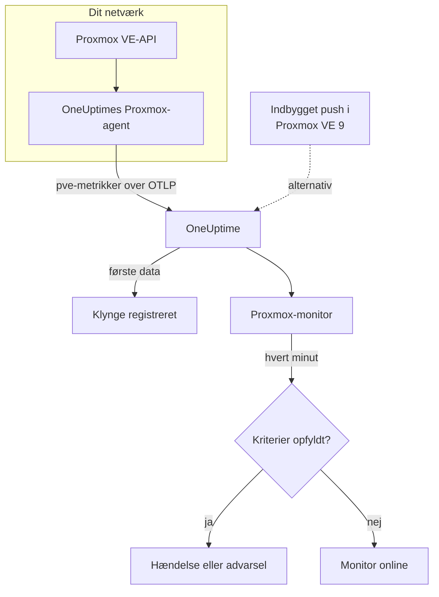

# Proxmox-monitor

En Proxmox-monitor overvåger én Proxmox VE-klynge – dens noder, VM'er og LXC-containere, lager, HA-tilstand, dækning af backupjob og lagerreplikering – og giver dig besked, når en node går offline, en gæst stopper, eller lageret bliver fyldt op. Den læser de metrikker `pve_*`, som OneUptimes Proxmox-agent indsamler, så intet undersøges udefra.

:::cards
- [Opret monitoren](#opret-en-proxmox-monitor): Seks trin i dashboardet.
- [Skabeloner](#færdige-advarselsskabeloner): Elleve færdige advarsler, én hændelse pr. node, gæst eller volumen.
- [Ressourceidentitet](#ressourceidentitet): Sådan rammer du én node, gæst eller lagervolumen.
- [Metrikker](#indsamlede-metrikker): Hver serie `pve_*`, monitoren kan advare på.
:::

## Sådan virker det

OneUptimes Proxmox-agent kører på en maskine, der kan nå Proxmox VE-API'et. Hvert 30. sekund henter den data fra prometheus-pve-exporter med klynge- og nodecollectorerne, mærker hver serie med den ressource, den beskriver, og sender metrikkerne til OneUptime over OTLP, stemplet med klyngens navn, `proxmox.cluster.name`. De første data registrerer klyngen. Proxmox VE 9 og senere kan i stedet selv pushe metrikker uden at installere noget; se [det indbyggede push](#det-indbyggede-push-i-proxmox-ve).

En Proxmox-monitor er knyttet til én klynge. Hvert minut kører den sin forespørgsel over klyngens metrikker og sammenligner resultatet med sine kriterier.

## Før du begynder

- **Installér Proxmox-agenten** et sted, hvor den kan nå Proxmox VE-API'et, med et skrivebeskyttet API-token. [Vejledningen til Proxmox-agenten](/docs/telemetry/proxmox) dækker tokenet, installationen og det indbyggede push.
- **Kontrollér, at klyngen er registreret.** Den vises under **Produkter → Infrastruktur → Proxmox → Alle klynger**, navngivet efter agentens `PROXMOX_CLUSTER_NAME`, cirka et minut efter den første indsamling.

## Opret en Proxmox-monitor

:::steps
### Start en ny monitor

Gå til **Monitorer**, og klik på **Opret monitor**.

### Vælg Proxmox

Klik under **Monitortype** på **Flere monitortyper**, og vælg **Proxmox** under **Infrastruktur**, eller skriv `proxmox` i søgefeltet. Angiv et **Navn** – det bruges i titler på hændelser og advarsler – og klik på **Næste**.

### Vælg klyngen

Vælg klyngen i **Proxmox Cluster** under **Proxmox Monitor Configuration**. Hver klynge, der har sendt data, er på listen.

### Vælg, hvad der skal overvåges

Vælg en af de tre faner:

- **Quick Setup** – klik på en [skabelon](#færdige-advarselsskabeloner). Den angiver metrikkerne, filtrene, aggregeringen, tidsintervallet og tærsklerne og erstatter kriterierne nedenfor med sine egne. Du kan stadig ændre **Tidsinterval**.
- **Custom Metric** – vælg én metrik i **Proxmox Metric**, og angiv derefter **Aggregering** og **Tidsinterval**. [Filtrene](#monitorindstillinger) indsnævrer den til en slags ressource eller til én ressource.
- **Avanceret** – byg selv forespørgsler og formler under **Vælg målinger**, f.eks. en hukommelsesprocent ud fra `pve_memory_usage_bytes / pve_memory_size_bytes`. Brug **Group by** `id` for at bedømme hver ressource for sig.

### Kontrollér kriterierne

Åbn hvert kriterium under **Monitorkriterier**, og kontrollér dets **Metrik**, **Aggregering**, **Betingelse** og **Threshold**. En skabelon udfylder dem. Med **Custom Metric** eller **Avanceret** starter monitoren med [standardkriterierne](#standardkriterier), som kun bemærker, at en metrik falder til nul, så angiv din egen tærskel.

### Opret monitoren

Klik på **Opret monitor**. OneUptime åbner monitorens side og evaluerer den hvert minut. Hændelser og advarsler, den åbner, vises også på klyngens sider **Hændelser** og **Advarsler**.
:::

> [!TIP]
> For at oprette flere skabeloner på én gang skal du åbne klyngen fra **Produkter → Infrastruktur → Proxmox** og gå til **Recommendations**. Vælg de skabeloner, du vil have, og hvem der skal kaldes, så opretter OneUptime én monitor pr. skabelon.

## Monitorindstillinger

| Felt | Fane | Hvad det gør |
| --- | --- | --- |
| **Proxmox Cluster** | Alle | Påkrævet. Afgrænser hver forespørgsel til `resource.proxmox.cluster.name`. |
| **Ressourceomfang** | Custom Metric, Avanceret | Valgfri. **Node**, **Guest (VM / container)**, **Lagerplads** eller **Klynge** – et præcist match på `pve.scope`. |
| **PVE ID** | Custom Metric, Avanceret | Valgfri. Præcis match på `pve.id`: et nodenavn (`pve1`), et VMID (`100`) eller `<node>/<storage>` (`pve1/local`). Kombinér det med et omfang for at ramme én ressource. |
| **Nodenavn** | Custom Metric, Avanceret | Valgfri. Kun en nodes egne serier (`pve.scope = node` og `pve.id`). Det kan ikke vælge gæsterne eller lageret på den node. |
| **Guest ID** | Custom Metric, Avanceret | Valgfri. Præcis match på den rå etiket `id`, f.eks. `qemu/100` eller `lxc/101`. Når det er angivet, ignoreres de andre filtre. |
| **Proxmox Metric** | Custom Metric | Én metrik fra [kataloget](#indsamlede-metrikker). |
| **Aggregering** | Custom Metric | Hvordan målinger kombineres: **Gennemsnit**, **Maksimum**, **Minimum**, **Sum** eller **Antal**. Starter ved metrikkens sædvanlige aggregering. |
| **Tidsinterval** | Alle | Det glidende vindue, forespørgslen læser, fra **Past 1 Minute** til **Past 365 Days**. En ny monitor starter ved **Past 1 Minute**; skabeloner angiver deres eget. |
| **Vælg målinger** | Avanceret | Forespørgselsbyggeren: **Metrik**, **Aggregate by**, **Filter by attributes**, **Group by** samt **Tilføj metrik** og **Tilføj formel** til at kombinere forespørgsler. |

## Ressourceidentitet

Hver serie bærer en datapunktetiket `id`, der navngiver den Proxmox-ressource, den tilhører:

| Værdi af `id` | Ressource |
| --- | --- |
| `node/<name>` | En klyngenode, f.eks. `node/pve1`. |
| `qemu/<vmid>` | En virtuel QEMU-maskine, f.eks. `qemu/100`. |
| `lxc/<vmid>` | En LXC-container, f.eks. `lxc/101`. |
| `storage/<node>/<storage>` | En lagervolumen på en node, f.eks. `storage/pve1/local`. |

To undtagelser: replikeringsserier (`pve_replication_*`) bærer replikerings-**jobbets** id i `id` (f.eks. `100-0`), og den klyngedækkende `pve_not_backed_up_total` har slet ingen `id`.

Filtre matcher på lighed, ikke på et præfiks, så agenten deler også `id` op i tre attributter, du kan filtrere på. Skabelonerne bygger på dem:

| Attribut | Værdier | For `qemu/100` |
| --- | --- | --- |
| `pve.scope` | `node`, `guest`, `storage`, `cluster` (`qemu` og `lxc` er begge `guest`) | `guest` |
| `pve.type` | `node`, `qemu`, `lxc`, `storage` | `qemu` |
| `pve.id` | Alt efter den første `/` i `id` (`pve1`, `100`, `pve1/local`) | `100` |

Filtrér på `pve.scope` eller `pve.type` for én slags ressource, på `pve.id` eller `id` for én ressource, og gruppér efter `id` for at bedømme hver ressource for sig.

## Færdige advarselsskabeloner

**Quick Setup** tilbyder 11 skabeloner. Hver bygger en komplet monitor – forespørgsler, attributfiltre, en gruppering, et kriterium, der udløses, og et, der genopretter. De fleste grupperer efter `id`, så hver node, gæst, volumen eller hvert job får sin egen hændelse og sin egen advarsel. Tærsklerne er udgangspunkter, du kan redigere.

Skabeloner læser de seneste 5 minutter, medmindre tabellen siger andet. Et kriterium udløses kun, når betingelsen gælder i hvert minut af dets vindue, og et tærskelkriterium genopretter 10 % forbi sin tærskel, så en værdi, der svæver ved grænsen, ikke blafrer.

| Skabelon | Alvorlighed | Overvåger | Udløses, når | Genopretter, når |
| --- | --- | --- | --- | --- |
| Node Offline | Kritisk | `pve_up` for `pve.scope = node`, Min pr. `id` | Under 1 | Ved 1 |
| Guest Down | Warning | `pve_up` og `pve_onboot_status` for `pve.scope = guest`, Min pr. `id` | `pve_up` er under 1, mens `pve_onboot_status` er 1 | `pve_up` er tilbage på 1, eller start ved opstart er slået fra |
| Cluster Quorum at Risk | Kritisk | `pve_up` ÷ `pve_node_info` × 100 for `pve.scope = node` (begge Sum): andelen af noder, der er online | 50 % eller mindre | Over 55 % |
| High Node CPU Usage | Warning | `pve_cpu_usage_ratio` for `pve.scope = node`, Avg pr. `id` | Over 0,9 (90 % af nodens kerner) | Ved eller under 0,81 |
| High Node Memory Usage | Warning | `pve_memory_usage_bytes` ÷ `pve_memory_size_bytes` × 100 for `pve.scope = node`, pr. `id` | Over 85 % | Ved eller under 76,5 % |
| High Guest CPU Usage | Warning | `pve_cpu_usage_ratio` for `pve.scope = guest`, Avg pr. `id`, seneste 15 minutter | Over 0,95 (95 % af dens vCPU'er) i alle 15 minutter | Ved eller under 0,855 |
| Storage Near Full | Warning | `pve_disk_usage_bytes` ÷ `pve_disk_size_bytes` × 100 for `pve.scope = storage`, pr. `id` | Over 85 % | Ved eller under 76,5 % |
| Container Root Disk Near Full | Warning | Det samme diskforhold for `pve.type = lxc`, pr. `id` | Over 90 % | Ved eller under 81 % |
| HA Resource in Error State | Kritisk | `pve_ha_state` for `state = error`, Max pr. `id` | Over 0 | Ved 0 |
| Guest Not Backed Up | Warning | `pve_not_backed_up_total`, Max (én klyngedækkende serie) | Over 0 | Ved 0 |
| Replication Failing | Kritisk | `pve_replication_failed_syncs`, Max pr. `id` (job-id'et) | Over 0 | Ved 0 |

**Alvorlighed** er den etiket, vælgeren viser. Hændelsen og advarslen, som en skabelon opretter, starter på dit projekts mest alvorlige hændelses- og advarselsalvorlighed; ændr dem i kriterierne.

- **Nedetidsskabelonerne bruger Minimum**, så én indsamling, hvor ressourcen var nede, udløser dem i stedet for at blive skjult af indsamlinger, hvor den kørte.
- **Guest Down** ser kun på gæster, der er sat til at starte ved opstart, så en gæst, du har stoppet med vilje, aldrig kalder nogen.
- **Cluster Quorum at Risk** er en tilnærmelse: pve-exporter har ingen corosync-metrik, så skabelonen tæller de noder, der er online.
- **High Guest CPU Usage** ligger højere og reagerer langsommere end nodeskabelonen: en gæst er beregnet til at bruge sine vCPU'er, så kun en, der aldrig falder ned igen, kalder nogen.
- **Forholdsformler** tager **Sum** af begge sider. Begge kommer fra den samme indsamling, så resultatet er en ægte procent.
- **Container Root Disk Near Full** udelader QEMU-VM'er: deres diskforbrug viser 0 uden QEMU-gæsteagenten.
- **Guest Not Backed Up** dækker kun medlemskab af backupjob. pve-exporter siger ikke, om backups kørte eller lykkedes; gruppér `pve_not_backed_up_info` efter `id` for at få gæsterne vist.
- **Forældet replikering** (nu minus den seneste synkronisering) kan der ikke advares på, fordi kriterier ikke kan regne med uret. Klyngens side **Oversigt** viser det; advar i stedet med **Replication Failing**.

### Det indbyggede push i Proxmox VE

Proxmox VE 9 og senere kan pushe metrikker gennem sin indbyggede OpenTelemetry-metrikserver uden at installere noget – se [vejledningen til Proxmox-agenten](/docs/telemetry/proxmox). OneUptime gør pushet til de samme serier `pve_*`, så kataloget og skabelonerne for CPU, hukommelse og lager virker med det.

**Node Offline** og **Cluster Quorum at Risk** virker også: hver node pusher kun sin egen status, så en node, der holder op med at rapportere, meldes nede (`pve_up` = 0) af de noder, der stadig lever – se [Når en node holder op med at rapportere](/docs/telemetry/proxmox#when-a-node-stops-reporting). **Guest Down**, **HA Resource in Error State**, **Guest Not Backed Up** og **Replication Failing** kræver data, som kun agenten indsamler.

## Indsamlede metrikker

Agenten henter data fra prometheus-pve-exporter hvert 30. sekund med både klynge- og nodecollectorerne, hvilket også dækker exporterens collectorer `backup-info` og `replication` (begge slået til som standard).

### Tilgængelighed

| Metrik | Enhed | Beskrivelse |
| --- | --- | --- |
| `pve_up` | — | 1, når noden eller gæsten er oppe eller kører, ellers 0. |
| `pve_uptime_seconds` | sekunder | Nodens eller gæstens oppetid. |
| `pve_version_info` | antal | Proxmox VE-udgivelsen i sine etiketter. Altid 1. |

### Node

| Metrik | Enhed | Beskrivelse |
| --- | --- | --- |
| `pve_node_info` | antal | Nodemetadata, altid 1. Summér den for at tælle de noder, der rapporterer. |
| `pve_cpu_usage_ratio` | forhold | CPU i brug som et forhold på 0–1 af den tilgængelige CPU. |
| `pve_cpu_usage_limit` | kerner | Tilgængelig CPU i kerner. For en gæst dens vCPU'er. |
| `pve_memory_usage_bytes` | bytes | Hukommelse i brug. |
| `pve_memory_size_bytes` | bytes | Samlet hukommelse. |

CPU- og hukommelsesserierne rapporteres også for hver gæst, på id'erne `qemu/*` og `lxc/*`.

### Gæst

| Metrik | Enhed | Beskrivelse |
| --- | --- | --- |
| `pve_guest_info` | antal | Gæstemetadata (navn, node, type `qemu` eller `lxc`) i etiketter. Altid 1. |
| `pve_network_receive_bytes` | bytes | Bytes modtaget af gæsten. En tæller over hele levetiden. |
| `pve_network_transmit_bytes` | bytes | Bytes sendt af gæsten. En tæller over hele levetiden. |
| `pve_disk_read_bytes` | bytes | Bytes læst fra disk af gæsten. En tæller over hele levetiden. |
| `pve_disk_write_bytes` | bytes | Bytes skrevet til disk af gæsten. En tæller over hele levetiden. |
| `pve_onboot_status` | antal | 1, når gæsten starter ved nodens opstart. En stoppet gæst med denne indstilling er som regel uplanlagt nedetid. |

### Lager

| Metrik | Enhed | Beskrivelse |
| --- | --- | --- |
| `pve_disk_usage_bytes` | bytes | Brugte bytes på disken eller lageret. For en QEMU-gæst viser den 0, medmindre QEMU-gæsteagenten er installeret. |
| `pve_disk_size_bytes` | bytes | Diskens eller lagerets samlede størrelse. |
| `pve_storage_info` | antal | Lagermetadata, altid 1. Summér den for at tælle lagervolumener. |

### HA

| Metrik | Enhed | Beskrivelse |
| --- | --- | --- |
| `pve_ha_state` | — | Én serie pr. HA-tilstand (`started`, `stopped`, `error`, …) for hver HA-ressource, 1 på dens aktuelle tilstand. Filtrér på etiketten `state` for at advare på en tilstand. |

### Backup

Fra exporterens collector `backup-info` på klyngeniveau. De rapporterer kun dækning af backup-**job**:

| Metrik | Enhed | Beskrivelse |
| --- | --- | --- |
| `pve_not_backed_up_total` | antal | Gæster i intet backupjob. Én klyngedækkende serie uden `id`. |
| `pve_not_backed_up_info` | antal | Én serie pr. udækket gæst, altid 1, mærket med gæstens `id`. Den forsvinder, så snart gæsten kommer med i et backupjob. |

### Replikering

Fra exporterens collector `replication` på nodeniveau. Serierne findes kun, når klyngen har replikeringsjob, og bærer job-id'et i `id`:

| Metrik | Enhed | Beskrivelse |
| --- | --- | --- |
| `pve_replication_failed_syncs` | antal | Mislykkede synkroniseringsforsøg i træk. Over 0 betyder, at replikaen er ved at blive forældet. |
| `pve_replication_duration_seconds` | sekunder | Hvor lang tid den seneste synkronisering tog. |
| `pve_replication_last_sync_timestamp_seconds` | sekunder | Unix-tid for den seneste **vellykkede** synkronisering. |
| `pve_replication_last_try_timestamp_seconds` | sekunder | Unix-tid for det seneste **forsøg**. Nyere end den seneste synkronisering betyder, at det seneste forsøg mislykkedes. |
| `pve_replication_next_sync_timestamp_seconds` | sekunder | Unix-tid for den næste planlagte synkronisering. |
| `pve_replication_info` | antal | Jobmetadata – type, kilde, mål, gæst – i etiketter. Altid 1. |

## Overvågningskriterier

Et kriterium sammenligner en af monitorens forespørgsler eller formler med en tærskel. En Proxmox-monitors kriterier har ingen **Filtertype**: hver regel kontrollerer metrikværdien med disse felter.

| Felt | Hvad det gør |
| --- | --- |
| **Metrik** | Den forespørgsel eller formel, der kontrolleres, efter dens variabelnavn. |
| **Aggregering** | Hvordan værdierne i vinduet bliver til ét svar: **Gennemsnit**, **Sum**, **Maximum Value**, **Minimum Value**, **All Values** (hver værdi skal matche) eller **Any Value** (én er nok). |
| **Betingelse** | **Greater Than**, **Less Than**, **Greater Than Or Equal To**, **Less Than Or Equal To** eller **Equal To** – eller en anomalibetingelse: **Anomalously High**, **Anomalously Low** eller **Anomalous**. |
| **Threshold** | Den værdi, der sammenlignes med. En liste over enheder står ved siden af, når metrikken har en enhed. Vises ikke for anomalibetingelser. |
| **Følsomhed** | Kun anomalibetingelser. **Lav** (4σ), **Mellem** (3σ, standard) eller **Høj** (2σ). |
| **Baseline-vindue** | Kun anomalibetingelser. 14 dage (standard), 28, 60 eller 90 dages historik. |
| **Hvis ingen data** | Under **Flere felter**. Hvad der sker, når vinduet ikke har nogen målinger: **Ignore** (standard), **Treat As Zero** eller **Trigger**. |

Anomalibetingelser sammenligner hver værdi med samme time på ugen i baselinen. De forbliver i en "Learning"-tilstand og giver intet, før baseline-vinduet rummer nok historik.

Hvert kriterium siger også, hvad der skal ske, når det matcher: ændre monitorens status, oprette en advarsel eller erklære en hændelse. Kriterier kontrolleres fra top til bund, og det første, der matcher, afgør det.

### Standardkriterier

En monitor, som du ikke bygger ud fra en skabelon, starter med to kriterier:

| Rækkefølge | Kriterium | Matcher, når | Så |
| --- | --- | --- | --- |
| 1 | Check if _monitor name_ is offline | En vilkårlig værdi i den første forespørgsel er `0` | Markerer monitoren som **Offline** og erklærer hændelsen "_monitor name_ is offline", som løser sig selv, når monitoren kommer sig. |
| 2 | Check if _monitor name_ is online | En vilkårlig værdi er over `0` | Markerer monitoren som **I drift**. |

> [!IMPORTANT]
> Stilhed matcher ingen af kriterierne: en klynge, der holder op med at sende data, efterlader monitoren, som den var. For at få besked, når data stopper, skal du sætte **Hvis ingen data** til **Trigger** på et kriterium. Tid, hvor OneUptime selv ikke modtog data, er aldrig manglende data: en kontrol, hvis vindue indeholder sådan tid, venter i stedet, som [Når OneUptime ikke modtager data](/docs/monitor/when-oneuptime-is-not-receiving) forklarer.

## Fejlfinding

:::details Klyngen er ikke på listen Proxmox Cluster
Klynger registrerer sig selv ud fra agentens data. Kontrollér, at agenten kører og sender data (se [vejledningen til Proxmox-agenten](/docs/telemetry/proxmox)), og at `PROXMOX_CLUSTER_NAME` er angivet.
:::

:::details Gæstemetrikker mangler
Gæsteserier kommer fra exporterens klyngecollector, som den medfølgende konfiguration slår til med indsamlingsparameteren `cluster=1`. Hvis du har ændret collectorkonfigurationen, så gendan den.
:::

:::details High Node CPU Usage udløses aldrig
Skabelonen tager gennemsnittet af `pve_cpu_usage_ratio` pr. `id`, så hver node kontrolleres for sig. Hvis du har bygget din egen forespørgsel, så gruppér den efter `id`: et gennemsnit over alle noder trækkes ned af de inaktive.
:::

:::details Node Offline bliver ved med at udløses for en node, du har fjernet fra klyngen
Med det indbyggede push i Proxmox VE ser en node, der er taget ud af klyngen, ud som en, der er gået ned: den holdt op med at rapportere, så de noder, der stadig lever, bliver ved med at melde den nede. Åbn nodens side, og klik på **Remove Node** – noden forsvinder, og dens advarsel løses. Ellers forbliver den Offline i op til 7 dage. Agenten har ikke dette problem: den spørger klyngen, som ikke længere viser noden.
:::

:::details Backup- eller replikeringsmetrikker mangler
`pve_not_backed_up_*` kommer fra exporterens collector `backup-info` og `pve_replication_*` fra dens collector `replication`. Begge er slået til som standard og dækket af den medfølgende konfigurations indsamlingsparametre `cluster=1` og `node=1`. Hvis du kører din egen exporter, så kontrollér, at du ikke har slået dem fra. `pve_replication_*` findes kun, når klyngen har lagerreplikeringsjob.
:::

:::details Tællere som pve_network_receive_bytes vokser kun
Serier for netværks- og disk-I/O er tællere over hele levetiden, og kriterier sammenligner rå værdier: der er ingen rateoperator, og **Convert to per-second rate** i forespørgselsbyggeren ændrer kun diagrammet. Vis dem som en rate i et diagram, eller advar på deres vækst med en formel, f.eks. en **Maksimum**-forespørgsel minus en **Minimum**-forespørgsel på den samme tæller.
:::

## Næste trin

:::cards
- [Proxmox-agent](/docs/telemetry/proxmox): Installér agenten, eller konfigurér det indbyggede push.
- [Ceph-monitor](/docs/monitor/ceph-monitor): Overvåg Ceph-lageret bag en Proxmox-klynge.
- [VMware-monitor](/docs/monitor/vmware-monitor): Den samme slags monitor til vSphere.
- [Hændelser – Oversigt](/docs/incidents/index): Hvad der sker, efter at et kriterium har erklæret en hændelse.
:::
