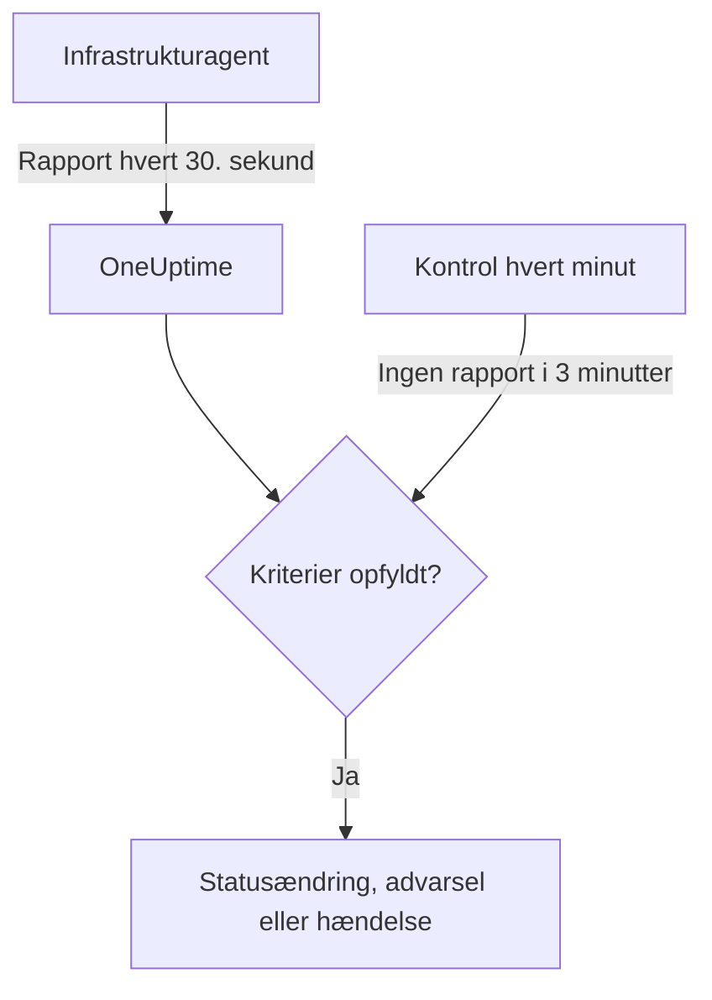

# Server- / VM-monitor

En Server- / VM-monitor overvåger én maskine gennem OneUptimes infrastrukturagent (`oneuptime-infrastructure-agent`), en lille tjeneste, der hvert 30. sekund rapporterer CPU, hukommelse, diske, belastning, netværk og kørende processer til OneUptime. Denne side viser, hvordan du forbinder agenten med en Server- / VM-monitor, hvad agenten rapporterer, og hvordan du skriver de kriterier, der afgør, hvornår serveren er online eller offline.

> [!IMPORTANT]
> **Opret monitor** tilbyder ikke længere **Server / VM**. Server- / VM-monitorer, du allerede har, fortsætter med at virke, og alt på denne side gælder for dem. For at overvåge en ny server skal du i stedet oprette en [værts-monitor](/docs/monitor/host-monitor): den advarer på de værtsmetrikker, som [OpenTelemetry-collectoren på værten](/docs/telemetry/host-otel-collector) sender.

:::cards
- [Forbind agenten](#forbind-agenten): Installér den, giv den monitorens hemmelige nøgle, og start den.
- [Hvad agenten rapporterer](#hvad-agenten-rapporterer): CPU, hukommelse, diske, belastning, netværk og processer.
- [Overvågningskriterier](#overvågningskriterier): Afgør, hvornår serveren regnes for online eller offline.
- [Fejlfinding](#fejlfinding): Agenten rapporterer ikke, eller monitoren går aldrig offline.
:::

## Sådan virker det

Agenten kører som en systemtjeneste. Hvert 30. sekund samler den en rapport og sender den til din OneUptime-URL, signeret med monitorens hemmelige nøgle. OneUptime gemmer tallene som monitorens metrikker og holder rapporten op mod monitorens kriterier.

Stilhed kontrolleres for sig. Hvert minut evaluerer OneUptime igen **Is Online**-kriterierne for hver Server- / VM-monitor, der ikke har rapporteret i 3 minutter eller mere, og en server, der er tavs længere, end dens kriterier tillader (som standard 3 minutter), regnes for offline. En monitor uden **Is Online**-kriterium markeres aldrig som offline, blot fordi agenten er blevet tavs. Kun tid, hvor OneUptime modtog data, tæller med i den stilhed: tid, hvor OneUptime selv genstartede, blev opgraderet eller indhentede et efterslæb, tæller ikke, som [Når OneUptime ikke modtager data](/docs/monitor/when-oneuptime-is-not-receiving) forklarer.



## Før du begynder

- En Server- / VM-monitor i dit projekt.
- Tilladelse til at redigere monitorer. Den hemmelige nøgle og de opsætningskommandoer, der indeholder den, vises kun for dem, der kan redigere monitorer.
- Root-adgang (Linux, macOS) eller administratoradgang (Windows) på serveren. Agenten installerer sig selv som en systemtjeneste.
- Udgående HTTPS fra serveren til din OneUptime-URL, direkte eller gennem en HTTP-proxy.

## Forbind agenten

Kommandoerne nedenfor bruger `https://oneuptime.com` og `YOUR_SECRET_KEY`. I monitorens egne opsætningskommandoer er din OneUptime-URL og monitorens hemmelige nøgle allerede udfyldt, så kopiér dem fra monitoren, når du kan.

:::steps
### Åbn monitorens opsætningskommandoer

Gå til **Monitorer**, åbn Server- / VM-monitoren, og vælg **Dokumentation**. Kortene **Set up your Server Monitor (Linux/Mac)** og **Set up your Server Monitor (Windows)** indeholder kommandoerne til denne monitor. Indtil agenten rapporterer første gang, viser monitorens **Oversigt** dem også.

### Installér agenten

:::tabs
@tab Linux
```bash
curl -sSL https://oneuptime.com/docs/static/scripts/infrastructure-agent/install.sh | sudo bash
```
@tab macOS
```bash
curl -sSL https://oneuptime.com/docs/static/scripts/infrastructure-agent/install.sh | sudo bash
```
@tab Windows
1. Download agenten fra den [seneste GitHub-udgivelse](https://github.com/OneUptime/oneuptime/releases/latest): `oneuptime-infrastructure-agent_windows_amd64.zip` til x64 eller `oneuptime-infrastructure-agent_windows_arm64.zip` til ARM64.
2. Udpak zip-filen. Den indeholder `oneuptime-infrastructure-agent.exe`.
3. Åbn **Kommandoprompt** som administrator i den mappe, du udpakkede den til.
:::

Installationsscriptet henter den seneste udgivelse til dit styresystem og din processor (x86-64 eller ARM64) og lægger binærfilen `oneuptime-infrastructure-agent` i `$HOME/bin`. På en selvhostet installation leveres scriptet fra din egen OneUptime-URL.

### Forbind den til monitoren

:::tabs
@tab Linux
```bash
sudo oneuptime-infrastructure-agent configure --secret-key=YOUR_SECRET_KEY --oneuptime-url=https://oneuptime.com
```
@tab macOS
```bash
sudo oneuptime-infrastructure-agent configure --secret-key=YOUR_SECRET_KEY --oneuptime-url=https://oneuptime.com
```
@tab Windows
```shell
oneuptime-infrastructure-agent configure --secret-key=YOUR_SECRET_KEY --oneuptime-url=https://oneuptime.com
```
:::

`configure` gemmer den hemmelige nøgle og URL'en i agentens konfigurationsfil og installerer agenten som en systemtjeneste. Begge flag er påkrævede. Erstat `https://oneuptime.com` med din egen URL på en selvhostet installation.

Hvis serveren når internettet gennem en proxy, så tilføj `--proxy-url`:

```bash
sudo oneuptime-infrastructure-agent configure --proxy-url=http://proxy.example.com:8080 --secret-key=YOUR_SECRET_KEY --oneuptime-url=https://oneuptime.com
```

### Start agenten

:::tabs
@tab Linux
```bash
sudo oneuptime-infrastructure-agent start
```
@tab macOS
```bash
sudo oneuptime-infrastructure-agent start
```
@tab Windows
```shell
oneuptime-infrastructure-agent start
```
:::

Når agenten starter, kontrollerer den den hemmelige nøgle hos OneUptime og sender sin første rapport med det samme.

### Kontrollér, at den rapporterer

Kør `sudo oneuptime-infrastructure-agent status` (uden `sudo` på Windows): den udskriver `Service is running`. I OneUptime holder monitorens **Oversigt** op med at vise opsætningskommandoerne, så snart den første rapport ankommer, og fanen **Metrikker** begynder at vise serveren i diagrammer.
:::

## Agentreference

### Kommandoer

| Kommando | Hvad den gør |
| --- | --- |
| `configure --secret-key=<key> --oneuptime-url=<url>` | Gemmer indstillingerne og installerer agenten som en systemtjeneste. Tilføj `--proxy-url=<url>` for at sende rapporter gennem en proxy. |
| `start` | Starter tjenesten. Den nægter at starte, før `configure` er kørt. |
| `stop` | Stopper tjenesten. |
| `restart` | Genstarter tjenesten. |
| `status` | Udskriver, om tjenesten kører eller er stoppet. |
| `logs` | Udskriver de sidste 100 linjer af agentens log. `-n <lines>` udskriver et andet antal linjer, og `-f` følger nye linjer. |
| `uninstall` | Fjerner tjenesten og sletter agentens konfigurationsfil. |
| `help` | Viser kommandoerne. |

Kør dem med `sudo` på Linux og macOS og fra en **Kommandoprompt** med administratorrettigheder på Windows. For at ændre den hemmelige nøgle, URL'en eller proxyen for en konfigureret agent skal du køre `stop` og `uninstall` og derefter `configure` og `start` igen.

### Filer

| Fil | Linux og macOS | Windows |
| --- | --- | --- |
| Konfiguration | `/etc/oneuptime-infrastructure-agent/config.json` | `%PROGRAMDATA%\oneuptime-infrastructure-agent\config.json` |
| Log | `/var/log/oneuptime-infrastructure-agent/oneuptime-infrastructure-agent.log` | `%PROGRAMDATA%\oneuptime-infrastructure-agent\oneuptime-infrastructure-agent.log` |

Når agenten ikke kan skrive til disse mapper, bruger den i stedet `~/.oneuptime-infrastructure-agent/`. Miljøvariablerne `ONEUPTIME_AGENT_CONFIG_PATH` og `ONEUPTIME_AGENT_LOG_PATH` angiver hver af stierne eksplicit.

## Hvad agenten rapporterer

Hver rapport indeholder serverens værtsnavn og:

| Område | Hvad der rapporteres |
| --- | --- |
| CPU | Forbrug i %, antal kerner, forbrug pr. kerne og tid brugt i user, system, idle, I/O-ventetid, steal, nice, IRQ og soft-IRQ |
| Hukommelse | Samlet, brugt, ledig og tilgængelig hukommelse, buffere og cache, forbrug i % samt swap i alt, brugt, ledig og forbrug i % |
| Diske | For hver monteret disk: monteringssti, enhed, filsystem, samlet, brugt og ledig plads, forbrug i %, læste og skrevne bytes og operationer samt I/O-tid |
| Belastning | Belastningsgennemsnit over 1, 5 og 15 minutter |
| Netværk | For hver grænseflade: sendte og modtagne bytes og pakker, fejl og tabte pakker ind og ud; plus etablerede og lyttende forbindelser |
| Vært | Styresystem, platform og version, kerneversion og arkitektur, oppetid, opstartstidspunkt, virtualisering og antal processer |
| Processer | Hver kørende proces: navn, PID, kommando, CPU i %, hukommelse, status, tråde, bruger og starttidspunkt |

Værdier, som styresystemet ikke leverer, udelades. Monitorens fane **Metrikker** viser diagrammer over tilgængelighed, CPU, hukommelse, diskforbrug og disk-I/O, belastningsgennemsnit, swap, netværkstrafik og -fejl, forbindelser, oppetid og antal processer.

## Overvågningskriterier

Kriterier afgør, hvornår monitoren er online, forringet eller offline, og hvornår den åbner en advarsel eller en hændelse. Hvert filter i et kriterium har en **Filtertype**, en **Filterbetingelse** og for de fleste typer en værdi.

| Filtertype | Hvad den kontrollerer | Filterbetingelser |
| --- | --- | --- |
| Is Online | Om agenten har rapporteret for nylig (som standard inden for de sidste 3 minutter) | Sand, Falsk |
| CPU Usage (in %) | Samlet CPU-forbrug | Greater Than, Less Than, Greater Than Or Equal To, Less Than Or Equal To |
| Memory Usage (in %) | Hukommelse i brug | Som for CPU |
| Disk Usage (in %) | Forbrug på disken angivet i **Disksti** | Som for CPU |
| Swap Usage (in %) | Swap i brug | Som for CPU |
| CPU IO Wait (in %) | Andel af CPU-tiden brugt på at vente på I/O | Som for CPU |
| Load Average (1 minute) | Belastningsgennemsnit over det seneste minut | Som for CPU |
| Load Average (5 minute) | Belastningsgennemsnit over de seneste 5 minutter | Som for CPU |
| Load Average (15 minute) | Belastningsgennemsnit over de seneste 15 minutter | Som for CPU |
| Server Process Name | Om en proces med dette navn kører (uden forskel på store og små bogstaver) | Is Executing, Is Not Executing |
| Server Process Command | Om en proces med præcis denne kommandolinje kører (uden forskel på store og små bogstaver) | Is Executing, Is Not Executing |
| Server Process PID | Om en proces med dette PID kører | Is Executing, Is Not Executing |

**Disksti** tager et monteringspunkt eller en enhed, f.eks. `/`, `/mnt/data`, `C:\` eller `/dev/sda1`; tomt er den `/`. Angiv `*` for at kontrollere hver disk, agenten rapporterer: hver disk, der krydser tærsklen, får sin egen advarsel, så en anden disk, der fyldes op, ikke skjules bag den førstes åbne advarsel.

### Evaluér over en periode

**Evaluér disse kriterier over en periode** er et separat afkrydsningsfelt i kriterieformularen og ikke en filterbetingelse. Det findes for **Is Online** og for hver numerisk filtertype. Slå det til for at sammenligne en aggregeret værdi – valgt under **Evaluér** (Gennemsnit, Sum, Maximum Value, Minimum Value, All Values, Any Value) over det vindue, som **For de seneste (i minutter)** angiver – i stedet for værdien fra den seneste kontrol. På et **Is Online**-filter er vinduet, hvor længe agenten må være tavs, før serveren regnes for offline.

**All Values** matcher først, når vinduet reelt er dækket af data. En monitor, der lige er oprettet, eller en, hvis kontroller er holdt op med at blive registreret, har ikke nok historik til at sige noget om de sidste N minutter, så kriteriet venter i stedet for at matche på den ene måling, det har. **Any Value** er indstillingen til "giv mig besked, så snart en enkelt kontrol overskrider grænsen", og den udløses stadig med det samme.

**Hvis ingen data** styrer, hvad der sker, mens vinduet ikke kan bære kriteriet:

| Hvis ingen data | Adfærd | Brug den til |
| --- | --- | --- |
| **Ignore** (standard) | Kriteriet matcher ikke. | Almindelige tærskeladvarsler. |
| **Trigger** | De manglende data behandles som problemet. | Heartbeat-lignende kontroller, hvor stilhed i sig selv er en fejl. |
| **Treat As Zero** | Vinduet sammenlignes som et enkelt nul. | Tællere, hvor "ingen hændelser" reelt betyder nul. |

> [!TIP]
> CPU og belastning har hele tiden korte spidser. Evaluér dem over et par minutter med **Gennemsnit** eller **All Values** i stedet for at advare på en enkelt rapport.

### Eksempler på kriterier

| Mål | Filtertype | Filterbetingelse | Værdi |
| --- | --- | --- | --- |
| Markér serveren som offline, når agenten holder op med at rapportere | Is Online | Falsk | — |
| Advar, når CPU-forbruget er over 90 % | CPU Usage (in %) | Greater Than | `90` |
| Advar, når roddisken er mere end 85 % fuld | Disk Usage (in %), **Disksti** `/` | Greater Than | `85` |
| Advar om enhver disk, der er mere end 85 % fuld, én advarsel pr. disk | Disk Usage (in %), **Disksti** `*` | Greater Than | `85` |
| Advar, når hukommelsesforbruget er over 80 % | Memory Usage (in %) | Greater Than | `80` |
| Advar, når nginx holder op med at køre | Server Process Name | Is Not Executing | `nginx` |

## Fejlfinding

:::details Agenten rapporterer ikke
- Kontrollér, at tjenesten kører: `sudo oneuptime-infrastructure-agent status`.
- Læs dens log: `sudo oneuptime-infrastructure-agent logs -n 50`. En linje `Metrics successfully pushed to OneUptime server` betyder, at rapporterne kommer igennem.
- Agenten kontrollerer den hemmelige nøgle, når den starter, og afslutter, hvis OneUptime afviser den, med logningen `Secret key is invalid`. Sammenlign nøglen med den på monitorens side **Indstillinger** under **Nulstil hemmelig nøgle for serverovervågning**.
- Sørg for, at serveren kan nå din OneUptime-URL over HTTPS, og at ingen firewall blokerer udgående forbindelser.
:::

:::details `sudo` siger, at kommandoen ikke findes
Installationsscriptet lægger binærfilen i `$HOME/bin` for den bruger, det kørte som, og udskriver den mappe, det brugte. Kør agenten med dens fulde sti, f.eks. `sudo /root/bin/oneuptime-infrastructure-agent configure ...`. For i stedet at installere den i en mappe på systemets sti skal du give scriptet `-b`:

```bash
curl -sSL https://oneuptime.com/docs/static/scripts/infrastructure-agent/install.sh | sudo bash -s -- -b /usr/local/bin
```
:::

:::details `start` siger, at tjenestekonfigurationen ikke blev fundet
`configure` er ikke kørt, eller `uninstall` har fjernet dens konfiguration. Kør `configure` med den hemmelige nøgle og URL'en, og derefter `start`.
:::

:::details Monitoren går aldrig offline, når serveren er nede
Kun et **Is Online**-kriterium markerer en tavs server som offline. Tilføj et med **Filterbetingelse** sat til **Falsk**, og angiv den monitorstatus, det skifter til.
:::

:::details Rapporterne kommer ikke gennem proxyen
- Kontrollér proxy-URL'en og porten, der er givet til `--proxy-url`.
- Sørg for, at proxyen tillader forbindelser til din OneUptime-URL.
- For at ændre proxyen skal du køre `stop` og `uninstall`, derefter `configure` med den nye `--proxy-url` og til sidst `start`.
:::

## Næste trin

:::cards
- [Værts-monitor](/docs/monitor/host-monitor): Monitoren til nye servere, bygget på OpenTelemetry-værtsmetrikker.
- [OpenTelemetry-collector på værten](/docs/telemetry/host-otel-collector): Send værtsmetrikker og logs fra Linux, macOS og Windows.
- [Hændelse- og advarselsskabeloner](/docs/monitor/incident-alert-templating): Sæt CPU-, hukommelses-, disk- og procesdetaljer i hændelsestitler.
:::
