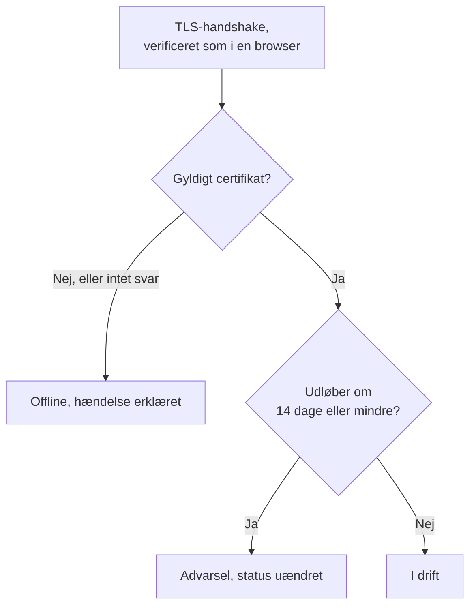

# SSL-certifikat-monitor

En SSL-certifikat-monitor kontrollerer de TLS-certifikater, som dine websteder og tjenester præsenterer, på samme måde som en browser, og advarer dig, før de udløber. Den tager også monitoren offline, når et certifikat ikke længere er gyldigt: udløbet, selvsigneret, udstedt til et andet værtsnavn eller fra en udsteder, som browsere ikke stoler på.

:::cards
- [Opret monitoren](#opret-en-ssl-certifikat-monitor): Seks trin i dashboardet.
- [Standardkriterier](#standardkriterier): En udløbsadvarsel 14 dage i forvejen, uden opsætning.
- [Overvågningskriterier](#overvågningskriterier): Gyldighed, udløb og selvsignerede certifikater.
- [Fejlfinding](#fejlfinding): Selvsignerede og interne certifikater.
:::

## Sådan virker det

Ved hver kontrol åbner en sonde en TLS-forbindelse til værten og porten i URL'en, port `443`, medmindre URL'en angiver en anden, og verificerer certifikatet, som en browser ville: en udsteder, der er tillid til, et værtsnavn, der passer, og en gyldighedsperiode, der omfatter i dag. Hvis certifikatet ikke består verifikationen, læser sonden det alligevel, så dets udløbsdato, udsteder og fingeraftryk registreres under alle omstændigheder. En forbindelse, der fejler, får timeout eller præsenterer et ugyldigt certifikat, forsøges igen, op til det antal genforsøg, du tillader. Derefter kører OneUptime resultatet gennem monitorens kriterier.

En sonde, der har mistet sin egen netværksforbindelse, rapporterer intet resultat og kan derfor ikke markere dit certifikat som ugyldigt.

## Før du starter

- **En rolle, der kan oprette monitorer**: Project Owner, Project Admin, Project Member, Monitor Admin eller Monitor Member eller en brugerdefineret rolle med tilladelsen Create Monitor.
- **En sonde, der kan nå værten og porten.** Dit projekts standardsonder vælges for hver ny monitor. En tjeneste på et privat netværk kræver en [brugerdefineret sonde](/docs/probe/custom-probe) i det netværk.

## Opret en SSL-certifikat-monitor

:::steps
### Start en ny monitor

Gå til **Monitorer**, og klik på **Opret monitor**. Vælg **SSL Certificate** under **Monitortype**.

### Navngiv den

Indtast et **Navn**, for eksempel `example.com certificate`, og klik derefter på **Næste**.

### Angiv URL'en

Indtast det websted, hvis certifikat skal kontrolleres, i **Websteds-URL**, for eksempel `https://example.com`. For en tjeneste på en anden port skal du tage porten med: `https://example.com:8443`.

### Test den

Klik på **Test monitor**, vælg en sonde under **Vælg sonde**, og klik på **Kør test**. **Overvågningstestresultat** viser det certifikat, sonden fik, med dets udsteder og udløbsdato.

### Gennemgå kriterierne

**Monitorkriterier** starter med [standardkriterierne](#standardkriterier): offline, når certifikatet ikke er gyldigt, en advarsel, når det udløber om 14 dage eller mindre. Ret dem efter behov, og klik derefter på **Næste**.

### Vælg sonder, og opret

Behold eller skift **Sonder** og **Overvågningsinterval** (det starter på **Hvert 5. minut**; SSL-certifikat-monitorer tilbydes 5 minutter eller længere), og klik derefter på **Opret monitor**. Monitorens side åbnes.
:::

## Konfigurationsmuligheder

| Felt | Standard | Hvad du skal angive |
| --- | --- | --- |
| **Websteds-URL** | Ingen | Det websted, hvis certifikat kontrolleres, for eksempel `https://example.com` eller `https://example.com:8443`. Kun værten og porten bruges; stien ignoreres. |
| **Anmodningstimeout (sekunder)** (under **Flere felter**) | `60` | Hvor længe der ventes på TLS-handshaket ved hvert forsøg. Maksimum er 60 sekunder. |
| **Genforsøg ved fejl** (under **Flere felter**) | Sondens standard, normalt `3` | Hvor mange gange et mislykket forsøg gentages. Maksimum er 3. |

**Genforsøg ved fejl** tæller genforsøg _efter_ det første forsøg, så `0` kører kontrollen én gang, og `2` kører den op til tre gange. Står feltet tomt, bruges sondens standard: 3, medmindre sondens `PROBE_MONITOR_RETRY_LIMIT` siger noget andet. Forbindelsesfejl, mislykkede certifikatverifikationer og timeouts gentages alle, med en pause på et sekund mellem forsøgene.

## Overvågningskriterier

Kriterier afgør, hvornår certifikatet tæller som i orden, forringet eller fejlbehæftet, og om det erklærer en hændelse eller opretter en advarsel. Hvert kriterium kontrollerer et eller flere filtre:

| Filter | Betingelser | Hvad det kontrollerer |
| --- | --- | --- |
| **Is Valid Certificate** | **Sand**, **Falsk** | Certifikatet består en browsers kontroller: en udsteder, der er tillid til, et værtsnavn, der passer, og en gyldighedsperiode, der omfatter i dag. **Falsk**, når endpointet ikke svarede. |
| **Is Not A Valid Certificate** | **Sand**, **Falsk** | Det modsatte af **Is Valid Certificate**: **Sand**, når certifikatet ikke består de kontroller eller ikke kunne kontrolleres. |
| **Is Expired Certificate** | **Sand**, **Falsk** | Certifikatets udløbsdato er passeret. |
| **Is Self Signed Certificate** | **Sand**, **Falsk** | Certifikatet, eller et i dets kæde, er selvsigneret. |
| **Expires In Days** | **Greater Than**, **Less Than**, **Greater Than Or Equal To**, **Less Than Or Equal To** | Dage, indtil certifikatet udløber. |
| **Expires In Hours** | **Greater Than**, **Less Than**, **Greater Than Or Equal To**, **Less Than Or Equal To** | Timer, indtil certifikatet udløber. |

**Expires In Days** tæller hele dage: et certifikat, der udløber om 14 dage og 20 timer, har 14 dage tilbage. **Expires In Hours** tæller hele timer på samme måde.

Med to eller flere filtre afgør **Matchbetingelse**, om **Alle** skal matche, eller om **Enhver** af dem er nok. Et kriteriums **Handlinger** afgør, hvad det gør: ændrer monitorens status, opretter en advarsel, erklærer en hændelse eller flere af disse.

### Standardkriterier

En ny SSL-certifikat-monitor starter med tre kriterier, så den advarer dig, før et certifikat udløber, uden nogen opsætning:

1. **Certifikatet er ikke gyldigt** — certifikatet er udløbet, selvsigneret, udstedt til et andet værtsnavn eller af en udsteder, der ikke er tillid til, eller kunne ikke kontrolleres, fordi endpointet ikke svarede. Monitoren markeres som **Offline**, og der oprettes en hændelse med navnet "_monitor name_ certificate is not valid". Dens grundårsag fortæller, hvilket af disse tilfælde det var. Hændelsen løser sig selv, så snart certifikatet er gyldigt igen.
2. **Certifikatet udløber snart** — certifikatet er gyldigt, men udløber om 14 dage eller mindre. Der oprettes en **advarsel** med navnet "_monitor name_ certificate expires soon".
3. **Certifikatet er gyldigt** — monitoren markeres som **I drift**.

Advarslen "udløber snart" er en advarsel, ikke en hændelse: den vises ikke på dine statussider, den tilkalder ingen, medmindre du føjer en vagtpolitik til den, og den ændrer ikke monitorens status. Den bruger dit projekts anden advarselsalvorlighed, **Low** i et nyt projekt. Når det fornyede certifikat bliver opfanget, er monitoren tilbage på "Certifikatet er gyldigt", og advarslen løser sig selv.

Kriterier kontrolleres fra top til bund, og det første, der matcher, afgør, hvad der sker. Derfor står "udløber snart" over "er gyldigt": et certifikat, der er ved at udløbe, er stadig gyldigt, så det ville matche begge.

For at blive advaret tidligere skal du ændre værdien af filteret **Expires In Days** i kriteriet "udløber snart", for eksempel til `30`. For at få nogen tilkaldt i stedet skal du åbne kriteriets **Handlinger**: slå **Når filtre matcher, erklæres en hændelse.** til, eller behold advarslen, og føj en vagtpolitik til den under **Vagtpolitikker**.

:::details Føj advarslen til en monitor, der blev oprettet, før den fandtes
Monitorer, der blev oprettet, før OneUptime indførte denne advarsel, har intet kriterium "udløber snart". Sådan tilføjer du det:

1. Åbn **Konfiguration → Kriterier** på monitoren, og klik på **Rediger Overvågningskriterier**.
2. Klik på **Tilføj kriterier**. Sæt dets filter til **Is Valid Certificate** / **Sand**, klik på **Tilføj filter**, og sæt det andet til **Expires In Days** / **Less Than Or Equal To** / `14`. Lad **Matchbetingelse** stå på **Alle** (den vises under filtrene, så snart der er to).
3. Slå **Når filtre matcher, oprettes en advarsel.** til under **Handlinger**, og lad **Når filtre matcher, ændres overvågningsstatus.** være slået fra, så det opretter en advarsel og ikke ændrer monitorens status.
4. Træk det nye kriterium op over det kriterium, der markerer monitoren som online, og gem derefter.
:::

### Eksempelkriterier

| Mål | Filter | Betingelse | Værdi |
| --- | --- | --- | --- |
| Advar en måned i forvejen | **Expires In Days** | **Less Than Or Equal To** | `30` |
| Tilkald nogen på den sidste dag | **Expires In Hours** | **Less Than** | `24` |
| Først offline, når certifikatet er udløbet | **Is Expired Certificate** | **Sand** | — |
| Markér et selvsigneret certifikat | **Is Self Signed Certificate** | **Sand** | — |

Et kriterium om udløb skal stå over det kriterium, der markerer certifikatet som gyldigt: et certifikat, der snart udløber, er stadig gyldigt, og det første kriterium, der matcher, vinder.

## Bedste praksis

1. **Giv dig selv tid til at forny** — Standardadvarslen kommer 14 dage før udløb, hvilket passer til certifikater, der fornyer sig selv. Hvis fornyelsen tager længere tid hos dig (et certifikat, du køber, eller en ændringsproces), så hæv den til 30 dage.
2. **Overvåg hvert endpoint** — Hvis du har flere domæner eller underdomæner, så opret en monitor for hvert af dem. Hvert af dem kan have sit eget certifikat.
3. **Tag andre porte med** — Tjenester, der leverer TLS på en anden port end `443`, for eksempel `8443`, har også certifikater. Angiv porten i URL'en.
4. **Kontrollér efter fornyelse** — Når du har fornyet et certifikat, så kontrollér monitorens næste resultat: den udløbsdato, den viser, skal være den nye.

## Fejlfinding

:::details Certifikatet er i orden i min browser, men monitoren siger, at det ikke er gyldigt
Hændelsens grundårsag fortæller hvorfor. En almindelig årsag er en server, der sender sit certifikat uden mellemcertifikaterne: browsere udfylder ofte hullet selv, det gør sonden ikke. Konfigurer serveren til at sende hele kæden. En anden er en URL, hvis værtsnavn ikke står på certifikatet.
:::

:::details Jeg overvåger en intern tjeneste med et selvsigneret certifikat
Et selvsigneret certifikat er aldrig gyldigt, så standardkriterierne holder monitoren offline. **Is Self Signed Certificate**, **Is Expired Certificate** og **Expires In Days** virker stadig for det, så byg kriterierne på dem. På **Konfiguration → Kriterier**:

1. Klik på **Tilføj filter** i kriteriet "ikke gyldigt", sæt det nye filter til **Is Self Signed Certificate** / **Falsk**, og sæt **Matchbetingelse** til **Alle**. Kriteriet tager stadig monitoren offline, når endpointet ikke svarer, eller certifikatet er forkert på en anden måde.
2. Tilføj et kriterium med **Is Expired Certificate** / **Sand**, der markerer monitoren som **Offline** og erklærer en hændelse, og træk det helt op øverst.
3. Erstat **Is Valid Certificate** / **Sand** med **Is Expired Certificate** / **Falsk** i kriteriet "udløber snart", så advarslen også dækker det selvsignerede certifikat.

Så længe certifikatet er gældende, matcher intet kriterium, og monitoren viser sin standardstatus, **I drift**.
:::

:::details Monitoren er offline med "could not be checked because the endpoint is not reachable"
Sonden kunne ikke åbne en TLS-forbindelse til værten og porten. Kontrollér porten i URL'en, og at en firewall lukker sonderne igennem. En vært på et privat netværk kræver en [brugerdefineret sonde](/docs/probe/custom-probe).
:::

## Næste skridt

:::cards
- [Websted-monitor](/docs/monitor/website-monitor): Kontrollér, at selve webstedet svarer.
- [Domæne-monitor](/docs/monitor/domain-monitor): Bliv advaret, før domænets registrering udløber.
- [Eskaleringsregler](/docs/on-call/escalation-rules): Bestem, hvem der tilkaldes af advarslerne og hændelserne.
- [Hændelser – Oversigt](/docs/incidents/index): Hvad der sker, efter at monitoren har erklæret en.
:::
