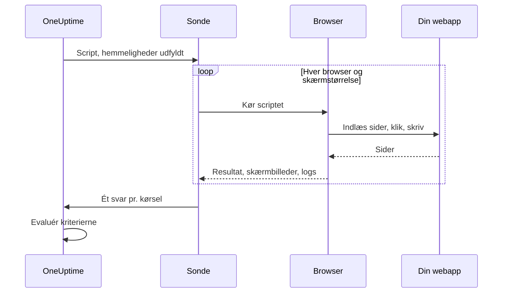

# Syntetisk monitor

En syntetisk monitor styrer din webapp i en rigtig browser efter en tidsplan med et Playwright-script, som du selv skriver: den åbner sider, udfylder formularer og klikker sig gennem en brugerrejse, og den mislykkes, når rejsen gør. Brug den til at fange de fejl, en oppetidskontrol ikke kan se — et login, der ikke længere virker, en betalingsknap, der ikke gør noget, et dashboard, der aldrig bliver færdigt med at indlæse.

:::cards
- [Opret monitoren](#opret-en-syntetisk-monitor): Skriv et script, og vælg browsere og skærmstørrelser.
- [Skriv scriptet](#skriv-scriptet): En kørbar loginrejse at starte fra.
- [Skærmbilleder](#skærmbilleder): Se, hvordan siden så ud, da en kørsel mislykkedes.
- [Hvad scriptet kan bruge](#moduler-der-er-tilgængelige-i-scriptet): Playwright, HTTP, kryptografi og metrikker.
:::

## Sådan fungerer det

Ved hver kontrol kører en sonde dit script én gang for hver browser og skærmstørrelse, du har valgt, den ene efter den anden. Hver kørsel starter en frisk browser uden cookies eller lager fra tidligere kørsler; scriptet styrer sin side, tager skærmbilleder og returnerer et resultat eller kaster en fejl. Sonden rapporterer hver kørsel, og OneUptime evaluerer dine kriterier ud fra dem.



| Skærmtype | Viewport |
| --- | --- |
| Mobile | 360 × 640 |
| Tablet | 1024 × 768 |
| Desktop | 1920 × 1080 |

Browserne er Chromium og Firefox.

## Før du begynder

- En **sonde**, der kan nå din webapp. Brug en [brugerdefineret sonde](/docs/probe/custom-probe) til en app inde i dit netværk. Sondens Docker-image indeholder Chromium og Firefox; en sonde, der kører uden for Docker, skal have dem installeret.
- Alle de adgangskoder og tokens, rejsen har brug for, gemt som [monitorhemmeligheder](/docs/monitor/monitor-secrets).

## Opret en syntetisk monitor

:::steps
### Start en ny monitor

Gå til **Monitorer**, og klik på **Opret monitor**. Under **Monitortype** skal du klikke på **Flere monitortyper** og vælge **Synthetic Monitor** under **Synthetic Monitoring** eller skrive `playwright` i søgefeltet. Angiv et **Navn**, og klik derefter på **Næste**.

### Tilføj scriptet

Skriv dit script i editoren **Playwright Code**. Start fra [eksemplet nedenfor](#skriv-scriptet).

### Vælg browsere og skærmstørrelser

Sæt flueben ved browserne under **Browsertype** og ved størrelserne under **Skærmtype**. Scriptet kører én gang for hver kombination, så to browsere og tre størrelser giver seks kørsler pr. kontrol. Under **Flere felter** gentager **Antal genforsøg ved fejl** en mislykket kørsel op til 5 gange.

### Test det

Klik på **Test monitor** for at køre scriptet én gang fra en sonde, og tjek hver kørsels resultat, logs og skærmbilleder.

### Gennemgå kriterierne

Monitoren starter med to kriterier: den er offline og erklærer en hændelse, når en kørsel mislykkes, og online, når ingen gør. Ret dem, eller tilføj dine egne — se [Kriterier](#kriterier) — og klik derefter på **Næste**.

### Vælg sonder, og opret

Vælg **Sonder** og et **Overvågningsinterval** — syntetiske monitorer tilbydes hvert 5. minut eller sjældnere — og klik derefter på **Opret monitor**.
:::

## Skriv scriptet

Scriptet er kroppen af en `async`-funktion. `page` er en Playwright-kompatibel side, der allerede er åben; styr den, returnér et resultat med `return`, og brug `throw` (eller lad et Playwright-kald få timeout) for at få kørslen til at mislykkes. Dette eksempel logger ind og tjekker, at dashboardet indlæses:

```javascript title="Synthetic monitor script"
await page.goto("https://app.example.com/login");
screenshots["login-page"] = await page.screenshot();

await page.fill("#email", "monitoring@example.com");
await page.fill("#password", "{{monitorSecrets.AppPassword}}");
await page.click("button[type=submit]");

// Fails the run if the dashboard does not appear within 10 seconds.
await page.waitForSelector(".dashboard", { timeout: 10000 });
screenshots["dashboard"] = await page.screenshot();

console.log(`Signed in on ${browserType}, ${screenSizeType}`);

return {
  data: { title: await page.title() },
};
```

| For at | Gør dette | Hvad OneUptime registrerer |
| --- | --- | --- |
| Rapportere et resultat | `return { data: ... }` | Kørslens **Resultat**. Kun `data` gemmes. |
| Få kørslen til at mislykkes | `throw new Error("...")`, eller lad en ventetid løbe ud | Kørslens **Scriptfejl**. |
| Gemme bevis | `screenshots["name"] = await page.screenshot()` | Et skærmbillede, der gemmes, selv når kørslen mislykkes. |
| Efterlade et spor | `console.log(...)` | Kørslens logmeddelelser. |

For at se kørslerne skal du åbne monitorens **Oversigt**: kortet **Monitor-resumé** har én blok pr. browser og skærmstørrelse, og **Vis flere detaljer** viser hver kørsels skærmbilleder.

### Brug af Playwright

Vi bruger Playwright til at simulere brugerinteraktioner. Værdien `page` er en sikker, Playwright-kompatibel facade for den side, der er oprettet til denne kørsel. Almindelige metoder på `Page`, `Locator`, `Frame`, `ElementHandle`, `JSHandle`, `Request`, `Response`, tastatur, mus og browserkontekst er tilgængelige. Det omfatter navigation, locators, klik, formularinput, evaluering på siden, popups, ekstra sider, inspektion af svar og skærmbilleder. Du kan nå kørslens browserkontekst via `page.context()`, for eksempel for at åbne en ny side eller håndtere en popup.

Syntetiske scripts kører ikke i sondens Node.js-proces. Værdier krydser runtime-grænsen som kopierede data eller uigennemsigtige kapabiliteter, der er bundet til kørslen, så nogle Playwright-API'er virker anderledes eller slet ikke:

| Ikke tilgængeligt | Brug i stedet |
| --- | --- |
| Metoder til at starte eller forbinde browsere, CDP-sessioner, routing af anmodninger, eksponerede bindings, Playwrights private felter og enhver indstilling, der læser eller skriver en sti i værtens filsystem. `page.context().browser()` er derfor ikke tilgængelig. | Den side og browserkontekst, du får. |
| Event listeners (`page.on(...)`, `page.once(...)`) — kald til dem mislykkes med en tydelig fejl. | `page.waitForEvent(...)` til dialoger og popups, eller ventetider på svar og anmodninger med strenge eller regulære udtryk som matchere. |
| Funktionsprædikater til ventemetoder for events, anmodninger, svar og URL'er. | Strenge eller regulære udtryk som matchere, locators eller eksplicit polling. |
| De synkrone frame-accessorer (`page.frames()`, `page.mainFrame()`, `page.frame(...)`). | `page.frameLocator(...)` til iframes. |
| `page.request.*` | Det globale `axios` til HTTP-anmodninger. |
| Skærmbilleder af hele siden og PDF-output. | Skærmbilleder af viewporten, som bevarer den håndtering af fejlbeviser, der er beskrevet nedenfor. |

`page.waitForNavigation(...)`, `page.setDefaultTimeout(...)` og `page.setDefaultNavigationTimeout(...)` understøttes. `page.waitForEvent(...)` venter på `dialog`, `domcontentloaded`, `load`, `popup`, `request`, `requestfailed`, `requestfinished` og `response`. Evalueringsfunktioner, der gives til metoder som `page.evaluate()`, udføres i den overvågede browserside, aldrig i sondens proces. Hver kørsel kan bruge op til otte sider.

Browsertilladelser er begrænset til geolokation og notifikationer. Udklipsholder, kamera, mikrofon, MIDI, lokale skrifttyper og andre tilladelser til værtens enheder er ikke tilgængelige for monitorscripts.

### Hvad scriptet returnerer

Data, der returneres fra scriptet, serialiseres til JSON, før de gemmes: i almindelige objekter og arrays bliver `NaN` og `Infinity` til `null`, egenskaber med `undefined` og funktioner droppes, og `Date`-objekter bliver til ISO-strenge — på samme måde som `JSON.stringify` håndterer dem. Instanser af klasser og andre objekter, der ikke er almindelige, droppes helt. En `BigInt` bliver til en streng. Et resultat, der er cirkulært, indlejret mere end 30 niveauer dybt eller større end 5 MB, får i stedet kørslen til at mislykkes.

### Advarsler på de returnerede data

Det, scriptet returnerer som `data`, er monitorens **Result Value**, som et kriterium kan sammenligne. Når `data` er et objekt eller et array, skal du udfylde **Feltsti (valgfri)** på Result Value-filteret for at sammenligne ét felt — for eksempel `status`, `timings.loadTime` eller `errors[0].message`. Filteret tjekkes mod dataene fra hver browser og skærmstørrelse, monitoren kører på, og matcher, når en af dem gør. Se [Advarsler på de returnerede data](/docs/monitor/custom-code-monitor#advarsler-på-de-returnerede-data) for, hvordan stier og betingelser virker.

## Skærmbilleder

Et foruddeklareret objekt `screenshots` er tilgængeligt i scriptets kontekst. Tildel skærmbilleder til det når som helst i scriptet — disse skærmbilleder gemmes, **selv hvis scriptet kaster en fejl** (også ved fejlede assertions, timeouts eller uventede fejl), så du kan se præcis, hvordan siden så ud, da kørslen mislykkedes. De gemte skærmbilleder vises i OneUptime-dashboardet for netop den kørsel af monitoren.

```javascript
// Capture screenshots via the `screenshots` side-channel — they are preserved on both success and failure.

await page.goto("https://app.example.com/login");
screenshots["login-page"] = await page.screenshot();

await page.fill("#email", "user@example.com");
await page.fill("#password", "wrong");
await page.click("button[type=submit]");

// If the next assertion throws, the `login-page` screenshot above is still captured.
await page.waitForSelector(".dashboard", { timeout: 5000 });

screenshots["dashboard"] = await page.screenshot();

return {
  data: "Login succeeded",
};
```

En kørsel gemmer op til 20 skærmbilleder, hvert på op til 10 MB og 50 MB i alt. Et skærmbillede kan også vises i den hændelse eller advarsel, en mislykket kørsel åbner — på dens side og i e-mailene om den — ved at placere det i monitorens hændelses- eller advarselsbeskrivelse. Se [Vis et skærmbillede](/docs/monitor/incident-alert-templating#syntetiske-monitorer).

:::details Returnering af skærmbilleder (legacy)
Af hensyn til bagudkompatibilitet kan du også returnere skærmbilleder fra scriptet som en del af returværdien. Skærmbilleder, der returneres på denne måde, gemmes **kun**, når scriptet afsluttes normalt — de går tabt, hvis scriptet kaster en fejl. Foretræk sidekanalmønstret ovenfor, når du vil have bevis på fejl.

```javascript
// Legacy pattern — screenshots only captured on successful return.
const screenshots = {};
screenshots["screenshot-name"] = await page.screenshot();

return {
  data: "Hello World",
  screenshots: screenshots,
};
```
:::

## Brug af monitorhemmeligheder

Henvis til en hemmelighed som `{{monitorSecrets.NAME}}` hvor som helst i scriptet. OneUptime erstatter henvisningen med hemmelighedens værdi, som ren tekst, før scriptet når sonden. Sæt derfor en hemmelighed i anførselstegn for at bruge den som en streng, og lad den stå uden anførselstegn for at bruge den som et tal eller en boolesk værdi:

```javascript
// Used as a string: wrap it in quotes.
const password = "{{monitorSecrets.AppPassword}}";

// Used as a number or a boolean: leave it bare.
const retryLimit = {{monitorSecrets.RetryLimit}};
const verbose = {{monitorSecrets.Verbose}};
```

Se [Monitorhemmeligheder](/docs/monitor/monitor-secrets) for at oprette en hemmelighed og vælge, hvilke monitorer der må bruge den.

## Brugerdefinerede metrikker

Du kan indsamle brugerdefinerede metrikker fra dit script med funktionen `oneuptime.captureMetric()`. Disse metrikker gemmes i OneUptime og kan vises i grafer på dashboards med Metric Explorer.

```javascript
oneuptime.captureMetric(name, value, attributes);
```

| Parameter | Type | Beskrivelse |
| --- | --- | --- |
| `name` | string, påkrævet | Metrikkens navn (f.eks. `"dashboard.load.time"`). Det gemmes automatisk med præfikset `custom.monitor.`. |
| `value` | number, påkrævet | Metrikkens numeriske værdi. |
| `attributes` | object, valgfri | Nøgle-værdi-par med ekstra kontekst. |

### Eksempel

```javascript
await page.goto("https://app.example.com");

const startTime = Date.now();
await page.waitForSelector("#dashboard-loaded");
const loadTime = Date.now() - startTime;

// Capture page load time, tagged with this run's browser and screen size
oneuptime.captureMetric("dashboard.load.time", loadTime, {
  page: "dashboard",
  browser: browserType,
  screen: screenSizeType,
});

screenshots["dashboard"] = await page.screenshot();

return {
  data: { loadTime },
};
```

Når de er indsamlet, vises disse metrikker i Metric Explorer under navne som `custom.monitor.dashboard.load.time` og på monitorens side **Metrikker** under **Brugerdefinerede metrikker**. OneUptime føjer monitoren og sonden til hvert datapunkt; for at filtrere efter browser eller skærmstørrelse skal du give dem med som attributter, som eksemplet gør.

En kørsel kan indsamle højst 100 metrikker, kun med numeriske værdier, og OneUptime gemmer højst 100 pr. kontrol på tværs af alle dens kørsler. Som for en monitor med brugerdefineret kode er nogle attributnavne [reserverede](/docs/monitor/custom-code-monitor#reserverede-attributnøgler) og droppes, hvis et script sætter dem.

## Kriterier

| Filtertype | Hvad den tjekker |
| --- | --- |
| **Fejl** | Den fejl, en kørsel kastede, hvis nogen. |
| **Result Value** | De `data`, en kørsel returnerede. |
| **Udførelsestid (i ms)** | Hvor længe en kørsel tog. |
| **Browsertype** | Den browser, en kørsel brugte: **Equal To** eller **Not Equal To**. |
| **Screen Size** | Den skærmstørrelse, en kørsel brugte: **Equal To** eller **Not Equal To**. |

Hvert filter tjekkes mod hver kørsel og matcher, når blot én kørsel matcher det. Filtrene tjekkes hver for sig, ikke kørsel for kørsel: **Fejl** Is Not Empty sammen med **Browsertype** Equal To `Firefox` matcher, når en kørsel mislykkedes, og en af kørslerne brugte Firefox — ikke kun når Firefox-kørslen mislykkedes. Vil du holde øje med én browser for sig, så giv den sin egen monitor.

I hændelses- og advarselsskabeloner findes hver kørsel i `{{syntheticResponses}}`: se [Hændelse- og advarselsskabeloner](/docs/monitor/incident-alert-templating#syntetiske-monitorer).

## Moduler, der er tilgængelige i scriptet

| Navn | Hvad det er |
| --- | --- |
| `page` | En sikker Playwright-kompatibel facade til at interagere med browseren. Du kan nå kørslens browserkontekst via `page.context()` for at oprette sider eller håndtere popups, men start/forbindelse af browsere, CDP, routing, bindings, private felter og indstillinger med stier på værten er ikke tilgængelige. |
| `screenshots` | Et foruddeklareret objekt, som du tildeler skærmbilleder til (f.eks. `screenshots['login-page'] = await page.screenshot()`). Skærmbilleder, der tildeles her, gemmes, selv hvis scriptet senere kaster en fejl. |
| `browserType` | Den browser, denne kørsel bruger: `Chromium` eller `Firefox`. |
| `screenSizeType` | Den skærmstørrelse, denne kørsel bruger: `Mobile`, `Tablet` eller `Desktop`. |
| `axios` | En promise-baseret HTTP-klient, der understøtter Axios som funktion plus `request`, `get`, `head`, `options`, `post`, `put`, `patch`, `delete` og `create`. En anmodningskrop kan være op til 1 MB og et svar op til 5 MB; den følger op til 5 omdirigeringer og får timeout efter højst 30 sekunder. Brugerdefinerede transporter, adaptere, sockets, agenter og tilsidesættelser af proxy er ikke tilgængelige. |
| `crypto` | En implementering i en browser-worker af SHA-256-hashes, HMAC-SHA-256, `randomBytes`, `randomInt` og `randomUUID`. |
| `console` | `console.log`, `info`, `warn` og `error`. Meddelelserne gemmes med hver kørsel. |
| `oneuptime.captureMetric` | Indsamler en brugerdefineret metrik. Se [Brugerdefinerede metrikker](#brugerdefinerede-metrikker). |
| `http` | En bufferet kompatibilitetsfacade kun til klienter, der understøtter `request`, `get` og `Agent`. |
| `https` | HTTPS-modstykket til facaden `http`, der kun er til klienter. |
| `Buffer`, `setTimeout`, `setInterval` | Og deres `clear`-funktioner. |

Scriptet kører i en browser-worker, ikke i Node.js, og kan ikke åbne sine egne netværksforbindelser: `fetch`, `XMLHttpRequest` og `WebSocket` er blokeret. Brug `axios` til HTTP-anmodninger.

## Grænser

| Grænse | Standard | Sondeindstilling |
| --- | --- | --- |
| Timeout for scriptet | 60 sekunder. Workers, der får timeout, og alle browserens underprocesser afsluttes. | `PROBE_SYNTHETIC_MONITOR_SCRIPT_TIMEOUT_IN_MS` |
| Hukommelse til en kørsels samlede procestræ | 1,5 GiB | `PROBE_SYNTHETIC_MONITOR_MAX_PROCESS_TREE_RSS_BYTES` |
| Skrivbart browserlager | 256 MiB | `PROBE_SYNTHETIC_MONITOR_MAX_DISK_BYTES` |
| Samtidige kørsler på én sonde | 4 | `PROBE_SYNTHETIC_MONITOR_MAX_CONCURRENCY` |
| Sider pr. kørsel | 8 | — |

Overskrides grænsen for hukommelse eller lager, afsluttes den kørsel, og dens midlertidige profil fjernes. Sondeindstillingerne gælder for selvhostede sonder; Helm-chartet sætter de samme værdier pr. sonde (for eksempel `syntheticMonitorScriptTimeoutInMs`).

Browserne følger med i sondens Docker-image, så en selvhostet sonde får nyere browsere, når du opdaterer dens image.

## Fejlfinding

:::details En kørsel mislykkes, men jeg kan ikke se hvorfor
Tildel skærmbilleder til objektet `screenshots` før hvert risikabelt trin. De gemmes, selv når kørslen mislykkes, og viser, hvordan siden så ud på det tidspunkt.
:::

:::details `page.on(...)` kaster en fejl
Event listeners kan ikke krydse isolationsgrænsen. Brug `page.waitForEvent(...)` til dialoger og popups, eller en ventetid på et svar eller en anmodning med en streng eller et regulært udtryk som matcher.
:::

:::details Kørslen får timeout
Vent på bestemte elementer med `page.waitForSelector(...)` og en `timeout`, der er kortere end scriptets egen grænse, så kørslen mislykkes på det trin, der er langsomt, med en tydelig fejl.
:::

:::details En selvhostet sonde siger, at browserens eksekverbare fil ikke blev fundet
Sonden kører uden for sit Docker-image uden Chromium eller Firefox installeret. Kør sondens image, eller installér browserne på den maskine.
:::

## Næste trin

:::cards
- [Brugerdefineret kode-monitor](/docs/monitor/custom-code-monitor): Tjek API'er med et script uden en browser.
- [Vis et skærmbillede](/docs/monitor/incident-alert-templating#syntetiske-monitorer): Sæt den mislykkede kørsels skærmbillede ind i hændelsen.
- [Monitorhemmeligheder](/docs/monitor/monitor-secrets): Hold legitimationsoplysninger ude af dit script.
:::
