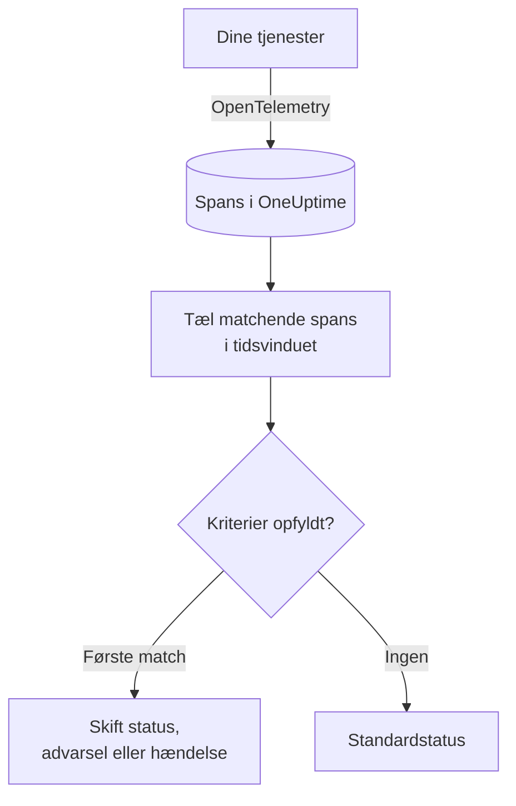

# Trace-monitor

En trace-monitor tæller inden for et tidsvindue de spans, dine tjenester sender til OneUptime, som matcher dine filtre (span-navn, status, tjeneste, attributter). Når antallet opfylder dine kriterier, ændrer den monitorens status, opretter en advarsel eller erklærer en hændelse. Brug den til at få advarsler om mislykkede anmodninger til et endpoint, en stigning i fejl-spans eller en tjeneste, der er holdt op med at sende traces.

:::cards
- [Opret monitoren](#opret-en-trace-monitor): Vælg, hvilke spans der tælles, og hvornår du får en advarsel.
- [Span-statuskoder](#span-statuskoder): Hvad OK, ERROR og UNSET betyder, og hvad du skal filtrere på.
- [Sådan evalueres den](#sådan-evalueres-den): Tidsvinduet, optællingen og cyklussen på ét minut.
- [Kriterier](#kriterier): Tærskler, anomalidetektion og standardværdierne.
:::

## Sådan virker det

Hvert minut tæller OneUptime de spans, der matcher monitorens filtre og startede inden for dens tidsvindue. Det sammenligner antallet med monitorens kriterier fra top til bund, og det første kriterium, der matcher, afgør, hvad der sker. Når intet matcher, går monitoren tilbage til sin standardstatus.

## Før du starter

- Dine tjenester sender traces til OneUptime via OpenTelemetry. Se [OpenTelemetry](/docs/telemetry/open-telemetry).
- Slå det præcise navn på det span, du vil overvåge, op i trace-explorer: span-navne bestemmes af din instrumentering, for eksempel `POST /api/checkout` eller `GET`.

## Opret en trace-monitor

:::steps
### Start en ny monitor

Gå til **Monitorer**, og klik på **Opret monitor**.

### Vælg Traces

Under **Monitortype** klikker du på **Flere monitortyper** og vælger **Spor** under **Telemetri**, eller du skriver `traces` i søgefeltet. Angiv et **Navn**, og klik derefter på **Næste**.

### Vælg de spans, der skal tælles

I **Trace-monitor-konfiguration** angiver du **Span-navn**, **Overvågningsspor i (time)** og **Filtrér efter span-status**. Et filter, du lader stå tomt, matcher alle spans. **Spans-forhåndsvisning** under filtrene viser de spans, de matcher lige nu.

### Indsnævr dem (valgfrit)

Åbn **Flere felter** for at filtrere efter telemetritjeneste, infrastrukturentitet eller attribut.

### Angiv kriterierne

Kortet **Monitorkriterier** starter med to kriterier: offline, med en hændelse, når ingen spans matcher; online, når mindst ét gør. Ret dem til det, du vil have advarsler om (se [Kriterier](#kriterier)).

### Opret monitoren

Klik på **Opret monitor**. Monitoren åbner på sin side **Oversigt**, og dens første evaluering kører inden for et minut.
:::

> [!TIP]
> For at få besked, når en AI-funktion svarer dårligt (mislykkede, afviste, afbrudte, tomme, markerede eller langsomme svar), vælger du i stedet **AI / LLM** under **Telemetri**. Den monitor læser AI-kaldene i dine traces for dig, uden span-filtre, du skal skrive. Se [AI- / LLM-observability](/docs/telemetry/ai-llm-observability#få-besked-når-aien-svarer-dårligt).

## Hvad den forespørger

| Felt | Hvad det matcher | Standard |
| --- | --- | --- |
| **Span-navn** | Spans, hvis navn indeholder denne tekst, uden forskel på store og små bogstaver. | Tom: alle spans |
| **Overvågningsspor i (time)** | Spans, der startede inden for de seneste 5 sekunder op til de seneste 24 timer. | **Seneste 1 minut** |
| **Filtrér efter span-status** | Spans med en af de valgte statusser: **Ikke angivet**, **Ok** eller **Fejl**. | Tom: alle statusser |
| **Filtrér efter telemetritjeneste** (under **Flere felter**) | Spans fra en af de valgte tjenester. | Tom: alle tjenester |
| **Filter by Infrastructure Entity** (under **Flere felter**) | Spans fra en af de valgte værter, pods, containere og andre entiteter. | Tom: alle entiteter |
| **Filtrér efter attributter** (under **Flere felter**) | Spans, hvis attributter opfylder alle betingelser. Hver betingelse har sin egen operator, såsom "er lig med" eller "indeholder". | Tom: ingen betingelse |

Alle de filtre, du angiver, skal matche, før et span tælles.

### Span-statuskoder

- **OK** – Operationen blev eksplicit markeret som vellykket af applikationskode eller en trace-pipeline
- **ERROR** – Operationen stødte på en fejl
- **UNSET** – Der blev ikke angivet nogen fejlstatus. Dette er OpenTelemetrys standardstatus

UNSET betyder ikke, at der mangler data. OpenTelemetry-instrumentering sætter ERROR, når en operation fejler, og lader vellykkede spans stå som UNSET, så på en sund tjeneste er de fleste spans UNSET. OneUptime viser dem med grønt som "Unset (no error)". At registrere en undtagelse ændrer ikke et spans status, så et UNSET-span kan stadig have undtagelser; de vises sammen med spannet. For at advare om fejl skal du filtrere på ERROR. For at tælle alle spans, der ikke fejlede, skal du vælge både OK og UNSET.

Hvis du vil have vellykkede forespørgsler vist som OK, skal du tilføje en trace-pipeline under **Spor > Indstillinger > Pipelines** med filterbetingelsen **Status = Ikke angivet** og en **Status-remapper**, der mapper `http.response.status_code`-værdier såsom `200` til Ok.

## Sådan evalueres den

- **Hvert minut.** En trace-monitor tjekkes ikke af sonder, så den har intet interval at angive og ingen side **Sonder og interval**.
- **Ét tal pr. evaluering.** Monitoren tæller de spans, der matcher alle filtre og startede inden for **Overvågningsspor i (time)** før evalueringen. Med **Seneste 5 minutter** kigger hver evaluering fem minutter tilbage, så vinduerne for på hinanden følgende evalueringer overlapper.
- **Ingen spans er et antal på 0.** En tjeneste, der holder op med at sende traces, giver 0, og det er det, standardkriteriet for offline leder efter.
- **OneUptimes egen nedetid er ikke stilhed.** Så længe tidsvinduet rummer tid, hvor OneUptime selv ikke modtog data (det genstartede, blev opgraderet eller indhentede et efterslæb), venter tjekket: statussen ændres ikke, og ingen hændelse eller advarsel åbnes eller løses. Se [Når OneUptime ikke modtager data](/docs/monitor/when-oneuptime-is-not-receiving).
- **Kriterier fra top til bund.** Det første kriterium, der matcher, afgør det, så sæt det alvorligste øverst.

Hver statusændring registreres med sin årsag på monitorens **Statustidslinje**.

## Kriterier

En trace-monitors kriterier har én **Filtertype**: **Span Count**, antallet af spans, der matchede i vinduet. Vælg en **Filterbetingelse** og, for en tærskelbetingelse, en **Værdi**.

| Filterbetingelse | Matcher, når antallet af spans er… |
| --- | --- |
| **Greater Than** | over værdien |
| **Greater Than Or Equal To** | lig med værdien eller derover |
| **Less Than** | under værdien |
| **Less Than Or Equal To** | lig med værdien eller derunder |
| **Equal To** | præcis værdien |
| **Anomalously High** | over det forventede interval for denne time på ugen |
| **Anomalously Low** | under det interval |
| **Anomalous** | uden for det interval, i begge retninger |

Anomalibetingelserne har ingen **Værdi**. Vælg en **Følsomhed** (Low, Medium, som er standard, eller High) og et **Baseline-vindue** på 14 (standard), 28, 60 eller 90 dage. OneUptime omregner antallet til en rate pr. minut og sammenligner den med samme time på ugen over det vindue. Baselinen dækker kun monitorens tjenester og span-statusser: dens filtre på span-navn og attributter indgår ikke. Indtil den time på ugen har nok historik, er kriteriet stadig ved at lære og udløses ikke.

En ny trace-monitor starter med disse kriterier:

| Kriterium | Filter | Effekt |
| --- | --- | --- |
| Check if … is offline | **Span Count** **Equal To** `0` | Sætter monitoren offline og erklærer en hændelse, der løses automatisk |
| Check if … is online | **Span Count** **Greater Than** `0` | Sætter monitoren online |

## Gennemgået eksempel: mislykkede checkout-anmodninger

På fem minutter registrerer checkout-tjenesten 1.200 spans med navnet `POST /api/checkout`: 1.150 UNSET, 20 OK og 30 ERROR. Den samme monitor tæller meget forskellige tal afhængigt af **Filtrér efter span-status**:

| Filtrér efter span-status | Span Count | Hvad det måler |
| --- | --- | --- |
| **Fejl** | 30 | Anmodninger, der mislykkedes |
| **Ok** | 20 | Kun de anmodninger, din kode markerede som vellykkede |
| **Ikke angivet** og **Ok** | 1.170 | Alle anmodninger, der ikke mislykkedes |
| Tom | 1.200 | Alle anmodninger |

For at blive kaldt ud, når mere end 10 checkout-anmodninger mislykkes på fem minutter:

- **Span-navn**: `POST /api/checkout`
- **Overvågningsspor i (time)**: **Seneste 5 minutter**
- **Filtrér efter span-status**: **Fejl**
- Kriterium 1: **Span Count** **Greater Than** `10`: sæt monitoren offline, og erklær en hændelse
- Kriterium 2: **Span Count** **Less Than Or Equal To** `10`: sæt monitoren online

Med 30 mislykkede anmodninger matcher kriterium 1, og hændelsen erklæres. Når der er gået fem minutter med 10 eller færre fejl, matcher kriterium 2, monitoren er online igen, og hændelsen løser sig selv.

## Fejlfinding

:::details Monitoren tæller ingen spans for mit endpoint
**Span-navn** sammenlignes med spannets navn, og instrumentering navngiver ofte server-spans efter ruten (`POST /api/checkout`) eller kun efter metoden (`GET`). Find det præcise navn i trace-explorer. Åbn derefter monitorens side **Kriterier** (under **Konfiguration**), og klik på **Edit Monitoring Criteria**: **Spans-forhåndsvisning** viser, hvad filtrene matcher lige nu.
:::

:::details Vellykkede anmodninger tælles ikke, når jeg filtrerer på Ok
De fleste instrumenteringer lader vellykkede spans stå som UNSET, ikke OK (se [Span-statuskoder](#span-statuskoder)). Vælg både **Ikke angivet** og **Ok**, eller tilføj den trace-pipeline, der er beskrevet der.
:::

:::details Et span har en undtagelse, men tælles ikke som fejl
At registrere en undtagelse ændrer ikke et spans status. Filtrér på **Fejl**, eller brug en [undtagelse-monitor](/docs/monitor/exceptions-monitor) til at få advarsler om selve undtagelserne.
:::

:::details Et anomalikriterium udløses aldrig
Det er stadig ved at lære: den time på ugen, det sammenligner med, har endnu ikke nok historik inden for **Baseline-vindue**.
:::

## Næste skridt

:::cards
- [Undtagelse-monitor](/docs/monitor/exceptions-monitor): Få advarsler om de undtagelser, dine tjenester registrerer.
- [Log-monitor](/docs/monitor/logs-monitor): Få advarsler om logmængde og -indhold.
- [Søgesyntaks](/docs/telemetry/search-syntax): Find span-navne og -statusser i trace-explorer.
- [Hændelse- og advarselsskabeloner](/docs/monitor/incident-alert-templating): Skriv nyttige titler og beskrivelser til advarsler.
:::
